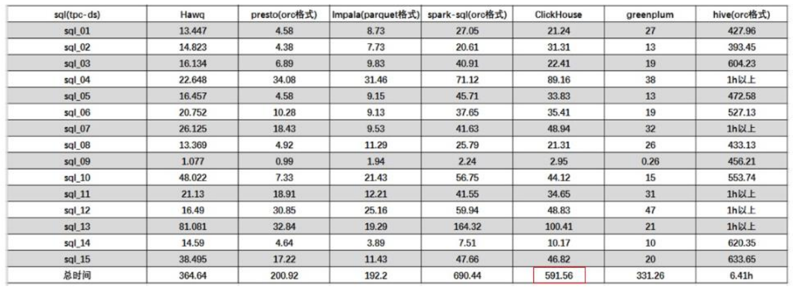
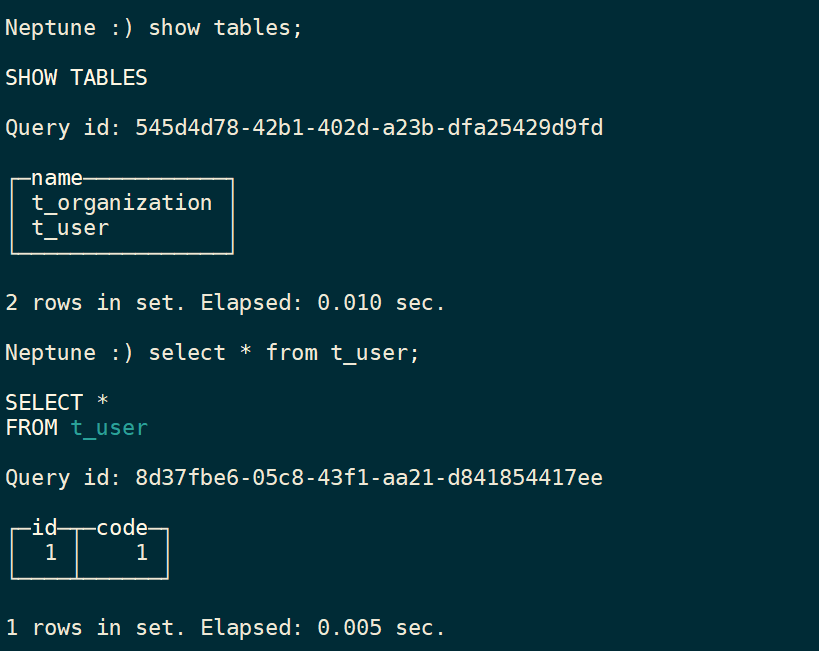

# ClickHouse入门
# 1 **ClickHouse** 简介

ClickHouse 是俄罗斯的 Yandex 于 2016 年开源的列式存储数据库（DBMS），使用 C++语言编写，主要用于在线分析处理查询（OLAP），能够使用 SQL 查询实时生成分析数据报告。

## **1.1 ClickHouse** 的特点

### **1.1.1** **列式存储**

以下表为例

| Id   | Name | Age  |
| ---- | ---- | ---- |
| 1    | 张三 | 18   |
| 2    | 李四 | 22   |
| 3    | 王五 | 34   |

* **采用行式存储时，数据在磁盘上的组织结构为：**


* **采用列式存储时，数据在磁盘上的组织结构为：**


* **列式储存的好处：**
  * 对于列的聚合，计数，求和等统计操作远优于行式存储。
  * 由于某一列的数据类型都是相同的，针对于数据存储更容易进行数据压缩，每一列选择更优的数据压缩算法，大大提高了数据的压缩比重。
  * 由于数据压缩比更好，一方面节省了磁盘空间，另一方面对于 cache 也有了更大的发挥空间。

### **1.1.2 DBMS** **的功能**

几乎覆盖了标准 SQL 的大部分语法，包括 DDL 和 DML，以及配套的各种函数，用户管理及权限管理，数据的备份与恢复。

### **1.1.3** **多样化引擎**

ClickHouse 和 MySQL 类似，把表级的存储引擎插件化，根据表的不同需求可以设定不同的存储引擎。目前包括合并树、日志、接口和其他四大类 20 多种引擎。

### **1.1.4** **高吞吐写入能力**

* ClickHouse 采用类 ==LSM Tree==的结构，数据写入后定期在后台 Compaction（压缩）。
* 通过类 LSM tree的结构，ClickHouse 在数据导入时全部是顺序 append 写，写入后数据段不可更改，在后台compaction 时也是多个段 merge sort 后顺序写回磁盘。顺序写的特性，充分利用了磁盘的吞吐能力，即便在 HDD 上也有着优异的写入性能。

* 官方公开 benchmark 测试显示能够达到 50MB-200MB/s 的写入吞吐能力，按照每行100Byte 估算，大约相当于 50W-200W 条/s 的写入速度。

### **1.1.5** **数据分区与线程级并行**

* ClickHouse 将数据划分为多个 partition，每个 partition 再进一步划分为多个 index granularity(索引粒度)，然后通过多个 CPU核心分别处理其中的一部分来实现并行数据处理。在这种设计下，单条 Query 就能利用整机所有 CPU。极致的并行处理能力，极大的降低了查询延时。
* ClickHouse 即使对于大量数据的查询也能够化整为零平行处理。弊端是对于单条查询使用多 cpu，不利于同时并发多条查询。所以对于高 qps 的查询业务，ClickHouse 并不是强项。

### **1.1.6** **性能对比**

* **单表查询**


* **关联查询**



* **结论:** 

ClickHouse 像很多 OLAP 数据库一样，单表查询速度优于关联查询，而且 ClickHouse的两者差距更为明显。

# 2 **ClickHouse** **的安装**

## **2.1** **准备工作**

### **2.1.1** **确定防火墙处于关闭状态**

```perl
#查看防火状态
systemctl status firewalld
service  iptables status

#暂时关闭防火墙
systemctl stop firewalld
service  iptables stop

#永久关闭防火墙
systemctl disable firewalld
chkconfig iptables off

#重启防火墙
systemctl enable firewalld
service iptables restart  

#永久关闭后重启
chkconfig iptables on　
```

### **2.1.2 CentOS** **取消打开文件数限制**

* 在 hadoop102 的 /etc/security/limits.conf 文件的末尾加入以下内容

```perl
sudo vim /etc/security/limits.conf
* soft nofile 65536
* hard nofile 65536
* soft nproc 131072
* hard nproc 131072
```

* 在 hadoop102 的/etc/security/limits.d/20-nproc.conf 文件的末尾加入以下内容

```perl
sudo vim /etc/security/limits.d/20-nproc.conf 
* soft nofile 65536
* hard nofile 65536
* soft nproc 131072
* hard nproc 131072
```

* 执行同步操作

```perl
sudo /home/atguigu/bin/xsync /etc/security/limits.conf
sudo /home/atguigu/bin/xsync /etc/security/limits.d/20-nproc.conf
```

### **2.1.3** **安装依赖**

在hadoop102、hadoop103、hadoop104上执行

```perl
sudo yum install -y libtool 
sudo yum install -y *unixODBC*
```

### **2.1.4 CentOS** **取消** **SELINUX**

* 在hadoop102修改/etc/selinux/config 中的 SELINUX=disabled

```perl
sudo vim /etc/selinux/config
SELINUX=disabled
```

* 执行同步操作

```perl
sudo /home/atguigu/bin/xsync /etc/selinux/config
```

* ==重启三台服务器==

```perl
sudo reboot
```

## **2.2** **单机安装**

官网：https://clickhouse.tech/

下载地址：http://repo.red-soft.biz/repos/clickhouse/stable/el7/

* 在/opt/software 下创建 clickhouse 目录

```perl
 mkdir /opt/software/clickhouse
```

*  将4个rpm 安装包上传到/opt/oftware/clickhouse 目录下


* 同步安装包

```perl
xsync /opt/software/clickhouse
```

* 在三台服务器上安装

```perl
sudo rpm -ivh /opt/software/clickhouse/*.rpm

#设置密码时直接按回车可无密码登录
默认用户default
```

* 查看安装情况

```perl
sudo rpm -qa|grep clickhouse
```

* 卸载

```perl
#重复执行
sudo rpm -qa|grep clickhouse|xargs -i sudo rpm -e {}

sudo rm -rf /var/lib/clickhouse
sudo rm -rf /etc/clickhouse-*
sudo rm -rf /var/log/clickhouse-server
sudo userdel clickhouse
sudo userdel clickhouse-bridge
```

* 在hadoop102上修改配置文件

```perl
 sudo vim /etc/clickhouse-server/config.xml
 
 把 <listen_host>::</listen_host> 的注释打开，这样的话才能让 ClickHouse 被除本机以外的服务器访问
 
在这个文件中，有 ClickHouse 的一些默认路径配置，比较重要的
数据文件路径：<path>/var/lib/clickhouse/</path>
日志文件路径：<log>/var/log/clickhouse-server/clickhouse-server.log</log>
```

* 分发配置文件

```perl
sudo /home/atguigu/bin/xsync /etc/clickhouse-server/config.xml
```

* 启动server

```perl
 sudo systemctl start clickhouse-server
```

* 三台机器上关闭开机自启

```perl
sudo systemctl disable clickhouse-server
```

* 使用 client 连接 server

`-m` :可以在命令窗口输入多行命令

```perl
  clickhouse-client -m
  
  Ctrl +d 退出
```

# 3 数据类型

## **3.1** **整型**

固定长度的整型，包括有符号整型或无符号整型。

整型范围（-2^n-1^~2^n-1^-1）：

Int8 - [-128 : 127]

Int16 - [-32768 : 32767]

Int32 - [-2147483648 : 2147483647]

Int64 - [-9223372036854775808 : 9223372036854775807]

无符号整型范围（0~2^n^-1）：

UInt8 - [0 : 255]

UInt16 - [0 : 65535]

UInt32 - [0 : 4294967295]

UInt64 - [0 : 18446744073709551615]

==使用场景： 个数、数量、也可以存储型id==

## **3.2** **浮点型**

Float32 - float

Float64 – double

建议尽可能以整数形式存储数据。例如，将固定精度的数字转换为整数值，如时间用毫秒为单位表示，因为浮点型进行计算时可能引起四舍五入的误差。

```powershell
Neptune :) select 1.0-0.9;

SELECT 1. - 0.9

Query id: 009367a5-fd6b-4f54-b5b6-20c889e86486

┌──────minus(1., 0.9)─┐
│ 0.09999999999999998 │
└─────────────────────┘

1 rows in set. Elapsed: 0.004 sec.
```

==使用场景：一般数据值比较小，不涉及大量的统计计算，精度要求不高的时候。比如保存商品的重量。==

## **3.3** **布尔型**

没有单独的类型来存储布尔值。可以使用 UInt8 类型，取值限制为 0 或 1。

## **3.4 Decimal** **型**

有符号的浮点数，可在加、减和乘法运算过程中保持精度。对于除法，最低有效数字会被丢弃（不舍入）。

有三种声明：

* Decimal32(s)，相当于 Decimal(9-s,s)，有效位数为 1~9

* Decimal64(s)，相当于 Decimal(18-s,s)，有效位数为 1~18

* Decimal128(s)，相当于 Decimal(38-s,s)，有效位数为 1~38

==s 标识小数位==

==使用场景： 一般金额字段、汇率、利率等字段为了保证小数点精度，都使用 Decimal进行存储。==

## **3.5** **字符串**

* **String**

字符串可以任意长度的。它可以包含任意的字节集，包含空字节。

* **FixedString(N)**

固定长度 N 的字符串，N 必须是严格的正自然数。当服务端读取长度小于 N 的字符串时候，通过在字符串末尾==添加空字节==来达到 N 字节长度。 当服务端读取长度大于 N 的字符串时候，将返回错误消息。

**与 String 相比，极少会使用 FixedString，因为使用起来不是很方便。**

==使用场景：名称、文字描述、字符型编码。 固定长度的可以保存一些定长的内容，比如一些编码，性别等但是考虑到一定的变化风险，带来收益不够明显，所以定长字符串使用意义有限。==

## 3.6 **枚举类型**

包括 Enum8 和 Enum16 类型。Enum 保存 'string'= integer 的对应关系。

Enum8 用 'String'= Int8 对描述。

Enum16 用 'String'= Int16 对描述。

* 创建一个带有一个枚举 Enum8('hello' = 1, 'world' = 2) 类型的列

```sql
CREATE TABLE t_enum(
 x Enum8('hello' = 1, 'world' = 2)
)ENGINE = TinyLog;
```

* 这个 x 列只能存储类型定义中列出的值：'hello'或'world'

```sql
INSERT INTO t_enum VALUES ('hello'), ('world'), ('hello');
```

* 如果尝试保存任何其他值，ClickHouse 抛出异常

```sql
insert into t_enum values('a')
```


* 如果需要看到对应行的数值，则必须将 Enum 值转换为整数类型

```sql
SELECT CAST(x, 'Int8') FROM t_enum;
```


==使用场景：对一些状态、类型的字段算是一种空间优化，也算是一种数据约束。但是实际使用中往往因为一些数据内容的变化增加一定的维护成本，甚至是数据丢失问题。所以谨慎使用。==

## **3.7** **时间类型**

```sql
获取当前时间戳：select toUnixTimestamp(now())
获取指定时间的时间戳：select toUnixTimestamp('2021-05-11 14:37:37')
获取当前日期时间：select now()
获取当前日期：select today()
获取昨日日期：select yesterday()

日期时间转为整形：toYYYYMMDDhhmmss()
将字符串型的日期转为时间类型：parseDateTimeBestEffort()

时间格式化
SELECT 
    now() AS dt,
    toYYYYMMDDhhmmss(dt) AS dt_int,
    toString(dt) AS dt_str,
    parseDateTimeBestEffort(toString(dt_int)) AS datetime

日期时间转日期：select toDate('2021-05-11 14:31:31')
日期转时间戳：select toUnixTimestamp(toDateTime('2021-05-01'))
时间戳转日期时间：select toDateTime(1620714857)

获取指定时间的年份：select toYear(toDateTime('2021-05-11 10:10:10'))
获取当前日期的年份：select toYear(now())
获取指定时间的月份：select toMonth(toDateTime('2021-05-11 10:10:10'))
获取当前日期的月份：select toMonth(now())
获取指定时间的季度：select toQuarter(toDateTime('2021-05-11 10:10:10'))
获取当前年份中的第几天：select toDayOfYear(toDateTime('2021-05-11 10:10:10'))
获取当前月份的第几天：select toDayOfMonth(toDateTime('2021-05-11 10:10:10'))
获取星期几：select toDayOfWeek(toDateTime('2021-05-11 10:10:10'))
获取指定时间的小时：select toHour(toDateTime('2021-05-11 10:10:10'))
获取指定时间的分钟：select toMinute(toDateTime('2021-05-11 10:10:10'))
获取指定时间的秒数：select toSecond(toDateTime('2021-05-11 10:10:10'))

获取当前年份的第一天：select toStartOfYear(toDateTime('2021-05-11 10:10:10'))
获取当前月份的第一天：select toStartOfMonth(toDateTime('2021-05-11 10:10:10'))
获取当前季度的第一天：select toStartOfQuarter(toDateTime('2021-05-11 10:10:10'))
获取当前周的第一天：select toMonday(toDateTime('2021-05-11 10:10:10'))
获取当前时间的起始时间：select toStartOfDay(toDateTime('2021-05-11 10:10:10'))
获取当前时间的起始小时时间：select toStartOfHour(toDateTime('2021-05-11 10:10:10'))
获取当前时间的起始分钟时间：select toStartOfMinute(toDateTime('2021-05-11 10:10:10'))
获取当前时间的起始秒数时间：select toStartOfSecond(toDateTime('2021-05-11 10:10:10'))

时间增加一年：select addYears(toDateTime('2021-05-11 10:10:10'),1)
时间增加一月：select addMonths(toDateTime('2021-05-11 10:10:10'),1)
时间增加一周：select addWeeks(toDateTime('2021-05-11 10:10:10'),1)
时间增加一天：select addDays(toDateTime('2021-05-11 10:10:10'),1)
时间增加一小时：select addHours(toDateTime('2021-05-11 10:10:10'),1)
时间增加一分钟：select addMinutes(toDateTime('2021-05-11 10:10:10'),1)
时间增加一秒钟：select addSeconds(toDateTime('2021-05-11 10:10:10'),1)
时间增加一季度：select addQuarters(toDateTime('2021-05-11 10:10:10'),1)

增加用add,减去用subtract,例如时间减去一年：select subtractYears(toDateTime('2021-05-11 10:10:10'),1)

计算时间差值：dateDiff()
SELECT
    dateDiff('year', toDateTime('2021-05-11 10:10:10'), toDateTime('2021-05-11 18:04:44')) as diff_years,
    dateDiff('month', toDateTime('2021-05-11 10:10:10'), toDateTime('2021-05-11 18:04:44')) as diff_months,
    dateDiff('week', toDateTime('2021-05-11 10:10:10'), toDateTime('2021-05-11 18:04:44')) as diff_week,
    dateDiff('day', toDateTime('2021-05-11 10:10:10'), toDateTime('2021-05-11 18:04:44')) as diff_days,
    dateDiff('hour', toDateTime('2021-05-11 10:10:10'), toDateTime('2021-05-11 18:04:44')) as diff_hours,
    dateDiff('minute', toDateTime('2021-05-11 10:10:10'), toDateTime('2021-05-11 18:04:44')) as diff_minutes,
    dateDiff('second', toDateTime('2021-05-11 10:10:10'), toDateTime('2021-05-11 18:04:44')) as diff_seconds

```

目前 ClickHouse 有三种时间类型：

* Date 接受年-月-日的字符串比如 ‘2019-12-16’
* Datetime 接受年-月-日 时:分:秒的字符串比如 ‘2019-12-16 20:50:10’
* Datetime64 接受年-月-日 时:分:秒.亚秒的字符串比如‘2019-12-16 20:50:10.66’

日期类型，用两个字节存储，表示从 1970-01-01 (无符号) 到当前的日期值。

还有很多数据结构，可以参考官方文档：https://clickhouse.yandex/docs/zh/data_types/

## **3.8** **数组**

**Array(T)**：由 T 类型元素组成的数组。

T 可以是任意类型，包含数组类型。 但不推荐使用多维数组，ClickHouse 对多维数组的支持有限。例如，不能在 MergeTree 表中存储多维数组。

创建数组有两种方式：

* 使用 array 函数

```sql
SELECT array(1, 2) AS x, toTypeName(x) ;
```


* 使用方括号

```sql
SELECT [1, 2] AS x, toTypeName(x);
```


# 4 **表引擎**

表引擎是 ClickHouse 的一大特色。表引擎决定了如何存储表的数据。包括：

* 数据的存储方式和位置，写到哪里以及从哪里读取数据。
* 支持哪些查询以及如何支持。
* 并发数据访问。
* 索引的使用（如果存在）。
* 是否可以执行多线程请求。
* 数据复制参数。

表引擎的使用方式就是必须显式在创建表时定义该表使用的引擎，以及引擎使用的相关参数。

==特别注意：引擎的名称大小写敏感==

## **4.1 TinyLog**

* 以列文件的形式保存在磁盘上，不支持索引，没有并发控制。

* 一般保存少量数据的小表，生产环境上作用有限。可以用于平时练习测试用。

```sql
create table t_tinylog ( id String, name String) engine=TinyLog;
```

## 4.2 **Memory**

* 内存引擎，数据以未压缩的原始形式直接保存在内存当中，服务器重启数据就会消失。

* 读写操作不会相互阻塞，不支持索引。简单查询下有非常非常高的性能表现（==超过 10G/s==）。

* 一般用到它的地方不多，除了用来测试，就是在需要非常高的性能，同时数据量又不太大（上限大概 1 亿行）的场景。

## 4.3 **MergeTree**

ClickHouse 中==最强大的表引擎==当属 MergeTree（合并树）引擎及该系列（*MergeTree）中的其他引擎，支持索引和分区，地位可以相当于 innodb 之于 Mysql。

* **建表语句**

```sql
create table t_order_mt(
 id UInt32,
 sku_id String,
 total_amount Decimal(16,2),
 create_time Datetime
) engine =MergeTree
 partition by toYYYYMMDD(create_time)
 primary key (id)
 order by (id,sku_id);
```

* **插入数据**

```sql
insert into t_order_mt values
(101,'sku_001',1000.00,'2020-06-01 12:00:00') ,
(102,'sku_002',2000.00,'2020-06-01 11:00:00'),
(102,'sku_004',2500.00,'2020-06-01 12:00:00'),
(102,'sku_002',2000.00,'2020-06-01 13:00:00'),
(102,'sku_002',12000.00,'2020-06-01 13:00:00'),
(102,'sku_002',600.00,'2020-06-02 12:00:00');
```

MergeTree 有很多参数(绝大多数用默认值即可)，较为重要的是`partition by`， `primary key`，`order by`

### 4.3.1  partition by 分区(可选)

* **作用：**
降低扫描的范围，优化查询速度

* **如果不填：** 
只会使用一个分区。

* **分区目录：** 
MergeTree 是以列文件+索引文件+表定义文件组成的，但是如果设定了分区那么这些文件就会保存到不同的分区目录中。

* **并行：** 
分区后，面对涉及跨分区的查询统计，ClickHouse 会以分区为单位并行处理。

* **数据写入与分区合并：** 
任何一个批次的数据写入都会产生一个临时分区，不会纳入任何一个已有的分区。写入后的某个时刻（大概 10-15 分钟后），ClickHouse 会自动执行合并操作（等不及也可以手动通过 optimize 执行），把临时分区的数据，合并到已有分区中。

```sql
optimize table xxxx final;
```

* **举例：**

再次执行上面的插入操作

```sql
insert into t_order_mt values
(101,'sku_001',1000.00,'2020-06-01 12:00:00') ,
(102,'sku_002',2000.00,'2020-06-01 11:00:00'),
(102,'sku_004',2500.00,'2020-06-01 12:00:00'),
(102,'sku_002',2000.00,'2020-06-01 13:00:00'),
(102,'sku_002',12000.00,'2020-06-01 13:00:00'),
(102,'sku_002',600.00,'2020-06-02 12:00:00');
```

查看数据并没有纳入任何分区

```sql
select * from  t_order_mt;
```

```shell
Neptune :) select * from  t_order_mt;

SELECT *
FROM t_order_mt

Query id: eff5b5f6-b3be-43ff-bd58-14d182dd5ea0

┌──id─┬─sku_id──┬─total_amount─┬─────────create_time─┐
│ 102 │ sku_002 │       600.00 │ 2020-06-02 12:00:00 │
└─────┴─────────┴──────────────┴─────────────────────┘
┌──id─┬─sku_id──┬─total_amount─┬─────────create_time─┐
│ 102 │ sku_002 │       600.00 │ 2020-06-02 12:00:00 │
└─────┴─────────┴──────────────┴─────────────────────┘
┌──id─┬─sku_id──┬─total_amount─┬─────────create_time─┐
│ 101 │ sku_001 │      1000.00 │ 2020-06-01 12:00:00 │
│ 102 │ sku_002 │      2000.00 │ 2020-06-01 11:00:00 │
│ 102 │ sku_002 │      2000.00 │ 2020-06-01 13:00:00 │
│ 102 │ sku_002 │     12000.00 │ 2020-06-01 13:00:00 │
│ 102 │ sku_004 │      2500.00 │ 2020-06-01 12:00:00 │
└─────┴─────────┴──────────────┴─────────────────────┘
┌──id─┬─sku_id──┬─total_amount─┬─────────create_time─┐
│ 101 │ sku_001 │      1000.00 │ 2020-06-01 12:00:00 │
│ 102 │ sku_002 │      2000.00 │ 2020-06-01 11:00:00 │
│ 102 │ sku_002 │      2000.00 │ 2020-06-01 13:00:00 │
│ 102 │ sku_002 │     12000.00 │ 2020-06-01 13:00:00 │
│ 102 │ sku_004 │      2500.00 │ 2020-06-01 12:00:00 │
└─────┴─────────┴──────────────┴─────────────────────┘

12 rows in set. Elapsed: 0.005 sec.

```

手动 optimize 之后

```sql
optimize table t_order_mt final;
```

再次查询

```sql
select * from  t_order_mt;
```

```shell
Neptune :) select * from  t_order_mt;

SELECT *
FROM t_order_mt

Query id: 8b81b9fa-3ee0-4e10-935d-382dfd3136d0

┌──id─┬─sku_id──┬─total_amount─┬─────────create_time─┐
│ 101 │ sku_001 │      1000.00 │ 2020-06-01 12:00:00 │
│ 101 │ sku_001 │      1000.00 │ 2020-06-01 12:00:00 │
│ 102 │ sku_002 │      2000.00 │ 2020-06-01 11:00:00 │
│ 102 │ sku_002 │      2000.00 │ 2020-06-01 13:00:00 │
│ 102 │ sku_002 │     12000.00 │ 2020-06-01 13:00:00 │
│ 102 │ sku_002 │      2000.00 │ 2020-06-01 11:00:00 │
│ 102 │ sku_002 │      2000.00 │ 2020-06-01 13:00:00 │
│ 102 │ sku_002 │     12000.00 │ 2020-06-01 13:00:00 │
│ 102 │ sku_004 │      2500.00 │ 2020-06-01 12:00:00 │
│ 102 │ sku_004 │      2500.00 │ 2020-06-01 12:00:00 │
└─────┴─────────┴──────────────┴─────────────────────┘
┌──id─┬─sku_id──┬─total_amount─┬─────────create_time─┐
│ 102 │ sku_002 │       600.00 │ 2020-06-02 12:00:00 │
│ 102 │ sku_002 │       600.00 │ 2020-06-02 12:00:00 │
└─────┴─────────┴──────────────┴─────────────────────┘

12 rows in set. Elapsed: 0.003 sec.

```

### 4.3.2 primary key 主键(可选)

* ClickHouse 中的主键，和其他数据库不太一样，**它只提供了数据的一级索引，但是却不是唯一约束。**这就意味着是可以存在相同 primary key 的数据的。

* 主键的设定主要依据是查询语句中的 where 条件。

* 根据条件通过对主键进行某种形式的二分查找，能够定位到对应的 index granularity,避免了全表扫描。

**index granularity：**索引粒度，指在稀疏索引中两个相邻索引对应数据的间隔。ClickHouse 中的 MergeTree 默认是 8192。官方不建议修改这个值，除非该列存在大量重复值，比如在一个分区中几万行才有一个不同数据。 

**稀疏索引：**稀疏索引的好处就是可以用很少的索引数据，定位更多的数据，代价就是只能定位到索引粒度的第一行，然后再进行进行一点扫描。


### 4.3.3 **order by**（必选）

* order by 设定了==分区内==的数据按照哪些字段顺序进行有序保存。
* order by 是 MergeTree 中唯一一个必填项，甚至比 primary key 还重要，因为当用户不设置主键的情况，很多处理会依照 order by 的字段进行处理（比如去重和汇总）。

==要求：主键必须是 order by 字段的前缀字段。==

比如 order by 字段是 (id,sku_id) 那么主键必须是 id 或者(id,sku_id)

### 4.3.4 二级索引

目前在 ClickHouse 的官网上二级索引的功能在 v20.1.2.4 之前是被标注为实验性的，这个版本之后默认开启。

* **老版本使用二级索引前需要增加设置**

是否允许使用实验性的二级索引（==v20.1.2.4 开始，这个参数已被删除，默认开启==）

```sql
set allow_experimental_data_skipping_indices=1;
```

* **创建测试表**

```sql
create table t_order_mt2(
 id UInt32,
 sku_id String,
 total_amount Decimal(16,2),
 create_time Datetime,
INDEX a total_amount TYPE minmax GRANULARITY 5
) engine =MergeTree
 partition by toYYYYMMDD(create_time)
 primary key (id)
 order by (id, sku_id);
```

其中 GRANULARITY N 是设定二级索引对于一级索引粒度的粒度。

* **插入数据**

```sql
insert into t_order_mt2 values
(101,'sku_001',1000.00,'2020-06-01 12:00:00') ,
(102,'sku_002',2000.00,'2020-06-01 11:00:00'),
(102,'sku_004',2500.00,'2020-06-01 12:00:00'),
(102,'sku_002',2000.00,'2020-06-01 13:00:00'),
(102,'sku_002',12000.00,'2020-06-01 13:00:00'),
(102,'sku_002',600.00,'2020-06-02 12:00:00');
```

* **对比效果**

使用下面语句进行测试，可以看出二级索引能够为非主键字段的查询发挥作用。

```perl
 clickhouse-client --send_logs_level=trace <<< 'select * from t_order_mt2 where total_amount > toDecimal32(900., 2)';
```


### 4.3.5 **数据** **TTL**

TTL 即 Time To Live，MergeTree 提供了可以管理数据表或者列的==生命周期==的功能。

#### 4.3.5.1 **列级别** **TTL**

==TTL子句不能被用于主键字段。==

* 创建测试表

```sql
create table t_order_mt3(
 id UInt32,
 sku_id String,
 total_amount Decimal(16,2) TTL create_time+interval 10 SECOND,
 create_time Datetime
) engine =MergeTree
partition by toYYYYMMDD(create_time)
 primary key (id)
 order by (id, sku_id);
```

* 插入数据

```sql
insert into t_order_mt3 values
(106,'sku_001',1000.00,now()),
(107,'sku_002',2000.00,now()),
(110,'sku_003',600.00,now());
```

* ==手动合并==，查看效果，到期后，指定的字段数据归 0

==到期后竟然要重启才能归零？==

```perl
clickhouse restart
```

```sql
optimize table t_order_mt3 final;
select * from t_order_mt3;
```

```shell
Neptune :) select * from t_order_mt3;

SELECT *
FROM t_order_mt3

Query id: 630fcb61-256d-411c-8b5c-0c5237f62d07

┌──id─┬─sku_id──┬─total_amount─┬─────────create_time─┐
│ 106 │ sku_001 │         0.00 │ 2022-12-05 21:43:41 │
│ 107 │ sku_002 │         0.00 │ 2022-12-05 21:43:41 │
│ 110 │ sku_003 │         0.00 │ 2022-12-05 21:43:41 │
└─────┴─────────┴──────────────┴─────────────────────┘

3 rows in set. Elapsed: 0.003 sec.
```

#### 4.3.5.2 **表级** **TTL**

下面的这条语句是数据会在 create_time 之后 10 秒丢失

```sql
alter table t_order_mt3 MODIFY TTL create_time + INTERVAL 10 SECOND;
```

涉及判断的字段必须是 Date 或者 Datetime 类型，推荐使用分区的日期字段。

能够使用的时间周期：

-  SECOND

- MINUTE

- HOUR

- DAY

- WEEK

- MONTH

- QUARTER

- YEAR

## 4.4 **ReplacingMergeTree**

ReplacingMergeTree 是 MergeTree 的一个变种，它存储特性完全继承 MergeTree，只是多了一个==去重==的功能。 尽管 MergeTree 可以设置主键，但是 primary key 其实没有唯一约束的功能。如果想处理掉重复的数据，可以借助 ReplacingMergeTree。

* **去重时机**

==数据的去重只会在合并的过程中出现==。合并会在未知的时间在后台进行，所以无法预先作出计划。有一些数据可能仍未被处理。

* **去重范围**

==如果表经过了分区，去重只会在分区内部进行去重，不能执行跨分区的去重。==

所以 ReplacingMergeTree 能力有限， ReplacingMergeTree 适用于在后台清除重复的数据以节省空间，但是它不保证没有重复的数据出现。

* **举例**

**1. 创建表**

```sql
create table t_order_rmt(
 id UInt32,
 sku_id String,
 total_amount Decimal(16,2) ,
 create_time Datetime 
) engine =ReplacingMergeTree(create_time)
 partition by toYYYYMMDD(create_time)
 primary key (id)
 order by (id, sku_id);
```

==ReplacingMergeTree() 填入的参数为版本字段，重复数据保留版本字段值最大的。如果不填版本字段，默认按照插入顺序保留最后一条。==

**2. 向表中插入数据**

```sql
insert into t_order_rmt values
(101,'sku_001',1000.00,'2020-06-01 12:00:00') ,
(102,'sku_002',2000.00,'2020-06-01 11:00:00'),
(102,'sku_004',2500.00,'2020-06-01 12:00:00'),
(102,'sku_002',2000.00,'2020-06-01 13:00:00'),
(102,'sku_002',12000.00,'2020-06-01 13:00:00'),
(102,'sku_002',600.00,'2020-06-02 12:00:00');
```

**3. 执行查询**

```sql
select * from t_order_rmt;

--若未去重执行以下语句
OPTIMIZE TABLE t_order_rmt FINAL;
select * from t_order_rmt;
```

```shell
Neptune :)  select * from t_order_rmt;

SELECT *
FROM t_order_rmt

Query id: 112ebbec-9cfa-4405-a2c2-44af05444d1d

┌──id─┬─sku_id──┬─total_amount─┬─────────create_time─┐
│ 102 │ sku_002 │       600.00 │ 2020-06-02 12:00:00 │
└─────┴─────────┴──────────────┴─────────────────────┘
┌──id─┬─sku_id──┬─total_amount─┬─────────create_time─┐
│ 101 │ sku_001 │      1000.00 │ 2020-06-01 12:00:00 │
│ 102 │ sku_002 │     12000.00 │ 2020-06-01 13:00:00 │
│ 102 │ sku_004 │      2500.00 │ 2020-06-01 12:00:00 │
└─────┴─────────┴──────────────┴─────────────────────┘

4 rows in set. Elapsed: 0.004 sec.
```

* **结论**
  * 实际上是使用 order by 字段作为唯一键
  * 去重不能跨分区
  * 只有同一批插入（新版本）或合并分区时才会进行去重
  * 认定重复的数据保留，版本字段值最大的
  * 如果版本字段相同则按插入顺序保留最后一笔

## 4.5 **SummingMergeTree**

对于不查询明细，只关心以维度进行汇总聚合结果的场景。如果只使用普通的MergeTree的话，无论是存储空间的开销，还是查询时临时聚合的开销都比较大。

ClickHouse 为了这种场景，提供了一种能够“预聚合”的引擎 SummingMergeTree

* **举例**

```sql
--创建表
create table t_order_smt(
 id UInt32,
 sku_id String,
 total_amount Decimal(16,2) ,
 create_time Datetime 
) engine =SummingMergeTree(total_amount)
 partition by toYYYYMMDD(create_time)
 primary key (id)
 order by (id,sku_id );
 
 --插入数据
 insert into t_order_smt values
(101,'sku_001',1000.00,'2020-06-01 12:00:00'),
(102,'sku_002',2000.00,'2020-06-01 11:00:00'),
(102,'sku_004',2500.00,'2020-06-01 12:00:00'),
(102,'sku_002',2000.00,'2020-06-01 13:00:00'),
(102,'sku_002',12000.00,'2020-06-01 13:00:00'),
(102,'sku_002',600.00,'2020-06-02 12:00:00');

--查询结果
select * from t_order_smt;

--若未聚合，执行以下语句
OPTIMIZE TABLE t_order_smt FINAL;
select * from t_order_smt;
```

```shell
Neptune :) select * from t_order_smt;

SELECT *
FROM t_order_smt

Query id: e12d4dab-e4cc-42aa-a7f3-96f9a7bdd232

┌──id─┬─sku_id──┬─total_amount─┬─────────create_time─┐
│ 101 │ sku_001 │      1000.00 │ 2020-06-01 12:00:00 │
│ 102 │ sku_002 │     16000.00 │ 2020-06-01 11:00:00 │
│ 102 │ sku_004 │      2500.00 │ 2020-06-01 12:00:00 │
└─────┴─────────┴──────────────┴─────────────────────┘
┌──id─┬─sku_id──┬─total_amount─┬─────────create_time─┐
│ 102 │ sku_002 │       600.00 │ 2020-06-02 12:00:00 │
└─────┴─────────┴──────────────┴─────────────────────┘

4 rows in set. Elapsed: 0.004 sec.

```

* **结论**
  * 以 SummingMergeTree（）中指定的列作为汇总数据列
  * 可以填写多列必须数字列，如果不填，以所有非维度列且为数字列的字段为汇总数据列
  * 以 order by 的列为准，作为维度列
  * 其他的列按插入顺序保留第一行
  * 不在一个分区的数据不会被聚合
  * 只有在同一批次插入(新版本)或分片合并时才会进行聚合

* **开发建议**

设计聚合表，唯一键值、流水号可以去掉，所有字段全部是维度、度量或者时间戳。

* **问题**

能不能直接执行以下 SQL 得到汇总值

```sql
select total_amount from XXX where province_name=' ' and create_date='xxx';
```

不行，==可能会包含一些还没来得及聚合的临时明细==

如果要是获取汇总值，还是需要使用 sum 进行聚合，这样效率会有一定的提高，但本身 ClickHouse 是列式存储的，效率提升有限，不会特别明显。

```sql
select sum(total_amount) from province_name=' ' and create_date='xxx’
```

# 5 **SQL** **操作**

基本上来说传统关系型数据库（以 MySQL 为例）的 SQL 语句，ClickHouse 基本都支持，只介绍 ClickHouse 与标准 SQL（MySQL）不一致的地方。

## **5.1 Insert**

基本与标准 SQL（MySQL）基本一致

* 标准

```sql
insert into [table_name] values(…),(….)
```

* 从表到表的插入

```sql
insert into [table_name] select a,b,c from [table_name_2]
```

## **5.2 Update** **和** **Delete**

ClickHouse 提供了 Delete 和 Update 的能力，这类操作被称为 Mutation 查询，它可以看做 Alter 的一种。

虽然可以实现修改和删除，但是和一般的 OLTP 数据库不一样，**Mutation 语句是一种很“重”的操作，而且不支持事务。**

“重”的原因主要是每次修改或者删除都会导致放弃目标数据的原有分区，重建新分区。所以尽量做批量的变更，不要进行频繁小数据的操作。

* 删除操作

```sql
alter table t_order_smt delete where sku_id ='sku_001';
```

* 修改操作

```sql
alter table t_order_smt update total_amount=toDecimal32(2000.00,2) where id =102;
```

由于操作比较“重”，所以 Mutation 语句分两步执行：

* 同步执行的部分其实只是进行新增数据新增分区和并把旧分区打上逻辑上的失效标记。
* 触发分区合并的时候，才会删除旧数据释放磁盘空间，一般不会开放这样的功能给用户，由管理员完成。

## **5.3** **查询操作**

* 支持子查询

* 支持 CTE(Common Table Expression 公用表表达式 with 子句)

* 支持各种 JOIN，但是 JOIN 操作无法使用缓存，所以即使是两次相同的 JOIN 语句，ClickHouse 也会视为两条新 SQL

* ==窗口函数(官方正在测试中...)==

* 不支持自定义函数

### GROUP BY 

GROUP BY 操作增加了 with rollup\with cube\with total 用来计算小计和总计。

维度是a,b
`rollup`：上卷  
      group by 
      group by a 
      group by a,b 
`cube`：多维分析
      group by  a,b 
      group by  a
      group by  b 
      group by 
`total`：总计
      group by  a,b 
      group by 

**插入数据**

```sql
alter table t_order_mt delete where 1=1;
insert into t_order_mt values
(101,'sku_001',1000.00,'2020-06-01 12:00:00'),
(101,'sku_002',2000.00,'2020-06-01 12:00:00'),
(103,'sku_004',2500.00,'2020-06-01 12:00:00'),
(104,'sku_002',2000.00,'2020-06-01 12:00:00'),
(105,'sku_003',600.00,'2020-06-02 12:00:00'),
(106,'sku_001',1000.00,'2020-06-04 12:00:00'),
(107,'sku_002',2000.00,'2020-06-04 12:00:00'),
(108,'sku_004',2500.00,'2020-06-04 12:00:00'),
(109,'sku_002',2000.00,'2020-06-04 12:00:00'),
(110,'sku_003',600.00,'2020-06-01 12:00:00');
```

#### **with rollup**

==从右至左去掉维度进行小计==

group by (a,b,c)

a,b,c

a,b

a


```sql
select id , sku_id,sum(total_amount) from t_order_mt group by id,sku_id with rollup;
```


#### with cube

==从右至左去掉维度进行小计，再从左至右去掉维度进行小计==

```sql
select id , sku_id,sum(total_amount) from t_order_mt group by id,sku_id with cube;
```


#### with totals

**只计算合计**

```sql
select id , sku_id,sum(total_amount) from t_order_mt group by id,sku_id with totals;
```

```shell
Neptune :) select id , sku_id,sum(total_amount) from t_order_mt group by id,sku_id with totals;

SELECT
    id,
    sku_id,
    sum(total_amount)
FROM t_order_mt
GROUP BY
    id,
    sku_id
    WITH TOTALS

Query id: 4a6f6607-b8d0-4816-9410-8cda67b18f6a

┌──id─┬─sku_id──┬─sum(total_amount)─┐
│ 110 │ sku_003 │            600.00 │
│ 109 │ sku_002 │           2000.00 │
│ 107 │ sku_002 │           2000.00 │
│ 106 │ sku_001 │           1000.00 │
│ 104 │ sku_002 │           2000.00 │
│ 101 │ sku_002 │           2000.00 │
│ 103 │ sku_004 │           2500.00 │
│ 108 │ sku_004 │           2500.00 │
│ 105 │ sku_003 │            600.00 │
│ 101 │ sku_001 │           1000.00 │
└─────┴─────────┴───────────────────┘

Totals:
┌─id─┬─sku_id─┬─sum(total_amount)─┐
│  0 │        │          16200.00 │
└────┴────────┴───────────────────┘

10 rows in set. Elapsed: 0.004 sec.

```

## **5.4 alter** **操作**

**新增字段**

```sql
alter table tableName add column newcolname String after col1;
```

**修改字段类型**

```sql
alter table tableName modify column newcolname String;
```

**删除字段**

```sql
alter table tableName drop column newcolname;
```

## **5.5** **导出数据**

```perl
clickhouse-client --query "select * from t_order_mt where 
create_time='2020-06-01 12:00:00'" --format CSVWithNames> 
/opt/module/data/rs1.csv
```

更多支持格式参照：https://clickhouse.tech/docs/en/interfaces/formats/

# 6 副本

副本主要是保障数据的高可用性，即使一台 ClickHouse 节点宕机，那么也可以从其他服务器获得相同的数据。

https://clickhouse.tech/docs/en/engines/table-engines/mergetree-family/replication/

## **6.1** **副本写入流程**


## **6.2** **配置步骤**

* 启动 zookeeper 集群

* 在 hadoop102 的/etc/clickhouse-server/config.d 目录下创建一个名为 metrika.xml的配置文件,内容如下：

  ==注：也可以不创建外部文件，直接在 config.xml 中指定<zookeeper>==

```xml
<?xml version="1.0"?>
	<yandex>
		<zookeeper-servers>
			<node index="1">
				<host>hadoop102</host>
				<port>2181</port>
			</node>
			<node index="2">
				<host>hadoop103</host>
				<port>2181</port>
			</node>
			<node index="3">
				<host>hadoop104</host>
				<port>2181</port>
			</node>
		</zookeeper-servers>
</yandex>
```

* 同步到 hadoop103 和 hadoop104 上

```perl
sudo /home/atguigu/bin/xsync /etc/clickhouse-server/config.d/metrika.xml
```

* 在 hadoop102 的/etc/clickhouse-server/config.xml 中<yandex>标签里的增加

```perl
<zookeeper incl="zookeeper-servers" optional="true" />
<include_from>/etc/clickhouse-server/config.d/metrika.xml</include_from>
```

* 同步到 hadoop103 和 hadoop104 上

```perl
sudo /home/atguigu/bin/xsync /etc/clickhouse-server/config.xml
```

* 分别在 hadoop102 和 hadoop103 上启动 ClickHouse 服务

==注意：因为修改了配置文件，如果以前启动了服务需要重启==

```perl
 sudo clickhouse restart
```

==注意：演示副本操作只需要在 hadoop102 和 hadoop103 两台服务器即可，上面的操作，hadoop104 可以不用同步，这里为了保证集群中资源的一致性，做了同步。==

* 在 hadoop102 和 hadoop103 上分别建表

==副本只能同步数据，不能同步表结构，所以需要在每台机器上自己手动建表==

①hadoop102

```sql
create table t_order_rep2 (
 id UInt32,
 sku_id String,
 total_amount Decimal(16,2),
 create_time Datetime
) engine =ReplicatedMergeTree('/clickhouse/table/01/t_order_rep','rep_102')
 partition by toYYYYMMDD(create_time)
 primary key (id)
 order by (id,sku_id);
```

②hadoop103

```sql
create table t_order_rep2 (
 id UInt32,
 sku_id String,
 total_amount Decimal(16,2),
 create_time Datetime
) engine =ReplicatedMergeTree('/clickhouse/table/01/t_order_rep','rep_103')
 partition by toYYYYMMDD(create_time)
 primary key (id)
 order by (id,sku_id);
```

③参数解释

ReplicatedMergeTree 中：

**第一个参数**是分片的 zk_path 一般按照：/clickhouse/table/{shard}/{table_name} 的格式写，如果只有一个分片就写 01 即可。

**第二个参数**是副本名称，==相同的分片副本名称不能相同==。

* 在 hadoop102 上执行 insert 语句

```sql
insert into t_order_rep2 values
(101,'sku_001',1000.00,'2020-06-01 12:00:00'),
(102,'sku_002',2000.00,'2020-06-01 12:00:00'),
(103,'sku_004',2500.00,'2020-06-01 12:00:00'),
(104,'sku_002',2000.00,'2020-06-01 12:00:00'),
(105,'sku_003',600.00,'2020-06-02 12:00:00');
```

* 在 hadoop103 上执行 select，可以查询出结果，说明副本配置正确

```sql
select * from t_order_rep2;
```

```shell
hadoop103 :) select * from t_order_rep2;

SELECT *
FROM t_order_rep2

Query id: 763972e2-ba4c-441d-b9d5-461f40d2c8eb

┌──id─┬─sku_id──┬─total_amount─┬─────────create_time─┐
│ 101 │ sku_001 │      1000.00 │ 2020-06-01 12:00:00 │
│ 102 │ sku_002 │      2000.00 │ 2020-06-01 12:00:00 │
│ 103 │ sku_004 │      2500.00 │ 2020-06-01 12:00:00 │
│ 104 │ sku_002 │      2000.00 │ 2020-06-01 12:00:00 │
└─────┴─────────┴──────────────┴─────────────────────┘
┌──id─┬─sku_id──┬─total_amount─┬─────────create_time─┐
│ 105 │ sku_003 │       600.00 │ 2020-06-02 12:00:00 │
└─────┴─────────┴──────────────┴─────────────────────┘

5 rows in set. Elapsed: 0.003 sec.

```

# 7 **分片集群**

副本虽然能够提高数据的可用性，降低丢失风险，但是每台服务器实际上必须容纳全量数据，对数据的==横向扩容==没有解决。

要解决数据水平切分的问题，需要引入分片的概念。通过分片把一份完整的数据进行切分，不同的分片分布到不同的节点上，再通过 Distributed 表引擎把数据拼接起来一同使用。

==Distributed 表引擎本身不存储数据==，有点类似于 MyCat 之于 MySql，成为一种中间件，通过分布式逻辑表来写入、分发、路由来操作多台节点不同分片的分布式数据。

==注意：ClickHouse 的集群是表级别的，实际企业中，大部分做了高可用，但是没有用分片，避免降低查询性能以及操作集群的复杂性。==

## 7.1 集群写入流程（3 分片 2 副本共 6 个节点）

==`internal_replication`参数一般为true，内部同步打开==


## 7.2 集群读取流程（3 分片 2 副本共 6 个节点）

`errors_count`：**发生错误的次数**


## 7.3 3 分片 2 副本共 6 个节点集群配置（供参考）

配置的位置还是在/etc/clickhouse-server/config.d/metrika.xml，内容如下

==注：也可以不创建外部文件，直接在 config.xml 的<remote_servers>中指定==

```xml
<yandex>
	<remote_servers>
		<neptune_cluster> <!-- 集群名称，自定义名称--> 
			<shard> <!--集群的第一个分片-->
				<internal_replication>true</internal_replication>
				<!--该分片的第一个副本-->
				<replica> 
					<host>hadoop101</host>
					<port>9000</port>
				</replica>
				<!--该分片的第二个副本-->
				<replica> 
					<host>hadoop102</host>
					<port>9000</port>
				</replica>
			</shard>
			<shard> <!--集群的第二个分片-->
				<internal_replication>true</internal_replication>
				<replica> <!--该分片的第一个副本-->
					<host>hadoop103</host>
					<port>9000</port>
				</replica>
				<replica> <!--该分片的第二个副本-->
					<host>hadoop104</host>
					<port>9000</port>
				</replica>
			</shard>
			<shard> <!--集群的第三个分片-->
				<internal_replication>true</internal_replication>
				<replica> <!--该分片的第一个副本-->
					<host>hadoop105</host>
					<port>9000</port>
				</replica>
				<replica> <!--该分片的第二个副本-->
					<host>hadoop106</host>
					<port>9000</port>
				</replica>
			</shard>
		</neptune_cluster>
	</remote_servers>
</yandex>
```

## **7.4** **配置三节点版本集群及副本**

### 7.4.1 集群及副本规划（2 个分片，只有第一个分片有副本）


```xml
集群规划：

hadoop102
<macros>
	<shard>01</shard> 
	<replica>rep_1_1</replica>
</macros>

hadoop103
<macros>
	<shard>01</shard> 
	<replica>rep_1_2</replica>
</macros>

hadoop104
<macros>
	<shard>02</shard> 
	<replica>rep_2_1</replica>
</macros>
```

### **7.4.2** **配置步骤**

* **在 hadoop102 的/etc/clickhouse-server/config.d 目录下创建 metrika-shard.xml 文件**

==注：也可以不创建外部文件，直接在 config.xml 的<remote_servers>中指定==

```xml
<?xml version="1.0"?>
<yandex>
	<remote_servers>
		<neptune_cluster><!--集群名称-->
			<shard><!--集群的第一个分片-->
				<internal_replication>true</internal_replication>
				<replica><!--该分片的第一个副本-->
					<host>hadoop102</host>
					<port>9000</port>
				</replica>
				<replica><!--该分片的第二个副本-->
					<host>hadoop103</host>
					<port>9000</port>
				</replica>
			</shard>
			<shard><!--集群的第二个分片-->
				<internal_replication>true</internal_replication>
				<replica><!--该分片的第一个副本-->
					<host>hadoop104</host>
					<port>9000</port>
				</replica>
			</shard>
		</neptune_cluster>
	</remote_servers>
	<zookeeper-servers>
		<node index="1">
			<host>hadoop102</host>
			<port>2181</port>
		</node>
		<node index="2">
			<host>hadoop103</host>
			<port>2181</port>
		</node>
		<node index="3">
			<host>hadoop104</host>
			<port>2181</port>
		</node>
	</zookeeper-servers>
        <!-- 宏: 将来建表的时候, 可以从这里自动读取, 每个机器上的建表语句就可以一样了 相当于变量 -->
	<macros>
		<shard>01</shard><!--不同机器放的分片数不一样-->
		<replica>rep_1_1</replica><!--不同机器放的副本数不一样-->
	</macros>
</yandex>
```

* **将** **hadoop102** **的** **metrika-shard.xml** **同步到** **103** **和** **104**

```perl
sudo /home/atguigu/bin/xsync /etc/clickhouse-server/config.d/metrika-shard.xml
```

* **修改hadoop103和hadoop104中metrika-shard.xml宏的配置**

```perl
#hadoop103上修改
sudo vim /etc/clickhouse-server/config.d/metrika-shard.xml
	<macros>
		<shard>01</shard><!--不同机器放的分片数不一样-->
		<replica>rep_1_2</replica><!--不同机器放的副本数不一样-->
	</macros>
#hadoop104上修改
sudo vim /etc/clickhouse-server/config.d/metrika-shard.xml
	<macros>
		<shard>02</shard><!--不同机器放的分片数不一样-->
		<replica>rep_2_1</replica><!--不同机器放的副本数不一样-->
	</macros>
```

* **在 hadoop102 上修改/etc/clickhouse-server/config.xml**

```perl
sudo vim /etc/clickhouse-server/config.xml
在yandex标签内添加

<zookeeper incl="zookeeper-servers" optional="true" />
<include_from>/etc/clickhouse-server/config.d/metrika-shard.xml</include_from>
```

* **同步/etc/clickhouse-server/config.xml 到 103 和 104**

```perl
sudo /home/atguigu/bin/xsync /etc/clickhouse-server/config.xml
```

* **重启三台服务器上的 ClickHouse 服务**

```perl
sudo clickhouse restart
ps -ef |grep click
```

* **在 hadoop102 上执行建表语句**

➢ 会自动同步到 hadoop103 和 hadoop104 上

➢ 集群名字要和配置文件中的一致

➢ 分片和副本名称从配置文件的宏定义中获取

```sql
 create table st_order_mt on cluster neptune_cluster (
 id UInt32,
 sku_id String,
 total_amount Decimal(16,2),
 create_time Datetime
) engine 
=ReplicatedMergeTree('/clickhouse/tables/{shard}/st_order_mt','{replica}')
 partition by toYYYYMMDD(create_time)
 primary key (id)
 order by (id,sku_id);
```

```shell
hadoop102 :)  create table st_order_mt on cluster neptune_cluster (
:-]  id UInt32,
:-]  sku_id String,
:-]  total_amount Decimal(16,2),
:-]  create_time Datetime
:-] ) engine
:-] =ReplicatedMergeTree('/clickhouse/tables/{shard}/st_order_mt','{replica}')
:-]  partition by toYYYYMMDD(create_time)
:-]  primary key (id)
:-]  order by (id,sku_id);

CREATE TABLE st_order_mt ON CLUSTER neptune_cluster
(
    `id` UInt32,
    `sku_id` String,
    `total_amount` Decimal(16, 2),
    `create_time` Datetime
)
ENGINE = ReplicatedMergeTree('/clickhouse/tables/{shard}/st_order_mt', '{replica}')
PARTITION BY toYYYYMMDD(create_time)
PRIMARY KEY id
ORDER BY (id, sku_id)

Query id: 02ce3708-16c9-4a2b-82b0-1cfdafa0110f

┌─host──────┬─port─┬─status─┬─error─┬─num_hosts_remaining─┬─num_hosts_active─┐
│ hadoop102 │ 9000 │      0 │       │                   2 │                1 │
│ hadoop104 │ 9000 │      0 │       │                   1 │                1 │
└───────────┴──────┴────────┴───────┴─────────────────────┴──────────────────┘
┌─host──────┬─port─┬─status─┬─error─┬─num_hosts_remaining─┬─num_hosts_active─┐
│ hadoop103 │ 9000 │      0 │       │                   0 │                0 │
└───────────┴──────┴────────┴───────┴─────────────────────┴──────────────────┘

3 rows in set. Elapsed: 0.171 sec.

```

可以到 hadoop103 和 hadoop104 上查看表是否创建成功

```perl
clickhouse-client -m

desc st_order_mt;
```

* **在 hadoop102 上创建 Distribute 分布式表**

```sql
create table st_order_mt_all2 on cluster neptune_cluster(
 id UInt32,
 sku_id String,
 total_amount Decimal(16,2),
 create_time Datetime
)engine = Distributed(neptune_cluster,default, st_order_mt,hiveHash(sku_id));
```

**参数含义：**

Distributed（集群名称，库名，本地表名，分片键）

分片键必须是整型数字，所以用 hiveHash 函数转换，也可以 rand()

* **在 hadoop102 上插入测试数据**

```sql
insert into st_order_mt_all2 values
(201,'sku_001',1000.00,'2020-06-01 12:00:00') ,
(202,'sku_002',2000.00,'2020-06-01 12:00:00'),
(203,'sku_004',2500.00,'2020-06-01 12:00:00'),
(204,'sku_002',2000.00,'2020-06-01 12:00:00'),
(205,'sku_003',600.00,'2020-06-02 12:00:00');
```

* **通过查询分布式表和本地表观察输出结果**

  * 分布式表

    ```sql
    SELECT * FROM st_order_mt_all2;
    ```

  * 本地表

    ```sql
    select * from st_order_mt;
    ```

  * 观察数据的分布

```sql
hadoop102 :) SELECT * FROM st_order_mt_all2;

SELECT *
FROM st_order_mt_all2

Query id: d71b64c8-4ec1-4a2f-9674-bdc77b5c7c22

┌──id─┬─sku_id──┬─total_amount─┬─────────create_time─┐
│ 202 │ sku_002 │      2000.00 │ 2020-06-01 12:00:00 │
│ 203 │ sku_004 │      2500.00 │ 2020-06-01 12:00:00 │
│ 204 │ sku_002 │      2000.00 │ 2020-06-01 12:00:00 │
└─────┴─────────┴──────────────┴─────────────────────┘
┌──id─┬─sku_id──┬─total_amount─┬─────────create_time─┐
│ 201 │ sku_001 │      1000.00 │ 2020-06-01 12:00:00 │
└─────┴─────────┴──────────────┴─────────────────────┘
┌──id─┬─sku_id──┬─total_amount─┬─────────create_time─┐
│ 205 │ sku_003 │       600.00 │ 2020-06-02 12:00:00 │
└─────┴─────────┴──────────────┴─────────────────────┘

5 rows in set. Elapsed: 0.009 sec.

hadoop102 :) select * from st_order_mt;

SELECT *
FROM st_order_mt

Query id: ac346ced-cb30-4798-8b40-bbb0376e913c

┌──id─┬─sku_id──┬─total_amount─┬─────────create_time─┐
│ 202 │ sku_002 │      2000.00 │ 2020-06-01 12:00:00 │
│ 203 │ sku_004 │      2500.00 │ 2020-06-01 12:00:00 │
│ 204 │ sku_002 │      2000.00 │ 2020-06-01 12:00:00 │
└─────┴─────────┴──────────────┴─────────────────────┘

3 rows in set. Elapsed: 0.006 sec.

hadoop103 :) select * from st_order_mt;

SELECT *
FROM st_order_mt

Query id: c4df55b0-08b0-45ac-8d4d-44b7f84b9555

┌──id─┬─sku_id──┬─total_amount─┬─────────create_time─┐
│ 202 │ sku_002 │      2000.00 │ 2020-06-01 12:00:00 │
│ 203 │ sku_004 │      2500.00 │ 2020-06-01 12:00:00 │
│ 204 │ sku_002 │      2000.00 │ 2020-06-01 12:00:00 │
└─────┴─────────┴──────────────┴─────────────────────┘

3 rows in set. Elapsed: 0.011 sec.

hadoop104 :) select * from st_order_mt;

SELECT *
FROM st_order_mt

Query id: 204ec94d-45af-4f86-9ede-4c44ea735d73

┌──id─┬─sku_id──┬─total_amount─┬─────────create_time─┐
│ 205 │ sku_003 │       600.00 │ 2020-06-02 12:00:00 │
└─────┴─────────┴──────────────┴─────────────────────┘
┌──id─┬─sku_id──┬─total_amount─┬─────────create_time─┐
│ 201 │ sku_001 │      1000.00 │ 2020-06-01 12:00:00 │
└─────┴─────────┴──────────────┴─────────────────────┘

2 rows in set. Elapsed: 0.007 sec.

```

## **7.5** **项目为了节省资源，就使用单节点，不用集群**

不需要改文件引用，因为已经使用集群建表了，如果改为引用 metrika-shard.xml 的话，启动会报错。

只启动 hadoop102 即可。

# ClickHouse 高级

# 1 **Explain** **查看执行计划**

在 clickhouse 20.6 版本之前要查看 SQL 语句的执行计划需要设置日志级别为 trace 才能可以看到，在执行日志里面查看。在 20.6 版本引入了原生的执行计划的语法。在 20.6.3 版本成为正式版本的功能。

==本文档基于目前较新稳定版 21.7.3.14。==

## **1.1** **基本语法**

```sql
EXPLAIN [AST | SYNTAX | PLAN | PIPELINE] [setting = value, ...] 
SELECT ... [FORMAT ...]
```

* PLAN：用于查看执行计划，默认值。 
  * header 打印计划中各个步骤的 head 说明，默认关闭，默认值 0;
  * description 打印计划中各个步骤的描述，默认开启，默认值 1；
  * actions 打印计划中各个步骤的详细信息，默认关闭，默认值 0。

* AST ：用于查看语法树;

* SYNTAX：用于优化语法;

* PIPELINE：用于查看 PIPELINE 计划。
  * header 打印计划中各个步骤的 head 说明，默认关闭;
  * graph 用 DOT 图形语言描述管道图，默认关闭，需要查看相关的图形需要配合graphviz 查看；
  * actions 如果开启了 graph，紧凑打印打，默认开启。

**注：PLAN 和 PIPELINE 还可以进行额外的显示设置，如上参数所示。**

## **1.2** **案例实操**

### **1.2.1** **新版本使用** **EXPLAIN**

可以再安装一个 20.6 以上版本，或者直接在官网的在线 demo，选择高版本进行测试。

官网在线测试链接：https://play.clickhouse.tech/?file=welcome

* **查看 PLAIN**

```sql
--简单查询
explain plan select arrayJoin([1,2,3,null,null]);
--复杂 SQL 的执行计划
explain select database,table,count(1) cnt from system.parts where 
database in ('datasets','system') group by database,table order by 
database,cnt desc limit 2 by database;
--打开全部的参数的执行计划
EXPLAIN header=1, actions=1,description=1 SELECT number from 
system.numbers limit 10;
```

* **AST 语法树**

```sql
EXPLAIN AST SELECT number from system.numbers limit 10;
```

* **SYNTAX 语法优化**

```sql
--先做一次查询
SELECT number = 1 ? 'hello' : (number = 2 ? 'world' : 'atguigu') FROM 
numbers(10);
--查看语法优化
EXPLAIN SYNTAX SELECT number = 1 ? 'hello' : (number = 2 ? 'world' : 
'atguigu') FROM numbers(10);
--开启三元运算符优化
SET optimize_if_chain_to_multiif = 1;
--再次查看语法优化
EXPLAIN SYNTAX SELECT number = 1 ? 'hello' : (number = 2 ? 'world' : 
'atguigu') FROM numbers(10);
--返回优化后的语句
SELECT multiIf(number = 1, 'hello', number = 2, 'world', 'atguigu')
from numbers(10);
```

* **查看 PIPELINE**

```sql
EXPLAIN PIPELINE SELECT sum(number) FROM numbers_mt(100000) GROUP BY 
number % 20;
//打开其他参数
EXPLAIN PIPELINE header=1,graph=1 SELECT sum(number) FROM 
numbers_mt(10000) GROUP BY number%20;
```

### **1.2.2** **老版本查看执行计划**

```perl
clickhouse-client -h 192.168.10.130 --send_logs_level=trace <<< "sql" > /dev/null
```

`send_logs_level` 参数指定日志等级为 trace

`<<<`将 SQL 语句重定向至 clickhouse-client 进行查询

`> /dev/null` 将查询结果重定向到空设备吞掉，以便观察日志

注意：

1、通过将 ClickHouse 的服务日志，设置到 DEBUG 或者 TRACE 级别，才可以变相实现EXPLAIN 查询的作用。

2、需要真正的执行 SQL 查询，CH 才能打印计划日志，所以如果表的数据量很大，最好借助 LIMIT 子句，减小查询返回的数据量。

# 2 **建表优化**

## **2.1** **数据类型**

### **2.1.1** **时间字段的类型**

建表时能用数值型或日期时间型表示的字段就不要用字符串，全 String 类型在以 Hive为中心的数仓建设中常见，但 ClickHouse 环境不应受此影响。

虽然 ClickHouse 底层将 DateTime 存储为时间戳 Long 类型，但不建议存储 Long 类型，因为 ==DateTime 不需要经过函数转换处理，执行效率高、可读性好==。

```sql
create table t_type2(
 id UInt32,
 sku_id String,
 total_amount Decimal(16,2) ,
 create_time Int32 
) engine =ReplacingMergeTree(create_time)
 partition by toYYYYMMDD(toDate(create_time)) --需要转换一次，否则报错
 primary key (id)
 order by (id, sku_id);
```

### **2.1.2** **空值存储类型**

官方已经指出 **Nullable 类型几乎总是会拖累性能**，因为存储 Nullable 列时需要创建一个额外的文件来存储 NULL 的标记，并且 Nullable 列无法被索引。因此除非极特殊情况，否则直接==使用字段默认值表示空，或者自行指定一个在业务中无意义的值==（例如用-1 表示没有商品ID）。

```sql
CREATE TABLE t_null(x Int8, y Nullable(Int8)) ENGINE TinyLog;
INSERT INTO t_null VALUES (1, NULL), (2, 3);
SELECT x + y FROM t_null;
```

查看存储的文件：（没有权限就用 root 用户）

```perl
[root@Neptune ~]# ls /var/lib/clickhouse/data/default/t_
t_enum/      t_order_mt/  t_order_mt3/ t_order_smt/ t_type2/
t_null/      t_order_mt2/ t_order_rmt/ t_tinylog/
[root@Neptune ~]# ls /var/lib/clickhouse/data/default/t_null/
sizes.json  x.bin  y.bin  y.null.bin
[root@Neptune ~]#
```

官网说明：https://clickhouse.tech/docs/zh/sql-reference/data-types/nullable/

## **2.2** **分区和索引**

* 分区粒度根据业务特点决定，不宜过粗或过细。一般选择==按天分区==，也可以指定为 Tuple()，以单表一亿数据为例，分区大小控制在 10-30 个为最佳。

* 必须指定索引列，ClickHouse 中的==索引列即排序列==，通过 ==order by==指定，一般在查询条件中经常被用来充当筛选条件的属性被纳入进来；可以是单一维度，也可以是组合维度的索引；

* 通常需要满足高级列在前、==查询频率大的在前==原则，基数特别大的不适合做索引列，如用户表的 userid 字段；

* 通常**筛选后的数据满足在百万以内为最佳**。

比如官方案例的 

hits_v1 表：

```sql
……
PARTITION BY toYYYYMM(EventDate)
ORDER BY (CounterID, EventDate, intHash32(UserID))
……
```

visits_v1 表：

```sql
……
PARTITION BY toYYYYMM(StartDate)
ORDER BY (CounterID, StartDate, intHash32(UserID), VisitID)
……
```

## **2.3** **表参数**

Index_granularity 是用来控制索引粒度的，默认是 8192，如非必须不建议调整。

如果表中不是必须保留全量历史数据，建议指定 TTL（生存时间值），可以免去手动过期历史数据的麻烦，TTL 也可以通过 alter table 语句随时修改。（参考 4.4.5 数据 TTL）

## **2.4** **写入和删除优化**

* 尽量不要执行单条或小批量删除和插入操作，这样会产生小分区文件，给后台Merge 任务带来巨大压力
* 不要一次写入太多分区，或数据写入太快，数据写入太快会导致 Merge 速度跟不上而报错，一般建议每秒钟发起 2-3 次写入操作，每次操作写入 2w~5w 条数据（依服务器性能而定）
* 写入过快报错，报错信息：

```sql
1. Code: 252, e.displayText() = DB::Exception: Too many parts(304). 
Merges are processing significantly slower than inserts
2. Code: 241, e.displayText() = DB::Exception: Memory limit (for query) 
exceeded:would use 9.37 GiB (attempt to allocate chunk of 301989888 
bytes), maximum: 9.31 GiB
```

* 处理方式：

`Too many parts 处理 ` ：使用 WAL 预写日志，提高写入性能。

`in_memory_parts_enable_wal`： 默认为 true。

在服务器内存充裕的情况下增加内存配额，一般通过 `max_memory_usage` 来实现

在服务器内存不充裕的情况下，建议将超出部分内容分配到系统硬盘上，但会降低执行速度，一般通过 `max_bytes_before_external_group_by`、`max_bytes_before_external_sort` 参数来实现。

## **2.5** **常见配置**

配置项主要在 config.xml 或 users.xml 中， 基本上都在 users.xml 里

* config.xml 的配置项

https://clickhouse.tech/docs/en/operations/server-configuration-parameters/settings/

* users.xml 的配置项

https://clickhouse.tech/docs/en/operations/settings/settings/

### **2.5.1 CPU** **资源**

| 配置                                      | 描述                                                         |
| ----------------------------------------- | ------------------------------------------------------------ |
| background_pool_size                      | 后台线程池的大小，merge 线程就是在该线程池中执行，该线程池不仅仅是给 merge 线程用的，默认值 16，允许的前提下建议改成 <font color=red>cpu 个数的 2 倍（线程数）。</font> |
| background_schedule_pool_size             | 执行后台任务（复制表、Kafka 流、DNS 缓存更新）的线程数。默认 128，建议改成 cpu 个数的 2 倍（线程数）。 |
| background_distributed_schedule_pool_size | 设置为分布式发送执行后台任务的线程数，默认 16，建议改成 <font color=red>cpu个数的 2 倍（线程数）。</font> |
| max_concurrent_queries                    | 最大并发处理的请求数(包含 select,insert 等)，默认值 100，推荐<font color=red> 150(不够再加)~300。</font> |
| max_threads                               | 设置单个查询所能使用的最大 cpu 个数，默认是 cpu 核数         |

### **2.5.2** **内存资源**

| 配置                               | 描述                                                         |
| ---------------------------------- | ------------------------------------------------------------ |
| max_memory_usage                   | 此参数在 users.xml 中,表示单次 Query 占用内存最大值，该值可以设置的比较大，这样可以提升集群查询的上限。保留一点给 OS，比如 <font color=red>128G 内存的机器，设置为 100GB。</font> |
| max_bytes_before_external_group_by | 一般按照 max_memory_usage 的一半设置内存，当 group 使用内存超过阈值后会刷新到磁盘进行。因为 clickhouse 聚合分两个阶段：查询并及建立中间数据、合并中间数据，<font color=red>结合上一项，建议 50GB。</font> |
| max_bytes_before_external_sort     | 当 order by 已使用 max_bytes_before_external_sort 内存就进行溢写磁盘(基于磁盘排序)，如果不设置该值，那么当内存不够时直接抛错，设置了该值 order by 可以正常完成，但是速度相对存内存来说肯定要慢点(实测慢的非常多，无法接受)。 |
| max_table_size_to_drop             | 此参数在 config.xml 中，应用于需要删除表或分区的情况，默认是50GB，意思是如果删除 50GB 以上的分区表会失败。<font color=red>建议修改为 0</font>，这样不管多大的分区表都可以删除。 |

### **2.5.3** **存储**

ClickHouse 不支持设置多数据目录，为了提升数据 io 性能，可以挂载虚拟券组，一个卷组绑定多块物理磁盘提升读写性能，多数据查询场景 SSD 会比普通机械硬盘快 2-3 倍。

# 3 **ClickHouse** **语法优化规则**

ClickHouse 的 SQL 优化规则是基于 RBO(Rule Based Optimization)

## **3.1** **准备测试用表**

**上传官方的数据集**

将 visits_v1.tar 和 hits_v1.tar 上传到虚拟机，解压到 clickhouse 数据路径下

```perl
// 解压到 clickhouse 数据路径
tar -xvf hits_v1.tar -C /var/lib/clickhouse
tar -xvf visits_v1.tar -C /var/lib/clickhouse
//修改所属用户
chown -R clickhouse:clickhouse /var/lib/clickhouse/data/datasets
chown -R clickhouse:clickhouse /var/lib/clickhouse/metadata/datasets
```

**重启** **clickhouse-server**

```perl
clickhouse restart
```

**执行查询**

```perl
clickhouse-client --query "SELECT COUNT(*) FROM datasets.hits_v1"
clickhouse-client --query "SELECT COUNT(*) FROM datasets.visits_v1"
```

**注意：官方的 tar 包，包含了建库、建表语句、数据内容，这种方式不需要手动建库、建表，最方便。**

hits_v1 表有 130 多个字段，8873898条数据
visits_v1 表有 180 多个字段，1676861条数据

## **3.2 COUNT** **优化**

==先切换到官方数据库==

```sql
use datasets;
```

在调用 count 函数时，如果使用的是 count() 或者 count(*)，且没有 where 条件，则
会直接使用 system.tables 的 total_rows，例如:

```sql
EXPLAIN SELECT count()FROM datasets.hits_v1;
```

```sql
 Expression ((Projection + Before ORDER BY))          
   MergingAggregated                                  
     ReadFromPreparedSource (Optimized trivial count) 
```

**注意 Optimized trivial count ，这是对 count 的优化。**

如果 count 具体的列字段，则不会使用此项优化：

```sql
EXPLAIN SELECT count(CounterID) FROM datasets.hits_v1;
```

```sql
 Expression ((Projection + Before ORDER BY))                                   
   Aggregating                                                                 
     Expression (Before GROUP BY)                                              
       SettingQuotaAndLimits (Set limits and quota after reading from storage) 
         ReadFromMergeTree                                                     
```

## **3.3** **消除子查询重复字段**

下面语句子查询中有两个重复的 id 字段，会被去重:

```sql
EXPLAIN SYNTAX SELECT 
 a.UserID,
 b.VisitID,
 a.URL,
 b.UserID
 FROM datasets.
 hits_v1 AS a 
 LEFT JOIN ( 
 SELECT 
 UserID, 
 UserID as HaHa, 
 VisitID 
 FROM datasets. visits_v1) AS b 
 USING (UserID)
 limit 3;
 
//返回优化语句：
SELECT 
 UserID,
 VisitID,
 URL,
 b.UserID
 FROM datasets. hits_v1 AS a
ALL LEFT JOIN 
(
 SELECT 
 UserID,
 VisitID
 FROM datasets. visits_v1
) AS b USING (UserID)
LIMIT 3;
```

## **3.4** **谓词下推**

当 group by 有 having 子句，但是没有 with cube、with rollup 或者 with totals 修饰的时候，==having 过滤会下推到 where 提前过滤==。例如下面的查询，HAVING name 变成了 WHERE name，在 group by 之前过滤：

```sql
EXPLAIN SYNTAX SELECT UserID FROM hits_v1 GROUP BY UserID HAVING UserID = '8585742290196126178';

//返回优化语句
SELECT UserID
FROM hits_v1
WHERE UserID = '8585742290196126178'
GROUP BY UserID;
```

子查询也支持谓词下推：

```sql
EXPLAIN SYNTAX
SELECT *
FROM 
(
 SELECT UserID
 FROM visits_v1
)
WHERE UserID = '8585742290196126178';

//返回优化后的语句
SELECT UserID
FROM 
(
 SELECT UserID
 FROM visits_v1
 WHERE UserID = '8585742290196126178'
)
WHERE UserID = '8585742290196126178';
```

复杂语句举例：

```sql
EXPLAIN SYNTAX 
SELECT * FROM (
 SELECT 
 * 
 FROM 
 (
 SELECT 
 UserID 
 FROM visits_v1) 
 UNION ALL 
 SELECT 
 *
 FROM 
 (
 SELECT 
 UserID 
 FROM visits_v1)
)
WHERE UserID = '8585742290196126178';

//返回优化后的语句
SELECT UserID                                
 FROM                                         
 (                                            
     SELECT UserID                            
     FROM                                     
     (                                        
         SELECT UserID                        
         FROM visits_v1                       
         WHERE UserID = '8585742290196126178' 
     )                                        
     WHERE UserID = '8585742290196126178'     
     UNION ALL                                
     SELECT UserID                            
     FROM                                     
     (                                        
         SELECT UserID                        
         FROM visits_v1                       
         WHERE UserID = '8585742290196126178' 
     )                                        
     WHERE UserID = '8585742290196126178'     
 )                                            
 WHERE UserID = '8585742290196126178';    
```

## **3.5** **聚合计算外推**

聚合函数内的计算，会外推，例如：

```sql
EXPLAIN SYNTAX
SELECT sum(UserID * 2)
FROM visits_v1;

//返回优化后的语句
SELECT sum(UserID) * 2
FROM visits_v1;
```

## **3.6** **聚合函数消除**

如果对聚合键，也就是 group by key 使用 min、max、any 聚合函数，则将函数消除，

例如：

```sql
EXPLAIN SYNTAX
SELECT
 sum(UserID * 2),
 max(VisitID),
 max(UserID)
FROM visits_v1
GROUP BY UserID;

//返回优化后的语句
SELECT 
 sum(UserID) * 2,
 max(VisitID),
 UserID
FROM visits_v1
GROUP BY UserID;
```

## **3.7** **删除重复的** **order by key**

例如下面的语句，重复的聚合键 id 字段会被去重:

```sql
SELECT *
FROM visits_v1
ORDER BY
 UserID ASC,
 UserID ASC,
 VisitID ASC,
VisitID ASC;

//返回优化后的语句：
select
……
FROM visits_v1
ORDER BY 
 UserID ASC,
VisitID ASC
```

## **3.8** **删除重复的** **limit by key**

例如下面的语句，重复声明的 name 字段会被去重：

```sql
EXPLAIN SYNTAX
SELECT *
FROM visits_v1
LIMIT 3 BY
 VisitID,
 VisitID
LIMIT 10;
//返回优化后的语句：
select
……
FROM visits_v1
LIMIT 3 BY VisitID
LIMIT 10
```

## **3.9** **删除重复的** **USING Key**

例如下面的语句，重复的关联键 id 字段会被去重：

```sql
EXPLAIN SYNTAX
SELECT
 a.UserID,
 a.UserID,
 b.VisitID,
 a.URL,
 b.UserID
FROM hits_v1 AS a
LEFT JOIN visits_v1 AS b USING (UserID, UserID);

//返回优化后的语句：
SELECT 
 UserID,
 UserID,
 VisitID,
 URL,
 b.UserID
FROM hits_v1 AS a
ALL LEFT JOIN visits_v1 AS b USING (UserID);
```

## **3.10** **标量替换**

如果子查询只返回一行数据，在被引用的时候用标量替换，例如下面语句中的total_disk_usage 字段：

```sql
EXPLAIN SYNTAX
WITH 
 (
 SELECT sum(bytes)
 FROM system.parts
 WHERE active
 ) AS total_disk_usage
SELECT
 (sum(bytes) / total_disk_usage) * 100 AS table_disk_usage,
 table
FROM system.parts
GROUP BY table
ORDER BY table_disk_usage DESC
LIMIT 10;

//返回优化后的语句：
 WITH identity(CAST(0, 'UInt64')) AS total_disk_usage                            
 SELECT                                                                          
     (sum(bytes_on_disk AS bytes) / total_disk_usage) * 100 AS table_disk_usage, 
     table                                                                       
 FROM system.parts                                                               
 GROUP BY table                                                                  
 ORDER BY table_disk_usage DESC                                                  
 LIMIT 10;   
```

## **3.11** **三元运算优化**

如果开启了 optimize_if_chain_to_multiif 参数，三元运算符会被替换成 multiIf 函数，

例如：

```sql
EXPLAIN SYNTAX 
SELECT number = 1 ? 'hello' : (number = 2 ? 'world' : 'atguigu') 
FROM numbers(10) 
settings optimize_if_chain_to_multiif = 1;

//返回优化后的语句：
 SELECT multiIf(number = 1, 'hello', number = 2, 'world', 'atguigu') 
 FROM numbers(10)                                                    
 SETTINGS optimize_if_chain_to_multiif = 1;
```

# 4 **查询优化**

## **4.1** **单表查询**

### **4.1.1 Prewhere** **替代** **where**

**Prewhere** 和 **where** 语句的作用相同，用来过滤数据。不同之处在于 **prewhere** 只支持***MergeTree** 族系列引擎的表，首先会读取指定的列数据，来判断数据过滤，等待数据过滤之后再读取 **select** 声明的列字段来补全其余属性。

当查询列明显多于筛选列时使用 **Prewhere** 可十倍提升查询性能，**Prewhere** 会自动优化执行过滤阶段的数据读取方式，降低 **io** 操作。

在某些场合下，**prewhere** 语句比 **where** 语句处理的数据量更少性能更高。

```sql
#关闭 where 自动转 prewhere(默认情况下， where 条件会自动优化成 prewhere)
set optimize_move_to_prewhere=0; 

# 使用 where
select WatchID, 
 JavaEnable, 
 Title, 
 GoodEvent, 
 EventTime, 
 EventDate, 
 CounterID, 
 ClientIP, 
 ClientIP6, 
 RegionID, 
 UserID, 
 CounterClass, 
 OS, 
 UserAgent, 
 URL, 
 Referer, 
 URLDomain, 
 RefererDomain, 
 Refresh, 
 IsRobot, 
 RefererCategories, 
 URLCategories, 
 URLRegions, 
 RefererRegions, 
 ResolutionWidth, 
 ResolutionHeight, 
 ResolutionDepth, 
 FlashMajor, 
 FlashMinor, 
 FlashMinor2
from datasets.hits_v1 where UserID='3198390223272470366';

# 使用 prewhere 关键字
select WatchID, 
 JavaEnable,
  Title, 
 GoodEvent, 
 EventTime, 
 EventDate, 
 CounterID, 
 ClientIP, 
 ClientIP6, 
 RegionID, 
 UserID, 
 CounterClass, 
 OS, 
 UserAgent, 
 URL, 
 Referer, 
 URLDomain, 
 RefererDomain, 
 Refresh, 
 IsRobot, 
 RefererCategories, 
 URLCategories, 
 URLRegions, 
 RefererRegions, 
 ResolutionWidth, 
 ResolutionHeight, 
 ResolutionDepth, 
 FlashMajor, 
 FlashMinor, 
 FlashMinor2
from datasets.hits_v1 prewhere UserID='3198390223272470366';
```

默认情况，肯定不会关闭 where 自动优化成 prewhere，但是某些场景即使开启优化，也不会自动转换成 prewhere，需要手动指定 prewhere：

* 使用常量表达式

* 使用默认值为 alias 类型的字段

* 包含了 arrayJOIN，globalIn，globalNotIn 或者 indexHint 的查询

* select 查询的列字段和 where 的谓词相同

* 使用了主键字段

### **4.1.2** **数据采样**

通过采样运算可极大提升数据分析的性能

```sql
SELECT Title,count(*) AS PageViews 
FROM hits_v1
SAMPLE 0.1 --代表采样 10%的数据,也可以是具体的条数
WHERE CounterID =57
GROUP BY Title
ORDER BY PageViews DESC LIMIT 1000;
```

采样修饰符只有在 MergeTree engine 表中才有效，且在创建表时需要指定采样策略。

### **4.1.3** **列裁剪与分区裁剪**

数据量太大时应避免使用 select * 操作，查询的性能会与查询的字段大小和数量成线性表换，字段越少，消耗的 io 资源越少，性能就会越高。

```sql
--反例：
select * from datasets.hits_v1;

--正例：
select WatchID, 
 JavaEnable, 
 Title, 
 GoodEvent, 
 EventTime, 
 EventDate, 
 CounterID, 
 ClientIP, 
 ClientIP6, 
 RegionID, 
 UserID
from datasets.hits_v1;
```

分区裁剪就是只读取需要的分区，在过滤条件中指定。

```sql
select WatchID, 
 JavaEnable, 
 Title, 
 GoodEvent, 
 EventTime, 
 EventDate, 
 CounterID, 
 ClientIP, 
 ClientIP6, 
 RegionID, 
 UserID
from datasets.hits_v1
where EventDate='2014-03-23';
```

### 4.1.4 orderby 结合 where、limit

千万以上数据集进行 order by 查询时需要搭配 where 条件和 limit 语句一起使用。

```sql
--正例：
SELECT UserID,Age
FROM hits_v1 
WHERE CounterID=57
ORDER BY Age DESC LIMIT 1000;
--反例：
SELECT UserID,Age
FROM hits_v1 
ORDER BY Age DESC;
```

### **4.1.5** **避免构建虚拟列**

如非必须，不要在结果集上构建虚拟列，虚拟列非常消耗资源浪费性能，可以考虑在前端进行处理，或者在表中构造实际字段进行额外存储。

```sql
--反例：
SELECT Income,Age,Income/Age as IncRate FROM datasets.hits_v1;
--正例：拿到 Income 和 Age 后，考虑在前端进行处理，或者在表中构造实际字段进行额外存储
SELECT Income,Age FROM datasets.hits_v1;
```

### **4.1.6 uniqCombined** **替代** **distinct**

性能可提升 10 倍以上，uniqCombined 底层采用类似 HyperLogLog 算法实现，能接收 2%左右的数据误差，可直接使用这种去重方式提升查询性能。Count(distinct )会使用 uniqExact精确去重。

不建议在千万级不同数据上执行 distinct 去重查询，改为近似去重 uniqCombined

```sql
--反例：
select count(distinct rand()) from hits_v1;
--正例：
SELECT uniqCombined(rand()) from datasets.hits_v1
```

### **4.1.7** **使用物化视图**

### **4.1.8** **其他注意事项**

* 查询熔断
为了避免因个别慢查询引起的服务雪崩的问题，除了可以为单个查询设置超时以外，还可以配置周期熔断，在一个查询周期内，如果用户频繁进行慢查询操作超出规定阈值后将无法继续进行查询操作。
* 关闭虚拟内存
物理内存和虚拟内存的数据交换，会导致查询变慢，资源允许的情况下关闭虚拟内存。
* 配置 join_use_nulls
为每一个账户添加 join_use_nulls 配置，左表中的一条记录在右表中不存在，右表的相应字段会返回该字段相应数据类型的默认值，而不是标准 SQL 中的 Null 值。
* 批量写入时先排序
批量写入数据时，必须控制每个批次的数据中涉及到的分区的数量，在写入之前最好对需要导入的数据进行排序。无序的数据或者涉及的分区太多，会导致 ClickHouse 无法及时对新导入的数据进行合并，从而影响查询性能。
* 关注 CPU
cpu 一般在 50%左右会出现查询波动，达到 70%会出现大范围的查询超时，cpu 是最关键的指标，要非常关注。           

## **4.2** **多表关联**

### **4.2.1** **准备表和数据**

```sql
--创建小表
CREATE TABLE visits_v2 
ENGINE = CollapsingMergeTree(Sign)
PARTITION BY toYYYYMM(StartDate)
ORDER BY (CounterID, StartDate, intHash32(UserID), VisitID)
SAMPLE BY intHash32(UserID)
SETTINGS index_granularity = 8192
as select * from visits_v1 limit 10000;

--创建 join 结果表：避免控制台疯狂打印数据
CREATE TABLE hits_v2 
ENGINE = MergeTree()
PARTITION BY toYYYYMM(EventDate)
ORDER BY (CounterID, EventDate, intHash32(UserID))
SAMPLE BY intHash32(UserID)
SETTINGS index_granularity = 8192
as select * from hits_v1 where 1=0;
```

### **4.2.2** **用** **IN（子查询）** **代替** **JOIN**

当多表联查时，查询的数据仅从其中一张表出时，可考虑用 IN 操作而不是 JOIN

```sql
--正例
insert into hits_v2
select a.* from hits_v1 a where a. CounterID in (select CounterID from visits_v1);

--反例：使用 join
insert into table hits_v2
select a.* from hits_v1 a left join visits_v1 b on a. CounterID=b.CounterID;
```

### **4.2.3** **大小表** **JOIN**

多表 join 时要满足==小表在右==的原则，右表关联时被加载到内存中与左表进行比较，ClickHouse 中无论是 Left join 、Right join 还是 Inner join 永远都是拿着右表中的每一条记录到左表中查找该记录是否存在，所以右表必须是小表。

* **小表在右**

```sql
insert into table hits_v2
select a.* from hits_v1 a left join visits_v2 b on a. CounterID=b.CounterID;
```

* **大表在右**

```sql
--因内存不足无法执行
insert into table hits_v2
select a.* from visits_v2 b left join hits_v1 a on a. CounterID=b.CounterID;
```

```shell
Code: 241, e.displayText() = DB::Exception: Memory limit (total) exceeded: would use 6.87 GiB (attempt to allocate chunk of 4221464 bytes), maximum: 6.86 GiB: (avg_value_size_hint = 9.980712890625, avg_chars_size = 2.37685546875, limit = 8192): (while reading column UTMSource): (while reading from part /var/lib/clickhouse/data/datasets/hits_v1/201403_10_18_2/ from mark 60 with max_rows_to_read = 8192): While executing MergeTreeThread (version 21.7.3.14 (official build)) , server ClickHouseNode [uri=http://192.168.10.130:8123/datasets, options={custom_http_params=session_id=DataGrip_c217a856-5bf7-4708-b41f-8e11d78f15e9}]@1585519998
```

### **4.2.4** **注意谓词下推（版本差异）**

ClickHouse 在 join 查询时不会主动发起谓词下推的操作，需要每个子查询提前完成过滤，操作，需要注意的是，是否执行谓词下推，对性能影响差别很大（新版本中已经不存在此问题，但是需要注意谓词的位置的不同依然有性能的差异）。

```sql
Explain syntax
select a.* from hits_v1 a left join visits_v2 b on a. CounterID=b.CounterID
having a.EventDate = '2014-03-17';

Explain syntax
select a.* from hits_v1 a left join visits_v2 b on a. CounterID=b.CounterID
having b.StartDate = '2014-03-17';

insert into hits_v2
select a.* from hits_v1 a left join visits_v2 b on a. CounterID=b.CounterID
where a.EventDate = '2014-03-17';

insert into hits_v2
select a.* from (
 select * from 
 hits_v1 
 where EventDate = '2014-03-17'
) a left join visits_v2 b on a. CounterID=b. CounterID;
```

### **4.2.5** **分布式表使用** **GLOBAL**

两张==分布式表==上的 IN 和 JOIN 之前必须加上 ==GLOBAL== 关键字，右表只会在接收查询请求的那个节点查询一次，并将其分发到其他节点上。如果不加 GLOBAL 关键字的话，每个节点都会单独发起一次对右表的查询，而右表又是分布式表，就导致右表一共会被查询 N²次（N是该分布式表的分片数量），这就是==查询放大==，会带来很大开销。

### **4.2.6** **使用字典表**

将一些需要关联分析的业务创建成字典表进行 join 操作，前提是字典表不宜太大，因为字典表会常驻内存。

### **4.2.7** **提前过滤**

通过增加逻辑过滤可以减少数据扫描，达到提高执行速度及降低内存消耗的目的。

# ==5 数据一致性（重点）==

查询 CK 手册发现，即便对数据一致性支持最好的 Mergetree，也只是保证**最终一致性**：


在使用 ReplacingMergeTree、SummingMergeTree 这类表引擎的时候，会出现短暂数据不一致的情况。

在某些对一致性非常敏感的场景，通常有以下几种解决方案。

## **5.1** **准备测试表和数据**

**创建表**

```sql
CREATE TABLE test_a(
 user_id UInt64,	--数据去重更新的标识
 score String,
 deleted UInt8 DEFAULT 0,	--自定的一个标记位，比如 0 代表未删除，1 代表删除数据
 create_time DateTime DEFAULT toDateTime(0)	--版本号字段，每组数据中 create_time 最大的一行表示最新的数据
)ENGINE= ReplacingMergeTree(create_time)
ORDER BY user_id;
```

**写入** **1000** **万 测试数据**

```sql
INSERT INTO TABLE test_a(user_id,score)
WITH(
 SELECT ['A','B','C','D','E','F','G']
)AS dict
SELECT number AS user_id, dict[number%7+1] FROM numbers(10000000);
```

**修改前** **50** **万 行数据，修改内容包括** **name** **字段和** **create_time** **版本号字段**

```sql
INSERT INTO TABLE test_a(user_id,score,create_time)
WITH(
 SELECT ['AA','BB','CC','DD','EE','FF','GG']
)AS dict
SELECT number AS user_id, dict[number%7+1], now() AS create_time FROM 
numbers(500000);
```

**统计总数**

```sql
SELECT COUNT() FROM test_a;

 10500000
```

还未触发分区合并，所以还未去重。

## **5.2** **手动** **OPTIMIZE**

在写入数据后，立刻执行 OPTIMIZE 强制触发新写入分区的合并动作。

```sql
OPTIMIZE TABLE test_a FINAL;

语法：OPTIMIZE TABLE [db.]name [ON CLUSTER cluster] [PARTITION partition | PARTITION ID 'partition_id'] [FINAL] [DEDUPLICATE [BY expression]]
```

## **5.3** **通过** **Group by** **去重**

**执行去重的查询**

```sql
SELECT
 user_id ,
 argMax(score, create_time) AS score, 
 argMax(deleted, create_time) AS deleted,
 max(create_time) AS ctime 
FROM test_a 
GROUP BY user_id
HAVING deleted = 0;
```

* **argMax(field1，field2)**:按照 **field2** 的最大值取 **field1** 的值。

更新数据时，会写入一行新的数据，例如上面语句中，通过查询最大的create_time 得到修改后的 score 字段值。

**创建视图，方便测试**

```sql
CREATE VIEW view_test_a AS
SELECT
 user_id ,
 argMax(score, create_time) AS score, 
 argMax(deleted, create_time) AS deleted,
 max(create_time) AS ctime 
FROM test_a 
GROUP BY user_id
HAVING deleted = 0;
```

**插入重复数据，再次查询**

```sql
--再次插入一条数据
INSERT INTO TABLE test_a(user_id,score,create_time)
VALUES(0,'AAAA',now());

--再次查询
SELECT *
FROM view_test_a
WHERE user_id = 0;
```

**删除数据测试**

```sql
--再次插入一条标记为删除的数据
INSERT INTO TABLE test_a(user_id,score,deleted,create_time) 
VALUES(0,'AAAA',1,now());
--再次查询，刚才那条数据看不到了
SELECT *
FROM view_test_a
WHERE user_id = 0;
```

这行数据并没有被真正的删除，而是被过滤掉了。在一些合适的场景下，可以结合表级别的 TTL 最终将物理数据删除。

## **5.4** **通过** **FINAL** **查询**

在查询语句后增加 FINAL 修饰符，这样在查询的过程中将会执行 Merge 的特殊逻辑（例如数据去重，预聚合等）。

早期版本中增加 FINAL 之后，查询将会变成一个单线程的执行过程，查询速度非常慢。

在 ==v20.5.2.7-stable== 版本中，FINAL 查询==支持多线程==执行，并且可以通过 ==max_final_threads 参数==控制单个查询的线程数。但是目前读取 part 部分的动作依然是串行的。

FINAL 查询最终的性能和很多因素相关，列字段的大小、分区的数量等等都会影响到最终的查询时间，所以还要结合实际场景取舍。

参考链接：https://github.com/ClickHouse/ClickHouse/pull/10463

使用 hits_v1 表进行测试：

分别对 20.4.5.36 和 21.7.3.14 两个版本的 ClickHouse 进行对比。

### **5.4.1** **老版本测试**

**普通查询语句**

```sql
select * from visits_v1 WHERE StartDate = '2014-03-17' limit 100;
```

**FINAL 查询**

```sql
--并行查询变成了单线程
select * from visits_v1 FINAL WHERE StartDate = '2014-03-17' limit 100;
```

### **5.4.2** **新版本测试**

**普通语句查询**

```sql
select * from visits_v1 WHERE StartDate = '2014-03-17' limit 100 settings max_threads = 2;
```

查看执行计划：

```sql
explain pipeline select * from visits_v1 WHERE StartDate = '2014-03-17'
limit 100 settings max_threads = 2;

 (Expression)                    
 ExpressionTransform × 2         
   (SettingQuotaAndLimits)       
     (Limit)                     
     Limit 2 → 2                 
       (ReadFromMergeTree)       
       MergeTreeThread × 2 0 → 1 
```

`MergeTreeThread × 2 0 → 1 `将由 2 个线程并行读取 part 查询。

**FINAL** **查询**

```sql
select * from visits_v1 final WHERE StartDate = '2014-03-17' limit 100 settings max_final_threads = 2;
```

查看执行计划：

```sql
explain pipeline select * from visits_v1 final WHERE StartDate = '2014-03-17' limit 100 settings max_final_threads = 2;

 ExpressionTransform × 2               
   (SettingQuotaAndLimits)             
     (Limit)                           
     Limit 2 → 2                       
       (ReadFromMergeTree)             
       ExpressionTransform × 2         
         CollapsingSortedTransform × 2 
           Copy 1 → 2                  
             AddingSelector            
               ExpressionTransform     
                 MergeTree 0 → 1   
```

从 CollapsingSortedTransform 这一步开始已经是多线程执行，但是读取 part 部分的动作还是串行。

# 6 **物化视图**

## **6.1** **概述**

### **6.1.1** **物化视图与普通视图的区别**

==普通视图不保存数据，保存的仅仅是查询语句==，查询的时候还是从原表读取数据，可以将普通视图理解为是个子查询。==物化视图则是把查询的结果根据相应的引擎存入到了磁盘或内存中==，对数据重新进行了组织，你可以理解物化视图是完全的一张新表。

### **6.1.2** **优缺点**

优点：查询速度==快==，要是把物化视图这些规则全部写好，它比原数据查询快了很多，总的行数少了，因为都预计算好了。

缺点：它的本质是一个流式数据的使用场景，是累加式的技术，所以要用历史数据做去重、去核这样的分析，在物化视图里面是不太好用的。在某些场景的使用也是有限的。而且如果一张表加了好多物化视图，在写这张表的时候，就会消耗很多机器的资源，比如数据带宽占满、存储一下子增加了很多。

### **6.1.3** **基本语法**

create 语法，会创建一个隐藏的目标表来保存视图数据。也可以 TO 表名，保存到一张显式的表。没有加 TO 表名，表名默认就是 .inner.物化视图名

```sql
CREATE [MATERIALIZED] VIEW [IF NOT EXISTS] [db.]table_name [TO[db.]name] [ENGINE = engine] [POPULATE] AS SELECT ...
```

**创建物化视图的限制**

* 必须指定物化视图的 engine 用于数据存储

* TO [db].[table]语法的时候，不得使用 POPULATE。

* 查询语句(select）可以包含下面的子句： DISTINCT, GROUP BY, ORDER BY, LIMIT…

* 物化视图的 alter 操作有些限制，操作起来不大方便。

* 若物化视图的定义使用了 TO [db.]name 子语句，则可以将目标表的视图 卸载DETACH 再装载 ATTACH 

**物化视图的数据更新**

* ==物化视图创建好之后，若源表被写入新数据则物化视图也会同步更新==
* POPULATE 关键字决定了物化视图的更新策略：
  * 若有 POPULATE 则在创建视图的过程会将源表已经存在的数据一并导入，类似于create table ... as
  *  若无 POPULATE 则物化视图在创建之后没有数据，只会在创建只有同步之后写入源表的数据
  * clickhouse 官方并不推荐使用 POPULATE，因为在创建物化视图的过程中同时写入的数据不能被插入物化视图。
* 物化视图不支持同步删除，若源表的数据不存在（删除了）则物化视图的数据仍然保留
* 物化视图是一种特殊的数据表，可以用 show tables 查看
* 物化视图数据的删除：
* 物化视图的删除：

## **6.2** **案例实操**

对于一些确定的数据模型，可将统计指标通过物化视图的方式进行构建，这样可避免查询时重复计算的过程，物化视图会在有新数据插入时进行更新。

### **6.2.1** **准备测试用表和数据**

```sql
--建表语句
CREATE TABLE hits_test
(
 EventDate Date, 
 CounterID UInt32, 
 UserID UInt64, 
 URL String, 
 Income UInt8
)ENGINE = MergeTree()
PARTITION BY toYYYYMM(EventDate)
ORDER BY (CounterID, EventDate, intHash32(UserID))
SAMPLE BY intHash32(UserID)
SETTINGS index_granularity = 8192;

--导入一些数据
INSERT INTO hits_test 
 SELECT 
 EventDate,
 CounterID,
 UserID,
 URL,
 Income 
FROM hits_v1 
limit 10000;
```

### **6.2.2** **创建物化视图**

```sql
--建表语句
CREATE MATERIALIZED VIEW hits_mv 
ENGINE=SummingMergeTree
PARTITION BY toYYYYMM(EventDate) ORDER BY (EventDate, intHash32(UserID)) 
AS SELECT
UserID,
EventDate,
count(URL) as ClickCount,
sum(Income) AS IncomeSum
FROM hits_test
WHERE EventDate >= '2014-03-20' --设置更新点,该时间点之前的数据可以另外通过
--insert into select …… 的方式进行插入
GROUP BY UserID,EventDate;

--或者可以用下列语法，表 A 可以是一张 mergetree 表
CREATE MATERIALIZED VIEW 物化视图名 TO 表 A
AS SELECT FROM 表 B;
--不建议添加 populate 关键字进行全量更新
```

### **6.3.3** **导入增量数据**

```sql
--导入增量数据
INSERT INTO hits_test 
SELECT 
 EventDate,
 CounterID,
 UserID,
 URL,
 Income 
FROM hits_v1 
WHERE EventDate >= '2014-03-23' 
limit 10;

--查询物化视图
SELECT * FROM hits_mv;
```

### **6.3.4** **导入历史数据**

```sql
--导入增量数据
INSERT INTO hits_mv
SELECT
 UserID,
 EventDate,
 count(URL) as ClickCount,
 sum(Income) AS IncomeSum
FROM hits_test
WHERE EventDate = '2014-03-20'
GROUP BY UserID,EventDate;

--查询物化视图
SELECT * FROM hits_mv;
```

# 7 **MaterializeMySQL** **引擎**

## **7.1** **概述**

MySQL 的用户群体很大，为了能够增强数据的实时性，很多解决方案会利用 binlog 将数据写入到 ClickHouse。为了能够监听 binlog 事件，我们需要用到类似 canal 这样的第三方中间件，这无疑增加了系统的复杂度。

ClickHouse 20.8.2.3 版本新增加了 MaterializeMySQL 的 database 引擎，该 database 能映 射 到 MySQL 中 的 某 个 database ， 并 自 动 在 ClickHouse 中 创 建 对 应 的ReplacingMergeTree。ClickHouse 服务做为 MySQL 副本，读取 Binlog 并执行 DDL 和 DML 请求，实现了基于 MySQL Binlog 机制的业务数据库实时同步功能。

### **7.1.1** **特点**

* MaterializeMySQL 同时支持**全量**和**增量**同步，在 database 创建之初会全量同步MySQL 中的表和数据，之后则会通过 binlog 进行增量同步。

* MaterializeMySQL database 为其所创建的每张 ReplacingMergeTree 自动增加了`_sign` 和` _version` 字段。

  其中，`_version` 用作 ReplacingMergeTree 的 ver 版本参数，每当监听到 insert、update 和 delete 事件时，在 database 内全局自增。而 `_sign` 则用于标记是否被删除，取值 1 或者 -1。

目前 MaterializeMySQL 支持如下几种 binlog 事件:

➢ MYSQL_WRITE_ROWS_EVENT: `_sign` = 1，`_version` ++

➢ MYSQL_DELETE_ROWS_EVENT: `_sign` = -1，`_version` ++

➢ MYSQL_UPDATE_ROWS_EVENT: 新数据 `_sign` = 1

➢ MYSQL_QUERY_EVENT: 支持 CREATE TABLE 、DROP TABLE 、RENAME TABLE 等。

### **7.1.2** **使用细则**

**DDL** **查询**

`MySQL DDL` 查询被转换成相应的 `ClickHouse DDL` 查询（`ALTER, CREATE, DROP, RENAME`）。如果 ClickHouse 不能解析某些 DDL 查询，该查询将被忽略。

**数据复制**

MaterializeMySQL 不支持直接插入、删除和更新查询，而是将 DDL 语句进行相应转换：

MySQL INSERT 查询被转换为 INSERT with _sign=1。

MySQL DELETE 查询被转换为 INSERT with _sign=-1。

MySQL UPDATE 查询被转换成 INSERT with _sign=1 和 INSERT with _sign=-1。

**SELECT** **查询**

SELECT 查询中没有指定`_version`，则使用 FINAL 修饰符，返回`_version` 的最大值对应的数据，即最新版本的数据。

SELECT 查询中没有指定`_sign`，则默认使用 WHERE `_sign`=1，即返回未删除状态（`_sign`=1)的数据。

**索引转换**

ClickHouse 数据库表会自动将 MySQL 主键和索引子句转换为 ORDER BY 元组。

ClickHouse 只有一个物理顺序，由 ORDER BY 子句决定。如果需要创建新的物理顺序，请使用物化视图。

## **7.2** **案例实操**

### **7.2.1 MySQL** **开启** **binlog** **和** **GTID** **模式**

**确保** **MySQL** **开启了** **binlog** **功能，且格式为** ==ROW==

打开/etc/my.cnf,在`[mysqld]`下添加：

```properties
[mysqld]
server-id=1 
log-bin=mysql-bin
binlog_format=ROW
```

```shell
mysql> show variables like 'binlog_format';
+---------------+-------+
| Variable_name | Value |
+---------------+-------+
| binlog_format | ROW   |
+---------------+-------+
1 row in set (0.00 sec)

mysql> show variables like 'log_bin';
+---------------+-------+
| Variable_name | Value |
+---------------+-------+
| log_bin       | ON    |
+---------------+-------+
1 row in set (0.00 sec)
```

**开启** **GTID** **模式**

如果 clickhouse 使用的是 20.8 prestable 之后发布的版本，那么 MySQL 还需要配置开启 GTID 模式, 这种方式在 mysql 主从模式下可以确保数据同步的一致性(主从切换时)。

```properties
gtid-mode=on
enforce-gtid-consistency=1 # 设置为主从强一致性
log-slave-updates=1 # 记录日志
```

```sql
show variables like '%gtid%';
show variables like '%log_slave_updates%';
```

GTID 是 MySQL 复制增强版，从 MySQL 5.6 版本开始支持，目前已经是 MySQL 主流复制模式。它为每个 event 分配一个全局唯一 ID 和序号，我们可以不用关心 MySQL 集群主从拓扑结构，直接告知 MySQL 这个 GTID 即可。

**MySQL 8.0 配置mysql_native_password身份验证插件**

my.cnf的`[mysqld]`下添加

```properties
default_authentication_plugin=mysql_native_password
```

```sql
show variables like '%default_authentication_plugin%';
```

```shell
mysql> show variables like '%default_authentication_plugin%';
+-------------------------------+-----------------------+
| Variable_name                 | Value                 |
+-------------------------------+-----------------------+
| default_authentication_plugin | mysql_native_password |
+-------------------------------+-----------------------+
```

**重启** **MySQL**

```perl
sudo systemctl restart mysqld
```

### **7.2.2** **准备** **MySQL** **表和数据**

**在** **MySQL** **中创建数据表并写入数据**

```sql
CREATE DATABASE testck;

CREATE TABLE `testck`.`t_organization` (
 `id` int(11) NOT NULL AUTO_INCREMENT,
 `code` int NOT NULL,
 `name` text DEFAULT NULL,
 `updatetime` datetime DEFAULT NULL,
 PRIMARY KEY (`id`),
 UNIQUE KEY (`code`)
) ENGINE=InnoDB;

INSERT INTO testck.t_organization (code, name,updatetime) 
VALUES(1000,'Realinsight',NOW());
INSERT INTO testck.t_organization (code, name,updatetime) 
VALUES(1001, 'Realindex',NOW());
INSERT INTO testck.t_organization (code, name,updatetime) 
VALUES(1002,'EDT',NOW());
```

**创建第二张表**

```sql
CREATE TABLE `testck`.`t_user` (
 `id` int(11) NOT NULL AUTO_INCREMENT,
 `code` int,
 PRIMARY KEY (`id`)
) ENGINE=InnoDB;

INSERT INTO testck.t_user (code) VALUES(1);
```

### **7.2.3** **开启** **ClickHouse** **物化引擎**

```sql
set allow_experimental_database_materialize_mysql=1;
```

### **7.2.4** **创建复制管道**

**ClickHouse 中创建 MaterializeMySQL 数据库**

```sql
CREATE DATABASE test_binlog ENGINE = MaterializeMySQL('192.168.10.130:3306','testck','root','123456');
```

其中 4 个参数分别是 MySQL 地址、databse、username 和 password。

**查看 ClickHouse 的数据**

```sql
use test_binlog;
show tables;
select * from t_organization;
select * from t_user;
```

```shell
Neptune :) select * from t_user;

SELECT *
FROM t_user

Query id: 018a8184-c1bd-4a43-8431-40b6ecaf24d8

┌─id─┬─code─┐
│  1 │    1 │
└────┴──────┘

1 rows in set. Elapsed: 0.002 sec.

Neptune :) select * from t_organization;

SELECT *
FROM t_organization

Query id: 978da6f7-7c3b-4f44-80e4-fa73603b1ec3

┌─id─┬─code─┬─name────────┬──────────updatetime─┐
│  1 │ 1000 │ Realinsight │ 2022-12-08 15:16:48 │
│  2 │ 1001 │ Realindex   │ 2022-12-08 15:16:48 │
└────┴──────┴─────────────┴─────────────────────┘
┌─id─┬─code─┬─name─┬──────────updatetime─┐
│  3 │ 1002 │ EDT  │ 2022-12-08 15:16:49 │
└────┴──────┴──────┴─────────────────────┘

3 rows in set. Elapsed: 0.008 sec.
```

### **7.2.5** **修改数据**

**在 MySQL 中修改数据：**

```sql
update t_organization set name = CONCAT(name,'-v1') where id = 1;
```

```shell
mysql> update t_organization set name = CONCAT(name,'-v1') where id = 1;
Query OK, 1 row affected (0.00 sec)
Rows matched: 1  Changed: 1  Warnings: 0
```

**查看 clickhouse 日志可以看到 binlog 监听事件，查询 clickhouse**

```sql
select * from t_organization;
```

```shell
Neptune :) select * from t_organization;

SELECT *
FROM t_organization

Query id: 8e020395-88c7-4963-988f-be0f6ac2905f

┌─id─┬─code─┬─name─┬──────────updatetime─┐
│  3 │ 1002 │ EDT  │ 2022-12-08 15:16:49 │
└────┴──────┴──────┴─────────────────────┘
┌─id─┬─code─┬─name───────────┬──────────updatetime─┐
│  1 │ 1000 │ Realinsight-v1 │ 2022-12-08 15:16:48 │
│  2 │ 1001 │ Realindex      │ 2022-12-08 15:16:48 │
└────┴──────┴────────────────┴─────────────────────┘

3 rows in set. Elapsed: 0.009 sec.
```

### **7.2.6** **删除数据**

**MySQL 删除数据：**

```sql
DELETE FROM t_organization where id = 2;
```

**ClicKHouse，日志有 DeleteRows 的 binlog 监听事件，查看数据：**

```sql
select * from t_organization;
```

**在刚才的查询中增加 _sign 和 _version 虚拟字段**

```sql
select *,_sign,_version from t_organization order by _sign desc,_version desc;
```


在查询时，对于已经被删除的数据，_sign=-1，ClickHouse 会自动重写 SQL，将 _sign = -1 的数据过滤掉;

对于修改的数据，则自动重写 SQL，为其增加 FINAL 修饰符。

```sql
select * from t_organization
--等同于
select * from t_organization final where _sign = 1
```

### **7.2.7** **删除表**

**在 mysql 执行删除表**

```sql
drop table t_user;
```

**此时在 clickhouse 处会同步删除对应表，如果查询会报错**

```sql
show tables;

select * from t_user;
DB::Exception: Table test_binlog.t_user doesn't exist.
```


**mysql 新建表，clickhouse 可以查询到**

```sql
CREATE TABLE `testck`.`t_user` (
 `id` int(11) NOT NULL AUTO_INCREMENT,
 `code` int,
 PRIMARY KEY (`id`)
) ENGINE=InnoDB;

INSERT INTO testck.t_user (code) VALUES(1);

--ClickHouse 查询
show tables;

select * from t_user;
```



# 8 **常见问题排查**

## **8.1** **分布式** **DDL** **某数据节点的副本不执行**

**问题：**使用分布式 ddl 执行命令 create table on cluster xxxx 某个节点上没有创建表，但是 client 返回正常，查看日志有如下报错。

```shell
<Error> xxx.xxx: Retrying createReplica(), because some other replicas were created at the same time
```

**解决办法：**

* 重启该不执行的节点。

## **8.2** **数据副本表和数据不一致**

**问题：**由于某个数据节点副本异常，导致两数据副本表不一致，某个数据副本缺少表，需要将两个数据副本调整一致。

**解决办法：**

* 在缺少表的数据副本节点上创建缺少的表，创建为本地表，表结构可以在其他数据副本通过 show crete table xxxx 获取。表结构创建后，clickhouse 会自动从其他副本同步该表数据，验证数据量是否一致即可。

## **8.3** **副本节点全量恢复**

**问题：**某个数据副本异常无法启动，需要重新搭建副本。

**解决办法：**

* 清空异常副本节点的 metadata 和 data 目录。

* 从另一个正常副本将 metadata 目录拷贝过来（这一步之后可以启动数据库，但是只有表结构没有数据）。

* 执行 sudo -u clickhouse touch /data/clickhouse/flags/force_restore_data启动数据库。

## **8.4** **数据副本启动缺少** **zk** **表**

**问题：**某个数据副本表在 zk 上丢失数据，或者不存在，但是 metadata 元数据里存在，导致启动异常，报错：

```shell
Can’t get data for node /clickhouse/tables/01-
02/xxxxx/xxxxxxx/replicas/xxx/metadata: node doesn’t exist (No node): 
Cannot attach table xxxxxxx
```

**解决办法：**

* metadata 中移除该表的结构文件，如果多个表报错都移除

```perl
mv metadata/xxxxxx/xxxxxxxx.sql /tmp/
```

* 启动数据库

* 手工创建缺少的表，表结构从其他节点 show create table 获取。

* 创建后会自动同步数据，验证数据是否一致。

## **8.5 ZK table replicas** **数据未删除，导致重建表报错**

**问题：**重建表过程中，先使用 drop table xxx on cluster xxx ,各节点在 clickhouse 上table 已物理删除，但是 zk 里面针对某个 clickhouse 节点的 table meta 信息未被删除（低概率事件），因 zk 里仍存在该表的 meta 信息，导致再次创建该表 create table xxx on cluster, 该节点无法创建表(其他节点创建表成功)，报错：

```shell
Replica /clickhouse/tables/01-03/xxxxxx/xxx/replicas/xxx already exists..
```

**解决办法：**

* 从其他数据副本 cp 该 table 的 metadata sql 过来.

* 重启节点。

## **8.6 Clickhouse** **节点意外关闭**

**问题：**模拟其中一个节点意外宕机，在大量 insert 数据的情况下，关闭某个节点。

**现象：**数据写入不受影响、数据查询不受影响、建表 DDL 执行到异常节点会卡住，报错：

```sql
Code: 159. DB::Exception: Received from localhost:9000. DB::Exception: 
Watching task /clickhouse/task_queue/ddl/query-0000565925 is executing 
longer than distributed_ddl_task_timeout (=180) seconds. There are 1 
unfinished hosts (0 of them are currently active), they are going to 
execute the query in background.
```

**解决办法：**

* 启动异常节点，期间其他副本写入数据会自动同步过来，其他副本的建表 DDL 也会同步。

## **8.7** **其他问题参考**

https://help.aliyun.com/document_detail/162815.html?spm=a2c4g.11186623.6.652.312e79bd17U8IO

# 9 备份及恢复

官网: https://clickhouse.tech/docs/en/operations/backup/

## 9.1 **手动实现备份及恢复**

ClickHouse 允许使用 `ALTER TABLE ... FREEZE PARTITION ...` 查询以创建表分区的本地副本。

这是利用硬链接(hardlink)到 /var/lib/clickhouse/shadow/ 文件夹中实现的，所以它通常不会因为旧数据而占用额外的磁盘空间。 创建的文件副本不由 ClickHouse 服务器处理，所以不需要任何额外的外部系统就有一个简单的备份。防止硬件问题，最好将它们远程复制到另一个位置，然后删除本地副本。

### **9.1.1** **创建备份路径**

创建用于存放备份数据的目录 shadow

```perl
sudo mkdir -p /var/lib/clickhouse/shadow/
```

==如果目录存在，先清空目录下的数据==

### 9.**1.2** **执行备份命令**

```perl
echo -n 'alter table t_order_mt freeze' | clickhouse-client
```

### 9**.1.3** **将备份数据保存到其他路径**

```perl
#创建备份存储路径
sudo mkdir -p /var/lib/clickhouse/backup/
#拷贝数据到备份路径
sudo cp -r /var/lib/clickhouse/shadow/ /var/lib/clickhouse/backup/my-backup-name
#为下次备份准备，删除 shadow 下的数据
sudo rm -rf /var/lib/clickhouse/shadow/*
```

### 9**.1.4** **恢复数据**

**模拟删除备份过的表**

```perl
echo ' drop table t_order_mt ' | clickhouse-client
```

**重新创建表**

```perl
cat events.sql | clickhouse-client
```

**将备份复制到 detached 目录**

```perl
sudo cp -rl backup/my-backup-name/1/store/cb1/cb176503-cd88-4ea8-8b17-6503cd888ea8/* data/default/t_order_mt/detached/
```

ClickHouse 使用文件系统硬链接来实现即时备份，而不会导致 ClickHouse 服务停机（或锁定）。这些硬链接可以进一步用于有效的备份存储。在支持硬链接的文件系统（例如本地文件系统或 NFS）上，将 cp 与-l 标志一起使用（或将 rsync 与–hard-links 和–numeric-ids 标志一起使用）以避免复制数据。

==注意：仅拷贝分区目录，注意目录所属的用户要是 clickhouse==

**执行 attach**

```perl
echo 'alter table t_order_mt attach partition 20200601' | clickhouse-client
```

**查看数据**

```perl
echo 'select count() from t_order_mt' | clickhouse-client
```

## **9.2** **使用** **clickhouse-backup**

上面的过程，可以使用 Clickhouse 的备份工具 clickhouse-backup 帮我们自动化实现。

工具地址：https://github.com/AlexAkulov/clickhouse-backup/

### 9**.2.1** **上传并安装**

将 clickhouse-backup-1.0.0-1.x86_64.rpm 上传至/opt/software/目录下，安装：

```perl
sudo rpm -ivh clickhouse-backup-1.0.0-1.x86_64.rpm
```

### 9**.2.2** **配置文件**

```perl
 cat /etc/clickhouse-backup/config.yml
```

### 9**.2.3** **创建备份**

**查看可用命令**

```perl
clickhouse-backup help
```

**显示要备份的表**

```perl
clickhouse-backup tables
```

**创建备份**

```perl
sudo clickhouse-backup create
```

**查看现有的本地备份**

```perl
sudo clickhouse-backup list
```

备份存储在中/var/lib/clickhouse/backup/BACKUPNAME。备份名称默认为时间戳，但是可以选择使用–name 标志指定备份名称。备份包含两个目录：一个“metadata”目录，其中包含重新创建架构所需的 DDL SQL 语句；以及一个“shadow”目录，其中包含作为 ALTER TABLE ... FREEZE 操作结果的数据。

### 9.**2.4** **从备份恢复数据**

**模拟删除备份过的表**

```perl
echo 'drop table t_order_rmt' | clickhouse-client
```

**从备份还原**

```perl
sudo clickhouse-backup restore 2021-07-25T23-14-50

--schema 参数：只还原表结构。
--data 参数：只还原数据。
--table 参数：备份（或还原）特定表。也可以使用一个正则表达式，例如，针对特定的数据库：--table=dbname.*。
```

### **9.2.5** **其他说明**

* API 文档：https://github.com/AlexAkulov/clickhouse-backup#api

* 注意事项：切勿更改文件夹/var/lib/clickhouse/backup 的权限，可能会导致数据损坏。
* 远程备份
  * 较新版本才支持，需要设置 config 里的 s3 相关配置
  * 上传到远程存储：sudo clickhouse-backup upload xxxx
  * 从远程存储下载：sudo clickhouse-backup download xxxx
  * 保存周期： backups_to_keep_local，本地保存周期，单位天backups_to_keep_remote，远程存储保存周期，单位天0 均表示不删除  

# 10 使用**Prometheus&Grafana**监控