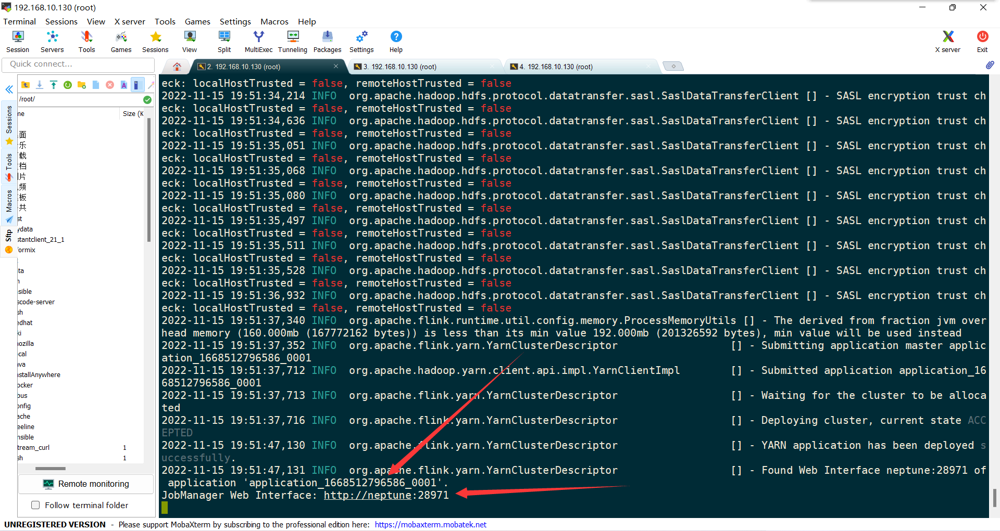
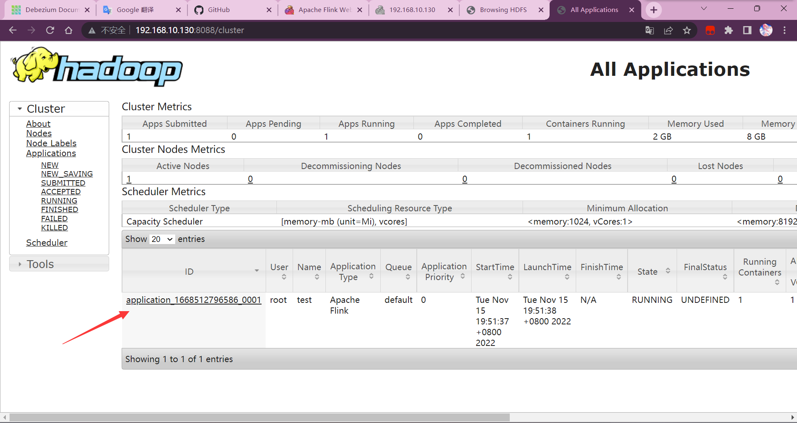
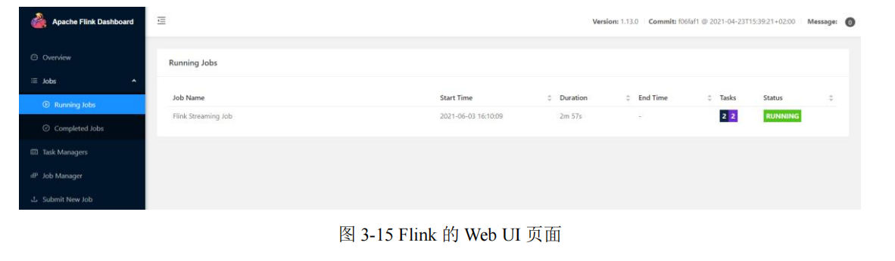

# 1 简介

## 1.1 Flink是什么【快速、灵巧】

官网：

- https://flink.apache.org/
- https://flink.apache.org/zh/usecases.html

- Apache Flink是由Apache软件基金会开发的**开源**流处理**框架**
- 其核心是用Java和Scala编写的**分布式**流数据流引擎
- Flink以**数据并行**和**流水线**方式执行任意流数据程序
- Flink的流水线运行时系统可以执行**批处理和流处理**程序
- Flink的运行时本身也支持迭代算法的执行
- **有界或无界数据流进行状态计算**

- - Flink可以对流执行任意数量的变换，这些流可以被编排为有向无环数据流图，允许应用程序分支和合并数据流
  - Flink的数据流API支持有界或无界数据流上的转换（如过滤器、聚合和窗口函数），包含了20多种不同类型的转换，可以在Java和Scala中使用。


2010 StructPhere => 2014 Apache基金会 => 2017 Alibaba开发

## 1.2 为什么用Flink

流数据更真实地反映了我们的生活方式

- 实时聊天，一条就直接发

传统的数据架构是基于有限数据集的

- 批量处理，隔一段时间数据攒齐了再计算

- - Spark Streaming就是这样，需要设置批处理时间间隔几百毫秒到几秒


**目标：**

- 低延迟

- - 想要做到毫秒级别延迟

- 高吞吐

- - 分区处理，然后再合并
  - 内存，扩容代价

- 结果的准确性和良好的容错性

- - 乱序问题
  - 一个节点挂了，回滚到最近的一个状态，然后继续处理


**应用场景：**

电商和市场营销

- 数据报表

- - 要求今晚12点前的数据出一个报表
  - 数据叠加计算，直接输出一个结果

- 广告投放
- 业务流程需要

物联网(IOT)

- 传感器实时数据采集和显示
- 实时报警
- 交通运输业

电信业

- 基站流量调配

- - 救援

银行和金融业

- 实时结算和通知推送

- - 银行的E+决策计算引擎，就是FlinkSQL

- - - 每一笔都做计算

- - 盘点核算

- 实时检测异常行为

## 1.3 流处理的发展和演变

### 1.3.1 传统事务处理


### 1.3.2 有状态的流处理

- 事务处理瓶颈~关联查询
- 解决：

- - 数据放内存里，保存成本地状态，替代关系型数据库的表；
  - 同时扩展使用集群
  - 内存~存盘，恢复机制（周期性检查点）

- 但扩展时，会存在数据乱序问题


#### 1.3.2.1 事件驱动型（Event-Driven）应用


#### 1.3.2.2 数据分析（Data Analysis）型应用


#### 1.3.2.3 数据管道（Data Pipeline）型应用


### 1.3.4 lambda流处理架构

用两套系统，同时保证低延迟和结果准确

- 需要自己写两套系统，并且保证正确性


### 1.3.5 Flink流处理


## 1.4 Flink的主要特点

### 1.4.1 事件驱动


### 1.4.2 基于流的世界观

- 在Flink 的世界观中，一切都是由流组成的，离线数据是有界的流;
- 实时数据是一个没有界限的流:这就是所谓的有界流和无界流
- 状态：过去，现在，未来


### 1.4.3 分层API

- 越顶层越抽象，表达含义越简明，使用越方便
- 越底层越具体,表达能力越丰富，使用越灵活


离线的叫DataSet, 实时的叫DataStream

有状态的事件驱动：可以定时，自定义状态


### 1.4.4 其它

* **高吞吐和低延迟**。每秒处理数百万个事件，毫秒级延迟。
* 结果的**准确性**。Flink 提供了事件时间**（event-time）**和处理时间**（processing-time ）**语义。对于乱序事件流，事件时间语义仍然能提供一致且准确的结果。
* **精确一次**（exactly-once）的状态一致性保证。
* **可以连接到最常用的存储系统**，如 Apache Kafka、Apache Cassandra、Elasticsearch、
  JDBC、Kinesis 和（分布式）文件系统，如 HDFS 和 S3。
* **高可用**。本身高可用的设置，加上与 K8s，YARN 和 Mesos 的紧密集成，再加上从故障中快速恢复和动态扩展任务的能力，Flink 能做到以极少的停机时间 **7×24 全天候运行**。
* **动态拓展**能够更新应用程序代码并将作业（jobs）迁移到不同的 Flink 集群，而不会丢失应用程序的状态。

## 1.5 Flink Vs Spark Streaming

- 流处理 VS 微批处理
- 数据模型

- - spark采用RDD模型，spark streaming的 DStream 实际上也就是一组组小批数据RDD的集合
  - flink 基本数据模型是数据流，以及事件(Event)序列

- 运行时架构

- - spark 是批计算，将DAG划分为不同的stage，一个完成后才可以计算下一个

- - - 转换算子和行动算子
    - 假如当前的分布式处理不同的分区、不同的节点处理有先后，那我当前节点处理完了，但是别的分区没处理完，那就得等，等到当前Stage结束，因为还得做Shuffle等调整

- - flink 是标准的流执行模式，一个事件在一个节点处理完后可以直接发往下一个节点进行处理

- - - 没有等待的过程，当前节点处理完毕，立马到下一节点处理


# 2 快速上手

## 2.1 WordCount Flink 批处理

新建maven项目

引入依赖

```xml
    <properties>
        <maven.compiler.source>8</maven.compiler.source>
        <maven.compiler.target>8</maven.compiler.target>
        <project.build.sourceEncoding>UTF-8</project.build.sourceEncoding>
        <flink.version>1.13.0</flink.version>
        <java.version>1.8</java.version>
        <scala.binary.version>2.12</scala.binary.version>
        <slf4j.version>1.7.30</slf4j.version>
    </properties>

    <dependencies>
        <!-- 引入 Flink 相关依赖-->
        <dependency>
            <groupId>org.apache.flink</groupId>
            <artifactId>flink-java</artifactId>
            <version>${flink.version}</version>
        </dependency>
        <dependency>
            <groupId>org.apache.flink</groupId>
            <artifactId>flink-streaming-java_${scala.binary.version}</artifactId>
            <version>${flink.version}</version>
        </dependency>
        <dependency>
            <groupId>org.apache.flink</groupId>
            <artifactId>flink-clients_${scala.binary.version}</artifactId>
            <version>${flink.version}</version>
        </dependency>
        <!-- 引入日志管理相关依赖-->
        <dependency>
            <groupId>org.slf4j</groupId>
            <artifactId>slf4j-api</artifactId>
            <version>${slf4j.version}</version>
        </dependency>
        <dependency>
            <groupId>org.slf4j</groupId>
            <artifactId>slf4j-log4j12</artifactId>
            <version>${slf4j.version}</version>
        </dependency>
        <dependency>
            <groupId>org.apache.logging.log4j</groupId>
            <artifactId>log4j-to-slf4j</artifactId>
            <version>2.14.0</version>
        </dependency>
        <dependency>
            <groupId>junit</groupId>
            <artifactId>junit</artifactId>
            <version>3.8.1</version>
            <scope>test</scope>
        </dependency>
    </dependencies>
```

在resource目录下配置log4j日志

```properties
log4j.rootLogger=error, stdout
log4j.appender.stdout=org.apache.log4j.ConsoleAppender
log4j.appender.stdout.layout=org.apache.log4j.PatternLayout
log4j.appender.stdout.layout.ConversionPattern=%-4r [%t] %-5p %c %x - %m%n
```


批处理

```java
package org.neptune.wc;

import org.apache.flink.api.common.typeinfo.Types;
import org.apache.flink.api.java.ExecutionEnvironment;
import org.apache.flink.api.java.operators.AggregateOperator;
import org.apache.flink.api.java.operators.DataSource;
import org.apache.flink.api.java.operators.FlatMapOperator;
import org.apache.flink.api.java.operators.UnsortedGrouping;
import org.apache.flink.api.java.tuple.Tuple2;
import org.apache.flink.util.Collector;

public class BatchWordCount {
    public static void main(String[] args) throws Exception {

        // 1. 创建执行环境
        ExecutionEnvironment env = ExecutionEnvironment.getExecutionEnvironment();

        // 2. 从文件读取数据 按行读取(存储的元素就是每行的文本)
        DataSource<String> lineDataSource = env.readTextFile("input/word.txt");

        // 3. 转换数据格式,转换成二元组
        FlatMapOperator<String, Tuple2<String, Long>> wordToOne = lineDataSource.flatMap((String line, Collector<Tuple2<String, Long>> out) -> {
            String[] words = line.split(" ");
            //将每个单词转换成二元组
            for (String word : words) {
                out.collect(Tuple2.of(word, 1L));
            }
        }).returns(Types.TUPLE(Types.STRING, Types.LONG));

        //当 Lambda 表达式使用 Java 泛型的时候, 由于泛型擦除的存在, 需要显示的声明类型信息
        // 4. 按照 word 进行分组
        UnsortedGrouping<Tuple2<String, Long>> wordToOneGroup = wordToOne.groupBy(0);

        // 5. 分组内聚合统计
        AggregateOperator<Tuple2<String, Long>> sum = wordToOneGroup.sum(1);

        // 6. 打印结果
        sum.print();
    }

}

```

## 2.2 WorkCount Flink 流处理

- 来一个处理一个，事件触发, 中间保存它的**状态**
- 先写好处理方式，然后等数据过来，一个个处理

```java
package org.neptune.wc;

import org.apache.flink.api.common.typeinfo.Types;
import org.apache.flink.api.java.tuple.Tuple2;
import org.apache.flink.api.java.utils.ParameterTool;
import org.apache.flink.streaming.api.datastream.DataStreamSource;
import org.apache.flink.streaming.api.datastream.KeyedStream;
import org.apache.flink.streaming.api.datastream.SingleOutputStreamOperator;
import org.apache.flink.streaming.api.environment.StreamExecutionEnvironment;
import org.apache.flink.util.Collector;

public class StreamWordCount {
    public static void main(String[] args) throws Exception {
        // 1. 创建流式执行环境
        StreamExecutionEnvironment environment = StreamExecutionEnvironment.getExecutionEnvironment();

        //从参数中提取主机名和端口号
/*        ParameterTool parameterTool = ParameterTool.fromArgs(args);
        String hostname = parameterTool.get("host");
        int port = parameterTool.getInt("port");*/

        // 2. 读取文本流
        DataStreamSource<String> lineDataStream = environment.socketTextStream("192.168.10.130", 7777);

        // 3. 转换计算
        SingleOutputStreamOperator<Tuple2<String, Long>> wordToOne = lineDataStream.flatMap((String line, Collector<Tuple2<String, Long>> out) -> {
            String[] words = line.split(" ");
            for (String word : words) {
                out.collect(Tuple2.of(word, 1L));
            }
        }).returns(Types.TUPLE(Types.STRING, Types.LONG));

        // 4. 按照 word 进行分组
        KeyedStream<Tuple2<String, Long>, String> wordToOneKeyedStream = wordToOne.keyBy(data -> data.f0);

        // 5. 分组内聚合统计
        SingleOutputStreamOperator<Tuple2<String, Long>> sum = wordToOneKeyedStream.sum(1);

        // 6. 打印结果
        sum.print();

        // 7. 启动执行
        environment.execute();

    }
}

```

通过在Linux主机上使用nc工具模拟

```perl
nc -lk 7777
```

# 3 Flink部署


## 3.1 部署模式

在一些应用场景中，对于集群资源分配和占用的方式，可能会有特定的需求。Flink 为各种场景提供了不同的部署模式，主要有以下三种：

* 会话模式（Session Mode）
  * 适合于单个规模小、执行时间短的大量作业
  * 资源是共享的，资源不够，提交新的作业会失败


* 单作业模式（Per-Job Mode）

  集群只为这个作业而生。同样由客户端运行应用程序，然后启动集群，作业被提交给 JobManager，进而分发给 TaskManager 执行。作业作业完成后，集群就会关闭。

  * 每个作业一个集群
  * 实际应用的首选模式
  * 作业完成后，集群就会关闭，所有资源也会释放
  * Flink 本身无法直接这样运行，所以单作业模式一般需要借助YARN、Kubernetes启动集群 


* 应用模式（Application Mode）

直接把应用提交到 JobManger 上运行。为每一个提交的应用单独启动一个 JobManager，也就是创建一个集群。这个 JobManager 只为执行这一个应用而存在，执行结束之后 JobManager 就关闭了，这就是所谓的应用模式。


总结：

* 在会话模式下，集群的生命周期独立于集群上运行的任何作业的生命周期，并且提交的所有作业共享资源。

* 单作业模式为每个提交的作业创建一个集群，带来了更好的资源隔离，这时集群的生命周期与作业的生命周期绑定。

* 应用模式为每个应用程序创建一个会话集群，在 JobManager 上直接调用应用程序的 main()方法。

它们的区别主要在于：集群的生命周期以及资源的分配方式；以及应用的 main 方法到底在哪里执行——客户端（Client）还是 JobManager。

## 3.2 独立模式（Standalone） 

### 3.2.1 会话模式部署

#### 3.2.1.1 环境配置

准备 3 台 Linux 机器，搭建集群环境。具体要求如下：

* 系统环境为 CentOS 7.5 版本。
* 安装 Java 8。
* 安装 Hadoop 集群，Hadoop 建议选择 Hadoop 2.7.5 以上版本。
* 配置集群节点服务器间时间同步以及免密登录，关闭防火墙。
  三台服务器的具体设置如下：
* 节点服务器 1，IP 地址为 192.168.10.102，主机名为 hadoop102。
* 节点服务器 2，IP 地址为 192.168.10.103，主机名为 hadoop103。
* 节点服务器 3，IP 地址为 192.168.10.104，主机名为 hadoop104。

#### 3.2.1.2 本地启动

Flink 可以运行在 Linux、Mac OS X 和 Windows 上。本地模式的安装唯一需要的只是Java 1.7.x或更高版本，本地运行会启动Single JVM，主要用于**测试调试代码**。

```perl
tar -zxvf flink-1.13.0-bin-scala_2.12.tgz -C /opt/module/
cd flink-1.13.0/
bin/start-cluster.sh

访问 http://hadoop102:8081 对 flink 集群和任务进行监控管理

#关闭应用
bin/stop-cluster.sh
```

#### 3.2.1.3 集群启动

| 节点服务器 | hadoop102  | hadoop103   | hadoop104   |
| ---------- | ---------- | ----------- | ----------- |
| 角色       | JobManager | TaskManager | TaskManager |

配置主节点

/etc/profile

```shell
#JAVA_HOME
export JAVA_HOME=/usr/java/jdk1.8.0_271
export CLASSPATH=$:CLASSPATH:$JAVA_HOME/lib/
export PATH=$PATH:$JAVA_HOME/bin

#KAFKA_HOME
export KAFKA_HOME=/opt/kafka
export PATH=$PATH:$KAFKA_HOME/bin

#ZOOKEEPER_HOME
export ZOOKEEPER_HOME=/usr/local/zookeeper
export PATH=$PATH:$ZOOKEEPER/bin

#HADOOP_HOME
export HADOOP_HOME=/opt/hadoop-3.1.3
export HADOOP_MAPRED_HOME=$HADOOP_HOME
export HADOOP_COMMON_HOME=$HADOOP_HOME
export HADOOP_HDFS_HOME=$HADOOP_HOME
export YARN_HOME=$HADOOP_HOME
export HADOOP_COMMON_LIB_NATIVE_DIR=$HADOOP_HOME/lib/native export
PATH=$PATH:$HADOOP_HOME/sbin:$HADOOP_HOME/bin

export HDFS_NAMENODE_USER=root
export HDFS_DATANODE_USER=root
export HDFS_SECONDARYNAMENODE_USER=root
export YARN_RESOURCEMANAGER_USER=root
export YARN_NODEMANAGER_USER=root

#HIVE_HOME
export HIVE_HOME=/opt/hive-3.1.2
export PATH=$PATH:$HIVE_HOME/bin
export FLUME_HOME=/opt/flume-1.9.0
export PATH=$PATH:$FLUME_HOME/bin

# kafkaEFAK
export KE_HOME=/opt/efak
export PATH=$PATH:$KE_HOME/bin

#HBASE_HOME
export HBASE_HOME=/opt/hbase
export PATH=$PATH:$HBASE_HOME/bin

#debzium-oracle
export LD_LIBRARY_PATH=/root/instantclient_21_1

#SPARK_HOME
export SPARK_HOME=/opt/spark
export PATH=$PATH:$SPARK_HOME/bin:$SPARK_HOME/sbin

#FLINK_HOME
export FLINK_HOME=/opt/flink-1.13.0
export PATH=$PATH:$FLINK_HOME/bin

```


```perl
tar -zxvf flink-1.13.0-bin-scala_2.12.tgz -C /opt/module/

#配置环境变量
vim /etc/profile
#FLINK_HOME
export FLINK_HOME=/opt/flink-1.13.0
export PATH=$PATH:$FLINK_HOME/bin

source  /etc/profile

cd flink-1.13.0/conf

#修改JobManager 节点地址.
vim flink-conf.yaml
jobmanager.rpc.address: hadoop102

#修改 workers 文件，将另外两台节点服务器添加为本 Flink 集群的 TaskManager 节点
vim workers 
hadoop103
hadoop104
```

 JobManager 和 TaskManager 组件的优化配置项如下：

* `jobmanager.memory.process.size`：对 JobManager 进程可使用到的全部内存进行配置，包括 JVM 元空间和其他开销，默认为 1600M，可以根据集群规模进行适当调整。
* `taskmanager.memory.process.size`：对 TaskManager 进程可使用到的全部内存进行配置，包括 JVM 元空间和其他开销，默认为 1600M，可以根据集群规模进行适当调整。
* `taskmanager.numberOfTaskSlots`：对每个 TaskManager 能够分配的 Slot 数量进行配置，默认为 1，可根据 TaskManager 所在的机器能够提供给 Flink 的 CPU 数量决定。所谓Slot 就是 TaskManager 中具体运行一个任务所分配的计算资源。
* `parallelism.default`：Flink 任务执行的默认并行度，优先级低于代码中进行的并行度配置和任务提交时使用参数指定的并行度数量。关于 Slot 和并行度的概念，下一章做详细讲解。

分发安装目录

```perl
sudo /home/atguigu/bin/xsync /opt/module/flink-1.13.0
```

启动集群

```perl
#主节点执行
bin/start-cluster.sh

#查看进程
jps
```

启动成功后，访问 http://hadoop102:8081 对 flink 集群和任务进行监控管理

可以看到，当前集群的 TaskManager 数量为 2；由于默认每个 TaskManager 的 Slot

数量为 1，所以总 Slot 数和可用 Slot 数都为 2。

#### 3.2.1.4 提交作业

引入插件 maven-assembly-plugin 进行打包，方便自定义结构和定制依赖。

在pom.xml 文件中添加打包插件的配置

```xml
<build>
        <plugins>
            <plugin>
                <groupId>org.apache.maven.plugins</groupId>
                <artifactId>maven-assembly-plugin</artifactId>
                <version>3.0.0</version>
                <configuration>
                    <descriptorRefs>
                        <descriptorRef>jar-with-dependencies</descriptorRef>
                    </descriptorRefs>
                </configuration>
                <executions>
                    <execution>
                        <id>make-assembly</id>
                        <phase>package</phase>
                        <goals>
                            <goal>single</goal>
                        </goals>
                    </execution>
                </executions>
            </plugin>
        </plugins>
    </build>
```

插件配置完毕后（刷新maven依赖），可以使用 IDEA 的 Maven 工具执行 package 命令

打 包 完 成 后 ， 在 target 目 录 下 有FlinkTutorial-1.0-SNAPSHOT.jar 和 FlinkTutorial-1.0-SNAPSHOT-jar-with-dependencies.jar，集群中已经具备任务运行所需的所有依赖，所以建议使用 FlinkTutorial-1.0-SNAPSHOT.jar。

##### 3.2.1.4.1 页面提交


命令行读取参数

```perl
java -jar xxx.jar --host 192.168.10.130 --port 7777
```

IDEA中读取参数


Flink页面


Linux主机先开启nc再提交作业，查看任务


详细信息


取消作业


##### 3.2.3.2 命令行提交

```perl
先打开nc工具
nc -lk 7777

cd flink-1.13.0/
flink run -m 192.168.10.130:8081 -c org.neptune.wc.StreamWordCount Flink-1.0-SNAPSHOT.jar
任务已提交Ctrl+C不影响
flink list查看任务


```


==flink的log目录下有当前任务的日志输出==


### 3.2.2 单作业模式部署

Flink 本身无法直接以单作业方式启动集群，一般需要借助一些资源管理平台。所以 Flink 的独立（Standalone）集群并==不支持==单作业模式部署。

### 3.2.3 应用模式部署

应用模式下不会提前创建集群，所以不能调用 start-cluster.sh 脚本。我们可以使用同样在bin 目录下的standalone-job.sh 来创建一个 JobManager。

具体步骤如下：

1. 进入到 Flink 的安装路径下，将应用程序的 jar 包放到 lib/目录下。

```perl
cp ./FlinkTutorial-1.0-SNAPSHOT.jar lib/
```

2. 执行以下命令，启动 JobManager。

```perl
#这里我们直接指定作业入口类，脚本会到 lib 目录扫描所有的 jar 包。
./bin/standalone-job.sh start --job-classname com.atguigu.wc.StreamWordCount
```

3. 同样是使用 bin 目录下的脚本，启动 TaskManager。

```perl
./bin/taskmanager.sh start
```

4. 如果希望停掉集群，同样可以使用脚本，命令如下。

```perl
./bin/standalone-job.sh stop
./bin/taskmanager.sh stop
```

### 3.3.4 高可用(High Availability )

 JobManager 做主备冗余，这就是所谓的高可用（High Availability，简称 HA）。

让集群在任何时候都有一个主 JobManager 和多个备用 JobManagers


1. 进入 Flink 的安装路径下的 conf 目录下，修改配置文件: flink-conf.yaml，增加如下配置。

```yaml
high-availability: zookeeper
high-availability.storageDir: hdfs://hadoop102:9820/flink/standalone/ha
high-availability.zookeeper.quorum: 
hadoop102:2181,hadoop103:2181,hadoop104:2181
high-availability.zookeeper.path.root: /flink-standalone
high-availability.cluster-id: /cluster_atguigu
```

2. 修改配置文件: masters，配置备用 JobManager 列表。

```perl
hadoop102:8081
hadoop103:8081
```

3. 分发修改后的配置文件到其他节点服务器。

```perl
xsync /opt/module/flink-1.13.0
```

4）在`/etc/profile.d/my_env.sh`中配置环境变量

```perl
export HADOOP_CLASSPATH=`hadoop classpath`
```

注意: 

* 需要提前保证 HAOOP_HOME 环境变量配置成功

* 分发到其他节点

具体部署方法如下：

1. 首先启动 HDFS 集群和 Zookeeper 集群。

2. 执行以下命令，启动 standalone HA 集群。

```perl
bin/start-cluster.sh
```

3. 可以分别访问两个备用 JobManager 的 Web UI 页面。

http://hadoop102:8081

http://hadoop103:8081

4. 在 zkCli.sh 中查看谁是 leader。

```perl
[zk: localhost:2181(CONNECTED) 1] get /flink-standalone/cluster_atguigu/leader/rest_server_lock
```

杀死 hadoop102 上的 Jobmanager, 再看 leader。

```perl
[zk: localhost:2181(CONNECTED) 7] get /flink-standalone/cluster_atguigu/leader/rest_server_lock
```

**注意: 不管是不是 leader，从 WEB UI 上是看不到区别的, 都可以提交应用。**

## 3.3 YARN 模式

客户端把 Flink 应用提交给 Yarn 的 ResourceManager, Yarn 的 ResourceManager 会向 Yarn 的 NodeManager 申请容器。在这些容器上，Flink 会部署JobManager 和 TaskManager 的实例，从而启动集群。Flink 会根据运行在 JobManger 上的作业所需要的 Slot 数量动态分配 TaskManager 资源。

### 3.3.1 环境准备

1. 下载并解压安装包，并将解压后的安装包重命名为 flink-1.13.0-yarn，本节的相关操作都将默认在此安装路径下执行。

2. 配置环境变量，增加环境变量配置如下：

```shell
sudo vim /etc/profile.d/my_env.sh

HADOOP_HOME=/opt/hadoop-3.1.3/
export PATH=$PATH:$HADOOP_HOME/bin:$HADOOP_HOME/sbin
export HADOOP_CONF_DIR=${HADOOP_HOME}/etc/hadoop
export HADOOP_CLASSPATH=`hadoop classpath`
```

**这里必须保证设置了环境变量 HADOOP_CLASSPATH。**

3. 启动 Hadoop 集群，包括 HDFS 和 YARN。

```perl
start-dfs.sh
start-yarn.sh
```

```shell
[atguigu@hadoop102 ~]$ jps
5190 Jps
5062 NodeManager
4408 NameNode
4589 DataNode
[atguigu@hadoop103 ~]$ jps
5425 Jps
4680 ResourceManager
5241 NodeManager
4447 DataNode
[atguigu@hadoop104 ~]$ jps
4731 NodeManager
4333 DataNode
4861 Jps
4478 SecondaryNameNode
```

4. 进入 conf 目录，修改 flink-conf.yaml 文件，修改以下配置，这些配置项的含义在进行 Standalone 模式配置的时候进行过讲解，若在提交命令中不特定指明，这些配置将作为默认配置。

```perl
cd /opt/module/flink-1.13.0-yarn/conf/
vim flink-conf.yaml
jobmanager.memory.process.size: 1600m
taskmanager.memory.process.size: 1728m
taskmanager.numberOfTaskSlots: 8
parallelism.default: 1
```

### 3.3.2 会话模式部署

YARN 的会话模式与独立集群略有不同，需要首先申请一个 YARN 会话（YARN session）来启动 Flink 集群。

#### 3.3.2.1 启动集群

* 启动 hadoop 集群(HDFS, YARN)。

* 执行脚本命令向 YARN 集群申请资源，开启一个 YARN 会话，启动 Flink 集群。

  ```perl
  yarn-session.sh -nm test
  ```

可用参数解读：

* `-d`：分离模式，如果你不想让 Flink YARN 客户端一直前台运行，可以使用这个参数，即使关掉当前对话窗口，YARN session 也可以后台运行。

* `-jm(--jobManagerMemory)`：配置 JobManager 所需内存，默认单位 MB。

* `-nm(--name)`：配置在 YARN UI 界面上显示的任务名。

* `-qu(--queue)`：指定 YARN 队列名。

* `-tm(--taskManager)`：配置每个 TaskManager 所使用内存。


**注意：Flink1.11.0 版本不再使用-n 参数和-s 参数分别指定 TaskManager 数量和 slot 数量**，

YARN 的会话模式也不会把集群资源固定， 会按照需求动态分配 TaskManager 和 slot。

YARN Session 启动之后会给出一个 web UI 地址以及一个 YARN application ID，用户可以通过 web UI 或者命令行两种方式提交作业。

```shell
2022-11-15 19:51:37,712 INFO  org.apache.hadoop.yarn.client.api.impl.YarnClientImpl        [] - Submitted application application_1668512796586_0001
2022-11-15 19:51:37,713 INFO  org.apache.flink.yarn.YarnClusterDescriptor                  [] - Waiting for the cluster to be allocated
2022-11-15 19:51:37,716 INFO  org.apache.flink.yarn.YarnClusterDescriptor                  [] - Deploying cluster, current state ACCEPTED
2022-11-15 19:51:47,130 INFO  org.apache.flink.yarn.YarnClusterDescriptor                  [] - YARN application has been deployed successfully.
2022-11-15 19:51:47,131 INFO  org.apache.flink.yarn.YarnClusterDescriptor                  [] - Found Web Interface neptune:28971 of application 'application_1668512796586_0001'.
JobManager Web Interface: http://neptune:28971
```

http://neptune:28971 为flink界面



#### 3.3.2.2 提交作业

##### 3.3.2.2.1 页面提交

这种方式比较简单，与上文所述 Standalone 部署模式基本相同。

##### 3.3.2.2.2 命令行提交

1. 将 Standalone 模式讲解中打包好的任务运行 JAR 包上传至集群

2. 执行以下命令将该任务提交到已经开启的 Yarn-Session 中运行。

```perl
flink run -c org.neptune.wc.StreamWordCount /root/Flink-1.0-SNAPSHOT.jar
```

客户端可以自行确定 JobManager 的地址，也可以通过-m 或者-jobmanager 参数指定JobManager 的地址，JobManager 的地址在 YARN Session 的启动页面中可以找到。

3. 任务提交成功后，可在 YARN 的 Web UI 界面查看运行情况。



从图中可以看到创建的 Yarn-Session 实际上是一个 Yarn 的Application，并且有唯一的 Application ID。

4. 也可以通过 Flink 的 Web UI 页面查看提交任务的运行情况。



### 3.3.3 单作业模式部署

在 YARN 环境中，由于有了外部平台做资源调度，所以我们也可以==直接向 YARN 提交一个单独的作业==，从而启动一个 Flink 集群。

1. 执行命令提交作业

```perl
bin/flink run -d -t yarn-per-job -c com.atguigu.wc.StreamWordCount FlinkTutorial-1.0-SNAPSHOT.jar
或
#注意这里是通过参数-m yarn-cluster 指定向 YARN 集群提交任务。
bin/flink run -m yarn-cluster -c com.atguigu.wc.StreamWordCount FlinkTutorial-1.0-SNAPSHOT.jar
```

2. 可在 YARN 的 ResourceManager 界面/ Flink Web UI 页面进行监控查看执行情况

3. 可以使用命令行查看或取消作业

```perl
./bin/flink list -t yarn-per-job -Dyarn.application.id=application_XXXX_YY

./bin/flink cancel -t yarn-per-job -Dyarn.application.id=application_XXXX_YY <jobId>

这里的 application_XXXX_YY 是当前应用的 ID，<jobId>是作业的 ID。注意如果取消作业，整个 Flink 集群也会停掉。
```

### 3.3.4 应用模式部署

与单作业模式类似，直接执行 flink run-application 命令即可。

1. 执行命令提交作业。

```perl
bin/flink run-application -t yarn-application -c com.atguigu.wc.StreamWordCount FlinkTutorial-1.0-SNAPSHOT.jar
```

2. 在命令行中查看或取消作业。

```perl
./bin/flink list -t yarn-application -Dyarn.application.id=application_XXXX_YY

./bin/flink cancel -t yarn-application -Dyarn.application.id=application_XXXX_YY <jobId>
```

3. 也可以通过 yarn.provided.lib.dirs 配置选项指定位置，将 jar 上传到远程。

```perl
./bin/flink run-application -t yarn-application -Dyarn.provided.lib.dirs="hdfs://myhdfs/my-remote-flink-dist-dir" hdfs://myhdfs/jars/my-application.jar
```

**这种方式下 jar 可以预先上传到 HDFS，而不需要单独发送到集群，这就使得作业提交更加轻量了**

### 3.3.5 高可用

YARN 模式的高可用和独立模式（Standalone）的高可用原理不一样。

* Standalone 模式中, 同时启动多个 JobManager, 一个为“领导者”（leader），其他为“后备”（standby）, 当 leader 挂了, 其他的才会有一个成为 leader。

* YARN 的高可用是只启动一个 Jobmanager, 当这个 Jobmanager 挂了之后, YARN 会再次启动一个, 所以其实是利用的 YARN 的重试次数来实现的高可用。

1. 在 yarn-site.xml 中配置

```xml
<property>
 <name>yarn.resourcemanager.am.max-attempts</name>
 <value>4</value>
 <description>
 The maximum number of application master execution attempts.
 </description>
</property>
```

2. 分发并重启 YARN。

3. 在 flink-conf.yaml 中配置

```yaml
yarn.application-attempts: 3
high-availability: zookeeper
high-availability.storageDir: hdfs://hadoop102:9820/flink/yarn/ha
high-availability.zookeeper.quorum: 
hadoop102:2181,hadoop103:2181,hadoop104:2181
high-availability.zookeeper.path.root: /flink-yarn
```

3. 启动 yarn-session

4. 杀死 JobManager, 查看复活情况。

**注意: yarn-site.xml 中配置的是 JobManager 重启次数的上限, flink-conf.xml 中的次数应该小于这个值。**

## 3.4 k8s 模式

容器化部署时目前业界很流行的一项技术，基于Docker镜像运行能够让用户更加方便地对应用进行管理和运维.容器管理工具中最为流行的就是 Kubernetes(kSs) ，而Flink也在最近的版本中支持了k8s部署模式。

### 3.4.1 搭建Kurbernetes集群

### 3.4.2 配置各组件的yaml文件

在k8s上构建Flink Session Cluster，雷要将Flink集群的组件对应的docker镜像分别在k8s 上启动，包括obManager、TaskManager、JobManagerService三个镜像服务。每个镜像服务都可以从中央镜像仓库中获取。

### 3.4.3 启动 Flink Session Cluster

```perl
#启动jobmonager-service服务
kubectl create -f jobmanager-service.yaml

#启动jobmanager--deployment服务
kubectl create -f jobmanager-deployment.yaml

#启动taskmanoger-depl oymert 服务
kubectl create -f taskmanager-deployment.yaml
```

### 3.4.4 访问Flink UI页面

集群启动后，就可以通过JobManagerservicers中配置的webUI端口，用浏览器输入以下url来访问Flink UI页面了;

```perl
http://{JobManagerHost:Port}/api/v1/namespaces/default/services/fink-jobmanager:ui/proxy
```

# 4 Flink运行架构

