1 简介

## 1.1 Flink是什么【快速、灵巧】

官网：

- https://flink.apache.org/
- https://flink.apache.org/zh/usecases.html

- Apache Flink是由Apache软件基金会开发的**开源**流处理**框架**
- 其核心是用Java和Scala编写的**分布式**流数据流引擎
- Flink以**数据并行**和**流水线**方式执行任意流数据程序
- Flink的流水线运行时系统可以执行**批处理和流处理**程序
- Flink的运行时本身也支持迭代算法的执行
- **有界或无界数据流进行状态计算**

- - Flink可以对流执行任意数量的变换，这些流可以被编排为有向无环数据流图，允许应用程序分支和合并数据流
  - Flink的数据流API支持有界或无界数据流上的转换（如过滤器、聚合和窗口函数），包含了20多种不同类型的转换，可以在Java和Scala中使用。


2010 StructPhere => 2014 Apache基金会 => 2017 Alibaba开发

## 1.2 为什么用Flink

流数据更真实地反映了我们的生活方式

- 实时聊天，一条就直接发

传统的数据架构是基于有限数据集的

- 批量处理，隔一段时间数据攒齐了再计算

- - Spark Streaming就是这样，需要设置批处理时间间隔几百毫秒到几秒


**目标：**

- 低延迟

- - 想要做到毫秒级别延迟

- 高吞吐

- - 分区处理，然后再合并
  - 内存，扩容代价

- 结果的准确性和良好的容错性

- - 乱序问题
  - 一个节点挂了，回滚到最近的一个状态，然后继续处理


**应用场景：**

电商和市场营销

- 数据报表

- - 要求今晚12点前的数据出一个报表
  - 数据叠加计算，直接输出一个结果

- 广告投放
- 业务流程需要

物联网(IOT)

- 传感器实时数据采集和显示
- 实时报警
- 交通运输业

电信业

- 基站流量调配

- - 救援

银行和金融业

- 实时结算和通知推送

- - 银行的E+决策计算引擎，就是FlinkSQL

- - - 每一笔都做计算

- - 盘点核算

- 实时检测异常行为

## 1.3 流处理的发展和演变

### 1.3.1 传统事务处理


### 1.3.2 有状态的流处理

- 事务处理瓶颈~关联查询
- 解决：

- - 数据放内存里，保存成本地状态，替代关系型数据库的表；
  - 同时扩展使用集群
  - 内存~存盘，恢复机制（周期性检查点）

- 但扩展时，会存在数据乱序问题


#### 1.3.2.1 事件驱动型（Event-Driven）应用


#### 1.3.2.2 数据分析（Data Analysis）型应用


#### 1.3.2.3 数据管道（Data Pipeline）型应用


### 1.3.4 lambda流处理架构

用两套系统，同时保证低延迟和结果准确

- 需要自己写两套系统，并且保证正确性


### 1.3.5 Flink流处理


## 1.4 Flink的主要特点

### 1.4.1 事件驱动


### 1.4.2 基于流的世界观

- 在Flink 的世界观中，一切都是由流组成的，离线数据是有界的流;
- 实时数据是一个没有界限的流:这就是所谓的有界流和无界流
- 状态：过去，现在，未来


### 1.4.3 分层API

- 越顶层越抽象，表达含义越简明，使用越方便
- 越底层越具体,表达能力越丰富，使用越灵活


离线的叫DataSet, 实时的叫DataStream

有状态的事件驱动：可以定时，自定义状态


### 1.4.4 其它

* **高吞吐和低延迟**。每秒处理数百万个事件，毫秒级延迟。
* 结果的**准确性**。Flink 提供了事件时间**（event-time）**和处理时间**（processing-time ）**语义。对于乱序事件流，事件时间语义仍然能提供一致且准确的结果。
* **精确一次**（exactly-once）的状态一致性保证。
* **可以连接到最常用的存储系统**，如 Apache Kafka、Apache Cassandra、Elasticsearch、
  JDBC、Kinesis 和（分布式）文件系统，如 HDFS 和 S3。
* **高可用**。本身高可用的设置，加上与 K8s，YARN 和 Mesos 的紧密集成，再加上从故障中快速恢复和动态扩展任务的能力，Flink 能做到以极少的停机时间 **7×24 全天候运行**。
* **动态拓展**能够更新应用程序代码并将作业（jobs）迁移到不同的 Flink 集群，而不会丢失应用程序的状态。

## 1.5 Flink Vs Spark Streaming

- 流处理 VS 微批处理
- 数据模型

- - spark采用RDD模型，spark streaming的 DStream 实际上也就是一组组小批数据RDD的集合
  - flink 基本数据模型是数据流，以及事件(Event)序列

- 运行时架构

- - spark 是批计算，将DAG划分为不同的stage，一个完成后才可以计算下一个

- - - 转换算子和行动算子
    - 假如当前的分布式处理不同的分区、不同的节点处理有先后，那我当前节点处理完了，但是别的分区没处理完，那就得等，等到当前Stage结束，因为还得做Shuffle等调整

- - flink 是标准的流执行模式，一个事件在一个节点处理完后可以直接发往下一个节点进行处理

- - - 没有等待的过程，当前节点处理完毕，立马到下一节点处理


# 2 快速上手

## 2.1 WordCount Flink 批处理

新建maven项目

引入依赖

```xml
    <properties>
        <maven.compiler.source>8</maven.compiler.source>
        <maven.compiler.target>8</maven.compiler.target>
        <project.build.sourceEncoding>UTF-8</project.build.sourceEncoding>
        <flink.version>1.13.0</flink.version>
        <java.version>1.8</java.version>
        <scala.binary.version>2.12</scala.binary.version>
        <slf4j.version>1.7.30</slf4j.version>
    </properties>

    <dependencies>
        <!-- 引入 Flink 相关依赖-->
        <dependency>
            <groupId>org.apache.flink</groupId>
            <artifactId>flink-java</artifactId>
            <version>${flink.version}</version>
        </dependency>
        <dependency>
            <groupId>org.apache.flink</groupId>
            <artifactId>flink-streaming-java_${scala.binary.version}</artifactId>
            <version>${flink.version}</version>
        </dependency>
        <dependency>
            <groupId>org.apache.flink</groupId>
            <artifactId>flink-clients_${scala.binary.version}</artifactId>
            <version>${flink.version}</version>
        </dependency>
        <!-- 引入日志管理相关依赖-->
        <dependency>
            <groupId>org.slf4j</groupId>
            <artifactId>slf4j-api</artifactId>
            <version>${slf4j.version}</version>
        </dependency>
        <dependency>
            <groupId>org.slf4j</groupId>
            <artifactId>slf4j-log4j12</artifactId>
            <version>${slf4j.version}</version>
        </dependency>
        <dependency>
            <groupId>org.apache.logging.log4j</groupId>
            <artifactId>log4j-to-slf4j</artifactId>
            <version>2.14.0</version>
        </dependency>
        <dependency>
            <groupId>junit</groupId>
            <artifactId>junit</artifactId>
            <version>3.8.1</version>
            <scope>test</scope>
        </dependency>
    </dependencies>
```

在resource目录下配置log4j日志

```properties
log4j.rootLogger=error, stdout
log4j.appender.stdout=org.apache.log4j.ConsoleAppender
log4j.appender.stdout.layout=org.apache.log4j.PatternLayout
log4j.appender.stdout.layout.ConversionPattern=%-4r [%t] %-5p %c %x - %m%n
```


批处理

```java
package org.neptune.wc;

import org.apache.flink.api.common.typeinfo.Types;
import org.apache.flink.api.java.ExecutionEnvironment;
import org.apache.flink.api.java.operators.AggregateOperator;
import org.apache.flink.api.java.operators.DataSource;
import org.apache.flink.api.java.operators.FlatMapOperator;
import org.apache.flink.api.java.operators.UnsortedGrouping;
import org.apache.flink.api.java.tuple.Tuple2;
import org.apache.flink.util.Collector;

public class BatchWordCount {
    public static void main(String[] args) throws Exception {

        // 1. 创建执行环境
        ExecutionEnvironment env = ExecutionEnvironment.getExecutionEnvironment();

        // 2. 从文件读取数据 按行读取(存储的元素就是每行的文本)
        DataSource<String> lineDataSource = env.readTextFile("input/word.txt");

        // 3. 转换数据格式,转换成二元组
        FlatMapOperator<String, Tuple2<String, Long>> wordToOne = lineDataSource.flatMap((String line, Collector<Tuple2<String, Long>> out) -> {
            String[] words = line.split(" ");
            //将每个单词转换成二元组
            for (String word : words) {
                out.collect(Tuple2.of(word, 1L));
            }
        }).returns(Types.TUPLE(Types.STRING, Types.LONG));

        //当 Lambda 表达式使用 Java 泛型的时候, 由于泛型擦除的存在, 需要显示的声明类型信息
        // 4. 按照 word 进行分组
        UnsortedGrouping<Tuple2<String, Long>> wordToOneGroup = wordToOne.groupBy(0);

        // 5. 分组内聚合统计
        AggregateOperator<Tuple2<String, Long>> sum = wordToOneGroup.sum(1);

        // 6. 打印结果
        sum.print();
    }

}

```

## 2.2 WorkCount Flink 流处理

- 来一个处理一个，事件触发, 中间保存它的**状态**
- 先写好处理方式，然后等数据过来，一个个处理

```java
package org.neptune.wc;

import org.apache.flink.api.common.typeinfo.Types;
import org.apache.flink.api.java.tuple.Tuple2;
import org.apache.flink.api.java.utils.ParameterTool;
import org.apache.flink.streaming.api.datastream.DataStreamSource;
import org.apache.flink.streaming.api.datastream.KeyedStream;
import org.apache.flink.streaming.api.datastream.SingleOutputStreamOperator;
import org.apache.flink.streaming.api.environment.StreamExecutionEnvironment;
import org.apache.flink.util.Collector;

public class StreamWordCount {
    public static void main(String[] args) throws Exception {
        // 1. 创建流式执行环境
        StreamExecutionEnvironment environment = StreamExecutionEnvironment.getExecutionEnvironment();

        //从参数中提取主机名和端口号
/*        ParameterTool parameterTool = ParameterTool.fromArgs(args);
        String hostname = parameterTool.get("host");
        int port = parameterTool.getInt("port");*/

        // 2. 读取文本流
        DataStreamSource<String> lineDataStream = environment.socketTextStream("192.168.10.130", 7777);

        // 3. 转换计算
        SingleOutputStreamOperator<Tuple2<String, Long>> wordToOne = lineDataStream.flatMap((String line, Collector<Tuple2<String, Long>> out) -> {
            String[] words = line.split(" ");
            for (String word : words) {
                out.collect(Tuple2.of(word, 1L));
            }
        }).returns(Types.TUPLE(Types.STRING, Types.LONG));

        // 4. 按照 word 进行分组
        KeyedStream<Tuple2<String, Long>, String> wordToOneKeyedStream = wordToOne.keyBy(data -> data.f0);

        // 5. 分组内聚合统计
        SingleOutputStreamOperator<Tuple2<String, Long>> sum = wordToOneKeyedStream.sum(1);

        // 6. 打印结果
        sum.print();

        // 7. 启动执行
        environment.execute();

    }
}

```

通过在Linux主机上使用nc工具模拟

```perl
nc -lk 7777
```

# 3 Flink部署


## 3.1 部署模式

在一些应用场景中，对于集群资源分配和占用的方式，可能会有特定的需求。Flink 为各种场景提供了不同的部署模式，主要有以下三种：

* 会话模式（Session Mode）
  * 适合于单个规模小、执行时间短的大量作业
  * 资源是共享的，资源不够，提交新的作业会失败


* 单作业模式（Per-Job Mode）

  集群只为这个作业而生。同样由客户端运行应用程序，然后启动集群，作业被提交给 JobManager，进而分发给 TaskManager 执行。作业作业完成后，集群就会关闭。

  * 每个作业一个集群
  * 实际应用的首选模式
  * 作业完成后，集群就会关闭，所有资源也会释放
  * Flink 本身无法直接这样运行，所以单作业模式一般需要借助YARN、Kubernetes启动集群 


* 应用模式（Application Mode）

直接把应用提交到 JobManger 上运行。为每一个提交的应用单独启动一个 JobManager，也就是创建一个集群。这个 JobManager 只为执行这一个应用而存在，执行结束之后 JobManager 就关闭了，这就是所谓的应用模式。


总结：

* 在会话模式下，集群的生命周期独立于集群上运行的任何作业的生命周期，并且提交的所有作业共享资源。

* 单作业模式为每个提交的作业创建一个集群，带来了更好的资源隔离，这时集群的生命周期与作业的生命周期绑定。

* 应用模式为每个应用程序创建一个会话集群，在 JobManager 上直接调用应用程序的 main()方法。

它们的区别主要在于：集群的生命周期以及资源的分配方式；以及应用的 main 方法到底在哪里执行——客户端（Client）还是 JobManager。

## 3.2 独立模式（Standalone） 

### 3.2.1 会话模式部署

#### 3.2.1.1 环境配置

准备 3 台 Linux 机器，搭建集群环境。具体要求如下：

* 系统环境为 CentOS 7.5 版本。
* 安装 Java 8。
* 安装 Hadoop 集群，Hadoop 建议选择 Hadoop 2.7.5 以上版本。
* 配置集群节点服务器间时间同步以及免密登录，关闭防火墙。
  三台服务器的具体设置如下：
* 节点服务器 1，IP 地址为 192.168.10.102，主机名为 hadoop102。
* 节点服务器 2，IP 地址为 192.168.10.103，主机名为 hadoop103。
* 节点服务器 3，IP 地址为 192.168.10.104，主机名为 hadoop104。

#### 3.2.1.2 本地启动

Flink 可以运行在 Linux、Mac OS X 和 Windows 上。本地模式的安装唯一需要的只是Java 1.7.x或更高版本，本地运行会启动Single JVM，主要用于**测试调试代码**。

```perl
tar -zxvf flink-1.13.0-bin-scala_2.12.tgz -C /opt/module/
cd flink-1.13.0/
bin/start-cluster.sh

访问 http://hadoop102:8081 对 flink 集群和任务进行监控管理

#关闭应用
bin/stop-cluster.sh
```

#### 3.2.1.3 集群启动

| 节点服务器 | hadoop102  | hadoop103   | hadoop104   |
| ---------- | ---------- | ----------- | ----------- |
| 角色       | JobManager | TaskManager | TaskManager |

配置主节点

/etc/profile

```shell
#JAVA_HOME
export JAVA_HOME=/usr/java/jdk1.8.0_271
export CLASSPATH=$:CLASSPATH:$JAVA_HOME/lib/
export PATH=$PATH:$JAVA_HOME/bin

#KAFKA_HOME
export KAFKA_HOME=/opt/kafka
export PATH=$PATH:$KAFKA_HOME/bin

#ZOOKEEPER_HOME
export ZOOKEEPER_HOME=/usr/local/zookeeper
export PATH=$PATH:$ZOOKEEPER/bin

#HADOOP_HOME
export HADOOP_HOME=/opt/hadoop-3.1.3
export HADOOP_MAPRED_HOME=$HADOOP_HOME
export HADOOP_COMMON_HOME=$HADOOP_HOME
export HADOOP_HDFS_HOME=$HADOOP_HOME
export YARN_HOME=$HADOOP_HOME
export HADOOP_COMMON_LIB_NATIVE_DIR=$HADOOP_HOME/lib/native export
PATH=$PATH:$HADOOP_HOME/sbin:$HADOOP_HOME/bin

export HDFS_NAMENODE_USER=root
export HDFS_DATANODE_USER=root
export HDFS_SECONDARYNAMENODE_USER=root
export YARN_RESOURCEMANAGER_USER=root
export YARN_NODEMANAGER_USER=root

#HIVE_HOME
export HIVE_HOME=/opt/hive-3.1.2
export PATH=$PATH:$HIVE_HOME/bin
export FLUME_HOME=/opt/flume-1.9.0
export PATH=$PATH:$FLUME_HOME/bin

# kafkaEFAK
export KE_HOME=/opt/efak
export PATH=$PATH:$KE_HOME/bin

#HBASE_HOME
export HBASE_HOME=/opt/hbase
export PATH=$PATH:$HBASE_HOME/bin

#debzium-oracle
export LD_LIBRARY_PATH=/root/instantclient_21_1

#SPARK_HOME
export SPARK_HOME=/opt/spark
export PATH=$PATH:$SPARK_HOME/bin:$SPARK_HOME/sbin

#FLINK_HOME
export FLINK_HOME=/opt/flink-1.13.0
export PATH=$PATH:$FLINK_HOME/bin

```


```perl
tar -zxvf flink-1.13.0-bin-scala_2.12.tgz -C /opt/module/

#配置环境变量
vim /etc/profile
#FLINK_HOME
export FLINK_HOME=/opt/flink-1.13.0
export PATH=$PATH:$FLINK_HOME/bin

source  /etc/profile

cd flink-1.13.0/conf

#修改JobManager 节点地址.
vim flink-conf.yaml
jobmanager.rpc.address: hadoop102

#修改 workers 文件，将另外两台节点服务器添加为本 Flink 集群的 TaskManager 节点
vim workers 
hadoop103
hadoop104
```

 JobManager 和 TaskManager 组件的优化配置项如下：

* `jobmanager.memory.process.size`：对 JobManager 进程可使用到的全部内存进行配置，包括 JVM 元空间和其他开销，默认为 1600M，可以根据集群规模进行适当调整。
* `taskmanager.memory.process.size`：对 TaskManager 进程可使用到的全部内存进行配置，包括 JVM 元空间和其他开销，默认为 1600M，可以根据集群规模进行适当调整。
* `taskmanager.numberOfTaskSlots`：对每个 TaskManager 能够分配的 Slot 数量进行配置，默认为 1，可根据 TaskManager 所在的机器能够提供给 Flink 的 CPU 数量决定。所谓Slot 就是 TaskManager 中具体运行一个任务所分配的计算资源。
* `parallelism.default`：Flink 任务执行的默认并行度，优先级低于代码中进行的并行度配置和任务提交时使用参数指定的并行度数量。关于 Slot 和并行度的概念，下一章做详细讲解。

分发安装目录

```perl
sudo /home/atguigu/bin/xsync /opt/module/flink-1.13.0
```

启动集群

```perl
#主节点执行
bin/start-cluster.sh

#查看进程
jps
```

启动成功后，访问 http://hadoop102:8081 对 flink 集群和任务进行监控管理

可以看到，当前集群的 TaskManager 数量为 2；由于默认每个 TaskManager 的 Slot

数量为 1，所以总 Slot 数和可用 Slot 数都为 2。

#### 3.2.1.4 提交作业

引入插件 maven-assembly-plugin 进行打包，方便自定义结构和定制依赖。

在pom.xml 文件中添加打包插件的配置

```xml
<build>
        <plugins>
            <plugin>
                <groupId>org.apache.maven.plugins</groupId>
                <artifactId>maven-assembly-plugin</artifactId>
                <version>3.0.0</version>
                <configuration>
                    <descriptorRefs>
                        <descriptorRef>jar-with-dependencies</descriptorRef>
                    </descriptorRefs>
                </configuration>
                <executions>
                    <execution>
                        <id>make-assembly</id>
                        <phase>package</phase>
                        <goals>
                            <goal>single</goal>
                        </goals>
                    </execution>
                </executions>
            </plugin>
        </plugins>
    </build>
```

插件配置完毕后（刷新maven依赖），可以使用 IDEA 的 Maven 工具执行 package 命令

打 包 完 成 后 ， 在 target 目 录 下 有FlinkTutorial-1.0-SNAPSHOT.jar 和 FlinkTutorial-1.0-SNAPSHOT-jar-with-dependencies.jar，集群中已经具备任务运行所需的所有依赖，所以建议使用 FlinkTutorial-1.0-SNAPSHOT.jar。

##### 3.2.1.4.1 页面提交


命令行读取参数

```perl
java -jar xxx.jar --host 192.168.10.130 --port 7777
```

IDEA中读取参数


Flink页面


Linux主机先开启nc再提交作业，查看任务


详细信息


取消作业


##### 3.2.3.2 命令行提交

```perl
先打开nc工具
nc -lk 7777

cd flink-1.13.0/
flink run -m 192.168.10.130:8081 -c org.neptune.wc.StreamWordCount Flink-1.0-SNAPSHOT.jar
任务已提交Ctrl+C不影响
flink list查看任务


```


==flink的log目录下有当前任务的日志输出==


### 3.2.2 单作业模式部署

Flink 本身无法直接以单作业方式启动集群，一般需要借助一些资源管理平台。所以 Flink 的独立（Standalone）集群并==不支持==单作业模式部署。

### 3.2.3 应用模式部署

应用模式下不会提前创建集群，所以不能调用 start-cluster.sh 脚本。我们可以使用同样在bin 目录下的standalone-job.sh 来创建一个 JobManager。

具体步骤如下：

1. 进入到 Flink 的安装路径下，将应用程序的 jar 包放到 lib/目录下。

```perl
cp ./FlinkTutorial-1.0-SNAPSHOT.jar lib/
```

2. 执行以下命令，启动 JobManager。

```perl
#这里我们直接指定作业入口类，脚本会到 lib 目录扫描所有的 jar 包。
./bin/standalone-job.sh start --job-classname com.atguigu.wc.StreamWordCount
```

3. 同样是使用 bin 目录下的脚本，启动 TaskManager。

```perl
./bin/taskmanager.sh start
```

4. 如果希望停掉集群，同样可以使用脚本，命令如下。

```perl
./bin/standalone-job.sh stop
./bin/taskmanager.sh stop
```

### 3.3.4 高可用(High Availability )

 JobManager 做主备冗余，这就是所谓的高可用（High Availability，简称 HA）。

让集群在任何时候都有一个主 JobManager 和多个备用 JobManagers


1. 进入 Flink 的安装路径下的 conf 目录下，修改配置文件: flink-conf.yaml，增加如下配置。

```yaml
high-availability: zookeeper
high-availability.storageDir: hdfs://hadoop102:9820/flink/standalone/ha
high-availability.zookeeper.quorum: 
hadoop102:2181,hadoop103:2181,hadoop104:2181
high-availability.zookeeper.path.root: /flink-standalone
high-availability.cluster-id: /cluster_atguigu
```

2. 修改配置文件: masters，配置备用 JobManager 列表。

```perl
hadoop102:8081
hadoop103:8081
```

3. 分发修改后的配置文件到其他节点服务器。

```perl
xsync /opt/module/flink-1.13.0
```

4）在`/etc/profile.d/my_env.sh`中配置环境变量

```perl
export HADOOP_CLASSPATH=`hadoop classpath`
```

注意: 

* 需要提前保证 HAOOP_HOME 环境变量配置成功

* 分发到其他节点

具体部署方法如下：

1. 首先启动 HDFS 集群和 Zookeeper 集群。

2. 执行以下命令，启动 standalone HA 集群。

```perl
bin/start-cluster.sh
```

3. 可以分别访问两个备用 JobManager 的 Web UI 页面。

http://hadoop102:8081

http://hadoop103:8081

4. 在 zkCli.sh 中查看谁是 leader。

```perl
[zk: localhost:2181(CONNECTED) 1] get /flink-standalone/cluster_atguigu/leader/rest_server_lock
```

杀死 hadoop102 上的 Jobmanager, 再看 leader。

```perl
[zk: localhost:2181(CONNECTED) 7] get /flink-standalone/cluster_atguigu/leader/rest_server_lock
```

**注意: 不管是不是 leader，从 WEB UI 上是看不到区别的, 都可以提交应用。**

## 3.3 YARN 模式

客户端把 Flink 应用提交给 Yarn 的 ResourceManager, Yarn 的 ResourceManager 会向 Yarn 的 NodeManager 申请容器。在这些容器上，Flink 会部署JobManager 和 TaskManager 的实例，从而启动集群。Flink 会根据运行在 JobManger 上的作业所需要的 Slot 数量动态分配 TaskManager 资源。

### 3.3.1 环境准备

1. 下载并解压安装包，并将解压后的安装包重命名为 flink-1.13.0-yarn，本节的相关操作都将默认在此安装路径下执行。

```perl
tar -zxvf flink-1.13.0-bin-scala_2.12.tgz -C /opt/module/
mv flink-1.13.0 flink-1.13.0-yarn
```

1. 配置环境变量，增加环境变量配置如下：

```shell
sudo vim /etc/profile.d/my_env.sh

HADOOP_HOME=/opt/module/hadoop-3.1.3/
export PATH=$PATH:$HADOOP_HOME/bin:$HADOOP_HOME/sbin
export HADOOP_CONF_DIR=${HADOOP_HOME}/etc/hadoop
export HADOOP_CLASSPATH=`hadoop classpath`

source /etc/profile
```

**这里必须保证设置了环境变量 HADOOP_CLASSPATH。**

3. 启动 Hadoop 集群，包括 HDFS 和 YARN。

```perl
start-dfs.sh
start-yarn.sh
```

```shell
[atguigu@hadoop102 module]$ myhadoop.sh start
 =================== 启动 hadoop集群 ===================
 --------------- 启动 hdfs ---------------
Starting namenodes on [hadoop102]
Starting datanodes
Starting secondary namenodes [hadoop104]
 --------------- 启动 yarn ---------------
Starting resourcemanager
Starting nodemanagers
 --------------- 启动 historyserver ---------------
[atguigu@hadoop102 module]$
[atguigu@hadoop102 module]$ jpsall
=============== hadoop102 ===============
8528 JobHistoryServer
8309 NodeManager
7917 DataNode
7743 NameNode
8623 Jps
=============== hadoop103 ===============
4688 ResourceManager
4489 DataNode
4825 NodeManager
5195 Jps
=============== hadoop104 ===============
97876 DataNode
97999 SecondaryNameNode
98095 NodeManager
98239 Jps
[atguigu@hadoop102 module]$

```

4. 进入 conf 目录，修改 flink-conf.yaml 文件，修改以下配置，这些配置项的含义在进行 Standalone 模式配置的时候进行过讲解，若在提交命令中不特定指明，这些配置将作为默认配置。

```perl
cd /opt/module/flink-1.13.0-yarn/conf/
vim flink-conf.yaml
jobmanager.memory.process.size: 1600m
taskmanager.memory.process.size: 1728m
taskmanager.numberOfTaskSlots: 8
parallelism.default: 1
```

### 3.3.2 会话模式部署

YARN 的会话模式与独立集群略有不同，需要首先申请一个 YARN 会话（YARN session）来启动 Flink 集群。

```java
        //从参数中提取主机名和端口号
        ParameterTool parameterTool = ParameterTool.fromArgs(args);
        String hostname = parameterTool.get("host");
        int port = parameterTool.getInt("port");
```

#### 3.3.2.1 启动集群

* 启动 hadoop 集群(HDFS, YARN)。

* 执行脚本命令向 YARN 集群申请资源，开启一个 YARN 会话，启动 Flink 集群。

  ```perl
  yarn-session.sh -nm test
  ```

可用参数解读：

* `-d`：分离模式，如果你不想让 Flink YARN 客户端一直前台运行，可以使用这个参数，即使关掉当前对话窗口，YARN session 也可以后台运行。

* `-jm(--jobManagerMemory)`：配置 JobManager 所需内存，默认单位 MB。

* `-nm(--name)`：配置在 YARN UI 界面上显示的任务名。

* `-qu(--queue)`：指定 YARN 队列名。

* `-tm(--taskManager)`：配置每个 TaskManager 所使用内存。


**注意：Flink1.11.0 版本不再使用-n 参数和-s 参数分别指定 TaskManager 数量和 slot 数量**，

YARN 的会话模式也不会把集群资源固定， 会按照需求动态分配 TaskManager 和 slot。

YARN Session 启动之后会给出一个 web UI 地址以及一个 YARN application ID，用户可以通过 web UI 或者命令行两种方式提交作业。

```shell
2022-11-15 09:10:09,099 INFO  org.apache.flink.runtime.util.config.memory.ProcessMemoryUtils [] - The derived from fraction jvm overhead memory (160.000mb (167772162 bytes)) is less than its min value 192.000mb (201326592 bytes), min value will be used instead
2022-11-15 09:10:09,113 INFO  org.apache.flink.yarn.YarnClusterDescriptor                  [] - Submitting application master application_1668474185976_0001
2022-11-15 09:10:09,496 INFO  org.apache.hadoop.yarn.client.api.impl.YarnClientImpl        [] - Submitted application application_1668474185976_0001
2022-11-15 09:10:09,496 INFO  org.apache.flink.yarn.YarnClusterDescriptor                  [] - Waiting for the cluster to be allocated
2022-11-15 09:10:09,499 INFO  org.apache.flink.yarn.YarnClusterDescriptor                  [] - Deploying cluster, current state ACCEPTED
2022-11-15 09:10:20,640 INFO  org.apache.flink.yarn.YarnClusterDescriptor                  [] - YARN application has been deployed successfully.
2022-11-15 09:10:20,642 INFO  org.apache.flink.yarn.YarnClusterDescriptor                  [] - Found Web Interface hadoop103:44391 of application 'application_1668474185976_0001'.
JobManager Web Interface: http://hadoop103:44391
```

http://hadoop103:44391 为flink界面


#### 3.3.2.2 提交作业

##### 3.3.2.2.1 页面提交

这种方式比较简单，与上文所述 Standalone 部署模式基本相同。

##### 3.3.2.2.2 命令行提交

```perl
#提交任务前先打卡nc
[atguigu@hadoop102 ~]$ nc -lk 7777
```

1. 将 Standalone 模式讲解中打包好的任务运行 JAR 包上传至集群

2. 执行以下命令将该任务提交到已经开启的 Yarn-Session 中运行。

```perl
flink run -c org.neptune.wc.StreamWordCount Flink-1.0-SNAPSHOT.jar --host hadoop102 --port 7777
```

客户端可以自行确定 JobManager 的地址，也可以通过-m 或者-jobmanager 参数指定JobManager 的地址，JobManager 的地址在 YARN Session 的启动页面中可以找到。


3. 任务提交成功后，可在 YARN 的 Web UI 界面查看运行情况。


从图中可以看到创建的 Yarn-Session 实际上是一个 Yarn 的Application，并且有唯一的 Application ID。

4. 也可以通过 Flink 的 Web UI 页面查看提交任务的运行情况。


### 3.3.3 单作业模式部署

在 YARN 环境中，由于有了外部平台做资源调度，所以我们也可以==直接向 YARN 提交一个单独的作业==，从而启动一个 Flink 集群。

1. 执行命令提交作业

```perl
bin/flink run -d -t yarn-per-job -c com.atguigu.wc.StreamWordCount FlinkTutorial-1.0-SNAPSHOT.jar
或
#注意这里是通过参数-m yarn-cluster 指定向 YARN 集群提交任务。
bin/flink run -m yarn-cluster -c com.atguigu.wc.StreamWordCount FlinkTutorial-1.0-SNAPSHOT.jar
```

2. 可在 YARN 的 ResourceManager 界面/ Flink Web UI 页面进行监控查看执行情况

3. 可以使用命令行查看或取消作业

```perl
./bin/flink list -t yarn-per-job -Dyarn.application.id=application_XXXX_YY

./bin/flink cancel -t yarn-per-job -Dyarn.application.id=application_XXXX_YY <jobId>

这里的 application_XXXX_YY 是当前应用的 ID，<jobId>是作业的 ID。注意如果取消作业，整个 Flink 集群也会停掉。
```

### 3.3.4 应用模式部署

与单作业模式类似，直接执行 flink run-application 命令即可。

1. 执行命令提交作业。

```perl
bin/flink run-application -t yarn-application -c com.atguigu.wc.StreamWordCount FlinkTutorial-1.0-SNAPSHOT.jar
```

2. 在命令行中查看或取消作业。

```perl
./bin/flink list -t yarn-application -Dyarn.application.id=application_XXXX_YY

./bin/flink cancel -t yarn-application -Dyarn.application.id=application_XXXX_YY <jobId>
```

3. 也可以通过 yarn.provided.lib.dirs 配置选项指定位置，将 jar 上传到远程。

```perl
./bin/flink run-application -t yarn-application -Dyarn.provided.lib.dirs="hdfs://myhdfs/my-remote-flink-dist-dir" hdfs://myhdfs/jars/my-application.jar
```

**这种方式下 jar 可以预先上传到 HDFS，而不需要单独发送到集群，这就使得作业提交更加轻量了**

### 3.3.5 高可用

YARN 模式的高可用和独立模式（Standalone）的高可用原理不一样。

* Standalone 模式中, 同时启动多个 JobManager, 一个为“领导者”（leader），其他为“后备”（standby）, 当 leader 挂了, 其他的才会有一个成为 leader。

* YARN 的高可用是只启动一个 Jobmanager, 当这个 Jobmanager 挂了之后, YARN 会再次启动一个, 所以其实是利用的 YARN 的重试次数来实现的高可用。

1. 在 yarn-site.xml 中配置

```xml
<property>
 <name>yarn.resourcemanager.am.max-attempts</name>
 <value>4</value>
 <description>
 The maximum number of application master execution attempts.
 </description>
</property>
```

2. 分发并重启 YARN。

3. 在 flink-conf.yaml 中配置

```yaml
yarn.application-attempts: 3
high-availability: zookeeper
high-availability.storageDir: hdfs://hadoop102:9820/flink/yarn/ha
high-availability.zookeeper.quorum: 
hadoop102:2181,hadoop103:2181,hadoop104:2181
high-availability.zookeeper.path.root: /flink-yarn
```

3. 启动 yarn-session

4. 杀死 JobManager, 查看复活情况。

**注意: yarn-site.xml 中配置的是 JobManager 重启次数的上限, flink-conf.xml 中的次数应该小于这个值。**

## 3.4 k8s 模式

容器化部署时目前业界很流行的一项技术，基于Docker镜像运行能够让用户更加方便地对应用进行管理和运维.容器管理工具中最为流行的就是 Kubernetes(kSs) ，而Flink也在最近的版本中支持了k8s部署模式。

### 3.4.1 搭建Kurbernetes集群

### 3.4.2 配置各组件的yaml文件

在k8s上构建Flink Session Cluster，雷要将Flink集群的组件对应的docker镜像分别在k8s 上启动，包括obManager、TaskManager、JobManagerService三个镜像服务。每个镜像服务都可以从中央镜像仓库中获取。

### 3.4.3 启动 Flink Session Cluster

```perl
#启动jobmonager-service服务
kubectl create -f jobmanager-service.yaml

#启动jobmanager--deployment服务
kubectl create -f jobmanager-deployment.yaml

#启动taskmanoger-depl oymert 服务
kubectl create -f taskmanager-deployment.yaml
```

### 3.4.4 访问Flink UI页面

集群启动后，就可以通过JobManagerservicers中配置的webUI端口，用浏览器输入以下url来访问Flink UI页面了;

```perl
http://{JobManagerHost:Port}/api/v1/namespaces/default/services/fink-jobmanager:ui/proxy
```

# 4 Flink运行架构

## 4.1 系统架构

### 4.1.1 整体构成

两大组件

* 作业管理器（JobManger）—Master，负责管理调度，所以在不考虑高可用的情况下只能有一个
* 任务管理器（TaskManager）—Worker、Slave，负责执行任务处理数据，所以可以有一个或多个


* 客户端只负责作业的提交。
  * 调用程序的 main 方法，将代码转换成数据流图（Dataflow Graph）并生成作业图（JobGraph），发送给 JobManager。
  * 提交后，任务的执行就跟客户端没有关系了，可以在客户端选择断开与 JobManager 的连接, 也可以继续保持连接。

之前在命令行提交作业时，加上的`-d`参数，就是表示分离模式（detached mode)，也就是断开连接。

### 4.1.2 作业管理器（JobManager）

JobManager 是集群任务管理和调度的核心，控制应用执行的主进程。

* 每个应用JobManager 唯一
* 高可用（HA）场景， 一个leader，多个备用节点standby

JobManger 又包含 3 个不同的组件。

#### 4.1.2.1 JobMaster
* JobMaster 最核心的组件，负责处理单独的作业（Job）
  *  JobMaster和Job 一一对应的，集群可以有多个Job, 每个 Job 都有一个自己的 JobMaster。
  *  作业提交时，JobMaster 会先接收到客户端提交的应用
     * Jar 包
     * 数据流图（dataflow graph）
     * 作业图（JobGraph）
  * 把作业图（JobGraph） 转换成一个物理层面的数据流图—执行图（ExecutionGraph），它包含了所有可以并发执行的任务
  * 向资源管理器（ResourceManager）发出请求，申请执行任务必要的资源、
  * 获取到足够的资源，就会将执行图分发到真正运行它们的 TaskManager 上
  * 运行过程中，JobMaster 会负责所有需要中央协调的操作，比如检查点（checkpoints）的协调

#### 4.1.2.2 资源管理器（ResourceManager）

* ResourceManager 主要负责资源的分配和管理，在 Flink 集群中只有一个
* 资源主要是指 TaskManager 的任务槽（task slots）
  * 任务槽：用来执行计算的一组 CPU 和内存资源。每一个任务（Task）都需要分配到一个 slot 上执行

* Flink 内置的 ResourceManager 和其他资源管理平台（比如 YARN）的ResourceManager 区别
  * Flink 的 ResourceManager 只能分发可用 TaskManager 的任务槽，不能单独启动新TaskManager
  * 资源管理平台的ResourceManager 
    * 可以分配有空闲槽位的 TaskManager 给 JobMaster
    * 没有足够的任务槽时，可向资源提供平台发起会话，请求提供启动 TaskManager 进程的容器
    * 负责停掉空闲的 TaskManager，释放计算资源

#### 4.1.2.3 分发器（Dispatcher）

* 主要负责提供一个 REST 接口，用来提交应用
* 为每一个新提交的作业启动一个新的 JobMaster 组件
* Dispatcher 也会启动一个 Web UI，用来方便地展示和监控作业执行的信息
* Dispatcher 在架构中并不是必需的，在不同的部署模式下可能会被忽略掉

### 4.1.3 任务管理器（TaskManager）

TaskManager 是 Flink 中的工作进程，数据流的具体计算就是它来做的（Worker）。

* Flink 集群中必须至少有一个 TaskManager，分布式计算会有多个 TaskManager 
* 每一个 TaskManager 都包含了一定数量的任务槽（task slots）
* Slot是资源调度的最小单位，slot 的数量限制了 TaskManager 能够并行处理的任务数量

作业启动后

* TaskManager 会向资源管理器注册它的 slots
* 收到资源管理器的指令后，TaskManager 就会将一个或者多个槽位提供给 JobMaster 调用
* JobMaster 就可以分配任务来执行了
* 在执行过程中，TaskManager 可以缓冲数据，还可以跟其他运行同一应用的 TaskManager交换数据。

## 4.2 作业提交流程

### 4.2.1 高层级抽象视角


1. 客户端（App）通过分发器提供的 REST 接口，将作业提交给JobManager。

2. 由分发器启动 JobMaster，并将作业（包含 JobGraph）提交给 JobMaster。

3. JobMaster 将 JobGraph 解析为可执行的 ExecutionGraph，得到所需的资源数量，然后
   向资源管理器请求资源（slots）。

4. 资源管理器判断当前是否由足够的可用资源；如果没有，启动新的 TaskManager。

5. TaskManager 启动之后，向 ResourceManager 注册自己的可用任务槽（slots）。

6. 资源管理器通知 TaskManager 为新的作业提供 slots。

7. TaskManager 连接到对应的 JobMaster，提供 slots。

8. JobMaster 将需要执行的任务分发给 TaskManager。

9. TaskManager 执行任务，互相之间可以交换数据。

* 根据部署模式、集群环境不同（例如 Standalone、YARN、K8S 等），其中一些步骤可能会不同或被省略，也可能有些组件会运行在同一个 JVM 进程中。

* 独立集群环境的会话模式，就是需要先启动集群，如果资源不够，只能等待资源释放，而不会直接启动新的 TaskManager。

### 4.2.2 独立模式（Standalone）

除第 4 步不会启动 TaskManager，而且直接向已有的 TaskManager 要求资源，其他步骤与抽象流程一致。


### 4.2.3 YARN 集群

#### 4.2.3.1 会话（Session）模式

**会话模式需要先启动一个 YARN session，这个会话会创建一个 Flink 集群。**


除了**请求资源时要上报YARN 的资源管理器**，其他与所述抽象流程一样。


#### 4.2.3.2 单作业（Per-Job）模式

单作业模式Flink 集群不会预先启动，而是在提交作业时，才启动新的 JobManager。

区别在于**JobManager 的启动方式，以及省去了分发器**。

当第 2 步作业提交给JobMaster，之后的流程就与会话模式完全一样了。


#### 4.2.3.3 应用（Application）模式

* 应用模式与单作业模式的提交流程非常相似

* 初始提交给 YARN 资源管理器的不再是具体的作业，而是整个应用

* 一个应用中可能包含了多个作业，这些作业都将在 Flink 集群中启动各自对应的 JobMaster

## 4.3 重要概念

### 4.3.1 数据流图（Dataflow Graph）

* Flink 是流式计算框架。它的程序结构，其实就是定义了一连串的处理操作，每一个数据输入之后都会依次调用每一步计算。

* 在 Flink 代码中，我们定义的每一个处理转换操作都叫作**算子（Operator）**，所以我们的程序可以看作是一串算子构成的管道，数据则像水流一样有序地流过。
* 所有的 Flink 程序都可以归纳为由三部分构成：Source、Transformation 和 Sink。
  * `Source` ——源算子，负责读取数据源。
  * `Transformation` ——转换算子，利用各种算子进行处理加工。
  * `Sink` ——下沉算子，负责数据的输出。

* Flink 程序映射成的算子，按照逻辑顺序连接在一起的**有向无环图（DAG）**叫**数据流图（dataflow graph）**or **逻辑数据流（logical dataflow)**
* 每一条数据流（dataflow）以一个或多个 source 算子开始，以一个或多个 sink 算子结束。

* 提交作业之后，打开 Flink 自带的 Web UI，点击作业就能看到对应的 dataflow
* 在大部分情况下，dataflow 中的算子，和程序中的转换运算是一一对应的关系。

以下数据流图可以看到 Source、Transformation、Sink 三部分。


### 4.3.2 并行度（Parallelism）

#### 4.3.2.1 并行计算

* 任务并行：不同的算子操作任务，分配到不同的节点上执行。

* 数据并行：一个算子被拆分成了多个并行的子任务（subtasks），分发到不同节点执行。

#### 4.3.2.2 并行度

* 一个特定算子的子任务（subtask）的个数被称之为其并行度（parallelism）。

* 包含并行子任务的数据流，就是并行数据流，它需要多个分区（stream partition）来分配并行任务。

* **一个流程序的并行度，就是其所有算子中最大的并行度。**
* 一个程序中，不同的算子可能具有不同的并行度。

如图 4-8 所示，当前数据流中有 source、map、window、sink 四个算子，除最后 sink，其他算子的并行度都为 2。整个程序包含了 7 个子任务，至少需要 2 个分区来并行执行。这段流处理程序的并行度就是 2。


#### 4.3.2.3 并行度的设置

在 Flink 中，可以用不同的方法来设置并行度，它们的有效范围和优先级别也是不同的。

* 代码中设置

  * 在算子后跟着调用 setParallelism()方法

    ```java
    //只针对当前算子有效
    stream.map(word -> Tuple2.of(word, 1L)).setParallelism(2);
    ```

  * 直接调用执行环境的 setParallelism()方法，全局设定并行度

    ```java
    //代码中所有算子有效，无法动态扩容，一般不使用
    env.setParallelism(2);
    ```

* 提交应用时设置

  * 使用 flink run 提交应用时，增加`-p `参数来指定当前应用程序执行的并行度，类似于执行环境的全局设置

    ```perl
    flink run -p 2 -c org.neptune.wc.StreamWordCount Flink-1.0-SNAPSHOT.jar
    ```

  * 在 Web UI 上提交作业时在对应输入框中直接添加并行度。

* 在配置文件flink-conf.yaml 中设置`parallelism.default`，对整个集群有效

  ```yaml
  parallelism.default: 2
  ```

  * 初始值为 1。
  * 代码和应用提交未设置，会采用此并行度。

* 开发环境中，没有配置文件，默认并行度就是当前机器的 CPU 核心数。

**优先级**

1. 代码中是否单独指定并行度
2. 代码中执行环境全局设置的并行度。
3. 提交时-p 参数指定的并行度。
4. 集群配置文件中的默认并行度。

**算子的并行度有时会受到自身具体实现的影响。**

对于本身就是非并行的 Source 算子（如socketTextStream），无论怎么设置，它在运行时的并行度都是 1

==建议在代码中只针对算子设置并行度，不设置全局并行度，方便提交作业时进行动态扩容。==

### 4.3.3 算子链（Operator Chain）

#### 4.3.3.1 算子间的数据传输

* 一对一（One-to-one，forwarding），数据流都是相同分区的算子，无shuffle，类似于 Spark 中的窄依赖
* 重分区（Redistributing），数据流包含不同分区算子，有shuffle，类似于 Spark 中的宽依赖


#### 4.3.3.2 合并算子链

相同分区的算子合并成一个算子，的技术被称为算子链（Operator Chain）。


### 4.3.4 作业图（JobGraph）与执行图（ExecutionGraph）

Flink 中任务调度执行的图，按照生成顺序可以分成四层：

逻辑流图（StreamGraph）→ 作业图（JobGraph）→ 执行图（ExecutionGraph）→ 物理图（Physical Graph）

==重点： 作业图（JobGraph）和执行图（ExecutionGraph）==

#### 4.3.4.1 逻辑流图（StreamGraph）

* 根据DataStream API 编写的代码生成的最初的 DAG 图，用来表示程序的拓扑结构。
* 一般在客户端完成。

#### 4.3.4.2 作业图（JobGraph）

* StreamGraph 经过优化后生成作业图，是提交给 JobManager 的数据结构。
* 优化：将多个符合条件的节点合并成一个任务节点，形成算子链，减少数据交换的消耗。
* 一般在客户端完成
* 作业提交时传递给 JobMaster。

#### 4.3.4.3 执行图（ExecutionGraph）

* JobMaster 收到 JobGraph 后，会根据它来生成执行图。
* 是作业图 的并行化版本，是调度层最核心的数据结构。
* 与作业图 最大的区别是按照并行度对并行子任务进行了拆分，并明确了任务间数据传输的方式。

#### 4.3.4.4 物理图（Physical Graph）

* JobMaster 生成执行图后，分发给 TaskManager生成物理图。
* 这只是具体执行层面的图，并不是一个具体的数据结构。
* 在执行图的基础上，进一步确定数据存放的位置和收发的具体方式。
* TaskManager 根据物理图对传递来的数据进行处理计算。

### 4.3.5 任务（Tasks）和任务槽（Task Slots）

#### 4.3.5.1 任务槽（Task Slots）

* ==Flink 中每一个 TaskManager（worker）都是一个 JVM 进程==

* ==它可以启动多个独立的线程，来并行执行多个子任务（subtask）。==

每个任务槽（task slot）是 TaskManager 拥有计算**资源的一个固定大小的子集**。

**这些资源就是用来独立执行一个子任务的。**

* 下图中，一个 TaskManager 有三个 slot，那么它会将管理的==内存==平均分成三份，每个 slot 独自占据一份。

* 这样，在 slot 上执行一个子任务时，就不需要跟来自其他作业的任务去竞争内存资源了。

* 所以现在只要 2 个 TaskManager，就可以并行处理分配好的 5 个任务了


#### 4.3.5.2 任务槽数量的设置

在集群配置文件flink-conf.yaml设置`taskmanager.numberOfTaskSlots`

```yaml
taskmanager.numberOfTaskSlots: 8
```

通过调整 slot 的数量，可以控制子任务之间的隔离级别。

* TaskManager
  * 隔离级别高，进程隔离，完全独立运行
  * 彼此间的影响可以降到最小

* slot
  * 隔离级别低，线程隔离，可共享 TCP 连接和心跳消息，共享数据集和数据结构
  * 减少运行开销，提升性能
  * 仅隔离内存，不会涉及 CPU 的隔离

**具体应用时，将 slot 数量配置为机器的 CPU 核心数，可避免不同任务之间对 CPU 的竞争。**

这也是开发环境默认并行度设为机器 CPU 数量的原因。

#### 4.3.5.3 任务对任务槽的共享

==slot共享：同一分区的所有算子在同一个slot执行==

每个任务节点的并行子任务一字排开，占据不同的 slot

不同的任务节点的子任务可以共享 slot。

一个 slot 中，所有任务都在这里执行，我们把它叫作保存了整个作业的运行管道（pipeline）。


**slot共享优点**

* 当资源密集型和非密集型的任务同时放到一个 slot 中，可以自行分配资源占用比例，**保证资源充分利用**
* 允许保存完整的作业管道，某个 TaskManager出现故障宕机，其他节点不受影响，**作业的任务可继续执行**

**slot 共享组（SlotSharingGroup）**

Flink 默认允许 slot 共享，如果希望某个算子对应的任务完全独占一个 slot，或者只有某一部分算子共享 slot。

可以通过设置**slot 共享组（SlotSharingGroup）**手动指定：

```java
.map(word -> Tuple2.of(word, 1L)).slotSharingGroup(“1”);
```

* 只有属于同一个 slot 共享组的子任务，才会开启 slot 共享

* 不同组之间的任务是完全隔离的，必须分配到不同的 slot 上。

* 需要的 slot 数量，就是各个 slot共享组最大并行度的总和。

#### 4.3.5.4 任务槽和并行度的关系

整个流处理程序的并行度 = 所有算子并行度中最大的那个 = 运行程序需要的 slot 数量

==结论：充分利用资源时并行度=任务槽数量==

举例：

slot数量为9

source→ flatMap→ reduce→ sink

source→ flatMap合并为一个算子

3个任务节点

**并行度默认是1**


**提交作业时，并行度设置为2**


**直接将并行度设置为9（与slot一样）**


**输出是写入文件，不希望并行写入多个文件，讲 sink 算子的并行度设置为 1。**


# 5 DataStreamAPI

一个 Flink 程序，其实就是对 DataStream 的各种转换。具体来说，代码基本上都由以下几部分构成

* 获取执行环境（execution environment）

* 读取数据源（source）

* 定义基于数据的转换操作（transformations）

* 定义计算结果的输出位置（sink）

* 触发程序执行（execute）

其中，获取环境和触发执行，都可以认为是针对执行环境的操作。


## 5.1 执行环境

Flink 程序可以在各种上下文环境中运行：我们可以在本地 JVM 中执行程序，也可以提交到远程集群上运行。

提交作业时，必须先获取Flink 的运行环境（上下文），才能将具体的任务调度到不同的 TaskManager 执行。

### 5.1.1 创建执行环境

#### 5.1.1.1 **getExecutionEnvironment**

会根据当前运行的上下文直接得到正确的结果 

* 独立运行 ==> 返回本地执行环境
* 提交到集群执行 ==> 返回集群执行环境

```java
StreamExecutionEnvironment env = StreamExecutionEnvironment.getExecutionEnvironment();
```

#### 5.1.1.2 createLocalEnvironment

返回本地执行环境。

可选参数一个

* 传入参数，可指定默认的并行度；

* 不传入，默认并行度为本地的 CPU 核心数。

```java
StreamExecutionEnvironment localEnv = StreamExecutionEnvironment.createLocalEnvironment();
```

#### 5.1.1.3 createRemoteEnvironment

返回集群执行环境。

必选参数三个

*  JobManager 的主机名
*  JobManager 的端口号
* 在集群中运行的 Jar 包。

```java
StreamExecutionEnvironment remoteEnv = StreamExecutionEnvironment
 .createRemoteEnvironment(
 "host", // JobManager 主机名
 1234, // JobManager 进程端口号
 "path/to/jarFile.jar" // 提交给 JobManager 的 JAR 包
);
```

### 5.1.2 执行模式(Execution Mode)

1.12.0 版本起，Flink 实现了 API 上的流批统一。

DataStream API 可以支持不同的执行模式，通过简单的设置就可以让Flink 程序在流处理和批处理之间切换。

因此弃用了DataSet API 。

```java
// 批处理环境
ExecutionEnvironment batchEnv = ExecutionEnvironment.getExecutionEnvironment();
// 流处理环境
StreamExecutionEnvironment env = StreamExecutionEnvironment.getExecutionEnvironment();
```

* 流执行模式（STREAMING）

  一般用于需要持续实时处理的无界数据流。默认情况下，程序使用的就是 STREAMING 执行模式。

* 批执行模式（BATCH）

  专门用于批处理的执行模式,  类似于 MapReduce 框架。对于不会持续计算的有界数据，用这种模式处理。

* 自动模式（AUTOMATIC）

  程序根据输入数据源是否有界，来自动选择执行模式。

**BATCH模式的配置方法**

* 命令行配置

  在提交作业时，增加 `execution.runtime-mode` 参数，指定值为 BATCH。

```perl
bin/flink run -Dexecution.runtime-mode=BATCH ...
```

* 代码配置

  基于执行环境调用 setRuntimeMode 方法，传入 BATCH 模式

```java
StreamExecutionEnvironment env = StreamExecutionEnvironment.getExecutionEnvironment();

env.setRuntimeMode(RuntimeExecutionMode.BATCH);
```

==建议: 不要在代码中配置，而是使用命令行，与设置并行度类似，动态拓展==

**什么时候选择** **BATCH** **模式**

* 处理**批量数据**时用 BATCH 模式，数据有界时，直接输出结果会更加高效

* 处理流式数据时用 STREAMING模式，数据无界时, 只有 STREAMING 模式才能处理持续的数据流。

### 5.1.3 触发程序执行

* 输出（sink）操作并不代表程序已经结束。

* main()方法被调用时，只定义了每个执行操作并添加到数据流图中，没有处理数据——因为数据可能还没来。

* Flink 是由事件驱动的，只有数据到来，才会触发真正的计算——延迟执行or懒执行（lazy execution）。

* 需要调用执行环境的 execute()方法，触发程序执行。等作业完成，返回执行结果（JobExecutionResult）。

```java
env.execute();
```

## 5.2 源算子（Source）


Flink可以从各种来源获取数据，然后构建 DataStream 进行转换处理

程序的输入端，调用执行环境的 addSource()方法

```java
DataStream<String> stream = env.addSource(...);
```

### 5.2.1 前置准备

准备一个实体类Envent，有以下特点

* 类是公有（public）的

* 有一个无参的构造方法

* 所有属性都是公有（public）的

* 所有属性的类型都是可以序列化的

Flink 会把这样的类作为一种特殊的 POJO 数据类型来对待，方便数据的解析和序列化。


```java
import java.sql.Timestamp;
public class Event {
 public String user;
 public String url;
 public Long timestamp;
 public Event() {
 }
 public Event(String user, String url, Long timestamp) {
 this.user = user;
 this.url = url;
 this.timestamp = timestamp;
 }
 @Override
 public String toString() {
 return "Event{" +
 "user='" + user + '\'' +
 ", url='" + url + '\'' +
 ", timestamp=" + new Timestamp(timestamp) +
 '}';
 }
}
```

### 5.2.2 从集合中读取数据

**将数据临时存储到内存中，形成特殊的数据结构后，作为数据源使用，一般用于测试**

```java
    public static void main(String[] args) throws Exception {
        
        //创建环境
        StreamExecutionEnvironment env = StreamExecutionEnvironment.getExecutionEnvironment();
        env.setParallelism(1);

        //直接创建一个 Java 集合，然后调用执行环境的fromCollection 方法进行读取。
        ArrayList<Event> clicks = new ArrayList<>();
        clicks.add(new Event("Mary", "./home", 1000L));
        clicks.add(new Event("Bob", "./cart", 2000L));
        DataStream<Event> stream = env.fromCollection(clicks);
        stream.print();

        //不构建集合，直接将元素列举出来，调用 fromElements 方法进行读取数据：
        DataStreamSource<Event> stream2 = env.fromElements(
                new Event("Mary", "./home", 1000L),
                new Event("Bob", "./cart", 2000L)
        );
        stream2.print();

        //启动执行
        env.execute();

    }
```

### 5.2.3 从文件中读取数据

**读取日志文件，批处理中最常见的读取方式。**

```java
DataStream<String> stream = env.readTextFile("clicks.csv");
```

* 目录、文件

* 路径可以是相对路径、绝对路径
  * 相对路径：
    * 系统属性user.dir 获取路径
    * idea 下是 project 的根目录
    * standalone 模式下是集群节点根目录

* hdfs 目录（hdfs://...）需要加入依赖 

```xml
        <dependency>
            <groupId>org.apache.hadoop</groupId>
            <artifactId>hadoop-client</artifactId>
            <version>3.1.3</version>
            <scope>provided</scope>
        </dependency>
```

### 5.2.4 从 Socket 读取数据

**吞吐量小、稳定性差，一般用于测试**

```java
DataStream<String> stream = env.socketTextStream("localhost", 7777);
```

### 5.2.5 从 Kafka 读取数据

Kafka 分布式消息传输队列、高吞吐、易于扩展的消息系统

消息队列的传输方式，与流处理完全一致，Kafka 和 Flink 是当前处理流式数据的双子星。

实时流处理应用中，由 Kafka 进行数据的收集和传输，Flink 进行分析计算的架构已经成为众多企业的首选。


* Flink 官方提供的 Kafka 连接器，会自动跟踪最新版本的 Kafka 客户端。

* 目前最新版本只支持 **0.10.0 版本以上**的 Kafka，

导入以下依赖

```xml
        <dependency>
            <groupId>org.apache.flink</groupId>
            <artifactId>flink-connector-kafka_${scala.binary.version}</artifactId>
            <version>${flink.version}</version>
        </dependency>
```

调用 env.addSource()，传入 FlinkKafkaConsumer 的对象实例

创建 FlinkKafkaConsumer 时需要传入三个参数：

* 第一个参数 topic，定义了从哪些主题中读取数据。可以是一个 topic，也可以是 topic列表，还可以是匹配所有想要读取的 topic 的正则表达式。当从多个 topic 中读取数据时，Kafka 连接器将会处理所有 topic 的分区，将这些分区的数据放到一条流中去。

* 第二个参数是一个 DeserializationSchema 或者 KeyedDeserializationSchema。Kafka 消息被存储为原始的字节数据，所以需要反序列化成 Java 或者 Scala 对象。上面代码中使用的 SimpleStringSchema，是一个内置的 DeserializationSchema，它只是将字节数组简单地反序列化成字符串。DeserializationSchema 和 KeyedDeserializationSchema 是公共接口，所以我们也可以自定义反序列化逻辑。

* 第三个参数是一个 Properties 对象，设置了 Kafka 客户端的一些属性。

```java
import org.apache.flink.api.common.serialization.SimpleStringSchema;
import org.apache.flink.streaming.api.datastream.DataStreamSource;
import org.apache.flink.streaming.api.environment.StreamExecutionEnvironment;
import org.apache.flink.streaming.connectors.kafka.FlinkKafkaConsumer;

import java.util.Properties;

public class SourceKafka {
    public static void main(String[] args) throws Exception {
        StreamExecutionEnvironment env =
                StreamExecutionEnvironment.getExecutionEnvironment();
        env.setParallelism(1);
        Properties properties = new Properties();
        properties.setProperty("bootstrap.servers", "192.168.10.130:9092");
        properties.setProperty("group.id", "Neptune");
        properties.setProperty("key.deserializer", "org.apache.kafka.common.serialization.StringDeserializer");
        properties.setProperty("value.deserializer", "org.apache.kafka.common.serialization.StringDeserializer");
        properties.setProperty("auto.offset.reset", "latest");
        DataStreamSource<String> stream = env.addSource(new
                FlinkKafkaConsumer<String>(
                "test",
                new SimpleStringSchema(),
                properties
        ));
        stream.print("Kafka");
        env.execute();
        
    }
}
```

### 5.2.6 自定义 Source

#### 5.2.6.1 SourceFunction 

**SourceFunction 接口定义的数据源，并行度只能为 1，大于 1 则会抛出异常。**

需要实现 SourceFunction 接口。主要重写两个关键方法：run() 和 cancel()。

* run()方法：使用运行时上下文对象（SourceContext）向下游发送数据；

* cancel()方法：通过标识位控制退出循环，来达到中断数据源的效果。

```java
import org.apache.flink.streaming.api.functions.source.SourceFunction;
import org.neptune.pojo.Event;

import java.util.Calendar;
import java.util.Random;

public class ClickSource implements SourceFunction<Event> {
    // 声明一个布尔变量，作为控制数据生成的标识位
    private Boolean running = true;

    @Override
    public void run(SourceContext<Event> ctx) throws Exception {
        Random random = new Random(); // 在指定的数据集中随机选取数据

        String[] users = {"Mary", "Alice", "Bob", "Cary"};
        String[] urls = {"./home", "./cart", "./fav", "./prod?id=1",
                "./prod?id=2"};
        while (running) {
            ctx.collect(new Event(
                    users[random.nextInt(users.length)],
                    urls[random.nextInt(urls.length)],
                    Calendar.getInstance().getTimeInMillis()
            ));
            // 隔 1 秒生成一个点击事件，方便观测
            Thread.sleep(1000);
        }
    }

    @Override
    public void cancel() {
        running = false;
    }
}
```

读取自定义source

```java
import org.apache.flink.streaming.api.datastream.DataStreamSource;
import org.apache.flink.streaming.api.environment.StreamExecutionEnvironment;
import org.neptune.pojo.Event;

public class SourceCustom {
    public static void main(String[] args) throws Exception {
        StreamExecutionEnvironment env = StreamExecutionEnvironment.getExecutionEnvironment();
        env.setParallelism(1);
        //有了自定义的 source function，调用 addSource 方法
        DataStreamSource<Event> stream = env.addSource(new ClickSource());
        stream.print("SourceCustom");
        env.execute();
    }

}
```

#### 5.2.6.2 ParallelSourceFunction

自定义并行数据源

```java
import org.apache.flink.streaming.api.environment.StreamExecutionEnvironment;
import org.apache.flink.streaming.api.functions.source.ParallelSourceFunction;

import java.util.Random;

public class ParallelSourceExample {
    public static void main(String[] args) throws Exception {
        StreamExecutionEnvironment env =
                StreamExecutionEnvironment.getExecutionEnvironment();
        env.addSource(new CustomSource()).setParallelism(2).print();
        env.execute();
    }

    public static class CustomSource implements ParallelSourceFunction<Integer> {
        private boolean running = true;
        private Random random = new Random();

        @Override
        public void run(SourceContext<Integer> sourceContext) throws Exception {
            while (running) {
                sourceContext.collect(random.nextInt());
            }
        }

        @Override
        public void cancel() {
            running = false;
        }
    }
}
```

### 5.2.7 Flink 支持的数据类型

* 基本类型

  * 所有 Java 基本类型及其包装类
  * Void、String、Date、BigDecimal 和 BigInteger。

* 数组类型

  * 基本类型数组（PRIMITIVE_ARRAY）和对象数组(OBJECT_ARRAY)

* 复合数据类型

  * Java 元组类型（TUPLE）： Flink内置元组类型，最多25 个字段（Tuple0~Tuple25），不支持空字段
  * Scala 样例类及 Scala 元组：不支持空字段
  * 行类型（ROW）：可以认为是具有任意个字段的元组,并支持空字段
  * POJO：Flink 自定义的类似于 Java bean 模式的类
    * 类是公共的（public）和独立的（standalone，没有非静态的内部类）
    * 类有一个公共的无参构造方法
    * 类中的所有字段是 public 且非 final 的
    * 有一个公共的 getter 和 setter 方法，这些方法需要符合 Java bean 的命名规范

* 辅助类型

  * Option、Either、List、Map 等

* 泛型类型（GENERIC）

  * 未按 POJO 类型的要求定义，会被 Flink 当作泛型类

  * 不是由 Flink 本身序列化的，而是由Kryo 序列化

**项目实践中，往往会将流处理程序中的元素类型定为 Flink 的==POJO 类型==**

类型提示（Type Hints）

* Flink 专门提供了 TypeHint 类，它可以捕获泛型的类型信息，并且一直记录下来

* 可以通过.returns()方法，明确地指定转换之后的 DataStream 里元素的类型。

```java
returns(new TypeHint<Tuple2<Integer, SomeType>>(){})
```

## 5.3 转换算子（Transformation）


### 5.3.1 基本转换算子

#### 5.3.3.**1.** 映射（map）


```java
public <R> SingleOutputStreamOperator<R> map(MapFunction<T, R> mapper){}
```

```java
package org.neptune.datastreamapi;

import org.apache.flink.api.common.functions.MapFunction;
import org.apache.flink.streaming.api.datastream.DataStreamSource;
import org.apache.flink.streaming.api.environment.StreamExecutionEnvironment;
import org.neptune.datastreamapi.pojo.Event;

public class TransMap {
    public static void main(String[] args) throws Exception {
        StreamExecutionEnvironment env = StreamExecutionEnvironment.getExecutionEnvironment();
        env.setParallelism(1);
        DataStreamSource<Event> stream = env.fromElements(
                new Event("Mary", "./home", 1000L),
                new Event("Bob", "./cart", 2000L)
        );

        // 传入匿名类，实现 MapFunction
        stream.map(new MapFunction<Event, String>() {
            @Override
            public String map(Event e) throws Exception {
                return e.user;
            }
        });

        // 传入 MapFunction 的实现类
        stream.map(new UserExtractor()).print();

        //lambda表达式，小心泛型擦除
        stream.map(data -> data.user);

        env.execute();
    }

    public static class UserExtractor implements MapFunction<Event, String> {
        @Override
        public String map(Event e) throws Exception {
            return e.user;
        }
    }
}
```

#### 5.3.3.2 过滤（filter）


```java
package org.neptune.datastreamapi;

import org.apache.flink.api.common.functions.FilterFunction;
import org.apache.flink.streaming.api.datastream.DataStreamSource;
import org.apache.flink.streaming.api.datastream.SingleOutputStreamOperator;
import org.apache.flink.streaming.api.environment.StreamExecutionEnvironment;
import org.neptune.datastreamapi.pojo.Event;

public class TransformFilter {
    public static void main(String[] args) throws Exception {
        StreamExecutionEnvironment env = StreamExecutionEnvironment.getExecutionEnvironment();
        env.setParallelism(1);

        DataStreamSource<Event> stream = env.fromElements(
                new Event("Mary", "./home", 1000L),
                new Event("Bob", "./cart", 2000L));

        //匿名内部类方式
        SingleOutputStreamOperator<Event> result = stream.filter(new FilterFunction<Event>() {
            @Override
            public boolean filter(Event value) throws Exception {
                return value.user.equals("Mary");
            }
        });

        //lambda表达式，无泛型擦除问题
        stream.filter(data->data.user.equals("Bob")).print();

        result.print();

        env.execute();


    }

}

```

#### 5.3.3.3 扁平映射


```java
package org.neptune.datastreamapi;

import org.apache.flink.api.common.functions.FlatMapFunction;
import org.apache.flink.api.common.typeinfo.TypeHint;
import org.apache.flink.streaming.api.datastream.DataStreamSource;
import org.apache.flink.streaming.api.datastream.SingleOutputStreamOperator;
import org.apache.flink.streaming.api.environment.StreamExecutionEnvironment;
import org.apache.flink.util.Collector;
import org.neptune.datastreamapi.pojo.Event;

public class TransformFlatMap {

    public static void main(String[] args) throws Exception {
        StreamExecutionEnvironment env = StreamExecutionEnvironment.getExecutionEnvironment();
        env.setParallelism(1);
        DataStreamSource<Event> stream = env.fromElements(
                new Event("Mary", "./home", 1000L),
                new Event("Bob", "./cart", 2000L)
        );

        //内部类方式
        SingleOutputStreamOperator<Object> result = stream.flatMap(new FlatMapFunction<Event, Object>() {
            @Override
            public void flatMap(Event value, Collector<Object> out) throws Exception {
                out.collect(value.user);
                out.collect(value.url);
                out.collect(value.timestamp.toString());
            }
        });

        result.print("result");

        //lambda表达式，需要指定返回类型
        stream.flatMap((Event in, Collector<String> out) -> out.collect(in.user))
                .returns(new TypeHint<String>(){}).print("record");

        env.execute();
    }

}

```

### 5.3.2 聚合算子（Aggregation）

#### 5.3.2.1 按键分区

```java
package org.neptune.datastreamapi;

import org.apache.flink.api.java.functions.KeySelector;
import org.apache.flink.streaming.api.datastream.DataStreamSource;
import org.apache.flink.streaming.api.datastream.KeyedStream;
import org.apache.flink.streaming.api.environment.StreamExecutionEnvironment;
import org.neptune.datastreamapi.pojo.Event;

public class TransformAggKeyBy {
    public static void main(String[] args) throws Exception {
        StreamExecutionEnvironment env = StreamExecutionEnvironment.getExecutionEnvironment();
        env.setParallelism(1);
        DataStreamSource<Event> stream = env.fromElements(
                new Event("Mary", "./home", 1000L),
                new Event("Bob", "./cart", 2000L)
        );

        KeyedStream<Event, String> result = stream.keyBy(new KeySelector<Event, String>() {
            @Override
            public String getKey(Event value) throws Exception {
                return value.user;
            }
        });

        result.print();

        stream.keyBy(key->key.user).print("lambda");

        env.execute();
    }
}

```

#### 5.3.2.2 简单聚合

* sum()：在输入流上，对指定的字段做叠加求和的操作。
* min()：在输入流上，对指定的字段求最小值，==其他字段会保留最初第一个数据的值==
* max()：在输入流上，对指定的字段求最大值，==其他字段会保留最初第一个数据的值==
* minBy()：与 min()类似，在输入流上针对指定字段求最小值。会返回包含字段最小值的整条数据
* maxBy()：与 max()类似，在输入流上针对指定字段求最大值。会返回包含字段最大值的整条数据

简单聚合算子返回的是 SingleOutputStreamOperator

先分区、后聚合，从 KeyedStream 又转换成了常规的 DataStream 

一个聚合算子，会为每一个key保存一个聚合的值，在Flink中叫作**状态（state）**。

无界流的状态不会被清除，所以使用聚合算子，应该只用在含有有限个 key 的数据流上。

```java
package org.neptune.datastreamapi;

import org.apache.flink.api.java.tuple.Tuple2;
import org.apache.flink.api.java.tuple.Tuple3;
import org.apache.flink.streaming.api.datastream.DataStreamSource;
import org.apache.flink.streaming.api.environment.StreamExecutionEnvironment;

public class TransformAggTuple {
    public static void main(String[] args) throws Exception {
        StreamExecutionEnvironment env = StreamExecutionEnvironment.getExecutionEnvironment();
        env.setParallelism(1);
        DataStreamSource<Tuple3<String, Integer,Integer>> stream = env.fromElements(
                Tuple3.of("a", 1,7),
                Tuple3.of("a", 3,8),
                Tuple3.of("b", 3,9),
                Tuple3.of("b", 4,10)
        );
        stream.keyBy(r -> r.f0).sum(1).print();
        stream.keyBy(r -> r.f0).sum("f1").print();
        stream.keyBy(r -> r.f0).max(1).print();
        stream.keyBy(r -> r.f0).max("f1").print();
        stream.keyBy(r -> r.f0).min(1).print();
        stream.keyBy(r -> r.f0).min("f1").print();
        stream.keyBy(r -> r.f0).maxBy(1).print();
        stream.keyBy(r -> r.f0).maxBy("f1").print();
        stream.keyBy(r -> r.f0).minBy(1).print();
        stream.keyBy(r -> r.f0).minBy("f1").print();
        env.execute();
    }
}
```

**数据流的类型是 POJO 类，只能通过字段名称来指定，不能通过位置来指定**

```java
package org.neptune.datastreamapi;

import org.apache.flink.streaming.api.datastream.DataStreamSource;
import org.apache.flink.streaming.api.environment.StreamExecutionEnvironment;
import org.neptune.datastreamapi.pojo.Event;

public class TransformAggPojo {
    public static void main(String[] args) throws Exception {
        StreamExecutionEnvironment env = StreamExecutionEnvironment.getExecutionEnvironment();
        env.setParallelism(1);
        DataStreamSource<Event> stream = env.fromElements(
                new Event("Mary", "./home", 1000L),
                new Event("Bob", "./cart", 2000L)
        );

        // 指定字段名称
        stream.keyBy(e -> e.user).max("timestamp").print(); 
        env.execute();
    }
}
```

#### 5.3.2.3 归约聚合

reduce 同简单聚合算子，状态不会清空，建议将reduce 算子作用在一个有限 key 的流上。

```java
public interface ReduceFunction<T> extends Function, Serializable {
    T reduce(T value1, T value2) throws Exception;
}
```

记录当前所有用户中访问量最大的用户。

```java
package org.neptune.datastreamapi;

import org.apache.flink.api.common.functions.MapFunction;
import org.apache.flink.api.common.functions.ReduceFunction;
import org.apache.flink.api.java.tuple.Tuple2;
import org.apache.flink.streaming.api.environment.StreamExecutionEnvironment;
import org.neptune.datastreamapi.pojo.Event;

public class TransformAggReduce {
    public static void main(String[] args) throws Exception {
        StreamExecutionEnvironment env = StreamExecutionEnvironment.getExecutionEnvironment();
        env.setParallelism(1);
        // 这里的 ClickSource()使用了之前自定义数据源中的 ClickSource()
        env.addSource(new ClickSource())
                // 将 Event 数据类型转换成元组类型
                .map(new MapFunction<Event, Tuple2<String, Long>>() {
                    @Override
                    public Tuple2<String, Long> map(Event e) throws Exception {
                        return Tuple2.of(e.user, 1L);
                    }
                })
                .keyBy(r -> r.f0) // 使用用户名来进行分流
                .reduce(new ReduceFunction<Tuple2<String, Long>>() {
                    @Override
                    public Tuple2<String, Long> reduce(Tuple2<String, Long> value1,
                                                       Tuple2<String, Long> value2) throws Exception {
                        // 每到一条数据，用户 pv 的统计值加 1
                        return Tuple2.of(value1.f0, value1.f1 + value2.f1);
                    }
                })
                .keyBy(data -> "key") // 为每一条数据分配同一个 key，将聚合结果发送到一条流中去
                .reduce(new ReduceFunction<Tuple2<String, Long>>() {
                    @Override
                    public Tuple2<String, Long> reduce(Tuple2<String, Long> value1,
                                                       Tuple2<String, Long> value2) throws Exception {
                        // 将累加器更新为当前最大的 pv 统计值，然后向下游发送累加器的值
                        return value1.f1 > value2.f1 ? value1 : value2;
                    }
                })
                .print();
        env.execute();
    }
}
```

### 5.3.3 用户自定义函数（UDF）

**富函数类（Rich Function Classes)**

富函数类提供 getRuntimeContext()方法，可以获取到运行时上下文的一些信息：

* 程序执行的并行度
* 任务名称
* 状态（state）

Rich Function 有生命周期的概念：

* open()方法，初始化方法，优先于实际工作方法，适用于文件 IO 、数据库连接、配置文件读取等一次性工作

* close()方法，是生命周期中的最后一个调用的方法，一般用来做一些清理工作

* 生命周期方法，对于一个并行子任务来说只会调用一次
* 实际工作方法，例如 RichMapFunction 中的 map()，在每条数据到来后都会触发一次调用

```java
package org.neptune.datastreamapi;

import org.apache.flink.api.common.functions.RichMapFunction;
import org.apache.flink.configuration.Configuration;
import org.apache.flink.streaming.api.datastream.DataStreamSource;
import org.apache.flink.streaming.api.environment.StreamExecutionEnvironment;
import org.neptune.datastreamapi.pojo.Event;

public class TransformRichFunction {
    public static void main(String[] args) throws Exception {
        StreamExecutionEnvironment env = StreamExecutionEnvironment.getExecutionEnvironment();
        env.setParallelism(1);
        DataStreamSource<Event> stream = env.fromElements(
                new Event("Mary", "./home", 1000L),
                new Event("Bob", "./cart", 2000L)
        );

        stream.map(new MyRichMapper()).setParallelism(2).print();
        env.execute();
    }

    private static class MyRichMapper extends RichMapFunction<Event,Integer> {
        @Override
        public void open(Configuration parameters) throws Exception {
            super.open(parameters);
            //getIndexOfThisSubtask 与并行度有关
            System.out.println("open....生命周期  "+getRuntimeContext().getIndexOfThisSubtask()+"号任务启动");
        }

        @Override
        public Integer map(Event value) throws Exception {
            return value.url.length();
        }

        @Override
        public void close() throws Exception {
            super.close();
            System.out.println("close....生命周期  "+getRuntimeContext().getIndexOfThisSubtask()+"号任务启动");

        }


    }
}

```

### 5.3.4 物理分区（Physical Partitioning）

#### 5.3.4.1 随机分区（shuffle）

* 最简单的重分区方式就是直接“洗牌”。

* 通过调用 DataStream 的.shuffle()方法，将数据随机地分配到下游算子的并行任务中去。


#### 5.3.4.2 轮询分区（Round-Robin）

* 发牌，按照先后顺序将数据做依次分发

* 通过调用 DataStream 的.rebalance()方法，就可以实现轮询重分区。

* 使用的是 Round-Robin 负载均衡算法，可以将输入流数据平均分配到下游的并行任务中去。

**注：Round-Robin 算法用在了很多地方，例如 Kafka 和 Nginx。**


#### 5.3.4.3 重缩放分区（rescale）

当调用 rescale()方法时，底层也是 Round-Robin算法进行轮询，将数据轮询发送到下游并行任务的一部分中

发牌人如果有多个

*  rebalance 是每个发牌人都面向所有人发牌；

*  rescale是分成小团体，发牌人只给自己团体内的所有人轮流发牌。


#### 5.3.4.4 广播（broadcast）

经过广播之后，数据会在不同的分区都保留一份，可能进行重复处理。

可以通过调用 DataStream 的 broadcast()方法，将输入数据复制并发送到下游算子的所有并行任务中去。


#### 5.3.4.5 全局分区（global）

全局分区也是一种特殊的分区方式。通过调用.global()方法，**强行让下游任务并行度变成 1**

使用这个操作需要非常谨慎，可能对程序造成很大的压力。


#### 5.3.4.6 自定义分区（custom）

* 当Flink提供的所有分区策略都不能满足用户的需求时，可以使用partitionCustom()方法来自定义分区策略。
* 调用时，方法需要传入两个参数
  * 第一个是自定义分区器（Partitioner）对象
  * 第二个是应用分区器的字段。指定方式与keyBy指定key基本一样：
    * 通过字段名称指定
    * 通过字段位置索引来指定
  * 或者第二个参数实现一个KeySelector。

```java
package org.neptune.datastreamapi;

import org.apache.flink.api.common.functions.Partitioner;
import org.apache.flink.api.java.functions.KeySelector;
import org.apache.flink.streaming.api.datastream.DataStreamSource;
import org.apache.flink.streaming.api.environment.StreamExecutionEnvironment;
import org.apache.flink.streaming.api.functions.source.RichParallelSourceFunction;
import org.neptune.datastreamapi.pojo.Event;

public class TransformPartition {
    public static void main(String[] args) throws Exception {
        StreamExecutionEnvironment env = StreamExecutionEnvironment.getExecutionEnvironment();
        env.setParallelism(1);

        DataStreamSource<Event> stream = env.addSource(new ClickSource());

        //1.随机分区
        stream.shuffle().print().setParallelism(4);

        //2.轮询分区 前后并行度不同，Flink底层自动调用rebalabce
        stream.rebalance().print().setParallelism(4);
        stream.print().setParallelism(4);

        //3.rescale重缩放分区
        env.addSource(new RichParallelSourceFunction<Integer>() {
            @Override
            public void run(SourceContext<Integer> ctx) throws Exception {
                for (int i = 1; i <= 8; i++) {
                    //将奇偶数分别发送到 0号和 1号并行分区(并行度设置为2)
                    if (i % 2 == getRuntimeContext().getIndexOfThisSubtask()) {
                        ctx.collect(i);
                    }
                }
            }

            @Override
            public void cancel() {

            }
        }).setParallelism(2).rescale().print().setParallelism(4);

        //4. 广播
        stream.broadcast().print().setParallelism(4);

        //5. 全局分区
        stream.global().print().setParallelism(4);

        //6. 自定义分区
        env.fromElements(1, 2, 3, 4, 5, 6, 7, 8)
                .partitionCustom(new Partitioner<Integer>() {
                    @Override
                    public int partition(Integer key, int numPartitions) {
                        return key % 2;
                    }
                }, new KeySelector<Integer, Integer>() {
                    @Override
                    public Integer getKey(Integer value) throws Exception {
                        return value;
                    }
                }).print().setParallelism(4);

        env.execute();
    }
}

```

## 5.4 输出算子（Sink）

Flink 作为数据处理框架，最终还是要把计算处理的结果写入外部存储，为外部应用提供支持


https://nightlies.apache.org/flink/flink-docs-release-1.13/docs/connectors/datastream/overview/

Flink对第三方系统连接器


第三方系统与Flink连接器


除此以外，就需要用户自定义实现 sink 连接器了。

### 5.4.1 输出到文件

流式文件系统的连接器：StreamingFileSink

* 流批一体化

* 继承自抽象类RichSinkFunction
* 集成了checkpoint机制，以保证精确一次的一致性语义。

具体操作为：

* 将数据写入桶（buckets），每个桶中的数据都可以分割成一个个大小有限的分区文件。

* 默认的分桶方式是基于时间的，每小时写入一个新的桶。。

StreamingFileSink 支持行编码（Row-encoded）和批量编码（Bulk-encoded，比如 Parquet）格式。

用StreamingFileSink 的静态方法调用：

* 行编码：StreamingFileSink.forRowFormat（basePath，rowEncoder）。

* 批量编码：StreamingFileSink.forBulkFormat（basePath，bulkWriterFactory）。

withRollingPolicy()方法可以指定滚动策略（开启新的文件）。

```java
package org.neptune.datastreamapi;

import org.apache.flink.api.common.serialization.SimpleStringEncoder;
import org.apache.flink.core.fs.Path;
import org.apache.flink.streaming.api.datastream.DataStreamSource;
import org.apache.flink.streaming.api.environment.StreamExecutionEnvironment;
import org.apache.flink.streaming.api.functions.sink.filesystem.StreamingFileSink;
import org.apache.flink.streaming.api.functions.sink.filesystem.rollingpolicies.DefaultRollingPolicy;
import org.neptune.datastreamapi.pojo.Event;

import java.util.concurrent.TimeUnit;

public class SinkToFile {
    public static void main(String[] args) throws Exception {
        StreamExecutionEnvironment env = StreamExecutionEnvironment.getExecutionEnvironment();
        env.setParallelism(4);
        DataStreamSource<Event> stream = env.fromElements(
                new Event("Mary", "./home", 1000L),
                new Event("Bob", "./cart", 2000L),
                new Event("Alice", "./prod?id=100", 3000L),
                new Event("Alice", "./prod?id=200", 3500L),
                new Event("Bob", "./prod?id=2", 2500L),
                new Event("Alice", "./prod?id=300", 3600L),
                new Event("Bob", "./home", 3000L),
                new Event("Bob", "./prod?id=1", 2300L),
                new Event("Bob", "./prod?id=3", 3300L));

        //传入两个参数
        // 指定存储桶的基本路径（basePath）
        // 数据的编码逻辑（rowEncoder 或 bulkWriterFactory）
        StreamingFileSink<String> fileSink = StreamingFileSink.<String>forRowFormat(
                        new Path("./output"),
                        new SimpleStringEncoder<>("UTF-8"))
                //指定滚动策略
                .withRollingPolicy(
                        DefaultRollingPolicy.builder()
                                //至少包含 15 分钟的数据
                                .withRolloverInterval(TimeUnit.MINUTES.toMillis(15)
                                )
                                //最近 5 分钟没有收到新的数据
                                .withInactivityInterval(TimeUnit.MINUTES.toMillis(5
                                ))
                                //文件大小已达到 1 GB
                                .withMaxPartSize(1024 * 1024 * 1024)
                                .build())
                .build();

        // 将 Event 转换成 String 写入文件
        stream.map(Event::toString).addSink(fileSink);
        env.execute();
    }
}
```

### 5.4.2 输出到 Kafka

1. 添加 Kafka 连接器依赖

2. 启动 Kafka 集群

3. 编写输出到 Kafka 的示例代码

```java
package org.neptune.datastreamapi;

import org.apache.flink.api.common.serialization.SimpleStringSchema;
import org.apache.flink.streaming.api.datastream.DataStreamSource;
import org.apache.flink.streaming.api.environment.StreamExecutionEnvironment;
import org.apache.flink.streaming.connectors.kafka.FlinkKafkaConsumer;
import org.apache.flink.streaming.connectors.kafka.FlinkKafkaProducer;

import java.util.Properties;

public class SinkToKafka {
    public static void main(String[] args) throws Exception {
        StreamExecutionEnvironment env = StreamExecutionEnvironment.getExecutionEnvironment();
        env.setParallelism(1);
        Properties properties = new Properties();
        properties.put("bootstrap.servers", "192.168.10.130:9092");

        //从文件读取数据
        DataStreamSource<String> stream = env.readTextFile("input/word.txt");

        //将数据写入Kafka
        stream.addSink(new FlinkKafkaProducer<String>(
                "word",
                new SimpleStringSchema(),
                properties
        ));
        env.execute();
    }
}
```

4. 消费数据


### 5.4.3 输出到Redis

1. 导入的 Redis 连接器依赖

```xml
        <dependency>
            <groupId>org.apache.bahir</groupId>
            <artifactId>flink-connector-redis_2.11</artifactId>
            <version>1.0</version>
        </dependency>
```

2. 启动 Redis 集群

3. 编写输出到 Redis 的示例代码

连接器提供了一个 RedisSink，继承自抽象类 RichSinkFunction

RedisSink 的构造方法需要传入两个参数：

* JFlinkJedisConfigBase：Jedis 的连接配置
* RedisMapper：Redis 映射类接口，说明怎样将数据转换成可以写入 Redis 的类型

```java
package org.neptune.datastreamapi;

import org.apache.flink.streaming.api.environment.StreamExecutionEnvironment;
import org.apache.flink.streaming.connectors.redis.RedisSink;
import org.apache.flink.streaming.connectors.redis.common.config.FlinkJedisPoolConfig;
import org.apache.flink.streaming.connectors.redis.common.mapper.RedisCommand;
import org.apache.flink.streaming.connectors.redis.common.mapper.RedisCommandDescription;
import org.apache.flink.streaming.connectors.redis.common.mapper.RedisMapper;
import org.neptune.datastreamapi.pojo.Event;

public class SinkToRedis {

    public static void main(String[] args) throws Exception {
        StreamExecutionEnvironment env =
                StreamExecutionEnvironment.getExecutionEnvironment();
        env.setParallelism(1);
        // 创建一个到 redis 连接的配置
        FlinkJedisPoolConfig conf = new FlinkJedisPoolConfig.Builder().setHost("192.168.10.130").build();

        env.addSource(new SourceClick())
                .addSink(new RedisSink<Event>(conf, new RedisMapper<Event>() {
                    
                    //保存到 Redis 时调用命令 HSET，保存为哈希表（hash），表名为clicks
                    @Override
                    public RedisCommandDescription getCommandDescription() {
                        return new RedisCommandDescription(RedisCommand.HSET, "clicks");
                    }

                    //以 user 为 key
                    @Override
                    public String getKeyFromData(Event data) {
                        return data.user;
                    }

                    //以 url 为 value
                    @Override
                    public String getValueFromData(Event data) {
                        return data.url;
                    }
                }));

        env.execute();
    }
}
```

4. 查看redis数据

```perl
127.0.0.1:6379> keys *
1) "clicks"
127.0.0.1:6379> hgetall clicks
1) "Cary"
2) "./home"
3) "Alice"
4) "./fav"
5) "Bob"
6) "./fav"
7) "Mary"
8) "./fav"
127.0.0.1:6379>
```

### 5.4.4 输出到 Elasticsearch

1. 添加 Elasticsearch 连接器依赖

```xml
        <dependency>
            <groupId>org.apache.flink</groupId>
            <artifactId>flink-connector-elasticsearch7_${scala.binary.version}</artifactId>
            <version>${flink.version}</version>
        </dependency>
```

2. 启动 Elasticsearch 集群
3. 编写输出到 Elasticsearch 的示例代码

ElasticsearchSink，调用build()方法才能创建出真正的SinkFunction。
Builder的构造方法中又有两个参数：

* httpHosts：连接到的Elasticsearch集群主机列表
* elasticsearchSinkFunction：用来说明具体处理逻辑、准备数据向Elasticsearch发送请求的函数
  * 重写process方法，将要发送的数据放在一个HashMap中，包装成IndexRequest向外部发送HTTP请求。

```java
package org.neptune.datastreamapi;

import org.apache.flink.api.common.functions.RuntimeContext;
import org.apache.flink.streaming.api.datastream.DataStreamSource;
import org.apache.flink.streaming.api.environment.StreamExecutionEnvironment;
import
        org.apache.flink.streaming.connectors.elasticsearch.ElasticsearchSinkFunction
        ;
import org.apache.flink.streaming.connectors.elasticsearch.RequestIndexer;
import org.apache.flink.streaming.connectors.elasticsearch7.ElasticsearchSink;
import org.apache.http.HttpHost;
import org.elasticsearch.action.index.IndexRequest;
import org.elasticsearch.client.Requests;
import org.neptune.datastreamapi.pojo.Event;

import java.util.ArrayList;
import java.util.HashMap;

public class SinkToElasticsearch {
    public static void main(String[] args) throws Exception {
        StreamExecutionEnvironment env = StreamExecutionEnvironment.getExecutionEnvironment();
        env.setParallelism(1);
        DataStreamSource<Event> stream = env.fromElements(
                new Event("Mary", "./home", 1000L),
                new Event("Bob", "./cart", 2000L),
                new Event("Alice", "./prod?id=100", 3000L),
                new Event("Alice", "./prod?id=200", 3500L),
                new Event("Bob", "./prod?id=2", 2500L),
                new Event("Alice", "./prod?id=300", 3600L),
                new Event("Bob", "./home", 3000L),
                new Event("Bob", "./prod?id=1", 2300L),
                new Event("Bob", "./prod?id=3", 3300L));
        ArrayList<HttpHost> httpHosts = new ArrayList<>();
        httpHosts.add(new HttpHost("192.168.10.130", 9200, "http"));
        // 创建一个 ElasticsearchSinkFunction
        ElasticsearchSinkFunction<Event> elasticsearchSinkFunction = new
                ElasticsearchSinkFunction<Event>() {
                    @Override
                    public void process(Event element, RuntimeContext ctx, RequestIndexer indexer) {
                        HashMap<String, String> data = new HashMap<>();
                        data.put(element.user, element.url);
                        IndexRequest request = Requests.indexRequest()
                                .index("clicks")
                                .type("type") // Es 6 必须定义 type
                                .source(data);
                        indexer.add(request);
                    }
                };
        
        stream.addSink(new ElasticsearchSink.Builder<Event>(httpHosts, elasticsearchSinkFunction).build());
        env.execute();
    }
}
```

4. 访问ElasticSearch查询数据

```json
{
	"took": 5,
	"timed_out": false,
	"_shards": {
		"total": 1,
		"successful": 1,
		"skipped": 0,
		"failed": 0
	},
	"hits": {
		"total": {
			"value": 9,
			"relation": "eq"
		},
		"max_score": 1.0,
		"hits": [
			{
				"_index": "clicks",
				"_type": "_doc",
				"_id": "dAxBYHoB7eAyu-y5suyU",
				"_score": 1.0,
				"_source": {
					"Mary": "./home"
				}
			}
            		...
		]
	}
}
```

### 5.4.5 输出到 MySQL（JDBC）

1. 添加依赖

```xml
        <dependency>
            <groupId>org.apache.flink</groupId>
            <artifactId>flink-connector-jdbc_${scala.binary.version}</artifactId>
            <version>${flink.version}</version>
        </dependency>
        <dependency>
            <groupId>mysql</groupId>
            <artifactId>mysql-connector-java</artifactId>
            <version>5.1.47</version>
        </dependency>
```

2. 启动 MySQL，在 database 库下建表 clicks

```sql
 create table clicks( user varchar(20) not null,url varchar(100) not null);
```

```java
package org.neptune.datastreamapi;

import org.apache.flink.streaming.api.datastream.DataStreamSource;
import org.apache.flink.connector.jdbc.JdbcConnectionOptions;
import org.apache.flink.connector.jdbc.JdbcExecutionOptions;
import org.apache.flink.connector.jdbc.JdbcSink;
import org.apache.flink.streaming.api.environment.StreamExecutionEnvironment;
import org.neptune.datastreamapi.pojo.Event;

public class SinkToMySQL {
    public static void main(String[] args) throws Exception {
        StreamExecutionEnvironment env = StreamExecutionEnvironment.getExecutionEnvironment();
        env.setParallelism(1);

        DataStreamSource<Event> stream = env.fromElements(
                new Event("Mary", "./home", 1000L),
                new Event("Bob", "./cart", 2000L),
                new Event("Alice", "./prod?id=100", 3000L),
                new Event("Alice", "./prod?id=200", 3500L),
                new Event("Bob", "./prod?id=2", 2500L),
                new Event("Alice", "./prod?id=300", 3600L),
                new Event("Bob", "./home", 3000L),
                new Event("Bob", "./prod?id=1", 2300L),
                new Event("Bob", "./prod?id=3", 3300L));
        stream.addSink(
                JdbcSink.sink(
                        "INSERT INTO clicks (user, url) VALUES (?, ?)",
                        (statement, r) -> {
                            statement.setString(1, r.user);
                            statement.setString(2, r.url);
                        },
                        JdbcExecutionOptions.builder()
                                .withBatchSize(1000)
                                .withBatchIntervalMs(200)
                                .withMaxRetries(5)
                                .build(),
                        new JdbcConnectionOptions.JdbcConnectionOptionsBuilder()
                                .withUrl("jdbc:mysql://localhost:3306/test?useSSL=false")
                                // 对于 MySQL 5.7，用"com.mysql.jdbc.Driver"
                                .withDriverName("com.mysql.jdbc.Driver")
                                .withUsername("root")
                                .withPassword("root")
                                .build()
                )
        );
        env.execute();
    }
}
```

### 5.4.6 自定义 Sink 输出

Flink 并没有提供 HBase 的连接器，此处以Hbase为例

创建 HBase 的连接以及关闭 HBase 的连接需要分别放在 open()方法和 close()方法中

1. 导入依赖

```xml
        <dependency>
            <groupId>org.apache.hbase</groupId>
            <artifactId>hbase-client</artifactId>
            <version>2.4.11</version>
        </dependency>
```

2. 在hbase中建表

```shell
[root@Neptune ~]# hbase shell
HBase Shell
Use "help" to get list of supported commands.
Use "exit" to quit this interactive shell.
For Reference, please visit: http://hbase.apache.org/2.0/book.html#shell
Version 2.4.11, r7e672a0da0586e6b7449310815182695bc6ae193, Tue Mar 15 10:31:00 PDT 2022
Took 0.0021 seconds
hbase:001:0> list_namespace
NAMESPACE
bigdata
default
hbase
3 row(s)
Took 0.4015 seconds
hbase:002:0> create 'bigdata:test', {NAME => 'info', VERSIONS => 5}
Created table bigdata:test
Took 2.2144 seconds
=> Hbase::Table - bigdata:test
```

2. 编写输出到 HBase 的示例代码

```java
package org.neptune.datastreamapi;

import org.apache.flink.configuration.Configuration;
import org.apache.flink.streaming.api.environment.StreamExecutionEnvironment;
import org.apache.flink.streaming.api.functions.sink.RichSinkFunction;
import org.apache.hadoop.hbase.HBaseConfiguration;
import org.apache.hadoop.hbase.TableName;
import org.apache.hadoop.hbase.client.Connection;
import org.apache.hadoop.hbase.client.ConnectionFactory;
import org.apache.hadoop.hbase.client.Put;
import org.apache.hadoop.hbase.client.Table;

import java.nio.charset.StandardCharsets;

public class SinkCustomtoHBase {
    public static void main(String[] args) throws Exception {
        StreamExecutionEnvironment env = StreamExecutionEnvironment.getExecutionEnvironment();
        env.setParallelism(1);
        env.fromElements("hello", "world").addSink(
                new RichSinkFunction<String>() {

                    // 管理 Hbase 的配置信息,这里因为 Configuration 的重名问题，将类以完整路径导入
                    public org.apache.hadoop.conf.Configuration configuration;
                    public Connection connection; // 管理 Hbase 连接

                    @Override
                    public void open(Configuration parameters) throws Exception {
                        super.open(parameters);
                        configuration = HBaseConfiguration.create();
                        configuration.set("hbase.zookeeper.quorum", "192.168.10.130:2181");
                        connection = ConnectionFactory.createConnection(configuration);
                    }

                    @Override
                    public void invoke(String value, Context context) throws Exception {
                        Table table = connection.getTable(TableName.valueOf("bigdata:test")); // 表名为 bigdata:test
                        Put put = new Put("rowkey".getBytes(StandardCharsets.UTF_8)); // 指定 rowkey

                        put.addColumn("info".getBytes(StandardCharsets.UTF_8) // 列族
                                , value.getBytes(StandardCharsets.UTF_8) // 列名
                                , "1".getBytes(StandardCharsets.UTF_8)); // 值
                        table.put(put); // 执行 put 操作
                        table.close(); // 将表关闭
                    }

                    @Override
                    public void close() throws Exception {
                        super.close();
                        connection.close(); // 关闭连接
                    }
                }
        );
        env.execute();
    }
}
```

3. 在 HBase 查看插入的数据

```shell
hbase:003:0> scan 'bigdata:test'
ROW                             COLUMN+CELL
 rowkey                         column=info:hello, timestamp=2022-11-19T16:45:11.880, value=1
 rowkey                         column=info:world, timestamp=2022-11-19T16:45:11.888, value=1
1 row(s)
Took 0.1141 seconds
hbase:004:0>
```

# 6 Flink时间和窗口

## 6.1 时间语义

- 事件时间（Event Time）：事件创建的时间
- 处理时间（Processing Time）：执行操作算子的本地系统时间，与机器相关
- 摄入时间（Ingestion Time）：数据进入Flink的时间

1.12 版本开始，Flink 已经将事件时间作为了默认的时间语义。


## 6.2 水位线

* 水位线的默认计算公式：水位线 = 观察到的最大事件时间 – 最大延迟时间 – 1 毫秒。

* 数据流开始之前，Flink 会插入一个大小是负无穷大（在 Java 中是-Long.MAX_VALUE）的水位线

* 数据流结束时，Flink 会插入一个正无穷大(Long.MAX_VALUE)的水位线，保证所有的窗口闭合以及所有的定时器都被触发。

### 6.2.1 什么是水位线

当产生于2 秒的数据到来之后，当前的事件时间就是 2 秒，在后面插入一个时间戳也为 2 秒的水位线，随着数据一起向下游流动。而当 5 秒产生的数据到来之后，同样在后面插入一个水位线，时间戳也为 5，当前的时钟就推进到了 5 秒。下游有多个并行子任务的情形，只要将水位线广播出去，就可以通知到所有下游任务当前的时间进度


1. 有序流中的水位线

水位线周期性生成，周期时间是指处理时间（系统时间），而不是事件时间。


2. 乱序流中的水位线

插入新的水位线时，要先判断一下时间戳是否比之前的大，否则就不再生成新的水位线，只有数据的时间戳比当前时钟（水位线）大，才能推动时钟前进，这时才插入水位线。


为了让窗口能够正确收集到迟到的数据，可以等上 2 秒，也就是用当前已有数据的最大时间戳减去 2 秒，就是要插入的水位线的时间戳，保证当前时间已经进展到了这个时间戳，在这之后不可能再有迟到数据来了。

* 一个窗口所收集的数据，并不是之前所有已经到达的数据。

* 数据属于哪个窗口，是由数据本身的时间戳决定的，一个窗口只会收集真正属于它的那些数据。

尽管水位线 W(20)之前有时间戳为 22 的数据到来，10~20 秒的窗口中也不会收集这个数据，进行计算依然可以得到正确的结果。


3. 水位线的特性

* 水位线是插入到数据流中的一个标记，可以认为是一个特殊的数据

* 水位线主要的内容是一个时间戳，用来表示当前事件时间的进展

* 水位线是基于数据的时间戳生成的

* 水位线的时间戳必须单调递增，以确保任务的事件时间时钟一直向前推进

* 水位线可以通过设置延迟，来保证正确处理乱序数据

* 一个水位线 Watermark(t)，表示在当前流中事件时间已经达到了时间戳 t, 这代表 t 之前的所有数据都到齐了，之后流中不会出现时间戳 t’ ≤ t 的数据

### 6.2.2 如何生成水位线

完美的水位线是绝对正确的，而完美的东西总是可望不可即

Flink 中的水位线，是流处理中对低延迟和结果正确性的一个权衡机制，可以在代码中定义水位线的生成策略。

**水位线的生成策略**

```java
public SingleOutputStreamOperator<T> assignTimestampsAndWatermarks(
    WatermarkStrategy<T> watermarkStrategy)
```

```java
DataStream<Event> stream = env.addSource(new ClickSource());
DataStream<Event> withTimestampsAndWatermarks = 
stream.assignTimestampsAndWatermarks(<watermark strategy>);
```

assignTimestampsAndWatermarks()方法需要传入一个 WatermarkStrategy (水位线生成策略)作为参数，WatermarkStrategy中包含了一个时间戳分配器TimestampAssigner 和一个水位线生成WatermarkGenerator。

```java
public interface WatermarkStrategy<T> extends TimestampAssignerSupplier<T>,WatermarkGeneratorSupplier<T>{
 		@Override
 		TimestampAssigner<T> createTimestampAssigner(TimestampAssignerSupplier.Context context);
		 @Override
 		WatermarkGenerator<T> createWatermarkGenerator(WatermarkGeneratorSupplier.Context context);
}
```

* TimestampAssigner：从流中数据元素的某个字段中提取时间戳，并分配给元素。
* WatermarkGenerator：主要负责按照既定的方式，基于时间戳生成水位线。
* 在WatermarkGenerator 接口中，主要又有两个方法：onEvent()和 onPeriodicEmit()。
  * onEvent：每个事件（数据）到来都会调用的方法，它的参数有当前事件、时间戳，以及允许发出水位线的一个 WatermarkOutput，可以基于事件做各种操作
  * onPeriodicEmit：周期性调用的方法，可以由 WatermarkOutput 发出水位线。周期时间为处理时间，可以调用环境配置的.setAutoWatermarkInterval()方法来设置，默认为200ms。

```java
env.getConfig().setAutoWatermarkInterval(60 * 1000L);
```

**Flink 内置水位线生成器**

#### 6.2.2.1 有序流

直接调用WatermarkStrategy.forMonotonousTimestamps()方法。拿当前最大的时间戳作为水位线。

时间戳和水位线的单位，必须都是毫秒。

有序流的水位线生成器本质上和乱序流是一样的，相当于延迟设为 0 的乱序流水位线生成器

```java
WatermarkStrategy.forMonotonousTimestamps();
WatermarkStrategy.forBoundedOutOfOrderness(Duration.ofSeconds(0));
```

```java
        stream.assignTimestampsAndWatermarks(
                WatermarkStrategy.<Event>forMonotonousTimestamps()
                        .withTimestampAssigner(new SerializableTimestampAssigner<Event>() {
                            @Override
                            public long extractTimestamp(Event element, long recordTimestamp) {
                                return element.timestamp;
                            }
                        })
        );
```

#### 6.2.2.2 乱序流

乱序流中生成的水位线真正的时间戳，其实是 ==当前最大时间戳 – 延迟时间 – 1==，这里的单位是毫秒

为什么要减 1 毫秒呢？

* 时间戳为 t 的水位线，表示时间戳≤t 的数据全部到齐，不会再来了。
* 时间戳为 7 秒的数据到来时，之后其实是还有可能继续来 7 秒的数据的。
* 所以生成的水位线是 6 秒 999 毫秒，7 秒的数据还可以继续来。

```java
//BoundedOutOfOrdernessWatermarks 源码
public void onPeriodicEmit(WatermarkOutput output) {
    output.emitWatermark(new Watermark(maxTimestamp - outOfOrdernessMillis - 1));
}
```

```java
package org.neptune.datastreamapi;

import org.apache.flink.api.common.eventtime.WatermarkStrategy;
import org.apache.flink.streaming.api.environment.StreamExecutionEnvironment;
import org.apache.flink.api.common.eventtime.SerializableTimestampAssigner;
import org.neptune.datastreamapi.pojo.Event;

import java.time.Duration;

public class Watermark {
    public static void main(String[] args) throws Exception {
        StreamExecutionEnvironment env = StreamExecutionEnvironment.getExecutionEnvironment();
        env.setParallelism(1);
        env.addSource(new SourceClick())
                // 插入水位线的逻辑
                .assignTimestampsAndWatermarks(
                        // 针对乱序流插入水位线，延迟时间设置为 5s
                        WatermarkStrategy.<Event>forBoundedOutOfOrderness(Duration.ofSeconds(5))
                                .withTimestampAssigner(new SerializableTimestampAssigner<Event>() {
                                    // 抽取时间戳的逻辑
                                    @Override
                                    public long extractTimestamp(Event element, long recordTimestamp) {
                                        return element.timestamp;
                                    }
                                })
                )
                .print();
        env.execute();
    }
}
```

#### 6.2.2.3 自定义水位线策略

##### 6.2.2.3.1 周期性水位线生成器（Periodic Generator）

```java
package org.neptune.datastreamapi;

import org.apache.flink.api.common.eventtime.*;
import org.apache.flink.streaming.api.environment.StreamExecutionEnvironment;
import org.neptune.datastreamapi.pojo.Event;

// 自定义水位线的产生
public class WatermarkCustomTest {
    public static void main(String[] args) throws Exception {
        StreamExecutionEnvironment env = StreamExecutionEnvironment.getExecutionEnvironment();
        env.setParallelism(1);
        env.addSource(new SourceClick())
                .assignTimestampsAndWatermarks(new CustomWatermarkStrategy())
                .print();
        env.execute();
    }

    public static class CustomWatermarkStrategy implements WatermarkStrategy<Event> {
        @Override
        public TimestampAssigner<Event>
        createTimestampAssigner(TimestampAssignerSupplier.Context context) {
            return new SerializableTimestampAssigner<Event>() {
                @Override

                public long extractTimestamp(Event element, long recordTimestamp) {
                    return element.timestamp; // 告诉程序数据源里的时间戳是哪一个字段
                }
            };
        }

        @Override
        public WatermarkGenerator<Event>
        createWatermarkGenerator(WatermarkGeneratorSupplier.Context context) {
            return new CustomPeriodicGenerator();
        }
    }

    public static class CustomPeriodicGenerator implements WatermarkGenerator<Event> {
        private Long delayTime = 5000L; // 延迟时间
        
         // 观察到的最大时间戳，与maxTs - delayTime - 1L对应
        private Long maxTs = Long.MIN_VALUE + delayTime + 1L;

        @Override
        public void onEvent(Event event, long eventTimestamp, WatermarkOutput output) {
            // 每来一条数据就调用一次
            maxTs = Math.max(event.timestamp, maxTs); // 更新最大时间戳
        }

        @Override
        public void onPeriodicEmit(WatermarkOutput output) {
            // 发射水位线，默认 200ms 调用一次
            output.emitWatermark(new Watermark(maxTs - delayTime - 1L));
        }
    }
}
```

##### 6.2.2.3.2 断点式水位线生成器（Punctuated Generator）

断点式生成器会不停地检测 onEvent()中的事件，当发现带有水位线信息的特殊事件时，就立即发出水位线

```java
package org.neptune.datastreamapi;

import org.apache.flink.api.common.eventtime.Watermark;
import org.apache.flink.api.common.eventtime.WatermarkGenerator;
import org.apache.flink.api.common.eventtime.WatermarkOutput;

import org.neptune.datastreamapi.pojo.Event;

public class WatermarkPunctuatedGeneratorCustomTest implements WatermarkGenerator<Event> {
    @Override
    public void onEvent(Event r, long eventTimestamp, WatermarkOutput output) {
        // 只有在遇到特定的 itemId 时，才发出水位线
        if (r.user.equals("Mary")) {
            output.emitWatermark(new Watermark(r.timestamp - 1));
        }
    }

    @Override
    public void onPeriodicEmit(WatermarkOutput output) {
        // 不需要做任何事情，因为我们在 onEvent 方法中发射了水位线
    }
}
```

##### 6.2.2.3.3 在自定义数据源中发送水位线

* 自定义水位线中生成水位线相比 assignTimestampsAndWatermarks 方法更加灵活

* 可以任意的产生周期性的、非周期性的水位线，以及水位线的大小也完全自定义

```java
package org.neptune.datastreamapi;

import org.apache.flink.streaming.api.environment.StreamExecutionEnvironment;
import org.apache.flink.streaming.api.functions.source.SourceFunction;
import org.apache.flink.streaming.api.watermark.Watermark;
import org.neptune.datastreamapi.pojo.Event;

import java.util.Calendar;
import java.util.Random;

public class WatermarkEmitInSourceFunction {
    public static void main(String[] args) throws Exception {
        StreamExecutionEnvironment env = StreamExecutionEnvironment.getExecutionEnvironment();
        env.setParallelism(1);
        env.addSource(new ClickSourceWithWatermark()).print();
        env.execute();
    }

    // 泛型是数据源中的类型
    public static class ClickSourceWithWatermark implements SourceFunction<Event> {
        private boolean running = true;

        @Override

        public void run(SourceContext<Event> sourceContext) throws Exception {
            Random random = new Random();
            String[] userArr = {"Mary", "Bob", "Alice"};
            String[] urlArr = {"./home", "./cart", "./prod?id=1"};
            while (running) {
                long currTs = Calendar.getInstance().getTimeInMillis(); // 毫秒时间戳
                String username = userArr[random.nextInt(userArr.length)];
                String url = urlArr[random.nextInt(urlArr.length)];
                Event event = new Event(username, url, currTs);
                // 使用 collectWithTimestamp 方法将数据发送出去，并指明数据中的时间戳的字段
                sourceContext.collectWithTimestamp(event, event.timestamp);
                // 发送水位线
                sourceContext.emitWatermark(new Watermark(event.timestamp - 1L));
                Thread.sleep(1000L);
            }
        }

        @Override
        public void cancel() {
            running = false;
        }
    }
}
```

### 6.2.4 水位线的传递

**上游并行任务中水位线最小的会广播给下游**


## 6.3 窗口（Window）

### 6.3.1 窗口的概念

==窗口只包含起始时间、不包含结束时间，数学中左闭右开区间==


Flink 中窗口并不是静态准备好的，而是动态创建，当有落在这个窗口区间范围的数据达到时，才创建对应的窗口

1. 第一个数据时间戳为 2，判断之后创建第一个窗口[0, 10），并将 2 秒数据保存进去；

2. 后续数据依次到来，时间戳均在 [0, 10）范围内，所以全部保存进第一个窗口；
3. 11 秒数据到来，判断它不属于[0, 10）窗口，所以创建第二个窗口[10, 20），并将 11秒的数据保存进去。由于水位线设置延迟时间为 2 秒，所以现在的时钟是 9 秒，第一个窗口也没有到关闭时间；

4. 之后又有 9 秒数据到来，同样进入[0, 10）窗口中；

5. 12 秒数据到来，判断属于[10, 20）窗口，保存进去。这时产生的水位线推进到了 10秒，所以 [0, 10）窗口应该关闭了。第一个窗口收集到了所有的 7 个数据，进行处理计算后输出结果，并将窗口关闭销毁；
6. 同样的，之后的数据依次进入第二个窗口，遇到 20 秒的数据时会创建第三个窗口[20, 30）并将数据保存进去；遇到 22 秒数据时，水位线达到了 20 秒，第二个窗口触发计算，输出结果并关闭。


### 6.3.2 窗口的分类


#### 6.3.2.1 时间窗口（Time Window）

以时间点来定义窗口的开始（start）和结束（end），所以截取出的就是某一时间段的数据

Flink 中有一个专门的类来表示时间窗口，名称就叫作 TimeWindow。这个类只有两个私有属性：start 和 end，表示窗口的开始和结束的时间戳，单位为毫秒。

```java
private final long start;
private final long end;
```

我们可以调用公有的 getStart()和 getEnd()方法直接获取这两个时间戳。另外，TimeWindow还提供了一个 maxTimestamp()方法，用来获取窗口中能够包含数据的最大时间戳。

窗口中的数据，最大允许的时间戳就是 end - 1，这也就代表了我们定义的窗口时间范围都是左闭右开的区间==[start，end)==

```java
public long maxTimestamp() {
 return end - 1;
}
```

#### 6.3.2.2 计数窗口（Count Window）

基于元素的个数来截取数据，到达固定的个数时就触发计算并关闭窗口，每个窗口截取数据的个数，就是窗口的大小。

#### 6.3.2.3 滚动窗口（Tumbling Windows）

底层使用全局窗口实现

* 定义滑动窗口的参数只有一个，就是窗口的大小（window size）。

* 可以定义一个长度为 1 小时的滚动时间窗口，那么每个小时就会进行一次统计；

* 可以定义一个长度为 10 的滚动计数窗口，就会每 10 个数进行一次统计。
* 固定了窗口大小之后，所有分区的窗口划分都是一致的
* 窗口没有重叠，每个数据只属于一个窗口。


#### 6.3.2.4 滑动窗口（Sliding Windows）

* 可以基于时间定义，也可以基于数据个数定义。

* 定义滑动窗口的参数有两个：窗口大小（window size）和滑动步长（window slide）

例：一个长度为 1 小时、滑动步长为 5 分钟的滑动窗口

即：统计 1 小时内的数据，每 5 分钟统计一次。


#### 6.3.2.5 会话窗口（Session Windows）

* 会话窗口只能基于时间来定义，会话终止的标志是**隔一段时间没有数据来**

* 相邻两个数据到来的时间间隔（Gap）小于指定的大小（size），就属于同一个窗口，否则属于不同窗口
* 会话窗口之间一定不重叠，会留有至少为 size 的间隔（session gap）。
* 在一些类似保持会话的场景下，可以使用会话窗口来进行数据的处理统计。

Flink 底层，对会话窗口的处理：

* 每来一个新的数据，都会创建一个新的会话窗口；
* 判断已有窗口之间的距离，如果小于给定的 size，就对它们进行合并（merge）操作。


#### 6.3.2.6 全局窗口（Global Windows）

* 窗口全局有效，等同于没分窗口。

* 无界流的数据永无止尽，所以这种窗口也没有结束的时候，默认是不会做触发计算的。
* 需要自定义触发器（Trigger）才能对数据进行计算处理


### 6.3.3 Window API 

1. 按键分区窗口（Keyed Windows）

每个 key 上都定义了一组窗口，各自独立地进行统计计算

```java
stream.keyBy(...)
.window(...)
```

2. 非按键分区（Non-Keyed Windows）

并行度为 1。一般不推荐使用这种方式

```java
stream.windowAll(...)
```

**窗口 API 的调用**

窗口操作主要有两个部分：

* 窗口分配器（Window Assigners）：指明窗口的类型
* 窗口函数（Window Functions）：定义窗口具体的处理逻辑

```java
stream.keyBy(<key selector>)
.window(<window assigner>)
.aggregate(<window function>)
```

### 6.3.4 窗口分配器（Window Assigners）

指定窗口的类型。

#### 6.3.4.1 时间窗口

```java
package org.neptune.DataStreamAPI;

import org.apache.flink.api.common.eventtime.SerializableTimestampAssigner;
import org.apache.flink.api.common.eventtime.WatermarkStrategy;
import org.apache.flink.streaming.api.datastream.SingleOutputStreamOperator;
import org.apache.flink.streaming.api.environment.StreamExecutionEnvironment;
import org.apache.flink.streaming.api.windowing.assigners.EventTimeSessionWindows;
import org.apache.flink.streaming.api.windowing.assigners.SlidingProcessingTimeWindows;
import org.apache.flink.streaming.api.windowing.assigners.TumblingProcessingTimeWindows;
import org.apache.flink.streaming.api.windowing.time.Time;
import org.neptune.DataStreamAPI.pojo.Event;

import java.time.Duration;

public class WindowTest {
    public static void main(String[] args) throws Exception {
        StreamExecutionEnvironment env = StreamExecutionEnvironment.getExecutionEnvironment();
        env.setParallelism(1);
        SingleOutputStreamOperator<Event> stream = env.addSource(new SourceClick())
                // 插入水位线的逻辑
                .assignTimestampsAndWatermarks(
                        // 针对乱序流插入水位线，延迟时间设置为 5s
                        WatermarkStrategy.<Event>forBoundedOutOfOrderness(Duration.ofSeconds(5))
                                .withTimestampAssigner(new SerializableTimestampAssigner<Event>() {
                                    // 抽取时间戳的逻辑
                                    @Override
                                    public long extractTimestamp(Event element, long recordTimestamp) {
                                        return element.timestamp;
                                    }
                                })
                );
//        stream.keyBy(data->data.user)
//                .countWindow(10,2) //滑动计数窗口
//                .window(TumblingProcessingTimeWindows.of(Time.seconds(5))) //滚动事件时间窗口
//                .window(SlidingProcessingTimeWindows.of(Time.seconds(10), Time.seconds(5))) // 滑动事件时间窗口
//                .window(EventTimeSessionWindows.withGap(Time.seconds(10))) //滚动事件时间窗口


        env.execute();
    }
}
```

##### 6.3.4.1.1 滚动处理时间窗口

由类 TumblingProcessingTimeWindows 提供，需要调用它的静态方法.of()

of()方法需要传入一个 Time 类型的参数 size，表示滚动窗口的大小，这里创建了一个长度为 5 秒的滚动窗口。

of()还有一个重载方法，可以传入两个 Time 类型的参数：size 和 offset。

* 第一个参数是窗口大小
* 第二个参数则表示窗口起始点的偏移量

为了方便应用，默认的起始点时间戳是窗口大小的整倍数。

* 定义 1 天的窗口，默认就从 0 点开始

* 定义 1 小时的窗口，默认就从整点开始
* 不从这个默认值开始，那就可以通过设置偏移量offset 来调整。

```java
stream.keyBy(...)
.window(TumblingProcessingTimeWindows.of(Time.seconds(5)))
.aggregate(...)
```

```java
//默认的起始点是伦敦时间每天 0点开启窗口
//设置北京时间每天 0 点开启的滚动窗口呢？只要设置-8 小时的偏移量就可以了
.window(TumblingProcessingTimeWindows.of(Time.days(1), Time.hours(-8)))
```

##### 6.3.4.1.2 滑动处理时间窗口

由类 SlidingProcessingTimeWindows 提供，同样需要调用它的静态方法.of()

of()方法需要传入两个 Time 类型的参数：

* size 表示滑动窗口的大小
* slide表示滑动窗口的滑动步长。
* 可以追加第三个参数，用于指定窗口起始点的偏移量，与滚动窗口一致。

这里创建了一个长度为 10 秒、滑动步长为 5 秒的滑动窗口。

```java
stream.keyBy(...)
.window(SlidingProcessingTimeWindows.of(Time.seconds(10), Time.seconds(5)))
.aggregate(...)
```

##### 6.3.4.1.3 处理时间会话窗口

由类 ProcessingTimeSessionWindows 提供，需要调用它的静态方法.withGap().withDynamicGap()。

withGap()方法需要传入一个 Time 类型的参数 size，表示会话的超时时间，也就是最小间隔 session gap。

这里创建了静态会话超时时间为 10 秒的会话窗口。

```java
stream.keyBy(...)
.window(ProcessingTimeSessionWindows.withGap(Time.seconds(10)))
.aggregate(...)
```

.withDynamicGap()方法需要传入一个 SessionWindowTimeGapExtractor 作为参数，用来定义 session gap 的动态提取逻辑。

这里提取数据元素的第一个字段，用它的长度乘以 1000 作为会话超时的间隔。

```java
.window(ProcessingTimeSessionWindows.withDynamicGap(new 
	SessionWindowTimeGapExtractor<Tuple2<String, Long>>() {
 		@Override
 		public long extract(Tuple2<String, Long> element) { 
		// 提取 session gap 值返回, 单位毫秒
 		return element.f0.length() * 1000;
 	}
}
))
```

##### 6.3.4.1.4 滚动事件时间窗口

由类 TumblingEventTimeWindows 提供，用法与滚动处理事件窗口完全一致

of()方法也可以传入第二个参数 offset，用于设置窗口起始点的偏移量。

```java
stream.keyBy(...)
.window(TumblingEventTimeWindows.of(Time.seconds(5)))
.aggregate(...)
```

##### 6.3.4.1.5 滑动事件时间窗口
窗口分配器由类 SlidingEventTimeWindows 提供，用法与滑动处理事件窗口完全一致。

```java
stream.keyBy(...)
.window(SlidingEventTimeWindows.of(Time.seconds(10), Time.seconds(5)))
.aggregate(...)
```

##### 6.3.4.1.6 事件时间会话窗口
窗口分配器由类 EventTimeSessionWindows 提供，用法与处理事件会话窗口完全一致。

```java
stream.keyBy(...)
.window(EventTimeSessionWindows.withGap(Time.seconds(10)))
.aggregate(...)
```

#### 6.3.4.2 计数窗口

##### 6.3.4.2.1 滚动计数窗口

滚动计数窗口只需要传入一个长整型的参数 size，表示窗口的大小。

这里定义了一个长度为 10 的滚动计数窗口，当窗口中元素数量达到 10 的时候，就会触发计算执行并关闭窗口

```java
stream.keyBy(...)
.countWindow(10)
```

##### 6.3.4.2.2 滑动计数窗口

在.countWindow()调用时传入两个参数：size 和 slide，前者表示窗口大小，后者表示滑动步长。

这里定义了一个长度为 10、滑动步长为 3 的滑动计数窗口。每个窗口统计 10 个数据，每隔 3 个数据就统计输出一次结果

```java
stream.keyBy(...)
.countWindow(10，3)
```

#### 6.3.4.3 全局窗口

* 全局窗口是计数窗口的底层实现，一般在需要自定义窗口时使用。

* 直接调用.window()，分配器由 GlobalWindows 类提供。

* 使用全局窗口，必须自行定义触发器才能实现窗口计算，否则起不到任何作用

```java
stream.keyBy(...)
.window(GlobalWindows.create());
```

### 6.3.5 窗口函数（Window Functions）

经窗口分配器处理之后，数据分配到对应的窗口中的数据类型是WindowedStream。

不能直接进行其他转换，必须调用窗口函数，对收集到的数据进行处理计算之后得到DataStream。


#### 6.3.5.1 增量聚合函数（incremental aggregation functions）

##### 6.3.5.1.1 归约函数（ReduceFunction）

ReduceFunction接口有限制：

* 聚合状态的类型、输出结果的类型都必须和输入数据类型一样。

* 必须在聚合前，先将数据转换（map）成预期结果类型。

```java
package org.neptune.DataStreamAPI;

import org.apache.flink.api.common.eventtime.SerializableTimestampAssigner;
import org.apache.flink.api.common.eventtime.WatermarkStrategy;
import org.apache.flink.api.common.functions.MapFunction;
import org.apache.flink.api.common.functions.ReduceFunction;
import org.apache.flink.api.java.tuple.Tuple2;
import org.apache.flink.streaming.api.datastream.SingleOutputStreamOperator;
import org.apache.flink.streaming.api.environment.StreamExecutionEnvironment;
import org.apache.flink.streaming.api.windowing.assigners.TumblingEventTimeWindows;
import org.apache.flink.streaming.api.windowing.assigners.TumblingProcessingTimeWindows;
import org.apache.flink.streaming.api.windowing.time.Time;
import org.neptune.DataStreamAPI.pojo.Event;

import java.time.Duration;

public class WindowReduceExample {
    public static void main(String[] args) throws Exception {
        StreamExecutionEnvironment env = StreamExecutionEnvironment.getExecutionEnvironment();
        env.setParallelism(1);
        // 从自定义数据源读取数据，并提取时间戳、生成水位线
        SingleOutputStreamOperator<Event> stream = env.addSource(new SourceClick())
                .assignTimestampsAndWatermarks(WatermarkStrategy.<Event>forBoundedOutOfOrderness(Duration.ZERO)
                        .withTimestampAssigner(new SerializableTimestampAssigner<Event>() {
                            @Override
                            public long extractTimestamp(Event element, long recordTimestamp) {
                                return element.timestamp;
                            }
                        }));

        stream.map(new MapFunction<Event, Tuple2<String, Long>>() {
                    @Override
                    public Tuple2<String, Long> map(Event value) throws Exception {
                        // 将数据转换成二元组，方便计算
                        return Tuple2.of(value.user, 1L);
                    }
                })
                .keyBy(data -> data.f0)
                // 设置滚动事件时间窗口
                .window(TumblingEventTimeWindows.of(Time.seconds(5)))
                .reduce(new ReduceFunction<Tuple2<String, Long>>() {
                    @Override
                    public Tuple2<String, Long> reduce(Tuple2<String, Long> value1,
                                                       Tuple2<String, Long> value2) throws Exception {
                        // 定义累加规则，窗口闭合时，向下游发送累加结果
                        return Tuple2.of(value1.f0, value1.f1 + value2.f1);
                    }
                })
                .print();
        env.execute();
    }
}
```

##### 6.3.5.1.2 聚合函数（AggregateFunction）

```java
public interface AggregateFunction<IN, ACC, OUT> extends Function, Serializable {
 	ACC createAccumulator();
 	ACC add(IN value, ACC accumulator);
 	OUT getResult(ACC accumulator);
 	ACC merge(ACC a, ACC b);
}
```

AggregateFunction 可以看作是 ReduceFunction 的通用版本，这里有三种类型：

* 输入类型（IN）：输入流中元素的数据类型

* 累加器类型（ACC）：进行聚合的中间状态类型

* 输出类型（OUT）：最终计算结果的类型

接口中有四个方法：

* createAccumulator()：创建一个累加器，这就是为聚合创建了一个初始状态，每个聚合任务只会调用一次。

* add()：将输入的元素添加到累加器中。基于聚合状态，对新来的数据进行进一步聚合的过程。

  * 方法传入两个参数：当前新到的数据 value，和当前的累加器accumulator；
  * 返回一个新的累加器值，对聚合状态进行更新。

  * 每条数据到来之后都会调用这个方法。

* getResult()：从累加器中提取聚合的输出结果。这个方法只在窗口要输出结果时调用。
  * 可以定义多个状态，然后再基于这些聚合的状态计算出一个结果进行输出。
  * 如计算平均值，把 sum 和 count 作为状态放入累加器，而在调用这个方法时相除得到最终结果。

* merge()：合并两个累加器，并将合并后的状态作为一个累加器返回。
  * 只在需要合并窗口的场景下才会被调用：如会话窗口（Session Windows）。

AggregateFunction 的工作原理是：

* 首先调用 createAccumulator()为任务初始化一个状态(累加器)；
* 而后每来一个数据就调用一次 add()方法，对数据进行聚合，得到的结果保存在状态中；
* 等到了窗口需要输出时，再调用 getResult()方法得到计算结果。

AggregateFunction 也是增量式的聚合，由于输入、中间状态、输出的类型可以不同，比reduce更加灵活方便

案例：

* 在电商网站中，PV（页面浏览量）和 UV（独立访客数）是非常重要的两个流量指标

* PV 统计的是所有的点击量
* 对用户 id 进行去重之后，得到的就是 UV
* 用 PV/UV 这个比值，来表示人均重复访问量（平均每个用户会访问多少次页面），可表示用户的粘度

```java
package org.neptune.DataStreamAPI;

import org.apache.flink.api.common.eventtime.SerializableTimestampAssigner;
import org.apache.flink.api.common.eventtime.WatermarkStrategy;
import org.apache.flink.api.common.functions.AggregateFunction;
import org.apache.flink.api.java.tuple.Tuple2;
import org.apache.flink.streaming.api.datastream.SingleOutputStreamOperator;
import org.apache.flink.streaming.api.environment.StreamExecutionEnvironment;
import org.apache.flink.streaming.api.windowing.assigners.SlidingEventTimeWindows;
import org.apache.flink.streaming.api.windowing.time.Time;
import org.neptune.DataStreamAPI.pojo.Event;

import java.util.HashSet;

public class WindowAggregateFunctionExample {
    public static void main(String[] args) throws Exception {
        StreamExecutionEnvironment env = StreamExecutionEnvironment.getExecutionEnvironment();
        env.setParallelism(1);
        SingleOutputStreamOperator<Event> stream = env.addSource(new SourceClick())
                .assignTimestampsAndWatermarks(WatermarkStrategy.<Event>forMonotonousTimestamps()
                        .withTimestampAssigner(new SerializableTimestampAssigner<Event>() {
                            @Override
                            public long extractTimestamp(Event element, long recordTimestamp) {
                                return element.timestamp;
                            }
                        }));
        // 所有数据设置相同的 key，发送到同一个分区统计 PV 和 UV，再相除
        stream.keyBy(data -> true)
                //事件时间滑动窗口，统计 10 秒钟的人均 PV，每 2 秒统计一次
                .window(SlidingEventTimeWindows.of(Time.seconds(10), Time.seconds(2)))
                .aggregate(new AvgPv())
                .print();
        env.execute();
    }

    public static class AvgPv implements AggregateFunction<Event,
            Tuple2<HashSet<String>, Long>, Double> {
        @Override
        public Tuple2<HashSet<String>, Long> createAccumulator() {

            // 创建累加器
            return Tuple2.of(new HashSet<String>(), 0L);
        }

        @Override
        public Tuple2<HashSet<String>, Long> add(Event value,
                                                 Tuple2<HashSet<String>, Long> accumulator) {
            // 属于本窗口的数据来一条累加一次，并返回累加器
            accumulator.f0.add(value.user);
            return Tuple2.of(accumulator.f0, accumulator.f1 + 1L);
        }

        @Override
        public Double getResult(Tuple2<HashSet<String>, Long> accumulator) {
            // 窗口闭合时，增量聚合结束，将计算结果发送到下游
            return (double) accumulator.f1 / accumulator.f0.size();
        }

        //没有涉及会话窗口，merge()方法可以不做任何操作
        @Override
        public Tuple2<HashSet<String>, Long> merge(Tuple2<HashSet<String>,
                Long> a, Tuple2<HashSet<String>, Long> b) {
            return null;
        }
    }
}
```

增量聚合函数其实就是在用流处理的思路来处理有界数据集，核心是保持一个聚合状态，当数据到来时不停地更新状态。这就是 Flink 所谓的**有状态的流处理**，通过这种方式可以极大地提高程序运行的效率。

Flink 为窗口的聚合提供了一系列预定义的简单聚合方法，可以直接基于WindowedStream 调用。

主要包括：.sum()/max()/maxBy()/min()/minBy()

#### 6.3.5.2 全窗口函数（full window functions）

与增量聚合函数不同，全窗口函数需要先收集窗口中的数据，并在内部缓存起来，等到窗口要输出结果的时候再取出数据进行计算，相当于批处理。

全窗口函数因为运行效率较低，很少直接单独使用，往往会和增量聚合函数结合在一起，共同实现窗口的处理计算

窗口处理的主体还是增量聚合，而引入全窗口函数又可以获取到更多的信息包装输出，兼具两种窗口函数的优势，在保证处理性能和实时性的同时支持了更加丰富的应用场景。

##### 6.3.5.2.1 窗口函数（WindowFunction）

* 可以被 ProcessWindowFunction 全覆盖，所以之后可能会逐渐弃用。

* 一般在实际应用，直接使用 ProcessWindowFunction 就可以了。

```java
stream
 .keyBy(<key selector>)
 .window(<window assigner>)
 .apply(new MyWindowFunction());
```

```java
public interface WindowFunction<IN, OUT, KEY, W extends Window> extends Function, Serializable {
	void apply(KEY key, W window, Iterable<IN> input, Collector<OUT> out) throws Exception;
}
```

##### 6.3.5.2.2 处理窗口函数（ProcessWindowFunction）

这里使用的是事件时间语义。定义10秒钟的滚动事件窗口，使用ProcessWindowFunction 来定义处理的逻辑。

创建一个 HashSet，将窗口所有数据的userId 写入实现去重，最终得到 HashSet 的元素个数就是 UV 值。

```java
package org.neptune.DataStreamAPI;

import org.apache.flink.api.common.eventtime.SerializableTimestampAssigner;
import org.apache.flink.api.common.eventtime.WatermarkStrategy;
import org.apache.flink.streaming.api.datastream.SingleOutputStreamOperator;
import org.apache.flink.streaming.api.environment.StreamExecutionEnvironment;
import org.apache.flink.streaming.api.functions.windowing.ProcessWindowFunction;
import org.apache.flink.streaming.api.windowing.assigners.TumblingEventTimeWindows;
import org.apache.flink.streaming.api.windowing.time.Time;
import org.apache.flink.streaming.api.windowing.windows.TimeWindow;
import org.apache.flink.util.Collector;
import org.neptune.DataStreamAPI.pojo.Event;

import java.sql.Timestamp;
import java.time.Duration;
import java.util.HashSet;

public class UvCountByWindowExample {
    public static void main(String[] args) throws Exception {
        StreamExecutionEnvironment env = StreamExecutionEnvironment.getExecutionEnvironment();
        env.setParallelism(1);
        SingleOutputStreamOperator<Event> stream = env.addSource(new SourceClick())
                .assignTimestampsAndWatermarks(WatermarkStrategy.<Event>forBoundedOutOfOrderness(Duration.ZERO)
                        .withTimestampAssigner(new SerializableTimestampAssigner<Event>() {
                            @Override
                            public long extractTimestamp(Event element, long
                                    recordTimestamp) {
                                return element.timestamp;
                            }
                        }));
        // 将数据全部发往同一分区，按窗口统计 UV
        stream.keyBy(data -> true)
                .window(TumblingEventTimeWindows.of(Time.seconds(10)))
                .process(new UvCountByWindow())
                .print();
        env.execute();
    }

    // 自定义窗口处理函数
    public static class UvCountByWindow extends ProcessWindowFunction<Event,
            String, Boolean, TimeWindow> {
        @Override
        public void process(Boolean aBoolean, Context context, Iterable<Event>
                elements, Collector<String> out) throws Exception {
            HashSet<String> userSet = new HashSet<>();
            // 遍历所有数据，放到 Set 里去重
            for (Event event : elements) {
                userSet.add(event.user);
            }
            // 结合窗口信息，包装输出内容
            Long start = context.window().getStart();
            Long end = context.window().getEnd();
            out.collect(" 窗 口 : " + new Timestamp(start) + " ~ " + new Timestamp(end)
                    + " 的独立访客数量是：" + userSet.size());
        }

    }
}
```

##### 6.3.5.2.3 增量聚合和全窗口函数的结合使用

处理机制是：

* 基于第一个参数（增量聚合函数）来处理窗口数据，每来一个数据就做一次聚合；
* 等到窗口需要触发计算时，则调用第二个参数（全窗口函数）的处理逻辑输出结果。
* 这里的全窗口函数就不再缓存所有数据了，而是直接将增量聚合函数的结果拿来当作了 Iterable 类型的输入。一般情况下，这时的可迭代集合中就只有一个元素了。

```java
// ReduceFunction 与 WindowFunction 结合
public <R> SingleOutputStreamOperator<R> reduce(
    ReduceFunction<T> reduceFunction, WindowFunction<T, R, K, W> function) 
// ReduceFunction 与 ProcessWindowFunction 结合
public <R> SingleOutputStreamOperator<R> reduce(
    ReduceFunction<T> reduceFunction, ProcessWindowFunction<T, R, K, W> function)
// AggregateFunction 与 WindowFunction 结合
public <ACC, V, R> SingleOutputStreamOperator<R> aggregate(
    AggregateFunction<T, ACC, V> aggFunction, WindowFunction<V, R, K, W> windowFunction)
// AggregateFunction 与 ProcessWindowFunction 结合
public <ACC, V, R> SingleOutputStreamOperator<R> aggregate(
    AggregateFunction<T, ACC, V> aggFunction,ProcessWindowFunction<V, R, K, W> windowFunction)
```

举例：

* 在网站的各种统计指标中，一个很重要的统计指标就是热门的链接；

* 想要得到热门的 url，前提是得到每个链接的热门度。

* 可以用url 的浏览量（点击量）表示热门度。这里统计 10 秒钟的 url 浏览量，每 5 秒钟更新一次；

* 为了更加清晰地展示，把窗口的起始结束时间一起输出。
* 可以定义滑动窗口，并结合增量聚合函数和全窗口函数来得到统计结果。

用一个 AggregateFunction 来实现增量聚合，每来一个数据就计数加一；

得到的结果交给 ProcessWindowFunction，结合窗口信息包装成 UrlViewCount，最终输出统计结果。

```java
package org.neptune.WaterAndWindow;

import org.apache.flink.api.common.eventtime.SerializableTimestampAssigner;
import org.apache.flink.api.common.eventtime.WatermarkStrategy;
import org.apache.flink.api.common.functions.AggregateFunction;
import org.apache.flink.streaming.api.datastream.SingleOutputStreamOperator;
import org.apache.flink.streaming.api.environment.StreamExecutionEnvironment;
import org.apache.flink.streaming.api.functions.windowing.ProcessWindowFunction;
import org.apache.flink.streaming.api.windowing.assigners.SlidingEventTimeWindows;
import org.apache.flink.streaming.api.windowing.time.Time;
import org.apache.flink.streaming.api.windowing.windows.TimeWindow;
import org.apache.flink.util.Collector;
import org.neptune.DataStreamAPI.SourceClick;
import org.neptune.DataStreamAPI.pojo.Event;
import org.neptune.DataStreamAPI.pojo.UrlViewCount;

public class UrlViewCountExample {
    public static void main(String[] args) throws Exception {
        StreamExecutionEnvironment env = StreamExecutionEnvironment.getExecutionEnvironment();
        env.setParallelism(1);
        SingleOutputStreamOperator<Event> stream = env.addSource(new SourceClick())
                .assignTimestampsAndWatermarks(WatermarkStrategy.<Event>forMonotonousTimestamps()
                        .withTimestampAssigner(new SerializableTimestampAssigner<Event>() {
                            @Override
                            public long extractTimestamp(Event element, long recordTimestamp) {
                                return element.timestamp;
                            }
                        }));
        // 需要按照 url 分组，开滑动窗口统计
        stream.keyBy(data -> data.url)
                .window(SlidingEventTimeWindows.of(Time.seconds(10),
                        Time.seconds(5)))
                // 同时传入增量聚合函数和全窗口函数
                .aggregate(new UrlViewCountAgg(), new UrlViewCountResult())
                .print();
        env.execute();
    }

    // 自定义增量聚合函数，来一条数据就加一
    public static class UrlViewCountAgg implements AggregateFunction<Event, Long, Long> {
        @Override
        public Long createAccumulator() {
            return 0L;
        }

        @Override
        public Long add(Event value, Long accumulator) {
            return accumulator + 1;
        }

        @Override

        public Long getResult(Long accumulator) {
            return accumulator;
        }

        @Override
        public Long merge(Long a, Long b) {
            return null;
        }
    }

    // 自定义窗口处理函数，只需要包装窗口信息
    public static class UrlViewCountResult extends ProcessWindowFunction<Long,
            UrlViewCount, String, TimeWindow> {
        @Override
        public void process(String url, Context context, Iterable<Long> elements,
                            Collector<UrlViewCount> out) throws Exception {
            // 结合窗口信息，包装输出内容
            Long start = context.window().getStart();
            Long end = context.window().getEnd();
            // 迭代器中只有一个元素，就是增量聚合函数的计算结果
            out.collect(new UrlViewCount(url, elements.iterator().next(), start, end));
        }
    }
}
```

为方便处理，单独定义了一个 POJO 类 UrlViewCount 来表示聚合输出结果的数据类型

包含 url、浏览量以及窗口的起始结束时间。

```java
package org.neptune.DataStreamAPI.pojo;

import java.sql.Timestamp;

public class UrlViewCount {
    public String url;
    public Long count;
    public Long windowStart;
    public Long windowEnd;

    public UrlViewCount() {
    }

    public UrlViewCount(String url, Long count, Long windowStart, Long windowEnd) {
        this.url = url;
        this.count = count;
        this.windowStart = windowStart;
        this.windowEnd = windowEnd;
    }

    @Override
    public String toString() {
        return "UrlViewCount{" +
                "url='" + url + '\'' +
                ", count=" + count +
                ", windowStart=" + new Timestamp(windowStart) +
                ", windowEnd=" + new Timestamp(windowEnd) +
                '}';
    }
}
```

### 6.3.6 测试水位线和窗口的使用

水位线到达窗口结束时间时，窗口就会闭合不再接收迟到的数据

```java
package org.neptune.WaterAndWindow;

import org.apache.flink.api.common.eventtime.SerializableTimestampAssigner;
import org.apache.flink.api.common.eventtime.WatermarkStrategy;
import org.apache.flink.api.common.functions.MapFunction;;
import org.apache.flink.streaming.api.environment.StreamExecutionEnvironment;
import org.apache.flink.streaming.api.functions.windowing.ProcessWindowFunction;
import org.apache.flink.streaming.api.windowing.assigners.TumblingEventTimeWindows;
import org.apache.flink.streaming.api.windowing.time.Time;
import org.apache.flink.streaming.api.windowing.windows.TimeWindow;
import org.apache.flink.util.Collector;
import org.neptune.pojo.Event;

import java.time.Duration;

public class WatermarkAndWindowTest {
    public static void main(String[] args) throws Exception {
        StreamExecutionEnvironment env = StreamExecutionEnvironment.getExecutionEnvironment();
        env.setParallelism(1);
        // 将数据源改为 socket 文本流，并转换成 Event 类型
        env.socketTextStream("192.168.10.130", 7777)
                .map(new MapFunction<String, Event>() {
                    @Override
                    public Event map(String value) throws Exception {
                        String[] fields = value.split(",");
                        return new Event(fields[0].trim(), fields[1].trim(),
                                Long.valueOf(fields[2].trim()));
                    }
                })
                // 插入水位线的逻辑
                .assignTimestampsAndWatermarks(
                        // 针对乱序流插入水位线，延迟时间设置为 5s
                        WatermarkStrategy.<Event>forBoundedOutOfOrderness(Duration.ofSeconds(5))
                                .withTimestampAssigner(new SerializableTimestampAssigner<Event>() {
                                    // 抽取时间戳的逻辑
                                    @Override
                                    public long extractTimestamp(Event element, long
                                            recordTimestamp) {
                                        return element.timestamp;
                                    }
                                })
                )
                // 根据 user 分组，开窗统计
                .keyBy(data -> data.user)
                .window(TumblingEventTimeWindows.of(Time.seconds(10)))
                .process(new WatermarkTestResult())
                .print();
        env.execute();
    }

    // 自定义处理窗口函数，输出当前的水位线和窗口信息
    public static class WatermarkTestResult extends ProcessWindowFunction<Event,
            String, String, TimeWindow> {
        @Override
        public void process(String s, Context context, Iterable<Event> elements,
                            Collector<String> out) throws Exception {
            Long start = context.window().getStart();
            Long end = context.window().getEnd();
            Long currentWatermark = context.currentWatermark();
            Long count = elements.spliterator().getExactSizeIfKnown();
            out.collect("窗口" + start + " ~ " + end + "中共有" + count + "个元素，窗口闭合计算时，水位线处于：" + currentWatermark);
        }
    }
}
```

### 6.3.7 其他 API

#### 6.3.7.1 触发器（Trigger）

用来控制窗口什么时候触发计算

```java
stream.keyBy(...)
.window(...)
.trigger(new MyTrigger())
```

Trigger 是一个抽象类，自定义时必须实现下面四个抽象方法：

* onElement()：窗口中每到来一个元素，都会调用这个方法。
* onEventTime()：当注册的事件时间定时器触发时，将调用这个方法。

* onProcessingTime ()：当注册的处理时间定时器触发时，将调用这个方法。

* clear()：当窗口关闭销毁时，调用这个方法。一般用来清除自定义的状态。

除clear的三个方法返回类型都是 TriggerResult，这是一个枚举类型（enum）

定义了对窗口进行操作的四种类型：

* CONTINUE（继续）：什么都不做

* FIRE（触发）：触发计算，输出结果

* PURGE（清除）：清空窗口中的所有数据，销毁窗口

* FIRE_AND_PURGE（触发并清除）：触发计算输出结果，并清除窗口

举例：

在日常业务场景中，开比较大的窗口来计算每个窗口的pv 或者 uv 等数据。窗口开的太大，会使看到计算结果的时间间隔变长。

可以使用触发器，来隔一段时间触发一次窗口计算。

在代码中计算每个 url 在 10 秒滚动窗口的 pv 指标，然后设置触发器，每隔 1 秒钟触发一次窗口的计算。

```java
package org.neptune.WaterAndWindow;

import org.apache.flink.api.common.eventtime.SerializableTimestampAssigner;
import org.apache.flink.api.common.eventtime.WatermarkStrategy;
import org.apache.flink.api.common.state.ValueState;
import org.apache.flink.api.common.state.ValueStateDescriptor;
import org.apache.flink.api.common.typeinfo.Types;
import org.apache.flink.streaming.api.environment.StreamExecutionEnvironment;
import org.apache.flink.streaming.api.functions.windowing.ProcessWindowFunction;
import org.apache.flink.streaming.api.windowing.assigners.TumblingEventTimeWindows;
import org.apache.flink.streaming.api.windowing.time.Time;
import org.apache.flink.streaming.api.windowing.triggers.Trigger;
import org.apache.flink.streaming.api.windowing.triggers.TriggerResult;
import org.apache.flink.streaming.api.windowing.windows.TimeWindow;
import org.apache.flink.util.Collector;
import org.neptune.DataStreamAPI.SourceClick;
import org.neptune.pojo.Event;
import org.neptune.pojo.UrlViewCount;

public class TriggerExample {
    public static void main(String[] args) throws Exception {
        StreamExecutionEnvironment env = StreamExecutionEnvironment.getExecutionEnvironment();
        env.setParallelism(1);
        env.addSource(new SourceClick())
                .assignTimestampsAndWatermarks(
                        WatermarkStrategy.<Event>forMonotonousTimestamps()
                                .withTimestampAssigner(new SerializableTimestampAssigner<Event>() {
                                    @Override
                                    public long extractTimestamp(Event event, long l) {
                                        return event.timestamp;
                                    }
                                })
                )
                .keyBy(r -> r.url)
                .window(TumblingEventTimeWindows.of(Time.seconds(10)))
                .trigger(new MyTrigger())
                .process(new WindowResult())
                .print();
        env.execute();
    }

    public static class WindowResult extends ProcessWindowFunction<Event,
            UrlViewCount, String, TimeWindow> {
        @Override
        public void process(String s, Context context, Iterable<Event> iterable,
                            Collector<UrlViewCount> collector) throws Exception {
            collector.collect(
                    new UrlViewCount(
                            s,
                            // 获取迭代器中的元素个数
                            iterable.spliterator().getExactSizeIfKnown(),
                            context.window().getStart(),
                            context.window().getEnd()
                    )
            );
        }
    }

    public static class MyTrigger extends Trigger<Event, TimeWindow> {
        @Override
        public TriggerResult onElement(Event event, long l, TimeWindow timeWindow,
                                       TriggerContext triggerContext) throws Exception {
            ValueState<Boolean> isFirstEvent = triggerContext.getPartitionedState(
                    new ValueStateDescriptor<Boolean>("first-event", Types.BOOLEAN)
            );
            if (isFirstEvent.value() == null) {
                for (long i = timeWindow.getStart(); i < timeWindow.getEnd(); i = i + 1000L) {
                    triggerContext.registerEventTimeTimer(i);
                }
                isFirstEvent.update(true);
            }
            return TriggerResult.CONTINUE;
        }

        @Override
        public TriggerResult onEventTime(long l, TimeWindow timeWindow,
                                         TriggerContext triggerContext) throws Exception {
            return TriggerResult.FIRE;
        }

        @Override
        public TriggerResult onProcessingTime(long l, TimeWindow timeWindow,
                                              TriggerContext triggerContext) throws Exception {
            return TriggerResult.CONTINUE;
        }

        @Override
        public void clear(TimeWindow timeWindow, TriggerContext triggerContext) throws Exception {
            ValueState<Boolean> isFirstEvent = triggerContext.getPartitionedState(
                    new ValueStateDescriptor<Boolean>("first-event", Types.BOOLEAN)
            );
            isFirstEvent.clear();
        }
    }
}
```

#### 6.3.7.2 移除器（Evictor）

移除器主要用来定义移除某些数据的逻辑。

* 基于 WindowedStream 调用.evictor()方法，就可以传入一个自定义的移除器（Evictor）。

* Evictor 是一个接口，不同的窗口类型都有各自预实现的移除器。

```java
stream.keyBy(...)
.window(...)
.evictor(new MyEvictor())
```

Evictor 接口定义了两个方法：

* evictBefore()：定义执行窗口函数之前的移除数据操作

* evictAfter()：定义执行窗口函数之后的以处数据操作

默认情况下，预实现的移除器都是在执行窗口函数（window fucntions）之前移除数据的。

#### 6.3.7.3 允许延迟（Allowed Lateness）

Flink 提供的一种方式处理迟到数据，可以为窗口算子设置一个允许的最大延迟（Allowed Lateness）。

* 设定允许延迟一段时间，在这段时间内，窗口不会销毁，继续到来的数据依然可以进入窗口中并触发计算。

* 直到水位线推进到了窗口结束时间 + 延迟时间，才真正将窗口的内容清空，正式关闭窗口。

```java
stream.keyBy(...)
.window(TumblingEventTimeWindows.of(Time.hours(1)))
.allowedLateness(Time.minutes(1))
```

#### 6.3.7.4 将迟到的数据放入侧输出流

* Flink 提供的另外一种方式处理迟到数据。可以将未收入窗口的迟到数据，放入“侧输出流”（side output）进行另外的处理
* 侧输出流，相当于是数据流的一个“分支”，这个流中单独放置那些本该被丢弃的数据。
* 处理完后合并到主分支中

**窗口已经真正关闭，无法基于之前窗口的结果直接做更新的，只能将之前的窗口计算结果保存下来，然后获取侧输出流中的迟到数据，判断数据所属的窗口，手动对结果进行合并更新。尽管有些烦琐，实时性也不够强，但能够保证最终结果一定是正确的。**

基于WindowedStream调用.sideOutputLateData() 方法，就可以实现这个功能。

方法需要传入一个“输出标签”（OutputTag），用来标记分支的迟到数据流。因为保存的就是流中的原始数据，所以OutputTag的类型与流中数据类型相同。

==当前类无法读到当前类的泛型，只能读 super 类的泛型==

```java
	DataStream<Event> stream = env.addSource(...);
	//加 {} 表示 一个继承了 OutputTag 的 匿名类 
	OutputTag<Event> outputTag = new OutputTag<Event>("late") {};
	stream.keyBy(...)
 	 .window(TumblingEventTimeWindows.of(Time.hours(1)))
	.sideOutputLateData(outputTag)
```

将迟到数据放入侧输出流之后，还应该可以将它提取出来。

基于窗口处理完成之后的DataStream，调用.getSideOutput()方法，传入对应的输出标签，就可以获取到迟到数据所在的流了。

```java
SingleOutputStreamOperator<AggResult> winAggStream = stream.keyBy(...)
			 .window(TumblingEventTimeWindows.of(Time.hours(1)))
			 .sideOutputLateData(outputTag)
			 .aggregate(new MyAggregateFunction())
DataStream<Event> lateStream = winAggStream.getSideOutput(outputTag);
```

### 6.3.8 窗口的生命周期

1. 窗口的创建
   * 窗口的类型和基本信息由窗口分配器（window assigners）指定
   * 窗口不会预先创建好，而是由数据驱动创建
   * 第一个应该属于这个窗口的数据元素到达时，就会创建对应的窗口

2. 窗口计算的触发

   * 每个窗口有自己的窗口函数（window functions）和触发器（trigger）

   * 窗口函数定义了窗口中计算的逻辑，分为增量聚合函数和全窗口函数，
   * 触发器指定调用窗口函数的条件。

3. 窗口的销毁
   * 时间达到了结束点，就会直接触发计算输出结果、进而清除状态销毁窗口。
   * 这时窗口的销毁可以认为和触发计算是同一时刻。
   * Flink 中只对时间窗口（TimeWindow）有销毁机制；
   * 由于计数窗口（CountWindow）是基于全局窗口（GlobalWindw）实现的，而全局窗口不会清除状态，所以就不会被销毁。

### 6.3.9 Window API总结

#### Keyed Windows

```java
stream
.keyBy(. . .)						  <-keyed versus non-keyed windows
.window(. ..)						<-required: "assigner"
[.trigger(...)]						    <-optional: "trigger"(else default trigger)
[.evictor(...)]						    <-optional: "evictor" (else no evictor)
[.allowedLateness(...)]				     <-optional: "lateness" (else zero)
[.sideOutputLateData(...)] 			      <- optional: "output tag" (else no side output for late data)
.reduce/aggregate/fold/apply()		   <-required: "function"
[.getSideOutput(...)]				   <-optional: "output tag"
```

#### Non-Keyed Windows

```java
stream
.windowAll(.. .)					 <-required: "assigner"
[.trigger(...)]						   <-optional: "trigger" (else default trigger)
[.evictor(...)]						   <-optional: "evictor" (else no evictor)
[.allowedLateness(...)]				    <-optional: "lateness" (else zero)
[.sideOutputLateData(...)] 			     <- optional: "output tag"(else no side output for latedata)
.reduce/aggregate/fold/apply()	          <-required: "function"
[.getSideOutput(...)]				  <-optional: "output tag"
```

## 6.4 迟到数据的处理

### 6.4.1 设置水位线延迟时间

### 6.4.2 允许窗口处理迟到数据

### 6.4.3 将迟到数据放入窗口侧输出流

```java
package org.neptune.WaterAndWindow;

import org.apache.flink.api.common.eventtime.SerializableTimestampAssigner;
import org.apache.flink.api.common.eventtime.WatermarkStrategy;
import org.apache.flink.api.common.functions.AggregateFunction;
import org.apache.flink.api.common.functions.MapFunction;
import org.apache.flink.streaming.api.datastream.SingleOutputStreamOperator;
import org.apache.flink.streaming.api.environment.StreamExecutionEnvironment;
import org.apache.flink.streaming.api.functions.windowing.ProcessWindowFunction;
import org.apache.flink.streaming.api.windowing.assigners.TumblingEventTimeWindows;
import org.apache.flink.streaming.api.windowing.time.Time;
import org.apache.flink.streaming.api.windowing.windows.TimeWindow;
import org.apache.flink.util.Collector;
import org.apache.flink.util.OutputTag;
import org.neptune.pojo.Event;
import org.neptune.pojo.UrlViewCount;

import java.time.Duration;

public class ProcessLateDataExample {
    public static void main(String[] args) throws Exception {
        StreamExecutionEnvironment env = StreamExecutionEnvironment.getExecutionEnvironment();
        env.setParallelism(1);
        // 读取 socket 文本流
        SingleOutputStreamOperator<Event> stream =
                env.socketTextStream("192.168.10.130", 7777)
                        .map(new MapFunction<String, Event>() {
                            @Override
                            public Event map(String value) throws Exception {
                                String[] fields = value.split(" ");
                                return new Event(fields[0].trim(), fields[1].trim(),
                                        Long.valueOf(fields[2].trim()));
                            }
                        })
                        // 方式一：设置 watermark 延迟时间，2 秒钟
                        .assignTimestampsAndWatermarks(WatermarkStrategy.<Event>forBoundedOutOfOrderness(Duration.ofSeconds(2))
                                .withTimestampAssigner(new SerializableTimestampAssigner<Event>() {
                                    @Override
                                    public long extractTimestamp(Event element, long recordTimestamp) {
                                        return element.timestamp;
                                    }
                                }));
        // 定义侧输出流标签
        OutputTag<Event> outputTag = new OutputTag<Event>("late") {
        };
        SingleOutputStreamOperator<UrlViewCount> result = stream.keyBy(data -> data.url)
                .window(TumblingEventTimeWindows.of(Time.seconds(10)))
                // 方式二：允许窗口处理迟到数据，设置 1 分钟的等待时间
                .allowedLateness(Time.minutes(1))
                // 方式三：将最后的迟到数据输出到侧输出流
                .sideOutputLateData(outputTag)
                .aggregate(new UrlViewCountAgg(), new UrlViewCountResult());
        result.print("result");
        result.getSideOutput(outputTag).print("late");
        // 为方便观察，可以将原始数据也输出
        stream.print("input");
        env.execute();
    }

    public static class UrlViewCountAgg implements AggregateFunction<Event, Long, Long> {
        @Override
        public Long createAccumulator() {
            return 0L;
        }

        @Override
        public Long add(Event value, Long accumulator) {
            return accumulator + 1;
        }

        @Override
        public Long getResult(Long accumulator) {
            return accumulator;
        }

        @Override
        public Long merge(Long a, Long b) {
            return null;
        }
    }

    public static class UrlViewCountResult extends ProcessWindowFunction<Long,
            UrlViewCount, String, TimeWindow> {
        @Override
        public void process(String url, Context context, Iterable<Long> elements,
                            Collector<UrlViewCount> out) throws Exception {
            // 结合窗口信息，包装输出内容
            Long start = context.window().getStart();
            Long end = context.window().getEnd();
            out.collect(new UrlViewCount(url, elements.iterator().next(), start, end));
        }
    }
}
```

# 7 处理函数

## 7.1 基本处理函数（ProcessFunction）

### 7.1.1 处理函数的功能和使用

* 处理函数提供了一个定时服务（TimerService）
  * 可以访问流中的事件（event）、时间戳（timestamp）、水位线（watermark）
  * 可以注册定时事件

* 继承了 AbstractRichFunction 抽象类，拥有富函数类的所有特性
* 可以直接将数据输出到侧输出流（side output）中。
* 可以实现各种自定义的业务逻辑，是整个 DataStream API 的底层基础。

处理函数的使用与基本的转换操作类似，基于 DataStream 调用.process()方法

需要传入一个 ProcessFunction 作为参数，用来定义处理逻辑。

```java
stream.process(new MyProcessFunction())
```

举例：

重写.processElement()方法，自定义一种处理逻辑：

* 当数据的 user 为“Mary”时，将其输出一次；
* 而如果为“Bob”时，将 user 输出两次。
* 这里的输出，是通过调用out.collect() 来实现的。

可以调用ctx.timerService().currentWatermark() 来 获 取 当 前 的 水 位 线 打 印 输 出 。 

ProcessFunction 函数有点像 FlatMapFunction 的升级版。可以实现 Map、Filter、FlatMap 的所有功能。

```java
package org.neptune.Process;

import org.apache.flink.api.common.eventtime.SerializableTimestampAssigner;
import org.apache.flink.api.common.eventtime.WatermarkStrategy;
import org.apache.flink.streaming.api.environment.StreamExecutionEnvironment;
import org.apache.flink.streaming.api.functions.ProcessFunction;
import org.apache.flink.util.Collector;
import org.neptune.DataStreamAPI.SourceClick;
import org.neptune.pojo.Event;

public class ProcessFunctionExample {
    public static void main(String[] args) throws Exception {
        StreamExecutionEnvironment env = StreamExecutionEnvironment.getExecutionEnvironment();
        env.setParallelism(1);
        env.addSource(new SourceClick())
                .assignTimestampsAndWatermarks(
                        WatermarkStrategy.<Event>forMonotonousTimestamps()
                                .withTimestampAssigner(new SerializableTimestampAssigner<Event>() {
                                    @Override
                                    public long extractTimestamp(Event event, long l) {
                                        return event.timestamp;
                                    }
                                })
                )
                .process(new ProcessFunction<Event, String>() {
                    @Override
                    public void processElement(Event value, Context ctx,Collector<String> out) throws Exception {
                        if (value.user.equals("Mary")) {
                            out.collect(value.user);
                        } else if (value.user.equals("Bob")) {
                            out.collect(value.user);
                            out.collect(value.user);
                        }
                        //第一个水位线是默认的最小值Long.MIN_VALUE
                        //process处理时，watermark还未生成
                        System.out.println("watermark："+ctx.timerService().currentWatermark());
                    }
                })
                .print();
        env.execute();
    }
}
```

### 7.1.2 ProcessFunction 解析

```java
public abstract class ProcessFunction<I, O> extends AbstractRichFunction {
    
public abstract void processElement(I value, Context ctx, Collector<O> out) throws Exception;
    
public void onTimer(long timestamp, OnTimerContext ctx, Collector<O> out) throws Exception {};

}
```


* processElement()	【抽象方法】

  * 用于处理元素，定义处理的核心逻辑。

  * 对流中的每个元素都会调用一次。

  * 参数包括三个：

    * value：流中的输入元素，类型与流中数据类型一致

    * ctx：当前运行的上下文

      * 可以获取到当前的时间戳，

      * 提供了用于查询时间和注册定时器的“定时服务”(TimerService)

      * 可以将数据发送到“侧输出流”（side output）的方法.output()。

      ```java
      public abstract class Context {
       	 public abstract Long timestamp();
      	public abstract TimerService timerService();
      	public abstract <X> void output(OutputTag<X> outputTag, X value);
      }
      ```

    * out：收集器（类型为 Collector），用于返回输出数据

      * 直接调用 out.collect()方法就可以向下游发出一个数据
  * 可以多次调用，也可以不调用
    
  * 方法没有返回值，处理之后的输出数据是通过收集器 out 来定义的

* onTimer()    【非抽象方法】

  * 定义定时触发的操作
  * 在事件时间语义下由水位线（watermark）来触发了

  * 有三个参数：
    * 时间戳（timestamp）：设定好的触发时间，事件时间语义下为水位线
    * 上下文（ctx）：可以调用定时服务（TimerService）
    * 收集器（out）：任意输出处理之后的数据

onTimer()方法只是定时器触发时的操作，而定时器（timer）真正的设置需要用到上下文 ctx 中的定时服务。

只有按键分区流KeyedStream才支持设置定时器的操作。

### 7.1.3 处理函数的分类

对于不同类型的流，直接调用.process()方法进行自定义处理，这时传入的参数就都叫作处理函数。

Flink 提供了 8 个不同的处理函数：
1. ProcessFunction：最基本的处理函数，基于 DataStream 直接调用.process()时作为参数传入。
2. KeyedProcessFunction：对流按键分区后的处理函数，基于 KeyedStream 调用.process()时作为参数传入。要想使用定时器，比如基于 KeyedStream。
3. ProcessWindowFunction：开窗之后的处理函数，也是全窗口函数的代表。基于 WindowedStream 调用.process()时作为参数传入。
4. ProcessAllWindowFunction：开窗之后的处理函数，基于 AllWindowedStream 调用.process()时作为参数传入。
5. CoProcessFunction：合并（connect）两条流之后的处理函数，基于 ConnectedStreams 调用.process()时作为参数传入。
6. ProcessJoinFunction：间隔连接（interval join）两条流之后的处理函数，基于 IntervalJoined 调用.process()时作为参数传入。
7. BroadcastProcessFunction：广播连接流处理函数，基于 BroadcastConnectedStream 调用.process()时作为参数传入。这里的“广播连接流”BroadcastConnectedStream，是一个未 keyBy 的普通 DataStream 与一个广播流（BroadcastStream）做连接（conncet）之后的产物。
8. KeyedBroadcastProcessFunction：按键分区的广播连接流处理函数，同样是基于 BroadcastConnectedStream 调用.process()时作为参数传入。与 BroadcastProcessFunction 不同的是，这时的广播连接流，是一个 KeyedStream与广播流（BroadcastStream）做连接之后的产物。

## 7.2 按键分区处理函数（KeyedProcessFunction）

### 7.2.1 定时器（Timer）和定时服务（TimerService）

* KeyedProcessFunction 的一个特色，就是可以灵活地使用定时器。

* 定时器（timers）是处理函数中进行时间相关操作的主要机制。
* 在.onTimer()方法中可以实现定时处理的逻辑，而它能触发的前提，就是之前曾经注册过定时器、并且现在已经到了触发时间。
* 注册定时器的功能，是通过上下文中提供的“定时服务”（TimerService）来实现的。

```java
//ProcessFunction 的上下文（Context）中提供了.timerService()方法，可以直接返回一个 TimerService 对象
public abstract TimerService timerService();
```

TimerService 是 Flink 关于时间和定时器的基础服务接口，包含以下六个方法：

```java
// 获取当前的处理时间
long currentProcessingTime();
// 获取当前的水位线（事件时间）
long currentWatermark();
// 注册处理时间定时器，当处理时间超过 time 时触发
void registerProcessingTimeTimer(long time);
// 注册事件时间定时器，当水位线超过 time 时触发
void registerEventTimeTimer(long time);
// 删除触发时间为 time 的处理时间定时器
void deleteProcessingTimeTimer(long time);
// 删除触发时间为 time 的处理时间定时器
void deleteEventTimeTimer(long time);
```

六个方法可以分成两大类：

* 基于处理时间和基于事件时间
* 而对应的操作主要有三个：
  * 获取当前时间
  * 注册定时器
  * 删除定时器

==只有基于 KeyedStream 的处理函数，才能去调用注册和删除定时器的方法==

一个时间戳上的定时器只会触发一次。TimerService 会以键（key）和时间戳为标准，对定时器进行去重。

基于 KeyedStream 注册定时器时，会传入一个定时器触发的时间戳，这个时间戳的定时器对于每个 key 都是有效的。这样，我们的代码并不需要做额外的处理，底层就可以直接对不同key 进行独立的处理操作了。

利用这个特性，有时我们可以故意降低时间戳的精度，来减少定时器的数量，从而提高处理性能。比如我们可以在设置定时器时只保留整秒数，那么定时器的触发频率就是最多 1 秒一次。

```java
long coalescedTime = time / 1000 * 1000;
ctx.timerService().registerProcessingTimeTimer(coalescedTime);
```

定时器的时间戳必须是毫秒数，所以我们得到整秒之后还要乘以 1000。定时器默认的区分精度是毫秒。

Flink 对.onTimer()和.processElement()方法是同步调用的（synchronous），所以也不会出现状态的并发修改。

### 7.2.2 KeyedProcessFunction 的使用

```java
stream.keyBy( t -> t.f0 )
.process(new MyKeyedProcessFunction())
```

与 ProcessFunction 的定义几乎完全一样

区别只是在于类型参数多了一个 K，这是当前按键分区的 key 的类型

```java
public abstract class KeyedProcessFunction<K, I, O> extends AbstractRichFunction {
public abstract void processElement(I value, Context ctx, Collector<O> out) 
throws Exception;
public void onTimer(long timestamp, OnTimerContext ctx, Collector<O> out) 
throws Exception {}
public abstract class Context {...}
...
}
```

举例：使用处理时间定时器

```java
package org.neptune.Process;

import org.apache.flink.streaming.api.datastream.SingleOutputStreamOperator;
import org.apache.flink.streaming.api.environment.StreamExecutionEnvironment;
import org.apache.flink.streaming.api.functions.KeyedProcessFunction;
import org.apache.flink.util.Collector;
import org.neptune.DataStreamAPI.SourceClick;
import org.neptune.pojo.Event;

import java.sql.Timestamp;

public class ProcessingTimeTimerTest {
    public static void main(String[] args) throws Exception {
        StreamExecutionEnvironment env = StreamExecutionEnvironment.getExecutionEnvironment();
        env.setParallelism(1);
        // 处理时间语义，不需要分配时间戳和 watermark
        SingleOutputStreamOperator<Event> stream = env.addSource(new SourceClick());
        // 要用定时器，必须基于 KeyedStream
        stream.keyBy(data -> true)
                .process(new KeyedProcessFunction<Boolean, Event, String>() {
                    //每来一个数据都会调用一次
                    @Override
                    public void processElement(Event value, Context ctx, Collector<String> out) throws Exception {
                        Long currTs = ctx.timerService().currentProcessingTime();
                        out.collect("数据到达，到达时间：" + new Timestamp(currTs));
                        // 注册一个 10 秒后的定时器
                        ctx.timerService().registerProcessingTimeTimer(currTs + 10 * 1000L);
                    }

                    //在定时器触发时调用
                    @Override
                    public void onTimer(long timestamp, OnTimerContext ctx,
                                        Collector<String> out) throws Exception {
                        out.collect("定时器触发，触发时间：" + new Timestamp(timestamp));
                    }
                })
                .print();
        env.execute();
    }
}
```

数据到来之后，当前的水位线与时间戳并不是一致的。

* 当第一条数据到来，时间戳为 1000，可水位线的生成是周期性的（默认 200ms 一次），不会立即发生改变，所以依然是最小值 Long.MIN_VALUE；

* 随后只要到了水位线生成的时间点（200ms 到了），就会依据当前的最大时间戳 1000 来生成水位线了。

* 这里没有设置水位线延迟，默认需要减去 1 毫秒，所以水位线推进到了 999。

* 当时间戳为 11000 的第二条数据到来之后，水位线同样没有立即改变，仍然是 999，就好像总是滞后数据一样。

事件时间语义下，定时器触发的条件就是水位线推进到设定的时间。

* 第一条数据到来后，设定的定时器时间为 1000 + 10 * 1000 = 11000；
* 时间戳为 11000 的第二条数据到来，水位线还处在 999 的位置，不会立即触发定时器；
* 之后水位线会推进到 10999，同样是无法触发定时器的。
* 必须等到第三条数据到来，将水位线真正推进到 11000，就可以触发第一个定时器了。
* 第三条数据发出后再过 5 秒，没有更多的数据生成了，整个程序运行结束将要退出，此时 Flink 会自动将水位线推进到长整型的最大值（Long.MAX_VALUE）。
* 所有尚未触发的定时器这时就统一触发了，我们就在控制台看到了后两个定时器的触发信息。

## 7.3 窗口处理函数

### 7.3.1 窗口处理函数的使用

```java
stream.keyBy( t -> t.f0 )
 .window( TumblingEventTimeWindows.of(Time.seconds(10)) )
 .process(new MyProcessWindowFunction())
```

### 7.3.2 ProcessWindowFunction 解析

```java
public abstract class ProcessWindowFunction<IN, OUT, KEY, W extends Window>extends AbstractRichFunction {
...
public abstract void process(KEY key, Context context, Iterable<IN> elements, Collector<OUT> out) throws Exception;
public void clear(Context context) throws Exception {}
public abstract class Context implements java.io.Serializable {...}
}
```

ProcessWindowFunction 依然是一个继承了 AbstractRichFunction 的抽象类，它有四个类型参数：

* IN：input，数据流中窗口任务的输入数据类型。

* OUT：output，窗口任务进行计算之后的输出数据类型。

* KEY：数据中键 key 的类型。

* W：窗口的类型，是 Window 的子类型。一般情况下我们定义时间窗口，W就是 TimeWindow。

因为全窗口函数不是逐个处理元素的，所以处理数据的方法改成了.process()。方法包含四个参数：

* key：窗口做统计计算基于的键，也就是之前 keyBy 用来分区的字段。

* context：当前窗口进行计算的上下文，它的类型就是 ProcessWindowFunction内部定义的抽象类 Context。

* elements：窗口收集到用来计算的所有数据，这是一个可迭代的集合类型。

* out：用来发送数据输出计算结果的收集器，类型为 Collector。

这里的参数不再是一个输入数据，而是窗口中所有数据的集合。

而上下文context 所包含的内容也跟其他处理函数有所差别：

```java
public abstract class Context implements java.io.Serializable {
 public abstract W window();
 public abstract long currentProcessingTime();
 public abstract long currentWatermark();
 public abstract KeyedStateStore windowState();
 public abstract KeyedStateStore globalState();
 public abstract <X> void output(OutputTag<X> outputTag, X value);
}
```

除了可以通过.output()方法定义侧输出流不变外，其他部分都有所变化。

* 不再持有TimerService 对象，只能通过 currentProcessingTime()和 currentWatermark()来获取当前时间，失去了设置定时器的功能；

* 由于当前不是只处理一个数据，所以也不再提供.timestamp()方法。
* 增加了一些获取其他信息的方法：
  * window()：获取当前的窗口对象
  * windowState()：获取当前自定义窗口状态，不包括窗口本身已经有的状态，对当前 key、当前窗口有效
  * globalState()：获取全局状态。“全局状态”同样是自定义的状态，针对当前 key 的所有窗口有效。

* 多了clear()方法，清理窗口，如果自定义了窗口状态，必须在clear()方法中进行显式地清除，避免内存溢出。

对于窗口而言，本身的定义就包含了一个触发计算的时间点，一般情况下是没有必要再去做定时操作的。

如果非要这么干，可以使用窗口触发器（Trigger）。

在触发器中也有一个TriggerContext，类似 TimerService ：获取当前时间、注册和删除定时器，另外还可以获取当前的状态。

定时操作也是一种触发，所以我们就让所有的触发操作归触发器管，而所有处理数据的操作则归窗口函数管。

另一种窗口处理函数 ProcessAllWindowFunction，区别在于它基于的是 AllWindowedStream，相当于对没有 keyBy 的数据流直接开窗并调用.process()方法:

```java
stream.windowAll( TumblingEventTimeWindows.of(Time.seconds(10)) )
.process(new MyProcessAllWindowFunction())
```

## 7.4 应用案例——Top N

### 7.4.1 使用 ProcessAllWindowFunction

使用全窗口函数ProcessAllWindowFunction 来进行处理

用一个 HashMap 来保存每个 url 的访问次数，最后把 HashMap 转成一个列表 ArrayList，然后进行排序、

取出前两名输出就可以了。

```java
package org.neptune.Process;

import org.apache.flink.api.common.eventtime.SerializableTimestampAssigner;
import org.apache.flink.api.common.eventtime.WatermarkStrategy;
import org.apache.flink.api.common.functions.MapFunction;
import org.apache.flink.api.java.tuple.Tuple2;
import org.apache.flink.streaming.api.datastream.SingleOutputStreamOperator;
import org.apache.flink.streaming.api.environment.StreamExecutionEnvironment;
import org.apache.flink.streaming.api.functions.windowing.ProcessAllWindowFunction;
import org.apache.flink.streaming.api.windowing.assigners.SlidingEventTimeWindows;
import org.apache.flink.streaming.api.windowing.time.Time;
import org.apache.flink.streaming.api.windowing.windows.TimeWindow;
import org.apache.flink.util.Collector;
import org.neptune.DataStreamAPI.SourceClick;
import org.neptune.pojo.Event;

import java.sql.Timestamp;
import java.util.ArrayList;
import java.util.Comparator;
import java.util.HashMap;

public class ProcessAllWindowTopN {
    public static void main(String[] args) throws Exception {
        StreamExecutionEnvironment env = StreamExecutionEnvironment.getExecutionEnvironment();
        env.setParallelism(1);

        SingleOutputStreamOperator<Event> eventStream = env.addSource(new SourceClick())
                .assignTimestampsAndWatermarks(
                        WatermarkStrategy.<Event>forMonotonousTimestamps()
                                .withTimestampAssigner(new SerializableTimestampAssigner<Event>() {
                                    @Override
                                    public long extractTimestamp(Event element, long
                                            recordTimestamp) {
                                        return element.timestamp;
                                    }
                                })
                );
        // 只需要 url 就可以统计数量，所以转换成 String 直接开窗统计
        SingleOutputStreamOperator<String> result = eventStream
                .map(new MapFunction<Event, String>() {
                    @Override
                    public String map(Event value) throws Exception {
                        return value.url;
                    }
                })
                .windowAll(SlidingEventTimeWindows.of(Time.seconds(10), Time.seconds(5))) // 开滑动窗口
                .process(new ProcessAllWindowFunction<String, String, TimeWindow>() {
                    @Override
                    public void process(Context context, Iterable<String> elements,
                                        Collector<String> out) throws Exception {
                        HashMap<String, Long> urlCountMap = new HashMap<>();
                        // 遍历窗口中数据，将浏览量保存到一个 HashMap 中
                        for (String url : elements) {
                            if (urlCountMap.containsKey(url)) {
                                long count = urlCountMap.get(url);
                                urlCountMap.put(url, count + 1L);
                            } else {
                                urlCountMap.put(url, 1L);
                            }
                        }
                        ArrayList<Tuple2<String, Long>> mapList = new ArrayList<Tuple2<String, Long>>();
                        // 将浏览量数据放入 ArrayList，进行排序
                        for (String key : urlCountMap.keySet()) {
                            mapList.add(Tuple2.of(key, urlCountMap.get(key)));
                        }
                        mapList.sort(new Comparator<Tuple2<String, Long>>() {
                            @Override
                            public int compare(Tuple2<String, Long> o1, Tuple2<String, Long> o2) {
                                return o2.f1.intValue() - o1.f1.intValue();
                            }
                        });
                        // 取排序后的前两名，构建输出结果
                        StringBuilder result = new StringBuilder();

                        result.append("========================================\n");
                        for (int i = 0; i < 2; i++) {
                            Tuple2<String, Long> temp = mapList.get(i);
                            String info = "浏览量 No." + (i + 1) +
                                    " url：" + temp.f0 +
                                    " 浏览量：" + temp.f1 +
                                    " 窗 口 结 束 时 间 ： " + new
                                    Timestamp(context.window().getEnd()) + "\n";
                            result.append(info);
                        }

                        result.append("========================================\n");
                        out.collect(result.toString());
                    }
                });

        result.print();
        env.execute();
    }
}
```

### 7.4.2 使用 KeyedProcessFunction 

使用增量聚合函数AggregateFunction 进行浏览量的统计，然后结合 ProcessWindowFunction 排序输出

先按照 url 对数据进行 keyBy 分区，然后开窗进行增量聚合

* 读取数据源；
* 筛选浏览行为（pv）；
* 提取时间戳并生成水位线；
* 按照 url 进行 keyBy 分区操作；
* 开长度为 1 小时、步长为 5 分钟的事件时间滑动窗口；
* 使用增量聚合函数 AggregateFunction，并结合全窗口函数 WindowFunction 进行窗口聚合，得到每个 url、在每个统计窗口内的浏览量，包装成 UrlViewCount；
* 按照窗口进行 keyBy 分区操作；
* 对同一窗口的统计结果数据，使用 KeyedProcessFunction 进行收集并排序输出。

采用一个延迟触发的事件时间定时器。基于窗口的结束时间来设定延迟，其实并不需要等太久——因为我们是靠水位线的推进来触发定时器，而水位线的含义就是“之前的数据都到齐了”。所以我们只需要设置 1 毫秒的延迟，就一定可以保证这一点。

在等待过程中，之前已经到达的数据应该缓存起来，我们这里用一个自定义的列表状态（ListState）来进行存储

使用富函数类的 getRuntimeContext()方法获取运行时上下文来定义，一般把它放在 open()生命周期方法中。

之后每来一个UrlViewCount，就把它添加到当前的列表状态中

注册一个触发时间为窗口结束时间加 1毫秒（windowEnd + 1）的定时器。

待到水位线到达这个时间，定时器触发，我们可以保证当前窗口所有 url 的统计结果 UrlViewCount 都到齐了；

从状态中取出进行排序输出。


```java
package org.neptune.Process;

import org.apache.flink.api.common.eventtime.SerializableTimestampAssigner;
import org.apache.flink.api.common.eventtime.WatermarkStrategy;
import org.apache.flink.api.common.functions.AggregateFunction;
import org.apache.flink.api.common.state.ListState;
import org.apache.flink.api.common.state.ListStateDescriptor;
import org.apache.flink.api.common.typeinfo.Types;
import org.apache.flink.configuration.Configuration;
import org.apache.flink.streaming.api.datastream.SingleOutputStreamOperator;
import org.apache.flink.streaming.api.environment.StreamExecutionEnvironment;
import org.apache.flink.streaming.api.functions.KeyedProcessFunction;
import org.apache.flink.streaming.api.functions.windowing.ProcessWindowFunction;
import org.apache.flink.streaming.api.windowing.assigners.SlidingEventTimeWindows;
import org.apache.flink.streaming.api.windowing.time.Time;
import org.apache.flink.streaming.api.windowing.windows.TimeWindow;
import org.apache.flink.util.Collector;
import org.neptune.DataStreamAPI.SourceClick;
import org.neptune.pojo.Event;
import org.neptune.pojo.UrlViewCount;

import java.sql.Timestamp;
import java.util.ArrayList;
import java.util.Comparator;

public class KeyedProcessTopN {

    public static void main(String[] args) throws Exception {
        StreamExecutionEnvironment env = StreamExecutionEnvironment.getExecutionEnvironment();
        env.setParallelism(1);
        // 从自定义数据源读取数据
        SingleOutputStreamOperator<Event> eventStream = env.addSource(new
                        SourceClick())
                .assignTimestampsAndWatermarks(WatermarkStrategy.<Event>forMonotonousTimestamps()
                        .withTimestampAssigner(new SerializableTimestampAssigner<Event>() {
                            @Override
                            public long extractTimestamp(Event element, long
                                    recordTimestamp) {
                                return element.timestamp;
                            }
                        }));
        // 需要按照 url 分组，求出每个 url 的访问量
        SingleOutputStreamOperator<UrlViewCount> urlCountStream =
                eventStream.keyBy(data -> data.url)
                        .window(SlidingEventTimeWindows.of(Time.seconds(10),
                                Time.seconds(5)))
                        .aggregate(new UrlViewCountAgg(),
                                new UrlViewCountResult());
        // 对结果中同一个窗口的统计数据，进行排序处理
        SingleOutputStreamOperator<String> result = urlCountStream.keyBy(data -> data.windowEnd)
                .process(new TopN(2));
        result.print("result");
        env.execute();
    }

    // 自定义增量聚合
    public static class UrlViewCountAgg implements AggregateFunction<Event, Long, Long> {
        @Override
        public Long createAccumulator() {
            return 0L;
        }

        @Override
        public Long add(Event value, Long accumulator) {
            return accumulator + 1;
        }

        @Override
        public Long getResult(Long accumulator) {
            return accumulator;
        }

        @Override
        public Long merge(Long a, Long b) {
            return null;
        }
    }

    // 自定义全窗口函数，只需要包装窗口信息
    public static class UrlViewCountResult extends ProcessWindowFunction<Long,
            UrlViewCount, String, TimeWindow> {
        @Override
        public void process(String url, Context context, Iterable<Long> elements,
                            Collector<UrlViewCount> out) throws Exception {
            // 结合窗口信息，包装输出内容
            Long start = context.window().getStart();
            Long end = context.window().getEnd();
            out.collect(new UrlViewCount(url, elements.iterator().next(), start, end));
        }
    }

    // 自定义处理函数，排序取 top n
    public static class TopN extends KeyedProcessFunction<Long, UrlViewCount, String> {
        // 将 n 作为属性
        private Integer n;
        // 定义一个列表状态
        private ListState<UrlViewCount> urlViewCountListState;

        public TopN(Integer n) {
            this.n = n;
        }

        @Override
        public void open(Configuration parameters) throws Exception {
            // 从环境中获取列表状态句柄
            urlViewCountListState = getRuntimeContext().getListState(
                    new ListStateDescriptor<UrlViewCount>("url-view-count-list",
                            Types.POJO(UrlViewCount.class)));
        }

        @Override
        public void processElement(UrlViewCount value, Context ctx,
                                   Collector<String> out) throws Exception {
            // 将 count 数据添加到列表状态中，保存起来
            urlViewCountListState.add(value);
            // 注册 window end + 1ms 后的定时器，等待所有数据到齐开始排序
            ctx.timerService().registerEventTimeTimer(ctx.getCurrentKey() + 1);
        }

        @Override
        public void onTimer(long timestamp, OnTimerContext ctx, Collector<String> out) throws Exception {
            // 将数据从列表状态变量中取出，放入 ArrayList，方便排序
            ArrayList<UrlViewCount> urlViewCountArrayList = new ArrayList<>();
            for (UrlViewCount urlViewCount : urlViewCountListState.get()) {
                urlViewCountArrayList.add(urlViewCount);
            }
            // 清空状态，释放资源
            urlViewCountListState.clear();
            // 排序
            urlViewCountArrayList.sort(new Comparator<UrlViewCount>() {
                @Override

                public int compare(UrlViewCount o1, UrlViewCount o2) {
                    return o2.count.intValue() - o1.count.intValue();
                }
            });
            // 取前两名，构建输出结果
            StringBuilder result = new StringBuilder();
            result.append("========================================\n");
            result.append("窗口结束时间：" + new Timestamp(timestamp - 1) + "\n");
            for (int i = 0; i < this.n; i++) {
                UrlViewCount UrlViewCount = urlViewCountArrayList.get(i);
                String info = "No." + (i + 1) + " "
                        + "url：" + UrlViewCount.url + " "
                        + "浏览量：" + UrlViewCount.count + "\n";
                result.append(info);
            }
            result.append("========================================\n");
            out.collect(result.toString());
        }
    }
}
```

代码中还利用了定时器的特性：针对同一 key、同一时间戳会进行去重。

* 对于同一个窗口，接到统计结果数据后设定的 windowEnd + 1 的定时器是一样的，最终只会触发一次计算。

* 对于不同的 key（这里 key 是 windowEnd），定时器和状态都是独立的，不用担心不同窗口间数据的干扰。

声明一个列表状态变量:

```java
private ListState<Event> UrlViewCountListState;
```

* 在 open 方法中初始化列表状态变量，初始化的时候使用 ListStateDescriptor描述符，这个描述符用来告诉 Flink 列表状态变量的名字和类型。

* 列表状态变量是单例，只会被实例化一次。这个列表状态变量的作用域是当前 key 所对应的逻辑分区。

* 使用add 方法向列表状态变量中添加数据，使用 get 方法读取列表状态变量中的所有元素。

## 7.5 侧输出流（Side Output）

在处理函数的.processElement()或者.onTimer()方法中，调用上下文的.output()方法

```java
DataStream<Integer> stream = env.addSource(...);
SingleOutputStreamOperator<Long> longStream = stream.process(new 
ProcessFunction<Integer, Long>() {
 	@Override
 	public void processElement( Integer value, Context ctx, Collector<Integer> out) throws Exception {
	 // 转换成 Long，输出到主流中
 	out.collect(Long.valueOf(value));
 	// 转换成 String，输出到侧输出流中
 	ctx.output(outputTag, "side-output: " + String.valueOf(value));
 }
});
```

 output()方法需要传入两个参数：

* 第一个是一个“输出标签”OutputTag，用来标识侧输出流，一般会在外部统一声明；

  ```java
  OutputTag<String> outputTag = new OutputTag<String>("side-output") {};
  ```

* 第二个就是要输出的数据。

获取侧输出流，可以基于处理之后的 DataStream 直接调用.getSideOutput()方法，传入对应的 OutputTag

```java
DataStream<String> stringStream = longStream.getSideOutput(outputTag);
```

# 8 多流转换

多流转换可以分为“分流”和“合流”两大类。

分流的操作一般是通过侧输出流（side output）来实现

合流的算子比较丰富，根据不同的需求可以调用 union、connect、join 以及 coGroup 等接口进行连接合并操作

## 8.1 分流

将一条数据流拆分成完全独立的两条、甚至多条流。

基于一个DataStream，得到完全平等的多个子 DataStream。

一般定义一些筛选条件，将符合条件的数据拣选出来放到对应的流里。

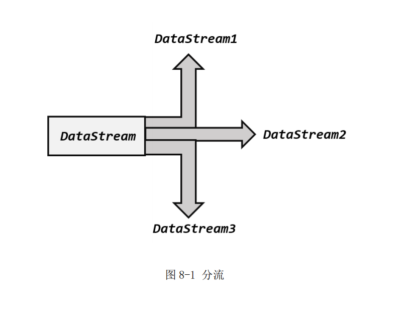

### 8.1.1 简单实现

原始数据流 stream 复制三份，然后对每一份分别做筛选，这明显是不够高效的

算子就把它们都拆分开呢

将收集到的用户行为数据进行一个拆分，根据类型（type）的不同，分为“Mary”的浏览数据、“Bob”的浏览数据

```java
package org.neptune.SplitStream;

import org.apache.flink.api.common.functions.FilterFunction;
import org.apache.flink.streaming.api.datastream.DataStream;
import org.apache.flink.streaming.api.datastream.SingleOutputStreamOperator;
import org.apache.flink.streaming.api.environment.StreamExecutionEnvironment;
import org.neptune.DataStreamAPI.SourceClick;
import org.neptune.pojo.Event;

public class SplitStreamByFilter {
    public static void main(String[] args) throws Exception {
        StreamExecutionEnvironment env = StreamExecutionEnvironment.getExecutionEnvironment();
        env.setParallelism(1);
        SingleOutputStreamOperator<Event> stream = env.addSource(new SourceClick());
        // 筛选 Mary 的浏览行为放入 MaryStream 流中
        DataStream<Event> MaryStream = stream.filter(new FilterFunction<Event>() {
            @Override
            public boolean filter(Event value) throws Exception {
                return value.user.equals("Mary");
            }
        });
        // 筛选 Bob 的购买行为放入 BobStream 流中
        DataStream<Event> BobStream = stream.filter(new FilterFunction<Event>() {
            @Override
            public boolean filter(Event value) throws Exception {
                return value.user.equals("Bob");
            }
        });
        // 筛选其他人的浏览行为放入 elseStream 流中
        DataStream<Event> elseStream = stream.filter(new FilterFunction<Event>() {
            @Override
            public boolean filter(Event value) throws Exception {
                return !value.user.equals("Mary") && !value.user.equals("Bob");
            }
        });
        MaryStream.print("Mary pv");
        BobStream.print("Bob pv");
        elseStream.print("else pv");
        env.execute();
    }

}
```

### 8.1.2 使用侧输出流

定义了两个侧输出流，分别拣选 Mary 的浏览事件和 Bob 的浏览事件；

由于类型已经确定，可以只保留(用户 id, url, 时间戳)这样一个三元组。

剩余的事件则直接输出到主流

```java
package org.neptune.SplitStream;

import org.apache.flink.api.java.tuple.Tuple3;
import org.apache.flink.streaming.api.datastream.SingleOutputStreamOperator;
import org.apache.flink.streaming.api.environment.StreamExecutionEnvironment;
import org.apache.flink.streaming.api.functions.ProcessFunction;
import org.apache.flink.util.Collector;
import org.apache.flink.util.OutputTag;
import org.neptune.DataStreamAPI.SourceClick;
import org.neptune.pojo.Event;

public class SplitStreamByOutputTag {
    // 定义输出标签，侧输出流的数据类型为三元组(user, url, timestamp)
    private static OutputTag<Tuple3<String, String, Long>> MaryTag = new OutputTag<Tuple3<String, String, Long>>("Mary-pv") {
    };
    private static OutputTag<Tuple3<String, String, Long>> BobTag = new OutputTag<Tuple3<String, String, Long>>("Bob-pv") {
    };

    public static void main(String[] args) throws Exception {
        StreamExecutionEnvironment env = StreamExecutionEnvironment.getExecutionEnvironment();
        env.setParallelism(1);
        SingleOutputStreamOperator<Event> stream = env.addSource(new SourceClick());
        SingleOutputStreamOperator<Event> processedStream =
                stream.process(new ProcessFunction<Event, Event>() {
                    @Override
                    public void processElement(Event value, Context ctx, Collector<Event>
                            out) throws Exception {
                        if (value.user.equals("Mary")) {
                            ctx.output(MaryTag, new Tuple3<>(value.user, value.url,
                                    value.timestamp));
                        } else if (value.user.equals("Bob")) {
                            ctx.output(BobTag, new Tuple3<>(value.user, value.url,
                                    value.timestamp));
                        } else {
                            out.collect(value);
                        }
                    }
                });
        processedStream.getSideOutput(MaryTag).print("Mary pv");
        processedStream.getSideOutput(BobTag).print("Bob pv");
        processedStream.print("else");
        env.execute();
    }
}
```

## 8.2 基本合流操作

### 8.2.1 联合（Union）

联合操作要求必须流中的**数据类型必须相同**，合并之后的新流会包括所有流中的元素，数据类型不变。

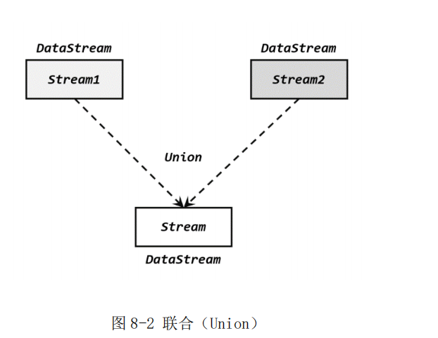

基于 DataStream 直接调用.union()方法，传入其他 DataStream 作为参数，就可以实现流的联合了；

得到的依然是一个 DataStream

```java
stream1.union(stream2, stream3, ...)
```

用 union 将两条流合并后，用一个 ProcessFunction来进行处理，获取当前的水位线进行输出。

我两条流中每输入一个数据，合并之后的流中都会有数据出现；

而水位线只有在两条流中水位线最小值增大的时候，才会真正向前推进。

```java
package org.neptune.SplitStream;

import org.apache.flink.api.common.eventtime.SerializableTimestampAssigner;
import org.apache.flink.api.common.eventtime.WatermarkStrategy;
import org.apache.flink.streaming.api.datastream.SingleOutputStreamOperator;
import org.apache.flink.streaming.api.environment.StreamExecutionEnvironment;
import org.apache.flink.streaming.api.functions.ProcessFunction;
import org.apache.flink.util.Collector;
import org.neptune.pojo.Event;

import java.time.Duration;

public class UnionExample {
    public static void main(String[] args) throws Exception {
        StreamExecutionEnvironment env = StreamExecutionEnvironment.getExecutionEnvironment();
        env.setParallelism(1);

        SingleOutputStreamOperator<Event> stream1 = env.socketTextStream("hadoop102", 7777)
                .map(data -> {
                    String[] field = data.split(",");
                    return new Event(field[0].trim(), field[1].trim(),
                            Long.valueOf(field[2].trim()));
                })
                .assignTimestampsAndWatermarks(WatermarkStrategy.<Event>forBoundedOutOfOrderness(Duration.ofSeconds(2))
                        .withTimestampAssigner(new SerializableTimestampAssigner<Event>() {
                            @Override
                            public long extractTimestamp(Event element, long recordTimestamp) {
                                return element.timestamp;
                            }
                        })
                );
        stream1.print("stream1");
        SingleOutputStreamOperator<Event> stream2 =
                env.socketTextStream("hadoop103", 7777)
                        .map(data -> {
                            String[] field = data.split(",");
                            return new Event(field[0].trim(), field[1].trim(),
                                    Long.valueOf(field[2].trim()));
                        })
                        .assignTimestampsAndWatermarks(WatermarkStrategy.<Event>forBoundedOutOfOrderness(Duration.ofSeconds(5))
                                .withTimestampAssigner(new SerializableTimestampAssigner<Event>() {
                                    @Override
                                    public long extractTimestamp(Event element, long recordTimestamp) {
                                        return element.timestamp;
                                    }
                                })
                        );
        stream2.print("stream2");
        // 合并两条流
        stream1.union(stream2)
                .process(new ProcessFunction<Event, String>() {
                    @Override
                    public void processElement(Event value, Context ctx,
                                               Collector<String> out) throws Exception {
                        out.collect(" 水 位 线 ： " + ctx.timerService().currentWatermark());
                    }
                })
                .print();
        env.execute();
    }
}
```

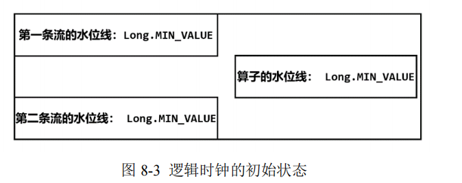

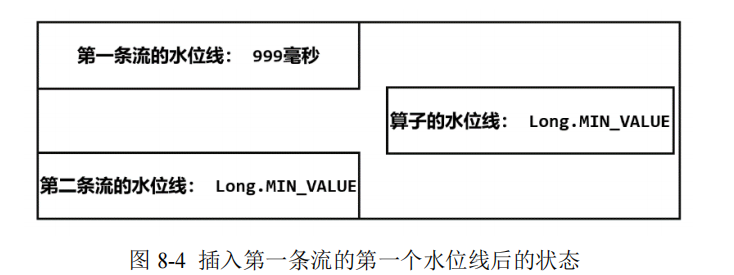

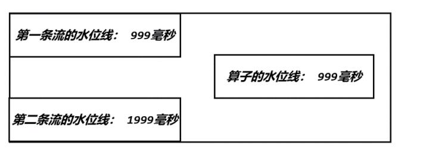

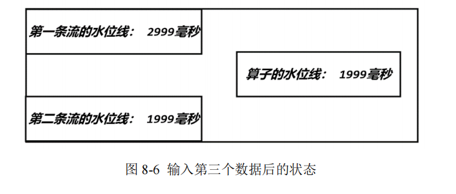

### 8.2.2 连接（Connect）

#### 8.2.2.1 连接流（ConnectedStreams）

**允许流的数据类型不同**

两条流可以保持各自的数据类型、处理方式也可以不同，最终会统一到同一个 DataStream 中

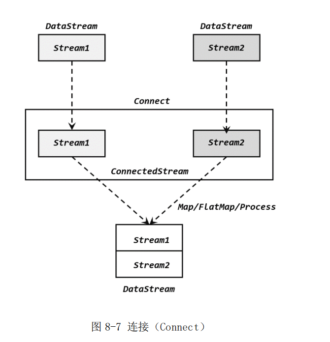

基于一条 DataStream 调用.connect()方法，传入另外一条 DataStream 作为参数，将两条流连接起来，得到一个 ConnectedStreams；

然后再调用同处理方法得到 DataStream。

```java
package org.neptune.SplitStream;

import org.apache.flink.streaming.api.datastream.ConnectedStreams;
import org.apache.flink.streaming.api.datastream.DataStream;
import org.apache.flink.streaming.api.datastream.SingleOutputStreamOperator;
import org.apache.flink.streaming.api.environment.StreamExecutionEnvironment;
import org.apache.flink.streaming.api.functions.co.CoMapFunction;

public class CoMapExample {
    public static void main(String[] args) throws Exception {
        StreamExecutionEnvironment env = StreamExecutionEnvironment.getExecutionEnvironment();
        env.setParallelism(1);
        DataStream<Integer> stream1 = env.fromElements(1, 2, 3);
        DataStream<Long> stream2 = env.fromElements(1L, 2L, 3L);
        ConnectedStreams<Integer, Long> connectedStreams = stream1.connect(stream2);
        SingleOutputStreamOperator<String> result = connectedStreams.map(new CoMapFunction<Integer, Long, String>() {

            @Override
            public String map1(Integer value) {
                return "Integer: " + value;
            }

            @Override
            public String map2(Long value) {
                return "Long: " + value;
            }
        });
        result.print();
        env.execute();
    }
}
```

ConnectedStreams 可以直接调用.keyBy()进行按键分区的操作，得到的还是一个 ConnectedStreams：

```java
connectedStreams.keyBy(keySelector1, keySelector2);
```

ConnectedStreams 进行 keyBy 操作：

把两条流中 key 相同的数据放到一起，然后针对来源的流再做各自处理

在合并之前将两条流分别进行 keyBy，得到的 KeyedStream 再进行连接（connect）操作，效果是一样的。

两条流定义的键的类型必须相同，否则会抛出异常。

#### 8.2.2.2 CoProcessFunction

```java
public abstract class CoProcessFunction<IN1, IN2, OUT> extends AbstractRichFunction {
...
public abstract void processElement1(IN1 value, Context ctx, Collector<OUT> out) throws Exception;
public abstract void processElement2(IN2 value, Context ctx, Collector<OUT> out) throws Exception;
public void onTimer(long timestamp, OnTimerContext ctx, Collector<OUT> out) throws Exception {}
public abstract class Context {...}
...
}
```

实现一个实时对账的需求：

app 的支付操作和第三方的支付操作的一个双流 Join。App 的支付事件和第三方的支付事件将会互相等待 5 秒钟，如果等不来对应的支付事件，那么就输出报警信息。

* 声明两个状态变量分别用来保存 App 的支付信息和第三方的支付信息。

* App 的支付信息到达以后，会检查对应的第三方支付信息是否已经先到达（先到达会保存在对应的状态变量中），如果已经到达了，那么对账成功，直接输出对账成功的信息，并将保存第三方支付消息的状态变量清空。

* 如果 App 对应的第三方支付信息没有到来，那么我们会注册一个 5 秒钟之后的定时器，也就是说等待第三方支付事件 5 秒钟。当定时器触发时，检查保存app 支付信息的状态变量是否还在，如果还在，说明对应的第三方支付信息没有到来，输出报警信息。

```java
package org.neptune.SplitStream;

import org.apache.flink.api.common.eventtime.SerializableTimestampAssigner;
import org.apache.flink.api.common.eventtime.WatermarkStrategy;
import org.apache.flink.api.common.state.ValueState;
import org.apache.flink.api.common.state.ValueStateDescriptor;
import org.apache.flink.api.common.typeinfo.Types;
import org.apache.flink.api.java.tuple.Tuple3;
import org.apache.flink.api.java.tuple.Tuple4;
import org.apache.flink.configuration.Configuration;
import org.apache.flink.streaming.api.datastream.SingleOutputStreamOperator;
import org.apache.flink.streaming.api.environment.StreamExecutionEnvironment;
import org.apache.flink.streaming.api.functions.co.CoProcessFunction;
import org.apache.flink.util.Collector;

// 实时对账
public class BillCheckExample {
    public static void main(String[] args) throws Exception {
        StreamExecutionEnvironment env = StreamExecutionEnvironment.getExecutionEnvironment();
        env.setParallelism(1);
        // 来自 app 的支付日志
        SingleOutputStreamOperator<Tuple3<String, String, Long>> appStream =
                env.fromElements(
                        Tuple3.of("order-1", "app", 1000L),
                        Tuple3.of("order-2", "app", 2000L)
                ).assignTimestampsAndWatermarks(WatermarkStrategy.<Tuple3<String,
                                String, Long>>forMonotonousTimestamps()
                        .withTimestampAssigner(new SerializableTimestampAssigner<Tuple3<String, String, Long>>() {
                            @Override
                            public long extractTimestamp(Tuple3<String, String, Long>
                                                                 element, long recordTimestamp) {
                                return element.f2;
                            }
                        })
                );
        // 来自第三方支付平台的支付日志
        SingleOutputStreamOperator<Tuple4<String, String, String, Long>>
                thirdpartStream = env.fromElements(
                Tuple4.of("order-1", "third-party", "success", 3000L),
                Tuple4.of("order-3", "third-party", "success", 4000L)
        ).assignTimestampsAndWatermarks(WatermarkStrategy.<Tuple4<String,
                        String, String, Long>>forMonotonousTimestamps()
                .withTimestampAssigner(new SerializableTimestampAssigner<Tuple4<String, String, String, Long>>() {
                    @Override
                    public long extractTimestamp(Tuple4<String, String, String, Long>
                                                         element, long recordTimestamp) {
                        return element.f3;
                    }
                })
        );
        // 检测同一支付单在两条流中是否匹配，不匹配就报警
        appStream.connect(thirdpartStream)
                .keyBy(data -> data.f0, data -> data.f0)
                .process(new OrderMatchResult())
                .print();
        env.execute();
    }

    // 自定义实现 CoProcessFunction
    public static class OrderMatchResult extends CoProcessFunction<Tuple3<String,
            String, Long>, Tuple4<String, String, String, Long>, String> {
        // 定义状态变量，用来保存已经到达的事件
        private ValueState<Tuple3<String, String, Long>> appEventState;
        private ValueState<Tuple4<String, String, String, Long>> thirdPartyEventState;

        @Override
        public void open(Configuration parameters) throws Exception {
            appEventState = getRuntimeContext().getState(
                    new ValueStateDescriptor<Tuple3<String, String, Long>>
                            ("app-event", Types.TUPLE(Types.STRING, Types.STRING, Types.LONG))
            );
            thirdPartyEventState = getRuntimeContext().getState(
                    new ValueStateDescriptor<Tuple4<String, String, String, Long>>
                            ("thirdparty-event", Types.TUPLE(Types.STRING, Types.STRING,
                            Types.STRING, Types.LONG))
            );
        }

        @Override
        public void processElement1(Tuple3<String, String, Long> value, Context ctx,
                                    Collector<String> out) throws Exception {
            // 看另一条流中事件是否来过
            if (thirdPartyEventState.value() != null) {
                out.collect(" 对 账 成 功 ： " + value + " " +
                        thirdPartyEventState.value());
                // 清空状态
                thirdPartyEventState.clear();
            } else {
                // 更新状态
                appEventState.update(value);
                // 注册一个 5 秒后的定时器，开始等待另一条流的事件
                ctx.timerService().registerEventTimeTimer(value.f2 + 5000L);
            }
        }

        @Override
        public void processElement2(Tuple4<String, String, String, Long> value,
                                    Context ctx, Collector<String> out) throws Exception {
            if (appEventState.value() != null) {
                out.collect("对账成功：" + appEventState.value() + " " + value);
                // 清空状态
                appEventState.clear();
            } else {
                // 更新状态
                thirdPartyEventState.update(value);
                // 注册一个 5 秒后的定时器，开始等待另一条流的事件
                ctx.timerService().registerEventTimeTimer(value.f3 + 5000L);
            }
        }

        @Override
        public void onTimer(long timestamp, OnTimerContext ctx, Collector<String>
                out) throws Exception {
            // 定时器触发，判断状态，如果某个状态不为空，说明另一条流中事件没来
            if (appEventState.value() != null) {
                out.collect("对账失败：" + appEventState.value() + " " + "第三方支付 平台信息未到");
            }
            if (thirdPartyEventState.value() != null) {
                out.collect("对账失败：" + thirdPartyEventState.value() + " " + "app 信息未到");
            }
            appEventState.clear();
            thirdPartyEventState.clear();
        }
    }
}
```

#### 8.2.2.3 广播连接流（BroadcastConnectedStream）

DataStream 调用.connect()方法时，传入“广播流”（BroadcastStream）参数

```java
MapStateDescriptor<String, Rule> ruleStateDescriptor = new MapStateDescriptor<>(...);

BroadcastStream<Rule> ruleBroadcastStream = ruleStream.broadcast(ruleStateDescriptor);

DataStream<String> output = stream
.connect(ruleBroadcastStream)
.process( new BroadcastProcessFunction<>() {...} );
```

BroadcastProcessFunction是一个抽象类，需要实现两个方法，针对合并的两条流中元素分别定义处理操作。

一条流是正常处理数据，而另一条流则是要用新规则来更新广播状态

```java
public abstract class BroadcastProcessFunction<IN1, IN2, OUT> extends BaseBroadcastProcessFunction {
...
 public abstract void processElement(IN1 value, ReadOnlyContext ctx, Collector<OUT> out) throws Exception;
 public abstract void processBroadcastElement(IN2 value, Context ctx, Collector<OUT> out) throws Exception;
...
}
```

## 8.3 基于时间的合流——双流联结（Join）

### 8.3.1 窗口联结（Window Join）

可以定义时间窗口，并将两条流中共享一个公共键（key）的数据放在窗口中进行配对处理。

#### 8.3.1.1 窗口联结的调用

* 首先需要调用 DataStream 的.join()方法来合并两条流，得到一个 JoinedStreams；

* 接着通过.where()和.equalTo()方法指定两条流中联结的 key；
* 然后通过.window()开窗口，并调用.apply()传入联结窗口函数进行处理计算。
* 在.window()和.apply()之间也可以调用可选 API 去做一些自定义，比如用.trigger()定义触发器，用.allowedLateness()定义允许延迟时间

```java
stream1.join(stream2)
 .where(<KeySelector>) //指定第一条流中的 key
 .equalTo(<KeySelector>) //指定第二条流中的 key
 .window(<WindowAssigner>) //传入窗口分配器，
 .apply(<JoinFunction>)//实现了一个特殊的窗口函数
```

JoinFunciton 不是真正的“窗口函数”，它只是定义了窗口函数在调用时对匹配数据的具体处理逻辑

JoinFunction 是一个函数类接口，使用时需要实现内部的.join()方法。

join()方法有两个参数，分别表示两条流中成对匹配的数据

```java
public interface JoinFunction<IN1, IN2, OUT> extends Function, Serializable {
 OUT join(IN1 first, IN2 second) throws Exception;
}
```

#### 8.3.1.2 窗口联结的处理流程

1. 两条流的数据到来之后，首先会按照 key 分组、进入对应的窗口中存储

2. 当到达窗口结束时间时，算子会先统计出窗口内两条流的数据的所有组合，对两条流中的数据做一个笛卡尔积

3. 然后进行遍历，把每一对匹配的数据，作为参数(first，second)传入 JoinFunction 的.join()方法进行计算处理

4. 窗口中每有一对数据成功联结匹配，JoinFunction 的.join()方法就会被调用一次，并输出一个结果。

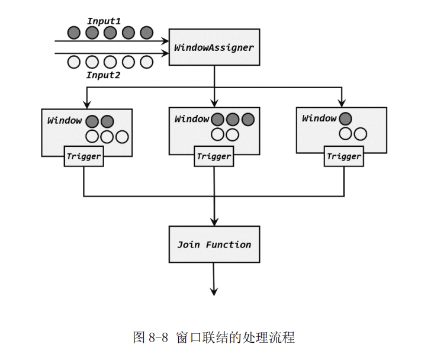

#### 8.3.1.3 窗口联结实例

统计用户不同行为之间的转化，按照用户 ID 进行分组后再合并，以固定时间周期（此处5秒）来统计

```java
package org.neptune.SplitStream;

import org.apache.flink.api.common.eventtime.SerializableTimestampAssigner;
import org.apache.flink.api.common.eventtime.WatermarkStrategy;
import org.apache.flink.api.common.functions.JoinFunction;
import org.apache.flink.api.java.tuple.Tuple2;
import org.apache.flink.streaming.api.datastream.DataStream;
import org.apache.flink.streaming.api.environment.StreamExecutionEnvironment;
import org.apache.flink.streaming.api.windowing.assigners.TumblingEventTimeWindows;
import org.apache.flink.streaming.api.windowing.time.Time;

// 基于窗口的 join
public class WindowJoinExample {
    public static void main(String[] args) throws Exception {
        StreamExecutionEnvironment env = StreamExecutionEnvironment.getExecutionEnvironment();
        env.setParallelism(1);
        DataStream<Tuple2<String, Long>> stream1 = env
                .fromElements(
                        Tuple2.of("a", 1000L),
                        Tuple2.of("b", 1000L),
                        Tuple2.of("a", 2000L),
                        Tuple2.of("b", 2000L)
                )
                .assignTimestampsAndWatermarks(
                        WatermarkStrategy
                                .<Tuple2<String, Long>>forMonotonousTimestamps()
                                .withTimestampAssigner(
                                        new SerializableTimestampAssigner<Tuple2<String, Long>>() {
                                            @Override
                                            public long extractTimestamp(Tuple2<String,
                                                    Long> stringLongTuple2, long l) {
                                                return stringLongTuple2.f1;
                                            }
                                        }
                                )
                );
        DataStream<Tuple2<String, Long>> stream2 = env
                .fromElements(
                        Tuple2.of("a", 3000L),
                        Tuple2.of("b", 3000L),
                        Tuple2.of("a", 4000L),
                        Tuple2.of("b", 4000L)
                )
                .assignTimestampsAndWatermarks(
                        WatermarkStrategy
                                .<Tuple2<String, Long>>forMonotonousTimestamps()
                                .withTimestampAssigner(
                                        new SerializableTimestampAssigner<Tuple2<String, Long>>() {
                                            @Override
                                            public long extractTimestamp(Tuple2<String,
                                                    Long> stringLongTuple2, long l) {
                                                return stringLongTuple2.f1;
                                            }
                                        }
                                )
                );
        stream1.join(stream2)
                .where(r -> r.f0)
                .equalTo(r -> r.f0)
                .window(TumblingEventTimeWindows.of(Time.seconds(5)))
                .apply(new JoinFunction<Tuple2<String, Long>, Tuple2<String, Long>,
                        String>() {
                    @Override
                    public String join(Tuple2<String, Long> left, Tuple2<String,
                            Long> right) throws Exception {
                        return left + "=>" + right;
                    }
                })
                .print();
        env.execute();
    }
}
```

### 8.3.2 间隔联结（Interval Join）

#### 8.3.2.1 间隔联结的原理

给定两个时间点，分别叫作间隔的“上界”（upperBound）和“下界”（lowerBound）

对于一条流 A中的任意一个数据元素 a，就可以开辟一段时间间隔，作为可以匹配另一条流数据的“窗口”范围：

[a.timestamp + lowerBound, a.timestamp + upperBound]

对于另一条流B中的数据元素 b，如果它的时间戳落在了这个区间范围内，a 和 b 就可以成功配对

所以匹配的条件为：

a.timestamp + lowerBound <= b.timestamp <= a.timestamp + upperBound

做间隔联结的两条流 A 和 B，也必须基于相同的 key

流 B 中的数据可以不只在一个区间内被匹配

下界 lowerBound应该小于等于上界 upperBound，两者都可正可负；间隔联结目前只支持事件时间语义。

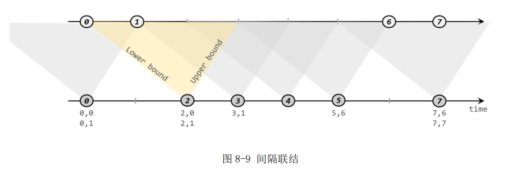

#### 8.3.2.2 间隔联结的调用

```java
stream1
 .keyBy(<KeySelector>)
 .intervalJoin(stream2.keyBy(<KeySelector>))//两者的 key 类型应该一致
 .between(Time.milliseconds(-2), Time.milliseconds(1)) //指定间隔的上下界
 .process (new ProcessJoinFunction<Integer, Integer, String(){
 @Override
 public void processElement(Integer left, Integer right, Context ctx, Collector<String> out) {
 out.collect(left + "," + right);//left 指第一条流中的数据，right 指第二条流中的数据
 }
 });
```

#### 8.3.2.3 间隔联结实例

有两条流，一条是下订单的流，一条是浏览数据的流。

针对同一个用户。对下订单的事件和最近十分钟的浏览数据进行一个联结查询。

```java
package org.neptune.SplitStream;

import org.apache.flink.api.common.eventtime.SerializableTimestampAssigner;
import org.apache.flink.api.common.eventtime.WatermarkStrategy;
import org.apache.flink.api.java.tuple.Tuple3;
import org.apache.flink.streaming.api.datastream.SingleOutputStreamOperator;
import org.apache.flink.streaming.api.environment.StreamExecutionEnvironment;
import org.apache.flink.streaming.api.functions.co.ProcessJoinFunction;
import org.apache.flink.streaming.api.windowing.time.Time;
import org.apache.flink.util.Collector;
import org.neptune.pojo.Event;

// 基于间隔的 join
public class IntervalJoinExample {

    public static void main(String[] args) throws Exception {

        StreamExecutionEnvironment env = StreamExecutionEnvironment.getExecutionEnvironment();
        env.setParallelism(1);
        SingleOutputStreamOperator<Tuple3<String, String, Long>> orderStream =
                env.fromElements(
                        Tuple3.of("Mary", "order-1", 5000L),
                        Tuple3.of("Alice", "order-2", 5000L),
                        Tuple3.of("Bob", "order-3", 20000L),
                        Tuple3.of("Alice", "order-4", 20000L),
                        Tuple3.of("Cary", "order-5", 51000L)
                ).assignTimestampsAndWatermarks(WatermarkStrategy.<Tuple3<String,
                                String, Long>>forMonotonousTimestamps()
                        .withTimestampAssigner(new SerializableTimestampAssigner<Tuple3<String, String, Long>>() {
                            @Override
                            public long extractTimestamp(Tuple3<String, String, Long>
                                                                 element, long recordTimestamp) {
                                return element.f2;
                            }
                        })
                );
        SingleOutputStreamOperator<Event> clickStream = env.fromElements(
                new Event("Bob", "./cart", 2000L),
                new Event("Alice", "./prod?id=100", 3000L),
                new Event("Alice", "./prod?id=200", 3500L),
                new Event("Bob", "./prod?id=2", 2500L),
                new Event("Alice", "./prod?id=300", 36000L),
                new Event("Bob", "./home", 30000L),
                new Event("Bob", "./prod?id=1", 23000L),
                new Event("Bob", "./prod?id=3", 33000L)
        ).assignTimestampsAndWatermarks(WatermarkStrategy.<Event>forMonotonousTimestamps()
                .withTimestampAssigner(new SerializableTimestampAssigner<Event>() {
                    @Override
                    public long extractTimestamp(Event element, long recordTimestamp) {
                        return element.timestamp;
                    }
                })
        );
        orderStream.keyBy(data -> data.f0)
                .intervalJoin(clickStream.keyBy(data -> data.user))
                .between(Time.seconds(-5), Time.seconds(10))
                .process(new ProcessJoinFunction<Tuple3<String, String, Long>,
                        Event, String>() {
                    @Override
                    public void processElement(Tuple3<String, String, Long> left,
                                               Event right, Context ctx, Collector<String> out) throws Exception {
                        out.collect(right + " => " + left);
                    }
                })
                .print();
        env.execute();
    }
}
```

### 8.3.3 窗口同组联结（Window CoGroup）

```java
stream1.coGroup(stream2)
 .where(<KeySelector>)
 .equalTo(<KeySelector>)
 .window(TumblingEventTimeWindows.of(Time.hours(1)))
 .apply(<CoGroupFunction>)
```

直接把收集到的所有数据一次性传入，**要怎样配对完全是自定义的**

比 join 更加通用，不仅可以实现类似 SQL 中的“内连接”（inner join）、左外连接（left outer join）、右外连接（right outer join）和全外连接（full outer join）。

窗口 join 的底层，也是通过 coGroup 来实现的。

```java
public interface CoGroupFunction<IN1, IN2, O> extends Function, Serializable {
 void coGroup(Iterable<IN1> first, Iterable<IN2> second, Collector<O> out) throws Exception;
}
```

```java
package org.neptune.SplitStream;

import org.apache.flink.api.common.eventtime.SerializableTimestampAssigner;
import org.apache.flink.api.common.eventtime.WatermarkStrategy;
import org.apache.flink.api.common.functions.CoGroupFunction;
import org.apache.flink.api.java.tuple.Tuple2;
import org.apache.flink.streaming.api.datastream.DataStream;
import org.apache.flink.streaming.api.environment.StreamExecutionEnvironment;
import org.apache.flink.streaming.api.windowing.assigners.TumblingEventTimeWindows;
import org.apache.flink.streaming.api.windowing.assigners.TumblingEventTimeWindows;
import org.apache.flink.streaming.api.windowing.time.Time;
import org.apache.flink.util.Collector;

// 基于窗口的 join
public class CoGroupExample {
    public static void main(String[] args) throws Exception {
        StreamExecutionEnvironment env = StreamExecutionEnvironment.getExecutionEnvironment();
        env.setParallelism(1);
        DataStream<Tuple2<String, Long>> stream1 = env
                .fromElements(
                        Tuple2.of("a", 1000L),
                        Tuple2.of("b", 1000L),
                        Tuple2.of("a", 2000L),
                        Tuple2.of("b", 2000L)
                )
                .assignTimestampsAndWatermarks(
                        WatermarkStrategy
                                .<Tuple2<String, Long>>forMonotonousTimestamps()
                                .withTimestampAssigner(
                                        new SerializableTimestampAssigner<Tuple2<String, Long>>() {
                                            @Override
                                            public long extractTimestamp(Tuple2<String,
                                                    Long> stringLongTuple2, long l) {
                                                return stringLongTuple2.f1;
                                            }
                                        }
                                )
                );
        DataStream<Tuple2<String, Long>> stream2 = env
                .fromElements(
                        Tuple2.of("a", 3000L),
                        Tuple2.of("b", 3000L),
                        Tuple2.of("a", 4000L),
                        Tuple2.of("b", 4000L)
                )
                .assignTimestampsAndWatermarks(
                        WatermarkStrategy
                                .<Tuple2<String, Long>>forMonotonousTimestamps()
                                .withTimestampAssigner(
                                        new SerializableTimestampAssigner<Tuple2<String, Long>>() {
                                            @Override
                                            public long extractTimestamp(Tuple2<String,
                                                    Long> stringLongTuple2, long l) {
                                                return stringLongTuple2.f1;
                                            }
                                        }
                                )
                );
        stream1.coGroup(stream2)
                .where(r -> r.f0)
                .equalTo(r -> r.f0)
                .window(TumblingEventTimeWindows.of(Time.seconds(5)))
                .apply(new CoGroupFunction<Tuple2<String, Long>, Tuple2<String, Long>, String>() {
                    @Override
                    public void coGroup(Iterable<Tuple2<String, Long>> iter1,
                                        Iterable<Tuple2<String, Long>> iter2, Collector<String> collector)
                            throws Exception {
                        collector.collect(iter1 + "=>" + iter2);
                    }
                })
                .print();
        env.execute();
    }
}
```

## 8.4 本章总结

分流操作可以通过处理函数的侧输出流（side output）很容易地实现；而合流则提供不同层级的各种 API。

* union 可以对多条流进行合并，数据类型必须一致；

* connect 只能连接两条流，数据类型可以不同。

* connect 提供了最底层的处理函数（process function）接口，自定义的合流操作。

联结（join）操作，基于某个时间段的双流合并，是需求特化之后的高层级 API：

* 窗口联结（window join）：基于时间窗口的操作
* 间隔联结（interval join）：基于每个数据元素截取对应的一个时间段来做联结，处理操作需调用.process()
* 窗口同组联结（window coGroup）：基于时间窗口的操作

# 9 状态编程

## 9.1 Flink 中的状态

### 9.1.1 有状态算子

在 Flink 中，算子任务可以分为无状态和有状态两种情况

计算时不依赖其他数据，就都属于无状态的算子。（map、filter、flatMap）

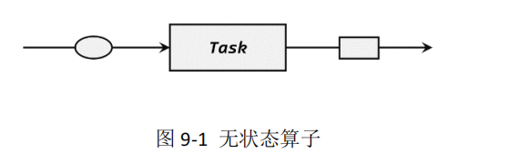

有状态的算子任务，除当前数据之外，还需要一些其他数据来得到计算结果。这里的“其他数据”，就是所谓的状态（state）

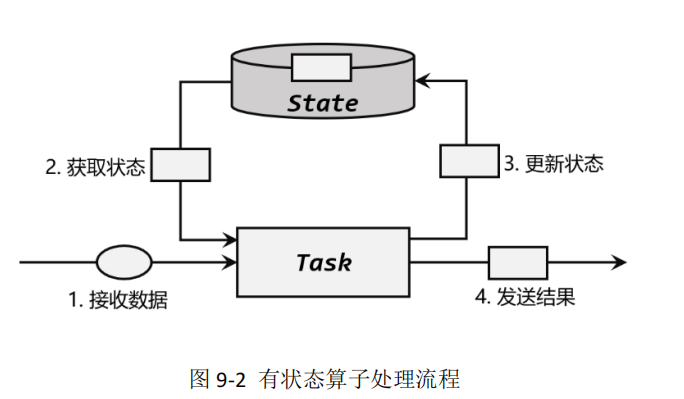

有状态算子的一般处理流程，具体步骤如下。
* 算子任务接收到上游发来的数据；
* 获取当前状态；
* 根据业务逻辑进行计算，更新状态；
* 得到计算结果，输出发送到下游任务。

### 9.1.2 状态的管理

Flink 将状态直接保存在内存中来保证性能，并通过分布式扩展来提高吞吐量。

Flink 有一套完整的状态管理机制，将底层一些核心功能全部封装起来，包括状态的高效存储和访问、持久化保存和故障恢复，以及资源扩展时的调整。

* 状态的访问权限。
* 容错性，也就是故障后的恢复。
* 横向扩展性。

### 9.1.3 状态的分类

#### 9.1.3.1 托管状态（Managed State）和原始状态（Raw State）

托管状态就是由 Flink 统一管理的，只要调接口就可以；

原始状态则是自定义的，相当于就是开辟了一块内存，需要自己管理，实现状态的序列化和故障恢复。

只有在遇到托管状态无法实现的特殊需求时，才会考虑使用原始状态

#### 9.1.3.2 算子状态（Operator State）和按键分区状态（Keyed State）

按键分区之后，任务所进行的所有计算都应该只针对当前 key 有效，所以状态也应该按照 key 彼此隔离。

Keyed State 和 Operator State，都是在本地实例上维护的，每个并行子任务维护着对应的状态，算子的子任务之间状态不共享

**算子状态（Operator State）**

算子状态可以用在所有算子上，使用的时候其实就跟一个本地变量没什么区别——因为本地变量的作用域也是当前任务实例。在使用时，还需进一步实现 CheckpointedFunction 接口。

**算子状态对于同一任务而言是共享的。**


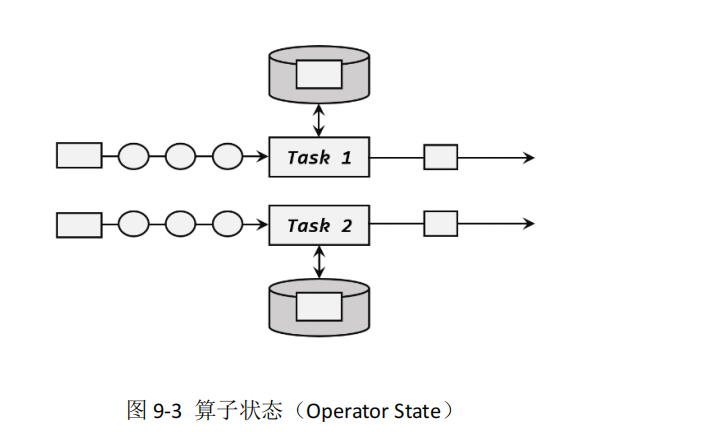

**按键分区状态（Keyed State）**

状态是根据输入流中定义的键（key）来维护和访问的，只能定义在按键分区流（KeyedStream）中， keyBy 之后才可以使用

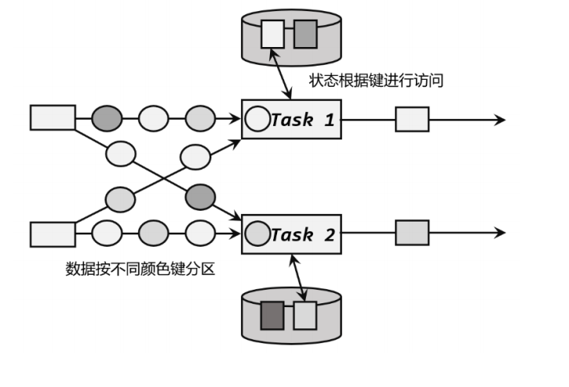

可以通过富函数类（Rich Function）来自定义 Keyed State，只要提供了富函数类接口的算子，也都可以使用 Keyed State。

即使是 map、filter 这样无状态的基本转换算子，也可以通过富函数类“追加”Keyed State，或者实现 CheckpointedFunction 接口来定义 Operator State，Flink 中所有的算子都可以是有状态的

## 9.2 按键分区状态（Keyed State）

### 9.2.1 基本概念和特点

按键分区状态（Keyed State）是任务按照键（key）来访问和维护的状态，以 key 为作用范围进行隔离

在底层，Keyed State 类似于一个分布式的映射（map）数据结构，所有的状态会根据 key 保存成键值对（key-value）的形式。这样当一条数据到来时，任务就会自动将状态的访问范围限定为当前数据的 key，从 map 存储中读取出对应的状态值。所以具有相同 key 的所有数据都会到访问相同的状态，而不同 key 的状态之间是彼此隔离的。

在应用的并行度改变时，状态也需要随之进行重组。一个并行子任务中的不同 key 对应的 Keyed State可以进一步组成所谓的键组（key groups），每一组都对应着一个并行子任务。

键组是 Flink 重新分配 Keyed State 的单元，键组的数量就等于定义的最大并行度。当算子并行度发生改变时，Keyed State 就会按照当前的并行度重新平均分配，保证运行时各个子任务的负载相同。

**使用 Keyed State 必须基于 KeyedStream**

### 9.2.2 支持的结构类型

#### 9.2.2.1 值状态（ValueState）

状态中只保存一个“值”（value）

```java
public interface ValueState<T> extends State {
	T value() throws IOException;
	void update(T value) throws IOException;
}
```

* T value()：获取当前状态的值；

* update(T value)：对状态进行更新，传入的参数 value 就是要覆写的状态值。

使用时需要创建一个状态描述器（StateDescriptor）提供状态的基本信息，让运行时上下文清楚到底是哪个状态

```java
public ValueStateDescriptor(String name, Class<T> typeClass) {
	 super(name, typeClass, null);
}
```

需要传入状态的名称和类型，有了这个描述器，运行时环境就可以获取到状态的控制句柄（handler）了。

#### 9.2.2.2 列表状态（ListState）

需要保存的数据，以列表（List）的形式组织起来。

ListState<T>

ListState 也提供了一系列的方法来操作状态，使用方式与一般的 List 非常相似。

* Iterable<T> get()：获取当前的列表状态，返回的是一个可迭代类型 Iterable<T>；

* update(List<T> values)：传入一个列表 values，直接对状态进行覆盖；

* add(T value)：在状态列表中添加一个元素 value；

* addAll(List<T> values)：向列表中添加多个元素，以列表 values 形式传入。

类似地，ListState 的状态描述器就叫作 ListStateDescriptor，用法跟 ValueStateDescriptor完全一致。

#### 9.2.2.3 映射状态（MapState）

把一些键值对（key-value）作为状态整体保存起来，可以认为就是一组 key-value 映射的列表

MapState<UK, UV> ：泛型表示保存的 key和 value 的类型。

*  UV get(UK key)：传入一个 key 作为参数，查询对应的 value 值；
*  put(UK key, UV value)：传入一个键值对，更新 key 对应的 value 值；
*  putAll(Map<UK, UV> map)：将传入的映射 map 中所有的键值对，全部添加到映射状态中；
*  remove(UK key)：将指定 key 对应的键值对删除；
*  boolean contains(UK key)：判断是否存在指定的 key，返回一个 boolean 值。
另外，MapState 也提供了获取整个映射相关信息的方法：
*  Iterable<Map.Entry<UK, UV>> entries()：获取映射状态中所有的键值对；
*  Iterable<UK> keys()：获取映射状态中所有的键（key），返回一个可迭代 Iterable 类型；
*  Iterable<UV> values()：获取映射状态中所有的值（value），返回一个可迭代 Iterable
类型；
*  boolean isEmpty()：判断映射是否为空，返回一个 boolean 值。

#### 9.2.2.4 归约状态（ReducingState）

对添加进来的所有数据进行归约，将归约聚合之后的值作为状态保存下来。

ReducintState<T> 调用的方法类似于 ListState，保存的只是一个聚合值，调用.add()方法时，是把新数据和之前的状态进行归约，并用得到的结果更新状态。

```java
public ReducingStateDescriptor(String name, ReduceFunction<T> reduceFunction, Class<T> typeClass) {...}
```

 ReduceFunction是定义了归约聚合逻辑的，另外两个参数则是状态的名称和类型

#### 9.2.2.5 聚合状态（AggregatingState）

聚合状态也是一个值，用来保存添加进来的所有数据的聚合结果。

在描述器中传入一个更加一般化的聚合函数（AggregateFunction）定义聚合逻辑；

通过一个累加器（Accumulator）来表示状态，状态类型可以跟添加进来的数据类型完全不同，使用更加灵活。

### 9.2.3 代码实现

算子在使用状态前首先需要“注册”，告诉 Flink 当前上下文中定义状态的信息，这样运行时的 Flink 才能知道算子有哪些状态。

状态的注册，主要是通过“状态描述器”（StateDescriptor）来实现的。状态描述器中最重要的内容，就是状态的名称（name）和类型（type）。我们知道 Flink 中的状态，可以认为是加了一些复杂操作的内存中的变量；而当我们在代码中声明一个局部变量时，都需要指定变量类型和名称，名称就代表了变量在内存中的地址，类型则指定了占据内存空间的大小。

一旦指定了名称和类型，Flink 就可以在运行时准确地在内存中找到对应的状态，进而返回状态对象供我们使用了。

在一个算子中，我们也可以定义多个状态，只要它们的名称不同就可以了。

状态描述器中还可能需要传入一个用户自定义函数（UDF），用来说明处理逻辑，如ReduceFunction 和 AggregateFunction。

以 ValueState 为例，我们可以定义值状态描述器如下：

```java
//定义一个叫作“my state”的长整型 ValueState 的描述器。
ValueStateDescriptor<Long> descriptor = new ValueStateDescriptor<>(
	"my state", // 状态名称
	Types.LONG // 状态类型
);
```

首先定义出状态描述器；

然后调用.getRuntimeContext()方法获取运行时上下文；

再调用 RuntimeContext 的获取状态的方法，将状态描述器传入，就可以得到对应的状态了。

在富函数中，调用.getRuntimeContext()方法获取到运行时上下文之后，RuntimeContext 有以下几个获取状态的方法：

```java
ValueState<T> getState(ValueStateDescriptor<T>)
MapState<UK, UV> getMapState(MapStateDescriptor<UK, UV>)
ListState<T> getListState(ListStateDescriptor<T>)
ReducingState<T> getReducingState(ReducingStateDescriptor<T>)
AggregatingState<IN, OUT> getAggregatingState(AggregatingStateDescriptor<IN, ACC, OUT>)
```

对于不同结构类型的状态，只要传入对应的描述器、调用对应的方法就可以了。

获取到状态对象之后，就可以调用它们各自的方法进行读写操作了。

所有类型的状态都有一个方法.clear()，用于清除当前状态。

```java
 public static class MyFlatMapFunction extends RichFlatMapFunction<Long, String> {
        // 声明状态
        private transient ValueState<Long> state;

        @Override
        public void open(Configuration config) {
            // 在 open 生命周期方法中获取状态
            ValueStateDescriptor<Long> descriptor = new ValueStateDescriptor<>(
                    "my state", // 状态名称
                    Types.LONG // 状态类型
            );
            state = getRuntimeContext().getState(descriptor);
        }

        @Override
        public void flatMap(Long input, Collector<String> out) throws Exception {
            // 访问状态
            Long currentState = state.value();
            currentState += 1; // 状态数值加 1
            // 更新状态
            state.update(currentState);
            if (currentState >= 100) {
                out.collect("state: "+currentState);
                state.clear(); // 清空状态，只会清除当前 key 对应的状态
            }
        }
    }
```

状态不一定都存储在内存中，也可以放在磁盘或其他地方，具体的位置是由一个可配置的组件来管理的，这个组件叫作“状态后端”（State Backend）

#### 9.2.3.1 值状态（ValueState）

使用用户 id 来进行分流，然后分别统计每个用户的 pv 数据

注册一个定时器，用来隔一段时间发送 pv 的统计结果

定义一个用来保存定时器时间戳的值状态变量。当定时器触发并向下游发送数据以后，便清空储存定时器时间戳的状态变量，这样当新的数据到来时，发现并没有定时器存在，就可以注册新的定时器了，注册完定时器之后将定时器的时间戳继续保存在状态变量中。

```java
package org.neptune.State;

import org.apache.flink.api.common.eventtime.SerializableTimestampAssigner;
import org.apache.flink.api.common.eventtime.WatermarkStrategy;
import org.apache.flink.api.common.state.ValueState;
import org.apache.flink.api.common.state.ValueStateDescriptor;
import org.apache.flink.configuration.Configuration;
import org.apache.flink.streaming.api.datastream.SingleOutputStreamOperator;
import org.apache.flink.streaming.api.environment.StreamExecutionEnvironment;
import org.apache.flink.streaming.api.functions.KeyedProcessFunction;
import org.apache.flink.util.Collector;
import org.neptune.DataStreamAPI.SourceClick;
import org.neptune.pojo.Event;

public class PeriodicPvExample {
    public static void main(String[] args) throws Exception {
        StreamExecutionEnvironment env = StreamExecutionEnvironment.getExecutionEnvironment();
        env.setParallelism(1);
        SingleOutputStreamOperator<Event> stream = env.addSource(new SourceClick())
                .assignTimestampsAndWatermarks(WatermarkStrategy.<Event>forMonotonousTimestamps()
                        .withTimestampAssigner(new SerializableTimestampAssigner<Event>() {
                            @Override
                            public long extractTimestamp(Event element, long
                                    recordTimestamp) {
                                return element.timestamp;
                            }
                        })
                );
        stream.print("input");
        // 统计每个用户的 pv，隔一段时间（10s）输出一次结果
        stream.keyBy(data -> data.user)
                .process(new PeriodicPvResult())
                .print();
        env.execute();
    }

    // 注册定时器，周期性输出 pv
    public static class PeriodicPvResult extends KeyedProcessFunction<String, Event, String> {
        // 定义两个状态，保存当前 pv 值，以及定时器时间戳
        ValueState<Long> countState;
        ValueState<Long> timerTsState;

        @Override
        public void open(Configuration parameters) throws Exception {
            countState = getRuntimeContext().getState(new ValueStateDescriptor<Long>("count", Long.class));
            timerTsState = getRuntimeContext().getState(new ValueStateDescriptor<Long>("timerTs", Long.class));
        }

        @Override
        public void processElement(Event value, Context ctx, Collector<String> out)
                throws Exception {
            // 更新 count 值
            Long count = countState.value();
            if (count == null) {
                countState.update(1L);
            } else {
                countState.update(count + 1);
            }
            // 注册定时器
            if (timerTsState.value() == null) {
                ctx.timerService().registerEventTimeTimer(value.timestamp + 10 * 1000L);
                timerTsState.update(value.timestamp + 10 * 1000L);
            }
        }

        @Override
        public void onTimer(long timestamp, OnTimerContext ctx, Collector<String> out) throws Exception {
            out.collect(ctx.getCurrentKey() + " pv: " + countState.value());
            // 清空状态
            timerTsState.clear();
        }
    }
}
```

#### 9.2.3.2 列表状态（ListState）

两条流的全量 Join：

```sql
SELECT * FROM A INNER JOIN B WHERE A.id = B.id；
```

```java
package org.neptune.State;

import org.apache.flink.api.common.eventtime.SerializableTimestampAssigner;
import org.apache.flink.api.common.eventtime.WatermarkStrategy;
import org.apache.flink.api.common.state.ListState;
import org.apache.flink.api.common.state.ListStateDescriptor;
import org.apache.flink.api.common.typeinfo.Types;
import org.apache.flink.api.java.tuple.Tuple3;
import org.apache.flink.configuration.Configuration;
import org.apache.flink.streaming.api.datastream.SingleOutputStreamOperator;
import org.apache.flink.streaming.api.environment.StreamExecutionEnvironment;
import org.apache.flink.streaming.api.functions.co.CoProcessFunction;
import org.apache.flink.util.Collector;

public class TwoStreamFullJoinExample {
    public static void main(String[] args) throws Exception {
        StreamExecutionEnvironment env = StreamExecutionEnvironment.getExecutionEnvironment();
        env.setParallelism(1);
        SingleOutputStreamOperator<Tuple3<String, String, Long>> stream1 = env
                .fromElements(
                        Tuple3.of("a", "stream-1", 1000L),
                        Tuple3.of("b", "stream-1", 2000L)
                )
                .assignTimestampsAndWatermarks(
                        WatermarkStrategy.<Tuple3<String, String,
                                        Long>>forMonotonousTimestamps()
                                .withTimestampAssigner(new SerializableTimestampAssigner<Tuple3<String, String, Long>>() {
                                    @Override
                                    public long extractTimestamp(Tuple3<String,
                                            String, Long> t, long l) {
                                        return t.f2;
                                    }
                                })
                );
        SingleOutputStreamOperator<Tuple3<String, String, Long>> stream2 = env
                .fromElements(
                        Tuple3.of("a", "stream-2", 3000L),
                        Tuple3.of("b", "stream-2", 4000L)
                )
                .assignTimestampsAndWatermarks(
                        WatermarkStrategy.<Tuple3<String, String,
                                        Long>>forMonotonousTimestamps()
                                .withTimestampAssigner(new SerializableTimestampAssigner<Tuple3<String, String, Long>>() {
                                    @Override
                                    public long extractTimestamp(Tuple3<String,
                                            String, Long> t, long l) {
                                        return t.f2;
                                    }
                                })
                );
        stream1.keyBy(r -> r.f0)
                .connect(stream2.keyBy(r -> r.f0))
                .process(new CoProcessFunction<Tuple3<String, String, Long>,
                        Tuple3<String, String, Long>, String>() {
                    private ListState<Tuple3<String, String, Long>>
                            stream1ListState;
                    private ListState<Tuple3<String, String, Long>>
                            stream2ListState;

                    @Override
                    public void open(Configuration parameters) throws Exception {
                        super.open(parameters);
                        stream1ListState = getRuntimeContext().getListState(
                                new ListStateDescriptor<Tuple3<String, String,
                                        Long>>("stream1-list", Types.TUPLE(Types.STRING, Types.STRING))
                        );
                        stream2ListState = getRuntimeContext().getListState(
                                new ListStateDescriptor<Tuple3<String, String,
                                        Long>>("stream2-list", Types.TUPLE(Types.STRING, Types.STRING))
                        );
                    }

                    @Override
                    public void processElement1(Tuple3<String, String, Long> left,
                                                Context context, Collector<String> collector) throws Exception {
                        stream1ListState.add(left);
                        for (Tuple3<String, String, Long> right :
                                stream2ListState.get()) {
                            collector.collect(left + " => " + right);
                        }
                    }

                    @Override
                    public void processElement2(Tuple3<String, String, Long> right,
                                                Context context, Collector<String> collector) throws Exception {
                        stream2ListState.add(right);
                        for (Tuple3<String, String, Long> left :
                                stream1ListState.get()) {
                            collector.collect(left + " => " + right);
                        }
                    }
                })
                .print();
        env.execute();
    }
}
```

#### 9.2.3.3 映射状态（MapState）

模拟一个滚动窗口。计算每一个 url 在每一个窗口中的 pv 数据。

```java
package org.neptune.State;

import org.apache.flink.api.common.eventtime.SerializableTimestampAssigner;
import org.apache.flink.api.common.eventtime.WatermarkStrategy;
import org.apache.flink.api.common.state.MapState;
import org.apache.flink.api.common.state.MapStateDescriptor;
import org.apache.flink.configuration.Configuration;
import org.apache.flink.streaming.api.datastream.SingleOutputStreamOperator;
import org.apache.flink.streaming.api.environment.StreamExecutionEnvironment;
import org.apache.flink.streaming.api.functions.KeyedProcessFunction;
import org.apache.flink.util.Collector;
import org.neptune.DataStreamAPI.SourceClick;
import org.neptune.pojo.Event;

import java.sql.Timestamp;

// 使用 KeyedProcessFunction 模拟滚动窗口
public class FakeWindowExample {

    public static void main(String[] args) throws Exception {
        StreamExecutionEnvironment env = StreamExecutionEnvironment.getExecutionEnvironment();
        env.setParallelism(1);
        SingleOutputStreamOperator<Event> stream = env.addSource(new SourceClick())
                .assignTimestampsAndWatermarks(WatermarkStrategy.<Event>forMonotonousTimestamps()
                        .withTimestampAssigner(new SerializableTimestampAssigner<Event>() {
                            @Override
                            public long extractTimestamp(Event element, long
                                    recordTimestamp) {
                                return element.timestamp;
                            }
                        })
                );
        // 统计每 10s 窗口内，每个 url 的 pv
        stream.keyBy(data -> data.url)
                .process(new FakeWindowResult(10000L))
                .print();
        env.execute();
    }

    public static class FakeWindowResult extends KeyedProcessFunction<String, Event, String> {
        // 定义属性，窗口长度
        private Long windowSize;

        public FakeWindowResult(Long windowSize) {
            this.windowSize = windowSize;
        }

        // 声明状态，用 map 保存 pv 值（窗口 start，count）
        MapState<Long, Long> windowPvMapState;

        @Override
        public void open(Configuration parameters) throws Exception {
            windowPvMapState = getRuntimeContext().getMapState(
                    new MapStateDescriptor<Long, Long>("window-pv", Long.class, Long.class));
        }

        @Override
        public void processElement(Event value, Context ctx, Collector<String> out)
                throws Exception {
            // 每来一条数据，就根据时间戳判断属于哪个窗口
            Long windowStart = value.timestamp / windowSize * windowSize;
            Long windowEnd = windowStart + windowSize;
            // 注册 end -1 的定时器，窗口触发计算
            ctx.timerService().registerEventTimeTimer(windowEnd - 1);
            // 更新状态中的 pv 值
            if (windowPvMapState.contains(windowStart)) {
                Long pv = windowPvMapState.get(windowStart);
                windowPvMapState.put(windowStart, pv + 1);
            } else {
                windowPvMapState.put(windowStart, 1L);
            }
        }

        // 定时器触发，直接输出统计的 pv 结果
        @Override
        public void onTimer(long timestamp, OnTimerContext ctx, Collector<String> out) throws Exception {
            Long windowEnd = timestamp + 1;
            Long windowStart = windowEnd - windowSize;
            Long pv = windowPvMapState.get(windowStart);
            out.collect("url: " + ctx.getCurrentKey()
                    + " 访问量: " + pv
                    + " 窗 口 ： " + new Timestamp(windowStart) + " ~ " + new
                    Timestamp(windowEnd));
            // 模拟窗口的销毁，清除 map 中的 key
            windowPvMapState.remove(windowStart);
        }
    }
}
```

#### 9.2.3.4 聚合状态（AggregatingState）

对用户点击事件流每 5 个数据统计一次平均时间戳。

类似计数窗口（CountWindow）求平均值的计算

```java
package org.neptune.State;

import org.apache.flink.api.common.eventtime.SerializableTimestampAssigner;
import org.apache.flink.api.common.eventtime.WatermarkStrategy;
import org.apache.flink.api.common.functions.AggregateFunction;
import org.apache.flink.api.common.functions.RichFlatMapFunction;
import org.apache.flink.api.common.state.AggregatingState;
import org.apache.flink.api.common.state.AggregatingStateDescriptor;
import org.apache.flink.api.common.state.ValueState;
import org.apache.flink.api.common.state.ValueStateDescriptor;
import org.apache.flink.api.common.typeinfo.Types;
import org.apache.flink.api.java.tuple.Tuple2;
import org.apache.flink.configuration.Configuration;
import org.apache.flink.streaming.api.datastream.SingleOutputStreamOperator;
import org.apache.flink.streaming.api.environment.StreamExecutionEnvironment;
import org.apache.flink.util.Collector;
import org.neptune.DataStreamAPI.SourceClick;
import org.neptune.pojo.Event;

import java.sql.Timestamp;

public class AverageTimestampExample {
    public static void main(String[] args) throws Exception {
        StreamExecutionEnvironment env = StreamExecutionEnvironment.getExecutionEnvironment();
        env.setParallelism(1);
        SingleOutputStreamOperator<Event> stream = env.addSource(new SourceClick())
                .assignTimestampsAndWatermarks(WatermarkStrategy.<Event>forMonotonousTimestamps()
                        .withTimestampAssigner(new SerializableTimestampAssigner<Event>() {
                            @Override
                            public long extractTimestamp(Event element, long
                                    recordTimestamp) {
                                return element.timestamp;
                            }
                        })
                );
        // 统计每个用户的点击频次，到达 5 次就输出统计结果
        stream.keyBy(data -> data.user)
                .flatMap(new AvgTsResult())
                .print();
        env.execute();
    }

    public static class AvgTsResult extends RichFlatMapFunction<Event, String> {
        // 定义聚合状态，用来计算平均时间戳
        AggregatingState<Event, Long> avgTsAggState;
        // 定义一个值状态，用来保存当前用户访问频次
        ValueState<Long> countState;

        @Override
        public void open(Configuration parameters) throws Exception {
            avgTsAggState = getRuntimeContext().getAggregatingState(
                    new AggregatingStateDescriptor<Event, Tuple2<Long, Long>, Long>(
                    "avg-ts",
                    new AggregateFunction<Event, Tuple2<Long, Long>, Long>() {
                        @Override
                        public Tuple2<Long, Long> createAccumulator() {
                            return Tuple2.of(0L, 0L);
                        }

                        @Override
                        public Tuple2<Long, Long> add(Event value, Tuple2<Long, Long>
                                accumulator) {
                            return Tuple2.of(accumulator.f0 + value.timestamp,
                                    accumulator.f1 + 1);
                        }

                        @Override
                        public Long getResult(Tuple2<Long, Long> accumulator) {
                            return accumulator.f0 / accumulator.f1;
                        }

                        @Override
                        public Tuple2<Long, Long> merge(Tuple2<Long, Long> a,
                                                        Tuple2<Long, Long> b) {
                            return null;
                        }
                    },
                    Types.TUPLE(Types.LONG, Types.LONG)
            ));
            countState = getRuntimeContext().getState(new ValueStateDescriptor<Long>("count", Long.class));
        }

        @Override
        public void flatMap(Event value, Collector<String> out) throws Exception {
            Long count = countState.value();
            if (count == null) {
                count = 1L;
            } else {
                count++;
            }
            countState.update(count);
            avgTsAggState.add(value);
            // 达到 5 次就输出结果，并清空状态
            if (count == 5) {
                out.collect(value.user + " 平均时间戳： " + new Timestamp(avgTsAggState.get()));
                countState.clear();
            }
        }
    }
}
```

### 9.2.4 状态生存时间（TTL）

状态的“生存时间”（time-to-live，TTL），当状态在内存中存在的时间超出这个值时，就将它清除。

状态创建的时候，设置 失效时间 = 当前时间 + TTL；

之后如果有对状态的访问和修改，可以再对失效时间进行更新；当设置的清除条件被触发时，就可以判断状态是否失效、从而进行清除了。

配置状态的 TTL 时，需要创建一个 StateTtlConfig 配置对象，然后调用状态描述器的.enableTimeToLive()方法启动 TTL 功能。

```java
StateTtlConfig ttlConfig = StateTtlConfig
 .newBuilder(Time.seconds(10))
 .setUpdateType(StateTtlConfig.UpdateType.OnCreateAndWrite)
 .setStateVisibility(StateTtlConfig.StateVisibility.NeverReturnExpired)
 .build();
ValueStateDescriptor<String> stateDescriptor = new ValueStateDescriptor<>("mystate", String.class);
stateDescriptor.enableTimeToLive(ttlConfig);
```

* .newBuilder()
  状态 TTL 配置的构造器方法，必须调用，返回一个 Builder 之后再调用.build()方法就可以得到 StateTtlConfig 了。方法需要传入一个 Time 作为参数，这就是**设定的状态生存时间**。

* .setUpdateType()
  设置更新类型。更新类型指定了什么时候更新状态失效时间，**默认为 OnCreateAndWrite**

  * OnCreateAndWrite表示只有创建状态和更改状态（写操作）时更新失效时间。
  *  OnReadAndWrite 则表示无论读写操作都会更新失效时间，也就是只要对状态进行了访问，就表明它是活跃的，从而延长生存时间。

*  .setStateVisibility()
设置状态的可见性。所谓的“状态可见性”，是指因为清除操作并不是实时的，所以当状态过期之后还有可能基于存在，这时如果对它进行访问，能否正常读取到就是一个问题了。**默认为NeverReturnExpired **

*  NeverReturnExpired 表示从不返回过期值，也就是只要过期就认为它已经被清除了，应用不能继续读取；这在处理会话或者隐私数据时比较重要。

* ReturnExpireDefNotCleanedUp，如果过期状态还存在，就返回它的值。

TTL 配置可以设置在保存检查点（checkpoint）时触发清除操作，配置增量的清理（incremental cleanup），针对 RocksDB 状态后端使用压缩过滤器（compaction filter）进行后台清理。

目前的 TTL 设置只支持处理时间。

所有集合类型的状态（ListState、MapState）在设置 TTL 时，都是针对每一项（per-entry）元素的。一个列表状态中的每一个元素，都会以自己的失效时间来进行清理，而不是整个列表一起清理。

## 9.3 算子状态（Operator State）

只针对当前算子并行任务有效，不需要考虑不同 key 的隔离。功能不如按键分区状态丰富，应用场景较少

### 9.3.1 基本概念和特点

* 算子状态（Operator State）是一个算子并行实例上定义的状态，作用范围被限定为当前算子任务。

* 算子状态跟数据的 key 无关，不同 key 的数据只要被分发到同一个并行子任务，就会访问到同一个 Operator State。

* 算子状态的实际应用场景不如 Keyed State 多，一般用在 Source 或 Sink 等与外部系统连接的算子上，或者完全没有 key 定义的场景。比如 Flink 的 Kafka 连接器中，就用到了算子状态。

给 Source 算子设置并行度后，Kafka 消费者的每一个并行实例，都会为对应的topic分区维护一个偏移量， 作为算子状态保存起来。这在保证 Flink 应用“精确一次”（exactly-once）状态一致性时非常有用。

当算子的并行度发生变化时，算子状态也支持在并行的算子任务实例之间做重组分配。根据状态的类型不同，重组分配的方案也会不同。

### 9.3.2 状态类型

算子状态也支持不同的结构类型，主要有三种：ListState、UnionListState 和 BroadcastState。

#### 9.3.2.1 列表状态（ListState）

将状态表示为一组数据的列表。每一个并行子任务上只会保留一个“列表”（list）

算子并行度进行缩放调整时，算子的列表状态中的所有元素项会被统一收集起来，合并成了一个“大列表”，然后再均匀地分配给所有并行任务。这种“均匀分配”的具体方法就是“轮询”（round-robin），

#### 9.3.2.2 联合列表状态（UnionListState）

与ListState态的区别在于，算子并行度进行缩放调整时对于状态的分配方式不同

（联合重组union redistribution）

分配方式是直接广播状态的完整列表，可以自行选择要使用的状态项和要丢弃的状态项

#### 9.3.2.3 广播状态（BroadcastState）

算子并行子任务都保持同一份“全局”状态，用来做统一的配置和规则设定。

所有分区的所有数据可以访问到同一个状态，状态就像被“广播”到所有分区一样，叫作广播状态（BroadcastState）。

广播状态在每个并行子任务上的实例都一样，所以在并行度调整的时候就比较简单，只要复制一份到新的并行任务就可以实现扩展；而对于并行度缩小的情况，可以将多余的并行子任务连同状态直接砍掉——因为状态都是复制出来的，并不会丢失。

在底层，广播状态是以类似映射结构（map）的键值对（key-value）来保存的，必须基于一个“广播流”（BroadcastStream）来创建。

### 9.3.3 代码实现

对于 Operator State 来说，发生故障重启之后，不能保证某个数据跟之前一样，进入到同一个并行子任务、访问同一个状态。 Flink 无法直接判断该怎样保存和恢复状态，而是提供了接口，根据业务需求自行设计状态的快照保存（snapshot）和恢复（restore）逻辑

#### 9.3.3.1 CheckpointedFunction 接口

Flink 中，对状态进行持久化保存的快照机制叫作“检查点”（Checkpoint）。

使用算子状态时，需要对检查点的相关操作进行定义，实现一个 CheckpointedFunction 接口。

对于传入的Context参数：

* snapshotState()方法拿到的是快照的上下文 FunctionSnapshotContext，可以提供检查点的相关信息，无法获取状态句柄
* initializeState()方法拿到的是FunctionInitializationContext，这是函数类进行初始化时的上下文，是真正的“运行时上下文”。

```java
public interface CheckpointedFunction {
	// 保存状态快照到检查点时，调用这个方法，定义检查点的快照保存逻辑
	void snapshotState(FunctionSnapshotContext context) throws Exception
	// 初始化状态时调用这个方法，也会在恢复状态时调用，定义初始化逻辑和恢复逻辑。
	void initializeState(FunctionInitializationContext context) throws Exception;
}
```

FunctionInitializationContext 中提供了“算子状态存储”（OperatorStateStore）和“按键分区状态存储（” KeyedStateStore），在这两个存储对象中可以非常方便地获取当前任务实例中的 OperatorState 和 Keyed State。

```java
ListStateDescriptor<String> descriptor =new ListStateDescriptor<>("buffered-elements",Types.of(String));

ListState<String> checkpointedState = context.getOperatorStateStore().getListState(descriptor);
```

算子状态的注册：

* 先定义一个状态描述器（StateDescriptor），告诉 Flink 当前状态的名称和类型
* 然后从上下文提供的算子状态存储（OperatorStateStore）中获取对应的状态对象。从 KeyedStateStore 中获取 Keyed State也一样，前提是必须基于定义了 key 的 KeyedStream。

CheckpointedFunction 是 Flink 中非常底层的接口，它为有状态的流处理提供了灵活且丰富的应用

#### 9.3.3.2 实例代码

自定义的 SinkFunction 会在CheckpointedFunction 中进行数据缓存，然后统一发送到下游。

* isRestored()方法可以判断是否是从故障中恢复。

* BufferingSink 初始化时，恢复出的 ListState 的所有元素会添加到一个局部变量bufferedElements 中，以后进行检查点快照时就可以直接使用了。

* 调用.snapshotState()时，直接清空 ListState，然后把当前局部变量中的所有元素写入到检查点中。

```java
package org.neptune.State;

import org.apache.flink.api.common.eventtime.SerializableTimestampAssigner;
import org.apache.flink.api.common.eventtime.WatermarkStrategy;
import org.apache.flink.api.common.state.ListState;
import org.apache.flink.api.common.state.ListStateDescriptor;
import org.apache.flink.api.common.typeinfo.Types;
import org.apache.flink.runtime.state.FunctionInitializationContext;
import org.apache.flink.runtime.state.FunctionSnapshotContext;
import org.apache.flink.streaming.api.checkpoint.CheckpointedFunction;
import org.apache.flink.streaming.api.datastream.SingleOutputStreamOperator;
import org.apache.flink.streaming.api.environment.StreamExecutionEnvironment;
import org.apache.flink.streaming.api.functions.sink.SinkFunction;
import org.neptune.DataStreamAPI.SourceClick;
import org.neptune.pojo.Event;

import java.util.ArrayList;
import java.util.List;

public class BufferingSinkExample {
    public static void main(String[] args) throws Exception {
        StreamExecutionEnvironment env = StreamExecutionEnvironment.getExecutionEnvironment();
        env.setParallelism(1);
        SingleOutputStreamOperator<Event> stream = env.addSource(new SourceClick())
                .assignTimestampsAndWatermarks(WatermarkStrategy.<Event>forMonotonousTimestamps()
                        .withTimestampAssigner(new SerializableTimestampAssigner<Event>() {
                            @Override
                            public long extractTimestamp(Event element, long
                                    recordTimestamp) {
                                return element.timestamp;
                            }
                        })
                );
        stream.print("input");
        // 批量缓存输出
        stream.addSink(new BufferingSink(10));
        env.execute();
    }

    public static class BufferingSink implements SinkFunction<Event>, CheckpointedFunction {
        private final int threshold;
        private transient ListState<Event> checkpointedState;
        private List<Event> bufferedElements;

        public BufferingSink(int threshold) {
            this.threshold = threshold;
            this.bufferedElements = new ArrayList<>();
        }

        @Override
        public void invoke(Event value, Context context) throws Exception {
            bufferedElements.add(value);
            if (bufferedElements.size() == threshold) {
                for (Event element : bufferedElements) {
                    // 输出到外部系统，这里用控制台打印模拟
                    System.out.println(element);
                }
                System.out.println("==========输出完毕=========");
                bufferedElements.clear();
            }
        }

        @Override
        public void snapshotState(FunctionSnapshotContext context) throws Exception {
            checkpointedState.clear();
            // 把当前局部变量中的所有元素写入到检查点中
            for (Event element : bufferedElements) {
                checkpointedState.add(element);
            }
        }

        @Override
        public void initializeState(FunctionInitializationContext context) throws Exception {
            ListStateDescriptor<Event> descriptor = new ListStateDescriptor<>(
                    "buffered-elements",
                    Types.POJO(Event.class));
            checkpointedState = context.getOperatorStateStore().getListState(descriptor);
            // 如果是从故障中恢复，就将 ListState 中的所有元素添加到局部变量中
            if (context.isRestored()) {
                for (Event element : checkpointedState.get()) {
                    bufferedElements.add(element);
                }
            }
        }
    }
}
```

## 9.4 广播状态（Broadcast State）

状态广播出去，所有并行子任务的状态都是相同的；并行度调整时只要直接复制就可以了

### 9.4.1 基本用法

配置随着时间推移还会动态变化(动态配置)

将动态的配置数据看作一条流，将这条流和本身要处理的数据流进行连接（connect），就可以实时地更新配置进行计算了。

这里定义一个“规则流”ruleStream，里面的数据表示了数据流 stream 处理的规则，规则的数据类型定义为 Rule

需要先定义一个 MapStateDescriptor 来描述广播状态，然后传入 ruleStream.broadcast()得到广播流，接着用 stream 和广播流进行连接。这里状态描述器中的 key 类型为 String，就是为了区分不同的状态值而给定的 key 的名称。

```java
MapStateDescriptor<String, Rule> ruleStateDescriptor = new MapStateDescriptor<>(...);
BroadcastStream<Rule> ruleBroadcastStream = ruleStream.broadcast(ruleStateDescriptor);
DataStream<String> output =
    stream.connect(ruleBroadcastStream)
    	   .process( new BroadcastProcessFunction<>() {...} );
```

```java
public abstract class BroadcastProcessFunction<IN1, IN2, OUT> extends BaseBroadcastProcessFunction {
...
 public abstract void processElement(IN1 value, ReadOnlyContext ctx, Collector<OUT> out) throws Exception;
    
 public abstract void processBroadcastElement(IN2 value, Context ctx, Collector<OUT> out) throws Exception;
...
}
```

processElement()方法，处理的是正常数据流

* 第一个参数 value 就是当前到来的流数据
* 第二个参数是上下文 ctx，可以调用.getBroadcastState()方法获取当前的广播状态，获取到的广播状态只能读取不能更改，“ 只 读 ” （ ReadOnly ）

processBroadcastElement()方法就相当于是用来处理广播流的

* 它的第一个参数 value（广播流中的规则或者配置数据。
* 第二个参数是上下文 ctx，可以调用.getBroadcastState()方法获取当前的广播状态，可根据当前广播流中的数据更新状态。

```java
Rule rule = ctx.getBroadcastState( 
    new MapStateDescriptor<>("rules", Types.String,Types.POJO(Rule.class))).get("my rule");
```

调用 ctx.getBroadcastState()方法，传入一个 MapStateDescriptor，就可以得到当前的叫作“rules”的广播状态

调用它的.get()方法，就可以取出其中“my rule”对应的值进行计算处理。

### 9.4.2 代码实例

电商应用中，判断用户先后发生的行为的“组合模式”，比如“登录-下单”或者“登录-支付”，检测出这些连续的行为进行统计，了解平台的运用状况以及用户的行为习惯。

```java
package org.neptune.State;

import org.apache.flink.api.common.state.BroadcastState;
import org.apache.flink.api.common.state.MapStateDescriptor;
import org.apache.flink.api.common.state.ValueState;
import org.apache.flink.api.common.state.ValueStateDescriptor;
import org.apache.flink.api.common.typeinfo.Types;
import org.apache.flink.api.java.tuple.Tuple2;
import org.apache.flink.configuration.Configuration;
import org.apache.flink.streaming.api.datastream.BroadcastStream;
import org.apache.flink.streaming.api.datastream.DataStream;
import org.apache.flink.streaming.api.datastream.DataStreamSource;
import org.apache.flink.streaming.api.environment.StreamExecutionEnvironment;
import org.apache.flink.streaming.api.functions.co.KeyedBroadcastProcessFunction;
import org.apache.flink.util.Collector;

public class BroadcastStateExample {
    public static void main(String[] args) throws Exception {
        StreamExecutionEnvironment env = StreamExecutionEnvironment.getExecutionEnvironment();
        env.setParallelism(1);
        // 读取用户行为事件流
        DataStreamSource<Action> actionStream = env.fromElements(
                new Action("Alice", "login"),
                new Action("Alice", "pay"),
                new Action("Bob", "login"),
                new Action("Bob", "buy")
        );
        // 定义行为模式流，代表了要检测的标准
        DataStreamSource<Pattern> patternStream = env.fromElements(
                        new Pattern("login", "pay"),
                        new Pattern("login", "buy")
                );
        // 定义广播状态的描述器，创建广播流
        MapStateDescriptor<Void, Pattern> bcStateDescriptor = new MapStateDescriptor<>(
                "patterns", Types.VOID, Types.POJO(Pattern.class));
        BroadcastStream<Pattern> bcPatterns = patternStream.broadcast(bcStateDescriptor);
        // 将事件流和广播流连接起来，进行处理
        DataStream<Tuple2<String, Pattern>> matches = actionStream
                .keyBy(data -> data.userId)
                .connect(bcPatterns)
                .process(new PatternEvaluator());
        matches.print();
        env.execute();
    }

    public static class PatternEvaluator extends KeyedBroadcastProcessFunction
            <String, Action, Pattern, Tuple2<String, Pattern>> {
        // 定义一个值状态，保存上一次用户行为
        ValueState<String> prevActionState;

        @Override
        public void open(Configuration conf) {
            prevActionState = getRuntimeContext().getState(
                new ValueStateDescriptor<>("lastAction", Types.STRING));
        }

        @Override
        public void processBroadcastElement(
                Pattern pattern,
                Context ctx,
                Collector<Tuple2<String, Pattern>> out) throws Exception {
            BroadcastState<Void, Pattern> bcState = ctx.getBroadcastState(
                    new MapStateDescriptor<>("patterns", Types.VOID,Types.POJO(Pattern.class)));
            // 将广播状态更新为当前的 pattern
            bcState.put(null, pattern);
        }

        @Override
        public void processElement(Action action, ReadOnlyContext ctx,
                                   Collector<Tuple2<String, Pattern>> out) throws Exception {
            Pattern pattern = ctx.getBroadcastState(
                    new MapStateDescriptor<>("patterns", Types.VOID,
                            Types.POJO(Pattern.class))).get(null);
            String prevAction = prevActionState.value();
            if (pattern != null && prevAction != null) {
                // 如果前后两次行为都符合模式定义，输出一组匹配
                if (pattern.action1.equals(prevAction) &&
                        pattern.action2.equals(action.action)) {
                    out.collect(new Tuple2<>(ctx.getCurrentKey(), pattern));
                }
            }
            // 更新状态
            prevActionState.update(action.action);
        }
    }

    // 定义用户行为事件 POJO 类
    public static class Action {
        public String userId;
        public String action;

        public Action() {
        }

        public Action(String userId, String action) {
            this.userId = userId;
            this.action = action;
        }

        @Override
        public String toString() {
            return "Action{" +
                    "userId=" + userId +
                    ", action='" + action + '\'' +
                    '}';
        }
    }

    // 定义行为模式 POJO 类，包含先后发生的两个行为
    public static class Pattern {
        public String action1;
        public String action2;

        public Pattern() {
        }

        public Pattern(String action1, String action2) {
            this.action1 = action1;
            this.action2 = action2;
        }

        @Override
        public String toString() {
            return "Pattern{" +
                    "action1='" + action1 + '\'' +
                    ", action2='" + action2 + '\'' +
                    '}';
        }
    }
}
```

将检测的行为模式定义为 POJO 类 Pattern，里面包含了连续的两个行为。由于广播状态中只保存了一个 Pattern，并不关心 MapState 中的 key，所以也可以直接将 key 的类型指定为 Void，具体值就是 null。

在具体的操作过程中，将广播流中的 Pattern 数据保存为广播变量；

在行为数据 Action 到来之后读取当前广播变量，确定行为模式，并将之前的一次行为保存为一个 ValueState——这是针对当前用户的状态保存，所以用到了 Keyed State。

检测到如果前一次行为与 Pattern 中的 action1 相同，而当前行为与 action2 相同，则发现了匹配模式的一组行为，输出检测结果。

## 9.5 状态持久化和状态后端

Flink 对状态进行持久化的方式，是将当前所有分布式状态进行“快照”保存，写入一个“检查点”（checkpoint）或保存点（savepoint）保存到外部存储系统中。存储介质一般是分布式文件系统（distributed file system）。

### 9.5.1 检查点（Checkpoint）

有状态流应用中的检查点（checkpoint），是所有任务的状态在某个时间点的一个快照（一份拷贝）。

* 检查点（checkpoint）
  * 默认检查点关闭，需要手动开启，在代码中调用执行环境的.enableCheckpointing()方法就可以开启检查点。

```java
StreamExecutionEnvironment env = StreamExecutionEnvironment.getEnvironment();
env.enableCheckpointing(1000);//传入的参数是检查点的间隔时间，单位为毫秒
```

* 保存点（savepoint）
  * 原理和形式与检查点一样，也是状态持久化保存的一个快照保存点是自定义的镜像保存，不会由 Flink 自动创建，而需要用户手动触发。这在有计划地停止、重启应用时非常有用。

### 9.5.2 状态后端（State Backends）

在 Flink 中，状态的存储、访问以及维护，都是由一个可插拔的组件决定的，这个组件就叫作状态后端        （state backend）。状态后端主要负责两件事：一是本地的状态管理，二是将检查

点（checkpoint）写入远程的持久化存储。

检查点的保存：

* 首先由 JobManager 向所有 TaskManager 发出触发检查点的命令；

* TaskManger 收到之后，将当前任务的所有状态进行快照保存，持久化到远程的存储介质中；

* 完成之后向 JobManager 返回确认信息。

这个过程是分布式的，当 JobManger 收到所有TaskManager 的返回信息后，就会确认当前检查点成功保存

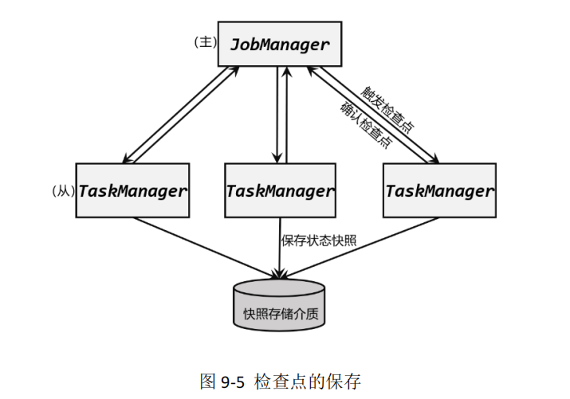

#### 9.5.2.1 状态后端的分类

状态后端是一个“开箱即用”的组件，可以在不改变应用程序逻辑的情况下独立配置。默认的状态后端是 HashMapStateBackend

##### 9.5.2.1.1 哈希表状态后端（HashMapStateBackend）

* 把状态存放在内存里。具体实现上，哈希表状态后端在内部会直接把状态当作对象（objects），保存在 Taskmanager 的 JVM 堆（heap）上。普通的状态，以及窗口中收集的数据和触发器（triggers），都会以键值对（key-value）的形式存储起来，所以底层是一个哈希表（HashMap），这种状态后端也因此得名。

* 对于检查点的保存，一般是放在持久化的分布式文件系统（file system）中，也可以通过配置“检查点存储”（CheckpointStorage）来另外指定。HashMapStateBackend 是将本地状态全部放入内存的，这样可以获得最快的读写速度，使计算性能达到最佳；代价则是内存的占用。

* 它适用于具有大状态、长窗口、大键值状态的作业，对所有高可用性设置也是有效的。

##### 9.5.2.1.2 内嵌 RocksDB 状态后端（EmbeddedRocksDBStateBackend）

* RocksDB 是一种内嵌的 key-value 存储介质，可以把数据持久化到本地硬盘。配置EmbeddedRocksDBStateBackend 后，会将处理中的数据全部放入 RocksDB 数据库中，RocksDB默认存储在 TaskManager 的本地数据目录里。

* 状态主要是放在RocksDB 中的。数据被存储为序列化的字节数组（Byte Arrays），读写操作需要序列化/反序列化，因此状态的访问性能要差一些。另外，因为做了序列化，key 的比较也会按照字节进行，而不是直接调用.hashCode()和.equals()方法。对于检查点，同样会写入到远程的持久化文件系统中。

* EmbeddedRocksDBStateBackend 始终执行的是异步快照，不会因为保存检查点而阻塞数据的处理；而且它还提供了增量式保存检查点的机制，这在很多情况下可以大大提升保存效率。

* 由于它会把状态数据落盘，而且支持增量化的检查点，所以在状态非常大、窗口非常长、键/值状态很大的应用场景中是一个好选择，同样对所有高可用性设置有效。

#### 9.5.2.2 如何选择正确的状态后端

HashMap 和 RocksDB 两种状态后端最大的区别，就在于本地状态存放在哪里：前者是内存，后者是 RocksDB

* HashMapStateBackend 是内存计算
  * 读写速度快
  * 状态的大小会受到集群可用内存的限制

* RocksDB 是硬盘存储，可以根据可用的磁盘空间进行扩展

  * 读写慢

  * 支持增量检查点，适用于超级海量状态的存储。

#### 9.5.2.3 状态后端的配置

默认状态后端是由集群配置文件 flink-conf.yaml 中指定的，配置的键名称为 state.backend。

##### 9.5.2.3.1 配置默认的状态后端

state.backend值的可选项为

* hashmap
* rocksdb
* 一个实现了状态后端工厂StateBackendFactory 的类的完全限定类名。

下面是一个配置 HashMapStateBackend 的例子

state.checkpoints.dir 配置项，定义了状态后端将检查点和元数据写入的目录。

```yaml
# 默认状态后端
state.backend: hashmap
# 存放检查点的文件路径
state.checkpoints.dir: hdfs://namenode:40010/flink/checkpoints
```

##### 9.5.2.3.2 为每个作业（Per-job）单独配置状态后端

设置HashMapStateBackend

```java
StreamExecutionEnvironment env = StreamExecutionEnvironment.getExecutionEnvironment();
//设置HashMapStateBackend
env.setStateBackend(new HashMapStateBackend());
```

设置 EmbeddedRocksDBStateBackend

```xml
StreamExecutionEnvironment env = StreamExecutionEnvironment.getExecutionEnvironment();
//设置 EmbeddedRocksDBStateBackend
env.setStateBackend(new EmbeddedRocksDBStateBackend());
```

在 IDE 中使用 EmbeddedRocksDBStateBackend，需要为 Flink 项目添加依赖：

```xml
<dependency>
 	<groupId>org.apache.flink</groupId>
 	<artifactId>flink-statebackend-rocksdb_${scala.binary.version}</artifactId>
 	<version>1.13.0</version>
</dependency>
```

Flink 发行版中默认就包含了 RocksDB，只要代码中没有使用 RocksDB的相关内容，就不需要引入这个依赖。

即使我们在 flink-conf.yaml 配置文件中设定了state.backend 为 rocksdb，也可以直接正常运行，并且使用 RocksDB 作为状态后端。

# 10 容错机制

## 10.1 检查点（Checkpoint）

检查点是 Flink 容错机制的核心，即游戏存档

### 10.1.1 检查点的保存

1. 周期性的触发保存

2. 保存的时间点

当所有任务都恰好处理完一个相同的输入数据的时候，将它们的状态保存下来

一个数据要么被所有任务完整地处理完，状态得到了保存；

要么就是没处理完，状态全部没保存：相当于构建了一个“事务”（transaction）

3. 保存的具体流程

```java
SingleOutputStreamOperator<Tuple2<String, Long>> wordCountStream = 
env
	.addSource(...)
	.map(word -> Tuple2.of(word, 1L))
	.returns(Types.TUPLE(Types.STRING, Types.LONG));
	.keyBy(t -> t.f0);
	.sum(1);
```

* 源（Source）任务从外部数据源读取数据，并记录当前的偏移量，作为算子状态（Operator State）保存下来

* 然后将数据发给下游的 Map 任务，它会将一个单词转换成(word, count)二元组，初始 count 都是 1，也就是(“hello”, 1)、(“world”, 1)这样的形式，这是一个无状态的算子任务

* 进而以 word 作为键（key）进行分区，调用.sum()方法就可以对 count 值进行求和统计了

* Sum 算子会把当前求和的结果作为按键分区状态（Keyed State）保存下来。最后得到的就是当前单词的频次统计(word, count)

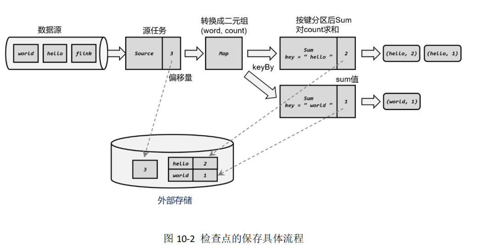

当需要保存检查点（checkpoint）时，就是在所有任务处理完同一条数据后，对状态做个快照保存下来。

例如上图，已经处理了 3 条数据：“hello”“world”“hello”， Source 算子的偏移量为 3；

后面的 Sum 算子处理完第三条数据“hello”之后，此时已经有 2 个“hello”和 1 个“world”，所以对应的状态为“hello”-> 2，“world”-> 1（这里 KeyedState底层会以 key-value 形式存储）。

此时所有任务都已经处理完了前三个数据，所以我们可以把当前的状态保存成一个检查点，写入外部存储中。至于具体保存到哪里，这是由状态后端的配置项 “ 检 查 点 存 储 ”（ CheckpointStorage ）来决定的，可以有作业管理器的堆内存（JobManagerCheckpointStorage）和文件系统（FileSystemCheckpointStorage）两种选择。

一般情况下，会将检查点写入持久化的分布式文件系统。

### 10.1.2 从检查点恢复状态

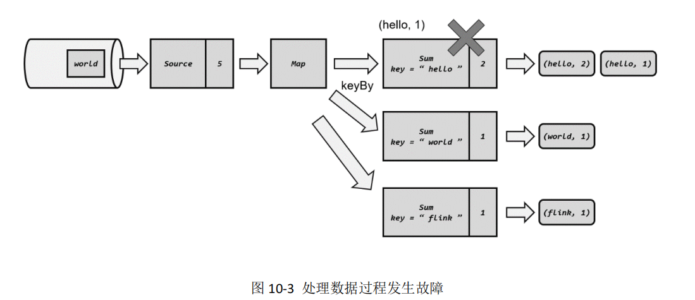

这里 Source 任务已经处理完毕，所以偏移量为 5；Map 任务也处理完成了。而 Sum 任务在处理中发生了故障，此时状态并未保存。

接下来就需要从检查点来恢复状态了。具体的步骤为：

1. 重启应用

   遇到故障之后，第一步当然就是重启。我们将应用重新启动后，所有任务的状态会清空

   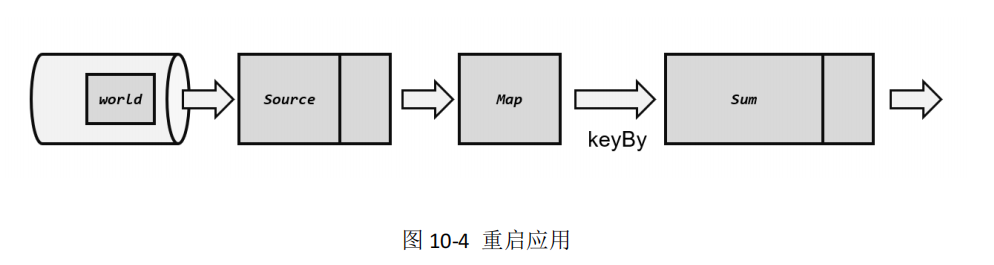

   2. 读取检查点，重置状态

      找到最近一次保存的检查点，从中读出每个算子任务状态的快照，分别填充到对应的状态中

      即：刚好处理完第三个数据的时候

   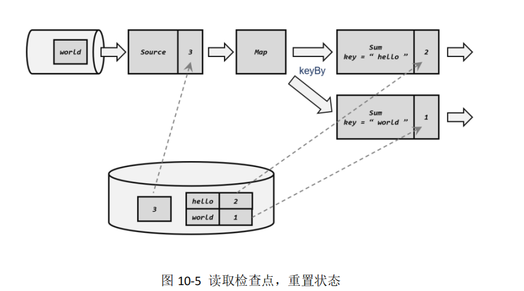

   3. 重放数据

      从保存检查点后开始重新读取数据，可以通过 Source 任务向外部数据源重新提交偏移量（offset）实现

   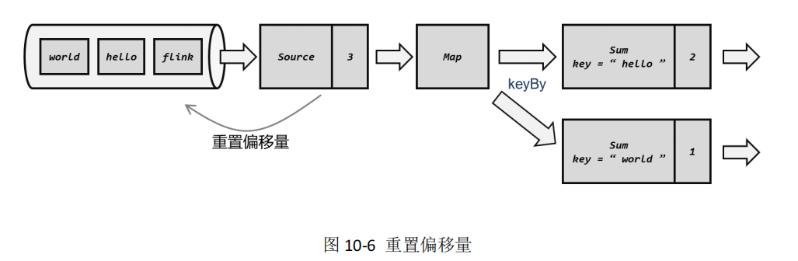

4. 继续处理数据

   重放第 4、5 个数据，然后继续读取后面的数据

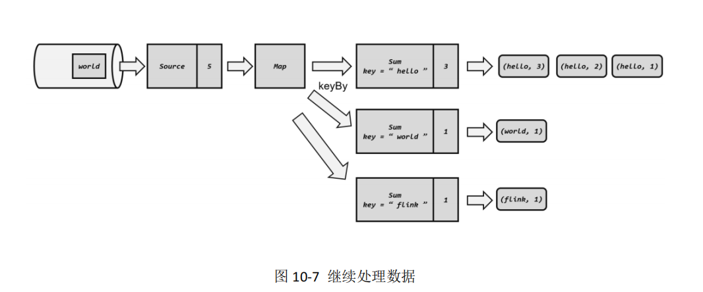

实现了“精确一次”（exactly-once）的状态一致性保证

想要正确地从检查点中读取并恢复状态，必须知道每个算子任务状态的类型和它们的先后顺序（拓扑结构）；

因此为了可以从之前的检查点中恢复状态，我们在改动程序、修复 bug 时要保证状态的拓扑顺序和类型不变。

状态的拓扑结构在 JobManager 上可以由 JobGraph 分析得到，而检查点保存的定期触发也是由 JobManager 控制的；所以故障恢复的过程需要 JobManager 的参与

### 10.1.3 检查点算法

在不暂停整体流处理的前提下，将状态备份保存到检查点

#### 10.1.3.1 检查点分界线（Barrier）

**在不暂停流处理的前提下，让每个任务“认出”触发检查点保存的那个数据。**

==插入一条特殊数据，经过每个算子的时候触发一次快照==

借鉴水位线（watermark）的设计，在数据流中插入一个特殊的数据结构，用来表示触发检查点保存的时间点。

把一条流上的数据按照不同的检查点分隔开，叫作检查点的“分界线”（Checkpoint Barrier）。

* 分界线之前到来的数据导致的状态更改，都会被包含在当前分界线所表示的检查点中；

* 分界线之后的数据导致的状态更改，则会被包含在之后的检查点中。

检查点分界线是一条特殊的数据，由 Source 算子注入到常规的数据流中，它的位置是限定好的，不能超过其他数据，也不能被后面的数据超过。检查点分界线中带有一个检查点 ID，这是当前要保存的检查点的唯一标识

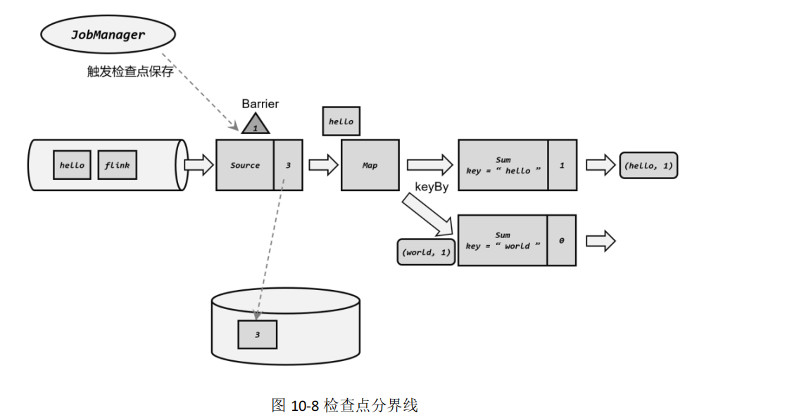

在 JobManager 中有一个“检查点协调器”（checkpoint coordinator），专门用来协调处理检查点的相关工作。

检查点协调器会定期向 TaskManager 发出指令，要求保存检查点（带着检查点 ID）；

TaskManager 会让所有的 Source 任务把自己的偏移量（算子状态）保存起来，并将带有检查点 ID 的分界线（barrier）插入到当前的数据流中，然后像正常的数据一样像下游传递；

之后 Source 任务就可以继续读入新的数据了。

**每个算子任务只要处理到这个 barrier，就把当前的状态进行快照；在收到 barrier 之前，还是正常地处理之前的数据，完全不受影响。**

#### 10.1.3.2 分布式快照算法

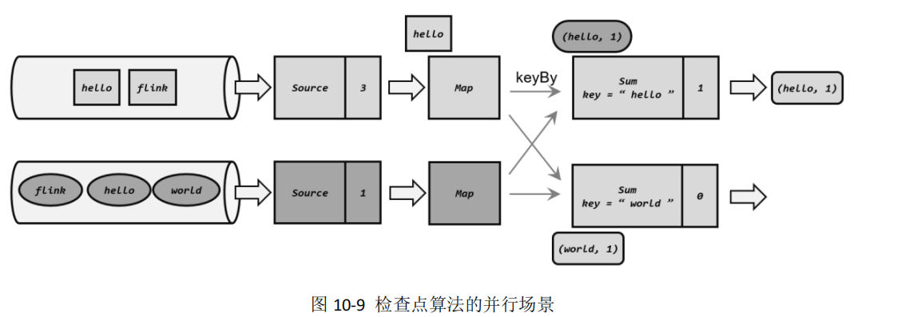

检查点保存的算法。具体过程如下：

1. JobManager 发送指令，触发检查点的保存，Source 任务保存状态，插入分界线

   * JobManager 会周期性地向每个 TaskManager 发送一条带有新检查点 ID 的消息，来启动检查点。
   * 收到指令后，TaskManger 会在所有 Source 任务中插入一个分界线（barrier），并将偏移量保存到远程的持久化存储中。
   * 并行的 Source 任务保存的状态为 3 和 1，表示当前的 1 号检查点应该包含：第一条流中截至第三个数据、第二条流中截至第一个数据的所有状态更改。

   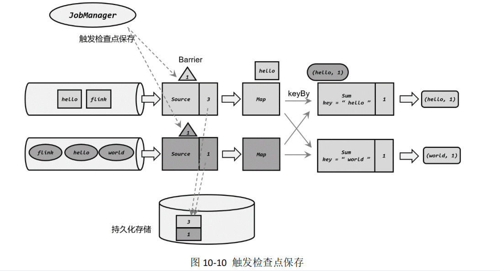

2. 状态快照保存完成，分界线向下游传递

   * 状态存入持久化存储之后，会返回通知给 Source 任务；Source 任务就会向 JobManager 确认检查点完成，然后像数据一样把 barrier 向下游任务传递

   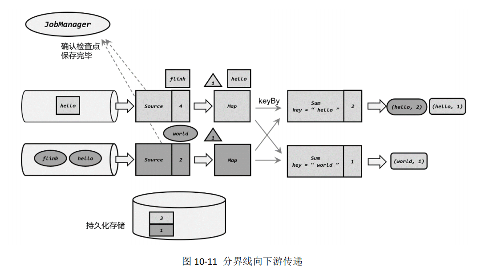

3. 向下游多个并行子任务广播分界线，执行分界线对齐

   * Map 任务没有状态，所以直接将 barrier 继续向下游传递。
   * 由于进行了 keyBy 分区，所以需要将 barrier 广播到下游并行的两个 Sum 任务。
   * Sum 任务可能收到来自上游两个并行 Map 任务的 barrier，所以需要执行“分界线对齐”操作。
   * 此时分区二的Sum 2收到了来自上游两个 Map 任务的 barrier（offset=3），说明第一条流第三个数据、第二条流第一个数据都已经处理完，可以进行状态的保存了；
   * 而分区一的Sum 1的barrier（offset=2），所以这时需要等待分界线对齐。在等待的过程中，如果分界线尚未到达的分区一任务Map 1 又传来了数据(hello, 1)，说明这是需要保存到检查点的，Sum 任务应该正常继续处理数据，状态更新为 （offset=3）；而如果分界线已经到达的分区任务 Map 2 又传来数据，这已经是下一个检查点要保存的内容了，就不应立即处理，而是要缓存起来、等到状态保存之后再做处理。

   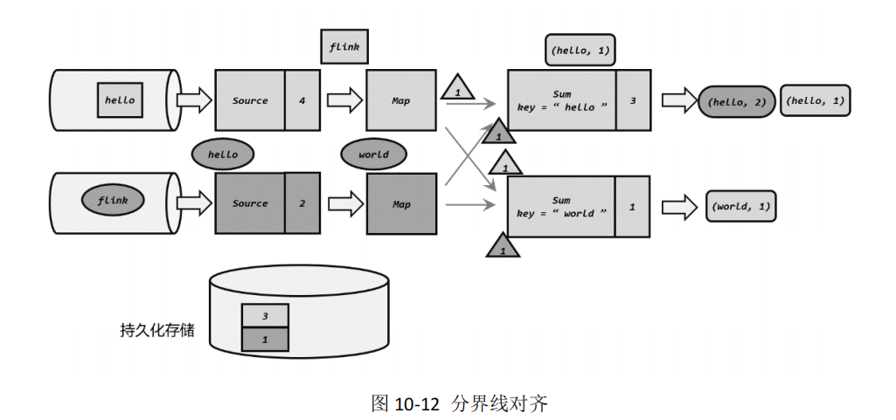

4. 分界线对齐后，保存状态到持久化存储

   * 各个分区的分界线都对齐后，就可以对当前状态做快照，保存到持久化存储了。
   * 存储完成之后，同样将 barrier 向下游继续传递，并通知 JobManager 保存完毕
   * 每个任务保存自己的状态都是相对独立的，互不影响。
   * 当Sum 将当前状态保存完毕时，Source 1 （offset=5）任务已经读取到第一条流的第五个数据了

   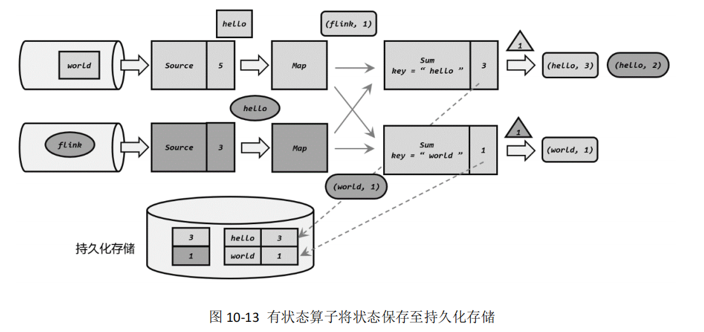

5. 先处理缓存数据，然后正常继续处理

   * 完成检查点保存之后，任务就可以继续正常处理数据了。
   * 如果有等待分界线对齐时缓存的数据，需要先做处理；然后再按照顺序依次处理新到的数据。

6. ==当 JobManager 收到所有任务成功保存状态的信息，就可以确认当前检查点成功保存。之后遇到故障就可以从这里恢复了==

Flink 1.11 之后提供了不对齐的检查点保存方式，可以将未处理的缓冲数据（in-flight data）也保存进检查点。这样，当我们遇到一个分区 barrier 时就不需等待对齐，而是可以直接启动状态的保存了。

### 10.1.4 检查点配置

默认情况下，Flink 程序是禁用检查点的

#### 10.1.4.1 启用检查点

```java
StreamExecutionEnvironment env = 
StreamExecutionEnvironment.getExecutionEnvironment();
// 每隔 1 秒启动一次检查点保存
env.enableCheckpointing(1000);//不传参数默认为 500 毫秒，这种方式已经被弃用。
```

检查点的间隔时间是对处理性能和故障恢复速度的一个权衡。

* 希望对性能的影响更小，可以调大间隔时间；

* 希望故障重启后迅速赶上实时的数据处理，就需要将间隔时间设小一些。

#### 10.1.4.2 检查点存储（Checkpoint Storage）

默认情况下，检查点存储在 JobManager 的堆（heap）内存中。

可以通过调用检查点配置的 .setCheckpointStorage() 来 配 置 ， 需要传入一个CheckpointStorage 的实现类

Flink 主要提供了两种 CheckpointStorage：

* 作业管理器的堆内存JobManagerCheckpointStorage）
* 文件系统（FileSystemCheckpointStorage）

```java
// 配置存储检查点到 JobManager 堆内存
env.getCheckpointConfig().setCheckpointStorage(new JobManagerCheckpointStorage());
// 配置存储检查点到文件系统
env.getCheckpointConfig().setCheckpointStorage(
    new FileSystemCheckpointStorage("hdfs://namenode:40010/flink/checkpoints"));
```

对于实际生产应用，一般会将 CheckpointStorage 配置为高可用的分布式文件系统（HDFS，S3 等）。

#### 10.1.4.3 其他高级配置

* 检查点模式（CheckpointingMode）
设置检查点一致性的保证级别，有“精确一次”（exactly-once）和“至少一次”（at-least-once）两个选项。默认级别为 exactly-once，而对于大多数低延迟的流处理程序，at-least-once 就够用了，而且处理效率会更高。
* 超时时间（checkpointTimeout）
用于指定检查点保存的超时时间，超时没完成就会被丢弃掉。传入一个长整型毫秒数作为参数，表示超时时间。
* 最小间隔时间（minPauseBetweenCheckpoints）
用于指定在上一个检查点完成之后，检查点协调器（checkpoint coordinator）最快等多久可以出发保存下一个检查点的指令。这就意味着即使已经达到了周期触发的时间点，只要距离上一个检查点完成的间隔不够，就依然不能开启下一次检查点的保存。这就为正常处理数据留下了充足的间隙。当指定这个参数时，maxConcurrentCheckpoints 的值强制为 1。
* 最大并发检查点数量（maxConcurrentCheckpoints）
用于指定运行中的检查点最多可以有多少个。由于每个任务的处理进度不同，完全可能出现后面的任务还没完成前一个检查点的保存、前面任务已经开始保存下一个检查点了。这个参数就是限制同时进行的最大数量。
如果前面设置了 minPauseBetweenCheckpoints， maxConcurrentCheckpoints 这个参数就不起作用了。
* 开启外部持久化存储（enableExternalizedCheckpoints）
用于开启检查点的外部持久化，而且默认在作业失败的时候不会自动清理，如果想释放空间需要自己手工清理。里面传入的参数 ExternalizedCheckpointCleanup 指定了当作业取消的时候外部的检查点该如何清理。
* DELETE_ON_CANCELLATION：在作业取消的时候会自动删除外部检查点，但是如果是作业失败退出，则会保留检查点。
* RETAIN_ON_CANCELLATION：作业取消的时候也会保留外部检查点。
* 检查点异常时是否让整个任务失败（failOnCheckpointingErrors）
用于指定在检查点发生异常的时候，是否应该让任务直接失败退出。默认为 true，如果设置为 false，则任务会丢弃掉检查点然后继续运行。
* 不对齐检查点（enableUnalignedCheckpoints）
不再执行检查点的分界线对齐操作，启用之后可以大大减少产生背压时的检查点保存时间。这个设置要求检查点模式（CheckpointingMode）必须为 exctly-once，并且并发的检查点个数为 1。

```java
StreamExecutionEnvironment env = StreamExecutionEnvironment.getExecutionEnvironment();
// 启用检查点，间隔时间 1 秒
env.enableCheckpointing(1000);
CheckpointConfig checkpointConfig = env.getCheckpointConfig();
// 设置精确一次模式
checkpointConfig.setCheckpointingMode(CheckpointingMode.EXACTLY_ONCE);
// 最小间隔时间 500 毫秒
checkpointConfig.setMinPauseBetweenCheckpoints(500);
// 超时时间 1 分钟
checkpointConfig.setCheckpointTimeout(60000);
// 同时只能有一个检查点
checkpointConfig.setMaxConcurrentCheckpoints(1);
// 开启检查点的外部持久化保存，作业取消后依然保留
checkpointConfig.enableExternalizedCheckpoints(
 ExternalizedCheckpointCleanup.RETAIN_ON_CANCELLATION);
// 启用不对齐的检查点保存方式
checkpointConfig.enableUnalignedCheckpoints();
// 设置检查点存储，可以直接传入一个 String，指定文件系统的路径
checkpointConfig.setCheckpointStorage("hdfs://my/checkpoint/dir")
```

### 10.1.5 保存点（Savepoint）

原理和算法与检查点完全相同，只是多了一些额外的元数据

保存点中的状态快照，是以算子 ID 和状态名称组织起来的，相当于一个键值对。

从保存点启动应用程序时，Flink 会将保存点的状态数据重新分配给相应的算子任务。

#### 10.1.5.1 保存点的用途

* 检查点是由 Flink 自动管理的，定期创建，“自动存盘”；

* 保存点不会自动创建，必须由用户明确地手动触发保存操作，“手动存盘”。

* 检查点主要用来做故障恢复，是容错机制的核心；

* 保存点则更加灵活，可以用来做有计划的手动备份和恢复。

我们可以在需要的时候创建一个保存点，然后停止应用，做一些处理调整之后再从保存点重启。

适用的具体场景有：

* 版本管理和归档存储
  对重要的节点进行手动备份，设置为某一版本，归档（archive）存储应用程序的状态。

*  更新 Flink 版本
目前 Flink 的底层架构已经非常稳定，所以当 Flink 版本升级时，程序本身一般是兼容的。这时不需要重新执行所有的计算，只要创建一个保存点，停掉应用、升级 Flink 后，从保存点重启就可以继续处理了。

* 更新应用程序

  * 不仅可以在应用程序不变的时候，更新 Flink 版本；还可以直接更新应用程序。

  * 前提是程序必须是兼容的，也就是说更改之后的程序，状态的拓扑结构和数据类型都是不变的，这样才能正常从之前的保存点去加载。
  * 这个功能非常有用。我们可以及时修复应用程序中的逻辑 bug，更新之后接着继续处理；
  * 也可以用于有不同业务逻辑的场景，比如 A/B 测试等等。

*  调整并行度
如果应用运行的过程中，发现需要的资源不足或已经有了大量剩余，也可以通过从保存点重启的方式，将应用程序的并行度增大或减小。

*  暂停应用程序
有时候我们不需要调整集群或者更新程序，只是单纯地希望把应用暂停、释放一些资源来处理更重要的应用程序。使用保存点就可以灵活实现应用的暂停和重启，可以对有限的集群资源做最好的优化配置

保存点中状态都是以算子 ID-状态名称这样的 key-value 组织起来的，算子ID 可以在代码中直接调用 SingleOutputStreamOperator 的.uid()方法来进行指定

```java
DataStream<String> stream = env
 .addSource(new StatefulSource())
 .uid("source-id")
 .map(new StatefulMapper())
 .uid("mapper-id")
 .print();
```

对于没有设置 ID 的算子，Flink 默认会自动进行设置，所以在重新启动应用后可能会导致ID 不同而无法兼容以前的状态。==所以为了方便后续的维护，强烈建议在程序中为每一个算子手动指定 ID。==

#### 10.1.5.2 使用保存点

可以使用命令行工具来创建保存点，也可以从保存点恢复作业。

* 创建保存点

  要在命令行中为运行的作业创建一个保存点镜像，只需要执行：

```perl
bin/flink savepoint :jobId [:targetDirectory]
```

这里 jobId 需要填充要做镜像保存的作业 ID，目标路径 targetDirectory 可选，表示保存点存储的路径。

对于保存点的默认路径，可以通过配置文件 flink-conf.yaml 中的 state.savepoints.dir 项来设定：

```yaml
state.savepoints.dir: hdfs:///flink/savepoints
```

对于单独的作业，可以在程序代码中通过执行环境来设置：

```java
env.setDefaultSavepointDir("hdfs:///flink/savepoints");
```

由于创建保存点一般都是希望更改环境之后重启，所以创建之后往往紧接着就是停掉作业的操作。除了对运行的作业创建保存点，我们也可以在停掉一个作业时直接创建保存点：

```perl
bin/flink stop --savepointPath [:targetDirectory] :jobId
```

* 从保存点重启应用

提交启动一个 Flink 作业，使用的命令是 flink run；从保存点重启一个应用，本质是一样的：

```perl
bin/flink run -s :savepointPath [:runArgs]
```

这里只要增加一个-s 参数，指定保存点的路径就可以了，其他启动时的参数还是完全一样的。

## 10.2 状态一致性

### 10.2.1 一致性的概念和级别

多个节点并行处理不同的任务，要保证计算结果是正确的，就必须不漏掉任何一个数据，而且也不会重复处理同一个数据。

在发生故障、需要恢复状态进行回滚时就需要更多的保障机制。我们通过检查点的保存来保证状态恢复后结果的正确，所以主要讨论的就是“状态的一致性”。

状态一致性有三种级别：

* 最多一次（AT-MOST-ONCE）
  * 每个数据在正常情况下会被处理一次，遇到故障时就会丢掉，所以就是“最多处理一次”。
  * 对近似正确的结果也能接受时，这也不失为一种很好的解决方案。

* 至少一次（AT-LEAST-ONCE）
  * 在实际应用中，我们一般会希望至少不要丢掉数据。这种一致性级别就叫作“至少一次”（at-least-once）
  * 所有数据都不会丢，肯定被处理了；不过不能保证只处理一次，有些数据会被重复处理。
  * 在有些场景下，重复处理数据是不影响结果的正确性的，这种操作具有“幂等性”。
  * 为了保证达到 at-least-once 的状态一致性，我们需要在发生故障时能够重放数据。最常见的做法是，用持久化的事件日志系统，把所有的事件写入到持久化存储中。这时只要记录一个偏移量，当任务发生故障重启后，重置偏移量就可以重放检查点之后的数据了。Kafka 就是这种架构的一个典型实现。

* 精确一次（EXACTLY-ONCE）
  * 最严格的一致性保证，就是所谓的“精确一次”（exactly-once，有时也译作“恰好一次”）。
  * 最难实现的状态一致性语义。exactly-once 意味着所有数据不仅不会丢失，而且只被处理一次，不会重复处理。也就是说对于每一个数据，最终体现在状态和输出结果上，只能有一次统计。
  * exactly-once 可以真正意义上保证结果的绝对正确，在发生故障恢复后，就好像从未发生过故障一样。
  * 要做到 exactly-once，首先必须能达到 at-least-once 的要求，就是数据不丢。所以同样需要有数据重放机制来保证这一点。另外，还需要有专门的设计保证每个数据只被处理一次。Flink 中使用的是一种轻量级快照机制——检查点（checkpoint）来保证 exactly-once 语义。

### 10.2.2 端到端的状态一致性

完整的流处理应用，应该包括了数据源、流处理器和外部存储系统三个部分。

这个完整应用的一致性，就叫作“端到端（end-to-end）的状态一致性”，它取决于三个组件中最弱的那一环。

一般来说，能否达到 at-least-once 一致性级别，主要看数据源能够重放数据；而能否达到 exactly-once 级别，流处理器内部、数据源、外部存储都要有相应的保证机制。

## 10.3 端到端精确一次（end-to-end exactly-once）

### 10.3.1 输入端保证

输入端（Source）需要达到 at-least-once 一致性语义

数据源可重放数据，或者说可重置读取数据偏移量，加上 Flink 的 Source 算子将偏移量作为状态保存进检查点，就可以保证数据不丢。

### 10.3.2 输出端保证

输出端（Sink）有两种写入方式：

* 幂等写入（idempotent）
  * 一个操作可以重复执行很多次，但只导致一次结果更改，后面再重复执行就不会对结果起作用了。
  * 主要的限制在于外部存储系统必须支持这样的幂等写入：如 Redis 中键值存储，或者关系型数据库中满足查询条件的更新操作。

* 事务写入（transactional）

  * 预写日志（write-ahead-log，WAL）

    DataStream API 提供了一个模板类GenericWriteAheadSink，用来实现这种事务型的写入方式

    ①先把结果数据作为日志（log）状态保存起来

    ②进行检查点保存时，也会将这些结果数据一并做持久化存储
    
    ③在收到检查点完成的通知时，将所有结果一次性写入外部系统。
    
    保存确认信息时出现了故障，Flink 最会认为没有成功写入，导致这批数据的重复写入
    
  * 两阶段提交（two-phase-commit，2PC）
  
    先做“预提交”，等检查点完成之后再正式提交，需要外部系统提供事务支持
  
    Flink 提供了 TwoPhaseCommitSinkFunction 接口，自定义实现两阶段提交的SinkFunction 
  
    ①当第一条数据到来时，或者收到检查点的分界线时，Sink 任务都会启动一个事务。
  
    ②接下来接收到的所有数据，都通过这个事务写入外部系统；这时由于事务没有提交，所以数据尽管写入了外部系统，但是不可用，是“预提交”的状态。
  
    ③当 Sink 任务收到 JobManager 发来检查点完成的通知时，正式提交事务，写入的结果就真正可用了。
  
    2PC 对外部系统的要求：
  
    * 外部系统必须提供事务支持，或者 Sink 任务必须能够模拟外部系统上的事务。
  
    * 在检查点的间隔期间里，必须能够开启一个事务并接受数据写入。
  
    * 在收到检查点完成的通知之前，事务必须是“等待提交”的状态。在故障恢复的情况下，这可能需要一些时间。如果这个时候外部系统关闭事务（例如超时了），那么未提交的数据就会丢失。
  
    * Sink 任务必须能够在进程失败后恢复事务。
  
    * 提交事务必须是幂等操作。也就是说，事务的重复提交应该是无效的。
  

具体在项目中的选型，应该一致性级别和处理性能权衡考量。

### 10.3.3 Flink 和 Kafka 连接时的精确一次保证

在流处理的应用中，最佳的数据源当然是可重置偏移量的消息队列了；

它不仅可以提供数据重放的功能，而且天生就是以流的方式存储和处理数据的。

#### 10.3.3.1 整体介绍

1. Flink 内部

   Flink 内部可以通过检查点机制保证状态和处理结果的 exactly-once 语义。

2. 输入端

   输入数据源端的 Kafka 可以对数据进行持久化保存，并可以重置偏移量（offset）。
   
   * 在 Source 任务（FlinkKafkaConsumer）中将当前读取的偏移量保存为算子状态，写入到检查点中；
   * 当发生故障时，从检查点中读取恢复状态，并由连接器 FlinkKafkaConsumer 向 Kafka重新提交偏移量，就可以重新消费数据、保证结果的一致性了。

3. 输出端

   输出端保证 exactly-once 的最佳实现，两阶段提交（2PC）。

   写入 Kafka 的过程实际上是一个两段式的提交：

   * 处理完毕得到结果，写入Kafka 时是基于事务的“预提交”；

   * 等到检查点保存完毕，才会提交事务进行“正式提交”。

如果中间出现故障，事务进行回滚，预提交就会被放弃；恢复状态之后，也只能恢复所有已经确认提交的操作。

   Flink 官方实现的 Kafka 连接器中，提供了写入到 Kafka 的 FlinkKafkaProducer，它就实现了 TwoPhaseCommitSinkFunction 接口：

   ```java
   public class FlinkKafkaProducer<IN> extends TwoPhaseCommitSinkFunction <IN,FlinkKafkaProducer.KafkaTransactionState,FlinkKafkaProducer.KafkaTransactionContext> {
   ...
   }
   ```

   #### 10.3.3.2 具体步骤

Flink 从 Kafka 读取数据、并将处理结果写入 Kafka

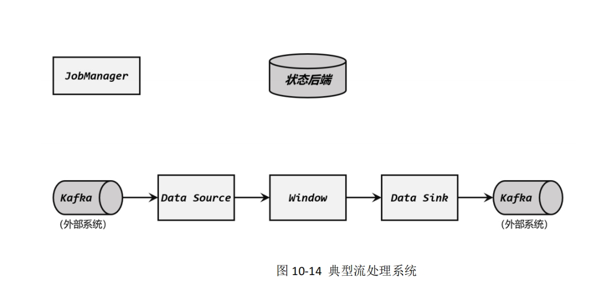

Flink 与 Kafka 连接的两阶段提交，离不开检查点的配合，这个过程需要 JobManager 协调各个 TaskManager 进行状态快照，而检查点具体存储位置则是由状态后端（State Backend）来配置管理的。一般情况，我们会将检查点存储到分布式文件系统上。

实现端到端 exactly-once 的具体过程可以分解如下：

1. 启动检查点保存

检查点保存的启动，标志着我们进入了两阶段提交协议的“预提交”阶段

JobManager 通知各个 TaskManager 启动检查点保存，Source 任务会将检查点分界线（barrier）注入数据流

这个 barrier 可以将数据流中的数据，分为进入当前检查点的集合和进入下一个检查点的集合

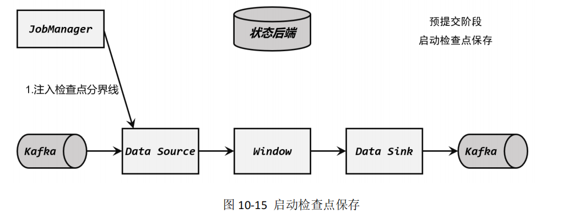

2. 算子任务对状态做快照

分界线（barrier）会在算子间传递下去。每个算子收到 barrier 时，会将当前的状态做个快照，保存到状态后端。

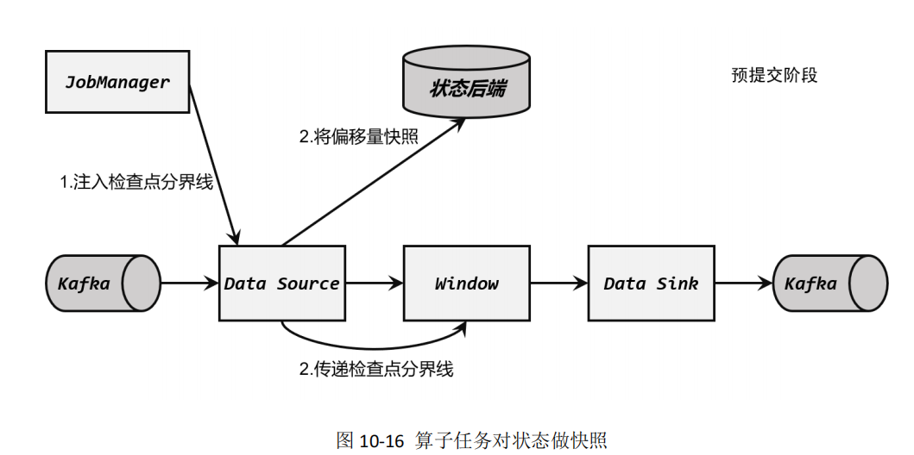

Source 任务将 barrier 插入数据流后，也会将当前读取数据的偏移量作为状态写入检查点，存入状态后端；

然后把 barrier 向下游传递，自己就可以继续读取数据了。

接下来 barrier 传递到了内部的 Window 算子，它同样会对自己的状态进行快照保存，写入远程的持久化存储。

3. Sink 任务开启事务，进行预提交

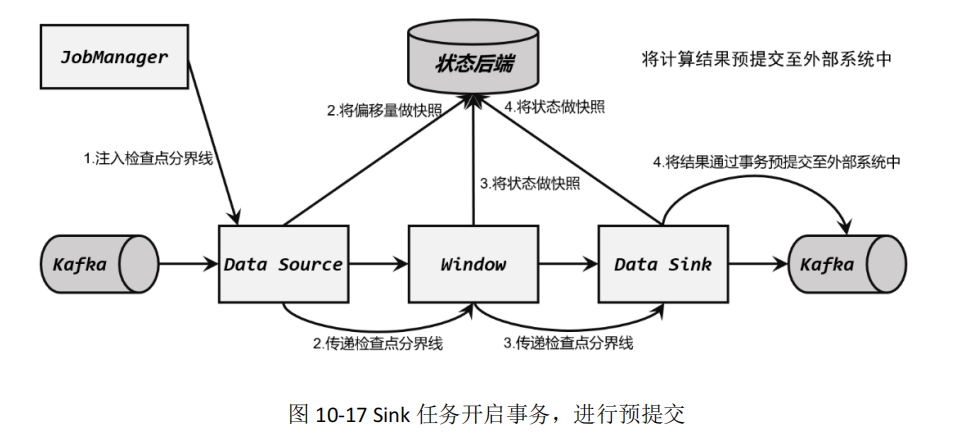

分界线（barrier）终于传到了 Sink 任务，这时 Sink 任务会开启一个事务。

接下来到来的所有数据，Sink 任务都会通过这个事务来写入 Kafka。

 barrier 是检查点的分界线，也是事务的分界线。之前的检查点可能尚未完成，因此上一个事务也可能尚未提交

此时 barrier 的到来开启了新的事务，上一个事务尽管可能没有被提交，但也不再接收新的数据了。

对于 Kafka 而言，提交的数据会被标记为“未确认”（uncommitted）。即“预提交”（pre-commit）。

4. 检查点保存完成，提交事务

当所有算子的快照都完成，即检查点保存最终完成时，JobManager 会向所有任务发确认通知，告诉大家当前检查点已成功保存

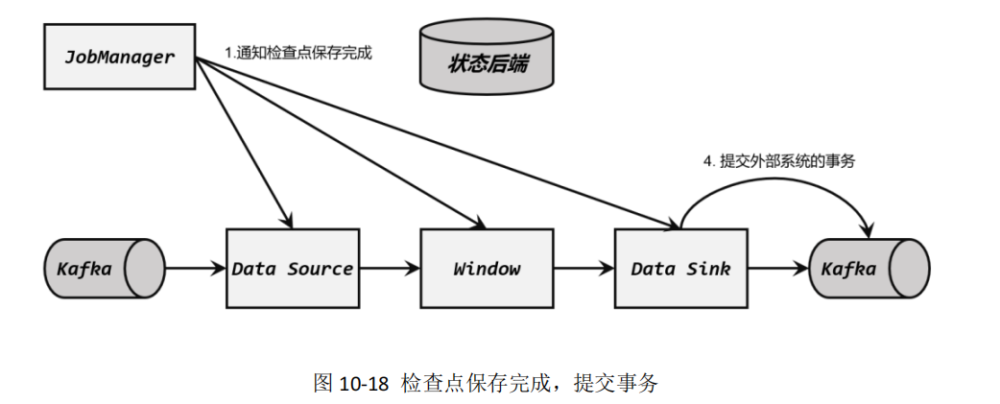

当 Sink 任务收到确认通知后，就会正式提交之前的事务，把之前“未确认”的数据标为“已确认”，接下来就可以正常消费了。

在任务运行中的任何阶段失败，都会从上一次的状态恢复，所有没有正式提交的数据也会回滚。

如此，Flink 和 Kafka 连接构成的流处理系统，就实现了端到端的 exactly-once 状态一致性。

#### 10.3.3.3 需要的配置

实现真正的端到端 exactly-once，还需要有一些额外的配置：

* 必须启用检查点；
* 在 FlinkKafkaProducer 的构造函数中传入参数 Semantic.EXACTLY_ONCE；
* 配置 Kafka 读取数据的消费者的隔离级别
这里所说的 Kafka，是写入的外部系统。预提交阶段数据已经写入，只是被标记为“未提
交”（uncommitted），而 Kafka 中默认的隔离级别 isolation.level 是 read_uncommitted，也就是
可以读取未提交的数据。这样一来，外部应用就可以直接消费未提交的数据，对于事务性的保
证就失效了。所以应该将隔离级别配置为 read_committed，表示消费者遇到未提交的消息时，会停止从分区中消费数据，直到消息被标记为已提交才会再次恢复消费。当然，这样做的话，外部应用消费数据就会有显著的延迟。
* 事务超时配置
Flink 的 Kafka连接器中配置的事务超时时间 transaction.timeout.ms 默认是 1小时，而Kafka
集群配置的事务最大超时时间 transaction.max.timeout.ms 默认是 15 分钟。所以在检查点保存
时间很长时，有可能出现 Kafka 已经认为事务超时了，丢弃了预提交的数据；而 Sink 任务认
为还可以继续等待。如果接下来检查点保存成功，发生故障后回滚到这个检查点的状态，这部
分数据就被真正丢掉了。所以这两个超时时间，前者应该小于等于后者。

# 11 Table API 和 SQL

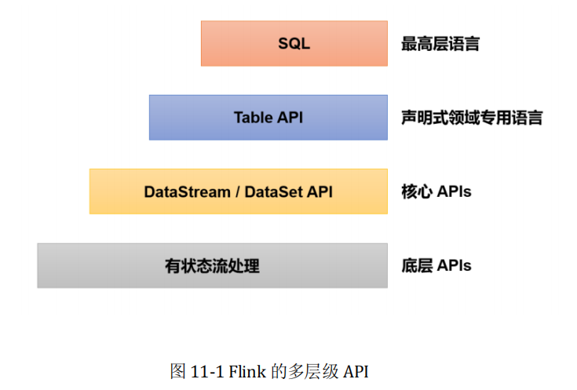

Flink 是批流统一的处理框架，无论是批处理（DataSet API）还是流处理（DataStream API），在上层应用中都可以直接使用 Table API 或者 SQL 来实现；这两种 API 对于一张表执行相同的查询操作，得到的结果是完全一样的。

目前最新的 1.13 版本中，Table API 和 SQL 也依然不算稳定，接口用法还在不停调整和更新。所以这部分重在理解原理和基本用法，具体的 API 调用可以随时关注官网的更新变化。

## 11.1 快速上手

### 11.1.1 需要引入的依赖

 添加Java “桥接器”（bridge），主要就是负责 Table API 和下层 DataStream API 的连接支持

```xml
        <dependency>
            <groupId>org.apache.flink</groupId>
            <artifactId>flink-table-api-java-bridge_${scala.binary.version}</artifactId>
            <version>${flink.version}</version>
        </dependency>
```

添加Table API 的核心组件“计划器”（planner）

Table API 的内部实现上，部分代码是 Scala ，还需要额外添加一个 Scala 版流处理的相关依赖

```xml
        <dependency>
            <groupId>org.apache.flink</groupId>
            <artifactId>flink-table-planner-blink_${scala.binary.version}</artifactId>
            <version>${flink.version}</version>
        </dependency>
        <dependency>
            <groupId>org.apache.flink</groupId>
            <artifactId>flink-streaming-scala_${scala.binary.version}</artifactId>
            <version>${flink.version}</version>
        </dependency>
```

想实现自定义的数据格式来做序列化，可以引入下面的依赖

```xml
        <dependency>
            <groupId>org.apache.flink</groupId>
            <artifactId>flink-table-common</artifactId>
            <version>${flink.version}</version>
        </dependency>
```

### 11.1.2 简单示例

```java
package org.neptune.TableAPIAndSQL;

import org.apache.flink.streaming.api.datastream.SingleOutputStreamOperator;
import org.apache.flink.streaming.api.environment.StreamExecutionEnvironment;
import org.apache.flink.table.api.Table;
import org.apache.flink.table.api.bridge.java.StreamTableEnvironment;
import org.neptune.pojo.Event;

public class TableExample {
    public static void main(String[] args) throws Exception {
        // 获取流执行环境
        StreamExecutionEnvironment env = StreamExecutionEnvironment.getExecutionEnvironment();
        env.setParallelism(1);
        // 读取数据源
        SingleOutputStreamOperator<Event> eventStream = env
                .fromElements(
                        new Event("Alice", "./home", 1000L),
                        new Event("Bob", "./cart", 1000L),
                        new Event("Alice", "./prod?id=1", 5 * 1000L),
                        new Event("Cary", "./home", 60 * 1000L),
                        new Event("Bob", "./prod?id=3", 90 * 1000L),
                        new Event("Alice", "./prod?id=7", 105 * 1000L)
                );
        // 获取表环境
        StreamTableEnvironment tableEnv = StreamTableEnvironment.create(env);
        // 将数据流转换成表
        Table eventTable = tableEnv.fromDataStream(eventStream);
        // 用执行 SQL 的方式提取数据
        Table visitTable = tableEnv.sqlQuery("select url, user from " + eventTable);
        // 将表转换成数据流，打印输出
        tableEnv.toDataStream(visitTable).print();
        // 执行程序
        env.execute();
    }
}
```

```shell
+I[./home, Alice]
+I[./cart, Bob]
+I[./prod?id=1, Alice]
+I[./home, Cary]
+I[./prod?id=3, Bob]
+I[./prod?id=7, Alice]
```

每行输出前面有一个“+I”标志，这是表示每条数据都是“插入”（Insert）到表中的新增数据。

```java
// 用 Table API 方式提取数据
Table clickTable2 = eventTable.select($("url"), $("user"));
```

这里的$符号是 Table API 中定义的“表达式”类 Expressions 中的一个方法，传入一个字段名称，就可以指代数据中对应字段。将得到的表转换成流打印输出，会发现结果与直接执行SQL 完全一样。

## 11.2 基本 API

### 11.2.1 程序架构

```java
// 创建表环境
TableEnvironment tableEnv = ...;
// 创建输入表，连接外部系统读取数据
tableEnv.executeSql("CREATE TEMPORARY TABLE inputTable ... WITH ( 'connector' = ... )");
// 注册一个表，连接到外部系统，用于输出
tableEnv.executeSql("CREATE TEMPORARY TABLE outputTable ... WITH ( 'connector' = ... )");
// 执行 SQL 对表进行查询转换，得到一个新的表
Table table1 = tableEnv.sqlQuery("SELECT ... FROM inputTable... ");
// 使用 Table API 对表进行查询转换，得到一个新的表
Table table2 = tableEnv.from("inputTable").select(...);
// 将得到的结果写入输出表
TableResult tableResult = table1.executeInsert("outputTable");
```

### 11.2.2 创建表环境

使用 Table API 和 SQL 需要一个特别的运行时环境，“表环境”（TableEnvironment）。它主要负责：

* 注册 Catalog 和表；

* 执行 SQL 查询；

* 注册用户自定义函数（UDF）；

* DataStream 和表之间的转换。

Catalog 是“目录”，主要用来管理所有数据库（database）和表（table）的元数据（metadata）。

表环境中可以由用户自定义 Catalog（目录），并在其中注册表和自定义函数（UDF）。

默认的 Catalog为default_catalog。

TableEnvironment是 Table API 中提供的基本接口类，可以通过调用静态的 create()方法来创建一个表环境实例

方法需要传入一个环境的配置参数 EnvironmentSettings，它可以指定当前表环境的执行模式和计划器（planner）。

执行模式有批处理和流处理两种选择，默认是流处理模式；计划器默认使用 blink planner。

```java
import org.apache.flink.table.api.EnvironmentSettings;
import org.apache.flink.table.api.TableEnvironment;

EnvironmentSettings settings = EnvironmentSettings
 .newInstance()
 .inStreamingMode() // 使用流处理模式
 .build();
TableEnvironment tableEnv = TableEnvironment.create(settings);
```

对于流处理场景，其实默认配置就完全够用了。所以我们也可以用另一种更加简单的方式来创建表环境：

```java
import org.apache.flink.streaming.api.environment.StreamExecutionEnvironment;
import org.apache.flink.table.api.EnvironmentSettings;
import org.apache.flink.table.api.bridge.java.StreamTableEnvironment;

StreamExecutionEnvironment env = StreamExecutionEnvironment.getExecutionEnvironment();
StreamTableEnvironment tableEnv = StreamTableEnvironment.create(env);
```

“ 流式表环境 ”（ StreamTableEnvironment ），是继承自TableEnvironment 的子接口。调用它的 create()方法，只需要直接将当前的流执行环境（StreamExecutionEnvironment）传入，就可以创建出对应的流式表环境了。

### 11.2.3 创建表

**对应流处理中的读取数据源（Source）**

表在环境中有一个唯一的 ID，由三部分组成：目录（catalog）名，数据库（database）名，以及表名。

在默认情况下，目录名为 default_catalog，数据库名为default_database。

如果直接创建一个叫作 MyTable 的表，它的 ID 就是：`default_catalog.default_database.MyTable`

具体创建表的方式，有通过连接器（connector）和虚拟表（virtual tables）两种

#### 11.2.3.1 连接器表（Connector Tables）

通过连接器（connector）连接到一个外部系统，然后定义出对应的表结构。

例如我们可以连接到 Kafka 或者文件系统，将存储在这些外部系统的数据以“表”的形式定义出来，这样对表的读写就可以通过连接器转换成对外部系统的读写了。

当我们在表环境中读取这张表，连接器就会从外部系统读取数据并进行转换；

而当我们向这张表写入数据，连接器就会将数据输出（Sink）到外部系统中。

调用表环境的 executeSql()方法，传入一个 DDL 作为参数执行SQL 操作。这里传入一个 CREATE 语句进行表的创建，TEMPORARY 关键字可以省略，并通过 WITH 关键字指定连接到外部系统的连接器

```java
tableEnv.executeSql("CREATE [TEMPORARY] TABLE MyTable ... WITH ( 'connector' = ... )");
```

自定义目录和库名

```java
tEnv.useCatalog("custom_catalog");
tEnv.useDatabase("custom_database");
```

#### 11.2.3.2 虚拟表（Virtual Tables）

在环境中注册之后，我们就可以在 SQL 中直接使用这张表进行查询转换了。

```java
Table newTable = tableEnv.sqlQuery("SELECT ... FROM MyTable... ");
```

newTable 是一个 Table 对象，并没有在表环境中注册；将这个中间结果表注册到环境中，才能在 SQL 中使用

```java
tableEnv.createTemporaryView("NewTable", newTable);
```

注册其实是创建了一个“虚拟表”（Virtual Table）。相当于SQL中的视图（View），所以调用的方法也叫作创建“虚拟视图”（createTemporaryView）。虚拟表可以在 Table API 和 SQL 之间进行自由切换

### 11.2.4 表的查询

**对应流处理中的转换（Transform）**

Flink 为我们提供了两种查询方式：SQL 和 Table API。

#### 11.2.4.1 执行 SQL 进行查询

```java
// 创建表环境
TableEnvironment tableEnv = ...; 
// 创建表
tableEnv.executeSql("CREATE TABLE EventTable ... WITH ( 'connector' = ... )");
// 查询用户 Alice 的点击事件，并提取表中前两个字段
Table aliceVisitTable = tableEnv.sqlQuery(
 "SELECT user, url " +
 "FROM EventTable " +
 "WHERE user = 'Alice' "
 );
```

可以通过 GROUP BY 关键字定义分组聚合，调用 COUNT()、SUM()这样的函数来进行统计计算：

```java
Table urlCountTable = tableEnv.sqlQuery(
 "SELECT user, COUNT(url) " +
 "FROM EventTable " +
 "GROUP BY user "
 );
```

以上得到的是一个新的 Table 对象，可以再次将它注册为虚拟表继续在 SQL中调用。

也可以直接将查询的结果写入到已经注册的表中，这需要调用表环境的executeSql()方法来执行 DDL，传入的是一个 INSERT 语句

```java
// 注册表
tableEnv.executeSql("CREATE TABLE EventTable ... WITH ( 'connector' = ... )");

// 将查询结果输出到 OutputTable 中
tableEnv.executeSql (
"INSERT INTO OutputTable " +
 "SELECT user, url " +
 "FROM EventTable " +
 "WHERE user = 'Alice' "
 );
```

#### 11.2.4.2 调用 Table API 进行查询

基于环境中已注册的表，通过表环境的 from()方法获取 Table 对象

```java
Table eventTable = tableEnv.from("EventTable");
```

传入的参数是注册好的表名。注意这里 eventTable 是一个 Table 对象，而 EventTable 是在环境中注册的表名

得到 Table 对象之后，可以调用 API 进行各种转换操作了，转换后是一个新的 Table 对象

每个方法的参数都是一个“表达式”（Expression），“$”符号用来指定表中的一个字段，用方法调用的方式直观地说明了表达的内容

```java
Table maryClickTable = eventTable
 .where($("user").isEqual("Alice"))
 .select($("url"), $("user"));
```

Table API 是嵌入编程语言中的 DSL，目前 Table API 支持的功能相对更少，了解即可。

未来 Flink 社区也会以扩展 SQL 为主，为大家提供更加通用的接口方式。

#### 11.2.4.3 两种 API 的结合使用

无论是调用 Table API 还是执行 SQL，得到的结果都是一个 Table 对象

1. 无论是哪种方式得到的 Table 对象，都可以继续调用 Table API 进行查询转换；
2. 如果想要对一个表执行 SQL 操作（用 FROM 关键字引用），必须先在环境中对它进行注册。

第一个参数"MyTable"是注册的表名，而第二个参数 myTable 是 Java 中的Table 对象

```java
//通过创建虚拟表的方式实现两者的转换
tableEnv.createTemporaryView("MyTable", myTable);
```

将 Table 对象名 eventTable 直接以字符串拼接的形式添加到 SQL 语句中，在解析时会自动注册一个同名的虚拟表到环境中

```java
Table clickTable = tableEnvironment.sqlQuery("select url, user from " + eventTable);
```

### 11.2.5 输出表

**对应流处理中的Sink**

输出一张表最直接的方法：调用 Table 的 executeInsert()方法将一个Table 写入到注册过的表中，传入的参数是注册的表名

```java
// 注册表，用于输出数据到外部系统
tableEnv.executeSql("CREATE TABLE OutputTable ... WITH ( 'connector' = ... )");
// 经过查询转换，得到结果表
Table result = ...
// 将结果表写入已注册的输出表中
result.executeInsert("OutputTable");
```

在底层，表的输出是通过将数据写入到 TableSink 来实现的。

TableSink 是 Table API 中提供的一个向外部系统写入数据的通用接口，可以支持不同的文件格式（比如 CSV、Parquet）、存储数据库（比如 JDBC、HBase、Elasticsearch）和消息队列（比如 Kafka）。类似于DataStream API 中调用 addSink()方法时传入的 SinkFunction，有不同的连接器对它进行了实现。

在环境中注册的“表”，其实在写入数据的时候就对应着一个 TableSink。

### 11.2.6 表和流的转换

Table 没有提供 print()方法，只能将 Table 再转换成 DataStream，然后进行打印输出

#### 11.2.6.1 将表（Table）转换成流（DataStream）

1. 调用 toDataStream()方法

适用于：数据只会插入、不会更新的表，“仅插入流”（Insert-Only Streams）

将要转换的 Table 对象作为参数传入

```java
Table aliceVisitTable = tableEnv.sqlQuery(
 "SELECT user, url " +
 "FROM EventTable " +
 "WHERE user = 'Alice' "
 );
// 将表转换成数据流
tableEnv.toDataStream(aliceVisitTable).print();
```

2. 调用 toChangelogStream()方法

适用于：有更新操作的表，更新日志流”（Changelog Streams）

TableSink 并不支持表的更新（update）操作

```java
Table urlCountTable = tableEnv.sqlQuery(
 "SELECT user, COUNT(url) " +
 "FROM EventTable " +
 "GROUP BY user "
 );
// 将表转换成更新日志流
tableEnv.toDataStream(urlCountTable).print();
```

#### 11.2.6.2 将流（DataStream）转换成表（Table）

1. 调用 fromDataStream()方法

流中的数据本身就是定义好的 POJO 类型 Event，转换成表之后，每一行数据就对应着一个 Event，表中的列名就对应着 Event 中的属性

```java
StreamExecutionEnvironment env = StreamExecutionEnvironment.getExecutionEnvironment();
// 获取表环境
StreamTableEnvironment tableEnv = StreamTableEnvironment.create(env);
// 读取数据源
SingleOutputStreamOperator<Event> eventStream = env.addSource(...)
// 将数据流转换成表
Table eventTable = tableEnv.fromDataStream(eventStream);
```

fromDataStream()方法中可以增加参数，用来指定提取哪些属性作为表中的字段名，并可以任意指定位置

```java
// 提取 Event 中的 timestamp 和 url 作为表中的列
Table eventTable2 = tableEnv.fromDataStream(eventStream, $("timestamp"), $("url"));
```

timestamp 本身是 SQL 中的关键字，在定义表名、列名时要尽量避免。

这时可以通过表达式的 as()方法对字段进行重命名

```java
// 将 timestamp 字段重命名为 ts
Table eventTable2 = tableEnv.fromDataStream(eventStream, $("timestamp").as("ts"), $("url"));
```

2. 调用 createTemporaryView()方法

在 SQL 中引用这张表，还需要调用表环境的 createTemporaryView()方法来创建虚拟视图。

方法需要传入两个参数，第一个是注册的表名，第二个可以是DataStream，之后仍旧可以传入多个参数，用来指定表中的字段

```java
tableEnv.createTemporaryView("EventTable", eventStream, $("timestamp").as("ts"),$("url"));
```

3. 调用 fromChangelogStream ()方法

表环境还提供了一个方法 fromChangelogStream()，可以将一个更新日志流转换成表。

这个方法要求流中的数据类型只能是 Row，而且每一个数据都需要指定当前行的更新类型（RowKind）；

一般是由连接器帮我们实现的，直接应用比较少见，具体可以查看官网文档。

#### 11.2.6.3 支持的数据类型

整体来看，DataStream 中支持的数据类型，Table 中也是都支持的，在进行转换时仍需注意一些细节。

##### 11.2.6.3.1 原子类型

* Flink 中，基础数据类型（Integer、Double、String）和通用数据类型（不可再拆分的数据类型）统一称作“原子类型”。

* 原子类型的 DataStream，转换之后就成了只有一列的Table，列字段（field）的数据类型可以由原子类型推断出。

* 还可以在 fromDataStream()方法里增加参数，用来重新命名列字段。

```java
StreamTableEnvironment tableEnv = ...;
DataStream<Long> stream = ...;
// 将数据流转换成动态表，动态表只有一个字段，重命名为 myLong
Table table = tableEnv.fromDataStream(stream, $("myLong"));
```

#### 11.2.6.3.2 Tuple 类型

当原子类型不做重命名时，默认的字段名就是“f0”，这其实就是将原子类型看作了一元组 Tuple1 的处理结果。

Table 支持 Flink 中定义的元组类型 Tuple，对应在表中字段名默认就是元组中元素的属性名 f0、f1、f2...。所有字段都可以被重新排序，也可以提取其中的一部分字段。字段还可以通过调用表达式的 as()方法来进行重命名。

```java
StreamTableEnvironment tableEnv = ...;
DataStream<Tuple2<Long, Integer>> stream = ...;
// 将数据流转换成只包含 f1 字段的表
Table table = tableEnv.fromDataStream(stream, $("f1"));
// 将数据流转换成包含 f0 和 f1 字段的表，在表中 f0 和 f1 位置交换
Table table = tableEnv.fromDataStream(stream, $("f1"), $("f0"));
// 将 f1 字段命名为 myInt，f0 命名为 myLong
Table table = tableEnv.fromDataStream(stream, $("f1").as("myInt"), $("f0").as("myLong"));
```

##### 11.2.6.3.3 POJO 类型

Flink 也支持多种数据类型组合成的“复合类型”，最典型的就是简单 Java 对象（POJO 类型）。

将 POJO 类型的 DataStream 转换成 Table，如果不指定字段名称，就会直接使用原始 POJO 类型中的字段名称

POJO 中的字段同样可以被重新排序、提却和重命名。

```java
StreamTableEnvironment tableEnv = ...;
DataStream<Event> stream = ...;
Table table = tableEnv.fromDataStream(stream);
Table table = tableEnv.fromDataStream(stream, $("user"));
Table table = tableEnv.fromDataStream(stream, $("user").as("myUser"), $("url").as("myUrl"));
```

##### 11.2.6.3.4 Row 类型

Flink 中还定义了一个在关系型表中更加通用的数据类型——行（Row），它是 Table 中数据的基本组织形式

Row 类型也是一种复合类型，它的长度固定，而且无法直接推断出每个字段的类型，所以在使用时必须指明具体的类型信息；

创建 Table 时调用的 CREATE语句就会将所有的字段名称和类型指定，被称为表的“模式结构”（Schema）。

Row 类型还附加了一个属性 RowKind，用来表示当前行在更新操作中的类型。这样，Row 就可以用来表示更新日志流（changelog stream）中的数据，从而架起了 Flink 中流和表的转换桥梁。

所以在更新日志流中，元素的类型必须是 Row，而且需要调用 ofKind()方法来指定更新类型。

```java
DataStream<Row> dataStream =
 env.fromElements(
 Row.ofKind(RowKind.INSERT, "Alice", 12),
 Row.ofKind(RowKind.INSERT, "Bob", 5),
 Row.ofKind(RowKind.UPDATE_BEFORE, "Alice", 12),
 Row.ofKind(RowKind.UPDATE_AFTER, "Alice", 100));
// 将更新日志流转换为表
Table table = tableEnv.fromChangelogStream(dataStream);
```

#### 11.2.6.4 综合应用示例

用户的一组点击事件：

1. 查询出某个用户（例如 Alice）点击的 url 列表，

2. 统计出每个用户累计的点击次数。

```java
package org.neptune.TableAPIAndSQL;

import org.apache.flink.streaming.api.datastream.SingleOutputStreamOperator;
import org.apache.flink.streaming.api.environment.StreamExecutionEnvironment;
import org.apache.flink.table.api.Table;
import org.apache.flink.table.api.bridge.java.StreamTableEnvironment;
import org.neptune.pojo.Event;

public class TableToStreamExample {
    public static void main(String[] args) throws Exception {
        // 获取流环境
        StreamExecutionEnvironment env = StreamExecutionEnvironment.getExecutionEnvironment();
        env.setParallelism(1);
        // 读取数据源
        SingleOutputStreamOperator<Event> eventStream = env
                .fromElements(
                        new Event("Alice", "./home", 1000L),
                        new Event("Bob", "./cart", 1000L),
                        new Event("Alice", "./prod?id=1", 5 * 1000L),
                        new Event("Cary", "./home", 60 * 1000L),
                        new Event("Bob", "./prod?id=3", 90 * 1000L),
                        new Event("Alice", "./prod?id=7", 105 * 1000L)
                );
        // 获取表环境
        StreamTableEnvironment tableEnv = StreamTableEnvironment.create(env);
        // 将数据流转换成表
        tableEnv.createTemporaryView("EventTable", eventStream);
        // 查询 Alice 的访问 url 列表
        Table aliceVisitTable = tableEnv.sqlQuery("SELECT url, user FROM EventTable WHERE user = 'Alice'");

        // 统计每个用户的点击次数
        Table urlCountTable = tableEnv.sqlQuery("SELECT user, COUNT(url) FROM EventTable GROUP BY user");
        // 将表转换成数据流，在控制台打印输出
        tableEnv.toDataStream(aliceVisitTable).print("alice visit");
        //有更新操作， 将表转换成更新日志流（changelog stream）
        tableEnv.toChangelogStream(urlCountTable).print("count");

        // 执行程序
        env.execute();
    }
}
```

每条数据前缀的+I 就是 RowKind，表示 INSERT（插入）

```powershell
alice visit> +I[./home, Alice]
alice visit> +I[./prod?id=1, Alice]
alice visit> +I[./prod?id=7, Alice]
```

+I	  INSERT（插入）

-U	 UPDATE_BEFORE（更新前）

+U	UPDATE_AFTER（更新后）

当收到每个用户的第一次点击事件时，会在表中插入一条数据，例如+I[Alice, 1]、+I[Bob, 1]。

之后每当用户增加一次点击事件，就会带来一次更新操作，更新日志流（changelog stream）中对应会出现两条数据，分别表示之前数据的失效和新数据的生效；

当 Alice 的第二条点击数据到来时，会出现一个-U[Alice, 1]和一个+U[Alice, 2]，表示 Alice 的点击个数从 1 变成了 2。

这种表示更新日志的方式，有点像是声明“撤回”了之前的一条数据、再插入一条更新后的数据，所以也叫作“撤回流”（Retract Stream）。

```powershell
count> +I[Alice, 1]
count> +I[Bob, 1]
count> -U[Alice, 1]
count> +U[Alice, 2]
count> +I[Cary, 1]
count> -U[Bob, 1]
count> +U[Bob, 2]
count> -U[Alice, 2]
count> +U[Alice, 3]
```

## 11.3 流处理中的表

关系型表（Table）本身是有界的，更适合批处理的场景

|                | 关系型表/SQL               | 流处理                                       |
| -------------- | -------------------------- | -------------------------------------------- |
| 处理的数据对象 | 字段元组的有界集合         | 字段元组的无限序列                           |
| 查询（Query）  | 可以访问到完整的数据输入   | 无法访问到所有数据，必须“持续”等待流式输入   |
| 对数据的访问   |                            |                                              |
| 查询终止条件   | 生成固定大小的结果集后终止 | 永不停止，根据持续收到的数据不断更新查询结果 |

### 11.3.1 动态表和持续查询

#### 11.3.1.1 动态表（Dynamic Tables）

当流中有新数据到来，初始的表中会插入一行；而基于这个表定义的 SQL 查询，就应该在之前的基础上更新结果。这样得到的表就会不断地动态变化，被称为“动态表”（Dynamic Tables）。

数据库中的表，其实是一系列 INSERT、UPDATE 和 DELETE 语句执行的结果；在关系型数据库中，我们一般把它称为更新日志流（changelog stream）。如果我们保存了表在某一时刻的快照（snapshot），那么接下来只要读取更新日志流，就可以得到表之后的变化过程和最终结果了。

在很多高级关系型数据库（比如 Oracle、DB2）中都有“物化视图”（Materialized Views）的概念，可以用来缓存 SQL 查询的结果；它的更新其实就是不停地处理更新日志流的过程。

Flink 中的动态表，就借鉴了物化视图的思想。

#### 11.3.1.2 持续查询（Continuous Query）

对动态表的查询永远不会停止，一直在随着新数据的到来而继续执行。这样的查询就被称作“持续查询”（Continuous Query）。

对动态表定义的查询操作，都是持续查询；而持续查询的结果也会是一个动态表。

每次数据到来都会触发查询操作，因此可以认为一次查询面对的数据集，就是当前输入动态表中收到的所有数据。这相当于是对输入动态表做了一个“快照”（snapshot），当作有限数据集进行批处理；流式数据的到来会触发连续不断的快照查询，像动画一样连贯起来，就构成了“持续查询”。

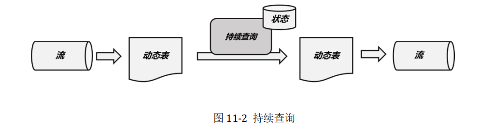

持续查询的步骤如下：

1. 流（stream）被转换为动态表（dynamic table）；

2. 对动态表进行持续查询（continuous query），生成新的动态表；

3. 生成的动态表被转换成流。

只要 API 将流和动态表的转换封装起来，就可以直接在数据流上执行 SQL 查询，用处理表的方式来做流处理了。

### 11.3.2 将流转换成动态表

```java
package org.neptune.TableAPIAndSQL;

import org.apache.flink.streaming.api.datastream.SingleOutputStreamOperator;
import org.apache.flink.streaming.api.environment.StreamExecutionEnvironment;
import org.apache.flink.table.api.Table;
import org.apache.flink.table.api.bridge.java.StreamTableEnvironment;
import org.neptune.pojo.Event;

import static org.apache.flink.table.api.Expressions.$;

public class StreamToTableExample {
    public static void main(String[] args) throws Exception {
        // 获取流环境
        StreamExecutionEnvironment env = StreamExecutionEnvironment.getExecutionEnvironment();
        env.setParallelism(1);
        // 读取数据源
        SingleOutputStreamOperator<Event> eventStream = env
                .fromElements(
                        new Event("Alice", "./home", 1000L),
                        new Event("Bob", "./cart", 1000L),
                        new Event("Alice", "./prod?id=1", 5 * 1000L),
                        new Event("Cary", "./home", 60 * 1000L),
                        new Event("Bob", "./prod?id=3", 90 * 1000L),
                        new Event("Alice", "./prod?id=7", 105 * 1000L)
                );
        // 获取表环境
        StreamTableEnvironment tableEnv = StreamTableEnvironment.create(env);
        // 将数据流转换成表
        tableEnv.createTemporaryView("EventTable", eventStream, $("user"), $("url"), $("timestamp").as("ts"));

        // 统计每个用户的点击次数
        Table urlCountTable = tableEnv.sqlQuery("SELECT user, COUNT(url) as cnt FROM EventTable GROUP BY user");
        // 将表转换成数据流，在控制台打印输出
        tableEnv.toChangelogStream(urlCountTable).print("count");

// 执行程序
        env.execute();
    }
}

```

现在的输入数据，就是用户在网站上的点击访问行为，数据类型被包装为 POJO 类型Event。我们将它转换成一个动态表，注册为 EventTable。表中的字段定义如下：

```yaml
[
 user: VARCHAR, // 用户名
 url: VARCHAR, // 用户访问的 URL
 ts: BIGINT // 时间戳
]
```

当用户点击事件到来时，就对应着动态表中的一次插入（Insert）操作，每条数据就是表中的一行；随着插入更多的点击事件，得到的动态表将不断增长。

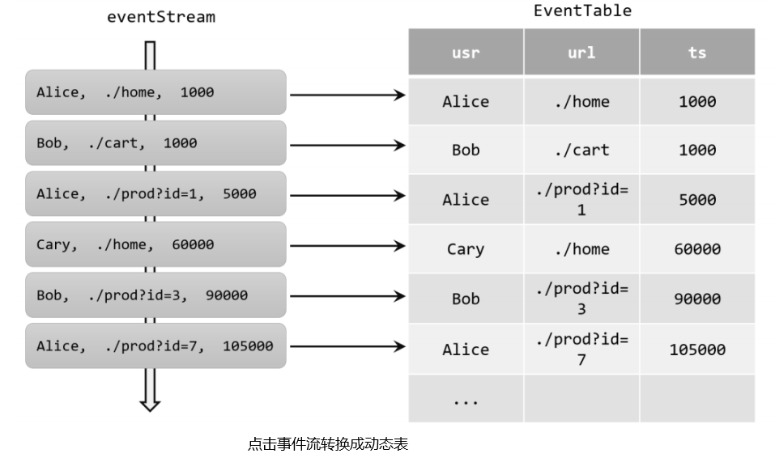

### 11.3.3 用 SQL 持续查询

#### 11.3.3.1 更新（Update）查询

```java
Table urlCountTable = tableEnv.sqlQuery("SELECT user, COUNT(url) as cnt FROM EventTable GROUP BY user");
```

分组聚合统计每个用户的点击次数。我们把原始的动态表注册为EventTable，经过查询转换后得到 urlCountTable；这个结果动态表中包含两个字段，具体定义如下：

```yaml
[
 user: VARCHAR, // 用户名
 cnt: BIGINT // 用户访问 url 的次数
]
```

用来定义结果表的更新日志（changelog）流中，包含了 INSERT 和 UPDATE 两种操作。这种持续查询被称为更新查询（Update Query），更新查询得到的结果表如果想要转换成 DataStream，必须调用 toChangelogStream()方法。

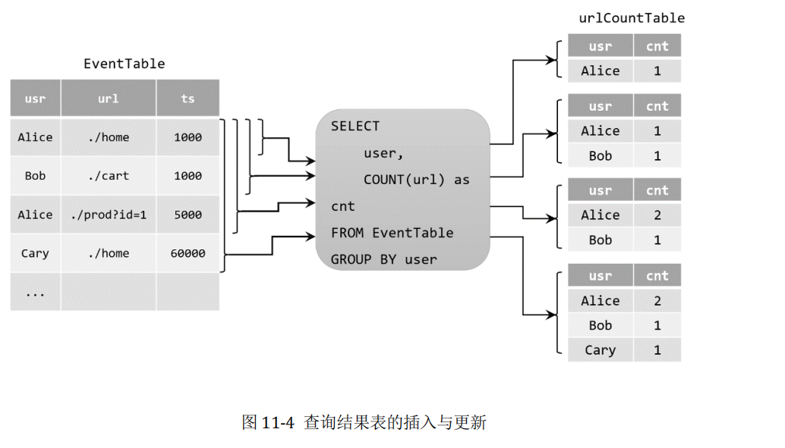

具体步骤解释如下：

1. 当查询启动时，原始动态表 EventTable 为空；

2. 当第一行 Alice 的点击数据插入 EventTable 表时，查询开始计算结果表，urlCountTable中插入一行数据[Alice，1]。

3. 当第二行 Bob 点击数据插入 EventTable 表时，查询将更新结果表并插入新行[Bob，1]。

4. 第三行数据到来，同样是 Alice 的点击事件，这时不会插入新行，而是生成一个针对已有行的更新操作。这样，结果表中第一行[Alice，1]就更新为[Alice，2]。

5. 当第四行 Cary 的点击数据插入到 EventTable 表时，查询将第三行[Cary，1]插入到结果表中。

#### 11.3.3.2 追加（Append）查询

执行一个简单的条件查询，结果表中就会像原始表 EventTable 一样，只有插入（Insert）操作了。

```java
Table aliceVisitTable = tableEnv.sqlQuery("SELECT url, user FROM EventTable WHERE user = 'Cary'");
```

这样的持续查询，就被称为追加查询（Append Query），它定义的结果表的更新日志（changelog）流中只有 INSERT 操作。追加查询得到的结果表，转换成 DataStream 调用方法没有限制，可以直接用 toDataStream()，也可以像更新查询一样调用 toChangelogStream()。

更新查询的判断标准是结果表中的数据是否会有 UPDATE 操作，如果聚合的结果不再改变，那就不是更新查询。

如窗口聚合：

开一个滚动窗口，统计每一小时内所有用户的点击次数，并在结果表中增加一个endT 字段，表示当前统计窗口的结束时间。这时结果表的字段定义如下：

```yaml
[
 user: VARCHAR, // 用户名
 endT: TIMESTAMP, // 窗口结束时间
 cnt: BIGINT // 用户访问 url 的次数
]
```

当原始动态表不停地插入新的数据时，会将统计结果追加到 result 表后面，而不会更新之前的数据。

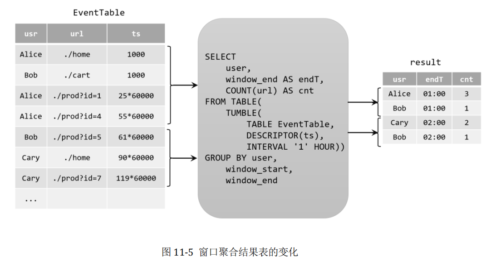

由于窗口的统计结果是一次性写入结果表的，所以结果表的更新日志流中只会包含插入 INSERT 操作，而没有更新 UPDATE 操作。所以这里的持续查询，依然是一个追加（Append）查询。结果表 result 如果转换成 DataStream，可以直接调用 toDataStream()方法

由于涉及时间窗口，还需要为事件时间提取时间戳和生成水位线

```java
package org.neptune.TableAPIAndSQL;

import org.apache.flink.api.common.eventtime.SerializableTimestampAssigner;
import org.apache.flink.api.common.eventtime.WatermarkStrategy;
import org.apache.flink.streaming.api.datastream.SingleOutputStreamOperator;
import org.apache.flink.streaming.api.environment.StreamExecutionEnvironment;
import org.apache.flink.table.api.Table;
import org.apache.flink.table.api.bridge.java.StreamTableEnvironment;
import org.neptune.pojo.Event;

import static org.apache.flink.table.api.Expressions.$;

public class AppendQueryExample {
    public static void main(String[] args) throws Exception {
        StreamExecutionEnvironment env = StreamExecutionEnvironment.getExecutionEnvironment();
        env.setParallelism(1);
        // 读取数据源，并分配时间戳、生成水位线
        SingleOutputStreamOperator<Event> eventStream = env
                .fromElements(
                        new Event("Alice", "./home", 1000L),
                        new Event("Bob", "./cart", 1000L),
                        new Event("Alice", "./prod?id=1", 25 * 60 * 1000L),
                        new Event("Alice", "./prod?id=4", 55 * 60 * 1000L),
                        new Event("Bob", "./prod?id=5", 3600 * 1000L + 60 * 1000L),
                        new Event("Cary", "./home", 3600 * 1000L + 30 * 60 * 1000L),
                        new Event("Cary", "./prod?id=7", 3600 * 1000L + 59 * 60 * 1000L)
                )
                .assignTimestampsAndWatermarks(
                        WatermarkStrategy.<Event>forMonotonousTimestamps()
                                .withTimestampAssigner(new SerializableTimestampAssigner<Event>() {
                                    @Override
                                    public long extractTimestamp(Event element, long recordTimestamp) {
                                        return element.timestamp;
                                    }
                                })
                );
        // 创建表环境
        StreamTableEnvironment tableEnv = StreamTableEnvironment.create(env);
        // 将数据流转换成表，并指定时间属性
        Table eventTable = tableEnv.fromDataStream(
                eventStream,
                $("user"),
                $("url"),
                // 将 timestamp 指定为事件时间，并命名为 ts
                $("timestamp").rowtime().as("ts")
        );
        // 为方便在 SQL 中引用，在环境中注册表 EventTable
        tableEnv.createTemporaryView("EventTable", eventTable);
        // 设置 1 小时滚动窗口，执行 SQL 统计查询
        Table result = tableEnv
                .sqlQuery(
                        "SELECT " +
                                "user, " +
                                "window_end AS endT, " + // 窗口结束时间
                                "COUNT(url) AS cnt " + // 统计 url 访问次数
                                "FROM TABLE( " +
                                "TUMBLE( TABLE EventTable, " + // 1 小时滚动窗口
                                "DESCRIPTOR(ts), " +
                                "INTERVAL '1' HOUR)) " +
                                "GROUP BY user, window_start, window_end "
                );
        tableEnv.toDataStream(result).print();
        env.execute();
    }
}
```

所有输出结果都以+I 为前缀，表示都是以 INSERT 操作追加到结果表中的；

这是一个追加查询，可以直接使用 toDataStream()转换成流。这里输出的window_end 是一个 TIMESTAMP 类型；由于直接以一个长整型数作为事件发生的时间戳，所以对应的都是 1970 年 1 月 1 日的时间。

```powershell
+I[Alice, 1970-01-01T01:00, 3]
+I[Bob, 1970-01-01T01:00, 1]
+I[Bob, 1970-01-01T02:00, 1]
+I[Cary, 1970-01-01T02:00, 2]
```

#### 11.3.3.3 查询限制

在实际应用中，有些持续查询会因为计算代价太高而受到限制。所谓的“代价太高”，可能是由于需要维护的状态持续增长，也可能是由于更新数据的计算太复杂。

* 状态大小

  用持续查询做流处理，往往会运行至少几周到几个月；所以持续查询处理的数据总量可能非常大。随着时

  间的推移，维护的状态逐渐增长，最终可能会耗尽存储空间导致查询失败。

* 更新计算

  对于有些查询来说，更新计算的复杂度可能很高，比如RANK()函数，每收到一个新的数据都要重新计算，这样的查询操作，就不太适合作为连续查询在流处理中执行。这里 RANK()的使用要配合一个 OVER 子句，这是所谓的“开窗聚合”。

### 11.3.3 将动态表转换为流

动态表可以通过插入（Insert）、更新（Update）和删除（Delete）操作，进行持续的更改。

将动态表转换为流或将其写入外部系统时，就需要对这些更改操作进行编码，通过发送编码消息的方式告诉外部系统要执行的操作。

在 Flink 中，Table API 和 SQL支持三种编码方式：

1. **仅追加（Append-only）流**

仅通过插入（Insert）更改来修改的动态表，可以直接转换为“仅追加”流。这个流中发出的数据，其实就是动态表中新增的每一行。

2. **撤回（Retract）流**

包含两类消息的流，添加（add）消息和撤回（retract）消息

* INSERT 插入操作编码为 add 消息；

* DELETE 删除操作编码为 retract消息；

* UPDATE 更新操作编码为被更改行的 retract 消息，和更新后行（新行）的 add 消息。

通过编码后的消息指明所有的增删改操作，一个动态表就可以转换为撤回流了。

更新操作对于撤回流来说，对应着两个消息：之前数据的撤回（删除）和新数据的插入

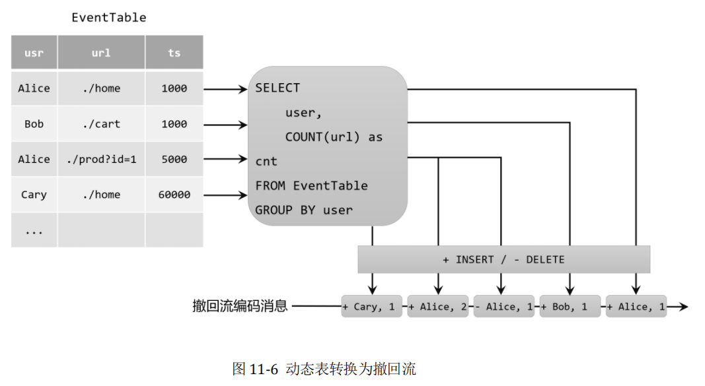

用+代表 add 消息（对应插入 INSERT 操作），用-代表 retract 消息（对应删除DELETE 操作）；

当 Alice 的第一个点击事件到来时，结果表新增一条数据[Alice, 1]；而当 Alice的第二个点击事件到来时，结果表会将[Alice, 1]更新为[Alice, 2]，对应的编码就是删除[Alice, 1]、插入[Alice, 2]。这样当一个外部系统收到这样的两条消息时，就知道是要对 Alice 的点击统计次数进行更新了。

3. **更新插入（Upsert）流**

更新插入流中只包含两种类型的消息：更新插入（upsert）消息和删除（delete）消息。

对于更新插入流来说，INSERT 插入操作和UPDATE更新操作，统一被编码为upsert消息；而DELETE删除操作则被编码为delete消息

动态表中必须有唯一的键（key）。通过这个 key 进行查询，如果存在对应的数据就做更新（update），如果不存在就直接插入（insert）。这是一个动态表可以转换为更新插入流的必要条件。当然，收到这条流中数据的外部系统，也需要知道这唯一的键（key），这样才能正确地处理消息。

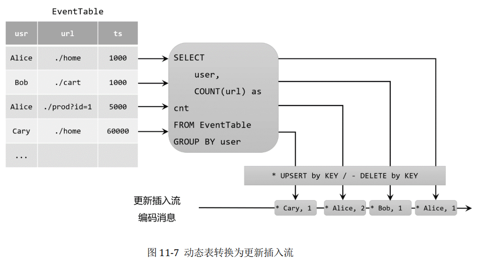

更新插入流跟撤回流的主要区别在于，更新（update）操作由于有 key 的存在，只需要用单条消息编码就可以，因此效率更高。

在代码里将动态表转换为 DataStream 时，只支持仅追加（append-only）和撤回（retract）流，我们调用 toChangelogStream()得到的其实就是撤回流；，

DataStream 中并没有 key 的定义，所以只能通过两条消息一减一增来表示更新操作。而连接到外部系统时，则可以支持不同的编码方法，这取决于外部系统本身的特性。

## 11.4 时间属性和窗口

基于时间的操作（比如时间窗口），需要定义相关的时间语义和时间数据来源的信息。在Table API 和 SQL 中，会给表单独提供一个逻辑上的时间字段，专门用来在表处理程序中指示时间。

所谓的时间属性（time attributes），就是每个表模式结构（schema）的一部分。它可以在创建表的 DDL 里直接定义为一个字段，也可以在 DataStream 转换成表时定义。一旦定义了时间属性，它就可以作为一个普通字段引用，并且可以在基于时间的操作中使用。时间属性的数据类型为 TIMESTAMP，它的行为类似于常规时间戳，可以直接访问并且进行计算。

按照时间语义的不同，可以把时间属性的定义分成事件时间（event time）和处理时间（processing time）。

### 11.4.1 事件时间

为了处理无序事件，并区分流中的迟到事件。Flink 需要从事件数据中提取时间戳，并生成水位线，用来推进事件时间的进展。

事件时间属性可以在创建表 DDL 中定义，也可以在数据流和表的转换中定义。

#### 11.4.1.1 在创建表的 DDL 中定义

在创建表的 DDL（CREATE TABLE 语句）中，可以增加一个字段，通过 WATERMARK语句来定义事件时间属性。

WATERMARK 语句主要用来定义水位线（watermark）的生成表达式，这个表达式会将带有事件时间戳的字段标记为事件时间属性，并在它基础上给出水位线的延迟时间。具体定义方式如下：

```sql
CREATE TABLE EventTable(
 user STRING,
 url STRING,
 ts TIMESTAMP(3),
 WATERMARK FOR ts AS ts - INTERVAL '5' SECOND
) WITH (
 ...
);
```

这里把 ts 字段定义为事件时间属性，而且基于 ts 设置了 5 秒的水位线延迟。这里的“5 秒”是以“时间间隔”的形式定义的，格式是 INTERVAL <数值> <时间单位>：`INTERVAL '5' SECOND`，这里的数值必须用单引号引起来，而单位用 SECOND 和 SECONDS 是等效的。

Flink 中支持的事件时间属性数据类型必须为 TIMESTAMP 或者 TIMESTAMP_LTZ。

TIMESTAMP_LTZ 是指带有本地时区信息的时间戳（TIMESTAMP WITH LOCAL TIME ZONE）；

一般情况下如果数据中的时间戳是“年-月-日-时-分-秒”的形式，那就是不带时区信息的，可以将事件时间属性定义为 TIMESTAMP 类型。

如果原始的时间戳就是一个长整型的毫秒数，这时就需要另外定义一个字段来表示事件时间属性，类型定义为 TIMESTAMP_LTZ 会更方便：

```sql
CREATE TABLE events (
 user STRING,
 url STRING,
 ts BIGINT,
 ts_ltz AS TO_TIMESTAMP_LTZ(ts, 3),
 WATERMARK FOR ts_ltz AS time_ltz - INTERVAL '5' SECOND
) WITH (
 ...
);
```

这里另外定义了一个字段 ts_ltz，是把长整型的 ts 转换为 TIMESTAMP_LTZ 得到的；

使用 WATERMARK 语句将它设为事件时间属性，并设置 5 秒的水位线延迟。

#### 11.4.1.2 在数据流转换为表时定义

事件时间属性也可以在将 DataStream 转换为表的时候来定义。

调用 fromDataStream()方法创建表时，可以追加参数来定义表中的字段结构；这时可以给某个字段加上.rowtime() 后缀，就表示将当前字段指定为事件时间属性。这个字段可以是数据中本不存在、额外追加上去的“逻辑字段”，就像之前 DDL 中定义的第二种情况；也可以是本身固有的字段，那么这个字段就会被事件时间属性所覆盖，类型也会被转换为 TIMESTAMP。不论那种方式，时间属性字段中保存的都是事件的时间戳（TIMESTAMP 类型）。

这种方式只负责指定时间属性，而时间戳的提取和水位线的生成应该之前就在 DataStream 上定义好了。由于 DataStream 中没有时区概念，因此 Flink 会将事件时间属性解析成不带时区的 TIMESTAMP 类型，所有的时间值都被当作 UTC 标准时间。

在代码中的定义方式如下：

```java
	// 方法一:
	// 流中数据类型为二元组 Tuple2，包含两个字段；需要自定义提取时间戳并生成水位线
	DataStream<Tuple2<String, String>> stream = inputStream.assignTimestampsAndWatermarks(...);
	// 声明一个额外的逻辑字段作为事件时间属性
	Table table = tEnv.fromDataStream(stream, $("user"), $("url"), $("ts").rowtime());

	// 方法二:
	// 流中数据类型为三元组 Tuple3，最后一个字段就是事件时间戳
	DataStream<Tuple3<String, String, Long>> stream = inputStream.assignTimestampsAndWatermarks(...);
	// 不再声明额外字段，直接用最后一个字段作为事件时间属性
	Table table = tEnv.fromDataStream(stream, $("user"), $("url"), $("ts").rowtime());
```

### 11.4.2 处理时间

处理时间就比较简单了，是系统时间，使用时不需要提取时间戳（timestamp）和生成水位线（watermark）

在定义处理时间属性时，必须要额外声明一个字段，专门用来保存当前的处理时间。

处理时间属性的定义也有两种方式：创建表 DDL 中定义，或者在数据流转换成表时定义。

#### 11.4.2.1 在创建表的 DDL 中定义

在创建表的 DDL（CREATE TABLE 语句）中，增加一个额外的字段，通过调用系统内置的 PROCTIME()函数来指定当前的处理时间属性，返回的类型是 TIMESTAMP_LTZ。

```sql
CREATE TABLE EventTable(
 user STRING,
 url STRING,
 ts AS PROCTIME()
) WITH (
 ...
);
```

这里的时间属性，其实是以“计算列”（computed column）的形式定义出来的。

计算列是 Flink SQL 中引入的特殊概念，可以用一个 AS 语句来在表中产生数据中不存在的列，并且可以利用原有的列、各种运算符及内置函数。在事件时间属性的定义中，将 ts 字段转换成 TIMESTAMP_LTZ 类型的 ts_ltz，也是计算列的定义方式。

#### 11.4.2.2 在数据流转换为表时定义

处理时间属性同样可以在将DataStream转换为表的时候来定义。调用fromDataStream()方法创建表时，可以用.proctime()后缀来指定处理时间属性字段。由于处理时间是系统时间，原始数据中并没有这个字段，所以处理时间属性一定不能定义在一个已有字段上，只能定义在表结构所有字段的最后，作为额外的逻辑字段出现。
代码中定义处理时间属性的方法如下：

```sql
DataStream<Tuple2<String, String>> stream = ...;
// 声明一个额外的字段作为处理时间属性字段
Table table = tEnv.fromDataStream(stream, $("user"), $("url"), $("ts").proctime());
```

### 11.4.3 窗口（Window）

有了时间属性，接下来就可以定义窗口进行计算了，窗口可以将无界流切割成大小有限的“桶”（bucket）来做计算，通过截取有限数据集来处理无限的流数据。

在 DataStream API 中提供了对不同类型的窗口进行定义和处理的接口，而在 Table API 和 SQL 中，类似的功能也都可以实现。

#### 11.4.3.1 分组窗口（Group Window，老版本）

Flink 1.12 之前的版本中，Table API 和 SQL 提供了一组“分组窗口”（Group Window）函数，常用的时间窗口如滚动窗口、滑动窗口、会话窗口都有对应的实现；

具体在 SQL 中就是调用 TUMBLE()、HOP()、SESSION()，传入时间属性字段、窗口大小等参数就可以了。

以滚动窗口为例：

```sql
TUMBLE(ts, INTERVAL '1' HOUR)
```

这里的ts 是定义好的时间属性字段，窗口大小用“时间间隔”INTERVAL 来定义。

在进行窗口计算时，分组窗口是将窗口本身当作一个字段对数据进行分组的，可以对组内的数据进行聚合。

使用方式如下：

```java
	Table result = tableEnv.sqlQuery(
	 	"SELECT " +
	 	"user, " +
		"TUMBLE_END(ts, INTERVAL '1' HOUR) as endT, " +
		"COUNT(url) AS cnt " +
	 	"FROM EventTable " +
	 	"GROUP BY " + // 使用窗口和用户名进行分组
	 	"user, " +
	 	"TUMBLE(ts, INTERVAL '1' HOUR)" // 定义 1 小时滚动窗口
	 );
```

这里定义了 1 小时的滚动窗口，将窗口和用户 user 一起作为分组的字段。用聚合函数COUNT()对分组数据的个数进行了聚合统计，并将结果字段重命名为cnt；用TUPMBLE_END()函数获取滚动窗口的结束时间，重命名为 endT 提取出来。

分组窗口的功能比较有限，只支持窗口聚合，所以目前已经处于弃用（deprecated）的状态。

#### 11.4.3.2 窗口表值函数（Windowing TVFs，新版本）

Flink1.13 版本开始，使用窗口表值函数（Windowing table-valued functions，Windowing TVFs）来定义窗口。

窗口表值函数是 Flink 定义的多态表函数（PTF），可以将表进行扩展后返回。表函数（table function）可以看作是返回一个表的函数

目前 Flink 提供了以下几个窗口 TVF：

* 滚动窗口（Tumbling Windows）；

* 滑动窗口（Hop Windows，跳跃窗口）；

* 累积窗口（Cumulate Windows）；

* 会话窗口（Session Windows，目前尚未完全支持）。

窗口表值函数可以完全替代传统的分组窗口函数。窗口 TVF 更符合 SQL 标准，性能得到了优化，拥有更强大的功能；可以支持基于窗口的复杂计算，例如窗口 Top-N、窗口联结（window join）等等。目前窗口 TVF 的功能还不完善，会话窗口和很多高级功能还不支持，不过正在快速地更新完善。在未来的版本中，窗口 TVF 将越来越强大，将会是窗口处理的唯一入口。

在窗口 TVF 的返回值中，除去原始表中的所有列，还增加了用来描述窗口的额外 3 个列：

* 窗口起始点（window_start）
* 窗口结束点（window_end）
* 窗口时间（window_time）：指窗口中的时间属性，它的值等于window_end - 1ms，相当于窗口中能够包含数据的最大时间戳。

在 SQL 中的声明方式，与以前的分组窗口是类似的，直接调用 TUMBLE()、HOP()、CUMULATE()就可以实现滚动、滑动和累积窗口，不过传入的参数会有所不同。

##### 11.4.3.2.1 滚动窗口（TUMBLE）

滚动窗口在 SQL 中的概念与 DataStream API 中的定义完全一样，是长度固定、时间对齐、无重叠的窗口，一般用于周期性的统计计算。

在 SQL 中通过调用 TUMBLE()函数就可以声明一个滚动窗口，只有一个核心参数就是窗口大小（size）。在 SQL 中不考虑计数窗口，所以滚动窗口就是滚动时间窗口，参数中还需要将当前的时间属性字段传入；另外，窗口 TVF 本质上是表函数，可以对表进行扩展，所以还应该把当前查询的表作为参数整体传入。具体声明如下：

```sql
TUMBLE(TABLE EventTable, DESCRIPTOR(ts), INTERVAL '1' HOUR)
```

这里基于时间字段 ts，对表 EventTable 中的数据开了大小为 1 小时的滚动窗口。窗口会将表中的每一行数据，按照它们 ts 的值分配到一个指定的窗口中。

##### 11.4.3.2.2 滑动窗口（HOP）

滑动窗口的使用与滚动窗口类似，可以通过设置滑动步长来控制统计输出的频率。

在 SQL中通过调用 HOP()来声明滑动窗口；除了也要传入表名、时间属性外，还需要传入窗口大小（size）和滑动步长（slide）两个参数。

```sql
HOP(TABLE EventTable, DESCRIPTOR(ts), INTERVAL '5' MINUTES, INTERVAL '1' HOURS));
```

这里基于时间属性 ts，在表 EventTable 上创建了大小为 1 小时的滑动窗口，每 5 分钟滑动一次。需要注意的是，紧跟在时间属性字段后面的第三个参数是步长（slide），第四个参数才是窗口大小（size）。

##### 11.4.3.2.3 累积窗口（CUMULATE）

统计周期较长时，希望中间每隔一段时间就输出一次当前的统计值；与滑动窗口不同的是，在一个统计周期内，会多次输出统计值，它们应该是不断叠加累积的。

例如，按天来统计网站的 PV（Page View，页面浏览量），如果用 1 天的滚动窗口那需要到每天 24 点才会计算一次，输出频率太低；如果用滑动窗口，计算频率可以更高，但统计的就变成了“过去 24 小时的 PV”。所以我们真正希望的是，还是按照自然日统计每天的PV，不过需要每隔 1 小时就输出一次当天到目前为止的 PV 值。这种特殊的窗口就叫作“累积窗口”（Cumulate Window）。

累积窗口是窗口 TVF 中新增的窗口功能，它会在一定的统计周期内进行累积计算。累积窗口中有两个核心的参数：

* 最大窗口长度（max window size）：统计周期，最终目的就是统计这段时间内的数据
* 累积步长（step）

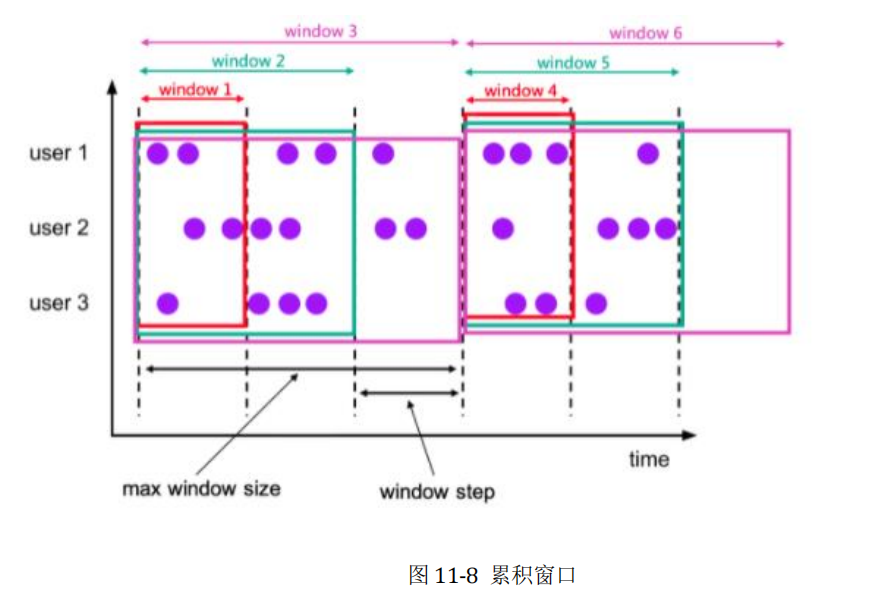

开始时，创建的第一个窗口大小就是步长 step；之后的每个窗口都会在之前的基础上再扩展 step 的长度，直到达到最大窗口长度。在 SQL 中可以用 CUMULATE()函数来定义

```sql
CUMULATE(TABLE EventTable, DESCRIPTOR(ts), INTERVAL '1' HOURS, INTERVAL '1' DAYS))
```

这里基于时间属性 ts，在表 EventTable 上定义了一个统计周期为 1 天、累积步长为 1小时的累积窗口。

第三个参数为步长 step，第四个参数则是最大窗口长度。

上面所有的语句只是定义了窗口，类似于 DataStream API 中的窗口分配器；在 SQL 中窗口的完整调用，还需要配合聚合操作和其它操作。

## 11.5 聚合（Aggregation）查询

Flink 中的 SQL 是流处理与标准 SQL 结合的产物，所以聚合查询也可以分成两种：流处理中特有的聚合（主要指窗口聚合），以及 SQL 原生的聚合查询方式。

### 11.5.1 分组聚合

分组聚合：多对一的转换，多条输入数据进行计算，得到一个唯一的值

```java
//计算输入数据的个数
Table eventCountTable = tableEnv.sqlQuery("select COUNT(*) from EventTable");
```

```sql
--按照用户名进行分组，统计每个用户点击 url 的次数：
SELECT user, COUNT(url) as cnt FROM EventTable GROUP BY user
```

SQL 中的分组聚合可以对应 DataStream API 中 keyBy 之后的聚合转换，它们都是按照某个 key 对数据进行了划分，各自维护状态来进行聚合统计的。

在流处理中，分组聚合同样是一个持续查询，而且是一个更新查询，得到的是一个动态表；因此，想要将结果表转换成流或输出到外部系统，必须采用撤回流（retract stream）或更新插入流（upsert stream）的编码方式；如果在代码中直接转换成 DataStream 打印输出，需要调用 toChangelogStream()。

在持续查询的过程中，由于用于分组的 key 可能会不断增加，因此计算结果所需要维护的状态也会持续增长。为了防止状态无限增长耗尽资源，Flink Table API 和 SQL 可以在表环境中配置状态的生存时间（TTL）：

```java
	TableEnvironment tableEnv = ...
	// 获取表环境的配置
	TableConfig tableConfig = tableEnv.getConfig();
	// 配置状态保持时间
	tableConfig.setIdleStateRetention(Duration.ofMinutes(60));
```

也可以直接设置配置项 table.exec.state.ttl：

```java
TableEnvironment tableEnv = ...
Configuration configuration = tableEnv.getConfig().getConfiguration();
configuration.setString("table.exec.state.ttl", "60 min");
```

这两种方式是等效的。配置 TTL 有可能会导致统计结果不准确，这是以牺牲正确性为代价换取了资源的释放。

此外，在 Flink SQL 的分组聚合中同样可以使用 DISTINCT 进行去重的聚合处理；可以使用 HAVING 对聚合结果进行条件筛选；还可以使用 GROUPING SETS（分组集）设置多个分组情况分别统计。。

分组聚合既是 SQL 原生的聚合查询，也是流处理中的聚合操作，这是实际应用中最常见的聚合方式。当然，使用的聚合函数一般都是系统内置的，如果希望实现特殊需求也可以进行自定义。

### 11.5.2 窗口聚合

在 Flink 的 Table API 和 SQL 中，窗口的计算是通过“窗口聚合”（window aggregation）来实现的

窗口聚合时，需要将窗口信息作为分组 key 的一部分定义出来。

在 Flink 1.12 版本之前，是直接把窗口自身作为分组 key 放在GROUP BY 之后的，所以也叫“分组窗口聚合”；

1.13 版本开始使用了“窗口表值函数”（Windowing TVF），窗口本身返回的是就是一个表，所以窗口会出现在FROM后面，GROUP BY 后面的则是窗口新增的字段 window_start 和 window_end。

用窗口 TVF 实现分组窗口的聚合：

```java
	Table result = tableEnv.sqlQuery(
 	  "SELECT " +
	 "user, " +
	 "window_end AS endT, " +
	 "COUNT(url) AS cnt " +
	 "FROM TABLE( " +
	 "TUMBLE( TABLE EventTable, " +
	 "DESCRIPTOR(ts), " +
	 "INTERVAL '1' HOUR)) " +
	 "GROUP BY user, window_start, window_end "
	 );
```

这里以 ts 作为时间属性字段、基于 EventTable 定义了 1 小时的滚动窗口，希望统计出每小时每个用户点击 url 的次数。用来分组的字段是用户名 user，以及表示窗口的window_start 和 window_end；而 TUMBLE()是表值函数，所以得到的是一个表（Table），聚合查询就是在这个 Table 中进行的

Flink SQL 目前提供了滚动窗口 TUMBLE()、滑动窗口 HOP()和累积窗口（CUMULATE）三种表值函数（TVF）。在具体应用中，我们还需要提前定义好时间属性。

以累积窗口为例：

```java
package org.neptune.TableAPIAndSQL;

import org.apache.flink.api.common.eventtime.SerializableTimestampAssigner;
import org.apache.flink.api.common.eventtime.WatermarkStrategy;
import org.apache.flink.streaming.api.datastream.SingleOutputStreamOperator;
import org.apache.flink.streaming.api.environment.StreamExecutionEnvironment;
import org.apache.flink.table.api.Table;
import org.apache.flink.table.api.bridge.java.StreamTableEnvironment;
import org.neptune.pojo.Event;

import static org.apache.flink.table.api.Expressions.$;

public class CumulateWindowExample {
    public static void main(String[] args) throws Exception {
        StreamExecutionEnvironment env = StreamExecutionEnvironment.getExecutionEnvironment();
        env.setParallelism(1);
        // 读取数据源，并分配时间戳、生成水位线
        SingleOutputStreamOperator<Event> eventStream = env
                .fromElements(
                        new Event("Alice", "./home", 1000L),
                        new Event("Bob", "./cart", 1000L),
                        new Event("Alice", "./prod?id=1", 25 * 60 * 1000L),
                        new Event("Alice", "./prod?id=4", 55 * 60 * 1000L),
                        new Event("Bob", "./prod?id=5", 3600 * 1000L + 60 * 1000L),
                        new Event("Cary", "./home", 3600 * 1000L + 30 * 60 * 1000L),
                        new Event("Cary", "./prod?id=7", 3600 * 1000L + 59 * 60 * 1000L)
                )
                .assignTimestampsAndWatermarks(
                        WatermarkStrategy.<Event>forMonotonousTimestamps()
                                .withTimestampAssigner(new SerializableTimestampAssigner<Event>() {
                                    @Override
                                    public long extractTimestamp(Event element, long recordTimestamp) {
                                        return element.timestamp;
                                    }
                                })
                );
        // 创建表环境
        StreamTableEnvironment tableEnv = StreamTableEnvironment.create(env);
        // 将数据流转换成表，并指定时间属性
        Table eventTable = tableEnv.fromDataStream(
                eventStream,
                $("user"),
                $("url"),
                $("timestamp").rowtime().as("ts")
        );
        // 为方便在 SQL 中引用，在环境中注册表 EventTable
        tableEnv.createTemporaryView("EventTable", eventTable);
        // 设置累积窗口，执行 SQL 统计查询
        Table result = tableEnv
                .sqlQuery(
                        "SELECT " +
                                "user, " +
                                "window_end AS endT, " +
                                "COUNT(url) AS cnt " +
                                "FROM TABLE( " +
                                "CUMULATE( TABLE EventTable, " + // 定义累积窗口
                                "DESCRIPTOR(ts), " +
                                "INTERVAL '30' MINUTE, " + //累积间隔为 30 分钟
                                "INTERVAL '1' HOUR)) " + //统计周期为 1 小时
                                "GROUP BY user, window_start, window_end "
                );
        tableEnv.toDataStream(result).print();
        env.execute();
    }
}
```

与分组聚合不同，窗口聚合不会将中间聚合的状态输出，只会最后输出一个结果。

除了应用简单的聚合函数、提取窗口开始时间（window_start）和结束时间(window_end)之外，窗口 TVF 还提供了一个 window_time 字段，用于表示窗口中的时间属性；这样就可以方便地进行窗口的级联（cascading window）和计算了。另外，窗口 TVF 还支持 GROUPING SETS，极大地扩展了窗口的应用范围。

基于窗口的聚合，是流处理中聚合统计的一个特色，也是与标准 SQL 最大的不同之处。在实际项目中，很多统计指标其实都是基于时间窗口来进行计算的，所以窗口聚合是 Flink SQL中非常重要的功能；

基于窗口 TVF 的聚合未来也会有更多功能的扩展支持，比如窗口 Top N、会话窗口、窗口联结等等。

### 11.5.3 开窗（Over）聚合

在标准 SQL 中还有另外一类比较特殊的聚合方式，可以针对每一行计算一个聚合值。

以每一行数据为基准，计算它之前 1 小时内所有数据的平均值；也可以计算它之前 10 个数的平均值。就好像是在每一行上打开了一扇窗户、收集数据进行统计一样，这就是所谓的“开窗函数”。

开窗函数是对每行都要做一次开窗聚合，因此聚合之后表中的行数不会有任何减少，是一个“多对多”的关系。

与标准 SQL 中一致，Flink SQL 中的开窗函数也是通过 OVER 子句来实现的，所以有时开窗聚合也叫作“OVER 聚合”（Over Aggregation）。基本语法如下：

```sql
SELECT
 <聚合函数> OVER (
 [PARTITION BY <字段 1>[, <字段 2>, ...]]
 ORDER BY <时间属性字段>
 <开窗范围>),
 ...
FROM ...
```

这里 OVER 关键字前面是一个聚合函数，它会应用在后面 OVER 定义的窗口上。

OVER子句中主要有以下几个部分：

* PARTITION BY（可选）

用来指定分区的键（key），类似于 GROUP BY 的分组，这部分是可选的；

* ORDER BY

OVER 窗口是基于当前行扩展出的一段数据范围，选择的标准可以基于时间也可以基于数量。不论哪种定义，数据都应该是以某种顺序排列好的；而表中的数据本身是无序的。所以在OVER 子句中必须用 ORDER BY 明确地指出数据基于那个字段排序。在 Flink 的流处理中，目前==只支持按照时间属性的升序排列==，所以这里 ORDER BY 后面的字段必须是定义好的时间属性。

* 开窗范围

对于开窗函数而言，还有一个必须要指定的就是开窗的范围，也就是到底要扩展多少行来做聚合。这个范围是由 BETWEEN <下界> AND <上界> 来定义的，也就是“从下界到上界”的范围。目前支持的上界只能是 CURRENT ROW，也就是定义一个“从之前某一行到当前行”的范围，所以一般的形式为：

```sql
BETWEEN ... PRECEDING AND CURRENT ROW
```

开窗选择的范围可以基于时间，也可以基于数据的数量。所以开窗范围还应该在两种模式之间做出选择：范围间隔（RANGE intervals）和行间隔（ROW intervals）。

* 范围间隔

范围间隔以 RANGE 为前缀，就是基于 ORDER BY 指定的时间字段去选取一个范围，一般就是当前行时间戳之前的一段时间。例如开窗范围选择当前行之前 1 小时的数据：

```sql
RANGE BETWEEN INTERVAL '1' HOUR PRECEDING AND CURRENT ROW
```

* 行间隔

行间隔以 ROWS 为前缀，就是直接确定要选多少行，由当前行出发向前选取就可以了。例如开窗范围选择当前行之前的 5 行数据（最终聚合会包括当前行，所以一共 6 条数据）：

```sql
ROWS BETWEEN 5 PRECEDING AND CURRENT ROW
```

具体示例：

```sql
SELECT user, ts,
 COUNT(url) OVER (
 PARTITION BY user
 ORDER BY ts
 RANGE BETWEEN INTERVAL '1' HOUR PRECEDING AND CURRENT ROW
 ) AS cnt
FROM EventTable
```

这里以 ts 作为时间属性字段，对 EventTable 中的每行数据都选取它之前 1 小时的所有数据进行聚合，统计每个用户访问 url 的总次数，并重命名为 cnt。最终将表中每行的 user，ts 以及扩展出 cnt 提取出来。

整个开窗聚合的结果，是对每一行数据都有一个对应的聚合值，因此就像将表中扩展出了一个新的列一样。由于聚合范围上界只能到当前行，新到的数据一般不会影响之前数据的聚合结果，所以结果表只需要不断插入（INSERT）就可以了。

开窗聚合与窗口聚合（窗口 TVF 聚合）本质上不同，不过也还是有一些相似之处的：它们都是在无界的数据流上划定了一个范围，截取出有限数据集进行聚合统计；这其实都是“窗口”的思路。

在 Table API 中定义了两类窗口：分组窗口（GroupWindow）和开窗窗口（OverWindow）；

==在 SQL 中，也可以用 WINDOW 子句来在 SELECT 外部单独定义一个 OVER 窗口：==

```sql
SELECT user, ts,
 COUNT(url) OVER w AS cnt,
  MAX(CHAR_LENGTH(url)) OVER w AS max_url
FROM EventTable
WINDOW w AS (
 PARTITION BY user
 ORDER BY ts
 ROWS BETWEEN 2 PRECEDING AND CURRENT ROW)
```

上面的 SQL 中定义了一个选取之前 2 行数据的 OVER 窗口，并重命名为 w；接下来就可以基于它调用多个聚合函数，扩展出更多的列提取出来。比如这里除统计 url 的个数外，还统计了 url 的最大长度：首先用 CHAR_LENGTH()函数计算出 url 的长度，再调用聚合函数 MAX()进行聚合统计。这样，就可以方便重复引用定义好的 OVER 窗口了，大大增强了代码的可读性。

### 11.5.4 应用实例 —— Top N

Top N 聚合字面意思是“最大 N 个”，这只是一个泛称，它不仅包括查询最大的 N 个值、也包括了查询最小的 N 个值的场景。每次聚合的结果不是一行，而是 N 行

这种函数相当于把一个表聚合成了另一个表，所以叫作“表聚合函数”（Table Aggregate Function）。

表聚合函数的抽象比较困难，目前只有窗口 TVF 有能力提供直接的 Top N 聚合，不过也尚未实现。

目前在 Flink SQL 中没有能够直接调用的 Top N 函数，而是提供了稍微复杂些的变通实现方法。

#### 11.5.4.1 普通 Top N

通过 OVER 聚合和一个条件筛选来实现 Top N 的。具体来说，是通过将一个特殊的聚合函数ROW_NUMBER()应用到OVER窗口上，统计出每一行排序后的行号，作为一个字段提取出来；然后再用 WHERE 子句筛选行号小于等于 N 的那些行返回。

```sql
SELECT ...
FROM (
 SELECT ...,
 ROW_NUMBER() OVER (
[PARTITION BY <字段 1>[, <字段 1>...]]
 ORDER BY <排序字段 1> [asc|desc][, <排序字段 2> [asc|desc]...]
) AS row_num
 FROM ...)
WHERE row_num <= N [AND <其它条件>]
```

这里的 OVER 窗口定义与之前的介绍基本一致，目的就是利用 ROW_NUMBER()函数为每一行数据聚合得到一个排序之后的行号。行号重命名为 row_num，并在外层的查询中以row_num <= N 作为条件进行筛选，就可以得到根据排序字段统计的 Top N 结果了。

需要对关键字额外做一些说明：

* WHERE

用来指定 Top N 选取的条件，这里必须通过 row_num <= N 或者 row_num < N + 1 指定一个“排名结束点”（rank end），以保证结果有界。

* PARTITION BY

是可选的，用来指定分区的字段，这样我们就可以针对不同的分组分别统计 Top N 了。

* ORDER BY

指定了排序的字段，因为只有排序之后，才能进行前 N 个最大/最小的选取。每个排序字段后可以用 asc 或者 desc 来指定排序规则：asc 为升序排列，取出的就是最小的 N 个值；desc为降序排序，对应的就是最大的 N 个值。默认情况下为升序，asc 可以省略。

因为 OVER 窗口目前并不完善，不过针对 Top N 这样一个经典应用场景，Flink SQL专门用 OVER 聚合做了优化实现。所以==只有在 Top N 的应用场景中，OVER 窗口 ORDER BY后才可以指定其它排序字段==；而要想实现 Top N，就==必须按照上面的格式进行定义，否则 Flink SQL 的优化器将无法正常解析==。而且，目前 Table API 中并不支持 ROW_NUMBER()函数，所以也只有 SQL 中这一种通用的 Top N 实现方式。

Top N 的实现必须写成上面的嵌套查询形式。这是因为行号 row_num 是内部子查询聚合的结果，不可能在内部作为筛选条件，只能放在外层的 WHERE 子句中。

统计每个用户的访问事件中，按照字符长度排序的前两个url：

```sql
SELECT user, url, ts, row_num
FROM (
 SELECT *,
 ROW_NUMBER() OVER (
PARTITION BY user
 ORDER BY CHAR_LENGTH(url) desc 
) AS row_num
 FROM EventTable)
WHERE row_num <= 2
```

这里以用户来分组，以访问 url 的字符长度作为排序的字段，降序排列后用聚合统计出每一行的行号，相当于在 EventTable 基础上扩展出了一列 row_num。而后筛选出行号小于等于 2 的所有数据，就得到了每个用户访问的长度最长的两个 url。

这里的 Top N 聚合是一个更新查询。新数据到来后，可能会改变之前数据的排名，所以会有更新（UPDATE）操作。这是 ROW_NUMBER()聚合函数的特性决定的。因此，如果执行上面的 SQL 得到结果表，需要调用 toChangelogStream()才能转换成流打印输出。

#### 11.5.4.2 窗口 Top N

电商行业，实际应用中往往有这样的需求：统计一段时间内的热门商品。这就需要先开窗口，在窗口中统计每个商品的点击量；然后将统计数据收集起来，按窗口进行分组，并按点击量大小降序排序，选取前 N 个作为结果返回。

先做一个窗口聚合，将窗口信息 window_start、window_end 连同每个商品的点击量一并返回，这样就得到了聚合的结果表，包含了窗口信息、商品和统计的点击量。

接下来就可以像一般的 Top N 那样定义 OVER 窗口了，按窗口分组，按点击量排序，用ROW_NUMBER()统计行号并筛选前 N 行就可以得到结果。所以窗口 Top N 的实现就是窗口聚合与 OVER 聚合的结合使用。

统计每小时内有最多访问行为的用户，取前两名，相当于是一个每小时活跃用户的查询。

```java
package org.neptune.TableAPIAndSQL;

import org.apache.flink.api.common.eventtime.SerializableTimestampAssigner;
import org.apache.flink.api.common.eventtime.WatermarkStrategy;
import org.apache.flink.streaming.api.datastream.SingleOutputStreamOperator;
import org.apache.flink.streaming.api.environment.StreamExecutionEnvironment;
import org.apache.flink.table.api.Table;
import org.apache.flink.table.api.bridge.java.StreamTableEnvironment;
import org.neptune.pojo.Event;

import static org.apache.flink.table.api.Expressions.$;

public class WindowTopNExample {
    public static void main(String[] args) throws Exception {
        StreamExecutionEnvironment env = StreamExecutionEnvironment.getExecutionEnvironment();
        env.setParallelism(1);
        // 读取数据源，并分配时间戳、生成水位线
        SingleOutputStreamOperator<Event> eventStream = env.fromElements(new Event("Alice", "./home", 1000L),
                        new Event("Bob", "./cart", 1000L),
                        new Event("Alice", "./prod?id=1", 25 * 60 * 1000L),
                        new Event("Alice", "./prod?id=4", 55 * 60 * 1000L),
                        new Event("Bob", "./prod?id=5", 3600 * 1000L + 60 * 1000L),
                        new Event("Cary", "./home", 3600 * 1000L + 30 * 60 * 1000L),
                        new Event("Cary", "./prod?id=7", 3600 * 1000L + 59 * 60 * 1000L))
                .assignTimestampsAndWatermarks(WatermarkStrategy.<Event>forMonotonousTimestamps()
                        .withTimestampAssigner(new SerializableTimestampAssigner<Event>() {
                            @Override
                            public long extractTimestamp(Event element, long recordTimestamp) {
                                return element.timestamp;
                            }
                        }));

        // 创建表环境
        StreamTableEnvironment tableEnv = StreamTableEnvironment.create(env);

        // 将数据流转换成表，并指定时间属性
        Table eventTable = tableEnv.fromDataStream(eventStream,
                $("user"),
                $("url"),
                $("timestamp").rowtime().as("ts"));// 将 timestamp 指定为事件时间，并命名为 ts

        // 为方便在 SQL 中引用，在环境中注册表 EventTable
        tableEnv.createTemporaryView("EventTable", eventTable);

        // 定义子查询，进行窗口聚合，得到包含窗口信息、用户以及访问次数的结果表
        String subQuery =
                "SELECT window_start,window_end,user,COUNT(url) AS cnt " +
                        "FROM TABLE ( " +
                        "TUMBLE(TABLE EventTable, DESCRIPTOR(ts), INTERVAL '1' HOUR))" +
                        "GROUP BY window_start,window_end,user ";
        // 定义 Top N 的外层查询
        String topNQuery =
                "SELECT * " +
                        "FROM (" +
                        "SELECT *, " +
                        "ROW_NUMBER() OVER ( " +
                        "PARTITION BY window_start, window_end " +
                        "ORDER BY cnt desc " +
                        ") AS row_num " +
                        "FROM (" + subQuery + ")) " +
                        "WHERE row_num <= 2";
        // 执行 SQL 得到结果表
        Table result = tableEnv.sqlQuery(topNQuery);
        tableEnv.toDataStream(result).print();
        env.execute();
    }
}


```

1. 首先基于 ts 时间字段定义 1 小时滚动窗口，统计 EventTable 中每个用户的访问次数，重命名为 cnt；为了方便后面做排序，我们将窗口信息 window_start 和 window_end 也提取出来，与 user 和 cnt 一起作为聚合结果表中的字段。

2. 然后套用 Top N 模板，对窗口聚合的结果表中每一行数据进行 OVER 聚合统计行号。这里以窗口信息进行分组，按访问次数 cnt 进行排序，并筛选行号小于等于 2 的数据，就可以得到每个窗口内访问次数最多的前两个用户了。

```powershell
+I[1970-01-01T00:00, 1970-01-01T01:00, Alice, 3, 1]
+I[1970-01-01T00:00, 1970-01-01T01:00, Bob, 1, 2]
+I[1970-01-01T01:00, 1970-01-01T02:00, Cary, 2, 1]
+I[1970-01-01T01:00, 1970-01-01T02:00, Bob, 1, 2]
```

第一个 1 小时窗口中，Alice 有 3 次访问排名第一，Bob 有 1 次访问排名第二；而第二小时内，Cary 以 2 次访问占据活跃榜首，Bob 仍以 1 次访问排名第二。由于窗口的统计结果只会最终输出一次，所以排名也是确定的，这里结果表中只有插入（INSERT）操作。

也就是说，窗口 Top N 是追加查询，可以直接用 toDataStream()将结果表转换成流打印输出。

## 11.6 联结（Join）查询

在标准 SQL 中，可以将多个表连接合并起来，从中查询出想要的信息；这种操作就是表的联结（Join）。在 Flink SQL 中，同样支持各种灵活的联结（Join）查询，操作的对象是动态表。

在流处理中，动态表的 Join 对应着两条数据流的 Join 操作。与上一节的聚合查询类似，Flink SQL 中的联结查询大体上也可以分为两类：SQL 原生的联结查询方式，和流处理中特有的联结查询。

### 11.6.1 常规联结查询

Flink SQL 的常规联结也可以分为内联结（INNER JOIN）和外联结（OUTER JOIN），区别在于结果中是否包含不符合联结条件的行。==目前仅支持“等值条件”作为联结条件==，也就是关键字 ON 后面必须是判断两表中字段相等的逻辑表达式。**同常规SQL**

#### 11.6.1.1 等值内联结（INNER Equi-JOIN）

内联结用 INNER JOIN 来定义，会返回两表中符合联接条件的所有行的组合，也就是所谓的笛卡尔积（Cartesian product）。目前仅支持等值联结条件

```sql
SELECT *
FROM Order
INNER JOIN Product
ON Order.product_id = Product.id
```

#### 11.6.1.2 等值外联结（OUTER Equi-JOIN）

与内联结类似，外联结也会返回符合联结条件的所有行的笛卡尔积；另外，还可以将某一侧表中找不到任何匹配的行也单独返回。Flink SQL 支持左外（LEFT JOIN）、右外（RIGHT JOIN）和全外（FULL OUTER JOIN），分别表示会将左侧表、右侧表以及双侧表中没有任何匹配的行返回。

例如，订单表中未必包含了商品表中的所有 ID，为了将哪些没有任何订单的商品信息也查询出来，就可以使用右外联结（RIGHT JOIN）。当然，外联结查询目前也仅支持等值联结条件。具体用法如下：

```sql
SELECT *
FROM Order
LEFT JOIN Product
ON Order.product_id = Product.id
SELECT *
FROM Order
RIGHT JOIN Product
ON Order.product_id = Product.id
SELECT *
FROM Order
FULL OUTER JOIN Product
ON Order.product_id = Product.id
```

### 11.6.2 间隔联结查询

目前 Flink SQL 还不支持窗口联结，而间隔联结则已经实现。

间隔联结（Interval Join）返回的，同样是符合约束条件的两条中数据的笛卡尔积。只不过这里的“约束条件”除了常规的联结条件外，还多了一个时间间隔的限制。具体语法有以下要点：

* 两表的联结

间隔联结不需要用 JOIN 关键字，直接在 FROM 后将要联结的两表列出来就可以，用逗号分隔。这与标准 SQL 中的语法一致，表示一个“交叉联结”（Cross Join），会返回两表中所有行的笛卡尔积。

* 联结条件

联结条件用 WHERE 子句来定义，用一个等值表达式描述。交叉联结之后再用 WHERE进行条件筛选，效果跟内联结 INNER JOIN ... ON ...非常类似。

* 时间间隔限制

在 WHERE 子句中，联结条件后用 AND 追加一个时间间隔的限制条件；做法是提取左右两侧表中的时间字段，然后用一个表达式来指明两者需要满足的间隔限制。具体定义方式有下面三种，这里分别用 ltime 和 rtime 表示左右表中的时间字段：

1. `ltime = rtime`

2. `ltime >= rtime AND ltime < rtime + INTERVAL '10' MINUTE`

3. `ltime BETWEEN rtime - INTERVAL '10' SECOND AND rtime + INTERVAL '5' SECOND`

判断两者相等，这是最强的时间约束，要求两表中数据的时间必须完全一致才能匹配；一般情况下，我们还是会放宽一些，给出一个间隔。间隔的定义可以用<，<=，>=，>这一类的关系不等式，也可以用 BETWEEN ... AND ...这样的表达式。

例如，现在除了订单表 Order 外，还有一个“发货表”Shipment，要求在收到订单后四个小时内发货。那么就可以用一个间隔联结查询，把所有订单与它对应的发货信息连接合并在一起返回。

```sql
SELECT *
FROM Order o, Shipment s
WHERE o.id = s.order_id
AND o.order_time BETWEEN s.ship_time - INTERVAL '4' HOUR AND s.ship_time
```

在流处理中，间隔联结查询只支持具有时间属性的“仅追加”（Append-only）表。

那对于有更新操作的表，又怎么办呢？除了间隔联结之外，Flink SQL 还支持时间联结（Temporal Join），这主要是针对“版本表”（versioned table）而言的。所谓版本表，就是记录了数据随着时间推移版本变化的表，可以理解成一个“更新日志”（change log），它就是具有时间属性、还会进行更新操作的表。当我们联结某个版本表时，并不是把当前的数据连接合并起来就行了，而是希望能够根据数据发生的时间，找到当时的“版本”；这种根据更新时间提取当时的值进行联结的操作，就叫作“时间联结”（Temporal Join）。这部分内容由于涉及版本表的定义，此处不详细展开了，可以查阅官网资料。

## 11.7 函数

Flink SQL 中的函数可以分为两类：一类是 SQL 中内置的系统函数，直接通过函数名调用就可以，能够实现一些常用的转换操作，比如 COUNT()、CHAR_LENGTH()、UPPER()等等；而另一类函数则是用户自定义的函数（UDF），需要在表环境中注册才能使用。

### 11.7.1 系统函数

系统函数（System Functions）也叫内置函数（Built-in Functions），是在系统中预先实现好的功能模块。可以通过固定的函数名直接调用，实现想要的转换操作。

Flink SQL 中的系统函数又主要可以分为两大类：标量函数（Scalar Functions）和聚合函数（Aggregate Functions）。

#### 11.7.1.1  标量函数（Scalar Functions）

“标量”是指只有数值大小、没有方向的量；所以标量函数指的就是**只对输入数据做转换操作、返回一个值的函数**。这里的输入数据指表中一行数据中 1 个或多个字段，因此这种操作有点像流处理转换算子中的 map。另外，对于一些没有输入参数、直接可以得到唯一结果的函数，也属于标量函数。

常用函数列表：

- 比较函数（Comparison Functions）

  比较函数是一个比较表达式，用来判断两个值之间的关系，返回一个布尔类型的值。这个比较表达式可以是用 <、>、= 等符号连接两个值，也可以是用关键字定义的某种判断。
  - value1 = value2 判断两个值相等
  - value1 <> value2 判断两个值不相等
  - value IS NOT NULL 判断 value 不为空

- 逻辑函数（Logical Functions）

  逻辑函数是一个逻辑表达式，也就是用与（AND）、或（OR）、非（NOT）将布尔类型的值连接起来，也可以用判断语句（IS、IS NOT）进行真值判断；返回的还是一个布尔类型的值。例如：

  * boolean1 OR boolean2 布尔值 boolean1 与布尔值 boolean2 取逻辑或
  * boolean IS FALSE 判断布尔值 boolean 是否为 false
  * NOT boolean 布尔值 boolean 取逻辑非

- 算术函数（Arithmetic Functions）

  进行算术计算的函数，包括用算术符号连接的运算，和复杂的数学运算。例如：

  * numeric1 + numeric2 两数相加
  * POWER(numeric1, numeric2) 幂运算，取数 numeric1 的 numeric2 次方
  * RAND() 返回（0.0, 1.0）区间内的一个 double 类型的伪随机数

- 字符串函数（String Functions）

  进行字符串处理的函数。例如：

  * string1 || string2 两个字符串的连接
  * UPPER(string) 将字符串 string 转为全部大写
  * CHAR_LENGTH(string) 计算字符串 string 的长度

- 时间函数（Temporal Functions）

  进行与时间相关操作的函数。例如：

  * DATE string 按格式"yyyy-MM-dd"解析字符串 string，返回类型为 SQL Date
  * TIMESTAMP string 按格式"yyyy-MM-dd HH:mm:ss[.SSS]"解析，返回类型为 SQL timestamp
  * CURRENT_TIME 返回本地时区的当前时间，类型为 SQL time（与 LOCALTIME等价）
  * INTERVAL string range 返回一个时间间隔。string 表示数值；range 可以是 DAY，MINUTE，DAT TO HOUR 等单位，也可以是 YEAR TO MONTH 这样的复合单位。如“2 年10 个月”可以写成：INTERVAL '2-10' YEAR TO MONTH

#### 11.7.1.2 聚合函数（Aggregate Functions）

聚合函数是以表中多个行作为输入，提取字段进行聚合操作的函数，会将唯一的聚合值作为结果返回。

* COUNT(*) 返回所有行的数量，统计个数

* SUM([ ALL | DISTINCT ] expression) 对某个字段进行求和操作。默认情况下省略了关键字 ALL，表示对所有行求和；如果指定 DISTINCT，则会对数据进行去重，每个值只叠加一次。

* RANK() 返回当前值在一组值中的排名

* ROW_NUMBER() 对一组值排序后，返回当前值的行号。与 RANK()的功能相似

**其中，RANK()和 ROW_NUMBER()一般用在 OVER 窗口中**

### 11.7.2 自定义函数（UDF）

Flink 的 Table API 和 SQL 提供了多种自定义函数的接口，以抽象类的形式定义。当前 UDF主要有以下几类：

* 标量函数（Scalar Functions）：将输入的标量值转换成一个新的标量值；

* 表函数（Table Functions）：将标量值转换成一个或多个新的行数据，也就是扩展成一个表；

* 聚合函数（Aggregate Functions）：将多行数据里的标量值转换成一个新的标量值；

* 表聚合函数（Table Aggregate Functions）：将多行数据里的标量值转换成一个或多个新的行数据。

#### 11.7.2.1 整体调用流程

* 注册函数

  注册函数时需要调用表环境的 createTemporarySystemFunction()方法，传入注册的函数名以及 UDF 类的 Class 对象：

  ```java
  // 注册函数
  tableEnv.createTemporarySystemFunction("MyFunction", MyFunction.class);
  ```

  自定义的 UDF 类叫作 MyFunction，它应该是上面四种 UDF 抽象类中某一个的具体实现；在环境中将它注册为名叫 MyFunction 的函数。

  * createTemporarySystemFunction()：创建一个“临时系统函数”，是全局的 ， 可以当作系统函数来使用；
  * createTemporaryFunction()：创建一个“目录函数”（catalog function），注册的函数依赖于当前的数据库（database）和目录（catalog），它的完整名称应该包括所属的 database 和 catalog。

  **一般情况下，直接用 createTemporarySystemFunction()方法将 UDF 注册为系统函数**

* 使用 Table API 调用函数

  在 Table API 中，使用 call()方法来调用自定义函数：

  ```java
  tableEnv.from("MyTable").select(call("MyFunction", $("myField")));
  ```

  这里 call()方法有两个参数，一个是注册好的函数名 MyFunction，另一个则是函数调用时本身的参数。

  这里定义 MyFunction 在调用时，需要传入的参数是 myField 字段。

  此外，在 Table API 中也可以不注册函数，直接用“内联”（inline）的方式调用 UDF：

  ```java
  tableEnv.from("MyTable").select(call(SubstringFunction.class, $("myField")));
  ```

  区别只是在于 call()方法第一个参数不再是注册好的函数名，而直接就是函数类的 Class对象了。

* **在 SQL 中调用函数**

  将函数注册为系统函数之后，在 SQL 中的调用就与内置系统函数完全一样了：

  ```sql
  tableEnv.sqlQuery("SELECT MyFunction(myField) FROM MyTable");
  ```

#### 11.7.2.2 标量函数（Scalar Functions）

想要实现自定义的标量函数，我们需要自定义一个类来继承抽象类 ScalarFunction，并实现叫作 eval() 的求值方法。标量函数的行为就取决于求值方法的定义，它必须是公有的（public），而且名字必须是 eval。求值方法 eval 可以重载多次，任何数据类型都可作为求值方法的参数和返回值类型。

ScalarFunction 抽象类中并没有定义 eval()方法，所以我们不能直接在代码中重写（override）；但 Table API 的框架底层又要求了求值方法必须名字为 eval()。这是 Table API 和 SQL 目前还显得不够完善的地方，未来的版本应该会有所改进。

ScalarFunction 以及其它所有的 UDF 接口，都在 org.apache.flink.table.functions 中。

实现一个自定义的哈希（hash）函数 HashFunction，用来求传入对象的哈希值。

```java
public static class HashFunction extends ScalarFunction {
 	// 接受任意类型输入，返回 INT 型输出
 	public int eval(@DataTypeHint(inputGroup = InputGroup.ANY) Object o) {
 	return o.hashCode();
 	}
}
	// 注册函数
	tableEnv.createTemporarySystemFunction("HashFunction", HashFunction.class);
	// 在 SQL 里调用注册好的函数
	tableEnv.sqlQuery("SELECT HashFunction(myField) FROM MyTable");
```

这里自定义了一个 ScalarFunction，实现了 eval()求值方法，将任意类型的对象传入，得到一个 Int 类型的哈希值返回。当然，具体的求哈希操作就省略了，直接调用对象的 hashCode()方法即可。

另外注意，由于 Table API 在对函数进行解析时需要提取求值方法参数的类型引用，所以用 DataTypeHint(inputGroup = InputGroup.ANY)对输入参数的类型做了标注，表示 eval 的参数可以是任意类型。

#### 11.7.2.3 表函数（Table Functions）

要实现自定义的表函数，需要自定义类来继承抽象类 TableFunction，内部必须要实现的也是一个名为 eval 的求值方法。与标量函数不同的是，TableFunction 类本身是有一个泛型参数T 的，这就是表函数返回数据的类型；而 eval()方法没有返回类型，内部也没有 return语句，是通过调用 collect()方法来发送想要输出的行数据的。

DataStream API 中的 FlatMapFunction 和 ProcessFunction的 flatMap 和 processElement 方法也没有返回值，也是通过 out.collect()来向下游发送数据的。

使用表函数，可以对一行数据得到一个表，让输入表中的每一行，与它转换得到的表进行联结（join），然后再拼成一个完整的大表，这就相当于对原来的表进行了扩展。在 Hive 的 SQL 语法中，提供了“侧向视图”（lateral view，也叫横向视图）的功能，可以将表中的一行数据拆分成多行；Flink SQL 也有类似的功能，是用 LATERAL TABLE 语法来实现的。

在 SQL 中调用表函数，需要使用 LATERAL TABLE(<TableFunction>)来生成扩展的“侧向表”，然后与原始表进行联结（Join）。这里的 Join 操作可以是直接做交叉联结（cross join），在 FROM 后用逗号分隔两个表就可以；也可以是以 ON TRUE 为条件的左联结（LEFT JOIN）。

下面是表函数的一个具体示例。实现了一个分隔字符串的函数 SplitFunction，可以将一个字符串转换成（字符串，长度）的二元组。

```java
        // 注意这里的类型标注，输出是 Row 类型，Row 中包含两个字段：word 和 length。
        @FunctionHint(output = @DataTypeHint("ROW<word STRING, length INT>"))
        public static class SplitFunction extends TableFunction<Row> {
            public void eval(String str) {
                for (String s : str.split(" ")) {
                    // 使用 collect()方法发送一行数据
                    collect(Row.of(s, s.length()));
                }
            }
        }
        // 注册函数
        tableEnv.createTemporarySystemFunction("SplitFunction", SplitFunction.class);
        // 在 SQL 里调用注册好的函数
        // 1. 交叉联结
        tableEnv.sqlQuery(
                "SELECT myField, word, length " +
                        "FROM MyTable, LATERAL TABLE(SplitFunction(myField))");
        // 2. 带 ON TRUE 条件的左联结
        tableEnv.sqlQuery(
                "SELECT myField, word, length " +
                        "FROM MyTable " +
                        "LEFT JOIN LATERAL TABLE(SplitFunction(myField)) ON TRUE");
        // 重命名侧向表中的字段
        tableEnv.sqlQuery(
                "SELECT myField, newWord, newLength " +
                        "FROM MyTable " +
                        "LEFT JOIN LATERAL TABLE(SplitFunction(myField)) AS T(newWord, newLength) ON TRUE");
```

这里直接将表函数的输出类型定义成了 ROW，这就是得到的侧向表中的数据类型；每行数据转换后也只有一行。分别用交叉联结和左联结两种方式在 SQL 中进行了调用，还可以对侧向表的中字段进行重命名。

#### 11.7.2.4 聚合函数（Aggregate Functions）

自定义聚合函数需要继承抽象类 AggregateFunction。AggregateFunction 有两个泛型参数<T, ACC>，T 表示聚合输出的结果类型，ACC 则表示聚合的中间状态类型。

Flink SQL 中的聚合函数的工作原理如下：

1. 首先，需要创建一个累加器（accumulator），用来存储聚合的中间结果。这与DataStream API 中的 AggregateFunction 非常类似，累加器就可以看作是一个聚合状态。调用createAccumulator()方法可以创建一个空的累加器。

2. 对于输入的每一行数据，都会调用 accumulate()方法来更新累加器，这是聚合的核心过程。

3. 当所有的数据都处理完之后，通过调用 getValue()方法来计算并返回最终的结果。

   每个 AggregateFunction 都必须实现以下几个方法：

   * createAccumulator()：创建累加器的方法。没有输入参数，返回类型为累加器类型 ACC。

   * accumulate()：进行聚合计算的核心方法，每来一行数据都会调用，第一个参数是当前的累加器，类型为 ACC，表示当前聚合的中间状态；后面的参数则是聚合函数调用时传入的参数，可以有多个，类型也可以不同。这个方法主要是更新聚合状态，所以没有返回类型。

     需要注意的是，accumulate()与之前的求值方法 eval()类似，也是底层架构要求的，必须为 public，方法名必须为 accumulate，且无法直接 override、只能手动实现。

   * getValue()：得到最终返回结果的方法。输入参数是 ACC 类型的累加器，输出类型为 T。

   在遇到复杂类型时，Flink 的类型推导可能会无法得到正确的结果。所以AggregateFunction也可以专门对累加器和返回结果的类型进行声明，这是通过 getAccumulatorType()和getResultType()两个方法来指定的。

还有一些可选方法：

* 如果是对会话窗口进行聚合，merge()方法就是必须要实现的，它会定义累加器的合并操作，而且这个方法对一些场景的优化也很有用；
* 如果聚合函数用在 OVER 窗口聚合中，就必须实现 retract()方法，保证数据可以进行撤回操作；
* resetAccumulator()方法则是重置累加器，这在一些批处理场景中会比较有用。

AggregateFunction 的所有方法都必须是 公有的（public），不能是静态的（static）。

从学生的分数表 ScoreTable 中计算每个学生的加权平均分。

从输入的每行数据中提取两个值作为参数：要计算的分数值 score，以及它的权重weight。而在聚合过程中，累加器（accumulator）需要存储当前的加权总和 sum，以及目前数据的个数 count。这可以用一个二元组来表示，也可以单独定义一个类 WeightedAvgAccum，里面包含 sum 和 count 两个属性，用它的对象实例来作为聚合的累加器。

```java
        // 累加器类型定义
        public static class WeightedAvgAccumulator {
            public long sum = 0; // 加权和
            public int count = 0; // 数据个数
        }
        // 自定义聚合函数，输出为长整型的平均值，累加器类型为 WeightedAvgAccumulator
        public static class WeightedAvg extends AggregateFunction<Long,
                WeightedAvgAccumulator> {

            @Override
            public WeightedAvgAccumulator createAccumulator() {
                return new WeightedAvgAccumulator(); // 创建累加器
            }

            @Override
            public Long getValue(WeightedAvgAccumulator acc) {
                if (acc.count == 0) {
                    return null; // 防止除数为 0
                } else {
                    return acc.sum / acc.count; // 计算平均值并返回
                }
            }

            // 累加计算方法，每来一行数据都会调用
            public void accumulate(WeightedAvgAccumulator acc, Long iValue, Integer iWeight) {
                acc.sum += iValue * iWeight;
                acc.count += iWeight;
            }
        }
        // 注册自定义聚合函数
        tableEnv.createTemporarySystemFunction("WeightedAvg", WeightedAvg.class);
        // 调用函数计算加权平均值
        Table result = tableEnv.sqlQuery(
                "SELECT student, WeightedAvg(score, weight) FROM ScoreTable GROUP BY student"
        );
```

聚合函数的 accumulate()方法有三个输入参数。第一个是 WeightedAvgAccum 类型的累加器；另外两个则是函数调用时输入的字段：要计算的值 ivalue 和 对应的权重 iweight。

#### 11.7.2.5 表聚合函数（Table Aggregate Functions）

自定义表聚合函数需要继承抽象类 TableAggregateFunction。TableAggregateFunction 的结构和原理与 AggregateFunction 非常类似，同样有两个泛型参数<T, ACC>，用一个 ACC 类型的累加器（accumulator）来存储聚合的中间结果。聚合函数中必须实现的三个方法，在TableAggregateFunction 中也必须对应实现：

* createAccumulator()：创建累加器的方法，与 AggregateFunction 中用法相同。
* accumulate()：聚合计算的核心方法，与 AggregateFunction 中用法相同。
* emitValue()：所有输入行处理完成后，输出最终计算结果的方法。这个方法对应着 AggregateFunction中的 getValue()方法；区别在于 emitValue 没有输出类型，而输入参数有两个：第一个是 ACC类型的累加器，第二个则是用于输出数据的“收集器”out，它的类型为 Collect<T>。表聚合函数输出数据不是直接 return，而是调用 out.collect()方法，调用多次就可以输出多行数据了；这一点与表函数非常相似。另外，emitValue()在抽象类中也没有定义，无法 override，必须手动实现。

TableAggregateFunction 提供了一个 emitUpdateWithRetract()方法，它可以在结果表发生变化时，以“撤回”（retract）老数据、发送新数据的方式增量地进行更新。如果同时定义了 emitValue()和emitUpdateWithRetract()两个方法，在进行更新操作时会优先调用 emitUpdateWithRetract()。

 Top N 查询 

自定义一个表聚合函数来实现TOP-2。在累加器中应该能够保存当前最大的两个值，每当来一条新数据就在 accumulate()方法中进行比较更新，最终在 emitValue()中调用两次out.collect()将前两名数据输出。

```java
        // 聚合累加器的类型定义，包含最大的第一和第二两个数据
        public static class Top2Accumulator {
            public Integer first;
            public Integer second;
        }
        // 自定义表聚合函数，查询一组数中最大的两个，返回值为(数值，排名)的二元组
        public static class Top2 extends TableAggregateFunction<Tuple2<Integer, Integer>,Top2Accumulator> {
            @Override
            public Top2Accumulator createAccumulator() {
                Top2Accumulator acc = new Top2Accumulator();
                acc.first = Integer.MIN_VALUE; // 为方便比较，初始值给最小值
                acc.second = Integer.MIN_VALUE;
                return acc;
            }

            // 每来一个数据调用一次，判断是否更新累加器
            public void accumulate(Top2Accumulator acc, Integer value) {
                if (value > acc.first) {
                    acc.second = acc.first;
                    acc.first = value;
                } else if (value > acc.second) {
                    acc.second = value;
                }
            }

            // 输出(数值，排名)的二元组，输出两行数据
            public void emitValue(Top2Accumulator acc, Collector<Tuple2<Integer, Integer>> out) {
                if (acc.first != Integer.MIN_VALUE) {
                    out.collect(Tuple2.of(acc.first, 1));
                }
                if (acc.second != Integer.MIN_VALUE) {
                    out.collect(Tuple2.of(acc.second, 2));
                }
            }
        }
```

目前 SQL 中没有直接使用表聚合函数的方式，所以需要使用 Table API 的方式来调用：

```java
	// 注册表聚合函数函数
	tableEnv.createTemporarySystemFunction("Top2", Top2.class);
	// 在 Table API 中调用函数
	tableEnv.from("MyTable")
 		.groupBy($("myField"))
 		.flatAggregate(call("Top2", $("value")).as("value", "rank"))
 		.select($("myField"), $("value"), $("rank"));
```

这里使用了 flatAggregate()方法，它就是专门用来调用表聚合函数的接口。对 MyTable 中数据按 myField 字段进行分组聚合，统计 value 值最大的两个；并将聚合结果的两个字段重命名为 value 和 rank，之后就可以使用 select()将它们提取出来了。

## 11.8 SQL 客户端

Flink 为我们提供了一个工具来进行 Flink 程序的编写、测试和提交，这工具叫作“SQL 客户端”。

SQL 客户端提供了一个命令行交互界面（CLI），可以在里面非常容易地编写 SQL 进行查询，就像使用 MySQL 一样；整个 Flink 应用编写、提交的过程全变成了写 SQL，不需要写一行 Java/Scala 代码。

具体使用流程如下：

### 11.8.1 启动本地集群

```perl
./bin/start-cluster.sh
```

### 11.8.2 启动 Flink SQL 客户端

```perl
./bin/sql-client.sh
```

默认的启动模式是 embedded，也就是说客户端是一个嵌入在本地的进程，这是目前唯一支持的模式。未来会支持连接到远程 SQL客户端的模式。

### 11.8.3 设置运行模式

表环境的运行时模式，有流处理和批处理两个选项。默认为流处理：

```sql
Flink SQL> SET 'execution.runtime-mode' = 'streaming';
```

SQL 客户端的“执行结果模式”，主要有 table、changelog、tableau 三种，默认为table 模式：

```sql
Flink SQL> SET 'sql-client.execution.result-mode' = 'table';
```

* table 模式就是最普通的表处理模式，结果会以逗号分隔每个字段；
* changelog 则是更新日志模式，会在数据前加上“+”（表示插入）或“-”（表示撤回）的前缀；
* tableau 则是经典的可视化表模式，结果会是一个虚线框的表格。

还可以做一些其它可选的设置，如空闲状态生存时间（TTL）：

```sql
Flink SQL> SET 'table.exec.state.ttl' = '1000';
```

除了在命令行进行设置，也可以直接在 SQL 客户端的配置文件 sql-cli-defaults.yaml中进行各种配置，甚至还可以在这个 yaml 文件里预定义表、函数和 catalog。关于配置文件的更多用法，可以查阅官网的详细说明。

### 11.8.4 执行 SQL 查询（同关系型数据库MySQL）

```sql
Flink SQL> CREATE TABLE EventTable(
> user STRING,
> url STRING,
> `timestamp` BIGINT
> ) WITH (
> 'connector' = 'filesystem',
> 'path' = 'events.csv',
> 'format' = 'csv'
> );
Flink SQL> CREATE TABLE ResultTable (
> user STRING,
> cnt BIGINT
> ) WITH (
> 'connector' = 'print'
> );
Flink SQL> INSERT INTO ResultTable SELECT user, COUNT(url) as cnt FROM EventTable
GROUP BY user;
```

这里直接用 DDL 创建两张表，注意需要有 WITH 定义的外部连接。

一张表叫作EventTable，是从外部文件 events.csv 中读取数据的，这是输入数据表；

另一张叫作 ResultTable，连接器为“print”，其实就是标准控制台打印，当然就是输出表了。

接下来直接执行 SQL 查询，并将查询结果 INSERT 写入结果表中了。

在 SQL 客户端中，每定义一个 SQL 查询，就会把它作为一个 Flink 作业提交到集群上执行。所以通过这种方式，我们可以快速地对流处理程序进行开发测试。

## 11.9 连接到外部系统

在 Table API 和 SQL 编写的 Flink 程序中，可以在创建表的时候用 WITH 子句指定连接器（connector），这样就可以连接到外部系统进行数据交互了。

