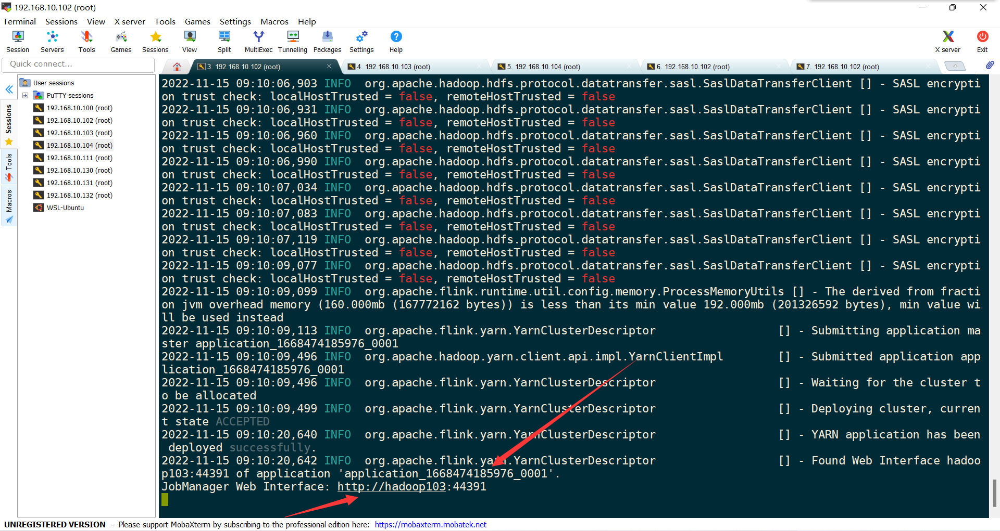
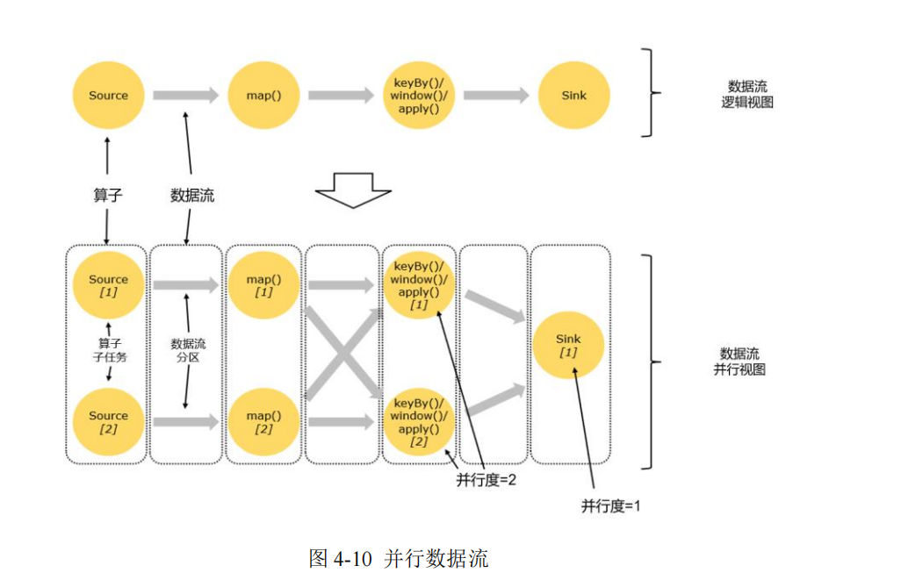
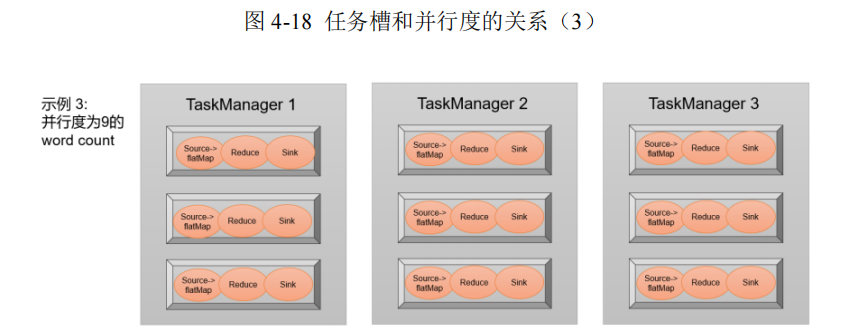

1 简介

## 1.1 Flink是什么【快速、灵巧】

官网：

- https://flink.apache.org/
- https://flink.apache.org/zh/usecases.html

- Apache Flink是由Apache软件基金会开发的**开源**流处理**框架**
- 其核心是用Java和Scala编写的**分布式**流数据流引擎
- Flink以**数据并行**和**流水线**方式执行任意流数据程序
- Flink的流水线运行时系统可以执行**批处理和流处理**程序
- Flink的运行时本身也支持迭代算法的执行
- **有界或无界数据流进行状态计算**

- - Flink可以对流执行任意数量的变换，这些流可以被编排为有向无环数据流图，允许应用程序分支和合并数据流
  - Flink的数据流API支持有界或无界数据流上的转换（如过滤器、聚合和窗口函数），包含了20多种不同类型的转换，可以在Java和Scala中使用。


2010 StructPhere => 2014 Apache基金会 => 2017 Alibaba开发

## 1.2 为什么用Flink

流数据更真实地反映了我们的生活方式

- 实时聊天，一条就直接发

传统的数据架构是基于有限数据集的

- 批量处理，隔一段时间数据攒齐了再计算

- - Spark Streaming就是这样，需要设置批处理时间间隔几百毫秒到几秒


**目标：**

- 低延迟

- - 想要做到毫秒级别延迟

- 高吞吐

- - 分区处理，然后再合并
  - 内存，扩容代价

- 结果的准确性和良好的容错性

- - 乱序问题
  - 一个节点挂了，回滚到最近的一个状态，然后继续处理


**应用场景：**

电商和市场营销

- 数据报表

- - 要求今晚12点前的数据出一个报表
  - 数据叠加计算，直接输出一个结果

- 广告投放
- 业务流程需要

物联网(IOT)

- 传感器实时数据采集和显示
- 实时报警
- 交通运输业

电信业

- 基站流量调配

- - 救援

银行和金融业

- 实时结算和通知推送

- - 银行的E+决策计算引擎，就是FlinkSQL

- - - 每一笔都做计算

- - 盘点核算

- 实时检测异常行为

## 1.3 流处理的发展和演变

### 1.3.1 传统事务处理


### 1.3.2 有状态的流处理

- 事务处理瓶颈~关联查询
- 解决：

- - 数据放内存里，保存成本地状态，替代关系型数据库的表；
  - 同时扩展使用集群
  - 内存~存盘，恢复机制（周期性检查点）

- 但扩展时，会存在数据乱序问题


#### 1.3.2.1 事件驱动型（Event-Driven）应用


#### 1.3.2.2 数据分析（Data Analysis）型应用


#### 1.3.2.3 数据管道（Data Pipeline）型应用


### 1.3.4 lambda流处理架构

用两套系统，同时保证低延迟和结果准确

- 需要自己写两套系统，并且保证正确性


### 1.3.5 Flink流处理


## 1.4 Flink的主要特点

### 1.4.1 事件驱动


### 1.4.2 基于流的世界观

- 在Flink 的世界观中，一切都是由流组成的，离线数据是有界的流;
- 实时数据是一个没有界限的流:这就是所谓的有界流和无界流
- 状态：过去，现在，未来


### 1.4.3 分层API

- 越顶层越抽象，表达含义越简明，使用越方便
- 越底层越具体,表达能力越丰富，使用越灵活


离线的叫DataSet, 实时的叫DataStream

有状态的事件驱动：可以定时，自定义状态


### 1.4.4 其它

* **高吞吐和低延迟**。每秒处理数百万个事件，毫秒级延迟。
* 结果的**准确性**。Flink 提供了事件时间**（event-time）**和处理时间**（processing-time ）**语义。对于乱序事件流，事件时间语义仍然能提供一致且准确的结果。
* **精确一次**（exactly-once）的状态一致性保证。
* **可以连接到最常用的存储系统**，如 Apache Kafka、Apache Cassandra、Elasticsearch、
  JDBC、Kinesis 和（分布式）文件系统，如 HDFS 和 S3。
* **高可用**。本身高可用的设置，加上与 K8s，YARN 和 Mesos 的紧密集成，再加上从故障中快速恢复和动态扩展任务的能力，Flink 能做到以极少的停机时间 **7×24 全天候运行**。
* **动态拓展**能够更新应用程序代码并将作业（jobs）迁移到不同的 Flink 集群，而不会丢失应用程序的状态。

## 1.5 Flink Vs Spark Streaming

- 流处理 VS 微批处理
- 数据模型

- - spark采用RDD模型，spark streaming的 DStream 实际上也就是一组组小批数据RDD的集合
  - flink 基本数据模型是数据流，以及事件(Event)序列

- 运行时架构

- - spark 是批计算，将DAG划分为不同的stage，一个完成后才可以计算下一个

- - - 转换算子和行动算子
    - 假如当前的分布式处理不同的分区、不同的节点处理有先后，那我当前节点处理完了，但是别的分区没处理完，那就得等，等到当前Stage结束，因为还得做Shuffle等调整

- - flink 是标准的流执行模式，一个事件在一个节点处理完后可以直接发往下一个节点进行处理

- - - 没有等待的过程，当前节点处理完毕，立马到下一节点处理


# 2 快速上手

## 2.1 WordCount Flink 批处理

新建maven项目

引入依赖

```xml
    <properties>
        <maven.compiler.source>8</maven.compiler.source>
        <maven.compiler.target>8</maven.compiler.target>
        <project.build.sourceEncoding>UTF-8</project.build.sourceEncoding>
        <flink.version>1.13.0</flink.version>
        <java.version>1.8</java.version>
        <scala.binary.version>2.12</scala.binary.version>
        <slf4j.version>1.7.30</slf4j.version>
    </properties>

    <dependencies>
        <!-- 引入 Flink 相关依赖-->
        <dependency>
            <groupId>org.apache.flink</groupId>
            <artifactId>flink-java</artifactId>
            <version>${flink.version}</version>
        </dependency>
        <dependency>
            <groupId>org.apache.flink</groupId>
            <artifactId>flink-streaming-java_${scala.binary.version}</artifactId>
            <version>${flink.version}</version>
        </dependency>
        <dependency>
            <groupId>org.apache.flink</groupId>
            <artifactId>flink-clients_${scala.binary.version}</artifactId>
            <version>${flink.version}</version>
        </dependency>
        <!-- 引入日志管理相关依赖-->
        <dependency>
            <groupId>org.slf4j</groupId>
            <artifactId>slf4j-api</artifactId>
            <version>${slf4j.version}</version>
        </dependency>
        <dependency>
            <groupId>org.slf4j</groupId>
            <artifactId>slf4j-log4j12</artifactId>
            <version>${slf4j.version}</version>
        </dependency>
        <dependency>
            <groupId>org.apache.logging.log4j</groupId>
            <artifactId>log4j-to-slf4j</artifactId>
            <version>2.14.0</version>
        </dependency>
        <dependency>
            <groupId>junit</groupId>
            <artifactId>junit</artifactId>
            <version>3.8.1</version>
            <scope>test</scope>
        </dependency>
    </dependencies>
```

在resource目录下配置log4j日志

```properties
log4j.rootLogger=error, stdout
log4j.appender.stdout=org.apache.log4j.ConsoleAppender
log4j.appender.stdout.layout=org.apache.log4j.PatternLayout
log4j.appender.stdout.layout.ConversionPattern=%-4r [%t] %-5p %c %x - %m%n
```


批处理

```java
package org.neptune.wc;

import org.apache.flink.api.common.typeinfo.Types;
import org.apache.flink.api.java.ExecutionEnvironment;
import org.apache.flink.api.java.operators.AggregateOperator;
import org.apache.flink.api.java.operators.DataSource;
import org.apache.flink.api.java.operators.FlatMapOperator;
import org.apache.flink.api.java.operators.UnsortedGrouping;
import org.apache.flink.api.java.tuple.Tuple2;
import org.apache.flink.util.Collector;

public class BatchWordCount {
    public static void main(String[] args) throws Exception {

        // 1. 创建执行环境
        ExecutionEnvironment env = ExecutionEnvironment.getExecutionEnvironment();

        // 2. 从文件读取数据 按行读取(存储的元素就是每行的文本)
        DataSource<String> lineDataSource = env.readTextFile("input/word.txt");

        // 3. 转换数据格式,转换成二元组
        FlatMapOperator<String, Tuple2<String, Long>> wordToOne = lineDataSource.flatMap((String line, Collector<Tuple2<String, Long>> out) -> {
            String[] words = line.split(" ");
            //将每个单词转换成二元组
            for (String word : words) {
                out.collect(Tuple2.of(word, 1L));
            }
        }).returns(Types.TUPLE(Types.STRING, Types.LONG));

        //当 Lambda 表达式使用 Java 泛型的时候, 由于泛型擦除的存在, 需要显示的声明类型信息
        // 4. 按照 word 进行分组
        UnsortedGrouping<Tuple2<String, Long>> wordToOneGroup = wordToOne.groupBy(0);

        // 5. 分组内聚合统计
        AggregateOperator<Tuple2<String, Long>> sum = wordToOneGroup.sum(1);

        // 6. 打印结果
        sum.print();
    }

}

```

## 2.2 WorkCount Flink 流处理

- 来一个处理一个，事件触发, 中间保存它的**状态**
- 先写好处理方式，然后等数据过来，一个个处理

```java
package org.neptune.wc;

import org.apache.flink.api.common.typeinfo.Types;
import org.apache.flink.api.java.tuple.Tuple2;
import org.apache.flink.api.java.utils.ParameterTool;
import org.apache.flink.streaming.api.datastream.DataStreamSource;
import org.apache.flink.streaming.api.datastream.KeyedStream;
import org.apache.flink.streaming.api.datastream.SingleOutputStreamOperator;
import org.apache.flink.streaming.api.environment.StreamExecutionEnvironment;
import org.apache.flink.util.Collector;

public class StreamWordCount {
    public static void main(String[] args) throws Exception {
        // 1. 创建流式执行环境
        StreamExecutionEnvironment environment = StreamExecutionEnvironment.getExecutionEnvironment();

        //从参数中提取主机名和端口号
/*        ParameterTool parameterTool = ParameterTool.fromArgs(args);
        String hostname = parameterTool.get("host");
        int port = parameterTool.getInt("port");*/

        // 2. 读取文本流
        DataStreamSource<String> lineDataStream = environment.socketTextStream("192.168.10.130", 7777);

        // 3. 转换计算
        SingleOutputStreamOperator<Tuple2<String, Long>> wordToOne = lineDataStream.flatMap((String line, Collector<Tuple2<String, Long>> out) -> {
            String[] words = line.split(" ");
            for (String word : words) {
                out.collect(Tuple2.of(word, 1L));
            }
        }).returns(Types.TUPLE(Types.STRING, Types.LONG));

        // 4. 按照 word 进行分组
        KeyedStream<Tuple2<String, Long>, String> wordToOneKeyedStream = wordToOne.keyBy(data -> data.f0);

        // 5. 分组内聚合统计
        SingleOutputStreamOperator<Tuple2<String, Long>> sum = wordToOneKeyedStream.sum(1);

        // 6. 打印结果
        sum.print();

        // 7. 启动执行
        environment.execute();

    }
}

```

通过在Linux主机上使用nc工具模拟

```perl
nc -lk 7777
```

# 3 Flink部署


## 3.1 部署模式

在一些应用场景中，对于集群资源分配和占用的方式，可能会有特定的需求。Flink 为各种场景提供了不同的部署模式，主要有以下三种：

* 会话模式（Session Mode）
  * 适合于单个规模小、执行时间短的大量作业
  * 资源是共享的，资源不够，提交新的作业会失败


* 单作业模式（Per-Job Mode）

  集群只为这个作业而生。同样由客户端运行应用程序，然后启动集群，作业被提交给 JobManager，进而分发给 TaskManager 执行。作业作业完成后，集群就会关闭。

  * 每个作业一个集群
  * 实际应用的首选模式
  * 作业完成后，集群就会关闭，所有资源也会释放
  * Flink 本身无法直接这样运行，所以单作业模式一般需要借助YARN、Kubernetes启动集群 


* 应用模式（Application Mode）

直接把应用提交到 JobManger 上运行。为每一个提交的应用单独启动一个 JobManager，也就是创建一个集群。这个 JobManager 只为执行这一个应用而存在，执行结束之后 JobManager 就关闭了，这就是所谓的应用模式。


总结：

* 在会话模式下，集群的生命周期独立于集群上运行的任何作业的生命周期，并且提交的所有作业共享资源。

* 单作业模式为每个提交的作业创建一个集群，带来了更好的资源隔离，这时集群的生命周期与作业的生命周期绑定。

* 应用模式为每个应用程序创建一个会话集群，在 JobManager 上直接调用应用程序的 main()方法。

它们的区别主要在于：集群的生命周期以及资源的分配方式；以及应用的 main 方法到底在哪里执行——客户端（Client）还是 JobManager。

## 3.2 独立模式（Standalone） 

### 3.2.1 会话模式部署

#### 3.2.1.1 环境配置

准备 3 台 Linux 机器，搭建集群环境。具体要求如下：

* 系统环境为 CentOS 7.5 版本。
* 安装 Java 8。
* 安装 Hadoop 集群，Hadoop 建议选择 Hadoop 2.7.5 以上版本。
* 配置集群节点服务器间时间同步以及免密登录，关闭防火墙。
  三台服务器的具体设置如下：
* 节点服务器 1，IP 地址为 192.168.10.102，主机名为 hadoop102。
* 节点服务器 2，IP 地址为 192.168.10.103，主机名为 hadoop103。
* 节点服务器 3，IP 地址为 192.168.10.104，主机名为 hadoop104。

#### 3.2.1.2 本地启动

Flink 可以运行在 Linux、Mac OS X 和 Windows 上。本地模式的安装唯一需要的只是Java 1.7.x或更高版本，本地运行会启动Single JVM，主要用于**测试调试代码**。

```perl
tar -zxvf flink-1.13.0-bin-scala_2.12.tgz -C /opt/module/
cd flink-1.13.0/
bin/start-cluster.sh

访问 http://hadoop102:8081 对 flink 集群和任务进行监控管理

#关闭应用
bin/stop-cluster.sh
```

#### 3.2.1.3 集群启动

| 节点服务器 | hadoop102  | hadoop103   | hadoop104   |
| ---------- | ---------- | ----------- | ----------- |
| 角色       | JobManager | TaskManager | TaskManager |

配置主节点

/etc/profile

```shell
#JAVA_HOME
export JAVA_HOME=/usr/java/jdk1.8.0_271
export CLASSPATH=$:CLASSPATH:$JAVA_HOME/lib/
export PATH=$PATH:$JAVA_HOME/bin

#KAFKA_HOME
export KAFKA_HOME=/opt/kafka
export PATH=$PATH:$KAFKA_HOME/bin

#ZOOKEEPER_HOME
export ZOOKEEPER_HOME=/usr/local/zookeeper
export PATH=$PATH:$ZOOKEEPER/bin

#HADOOP_HOME
export HADOOP_HOME=/opt/hadoop-3.1.3
export HADOOP_MAPRED_HOME=$HADOOP_HOME
export HADOOP_COMMON_HOME=$HADOOP_HOME
export HADOOP_HDFS_HOME=$HADOOP_HOME
export YARN_HOME=$HADOOP_HOME
export HADOOP_COMMON_LIB_NATIVE_DIR=$HADOOP_HOME/lib/native export
PATH=$PATH:$HADOOP_HOME/sbin:$HADOOP_HOME/bin

export HDFS_NAMENODE_USER=root
export HDFS_DATANODE_USER=root
export HDFS_SECONDARYNAMENODE_USER=root
export YARN_RESOURCEMANAGER_USER=root
export YARN_NODEMANAGER_USER=root

#HIVE_HOME
export HIVE_HOME=/opt/hive-3.1.2
export PATH=$PATH:$HIVE_HOME/bin
export FLUME_HOME=/opt/flume-1.9.0
export PATH=$PATH:$FLUME_HOME/bin

# kafkaEFAK
export KE_HOME=/opt/efak
export PATH=$PATH:$KE_HOME/bin

#HBASE_HOME
export HBASE_HOME=/opt/hbase
export PATH=$PATH:$HBASE_HOME/bin

#debzium-oracle
export LD_LIBRARY_PATH=/root/instantclient_21_1

#SPARK_HOME
export SPARK_HOME=/opt/spark
export PATH=$PATH:$SPARK_HOME/bin:$SPARK_HOME/sbin

#FLINK_HOME
export FLINK_HOME=/opt/flink-1.13.0
export PATH=$PATH:$FLINK_HOME/bin

```


```perl
tar -zxvf flink-1.13.0-bin-scala_2.12.tgz -C /opt/module/

#配置环境变量
vim /etc/profile
#FLINK_HOME
export FLINK_HOME=/opt/flink-1.13.0
export PATH=$PATH:$FLINK_HOME/bin

source  /etc/profile

cd flink-1.13.0/conf

#修改JobManager 节点地址.
vim flink-conf.yaml
jobmanager.rpc.address: hadoop102

#修改 workers 文件，将另外两台节点服务器添加为本 Flink 集群的 TaskManager 节点
vim workers 
hadoop103
hadoop104
```

 JobManager 和 TaskManager 组件的优化配置项如下：

* `jobmanager.memory.process.size`：对 JobManager 进程可使用到的全部内存进行配置，包括 JVM 元空间和其他开销，默认为 1600M，可以根据集群规模进行适当调整。
* `taskmanager.memory.process.size`：对 TaskManager 进程可使用到的全部内存进行配置，包括 JVM 元空间和其他开销，默认为 1600M，可以根据集群规模进行适当调整。
* `taskmanager.numberOfTaskSlots`：对每个 TaskManager 能够分配的 Slot 数量进行配置，默认为 1，可根据 TaskManager 所在的机器能够提供给 Flink 的 CPU 数量决定。所谓Slot 就是 TaskManager 中具体运行一个任务所分配的计算资源。
* `parallelism.default`：Flink 任务执行的默认并行度，优先级低于代码中进行的并行度配置和任务提交时使用参数指定的并行度数量。关于 Slot 和并行度的概念，下一章做详细讲解。

分发安装目录

```perl
sudo /home/atguigu/bin/xsync /opt/module/flink-1.13.0
```

启动集群

```perl
#主节点执行
bin/start-cluster.sh

#查看进程
jps
```

启动成功后，访问 http://hadoop102:8081 对 flink 集群和任务进行监控管理

可以看到，当前集群的 TaskManager 数量为 2；由于默认每个 TaskManager 的 Slot

数量为 1，所以总 Slot 数和可用 Slot 数都为 2。

#### 3.2.1.4 提交作业

引入插件 maven-assembly-plugin 进行打包，方便自定义结构和定制依赖。

在pom.xml 文件中添加打包插件的配置

```xml
<build>
        <plugins>
            <plugin>
                <groupId>org.apache.maven.plugins</groupId>
                <artifactId>maven-assembly-plugin</artifactId>
                <version>3.0.0</version>
                <configuration>
                    <descriptorRefs>
                        <descriptorRef>jar-with-dependencies</descriptorRef>
                    </descriptorRefs>
                </configuration>
                <executions>
                    <execution>
                        <id>make-assembly</id>
                        <phase>package</phase>
                        <goals>
                            <goal>single</goal>
                        </goals>
                    </execution>
                </executions>
            </plugin>
        </plugins>
    </build>
```

插件配置完毕后（刷新maven依赖），可以使用 IDEA 的 Maven 工具执行 package 命令

打 包 完 成 后 ， 在 target 目 录 下 有FlinkTutorial-1.0-SNAPSHOT.jar 和 FlinkTutorial-1.0-SNAPSHOT-jar-with-dependencies.jar，集群中已经具备任务运行所需的所有依赖，所以建议使用 FlinkTutorial-1.0-SNAPSHOT.jar。

##### 3.2.1.4.1 页面提交


命令行读取参数

```perl
java -jar xxx.jar --host 192.168.10.130 --port 7777
```

IDEA中读取参数


Flink页面


Linux主机先开启nc再提交作业，查看任务


详细信息


取消作业


##### 3.2.3.2 命令行提交

```perl
先打开nc工具
nc -lk 7777

cd flink-1.13.0/
flink run -m 192.168.10.130:8081 -c org.neptune.wc.StreamWordCount Flink-1.0-SNAPSHOT.jar
任务已提交Ctrl+C不影响
flink list查看任务


```


==flink的log目录下有当前任务的日志输出==


### 3.2.2 单作业模式部署

Flink 本身无法直接以单作业方式启动集群，一般需要借助一些资源管理平台。所以 Flink 的独立（Standalone）集群并==不支持==单作业模式部署。

### 3.2.3 应用模式部署

应用模式下不会提前创建集群，所以不能调用 start-cluster.sh 脚本。我们可以使用同样在bin 目录下的standalone-job.sh 来创建一个 JobManager。

具体步骤如下：

1. 进入到 Flink 的安装路径下，将应用程序的 jar 包放到 lib/目录下。

```perl
cp ./FlinkTutorial-1.0-SNAPSHOT.jar lib/
```

2. 执行以下命令，启动 JobManager。

```perl
#这里我们直接指定作业入口类，脚本会到 lib 目录扫描所有的 jar 包。
./bin/standalone-job.sh start --job-classname com.atguigu.wc.StreamWordCount
```

3. 同样是使用 bin 目录下的脚本，启动 TaskManager。

```perl
./bin/taskmanager.sh start
```

4. 如果希望停掉集群，同样可以使用脚本，命令如下。

```perl
./bin/standalone-job.sh stop
./bin/taskmanager.sh stop
```

### 3.3.4 高可用(High Availability )

 JobManager 做主备冗余，这就是所谓的高可用（High Availability，简称 HA）。

让集群在任何时候都有一个主 JobManager 和多个备用 JobManagers


1. 进入 Flink 的安装路径下的 conf 目录下，修改配置文件: flink-conf.yaml，增加如下配置。

```yaml
high-availability: zookeeper
high-availability.storageDir: hdfs://hadoop102:9820/flink/standalone/ha
high-availability.zookeeper.quorum: 
hadoop102:2181,hadoop103:2181,hadoop104:2181
high-availability.zookeeper.path.root: /flink-standalone
high-availability.cluster-id: /cluster_atguigu
```

2. 修改配置文件: masters，配置备用 JobManager 列表。

```perl
hadoop102:8081
hadoop103:8081
```

3. 分发修改后的配置文件到其他节点服务器。

```perl
xsync /opt/module/flink-1.13.0
```

4）在`/etc/profile.d/my_env.sh`中配置环境变量

```perl
export HADOOP_CLASSPATH=`hadoop classpath`
```

注意: 

* 需要提前保证 HAOOP_HOME 环境变量配置成功

* 分发到其他节点

具体部署方法如下：

1. 首先启动 HDFS 集群和 Zookeeper 集群。

2. 执行以下命令，启动 standalone HA 集群。

```perl
bin/start-cluster.sh
```

3. 可以分别访问两个备用 JobManager 的 Web UI 页面。

http://hadoop102:8081

http://hadoop103:8081

4. 在 zkCli.sh 中查看谁是 leader。

```perl
[zk: localhost:2181(CONNECTED) 1] get /flink-standalone/cluster_atguigu/leader/rest_server_lock
```

杀死 hadoop102 上的 Jobmanager, 再看 leader。

```perl
[zk: localhost:2181(CONNECTED) 7] get /flink-standalone/cluster_atguigu/leader/rest_server_lock
```

**注意: 不管是不是 leader，从 WEB UI 上是看不到区别的, 都可以提交应用。**

## 3.3 YARN 模式

客户端把 Flink 应用提交给 Yarn 的 ResourceManager, Yarn 的 ResourceManager 会向 Yarn 的 NodeManager 申请容器。在这些容器上，Flink 会部署JobManager 和 TaskManager 的实例，从而启动集群。Flink 会根据运行在 JobManger 上的作业所需要的 Slot 数量动态分配 TaskManager 资源。

### 3.3.1 环境准备

1. 下载并解压安装包，并将解压后的安装包重命名为 flink-1.13.0-yarn，本节的相关操作都将默认在此安装路径下执行。

```perl
tar -zxvf flink-1.13.0-bin-scala_2.12.tgz -C /opt/module/
mv flink-1.13.0 flink-1.13.0-yarn
```

1. 配置环境变量，增加环境变量配置如下：

```shell
sudo vim /etc/profile.d/my_env.sh

HADOOP_HOME=/opt/module/hadoop-3.1.3/
export PATH=$PATH:$HADOOP_HOME/bin:$HADOOP_HOME/sbin
export HADOOP_CONF_DIR=${HADOOP_HOME}/etc/hadoop
export HADOOP_CLASSPATH=`hadoop classpath`

source /etc/profile
```

**这里必须保证设置了环境变量 HADOOP_CLASSPATH。**

3. 启动 Hadoop 集群，包括 HDFS 和 YARN。

```perl
start-dfs.sh
start-yarn.sh
```

```shell
[atguigu@hadoop102 module]$ myhadoop.sh start
 =================== 启动 hadoop集群 ===================
 --------------- 启动 hdfs ---------------
Starting namenodes on [hadoop102]
Starting datanodes
Starting secondary namenodes [hadoop104]
 --------------- 启动 yarn ---------------
Starting resourcemanager
Starting nodemanagers
 --------------- 启动 historyserver ---------------
[atguigu@hadoop102 module]$
[atguigu@hadoop102 module]$ jpsall
=============== hadoop102 ===============
8528 JobHistoryServer
8309 NodeManager
7917 DataNode
7743 NameNode
8623 Jps
=============== hadoop103 ===============
4688 ResourceManager
4489 DataNode
4825 NodeManager
5195 Jps
=============== hadoop104 ===============
97876 DataNode
97999 SecondaryNameNode
98095 NodeManager
98239 Jps
[atguigu@hadoop102 module]$

```

4. 进入 conf 目录，修改 flink-conf.yaml 文件，修改以下配置，这些配置项的含义在进行 Standalone 模式配置的时候进行过讲解，若在提交命令中不特定指明，这些配置将作为默认配置。

```perl
cd /opt/module/flink-1.13.0-yarn/conf/
vim flink-conf.yaml
jobmanager.memory.process.size: 1600m
taskmanager.memory.process.size: 1728m
taskmanager.numberOfTaskSlots: 8
parallelism.default: 1
```

### 3.3.2 会话模式部署

YARN 的会话模式与独立集群略有不同，需要首先申请一个 YARN 会话（YARN session）来启动 Flink 集群。

```java
        //从参数中提取主机名和端口号
        ParameterTool parameterTool = ParameterTool.fromArgs(args);
        String hostname = parameterTool.get("host");
        int port = parameterTool.getInt("port");
```

#### 3.3.2.1 启动集群

* 启动 hadoop 集群(HDFS, YARN)。

* 执行脚本命令向 YARN 集群申请资源，开启一个 YARN 会话，启动 Flink 集群。

  ```perl
  yarn-session.sh -nm test
  ```

可用参数解读：

* `-d`：分离模式，如果你不想让 Flink YARN 客户端一直前台运行，可以使用这个参数，即使关掉当前对话窗口，YARN session 也可以后台运行。

* `-jm(--jobManagerMemory)`：配置 JobManager 所需内存，默认单位 MB。

* `-nm(--name)`：配置在 YARN UI 界面上显示的任务名。

* `-qu(--queue)`：指定 YARN 队列名。

* `-tm(--taskManager)`：配置每个 TaskManager 所使用内存。


**注意：Flink1.11.0 版本不再使用-n 参数和-s 参数分别指定 TaskManager 数量和 slot 数量**，

YARN 的会话模式也不会把集群资源固定， 会按照需求动态分配 TaskManager 和 slot。

YARN Session 启动之后会给出一个 web UI 地址以及一个 YARN application ID，用户可以通过 web UI 或者命令行两种方式提交作业。

```shell
2022-11-15 09:10:09,099 INFO  org.apache.flink.runtime.util.config.memory.ProcessMemoryUtils [] - The derived from fraction jvm overhead memory (160.000mb (167772162 bytes)) is less than its min value 192.000mb (201326592 bytes), min value will be used instead
2022-11-15 09:10:09,113 INFO  org.apache.flink.yarn.YarnClusterDescriptor                  [] - Submitting application master application_1668474185976_0001
2022-11-15 09:10:09,496 INFO  org.apache.hadoop.yarn.client.api.impl.YarnClientImpl        [] - Submitted application application_1668474185976_0001
2022-11-15 09:10:09,496 INFO  org.apache.flink.yarn.YarnClusterDescriptor                  [] - Waiting for the cluster to be allocated
2022-11-15 09:10:09,499 INFO  org.apache.flink.yarn.YarnClusterDescriptor                  [] - Deploying cluster, current state ACCEPTED
2022-11-15 09:10:20,640 INFO  org.apache.flink.yarn.YarnClusterDescriptor                  [] - YARN application has been deployed successfully.
2022-11-15 09:10:20,642 INFO  org.apache.flink.yarn.YarnClusterDescriptor                  [] - Found Web Interface hadoop103:44391 of application 'application_1668474185976_0001'.
JobManager Web Interface: http://hadoop103:44391
```

http://hadoop103:44391 为flink界面



#### 3.3.2.2 提交作业

##### 3.3.2.2.1 页面提交

这种方式比较简单，与上文所述 Standalone 部署模式基本相同。

##### 3.3.2.2.2 命令行提交

```perl
#提交任务前先打卡nc
[atguigu@hadoop102 ~]$ nc -lk 7777
```

1. 将 Standalone 模式讲解中打包好的任务运行 JAR 包上传至集群

2. 执行以下命令将该任务提交到已经开启的 Yarn-Session 中运行。

```perl
flink run -c org.neptune.wc.StreamWordCount Flink-1.0-SNAPSHOT.jar --host hadoop102 --port 7777
```

客户端可以自行确定 JobManager 的地址，也可以通过-m 或者-jobmanager 参数指定JobManager 的地址，JobManager 的地址在 YARN Session 的启动页面中可以找到。


3. 任务提交成功后，可在 YARN 的 Web UI 界面查看运行情况。


从图中可以看到创建的 Yarn-Session 实际上是一个 Yarn 的Application，并且有唯一的 Application ID。

4. 也可以通过 Flink 的 Web UI 页面查看提交任务的运行情况。


### 3.3.3 单作业模式部署

在 YARN 环境中，由于有了外部平台做资源调度，所以我们也可以==直接向 YARN 提交一个单独的作业==，从而启动一个 Flink 集群。

1. 执行命令提交作业

```perl
bin/flink run -d -t yarn-per-job -c com.atguigu.wc.StreamWordCount FlinkTutorial-1.0-SNAPSHOT.jar
或
#注意这里是通过参数-m yarn-cluster 指定向 YARN 集群提交任务。
bin/flink run -m yarn-cluster -c com.atguigu.wc.StreamWordCount FlinkTutorial-1.0-SNAPSHOT.jar
```

2. 可在 YARN 的 ResourceManager 界面/ Flink Web UI 页面进行监控查看执行情况

3. 可以使用命令行查看或取消作业

```perl
./bin/flink list -t yarn-per-job -Dyarn.application.id=application_XXXX_YY

./bin/flink cancel -t yarn-per-job -Dyarn.application.id=application_XXXX_YY <jobId>

这里的 application_XXXX_YY 是当前应用的 ID，<jobId>是作业的 ID。注意如果取消作业，整个 Flink 集群也会停掉。
```

### 3.3.4 应用模式部署

与单作业模式类似，直接执行 flink run-application 命令即可。

1. 执行命令提交作业。

```perl
bin/flink run-application -t yarn-application -c com.atguigu.wc.StreamWordCount FlinkTutorial-1.0-SNAPSHOT.jar
```

2. 在命令行中查看或取消作业。

```perl
./bin/flink list -t yarn-application -Dyarn.application.id=application_XXXX_YY

./bin/flink cancel -t yarn-application -Dyarn.application.id=application_XXXX_YY <jobId>
```

3. 也可以通过 yarn.provided.lib.dirs 配置选项指定位置，将 jar 上传到远程。

```perl
./bin/flink run-application -t yarn-application -Dyarn.provided.lib.dirs="hdfs://myhdfs/my-remote-flink-dist-dir" hdfs://myhdfs/jars/my-application.jar
```

**这种方式下 jar 可以预先上传到 HDFS，而不需要单独发送到集群，这就使得作业提交更加轻量了**

### 3.3.5 高可用

YARN 模式的高可用和独立模式（Standalone）的高可用原理不一样。

* Standalone 模式中, 同时启动多个 JobManager, 一个为“领导者”（leader），其他为“后备”（standby）, 当 leader 挂了, 其他的才会有一个成为 leader。

* YARN 的高可用是只启动一个 Jobmanager, 当这个 Jobmanager 挂了之后, YARN 会再次启动一个, 所以其实是利用的 YARN 的重试次数来实现的高可用。

1. 在 yarn-site.xml 中配置

```xml
<property>
 <name>yarn.resourcemanager.am.max-attempts</name>
 <value>4</value>
 <description>
 The maximum number of application master execution attempts.
 </description>
</property>
```

2. 分发并重启 YARN。

3. 在 flink-conf.yaml 中配置

```yaml
yarn.application-attempts: 3
high-availability: zookeeper
high-availability.storageDir: hdfs://hadoop102:9820/flink/yarn/ha
high-availability.zookeeper.quorum: 
hadoop102:2181,hadoop103:2181,hadoop104:2181
high-availability.zookeeper.path.root: /flink-yarn
```

3. 启动 yarn-session

4. 杀死 JobManager, 查看复活情况。

**注意: yarn-site.xml 中配置的是 JobManager 重启次数的上限, flink-conf.xml 中的次数应该小于这个值。**

## 3.4 k8s 模式

容器化部署时目前业界很流行的一项技术，基于Docker镜像运行能够让用户更加方便地对应用进行管理和运维.容器管理工具中最为流行的就是 Kubernetes(kSs) ，而Flink也在最近的版本中支持了k8s部署模式。

### 3.4.1 搭建Kurbernetes集群

### 3.4.2 配置各组件的yaml文件

在k8s上构建Flink Session Cluster，雷要将Flink集群的组件对应的docker镜像分别在k8s 上启动，包括obManager、TaskManager、JobManagerService三个镜像服务。每个镜像服务都可以从中央镜像仓库中获取。

### 3.4.3 启动 Flink Session Cluster

```perl
#启动jobmonager-service服务
kubectl create -f jobmanager-service.yaml

#启动jobmanager--deployment服务
kubectl create -f jobmanager-deployment.yaml

#启动taskmanoger-depl oymert 服务
kubectl create -f taskmanager-deployment.yaml
```

### 3.4.4 访问Flink UI页面

集群启动后，就可以通过JobManagerservicers中配置的webUI端口，用浏览器输入以下url来访问Flink UI页面了;

```perl
http://{JobManagerHost:Port}/api/v1/namespaces/default/services/fink-jobmanager:ui/proxy
```

# 4 Flink运行架构

## 4.1 系统架构

### 4.1.1 整体构成

两大组件

* 作业管理器（JobManger）—Master，负责管理调度，所以在不考虑高可用的情况下只能有一个
* 任务管理器（TaskManager）—Worker、Slave，负责执行任务处理数据，所以可以有一个或多个


* 客户端只负责作业的提交。
  * 调用程序的 main 方法，将代码转换成数据流图（Dataflow Graph）并生成作业图（JobGraph），发送给 JobManager。
  * 提交后，任务的执行就跟客户端没有关系了，可以在客户端选择断开与 JobManager 的连接, 也可以继续保持连接。

之前在命令行提交作业时，加上的`-d`参数，就是表示分离模式（detached mode)，也就是断开连接。

### 4.1.2 作业管理器（JobManager）

JobManager 是集群任务管理和调度的核心，控制应用执行的主进程。

* 每个应用JobManager 唯一
* 高可用（HA）场景， 一个leader，多个备用节点standby

JobManger 又包含 3 个不同的组件。

#### 4.1.2.1 JobMaster
* JobMaster 最核心的组件，负责处理单独的作业（Job）
  *  JobMaster和Job 一一对应的，集群可以有多个Job, 每个 Job 都有一个自己的 JobMaster。
  *  作业提交时，JobMaster 会先接收到客户端提交的应用
     * Jar 包
     * 数据流图（dataflow graph）
     * 作业图（JobGraph）
  * 把作业图（JobGraph） 转换成一个物理层面的数据流图—执行图（ExecutionGraph），它包含了所有可以并发执行的任务
  * 向资源管理器（ResourceManager）发出请求，申请执行任务必要的资源、
  * 获取到足够的资源，就会将执行图分发到真正运行它们的 TaskManager 上
  * 运行过程中，JobMaster 会负责所有需要中央协调的操作，比如检查点（checkpoints）的协调

#### 4.1.2.2 资源管理器（ResourceManager）

* ResourceManager 主要负责资源的分配和管理，在 Flink 集群中只有一个
* 资源主要是指 TaskManager 的任务槽（task slots）
  * 任务槽：用来执行计算的一组 CPU 和内存资源。每一个任务（Task）都需要分配到一个 slot 上执行

* Flink 内置的 ResourceManager 和其他资源管理平台（比如 YARN）的ResourceManager 区别
  * Flink 的 ResourceManager 只能分发可用 TaskManager 的任务槽，不能单独启动新TaskManager
  * 资源管理平台的ResourceManager 
    * 可以分配有空闲槽位的 TaskManager 给 JobMaster
    * 没有足够的任务槽时，可向资源提供平台发起会话，请求提供启动 TaskManager 进程的容器
    * 负责停掉空闲的 TaskManager，释放计算资源

#### 4.1.2.3 分发器（Dispatcher）

* 主要负责提供一个 REST 接口，用来提交应用
* 为每一个新提交的作业启动一个新的 JobMaster 组件
* Dispatcher 也会启动一个 Web UI，用来方便地展示和监控作业执行的信息
* Dispatcher 在架构中并不是必需的，在不同的部署模式下可能会被忽略掉

### 4.1.3 任务管理器（TaskManager）

TaskManager 是 Flink 中的工作进程，数据流的具体计算就是它来做的（Worker）。

* Flink 集群中必须至少有一个 TaskManager，分布式计算会有多个 TaskManager 
* 每一个 TaskManager 都包含了一定数量的任务槽（task slots）
* Slot是资源调度的最小单位，slot 的数量限制了 TaskManager 能够并行处理的任务数量

作业启动后

* TaskManager 会向资源管理器注册它的 slots
* 收到资源管理器的指令后，TaskManager 就会将一个或者多个槽位提供给 JobMaster 调用
* JobMaster 就可以分配任务来执行了
* 在执行过程中，TaskManager 可以缓冲数据，还可以跟其他运行同一应用的 TaskManager交换数据。

## 4.2 作业提交流程

### 4.2.1 高层级抽象视角


1. 客户端（App）通过分发器提供的 REST 接口，将作业提交给JobManager。

2. 由分发器启动 JobMaster，并将作业（包含 JobGraph）提交给 JobMaster。

3. JobMaster 将 JobGraph 解析为可执行的 ExecutionGraph，得到所需的资源数量，然后
   向资源管理器请求资源（slots）。

4. 资源管理器判断当前是否由足够的可用资源；如果没有，启动新的 TaskManager。

5. TaskManager 启动之后，向 ResourceManager 注册自己的可用任务槽（slots）。

6. 资源管理器通知 TaskManager 为新的作业提供 slots。

7. TaskManager 连接到对应的 JobMaster，提供 slots。

8. JobMaster 将需要执行的任务分发给 TaskManager。

9. TaskManager 执行任务，互相之间可以交换数据。

* 根据部署模式、集群环境不同（例如 Standalone、YARN、K8S 等），其中一些步骤可能会不同或被省略，也可能有些组件会运行在同一个 JVM 进程中。

* 独立集群环境的会话模式，就是需要先启动集群，如果资源不够，只能等待资源释放，而不会直接启动新的 TaskManager。

### 4.2.2 独立模式（Standalone）

除第 4 步不会启动 TaskManager，而且直接向已有的 TaskManager 要求资源，其他步骤与抽象流程一致。


### 4.2.3 YARN 集群

#### 4.2.3.1 会话（Session）模式

**会话模式需要先启动一个 YARN session，这个会话会创建一个 Flink 集群。**


除了**请求资源时要上报YARN 的资源管理器**，其他与所述抽象流程一样。


#### 4.2.3.2 单作业（Per-Job）模式

单作业模式Flink 集群不会预先启动，而是在提交作业时，才启动新的 JobManager。

区别在于**JobManager 的启动方式，以及省去了分发器**。

当第 2 步作业提交给JobMaster，之后的流程就与会话模式完全一样了。


#### 4.2.3.3 应用（Application）模式

* 应用模式与单作业模式的提交流程非常相似

* 初始提交给 YARN 资源管理器的不再是具体的作业，而是整个应用

* 一个应用中可能包含了多个作业，这些作业都将在 Flink 集群中启动各自对应的 JobMaster

## 4.3 重要概念

### 4.3.1 数据流图（Dataflow Graph）

* Flink 是流式计算框架。它的程序结构，其实就是定义了一连串的处理操作，每一个数据输入之后都会依次调用每一步计算。

* 在 Flink 代码中，我们定义的每一个处理转换操作都叫作**算子（Operator）**，所以我们的程序可以看作是一串算子构成的管道，数据则像水流一样有序地流过。
* 所有的 Flink 程序都可以归纳为由三部分构成：Source、Transformation 和 Sink。
  * `Source` ——源算子，负责读取数据源。
  * `Transformation` ——转换算子，利用各种算子进行处理加工。
  * `Sink` ——下沉算子，负责数据的输出。

* Flink 程序映射成的算子，按照逻辑顺序连接在一起的**有向无环图（DAG）**叫**数据流图（dataflow graph）**or **逻辑数据流（logical dataflow)**
* 每一条数据流（dataflow）以一个或多个 source 算子开始，以一个或多个 sink 算子结束。

* 提交作业之后，打开 Flink 自带的 Web UI，点击作业就能看到对应的 dataflow
* 在大部分情况下，dataflow 中的算子，和程序中的转换运算是一一对应的关系。

以下数据流图可以看到 Source、Transformation、Sink 三部分。


### 4.3.2 并行度（Parallelism）

#### 4.3.2.1 并行计算

* 任务并行：不同的算子操作任务，分配到不同的节点上执行。

* 数据并行：一个算子被拆分成了多个并行的子任务（subtasks），分发到不同节点执行。

#### 4.3.2.2 并行度

* 一个特定算子的子任务（subtask）的个数被称之为其并行度（parallelism）。

* 包含并行子任务的数据流，就是并行数据流，它需要多个分区（stream partition）来分配并行任务。

* **一个流程序的并行度，就是其所有算子中最大的并行度。**
* 一个程序中，不同的算子可能具有不同的并行度。

如图 4-8 所示，当前数据流中有 source、map、window、sink 四个算子，除最后 sink，其他算子的并行度都为 2。整个程序包含了 7 个子任务，至少需要 2 个分区来并行执行。这段流处理程序的并行度就是 2。


#### 4.3.2.3 并行度的设置

在 Flink 中，可以用不同的方法来设置并行度，它们的有效范围和优先级别也是不同的。

* 代码中设置

  * 在算子后跟着调用 setParallelism()方法

    ```java
    //只针对当前算子有效
    stream.map(word -> Tuple2.of(word, 1L)).setParallelism(2);
    ```

  * 直接调用执行环境的 setParallelism()方法，全局设定并行度

    ```java
    //代码中所有算子有效，无法动态扩容，一般不使用
    env.setParallelism(2);
    ```

* 提交应用时设置

  * 使用 flink run 提交应用时，增加`-p `参数来指定当前应用程序执行的并行度，类似于执行环境的全局设置

    ```perl
    flink run -p 2 -c org.neptune.wc.StreamWordCount Flink-1.0-SNAPSHOT.jar
    ```

  * 在 Web UI 上提交作业时在对应输入框中直接添加并行度。

* 在配置文件flink-conf.yaml 中设置`parallelism.default`，对整个集群有效

  ```yaml
  parallelism.default: 2
  ```

  * 初始值为 1。
  * 代码和应用提交未设置，会采用此并行度。

* 开发环境中，没有配置文件，默认并行度就是当前机器的 CPU 核心数。

**优先级**

1. 代码中是否单独指定并行度
2. 代码中执行环境全局设置的并行度。
3. 提交时-p 参数指定的并行度。
4. 集群配置文件中的默认并行度。

**算子的并行度有时会受到自身具体实现的影响。**

对于本身就是非并行的 Source 算子（如socketTextStream），无论怎么设置，它在运行时的并行度都是 1

==建议在代码中只针对算子设置并行度，不设置全局并行度，方便提交作业时进行动态扩容。==

### 4.3.3 算子链（Operator Chain）

#### 4.3.3.1 算子间的数据传输

* 一对一（One-to-one，forwarding），数据流都是相同分区的算子，无shuffle，类似于 Spark 中的窄依赖
* 重分区（Redistributing），数据流包含不同分区算子，有shuffle，类似于 Spark 中的宽依赖



#### 4.3.3.2 合并算子链

相同分区的算子合并成一个算子，的技术被称为算子链（Operator Chain）。


### 4.3.4 作业图（JobGraph）与执行图（ExecutionGraph）

Flink 中任务调度执行的图，按照生成顺序可以分成四层：

逻辑流图（StreamGraph）→ 作业图（JobGraph）→ 执行图（ExecutionGraph）→ 物理图（Physical Graph）

==重点： 作业图（JobGraph）和执行图（ExecutionGraph）==

#### 4.3.4.1 逻辑流图（StreamGraph）

* 根据DataStream API 编写的代码生成的最初的 DAG 图，用来表示程序的拓扑结构。
* 一般在客户端完成。

#### 4.3.4.2 作业图（JobGraph）

* StreamGraph 经过优化后生成作业图，是提交给 JobManager 的数据结构。
* 优化：将多个符合条件的节点合并成一个任务节点，形成算子链，减少数据交换的消耗。
* 一般在客户端完成
* 作业提交时传递给 JobMaster。

#### 4.3.4.3 执行图（ExecutionGraph）

* JobMaster 收到 JobGraph 后，会根据它来生成执行图。
* 是作业图 的并行化版本，是调度层最核心的数据结构。
* 与作业图 最大的区别是按照并行度对并行子任务进行了拆分，并明确了任务间数据传输的方式。

#### 4.3.4.4 物理图（Physical Graph）

* JobMaster 生成执行图后，分发给 TaskManager生成物理图。
* 这只是具体执行层面的图，并不是一个具体的数据结构。
* 在执行图的基础上，进一步确定数据存放的位置和收发的具体方式。
* TaskManager 根据物理图对传递来的数据进行处理计算。

### 4.3.5 任务（Tasks）和任务槽（Task Slots）

#### 4.3.5.1 任务槽（Task Slots）

* ==Flink 中每一个 TaskManager（worker）都是一个 JVM 进程==

* ==它可以启动多个独立的线程，来并行执行多个子任务（subtask）。==

每个任务槽（task slot）是 TaskManager 拥有计算**资源的一个固定大小的子集**。

**这些资源就是用来独立执行一个子任务的。**

* 下图中，一个 TaskManager 有三个 slot，那么它会将管理的==内存==平均分成三份，每个 slot 独自占据一份。

* 这样，在 slot 上执行一个子任务时，就不需要跟来自其他作业的任务去竞争内存资源了。

* 所以现在只要 2 个 TaskManager，就可以并行处理分配好的 5 个任务了


#### 4.3.5.2 任务槽数量的设置

在集群配置文件flink-conf.yaml设置`taskmanager.numberOfTaskSlots`

```yaml
taskmanager.numberOfTaskSlots: 8
```

通过调整 slot 的数量，可以控制子任务之间的隔离级别。

* TaskManager
  * 隔离级别高，进程隔离，完全独立运行
  * 彼此间的影响可以降到最小

* slot
  * 隔离级别低，线程隔离，可共享 TCP 连接和心跳消息，共享数据集和数据结构
  * 减少运行开销，提升性能
  * 仅隔离内存，不会涉及 CPU 的隔离

**具体应用时，将 slot 数量配置为机器的 CPU 核心数，可避免不同任务之间对 CPU 的竞争。**

这也是开发环境默认并行度设为机器 CPU 数量的原因。

#### 4.3.5.3 任务对任务槽的共享

==slot共享：同一分区的所有算子在同一个slot执行==

每个任务节点的并行子任务一字排开，占据不同的 slot

不同的任务节点的子任务可以共享 slot。

一个 slot 中，所有任务都在这里执行，我们把它叫作保存了整个作业的运行管道（pipeline）。


**slot共享优点**

* 当资源密集型和非密集型的任务同时放到一个 slot 中，可以自行分配资源占用比例，**保证资源充分利用**
* 允许保存完整的作业管道，某个 TaskManager出现故障宕机，其他节点不受影响，**作业的任务可继续执行**

**slot 共享组（SlotSharingGroup）**

Flink 默认允许 slot 共享，如果希望某个算子对应的任务完全独占一个 slot，或者只有某一部分算子共享 slot。

可以通过设置**slot 共享组（SlotSharingGroup）**手动指定：

```java
.map(word -> Tuple2.of(word, 1L)).slotSharingGroup(“1”);
```

* 只有属于同一个 slot 共享组的子任务，才会开启 slot 共享

* 不同组之间的任务是完全隔离的，必须分配到不同的 slot 上。

* 需要的 slot 数量，就是各个 slot共享组最大并行度的总和。

#### 4.3.5.4 任务槽和并行度的关系

整个流处理程序的并行度 = 所有算子并行度中最大的那个 = 运行程序需要的 slot 数量

==结论：充分利用资源时并行度=任务槽数量==

举例：

slot数量为9

source→ flatMap→ reduce→ sink

source→ flatMap合并为一个算子

3个任务节点

**并行度默认是1**


**提交作业时，并行度设置为2**


**直接将并行度设置为9（与slot一样）**




**输出是写入文件，不希望并行写入多个文件，讲 sink 算子的并行度设置为 1。**


# 5 DataStreamAPI

一个 Flink 程序，其实就是对 DataStream 的各种转换。具体来说，代码基本上都由以下几部分构成

* 获取执行环境（execution environment）

* 读取数据源（source）

* 定义基于数据的转换操作（transformations）

* 定义计算结果的输出位置（sink）

* 触发程序执行（execute）

其中，获取环境和触发执行，都可以认为是针对执行环境的操作。


## 5.1 执行环境

Flink 程序可以在各种上下文环境中运行：我们可以在本地 JVM 中执行程序，也可以提交到远程集群上运行。

提交作业时，必须先获取Flink 的运行环境（上下文），才能将具体的任务调度到不同的 TaskManager 执行。

### 5.1.1 创建执行环境

#### 5.1.1.1 **getExecutionEnvironment**

会根据当前运行的上下文直接得到正确的结果 

* 独立运行 ==> 返回本地执行环境
* 提交到集群执行 ==> 返回集群执行环境

```java
StreamExecutionEnvironment env = StreamExecutionEnvironment.getExecutionEnvironment();
```

#### 5.1.1.2 createLocalEnvironment

返回本地执行环境。

可选参数一个

* 传入参数，可指定默认的并行度；

* 不传入，默认并行度为本地的 CPU 核心数。

```java
StreamExecutionEnvironment localEnv = StreamExecutionEnvironment.createLocalEnvironment();
```

#### 5.1.1.3 createRemoteEnvironment

返回集群执行环境。

必选参数三个

*  JobManager 的主机名
*  JobManager 的端口号
* 在集群中运行的 Jar 包。

```java
StreamExecutionEnvironment remoteEnv = StreamExecutionEnvironment
 .createRemoteEnvironment(
 "host", // JobManager 主机名
 1234, // JobManager 进程端口号
 "path/to/jarFile.jar" // 提交给 JobManager 的 JAR 包
);
```

### 5.1.2 执行模式(Execution Mode)

1.12.0 版本起，Flink 实现了 API 上的流批统一。

DataStream API 可以支持不同的执行模式，通过简单的设置就可以让Flink 程序在流处理和批处理之间切换。

因此弃用了DataSet API 。

```java
// 批处理环境
ExecutionEnvironment batchEnv = ExecutionEnvironment.getExecutionEnvironment();
// 流处理环境
StreamExecutionEnvironment env = StreamExecutionEnvironment.getExecutionEnvironment();
```

* 流执行模式（STREAMING）

  一般用于需要持续实时处理的无界数据流。默认情况下，程序使用的就是 STREAMING 执行模式。

* 批执行模式（BATCH）

  专门用于批处理的执行模式,  类似于 MapReduce 框架。对于不会持续计算的有界数据，用这种模式处理。

* 自动模式（AUTOMATIC）

  程序根据输入数据源是否有界，来自动选择执行模式。

**BATCH模式的配置方法**

* 命令行配置

  在提交作业时，增加 `execution.runtime-mode` 参数，指定值为 BATCH。

```perl
bin/flink run -Dexecution.runtime-mode=BATCH ...
```

* 代码配置

  基于执行环境调用 setRuntimeMode 方法，传入 BATCH 模式

```java
StreamExecutionEnvironment env = StreamExecutionEnvironment.getExecutionEnvironment();

env.setRuntimeMode(RuntimeExecutionMode.BATCH);
```

==建议: 不要在代码中配置，而是使用命令行，与设置并行度类似，动态拓展==

**什么时候选择** **BATCH** **模式**

* 处理**批量数据**时用 BATCH 模式，数据有界时，直接输出结果会更加高效

* 处理流式数据时用 STREAMING模式，数据无界时, 只有 STREAMING 模式才能处理持续的数据流。

### 5.1.3 触发程序执行

* 输出（sink）操作并不代表程序已经结束。

* main()方法被调用时，只定义了每个执行操作并添加到数据流图中，没有处理数据——因为数据可能还没来。

* Flink 是由事件驱动的，只有数据到来，才会触发真正的计算——延迟执行or懒执行（lazy execution）。

* 需要调用执行环境的 execute()方法，触发程序执行。等作业完成，返回执行结果（JobExecutionResult）。

```java
env.execute();
```

## 5.2 源算子（Source）


Flink可以从各种来源获取数据，然后构建 DataStream 进行转换处理

程序的输入端，调用执行环境的 addSource()方法

```java
DataStream<String> stream = env.addSource(...);
```

### 5.2.1 前置准备

准备一个实体类Envent，有以下特点

* 类是公有（public）的

* 有一个无参的构造方法

* 所有属性都是公有（public）的

* 所有属性的类型都是可以序列化的

Flink 会把这样的类作为一种特殊的 POJO 数据类型来对待，方便数据的解析和序列化。


```java
import java.sql.Timestamp;
public class Event {
 public String user;
 public String url;
 public Long timestamp;
 public Event() {
 }
 public Event(String user, String url, Long timestamp) {
 this.user = user;
 this.url = url;
 this.timestamp = timestamp;
 }
 @Override
 public String toString() {
 return "Event{" +
 "user='" + user + '\'' +
 ", url='" + url + '\'' +
 ", timestamp=" + new Timestamp(timestamp) +
 '}';
 }
}
```

### 5.2.2 从集合中读取数据

**将数据临时存储到内存中，形成特殊的数据结构后，作为数据源使用，一般用于测试**

```java
    public static void main(String[] args) throws Exception {
        
        //创建环境
        StreamExecutionEnvironment env = StreamExecutionEnvironment.getExecutionEnvironment();
        env.setParallelism(1);

        //直接创建一个 Java 集合，然后调用执行环境的fromCollection 方法进行读取。
        ArrayList<Event> clicks = new ArrayList<>();
        clicks.add(new Event("Mary", "./home", 1000L));
        clicks.add(new Event("Bob", "./cart", 2000L));
        DataStream<Event> stream = env.fromCollection(clicks);
        stream.print();

        //不构建集合，直接将元素列举出来，调用 fromElements 方法进行读取数据：
        DataStreamSource<Event> stream2 = env.fromElements(
                new Event("Mary", "./home", 1000L),
                new Event("Bob", "./cart", 2000L)
        );
        stream2.print();

        //启动执行
        env.execute();

    }
```

### 5.2.3 从文件中读取数据

**读取日志文件，批处理中最常见的读取方式。**

```java
DataStream<String> stream = env.readTextFile("clicks.csv");
```

* 目录、文件

* 路径可以是相对路径、绝对路径
  * 相对路径：
    * 系统属性user.dir 获取路径
    * idea 下是 project 的根目录
    * standalone 模式下是集群节点根目录

* hdfs 目录（hdfs://...）需要加入依赖 

```xml
        <dependency>
            <groupId>org.apache.hadoop</groupId>
            <artifactId>hadoop-client</artifactId>
            <version>3.1.3</version>
            <scope>provided</scope>
        </dependency>
```

### 5.2.4 从 Socket 读取数据

**吞吐量小、稳定性差，一般用于测试**

```java
DataStream<String> stream = env.socketTextStream("localhost", 7777);
```

### 5.2.5 从 Kafka 读取数据

Kafka 分布式消息传输队列、高吞吐、易于扩展的消息系统

消息队列的传输方式，与流处理完全一致，Kafka 和 Flink 是当前处理流式数据的双子星。

实时流处理应用中，由 Kafka 进行数据的收集和传输，Flink 进行分析计算的架构已经成为众多企业的首选。


* Flink 官方提供的 Kafka 连接器，会自动跟踪最新版本的 Kafka 客户端。

* 目前最新版本只支持 **0.10.0 版本以上**的 Kafka，

导入以下依赖

```xml
        <dependency>
            <groupId>org.apache.flink</groupId>
            <artifactId>flink-connector-kafka_${scala.binary.version}</artifactId>
            <version>${flink.version}</version>
        </dependency>
```

调用 env.addSource()，传入 FlinkKafkaConsumer 的对象实例

创建 FlinkKafkaConsumer 时需要传入三个参数：

* 第一个参数 topic，定义了从哪些主题中读取数据。可以是一个 topic，也可以是 topic列表，还可以是匹配所有想要读取的 topic 的正则表达式。当从多个 topic 中读取数据时，Kafka 连接器将会处理所有 topic 的分区，将这些分区的数据放到一条流中去。

* 第二个参数是一个 DeserializationSchema 或者 KeyedDeserializationSchema。Kafka 消息被存储为原始的字节数据，所以需要反序列化成 Java 或者 Scala 对象。上面代码中使用的 SimpleStringSchema，是一个内置的 DeserializationSchema，它只是将字节数组简单地反序列化成字符串。DeserializationSchema 和 KeyedDeserializationSchema 是公共接口，所以我们也可以自定义反序列化逻辑。

* 第三个参数是一个 Properties 对象，设置了 Kafka 客户端的一些属性。

```java
import org.apache.flink.api.common.serialization.SimpleStringSchema;
import org.apache.flink.streaming.api.datastream.DataStreamSource;
import org.apache.flink.streaming.api.environment.StreamExecutionEnvironment;
import org.apache.flink.streaming.connectors.kafka.FlinkKafkaConsumer;

import java.util.Properties;

public class SourceKafka {
    public static void main(String[] args) throws Exception {
        StreamExecutionEnvironment env =
                StreamExecutionEnvironment.getExecutionEnvironment();
        env.setParallelism(1);
        Properties properties = new Properties();
        properties.setProperty("bootstrap.servers", "192.168.10.130:9092");
        properties.setProperty("group.id", "Neptune");
        properties.setProperty("key.deserializer", "org.apache.kafka.common.serialization.StringDeserializer");
        properties.setProperty("value.deserializer", "org.apache.kafka.common.serialization.StringDeserializer");
        properties.setProperty("auto.offset.reset", "latest");
        DataStreamSource<String> stream = env.addSource(new
                FlinkKafkaConsumer<String>(
                "test",
                new SimpleStringSchema(),
                properties
        ));
        stream.print("Kafka");
        env.execute();
        
    }
}
```

### 5.2.6 自定义 Source

#### 5.2.6.1 SourceFunction 

**SourceFunction 接口定义的数据源，并行度只能为 1，大于 1 则会抛出异常。**

需要实现 SourceFunction 接口。主要重写两个关键方法：run() 和 cancel()。

* run()方法：使用运行时上下文对象（SourceContext）向下游发送数据；

* cancel()方法：通过标识位控制退出循环，来达到中断数据源的效果。

```java
import org.apache.flink.streaming.api.functions.source.SourceFunction;
import org.neptune.pojo.Event;

import java.util.Calendar;
import java.util.Random;

public class ClickSource implements SourceFunction<Event> {
    // 声明一个布尔变量，作为控制数据生成的标识位
    private Boolean running = true;

    @Override
    public void run(SourceContext<Event> ctx) throws Exception {
        Random random = new Random(); // 在指定的数据集中随机选取数据

        String[] users = {"Mary", "Alice", "Bob", "Cary"};
        String[] urls = {"./home", "./cart", "./fav", "./prod?id=1",
                "./prod?id=2"};
        while (running) {
            ctx.collect(new Event(
                    users[random.nextInt(users.length)],
                    urls[random.nextInt(urls.length)],
                    Calendar.getInstance().getTimeInMillis()
            ));
            // 隔 1 秒生成一个点击事件，方便观测
            Thread.sleep(1000);
        }
    }

    @Override
    public void cancel() {
        running = false;
    }
}
```

读取自定义source

```java
import org.apache.flink.streaming.api.datastream.DataStreamSource;
import org.apache.flink.streaming.api.environment.StreamExecutionEnvironment;
import org.neptune.pojo.Event;

public class SourceCustom {
    public static void main(String[] args) throws Exception {
        StreamExecutionEnvironment env = StreamExecutionEnvironment.getExecutionEnvironment();
        env.setParallelism(1);
        //有了自定义的 source function，调用 addSource 方法
        DataStreamSource<Event> stream = env.addSource(new ClickSource());
        stream.print("SourceCustom");
        env.execute();
    }

}
```

#### 5.2.6.2 ParallelSourceFunction

自定义并行数据源

```java
import org.apache.flink.streaming.api.environment.StreamExecutionEnvironment;
import org.apache.flink.streaming.api.functions.source.ParallelSourceFunction;

import java.util.Random;

public class ParallelSourceExample {
    public static void main(String[] args) throws Exception {
        StreamExecutionEnvironment env =
                StreamExecutionEnvironment.getExecutionEnvironment();
        env.addSource(new CustomSource()).setParallelism(2).print();
        env.execute();
    }

    public static class CustomSource implements ParallelSourceFunction<Integer> {
        private boolean running = true;
        private Random random = new Random();

        @Override
        public void run(SourceContext<Integer> sourceContext) throws Exception {
            while (running) {
                sourceContext.collect(random.nextInt());
            }
        }

        @Override
        public void cancel() {
            running = false;
        }
    }
}
```

### 5.2.7 Flink 支持的数据类型

* 基本类型

  * 所有 Java 基本类型及其包装类
  * Void、String、Date、BigDecimal 和 BigInteger。

* 数组类型

  * 基本类型数组（PRIMITIVE_ARRAY）和对象数组(OBJECT_ARRAY)

* 复合数据类型

  * Java 元组类型（TUPLE）： Flink内置元组类型，最多25 个字段（Tuple0~Tuple25），不支持空字段
  * Scala 样例类及 Scala 元组：不支持空字段
  * 行类型（ROW）：可以认为是具有任意个字段的元组,并支持空字段
  * POJO：Flink 自定义的类似于 Java bean 模式的类
    * 类是公共的（public）和独立的（standalone，没有非静态的内部类）
    * 类有一个公共的无参构造方法
    * 类中的所有字段是 public 且非 final 的
    * 有一个公共的 getter 和 setter 方法，这些方法需要符合 Java bean 的命名规范

* 辅助类型

  * Option、Either、List、Map 等

* 泛型类型（GENERIC）

  * 未按 POJO 类型的要求定义，会被 Flink 当作泛型类

  * 不是由 Flink 本身序列化的，而是由Kryo 序列化

**项目实践中，往往会将流处理程序中的元素类型定为 Flink 的==POJO 类型==**

类型提示（Type Hints）

* Flink 专门提供了 TypeHint 类，它可以捕获泛型的类型信息，并且一直记录下来

* 可以通过.returns()方法，明确地指定转换之后的 DataStream 里元素的类型。

```java
returns(new TypeHint<Tuple2<Integer, SomeType>>(){})
```

## 5.3 转换算子（Transformation）


### 5.3.1 基本转换算子

#### 5.3.3.**1.** 映射（map）


```java
public <R> SingleOutputStreamOperator<R> map(MapFunction<T, R> mapper){}
```

```java
package org.neptune.datastreamapi;

import org.apache.flink.api.common.functions.MapFunction;
import org.apache.flink.streaming.api.datastream.DataStreamSource;
import org.apache.flink.streaming.api.environment.StreamExecutionEnvironment;
import org.neptune.datastreamapi.pojo.Event;

public class TransMap {
    public static void main(String[] args) throws Exception {
        StreamExecutionEnvironment env = StreamExecutionEnvironment.getExecutionEnvironment();
        env.setParallelism(1);
        DataStreamSource<Event> stream = env.fromElements(
                new Event("Mary", "./home", 1000L),
                new Event("Bob", "./cart", 2000L)
        );

        // 传入匿名类，实现 MapFunction
        stream.map(new MapFunction<Event, String>() {
            @Override
            public String map(Event e) throws Exception {
                return e.user;
            }
        });

        // 传入 MapFunction 的实现类
        stream.map(new UserExtractor()).print();

        //lambda表达式，小心泛型擦除
        stream.map(data -> data.user);

        env.execute();
    }

    public static class UserExtractor implements MapFunction<Event, String> {
        @Override
        public String map(Event e) throws Exception {
            return e.user;
        }
    }
}
```

#### 5.3.3.2 过滤（filter）


```java
package org.neptune.datastreamapi;

import org.apache.flink.api.common.functions.FilterFunction;
import org.apache.flink.streaming.api.datastream.DataStreamSource;
import org.apache.flink.streaming.api.datastream.SingleOutputStreamOperator;
import org.apache.flink.streaming.api.environment.StreamExecutionEnvironment;
import org.neptune.datastreamapi.pojo.Event;

public class TransformFilter {
    public static void main(String[] args) throws Exception {
        StreamExecutionEnvironment env = StreamExecutionEnvironment.getExecutionEnvironment();
        env.setParallelism(1);

        DataStreamSource<Event> stream = env.fromElements(
                new Event("Mary", "./home", 1000L),
                new Event("Bob", "./cart", 2000L));

        //匿名内部类方式
        SingleOutputStreamOperator<Event> result = stream.filter(new FilterFunction<Event>() {
            @Override
            public boolean filter(Event value) throws Exception {
                return value.user.equals("Mary");
            }
        });

        //lambda表达式，无泛型擦除问题
        stream.filter(data->data.user.equals("Bob")).print();

        result.print();

        env.execute();


    }

}

```

#### 5.3.3.3 扁平映射


```java
package org.neptune.datastreamapi;

import org.apache.flink.api.common.functions.FlatMapFunction;
import org.apache.flink.api.common.typeinfo.TypeHint;
import org.apache.flink.streaming.api.datastream.DataStreamSource;
import org.apache.flink.streaming.api.datastream.SingleOutputStreamOperator;
import org.apache.flink.streaming.api.environment.StreamExecutionEnvironment;
import org.apache.flink.util.Collector;
import org.neptune.datastreamapi.pojo.Event;

public class TransformFlatMap {

    public static void main(String[] args) throws Exception {
        StreamExecutionEnvironment env = StreamExecutionEnvironment.getExecutionEnvironment();
        env.setParallelism(1);
        DataStreamSource<Event> stream = env.fromElements(
                new Event("Mary", "./home", 1000L),
                new Event("Bob", "./cart", 2000L)
        );

        //内部类方式
        SingleOutputStreamOperator<Object> result = stream.flatMap(new FlatMapFunction<Event, Object>() {
            @Override
            public void flatMap(Event value, Collector<Object> out) throws Exception {
                out.collect(value.user);
                out.collect(value.url);
                out.collect(value.timestamp.toString());
            }
        });

        result.print("result");

        //lambda表达式，需要指定返回类型
        stream.flatMap((Event in, Collector<String> out) -> out.collect(in.user))
                .returns(new TypeHint<String>(){}).print("record");

        env.execute();
    }

}

```

### 5.3.2 聚合算子（Aggregation）

#### 5.3.2.1 按键分区

```java
package org.neptune.datastreamapi;

import org.apache.flink.api.java.functions.KeySelector;
import org.apache.flink.streaming.api.datastream.DataStreamSource;
import org.apache.flink.streaming.api.datastream.KeyedStream;
import org.apache.flink.streaming.api.environment.StreamExecutionEnvironment;
import org.neptune.datastreamapi.pojo.Event;

public class TransformAggKeyBy {
    public static void main(String[] args) throws Exception {
        StreamExecutionEnvironment env = StreamExecutionEnvironment.getExecutionEnvironment();
        env.setParallelism(1);
        DataStreamSource<Event> stream = env.fromElements(
                new Event("Mary", "./home", 1000L),
                new Event("Bob", "./cart", 2000L)
        );

        KeyedStream<Event, String> result = stream.keyBy(new KeySelector<Event, String>() {
            @Override
            public String getKey(Event value) throws Exception {
                return value.user;
            }
        });

        result.print();

        stream.keyBy(key->key.user).print("lambda");

        env.execute();
    }
}

```

#### 5.3.2.2 简单聚合

* sum()：在输入流上，对指定的字段做叠加求和的操作。
* min()：在输入流上，对指定的字段求最小值，==其他字段会保留最初第一个数据的值==
* max()：在输入流上，对指定的字段求最大值，==其他字段会保留最初第一个数据的值==
* minBy()：与 min()类似，在输入流上针对指定字段求最小值。会返回包含字段最小值的整条数据
* maxBy()：与 max()类似，在输入流上针对指定字段求最大值。会返回包含字段最大值的整条数据

简单聚合算子返回的是 SingleOutputStreamOperator

先分区、后聚合，从 KeyedStream 又转换成了常规的 DataStream 

一个聚合算子，会为每一个key保存一个聚合的值，在Flink中叫作**状态（state）**。

无界流的状态不会被清除，所以使用聚合算子，应该只用在含有有限个 key 的数据流上。

```java
package org.neptune.datastreamapi;

import org.apache.flink.api.java.tuple.Tuple2;
import org.apache.flink.api.java.tuple.Tuple3;
import org.apache.flink.streaming.api.datastream.DataStreamSource;
import org.apache.flink.streaming.api.environment.StreamExecutionEnvironment;

public class TransformAggTuple {
    public static void main(String[] args) throws Exception {
        StreamExecutionEnvironment env = StreamExecutionEnvironment.getExecutionEnvironment();
        env.setParallelism(1);
        DataStreamSource<Tuple3<String, Integer,Integer>> stream = env.fromElements(
                Tuple3.of("a", 1,7),
                Tuple3.of("a", 3,8),
                Tuple3.of("b", 3,9),
                Tuple3.of("b", 4,10)
        );
        stream.keyBy(r -> r.f0).sum(1).print();
        stream.keyBy(r -> r.f0).sum("f1").print();
        stream.keyBy(r -> r.f0).max(1).print();
        stream.keyBy(r -> r.f0).max("f1").print();
        stream.keyBy(r -> r.f0).min(1).print();
        stream.keyBy(r -> r.f0).min("f1").print();
        stream.keyBy(r -> r.f0).maxBy(1).print();
        stream.keyBy(r -> r.f0).maxBy("f1").print();
        stream.keyBy(r -> r.f0).minBy(1).print();
        stream.keyBy(r -> r.f0).minBy("f1").print();
        env.execute();
    }
}
```

**数据流的类型是 POJO 类，只能通过字段名称来指定，不能通过位置来指定**

```java
package org.neptune.datastreamapi;

import org.apache.flink.streaming.api.datastream.DataStreamSource;
import org.apache.flink.streaming.api.environment.StreamExecutionEnvironment;
import org.neptune.datastreamapi.pojo.Event;

public class TransformAggPojo {
    public static void main(String[] args) throws Exception {
        StreamExecutionEnvironment env = StreamExecutionEnvironment.getExecutionEnvironment();
        env.setParallelism(1);
        DataStreamSource<Event> stream = env.fromElements(
                new Event("Mary", "./home", 1000L),
                new Event("Bob", "./cart", 2000L)
        );

        // 指定字段名称
        stream.keyBy(e -> e.user).max("timestamp").print(); 
        env.execute();
    }
}
```

#### 5.3.2.3 归约聚合

reduce 同简单聚合算子，状态不会清空，建议将reduce 算子作用在一个有限 key 的流上。

```java
public interface ReduceFunction<T> extends Function, Serializable {
    T reduce(T value1, T value2) throws Exception;
}
```

记录当前所有用户中访问量最大的用户。

```java
package org.neptune.datastreamapi;

import org.apache.flink.api.common.functions.MapFunction;
import org.apache.flink.api.common.functions.ReduceFunction;
import org.apache.flink.api.java.tuple.Tuple2;
import org.apache.flink.streaming.api.environment.StreamExecutionEnvironment;
import org.neptune.datastreamapi.pojo.Event;

public class TransformAggReduce {
    public static void main(String[] args) throws Exception {
        StreamExecutionEnvironment env = StreamExecutionEnvironment.getExecutionEnvironment();
        env.setParallelism(1);
        // 这里的 ClickSource()使用了之前自定义数据源中的 ClickSource()
        env.addSource(new ClickSource())
                // 将 Event 数据类型转换成元组类型
                .map(new MapFunction<Event, Tuple2<String, Long>>() {
                    @Override
                    public Tuple2<String, Long> map(Event e) throws Exception {
                        return Tuple2.of(e.user, 1L);
                    }
                })
                .keyBy(r -> r.f0) // 使用用户名来进行分流
                .reduce(new ReduceFunction<Tuple2<String, Long>>() {
                    @Override
                    public Tuple2<String, Long> reduce(Tuple2<String, Long> value1,
                                                       Tuple2<String, Long> value2) throws Exception {
                        // 每到一条数据，用户 pv 的统计值加 1
                        return Tuple2.of(value1.f0, value1.f1 + value2.f1);
                    }
                })
                .keyBy(data -> "key") // 为每一条数据分配同一个 key，将聚合结果发送到一条流中去
                .reduce(new ReduceFunction<Tuple2<String, Long>>() {
                    @Override
                    public Tuple2<String, Long> reduce(Tuple2<String, Long> value1,
                                                       Tuple2<String, Long> value2) throws Exception {
                        // 将累加器更新为当前最大的 pv 统计值，然后向下游发送累加器的值
                        return value1.f1 > value2.f1 ? value1 : value2;
                    }
                })
                .print();
        env.execute();
    }
}
```

### 5.3.3 用户自定义函数（UDF）

**富函数类（Rich Function Classes)**

富函数类提供 getRuntimeContext()方法，可以获取到运行时上下文的一些信息：

* 程序执行的并行度
* 任务名称
* 状态（state）

Rich Function 有生命周期的概念：

* open()方法，初始化方法，优先于实际工作方法，适用于文件 IO 、数据库连接、配置文件读取等一次性工作

* close()方法，是生命周期中的最后一个调用的方法，一般用来做一些清理工作

* 生命周期方法，对于一个并行子任务来说只会调用一次
* 实际工作方法，例如 RichMapFunction 中的 map()，在每条数据到来后都会触发一次调用

```java
package org.neptune.datastreamapi;

import org.apache.flink.api.common.functions.RichMapFunction;
import org.apache.flink.configuration.Configuration;
import org.apache.flink.streaming.api.datastream.DataStreamSource;
import org.apache.flink.streaming.api.environment.StreamExecutionEnvironment;
import org.neptune.datastreamapi.pojo.Event;

public class TransformRichFunction {
    public static void main(String[] args) throws Exception {
        StreamExecutionEnvironment env = StreamExecutionEnvironment.getExecutionEnvironment();
        env.setParallelism(1);
        DataStreamSource<Event> stream = env.fromElements(
                new Event("Mary", "./home", 1000L),
                new Event("Bob", "./cart", 2000L)
        );

        stream.map(new MyRichMapper()).setParallelism(2).print();
        env.execute();
    }

    private static class MyRichMapper extends RichMapFunction<Event,Integer> {
        @Override
        public void open(Configuration parameters) throws Exception {
            super.open(parameters);
            //getIndexOfThisSubtask 与并行度有关
            System.out.println("open....生命周期  "+getRuntimeContext().getIndexOfThisSubtask()+"号任务启动");
        }

        @Override
        public Integer map(Event value) throws Exception {
            return value.url.length();
        }

        @Override
        public void close() throws Exception {
            super.close();
            System.out.println("close....生命周期  "+getRuntimeContext().getIndexOfThisSubtask()+"号任务启动");

        }


    }
}

```

### 5.3.4 物理分区（Physical Partitioning）

#### 5.3.4.1 随机分区（shuffle）

* 最简单的重分区方式就是直接“洗牌”。

* 通过调用 DataStream 的.shuffle()方法，将数据随机地分配到下游算子的并行任务中去。


#### 5.3.4.2 轮询分区（Round-Robin）

* 发牌，按照先后顺序将数据做依次分发

* 通过调用 DataStream 的.rebalance()方法，就可以实现轮询重分区。

* 使用的是 Round-Robin 负载均衡算法，可以将输入流数据平均分配到下游的并行任务中去。

**注：Round-Robin 算法用在了很多地方，例如 Kafka 和 Nginx。**


#### 5.3.4.3 重缩放分区（rescale）

当调用 rescale()方法时，底层也是 Round-Robin算法进行轮询，将数据轮询发送到下游并行任务的一部分中

发牌人如果有多个

*  rebalance 是每个发牌人都面向所有人发牌；

*  rescale是分成小团体，发牌人只给自己团体内的所有人轮流发牌。


#### 5.3.4.4 广播（broadcast）

经过广播之后，数据会在不同的分区都保留一份，可能进行重复处理。

可以通过调用 DataStream 的 broadcast()方法，将输入数据复制并发送到下游算子的所有并行任务中去。


#### 5.3.4.5 全局分区（global）

全局分区也是一种特殊的分区方式。通过调用.global()方法，**强行让下游任务并行度变成 1**

使用这个操作需要非常谨慎，可能对程序造成很大的压力。


#### 5.3.4.6 自定义分区（custom）

* 当Flink提供的所有分区策略都不能满足用户的需求时，可以使用partitionCustom()方法来自定义分区策略。
* 调用时，方法需要传入两个参数
  * 第一个是自定义分区器（Partitioner）对象
  * 第二个是应用分区器的字段。指定方式与keyBy指定key基本一样：
    * 通过字段名称指定
    * 通过字段位置索引来指定
  * 或者第二个参数实现一个KeySelector。

```java
package org.neptune.datastreamapi;

import org.apache.flink.api.common.functions.Partitioner;
import org.apache.flink.api.java.functions.KeySelector;
import org.apache.flink.streaming.api.datastream.DataStreamSource;
import org.apache.flink.streaming.api.environment.StreamExecutionEnvironment;
import org.apache.flink.streaming.api.functions.source.RichParallelSourceFunction;
import org.neptune.datastreamapi.pojo.Event;

public class TransformPartition {
    public static void main(String[] args) throws Exception {
        StreamExecutionEnvironment env = StreamExecutionEnvironment.getExecutionEnvironment();
        env.setParallelism(1);

        DataStreamSource<Event> stream = env.addSource(new ClickSource());

        //1.随机分区
        stream.shuffle().print().setParallelism(4);

        //2.轮询分区 前后并行度不同，Flink底层自动调用rebalabce
        stream.rebalance().print().setParallelism(4);
        stream.print().setParallelism(4);

        //3.rescale重缩放分区
        env.addSource(new RichParallelSourceFunction<Integer>() {
            @Override
            public void run(SourceContext<Integer> ctx) throws Exception {
                for (int i = 1; i <= 8; i++) {
                    //将奇偶数分别发送到 0号和 1号并行分区(并行度设置为2)
                    if (i % 2 == getRuntimeContext().getIndexOfThisSubtask()) {
                        ctx.collect(i);
                    }
                }
            }

            @Override
            public void cancel() {

            }
        }).setParallelism(2).rescale().print().setParallelism(4);

        //4. 广播
        stream.broadcast().print().setParallelism(4);

        //5. 全局分区
        stream.global().print().setParallelism(4);

        //6. 自定义分区
        env.fromElements(1, 2, 3, 4, 5, 6, 7, 8)
                .partitionCustom(new Partitioner<Integer>() {
                    @Override
                    public int partition(Integer key, int numPartitions) {
                        return key % 2;
                    }
                }, new KeySelector<Integer, Integer>() {
                    @Override
                    public Integer getKey(Integer value) throws Exception {
                        return value;
                    }
                }).print().setParallelism(4);

        env.execute();
    }
}

```

## 5.4 输出算子（Sink）

Flink 作为数据处理框架，最终还是要把计算处理的结果写入外部存储，为外部应用提供支持


https://nightlies.apache.org/flink/flink-docs-release-1.13/docs/connectors/datastream/overview/

Flink对第三方系统连接器


第三方系统与Flink连接器


除此以外，就需要用户自定义实现 sink 连接器了。

### 5.4.1 输出到文件

流式文件系统的连接器：StreamingFileSink

* 流批一体化

* 继承自抽象类RichSinkFunction
* 集成了checkpoint机制，以保证精确一次的一致性语义。

具体操作为：

* 将数据写入桶（buckets），每个桶中的数据都可以分割成一个个大小有限的分区文件。

* 默认的分桶方式是基于时间的，每小时写入一个新的桶。。

StreamingFileSink 支持行编码（Row-encoded）和批量编码（Bulk-encoded，比如 Parquet）格式。

用StreamingFileSink 的静态方法调用：

* 行编码：StreamingFileSink.forRowFormat（basePath，rowEncoder）。

* 批量编码：StreamingFileSink.forBulkFormat（basePath，bulkWriterFactory）。

withRollingPolicy()方法可以指定滚动策略（开启新的文件）。

```java
package org.neptune.datastreamapi;

import org.apache.flink.api.common.serialization.SimpleStringEncoder;
import org.apache.flink.core.fs.Path;
import org.apache.flink.streaming.api.datastream.DataStreamSource;
import org.apache.flink.streaming.api.environment.StreamExecutionEnvironment;
import org.apache.flink.streaming.api.functions.sink.filesystem.StreamingFileSink;
import org.apache.flink.streaming.api.functions.sink.filesystem.rollingpolicies.DefaultRollingPolicy;
import org.neptune.datastreamapi.pojo.Event;

import java.util.concurrent.TimeUnit;

public class SinkToFile {
    public static void main(String[] args) throws Exception {
        StreamExecutionEnvironment env = StreamExecutionEnvironment.getExecutionEnvironment();
        env.setParallelism(4);
        DataStreamSource<Event> stream = env.fromElements(
                new Event("Mary", "./home", 1000L),
                new Event("Bob", "./cart", 2000L),
                new Event("Alice", "./prod?id=100", 3000L),
                new Event("Alice", "./prod?id=200", 3500L),
                new Event("Bob", "./prod?id=2", 2500L),
                new Event("Alice", "./prod?id=300", 3600L),
                new Event("Bob", "./home", 3000L),
                new Event("Bob", "./prod?id=1", 2300L),
                new Event("Bob", "./prod?id=3", 3300L));

        //传入两个参数
        // 指定存储桶的基本路径（basePath）
        // 数据的编码逻辑（rowEncoder 或 bulkWriterFactory）
        StreamingFileSink<String> fileSink = StreamingFileSink.<String>forRowFormat(
                        new Path("./output"),
                        new SimpleStringEncoder<>("UTF-8"))
                //指定滚动策略
                .withRollingPolicy(
                        DefaultRollingPolicy.builder()
                                //至少包含 15 分钟的数据
                                .withRolloverInterval(TimeUnit.MINUTES.toMillis(15)
                                )
                                //最近 5 分钟没有收到新的数据
                                .withInactivityInterval(TimeUnit.MINUTES.toMillis(5
                                ))
                                //文件大小已达到 1 GB
                                .withMaxPartSize(1024 * 1024 * 1024)
                                .build())
                .build();

        // 将 Event 转换成 String 写入文件
        stream.map(Event::toString).addSink(fileSink);
        env.execute();
    }
}
```

### 5.4.2 输出到 Kafka

1. 添加 Kafka 连接器依赖

2. 启动 Kafka 集群

3. 编写输出到 Kafka 的示例代码

```java
package org.neptune.datastreamapi;

import org.apache.flink.api.common.serialization.SimpleStringSchema;
import org.apache.flink.streaming.api.datastream.DataStreamSource;
import org.apache.flink.streaming.api.environment.StreamExecutionEnvironment;
import org.apache.flink.streaming.connectors.kafka.FlinkKafkaConsumer;
import org.apache.flink.streaming.connectors.kafka.FlinkKafkaProducer;

import java.util.Properties;

public class SinkToKafka {
    public static void main(String[] args) throws Exception {
        StreamExecutionEnvironment env = StreamExecutionEnvironment.getExecutionEnvironment();
        env.setParallelism(1);
        Properties properties = new Properties();
        properties.put("bootstrap.servers", "192.168.10.130:9092");

        //从文件读取数据
        DataStreamSource<String> stream = env.readTextFile("input/word.txt");

        //将数据写入Kafka
        stream.addSink(new FlinkKafkaProducer<String>(
                "word",
                new SimpleStringSchema(),
                properties
        ));
        env.execute();
    }
}
```

4. 消费数据


### 5.4.3 输出到Redis

1. 导入的 Redis 连接器依赖

```xml
        <dependency>
            <groupId>org.apache.bahir</groupId>
            <artifactId>flink-connector-redis_2.11</artifactId>
            <version>1.0</version>
        </dependency>
```

2. 启动 Redis 集群

3. 编写输出到 Redis 的示例代码

连接器提供了一个 RedisSink，继承自抽象类 RichSinkFunction

RedisSink 的构造方法需要传入两个参数：

* JFlinkJedisConfigBase：Jedis 的连接配置
* RedisMapper：Redis 映射类接口，说明怎样将数据转换成可以写入 Redis 的类型

```java
package org.neptune.datastreamapi;

import org.apache.flink.streaming.api.environment.StreamExecutionEnvironment;
import org.apache.flink.streaming.connectors.redis.RedisSink;
import org.apache.flink.streaming.connectors.redis.common.config.FlinkJedisPoolConfig;
import org.apache.flink.streaming.connectors.redis.common.mapper.RedisCommand;
import org.apache.flink.streaming.connectors.redis.common.mapper.RedisCommandDescription;
import org.apache.flink.streaming.connectors.redis.common.mapper.RedisMapper;
import org.neptune.datastreamapi.pojo.Event;

public class SinkToRedis {

    public static void main(String[] args) throws Exception {
        StreamExecutionEnvironment env =
                StreamExecutionEnvironment.getExecutionEnvironment();
        env.setParallelism(1);
        // 创建一个到 redis 连接的配置
        FlinkJedisPoolConfig conf = new FlinkJedisPoolConfig.Builder().setHost("192.168.10.130").build();

        env.addSource(new SourceClick())
                .addSink(new RedisSink<Event>(conf, new RedisMapper<Event>() {
                    
                    //保存到 Redis 时调用命令 HSET，保存为哈希表（hash），表名为clicks
                    @Override
                    public RedisCommandDescription getCommandDescription() {
                        return new RedisCommandDescription(RedisCommand.HSET, "clicks");
                    }

                    //以 user 为 key
                    @Override
                    public String getKeyFromData(Event data) {
                        return data.user;
                    }

                    //以 url 为 value
                    @Override
                    public String getValueFromData(Event data) {
                        return data.url;
                    }
                }));

        env.execute();
    }
}
```

4. 查看redis数据

```perl
127.0.0.1:6379> keys *
1) "clicks"
127.0.0.1:6379> hgetall clicks
1) "Cary"
2) "./home"
3) "Alice"
4) "./fav"
5) "Bob"
6) "./fav"
7) "Mary"
8) "./fav"
127.0.0.1:6379>
```

### 5.4.4 输出到 Elasticsearch

1. 添加 Elasticsearch 连接器依赖

```xml
        <dependency>
            <groupId>org.apache.flink</groupId>
            <artifactId>flink-connector-elasticsearch7_${scala.binary.version}</artifactId>
            <version>${flink.version}</version>
        </dependency>
```

2. 启动 Elasticsearch 集群
3. 编写输出到 Elasticsearch 的示例代码

ElasticsearchSink，调用build()方法才能创建出真正的SinkFunction。
Builder的构造方法中又有两个参数：

* httpHosts：连接到的Elasticsearch集群主机列表
* elasticsearchSinkFunction：用来说明具体处理逻辑、准备数据向Elasticsearch发送请求的函数
  * 重写process方法，将要发送的数据放在一个HashMap中，包装成IndexRequest向外部发送HTTP请求。

```java
package org.neptune.datastreamapi;

import org.apache.flink.api.common.functions.RuntimeContext;
import org.apache.flink.streaming.api.datastream.DataStreamSource;
import org.apache.flink.streaming.api.environment.StreamExecutionEnvironment;
import
        org.apache.flink.streaming.connectors.elasticsearch.ElasticsearchSinkFunction
        ;
import org.apache.flink.streaming.connectors.elasticsearch.RequestIndexer;
import org.apache.flink.streaming.connectors.elasticsearch7.ElasticsearchSink;
import org.apache.http.HttpHost;
import org.elasticsearch.action.index.IndexRequest;
import org.elasticsearch.client.Requests;
import org.neptune.datastreamapi.pojo.Event;

import java.util.ArrayList;
import java.util.HashMap;

public class SinkToElasticsearch {
    public static void main(String[] args) throws Exception {
        StreamExecutionEnvironment env = StreamExecutionEnvironment.getExecutionEnvironment();
        env.setParallelism(1);
        DataStreamSource<Event> stream = env.fromElements(
                new Event("Mary", "./home", 1000L),
                new Event("Bob", "./cart", 2000L),
                new Event("Alice", "./prod?id=100", 3000L),
                new Event("Alice", "./prod?id=200", 3500L),
                new Event("Bob", "./prod?id=2", 2500L),
                new Event("Alice", "./prod?id=300", 3600L),
                new Event("Bob", "./home", 3000L),
                new Event("Bob", "./prod?id=1", 2300L),
                new Event("Bob", "./prod?id=3", 3300L));
        ArrayList<HttpHost> httpHosts = new ArrayList<>();
        httpHosts.add(new HttpHost("192.168.10.130", 9200, "http"));
        // 创建一个 ElasticsearchSinkFunction
        ElasticsearchSinkFunction<Event> elasticsearchSinkFunction = new
                ElasticsearchSinkFunction<Event>() {
                    @Override
                    public void process(Event element, RuntimeContext ctx, RequestIndexer indexer) {
                        HashMap<String, String> data = new HashMap<>();
                        data.put(element.user, element.url);
                        IndexRequest request = Requests.indexRequest()
                                .index("clicks")
                                .type("type") // Es 6 必须定义 type
                                .source(data);
                        indexer.add(request);
                    }
                };
        
        stream.addSink(new ElasticsearchSink.Builder<Event>(httpHosts, elasticsearchSinkFunction).build());
        env.execute();
    }
}
```

4. 访问ElasticSearch查询数据

```json
{
	"took": 5,
	"timed_out": false,
	"_shards": {
		"total": 1,
		"successful": 1,
		"skipped": 0,
		"failed": 0
	},
	"hits": {
		"total": {
			"value": 9,
			"relation": "eq"
		},
		"max_score": 1.0,
		"hits": [
			{
				"_index": "clicks",
				"_type": "_doc",
				"_id": "dAxBYHoB7eAyu-y5suyU",
				"_score": 1.0,
				"_source": {
					"Mary": "./home"
				}
			}
            		...
		]
	}
}
```

### 5.4.5 输出到 MySQL（JDBC）

1. 添加依赖

```xml
        <dependency>
            <groupId>org.apache.flink</groupId>
            <artifactId>flink-connector-jdbc_${scala.binary.version}</artifactId>
            <version>${flink.version}</version>
        </dependency>
        <dependency>
            <groupId>mysql</groupId>
            <artifactId>mysql-connector-java</artifactId>
            <version>5.1.47</version>
        </dependency>
```

2. 启动 MySQL，在 database 库下建表 clicks

```sql
 create table clicks( user varchar(20) not null,url varchar(100) not null);
```

```java
package org.neptune.datastreamapi;

import org.apache.flink.streaming.api.datastream.DataStreamSource;
import org.apache.flink.connector.jdbc.JdbcConnectionOptions;
import org.apache.flink.connector.jdbc.JdbcExecutionOptions;
import org.apache.flink.connector.jdbc.JdbcSink;
import org.apache.flink.streaming.api.environment.StreamExecutionEnvironment;
import org.neptune.datastreamapi.pojo.Event;

public class SinkToMySQL {
    public static void main(String[] args) throws Exception {
        StreamExecutionEnvironment env = StreamExecutionEnvironment.getExecutionEnvironment();
        env.setParallelism(1);

        DataStreamSource<Event> stream = env.fromElements(
                new Event("Mary", "./home", 1000L),
                new Event("Bob", "./cart", 2000L),
                new Event("Alice", "./prod?id=100", 3000L),
                new Event("Alice", "./prod?id=200", 3500L),
                new Event("Bob", "./prod?id=2", 2500L),
                new Event("Alice", "./prod?id=300", 3600L),
                new Event("Bob", "./home", 3000L),
                new Event("Bob", "./prod?id=1", 2300L),
                new Event("Bob", "./prod?id=3", 3300L));
        stream.addSink(
                JdbcSink.sink(
                        "INSERT INTO clicks (user, url) VALUES (?, ?)",
                        (statement, r) -> {
                            statement.setString(1, r.user);
                            statement.setString(2, r.url);
                        },
                        JdbcExecutionOptions.builder()
                                .withBatchSize(1000)
                                .withBatchIntervalMs(200)
                                .withMaxRetries(5)
                                .build(),
                        new JdbcConnectionOptions.JdbcConnectionOptionsBuilder()
                                .withUrl("jdbc:mysql://localhost:3306/test?useSSL=false")
                                // 对于 MySQL 5.7，用"com.mysql.jdbc.Driver"
                                .withDriverName("com.mysql.jdbc.Driver")
                                .withUsername("root")
                                .withPassword("root")
                                .build()
                )
        );
        env.execute();
    }
}
```

### 5.4.6 自定义 Sink 输出

Flink 并没有提供 HBase 的连接器，此处以Hbase为例

创建 HBase 的连接以及关闭 HBase 的连接需要分别放在 open()方法和 close()方法中

1. 导入依赖

```xml
        <dependency>
            <groupId>org.apache.hbase</groupId>
            <artifactId>hbase-client</artifactId>
            <version>2.4.11</version>
        </dependency>
```

2. 在hbase中建表

```shell
[root@Neptune ~]# hbase shell
HBase Shell
Use "help" to get list of supported commands.
Use "exit" to quit this interactive shell.
For Reference, please visit: http://hbase.apache.org/2.0/book.html#shell
Version 2.4.11, r7e672a0da0586e6b7449310815182695bc6ae193, Tue Mar 15 10:31:00 PDT 2022
Took 0.0021 seconds
hbase:001:0> list_namespace
NAMESPACE
bigdata
default
hbase
3 row(s)
Took 0.4015 seconds
hbase:002:0> create 'bigdata:test', {NAME => 'info', VERSIONS => 5}
Created table bigdata:test
Took 2.2144 seconds
=> Hbase::Table - bigdata:test
```

2. 编写输出到 HBase 的示例代码

```java
package org.neptune.datastreamapi;

import org.apache.flink.configuration.Configuration;
import org.apache.flink.streaming.api.environment.StreamExecutionEnvironment;
import org.apache.flink.streaming.api.functions.sink.RichSinkFunction;
import org.apache.hadoop.hbase.HBaseConfiguration;
import org.apache.hadoop.hbase.TableName;
import org.apache.hadoop.hbase.client.Connection;
import org.apache.hadoop.hbase.client.ConnectionFactory;
import org.apache.hadoop.hbase.client.Put;
import org.apache.hadoop.hbase.client.Table;

import java.nio.charset.StandardCharsets;

public class SinkCustomtoHBase {
    public static void main(String[] args) throws Exception {
        StreamExecutionEnvironment env = StreamExecutionEnvironment.getExecutionEnvironment();
        env.setParallelism(1);
        env.fromElements("hello", "world").addSink(
                new RichSinkFunction<String>() {

                    // 管理 Hbase 的配置信息,这里因为 Configuration 的重名问题，将类以完整路径导入
                    public org.apache.hadoop.conf.Configuration configuration;
                    public Connection connection; // 管理 Hbase 连接

                    @Override
                    public void open(Configuration parameters) throws Exception {
                        super.open(parameters);
                        configuration = HBaseConfiguration.create();
                        configuration.set("hbase.zookeeper.quorum", "192.168.10.130:2181");
                        connection = ConnectionFactory.createConnection(configuration);
                    }

                    @Override
                    public void invoke(String value, Context context) throws Exception {
                        Table table = connection.getTable(TableName.valueOf("bigdata:test")); // 表名为 bigdata:test
                        Put put = new Put("rowkey".getBytes(StandardCharsets.UTF_8)); // 指定 rowkey

                        put.addColumn("info".getBytes(StandardCharsets.UTF_8) // 列族
                                , value.getBytes(StandardCharsets.UTF_8) // 列名
                                , "1".getBytes(StandardCharsets.UTF_8)); // 值
                        table.put(put); // 执行 put 操作
                        table.close(); // 将表关闭
                    }

                    @Override
                    public void close() throws Exception {
                        super.close();
                        connection.close(); // 关闭连接
                    }
                }
        );
        env.execute();
    }
}
```

3. 在 HBase 查看插入的数据

```shell
hbase:003:0> scan 'bigdata:test'
ROW                             COLUMN+CELL
 rowkey                         column=info:hello, timestamp=2022-11-19T16:45:11.880, value=1
 rowkey                         column=info:world, timestamp=2022-11-19T16:45:11.888, value=1
1 row(s)
Took 0.1141 seconds
hbase:004:0>
```

# 6 Flink时间和窗口

## 6.1 时间语义

- 事件时间（Event Time）：事件创建的时间
- 处理时间（Processing Time）：执行操作算子的本地系统时间，与机器相关
- 摄入时间（Ingestion Time）：数据进入Flink的时间

1.12 版本开始，Flink 已经将事件时间作为了默认的时间语义。


## 6.2 水位线

* 水位线的默认计算公式：水位线 = 观察到的最大事件时间 – 最大延迟时间 – 1 毫秒。

* 数据流开始之前，Flink 会插入一个大小是负无穷大（在 Java 中是-Long.MAX_VALUE）的水位线

* 数据流结束时，Flink 会插入一个正无穷大(Long.MAX_VALUE)的水位线，保证所有的窗口闭合以及所有的定时器都被触发。

### 6.2.1 什么是水位线

当产生于2 秒的数据到来之后，当前的事件时间就是 2 秒，在后面插入一个时间戳也为 2 秒的水位线，随着数据一起向下游流动。而当 5 秒产生的数据到来之后，同样在后面插入一个水位线，时间戳也为 5，当前的时钟就推进到了 5 秒。下游有多个并行子任务的情形，只要将水位线广播出去，就可以通知到所有下游任务当前的时间进度


1. 有序流中的水位线

水位线周期性生成，周期时间是指处理时间（系统时间），而不是事件时间。


2. 乱序流中的水位线

插入新的水位线时，要先判断一下时间戳是否比之前的大，否则就不再生成新的水位线，只有数据的时间戳比当前时钟（水位线）大，才能推动时钟前进，这时才插入水位线。


为了让窗口能够正确收集到迟到的数据，可以等上 2 秒，也就是用当前已有数据的最大时间戳减去 2 秒，就是要插入的水位线的时间戳，保证当前时间已经进展到了这个时间戳，在这之后不可能再有迟到数据来了。

* 一个窗口所收集的数据，并不是之前所有已经到达的数据。

* 数据属于哪个窗口，是由数据本身的时间戳决定的，一个窗口只会收集真正属于它的那些数据。

尽管水位线 W(20)之前有时间戳为 22 的数据到来，10~20 秒的窗口中也不会收集这个数据，进行计算依然可以得到正确的结果。


3. 水位线的特性

* 水位线是插入到数据流中的一个标记，可以认为是一个特殊的数据

* 水位线主要的内容是一个时间戳，用来表示当前事件时间的进展

* 水位线是基于数据的时间戳生成的

* 水位线的时间戳必须单调递增，以确保任务的事件时间时钟一直向前推进

* 水位线可以通过设置延迟，来保证正确处理乱序数据

* 一个水位线 Watermark(t)，表示在当前流中事件时间已经达到了时间戳 t, 这代表 t 之前的所有数据都到齐了，之后流中不会出现时间戳 t’ ≤ t 的数据

### 6.2.2 如何生成水位线

完美的水位线是绝对正确的，而完美的东西总是可望不可即

Flink 中的水位线，是流处理中对低延迟和结果正确性的一个权衡机制，可以在代码中定义水位线的生成策略。

**水位线的生成策略**

```java
public SingleOutputStreamOperator<T> assignTimestampsAndWatermarks(
    WatermarkStrategy<T> watermarkStrategy)
```

```java
DataStream<Event> stream = env.addSource(new ClickSource());
DataStream<Event> withTimestampsAndWatermarks = 
stream.assignTimestampsAndWatermarks(<watermark strategy>);
```

assignTimestampsAndWatermarks()方法需要传入一个 WatermarkStrategy (水位线生成策略)作为参数，WatermarkStrategy中包含了一个时间戳分配器TimestampAssigner 和一个水位线生成WatermarkGenerator。

```java
public interface WatermarkStrategy<T> extends TimestampAssignerSupplier<T>,WatermarkGeneratorSupplier<T>{
 		@Override
 		TimestampAssigner<T> createTimestampAssigner(TimestampAssignerSupplier.Context context);
		 @Override
 		WatermarkGenerator<T> createWatermarkGenerator(WatermarkGeneratorSupplier.Context context);
}
```

* TimestampAssigner：从流中数据元素的某个字段中提取时间戳，并分配给元素。
* WatermarkGenerator：主要负责按照既定的方式，基于时间戳生成水位线。
* 在WatermarkGenerator 接口中，主要又有两个方法：onEvent()和 onPeriodicEmit()。
  * onEvent：每个事件（数据）到来都会调用的方法，它的参数有当前事件、时间戳，以及允许发出水位线的一个 WatermarkOutput，可以基于事件做各种操作
  * onPeriodicEmit：周期性调用的方法，可以由 WatermarkOutput 发出水位线。周期时间为处理时间，可以调用环境配置的.setAutoWatermarkInterval()方法来设置，默认为200ms。

```java
env.getConfig().setAutoWatermarkInterval(60 * 1000L);
```

**Flink 内置水位线生成器**

#### 6.2.2.1 有序流

直接调用WatermarkStrategy.forMonotonousTimestamps()方法。拿当前最大的时间戳作为水位线。

时间戳和水位线的单位，必须都是毫秒。

有序流的水位线生成器本质上和乱序流是一样的，相当于延迟设为 0 的乱序流水位线生成器

```java
WatermarkStrategy.forMonotonousTimestamps();
WatermarkStrategy.forBoundedOutOfOrderness(Duration.ofSeconds(0));
```

```java
        stream.assignTimestampsAndWatermarks(
                WatermarkStrategy.<Event>forMonotonousTimestamps()
                        .withTimestampAssigner(new SerializableTimestampAssigner<Event>() {
                            @Override
                            public long extractTimestamp(Event element, long recordTimestamp) {
                                return element.timestamp;
                            }
                        })
        );
```

#### 6.2.2.2 乱序流

乱序流中生成的水位线真正的时间戳，其实是 ==当前最大时间戳 – 延迟时间 – 1==，这里的单位是毫秒

为什么要减 1 毫秒呢？

* 时间戳为 t 的水位线，表示时间戳≤t 的数据全部到齐，不会再来了。
* 时间戳为 7 秒的数据到来时，之后其实是还有可能继续来 7 秒的数据的。
* 所以生成的水位线是 6 秒 999 毫秒，7 秒的数据还可以继续来。

```java
//BoundedOutOfOrdernessWatermarks 源码
public void onPeriodicEmit(WatermarkOutput output) {
    output.emitWatermark(new Watermark(maxTimestamp - outOfOrdernessMillis - 1));
}
```

```java
package org.neptune.datastreamapi;

import org.apache.flink.api.common.eventtime.WatermarkStrategy;
import org.apache.flink.streaming.api.environment.StreamExecutionEnvironment;
import org.apache.flink.api.common.eventtime.SerializableTimestampAssigner;
import org.neptune.datastreamapi.pojo.Event;

import java.time.Duration;

public class Watermark {
    public static void main(String[] args) throws Exception {
        StreamExecutionEnvironment env = StreamExecutionEnvironment.getExecutionEnvironment();
        env.setParallelism(1);
        env.addSource(new SourceClick())
                // 插入水位线的逻辑
                .assignTimestampsAndWatermarks(
                        // 针对乱序流插入水位线，延迟时间设置为 5s
                        WatermarkStrategy.<Event>forBoundedOutOfOrderness(Duration.ofSeconds(5))
                                .withTimestampAssigner(new SerializableTimestampAssigner<Event>() {
                                    // 抽取时间戳的逻辑
                                    @Override
                                    public long extractTimestamp(Event element, long recordTimestamp) {
                                        return element.timestamp;
                                    }
                                })
                )
                .print();
        env.execute();
    }
}
```

#### 6.2.2.3 自定义水位线策略

##### 6.2.2.3.1 周期性水位线生成器（Periodic Generator）

```java
package org.neptune.datastreamapi;

import org.apache.flink.api.common.eventtime.*;
import org.apache.flink.streaming.api.environment.StreamExecutionEnvironment;
import org.neptune.datastreamapi.pojo.Event;

// 自定义水位线的产生
public class WatermarkCustomTest {
    public static void main(String[] args) throws Exception {
        StreamExecutionEnvironment env = StreamExecutionEnvironment.getExecutionEnvironment();
        env.setParallelism(1);
        env.addSource(new SourceClick())
                .assignTimestampsAndWatermarks(new CustomWatermarkStrategy())
                .print();
        env.execute();
    }

    public static class CustomWatermarkStrategy implements WatermarkStrategy<Event> {
        @Override
        public TimestampAssigner<Event>
        createTimestampAssigner(TimestampAssignerSupplier.Context context) {
            return new SerializableTimestampAssigner<Event>() {
                @Override

                public long extractTimestamp(Event element, long recordTimestamp) {
                    return element.timestamp; // 告诉程序数据源里的时间戳是哪一个字段
                }
            };
        }

        @Override
        public WatermarkGenerator<Event>
        createWatermarkGenerator(WatermarkGeneratorSupplier.Context context) {
            return new CustomPeriodicGenerator();
        }
    }

    public static class CustomPeriodicGenerator implements WatermarkGenerator<Event> {
        private Long delayTime = 5000L; // 延迟时间
        
         // 观察到的最大时间戳，与maxTs - delayTime - 1L对应
        private Long maxTs = Long.MIN_VALUE + delayTime + 1L;

        @Override
        public void onEvent(Event event, long eventTimestamp, WatermarkOutput output) {
            // 每来一条数据就调用一次
            maxTs = Math.max(event.timestamp, maxTs); // 更新最大时间戳
        }

        @Override
        public void onPeriodicEmit(WatermarkOutput output) {
            // 发射水位线，默认 200ms 调用一次
            output.emitWatermark(new Watermark(maxTs - delayTime - 1L));
        }
    }
}
```

##### 6.2.2.3.2 断点式水位线生成器（Punctuated Generator）

断点式生成器会不停地检测 onEvent()中的事件，当发现带有水位线信息的特殊事件时，就立即发出水位线

```java
package org.neptune.datastreamapi;

import org.apache.flink.api.common.eventtime.Watermark;
import org.apache.flink.api.common.eventtime.WatermarkGenerator;
import org.apache.flink.api.common.eventtime.WatermarkOutput;

import org.neptune.datastreamapi.pojo.Event;

public class WatermarkPunctuatedGeneratorCustomTest implements WatermarkGenerator<Event> {
    @Override
    public void onEvent(Event r, long eventTimestamp, WatermarkOutput output) {
        // 只有在遇到特定的 itemId 时，才发出水位线
        if (r.user.equals("Mary")) {
            output.emitWatermark(new Watermark(r.timestamp - 1));
        }
    }

    @Override
    public void onPeriodicEmit(WatermarkOutput output) {
        // 不需要做任何事情，因为我们在 onEvent 方法中发射了水位线
    }
}
```

##### 6.2.2.3.3 在自定义数据源中发送水位线

* 自定义水位线中生成水位线相比 assignTimestampsAndWatermarks 方法更加灵活

* 可以任意的产生周期性的、非周期性的水位线，以及水位线的大小也完全自定义

```java
package org.neptune.datastreamapi;

import org.apache.flink.streaming.api.environment.StreamExecutionEnvironment;
import org.apache.flink.streaming.api.functions.source.SourceFunction;
import org.apache.flink.streaming.api.watermark.Watermark;
import org.neptune.datastreamapi.pojo.Event;

import java.util.Calendar;
import java.util.Random;

public class WatermarkEmitInSourceFunction {
    public static void main(String[] args) throws Exception {
        StreamExecutionEnvironment env = StreamExecutionEnvironment.getExecutionEnvironment();
        env.setParallelism(1);
        env.addSource(new ClickSourceWithWatermark()).print();
        env.execute();
    }

    // 泛型是数据源中的类型
    public static class ClickSourceWithWatermark implements SourceFunction<Event> {
        private boolean running = true;

        @Override

        public void run(SourceContext<Event> sourceContext) throws Exception {
            Random random = new Random();
            String[] userArr = {"Mary", "Bob", "Alice"};
            String[] urlArr = {"./home", "./cart", "./prod?id=1"};
            while (running) {
                long currTs = Calendar.getInstance().getTimeInMillis(); // 毫秒时间戳
                String username = userArr[random.nextInt(userArr.length)];
                String url = urlArr[random.nextInt(urlArr.length)];
                Event event = new Event(username, url, currTs);
                // 使用 collectWithTimestamp 方法将数据发送出去，并指明数据中的时间戳的字段
                sourceContext.collectWithTimestamp(event, event.timestamp);
                // 发送水位线
                sourceContext.emitWatermark(new Watermark(event.timestamp - 1L));
                Thread.sleep(1000L);
            }
        }

        @Override
        public void cancel() {
            running = false;
        }
    }
}
```

### 6.2.4 水位线的传递

**上游并行任务中水位线最小的会广播给下游**


## 6.3 窗口（Window）

### 6.3.1 窗口的概念

==窗口只包含起始时间、不包含结束时间，数学中左闭右开区间==


Flink 中窗口并不是静态准备好的，而是动态创建，当有落在这个窗口区间范围的数据达到时，才创建对应的窗口

1. 第一个数据时间戳为 2，判断之后创建第一个窗口[0, 10），并将 2 秒数据保存进去；

2. 后续数据依次到来，时间戳均在 [0, 10）范围内，所以全部保存进第一个窗口；
3. 11 秒数据到来，判断它不属于[0, 10）窗口，所以创建第二个窗口[10, 20），并将 11秒的数据保存进去。由于水位线设置延迟时间为 2 秒，所以现在的时钟是 9 秒，第一个窗口也没有到关闭时间；

4. 之后又有 9 秒数据到来，同样进入[0, 10）窗口中；

5. 12 秒数据到来，判断属于[10, 20）窗口，保存进去。这时产生的水位线推进到了 10秒，所以 [0, 10）窗口应该关闭了。第一个窗口收集到了所有的 7 个数据，进行处理计算后输出结果，并将窗口关闭销毁；
6. 同样的，之后的数据依次进入第二个窗口，遇到 20 秒的数据时会创建第三个窗口[20, 30）并将数据保存进去；遇到 22 秒数据时，水位线达到了 20 秒，第二个窗口触发计算，输出结果并关闭。


### 6.3.2 窗口的分类


#### 6.3.2.1 时间窗口（Time Window）

以时间点来定义窗口的开始（start）和结束（end），所以截取出的就是某一时间段的数据

Flink 中有一个专门的类来表示时间窗口，名称就叫作 TimeWindow。这个类只有两个私有属性：start 和 end，表示窗口的开始和结束的时间戳，单位为毫秒。

```java
private final long start;
private final long end;
```

我们可以调用公有的 getStart()和 getEnd()方法直接获取这两个时间戳。另外，TimeWindow还提供了一个 maxTimestamp()方法，用来获取窗口中能够包含数据的最大时间戳。

窗口中的数据，最大允许的时间戳就是 end - 1，这也就代表了我们定义的窗口时间范围都是左闭右开的区间==[start，end)==

```java
public long maxTimestamp() {
 return end - 1;
}
```

#### 6.3.2.2 计数窗口（Count Window）

基于元素的个数来截取数据，到达固定的个数时就触发计算并关闭窗口，每个窗口截取数据的个数，就是窗口的大小。

#### 6.3.2.3 滚动窗口（Tumbling Windows）

底层使用全局窗口实现

* 定义滑动窗口的参数只有一个，就是窗口的大小（window size）。

* 可以定义一个长度为 1 小时的滚动时间窗口，那么每个小时就会进行一次统计；

* 可以定义一个长度为 10 的滚动计数窗口，就会每 10 个数进行一次统计。
* 固定了窗口大小之后，所有分区的窗口划分都是一致的
* 窗口没有重叠，每个数据只属于一个窗口。


#### 6.3.2.4 滑动窗口（Sliding Windows）

* 可以基于时间定义，也可以基于数据个数定义。

* 定义滑动窗口的参数有两个：窗口大小（window size）和滑动步长（window slide）

例：一个长度为 1 小时、滑动步长为 5 分钟的滑动窗口

即：统计 1 小时内的数据，每 5 分钟统计一次。


#### 6.3.2.5 会话窗口（Session Windows）

* 会话窗口只能基于时间来定义，会话终止的标志是**隔一段时间没有数据来**

* 相邻两个数据到来的时间间隔（Gap）小于指定的大小（size），就属于同一个窗口，否则属于不同窗口
* 会话窗口之间一定不重叠，会留有至少为 size 的间隔（session gap）。
* 在一些类似保持会话的场景下，可以使用会话窗口来进行数据的处理统计。

Flink 底层，对会话窗口的处理：

* 每来一个新的数据，都会创建一个新的会话窗口；
* 判断已有窗口之间的距离，如果小于给定的 size，就对它们进行合并（merge）操作。


#### 6.3.2.6 全局窗口（Global Windows）

* 窗口全局有效，等同于没分窗口。

* 无界流的数据永无止尽，所以这种窗口也没有结束的时候，默认是不会做触发计算的。
* 需要自定义触发器（Trigger）才能对数据进行计算处理


### 6.3.3 Window API 

1. 按键分区窗口（Keyed Windows）

每个 key 上都定义了一组窗口，各自独立地进行统计计算

```java
stream.keyBy(...)
.window(...)
```

2. 非按键分区（Non-Keyed Windows）

并行度为 1。一般不推荐使用这种方式

```java
stream.windowAll(...)
```

**窗口 API 的调用**

窗口操作主要有两个部分：

* 窗口分配器（Window Assigners）：指明窗口的类型
* 窗口函数（Window Functions）：定义窗口具体的处理逻辑

```java
stream.keyBy(<key selector>)
.window(<window assigner>)
.aggregate(<window function>)
```

### 6.3.4 窗口分配器（Window Assigners）

指定窗口的类型。

#### 6.3.4.1 时间窗口

```java
package org.neptune.DataStreamAPI;

import org.apache.flink.api.common.eventtime.SerializableTimestampAssigner;
import org.apache.flink.api.common.eventtime.WatermarkStrategy;
import org.apache.flink.streaming.api.datastream.SingleOutputStreamOperator;
import org.apache.flink.streaming.api.environment.StreamExecutionEnvironment;
import org.apache.flink.streaming.api.windowing.assigners.EventTimeSessionWindows;
import org.apache.flink.streaming.api.windowing.assigners.SlidingProcessingTimeWindows;
import org.apache.flink.streaming.api.windowing.assigners.TumblingProcessingTimeWindows;
import org.apache.flink.streaming.api.windowing.time.Time;
import org.neptune.DataStreamAPI.pojo.Event;

import java.time.Duration;

public class WindowTest {
    public static void main(String[] args) throws Exception {
        StreamExecutionEnvironment env = StreamExecutionEnvironment.getExecutionEnvironment();
        env.setParallelism(1);
        SingleOutputStreamOperator<Event> stream = env.addSource(new SourceClick())
                // 插入水位线的逻辑
                .assignTimestampsAndWatermarks(
                        // 针对乱序流插入水位线，延迟时间设置为 5s
                        WatermarkStrategy.<Event>forBoundedOutOfOrderness(Duration.ofSeconds(5))
                                .withTimestampAssigner(new SerializableTimestampAssigner<Event>() {
                                    // 抽取时间戳的逻辑
                                    @Override
                                    public long extractTimestamp(Event element, long recordTimestamp) {
                                        return element.timestamp;
                                    }
                                })
                );
//        stream.keyBy(data->data.user)
//                .countWindow(10,2) //滑动计数窗口
//                .window(TumblingProcessingTimeWindows.of(Time.seconds(5))) //滚动事件时间窗口
//                .window(SlidingProcessingTimeWindows.of(Time.seconds(10), Time.seconds(5))) // 滑动事件时间窗口
//                .window(EventTimeSessionWindows.withGap(Time.seconds(10))) //滚动事件时间窗口


        env.execute();
    }
}
```

##### 6.3.4.1.1 滚动处理时间窗口

由类 TumblingProcessingTimeWindows 提供，需要调用它的静态方法.of()

of()方法需要传入一个 Time 类型的参数 size，表示滚动窗口的大小，这里创建了一个长度为 5 秒的滚动窗口。

of()还有一个重载方法，可以传入两个 Time 类型的参数：size 和 offset。

* 第一个参数是窗口大小
* 第二个参数则表示窗口起始点的偏移量

为了方便应用，默认的起始点时间戳是窗口大小的整倍数。

* 定义 1 天的窗口，默认就从 0 点开始

* 定义 1 小时的窗口，默认就从整点开始
* 不从这个默认值开始，那就可以通过设置偏移量offset 来调整。

```java
stream.keyBy(...)
.window(TumblingProcessingTimeWindows.of(Time.seconds(5)))
.aggregate(...)
```

```java
//默认的起始点是伦敦时间每天 0点开启窗口
//设置北京时间每天 0 点开启的滚动窗口呢？只要设置-8 小时的偏移量就可以了
.window(TumblingProcessingTimeWindows.of(Time.days(1), Time.hours(-8)))
```

##### 6.3.4.1.2 滑动处理时间窗口

由类 SlidingProcessingTimeWindows 提供，同样需要调用它的静态方法.of()

of()方法需要传入两个 Time 类型的参数：

* size 表示滑动窗口的大小
* slide表示滑动窗口的滑动步长。
* 可以追加第三个参数，用于指定窗口起始点的偏移量，与滚动窗口一致。

这里创建了一个长度为 10 秒、滑动步长为 5 秒的滑动窗口。

```java
stream.keyBy(...)
.window(SlidingProcessingTimeWindows.of(Time.seconds(10), Time.seconds(5)))
.aggregate(...)
```

##### 6.3.4.1.3 处理时间会话窗口

由类 ProcessingTimeSessionWindows 提供，需要调用它的静态方法.withGap().withDynamicGap()。

withGap()方法需要传入一个 Time 类型的参数 size，表示会话的超时时间，也就是最小间隔 session gap。

这里创建了静态会话超时时间为 10 秒的会话窗口。

```java
stream.keyBy(...)
.window(ProcessingTimeSessionWindows.withGap(Time.seconds(10)))
.aggregate(...)
```

.withDynamicGap()方法需要传入一个 SessionWindowTimeGapExtractor 作为参数，用来定义 session gap 的动态提取逻辑。

这里提取数据元素的第一个字段，用它的长度乘以 1000 作为会话超时的间隔。

```java
.window(ProcessingTimeSessionWindows.withDynamicGap(new 
	SessionWindowTimeGapExtractor<Tuple2<String, Long>>() {
 		@Override
 		public long extract(Tuple2<String, Long> element) { 
		// 提取 session gap 值返回, 单位毫秒
 		return element.f0.length() * 1000;
 	}
}
))
```

##### 6.3.4.1.4 滚动事件时间窗口

由类 TumblingEventTimeWindows 提供，用法与滚动处理事件窗口完全一致

of()方法也可以传入第二个参数 offset，用于设置窗口起始点的偏移量。

```java
stream.keyBy(...)
.window(TumblingEventTimeWindows.of(Time.seconds(5)))
.aggregate(...)
```

##### 6.3.4.1.5 滑动事件时间窗口
窗口分配器由类 SlidingEventTimeWindows 提供，用法与滑动处理事件窗口完全一致。

```java
stream.keyBy(...)
.window(SlidingEventTimeWindows.of(Time.seconds(10), Time.seconds(5)))
.aggregate(...)
```

##### 6.3.4.1.6 事件时间会话窗口
窗口分配器由类 EventTimeSessionWindows 提供，用法与处理事件会话窗口完全一致。

```java
stream.keyBy(...)
.window(EventTimeSessionWindows.withGap(Time.seconds(10)))
.aggregate(...)
```

#### 6.3.4.2 计数窗口

##### 6.3.4.2.1 滚动计数窗口

滚动计数窗口只需要传入一个长整型的参数 size，表示窗口的大小。

这里定义了一个长度为 10 的滚动计数窗口，当窗口中元素数量达到 10 的时候，就会触发计算执行并关闭窗口

```java
stream.keyBy(...)
.countWindow(10)
```

##### 6.3.4.2.2 滑动计数窗口

在.countWindow()调用时传入两个参数：size 和 slide，前者表示窗口大小，后者表示滑动步长。

这里定义了一个长度为 10、滑动步长为 3 的滑动计数窗口。每个窗口统计 10 个数据，每隔 3 个数据就统计输出一次结果

```java
stream.keyBy(...)
.countWindow(10，3)
```

#### 6.3.4.3 全局窗口

* 全局窗口是计数窗口的底层实现，一般在需要自定义窗口时使用。

* 直接调用.window()，分配器由 GlobalWindows 类提供。

* 使用全局窗口，必须自行定义触发器才能实现窗口计算，否则起不到任何作用

```java
stream.keyBy(...)
.window(GlobalWindows.create());
```

### 6.3.5 窗口函数（Window Functions）

经窗口分配器处理之后，数据分配到对应的窗口中的数据类型是WindowedStream。

不能直接进行其他转换，必须调用窗口函数，对收集到的数据进行处理计算之后得到DataStream。


#### 6.3.5.1 增量聚合函数（incremental aggregation functions）

##### 6.3.5.1.1 归约函数（ReduceFunction）

ReduceFunction接口有限制：

* 聚合状态的类型、输出结果的类型都必须和输入数据类型一样。

* 必须在聚合前，先将数据转换（map）成预期结果类型。

```java
package org.neptune.DataStreamAPI;

import org.apache.flink.api.common.eventtime.SerializableTimestampAssigner;
import org.apache.flink.api.common.eventtime.WatermarkStrategy;
import org.apache.flink.api.common.functions.MapFunction;
import org.apache.flink.api.common.functions.ReduceFunction;
import org.apache.flink.api.java.tuple.Tuple2;
import org.apache.flink.streaming.api.datastream.SingleOutputStreamOperator;
import org.apache.flink.streaming.api.environment.StreamExecutionEnvironment;
import org.apache.flink.streaming.api.windowing.assigners.TumblingEventTimeWindows;
import org.apache.flink.streaming.api.windowing.assigners.TumblingProcessingTimeWindows;
import org.apache.flink.streaming.api.windowing.time.Time;
import org.neptune.DataStreamAPI.pojo.Event;

import java.time.Duration;

public class WindowReduceExample {
    public static void main(String[] args) throws Exception {
        StreamExecutionEnvironment env = StreamExecutionEnvironment.getExecutionEnvironment();
        env.setParallelism(1);
        // 从自定义数据源读取数据，并提取时间戳、生成水位线
        SingleOutputStreamOperator<Event> stream = env.addSource(new SourceClick())
                .assignTimestampsAndWatermarks(WatermarkStrategy.<Event>forBoundedOutOfOrderness(Duration.ZERO)
                        .withTimestampAssigner(new SerializableTimestampAssigner<Event>() {
                            @Override
                            public long extractTimestamp(Event element, long recordTimestamp) {
                                return element.timestamp;
                            }
                        }));

        stream.map(new MapFunction<Event, Tuple2<String, Long>>() {
                    @Override
                    public Tuple2<String, Long> map(Event value) throws Exception {
                        // 将数据转换成二元组，方便计算
                        return Tuple2.of(value.user, 1L);
                    }
                })
                .keyBy(data -> data.f0)
                // 设置滚动事件时间窗口
                .window(TumblingEventTimeWindows.of(Time.seconds(5)))
                .reduce(new ReduceFunction<Tuple2<String, Long>>() {
                    @Override
                    public Tuple2<String, Long> reduce(Tuple2<String, Long> value1,
                                                       Tuple2<String, Long> value2) throws Exception {
                        // 定义累加规则，窗口闭合时，向下游发送累加结果
                        return Tuple2.of(value1.f0, value1.f1 + value2.f1);
                    }
                })
                .print();
        env.execute();
    }
}
```

##### 6.3.5.1.2 聚合函数（AggregateFunction）

```java
public interface AggregateFunction<IN, ACC, OUT> extends Function, Serializable {
 	ACC createAccumulator();
 	ACC add(IN value, ACC accumulator);
 	OUT getResult(ACC accumulator);
 	ACC merge(ACC a, ACC b);
}
```

AggregateFunction 可以看作是 ReduceFunction 的通用版本，这里有三种类型：

* 输入类型（IN）：输入流中元素的数据类型

* 累加器类型（ACC）：进行聚合的中间状态类型

* 输出类型（OUT）：最终计算结果的类型

接口中有四个方法：

* createAccumulator()：创建一个累加器，这就是为聚合创建了一个初始状态，每个聚合任务只会调用一次。

* add()：将输入的元素添加到累加器中。基于聚合状态，对新来的数据进行进一步聚合的过程。

  * 方法传入两个参数：当前新到的数据 value，和当前的累加器accumulator；
  * 返回一个新的累加器值，对聚合状态进行更新。

  * 每条数据到来之后都会调用这个方法。

* getResult()：从累加器中提取聚合的输出结果。这个方法只在窗口要输出结果时调用。
  * 可以定义多个状态，然后再基于这些聚合的状态计算出一个结果进行输出。
  * 如计算平均值，把 sum 和 count 作为状态放入累加器，而在调用这个方法时相除得到最终结果。

* merge()：合并两个累加器，并将合并后的状态作为一个累加器返回。
  * 只在需要合并窗口的场景下才会被调用：如会话窗口（Session Windows）。

AggregateFunction 的工作原理是：

* 首先调用 createAccumulator()为任务初始化一个状态(累加器)；
* 而后每来一个数据就调用一次 add()方法，对数据进行聚合，得到的结果保存在状态中；
* 等到了窗口需要输出时，再调用 getResult()方法得到计算结果。

AggregateFunction 也是增量式的聚合，由于输入、中间状态、输出的类型可以不同，比reduce更加灵活方便

案例：

* 在电商网站中，PV（页面浏览量）和 UV（独立访客数）是非常重要的两个流量指标

* PV 统计的是所有的点击量
* 对用户 id 进行去重之后，得到的就是 UV
* 用 PV/UV 这个比值，来表示人均重复访问量（平均每个用户会访问多少次页面），可表示用户的粘度

```java
package org.neptune.DataStreamAPI;

import org.apache.flink.api.common.eventtime.SerializableTimestampAssigner;
import org.apache.flink.api.common.eventtime.WatermarkStrategy;
import org.apache.flink.api.common.functions.AggregateFunction;
import org.apache.flink.api.java.tuple.Tuple2;
import org.apache.flink.streaming.api.datastream.SingleOutputStreamOperator;
import org.apache.flink.streaming.api.environment.StreamExecutionEnvironment;
import org.apache.flink.streaming.api.windowing.assigners.SlidingEventTimeWindows;
import org.apache.flink.streaming.api.windowing.time.Time;
import org.neptune.DataStreamAPI.pojo.Event;

import java.util.HashSet;

public class WindowAggregateFunctionExample {
    public static void main(String[] args) throws Exception {
        StreamExecutionEnvironment env = StreamExecutionEnvironment.getExecutionEnvironment();
        env.setParallelism(1);
        SingleOutputStreamOperator<Event> stream = env.addSource(new SourceClick())
                .assignTimestampsAndWatermarks(WatermarkStrategy.<Event>forMonotonousTimestamps()
                        .withTimestampAssigner(new SerializableTimestampAssigner<Event>() {
                            @Override
                            public long extractTimestamp(Event element, long recordTimestamp) {
                                return element.timestamp;
                            }
                        }));
        // 所有数据设置相同的 key，发送到同一个分区统计 PV 和 UV，再相除
        stream.keyBy(data -> true)
                //事件时间滑动窗口，统计 10 秒钟的人均 PV，每 2 秒统计一次
                .window(SlidingEventTimeWindows.of(Time.seconds(10), Time.seconds(2)))
                .aggregate(new AvgPv())
                .print();
        env.execute();
    }

    public static class AvgPv implements AggregateFunction<Event,
            Tuple2<HashSet<String>, Long>, Double> {
        @Override
        public Tuple2<HashSet<String>, Long> createAccumulator() {

            // 创建累加器
            return Tuple2.of(new HashSet<String>(), 0L);
        }

        @Override
        public Tuple2<HashSet<String>, Long> add(Event value,
                                                 Tuple2<HashSet<String>, Long> accumulator) {
            // 属于本窗口的数据来一条累加一次，并返回累加器
            accumulator.f0.add(value.user);
            return Tuple2.of(accumulator.f0, accumulator.f1 + 1L);
        }

        @Override
        public Double getResult(Tuple2<HashSet<String>, Long> accumulator) {
            // 窗口闭合时，增量聚合结束，将计算结果发送到下游
            return (double) accumulator.f1 / accumulator.f0.size();
        }

        //没有涉及会话窗口，merge()方法可以不做任何操作
        @Override
        public Tuple2<HashSet<String>, Long> merge(Tuple2<HashSet<String>,
                Long> a, Tuple2<HashSet<String>, Long> b) {
            return null;
        }
    }
}
```

增量聚合函数其实就是在用流处理的思路来处理有界数据集，核心是保持一个聚合状态，当数据到来时不停地更新状态。这就是 Flink 所谓的**有状态的流处理**，通过这种方式可以极大地提高程序运行的效率。

Flink 为窗口的聚合提供了一系列预定义的简单聚合方法，可以直接基于WindowedStream 调用。

主要包括：.sum()/max()/maxBy()/min()/minBy()

#### 6.3.5.2 全窗口函数（full window functions）

与增量聚合函数不同，全窗口函数需要先收集窗口中的数据，并在内部缓存起来，等到窗口要输出结果的时候再取出数据进行计算，相当于批处理。

全窗口函数因为运行效率较低，很少直接单独使用，往往会和增量聚合函数结合在一起，共同实现窗口的处理计算

窗口处理的主体还是增量聚合，而引入全窗口函数又可以获取到更多的信息包装输出，兼具两种窗口函数的优势，在保证处理性能和实时性的同时支持了更加丰富的应用场景。

##### 6.3.5.2.1 窗口函数（WindowFunction）

* 可以被 ProcessWindowFunction 全覆盖，所以之后可能会逐渐弃用。

* 一般在实际应用，直接使用 ProcessWindowFunction 就可以了。

```java
stream
 .keyBy(<key selector>)
 .window(<window assigner>)
 .apply(new MyWindowFunction());
```

```java
public interface WindowFunction<IN, OUT, KEY, W extends Window> extends Function, Serializable {
	void apply(KEY key, W window, Iterable<IN> input, Collector<OUT> out) throws Exception;
}
```

##### 6.3.5.2.2 处理窗口函数（ProcessWindowFunction）

这里使用的是事件时间语义。定义10秒钟的滚动事件窗口，使用ProcessWindowFunction 来定义处理的逻辑。

创建一个 HashSet，将窗口所有数据的userId 写入实现去重，最终得到 HashSet 的元素个数就是 UV 值。

```java
package org.neptune.DataStreamAPI;

import org.apache.flink.api.common.eventtime.SerializableTimestampAssigner;
import org.apache.flink.api.common.eventtime.WatermarkStrategy;
import org.apache.flink.streaming.api.datastream.SingleOutputStreamOperator;
import org.apache.flink.streaming.api.environment.StreamExecutionEnvironment;
import org.apache.flink.streaming.api.functions.windowing.ProcessWindowFunction;
import org.apache.flink.streaming.api.windowing.assigners.TumblingEventTimeWindows;
import org.apache.flink.streaming.api.windowing.time.Time;
import org.apache.flink.streaming.api.windowing.windows.TimeWindow;
import org.apache.flink.util.Collector;
import org.neptune.DataStreamAPI.pojo.Event;

import java.sql.Timestamp;
import java.time.Duration;
import java.util.HashSet;

public class UvCountByWindowExample {
    public static void main(String[] args) throws Exception {
        StreamExecutionEnvironment env = StreamExecutionEnvironment.getExecutionEnvironment();
        env.setParallelism(1);
        SingleOutputStreamOperator<Event> stream = env.addSource(new SourceClick())
                .assignTimestampsAndWatermarks(WatermarkStrategy.<Event>forBoundedOutOfOrderness(Duration.ZERO)
                        .withTimestampAssigner(new SerializableTimestampAssigner<Event>() {
                            @Override
                            public long extractTimestamp(Event element, long
                                    recordTimestamp) {
                                return element.timestamp;
                            }
                        }));
        // 将数据全部发往同一分区，按窗口统计 UV
        stream.keyBy(data -> true)
                .window(TumblingEventTimeWindows.of(Time.seconds(10)))
                .process(new UvCountByWindow())
                .print();
        env.execute();
    }

    // 自定义窗口处理函数
    public static class UvCountByWindow extends ProcessWindowFunction<Event,
            String, Boolean, TimeWindow> {
        @Override
        public void process(Boolean aBoolean, Context context, Iterable<Event>
                elements, Collector<String> out) throws Exception {
            HashSet<String> userSet = new HashSet<>();
            // 遍历所有数据，放到 Set 里去重
            for (Event event : elements) {
                userSet.add(event.user);
            }
            // 结合窗口信息，包装输出内容
            Long start = context.window().getStart();
            Long end = context.window().getEnd();
            out.collect(" 窗 口 : " + new Timestamp(start) + " ~ " + new Timestamp(end)
                    + " 的独立访客数量是：" + userSet.size());
        }

    }
}
```

##### 6.3.5.2.3 增量聚合和全窗口函数的结合使用

处理机制是：

* 基于第一个参数（增量聚合函数）来处理窗口数据，每来一个数据就做一次聚合；
* 等到窗口需要触发计算时，则调用第二个参数（全窗口函数）的处理逻辑输出结果。
* 这里的全窗口函数就不再缓存所有数据了，而是直接将增量聚合函数的结果拿来当作了 Iterable 类型的输入。一般情况下，这时的可迭代集合中就只有一个元素了。

```java
// ReduceFunction 与 WindowFunction 结合
public <R> SingleOutputStreamOperator<R> reduce(
    ReduceFunction<T> reduceFunction, WindowFunction<T, R, K, W> function) 
// ReduceFunction 与 ProcessWindowFunction 结合
public <R> SingleOutputStreamOperator<R> reduce(
    ReduceFunction<T> reduceFunction, ProcessWindowFunction<T, R, K, W> function)
// AggregateFunction 与 WindowFunction 结合
public <ACC, V, R> SingleOutputStreamOperator<R> aggregate(
    AggregateFunction<T, ACC, V> aggFunction, WindowFunction<V, R, K, W> windowFunction)
// AggregateFunction 与 ProcessWindowFunction 结合
public <ACC, V, R> SingleOutputStreamOperator<R> aggregate(
    AggregateFunction<T, ACC, V> aggFunction,ProcessWindowFunction<V, R, K, W> windowFunction)
```

举例：

* 在网站的各种统计指标中，一个很重要的统计指标就是热门的链接；

* 想要得到热门的 url，前提是得到每个链接的热门度。

* 可以用url 的浏览量（点击量）表示热门度。这里统计 10 秒钟的 url 浏览量，每 5 秒钟更新一次；

* 为了更加清晰地展示，把窗口的起始结束时间一起输出。
* 可以定义滑动窗口，并结合增量聚合函数和全窗口函数来得到统计结果。

用一个 AggregateFunction 来实现增量聚合，每来一个数据就计数加一；

得到的结果交给 ProcessWindowFunction，结合窗口信息包装成 UrlViewCount，最终输出统计结果。

```java
package org.neptune.WaterAndWindow;

import org.apache.flink.api.common.eventtime.SerializableTimestampAssigner;
import org.apache.flink.api.common.eventtime.WatermarkStrategy;
import org.apache.flink.api.common.functions.AggregateFunction;
import org.apache.flink.streaming.api.datastream.SingleOutputStreamOperator;
import org.apache.flink.streaming.api.environment.StreamExecutionEnvironment;
import org.apache.flink.streaming.api.functions.windowing.ProcessWindowFunction;
import org.apache.flink.streaming.api.windowing.assigners.SlidingEventTimeWindows;
import org.apache.flink.streaming.api.windowing.time.Time;
import org.apache.flink.streaming.api.windowing.windows.TimeWindow;
import org.apache.flink.util.Collector;
import org.neptune.DataStreamAPI.SourceClick;
import org.neptune.DataStreamAPI.pojo.Event;
import org.neptune.DataStreamAPI.pojo.UrlViewCount;

public class UrlViewCountExample {
    public static void main(String[] args) throws Exception {
        StreamExecutionEnvironment env = StreamExecutionEnvironment.getExecutionEnvironment();
        env.setParallelism(1);
        SingleOutputStreamOperator<Event> stream = env.addSource(new SourceClick())
                .assignTimestampsAndWatermarks(WatermarkStrategy.<Event>forMonotonousTimestamps()
                        .withTimestampAssigner(new SerializableTimestampAssigner<Event>() {
                            @Override
                            public long extractTimestamp(Event element, long recordTimestamp) {
                                return element.timestamp;
                            }
                        }));
        // 需要按照 url 分组，开滑动窗口统计
        stream.keyBy(data -> data.url)
                .window(SlidingEventTimeWindows.of(Time.seconds(10),
                        Time.seconds(5)))
                // 同时传入增量聚合函数和全窗口函数
                .aggregate(new UrlViewCountAgg(), new UrlViewCountResult())
                .print();
        env.execute();
    }

    // 自定义增量聚合函数，来一条数据就加一
    public static class UrlViewCountAgg implements AggregateFunction<Event, Long, Long> {
        @Override
        public Long createAccumulator() {
            return 0L;
        }

        @Override
        public Long add(Event value, Long accumulator) {
            return accumulator + 1;
        }

        @Override

        public Long getResult(Long accumulator) {
            return accumulator;
        }

        @Override
        public Long merge(Long a, Long b) {
            return null;
        }
    }

    // 自定义窗口处理函数，只需要包装窗口信息
    public static class UrlViewCountResult extends ProcessWindowFunction<Long,
            UrlViewCount, String, TimeWindow> {
        @Override
        public void process(String url, Context context, Iterable<Long> elements,
                            Collector<UrlViewCount> out) throws Exception {
            // 结合窗口信息，包装输出内容
            Long start = context.window().getStart();
            Long end = context.window().getEnd();
            // 迭代器中只有一个元素，就是增量聚合函数的计算结果
            out.collect(new UrlViewCount(url, elements.iterator().next(), start, end));
        }
    }
}
```

为方便处理，单独定义了一个 POJO 类 UrlViewCount 来表示聚合输出结果的数据类型

包含 url、浏览量以及窗口的起始结束时间。

```java
package org.neptune.DataStreamAPI.pojo;

import java.sql.Timestamp;

public class UrlViewCount {
    public String url;
    public Long count;
    public Long windowStart;
    public Long windowEnd;

    public UrlViewCount() {
    }

    public UrlViewCount(String url, Long count, Long windowStart, Long windowEnd) {
        this.url = url;
        this.count = count;
        this.windowStart = windowStart;
        this.windowEnd = windowEnd;
    }

    @Override
    public String toString() {
        return "UrlViewCount{" +
                "url='" + url + '\'' +
                ", count=" + count +
                ", windowStart=" + new Timestamp(windowStart) +
                ", windowEnd=" + new Timestamp(windowEnd) +
                '}';
    }
}
```

### 6.3.6 测试水位线和窗口的使用

水位线到达窗口结束时间时，窗口就会闭合不再接收迟到的数据

```java
package org.neptune.WaterAndWindow;

import org.apache.flink.api.common.eventtime.SerializableTimestampAssigner;
import org.apache.flink.api.common.eventtime.WatermarkStrategy;
import org.apache.flink.api.common.functions.MapFunction;;
import org.apache.flink.streaming.api.environment.StreamExecutionEnvironment;
import org.apache.flink.streaming.api.functions.windowing.ProcessWindowFunction;
import org.apache.flink.streaming.api.windowing.assigners.TumblingEventTimeWindows;
import org.apache.flink.streaming.api.windowing.time.Time;
import org.apache.flink.streaming.api.windowing.windows.TimeWindow;
import org.apache.flink.util.Collector;
import org.neptune.pojo.Event;

import java.time.Duration;

public class WatermarkAndWindowTest {
    public static void main(String[] args) throws Exception {
        StreamExecutionEnvironment env = StreamExecutionEnvironment.getExecutionEnvironment();
        env.setParallelism(1);
        // 将数据源改为 socket 文本流，并转换成 Event 类型
        env.socketTextStream("192.168.10.130", 7777)
                .map(new MapFunction<String, Event>() {
                    @Override
                    public Event map(String value) throws Exception {
                        String[] fields = value.split(",");
                        return new Event(fields[0].trim(), fields[1].trim(),
                                Long.valueOf(fields[2].trim()));
                    }
                })
                // 插入水位线的逻辑
                .assignTimestampsAndWatermarks(
                        // 针对乱序流插入水位线，延迟时间设置为 5s
                        WatermarkStrategy.<Event>forBoundedOutOfOrderness(Duration.ofSeconds(5))
                                .withTimestampAssigner(new SerializableTimestampAssigner<Event>() {
                                    // 抽取时间戳的逻辑
                                    @Override
                                    public long extractTimestamp(Event element, long
                                            recordTimestamp) {
                                        return element.timestamp;
                                    }
                                })
                )
                // 根据 user 分组，开窗统计
                .keyBy(data -> data.user)
                .window(TumblingEventTimeWindows.of(Time.seconds(10)))
                .process(new WatermarkTestResult())
                .print();
        env.execute();
    }

    // 自定义处理窗口函数，输出当前的水位线和窗口信息
    public static class WatermarkTestResult extends ProcessWindowFunction<Event,
            String, String, TimeWindow> {
        @Override
        public void process(String s, Context context, Iterable<Event> elements,
                            Collector<String> out) throws Exception {
            Long start = context.window().getStart();
            Long end = context.window().getEnd();
            Long currentWatermark = context.currentWatermark();
            Long count = elements.spliterator().getExactSizeIfKnown();
            out.collect("窗口" + start + " ~ " + end + "中共有" + count + "个元素，窗口闭合计算时，水位线处于：" + currentWatermark);
        }
    }
}
```

### 6.3.7 其他 API

#### 6.3.7.1 触发器（Trigger）

用来控制窗口什么时候触发计算

```java
stream.keyBy(...)
.window(...)
.trigger(new MyTrigger())
```

Trigger 是一个抽象类，自定义时必须实现下面四个抽象方法：

* onElement()：窗口中每到来一个元素，都会调用这个方法。
* onEventTime()：当注册的事件时间定时器触发时，将调用这个方法。

* onProcessingTime ()：当注册的处理时间定时器触发时，将调用这个方法。

* clear()：当窗口关闭销毁时，调用这个方法。一般用来清除自定义的状态。

除clear的三个方法返回类型都是 TriggerResult，这是一个枚举类型（enum）

定义了对窗口进行操作的四种类型：

* CONTINUE（继续）：什么都不做

* FIRE（触发）：触发计算，输出结果

* PURGE（清除）：清空窗口中的所有数据，销毁窗口

* FIRE_AND_PURGE（触发并清除）：触发计算输出结果，并清除窗口

举例：

在日常业务场景中，开比较大的窗口来计算每个窗口的pv 或者 uv 等数据。窗口开的太大，会使看到计算结果的时间间隔变长。

可以使用触发器，来隔一段时间触发一次窗口计算。

在代码中计算每个 url 在 10 秒滚动窗口的 pv 指标，然后设置触发器，每隔 1 秒钟触发一次窗口的计算。

```java
package org.neptune.WaterAndWindow;

import org.apache.flink.api.common.eventtime.SerializableTimestampAssigner;
import org.apache.flink.api.common.eventtime.WatermarkStrategy;
import org.apache.flink.api.common.state.ValueState;
import org.apache.flink.api.common.state.ValueStateDescriptor;
import org.apache.flink.api.common.typeinfo.Types;
import org.apache.flink.streaming.api.environment.StreamExecutionEnvironment;
import org.apache.flink.streaming.api.functions.windowing.ProcessWindowFunction;
import org.apache.flink.streaming.api.windowing.assigners.TumblingEventTimeWindows;
import org.apache.flink.streaming.api.windowing.time.Time;
import org.apache.flink.streaming.api.windowing.triggers.Trigger;
import org.apache.flink.streaming.api.windowing.triggers.TriggerResult;
import org.apache.flink.streaming.api.windowing.windows.TimeWindow;
import org.apache.flink.util.Collector;
import org.neptune.DataStreamAPI.SourceClick;
import org.neptune.pojo.Event;
import org.neptune.pojo.UrlViewCount;

public class TriggerExample {
    public static void main(String[] args) throws Exception {
        StreamExecutionEnvironment env = StreamExecutionEnvironment.getExecutionEnvironment();
        env.setParallelism(1);
        env.addSource(new SourceClick())
                .assignTimestampsAndWatermarks(
                        WatermarkStrategy.<Event>forMonotonousTimestamps()
                                .withTimestampAssigner(new SerializableTimestampAssigner<Event>() {
                                    @Override
                                    public long extractTimestamp(Event event, long l) {
                                        return event.timestamp;
                                    }
                                })
                )
                .keyBy(r -> r.url)
                .window(TumblingEventTimeWindows.of(Time.seconds(10)))
                .trigger(new MyTrigger())
                .process(new WindowResult())
                .print();
        env.execute();
    }

    public static class WindowResult extends ProcessWindowFunction<Event,
            UrlViewCount, String, TimeWindow> {
        @Override
        public void process(String s, Context context, Iterable<Event> iterable,
                            Collector<UrlViewCount> collector) throws Exception {
            collector.collect(
                    new UrlViewCount(
                            s,
                            // 获取迭代器中的元素个数
                            iterable.spliterator().getExactSizeIfKnown(),
                            context.window().getStart(),
                            context.window().getEnd()
                    )
            );
        }
    }

    public static class MyTrigger extends Trigger<Event, TimeWindow> {
        @Override
        public TriggerResult onElement(Event event, long l, TimeWindow timeWindow,
                                       TriggerContext triggerContext) throws Exception {
            ValueState<Boolean> isFirstEvent = triggerContext.getPartitionedState(
                    new ValueStateDescriptor<Boolean>("first-event", Types.BOOLEAN)
            );
            if (isFirstEvent.value() == null) {
                for (long i = timeWindow.getStart(); i < timeWindow.getEnd(); i = i + 1000L) {
                    triggerContext.registerEventTimeTimer(i);
                }
                isFirstEvent.update(true);
            }
            return TriggerResult.CONTINUE;
        }

        @Override
        public TriggerResult onEventTime(long l, TimeWindow timeWindow,
                                         TriggerContext triggerContext) throws Exception {
            return TriggerResult.FIRE;
        }

        @Override
        public TriggerResult onProcessingTime(long l, TimeWindow timeWindow,
                                              TriggerContext triggerContext) throws Exception {
            return TriggerResult.CONTINUE;
        }

        @Override
        public void clear(TimeWindow timeWindow, TriggerContext triggerContext) throws Exception {
            ValueState<Boolean> isFirstEvent = triggerContext.getPartitionedState(
                    new ValueStateDescriptor<Boolean>("first-event", Types.BOOLEAN)
            );
            isFirstEvent.clear();
        }
    }
}
```

#### 6.3.7.2 移除器（Evictor）

移除器主要用来定义移除某些数据的逻辑。

* 基于 WindowedStream 调用.evictor()方法，就可以传入一个自定义的移除器（Evictor）。

* Evictor 是一个接口，不同的窗口类型都有各自预实现的移除器。

```java
stream.keyBy(...)
.window(...)
.evictor(new MyEvictor())
```

Evictor 接口定义了两个方法：

* evictBefore()：定义执行窗口函数之前的移除数据操作

* evictAfter()：定义执行窗口函数之后的以处数据操作

默认情况下，预实现的移除器都是在执行窗口函数（window fucntions）之前移除数据的。

#### 6.3.7.3 允许延迟（Allowed Lateness）

Flink 提供的一种方式处理迟到数据，可以为窗口算子设置一个允许的最大延迟（Allowed Lateness）。

* 设定允许延迟一段时间，在这段时间内，窗口不会销毁，继续到来的数据依然可以进入窗口中并触发计算。

* 直到水位线推进到了窗口结束时间 + 延迟时间，才真正将窗口的内容清空，正式关闭窗口。

```java
stream.keyBy(...)
.window(TumblingEventTimeWindows.of(Time.hours(1)))
.allowedLateness(Time.minutes(1))
```

#### 6.3.7.4 将迟到的数据放入侧输出流

* Flink 提供的另外一种方式处理迟到数据。可以将未收入窗口的迟到数据，放入“侧输出流”（side output）进行另外的处理
* 侧输出流，相当于是数据流的一个“分支”，这个流中单独放置那些本该被丢弃的数据。
* 处理完后合并到主分支中

**窗口已经真正关闭，无法基于之前窗口的结果直接做更新的，只能将之前的窗口计算结果保存下来，然后获取侧输出流中的迟到数据，判断数据所属的窗口，手动对结果进行合并更新。尽管有些烦琐，实时性也不够强，但能够保证最终结果一定是正确的。**

基于WindowedStream调用.sideOutputLateData() 方法，就可以实现这个功能。

方法需要传入一个“输出标签”（OutputTag），用来标记分支的迟到数据流。因为保存的就是流中的原始数据，所以OutputTag的类型与流中数据类型相同。

```java
	DataStream<Event> stream = env.addSource(...);
	OutputTag<Event> outputTag = new OutputTag<Event>("late") {};
	stream.keyBy(...)
 	 .window(TumblingEventTimeWindows.of(Time.hours(1)))
	.sideOutputLateData(outputTag)
```

将迟到数据放入侧输出流之后，还应该可以将它提取出来。

基于窗口处理完成之后的DataStream，调用.getSideOutput()方法，传入对应的输出标签，就可以获取到迟到数据所在的流了。

```java
SingleOutputStreamOperator<AggResult> winAggStream = stream.keyBy(...)
			 .window(TumblingEventTimeWindows.of(Time.hours(1)))
			 .sideOutputLateData(outputTag)
			 .aggregate(new MyAggregateFunction())
DataStream<Event> lateStream = winAggStream.getSideOutput(outputTag);
```

### 6.3.8 窗口的生命周期

1. 窗口的创建
   * 窗口的类型和基本信息由窗口分配器（window assigners）指定
   * 窗口不会预先创建好，而是由数据驱动创建
   * 第一个应该属于这个窗口的数据元素到达时，就会创建对应的窗口

2. 窗口计算的触发

   * 每个窗口有自己的窗口函数（window functions）和触发器（trigger）

   * 窗口函数定义了窗口中计算的逻辑，分为增量聚合函数和全窗口函数，
   * 触发器指定调用窗口函数的条件。

3. 窗口的销毁
   * 时间达到了结束点，就会直接触发计算输出结果、进而清除状态销毁窗口。
   * 这时窗口的销毁可以认为和触发计算是同一时刻。
   * Flink 中只对时间窗口（TimeWindow）有销毁机制；
   * 由于计数窗口（CountWindow）是基于全局窗口（GlobalWindw）实现的，而全局窗口不会清除状态，所以就不会被销毁。

### 6.3.9 Window API总结

#### Keyed Windows

```java
stream
.keyBy(. . .)						  <-keyed versus non-keyed windows
.window(. ..)						<-required: "assigner"
[.trigger(...)]						    <-optional: "trigger"(else default trigger)
[.evictor(...)]						    <-optional: "evictor" (else no evictor)
[.allowedLateness(...)]				     <-optional: "lateness" (else zero)
[.sideOutputLateData(...)] 			      <- optional: "output tag" (else no side output for late data)
.reduce/aggregate/fold/apply()		   <-required: "function"
[.getSideOutput(...)]				   <-optional: "output tag"
```

#### Non-Keyed Windows

```java
stream
.windowAll(.. .)					 <-required: "assigner"
[.trigger(...)]						   <-optional: "trigger" (else default trigger)
[.evictor(...)]						   <-optional: "evictor" (else no evictor)
[.allowedLateness(...)]				    <-optional: "lateness" (else zero)
[.sideOutputLateData(...)] 			     <- optional: "output tag"(else no side output for latedata)
.reduce/aggregate/fold/apply()	          <-required: "function"
[.getSideOutput(...)]				  <-optional: "output tag"
```

## 6.4 迟到数据的处理

### 6.4.1 设置水位线延迟时间

### 6.4.2 允许窗口处理迟到数据

### 6.4.3 将迟到数据放入窗口侧输出流

```java
package org.neptune.WaterAndWindow;

import org.apache.flink.api.common.eventtime.SerializableTimestampAssigner;
import org.apache.flink.api.common.eventtime.WatermarkStrategy;
import org.apache.flink.api.common.functions.AggregateFunction;
import org.apache.flink.api.common.functions.MapFunction;
import org.apache.flink.streaming.api.datastream.SingleOutputStreamOperator;
import org.apache.flink.streaming.api.environment.StreamExecutionEnvironment;
import org.apache.flink.streaming.api.functions.windowing.ProcessWindowFunction;
import org.apache.flink.streaming.api.windowing.assigners.TumblingEventTimeWindows;
import org.apache.flink.streaming.api.windowing.time.Time;
import org.apache.flink.streaming.api.windowing.windows.TimeWindow;
import org.apache.flink.util.Collector;
import org.apache.flink.util.OutputTag;
import org.neptune.pojo.Event;
import org.neptune.pojo.UrlViewCount;

import java.time.Duration;

public class ProcessLateDataExample {
    public static void main(String[] args) throws Exception {
        StreamExecutionEnvironment env = StreamExecutionEnvironment.getExecutionEnvironment();
        env.setParallelism(1);
        // 读取 socket 文本流
        SingleOutputStreamOperator<Event> stream =
                env.socketTextStream("192.168.10.130", 7777)
                        .map(new MapFunction<String, Event>() {
                            @Override
                            public Event map(String value) throws Exception {
                                String[] fields = value.split(" ");
                                return new Event(fields[0].trim(), fields[1].trim(),
                                        Long.valueOf(fields[2].trim()));
                            }
                        })
                        // 方式一：设置 watermark 延迟时间，2 秒钟
                        .assignTimestampsAndWatermarks(WatermarkStrategy.<Event>forBoundedOutOfOrderness(Duration.ofSeconds(2))
                                .withTimestampAssigner(new SerializableTimestampAssigner<Event>() {
                                    @Override
                                    public long extractTimestamp(Event element, long recordTimestamp) {
                                        return element.timestamp;
                                    }
                                }));
        // 定义侧输出流标签
        OutputTag<Event> outputTag = new OutputTag<Event>("late") {
        };
        SingleOutputStreamOperator<UrlViewCount> result = stream.keyBy(data -> data.url)
                .window(TumblingEventTimeWindows.of(Time.seconds(10)))
                // 方式二：允许窗口处理迟到数据，设置 1 分钟的等待时间
                .allowedLateness(Time.minutes(1))
                // 方式三：将最后的迟到数据输出到侧输出流
                .sideOutputLateData(outputTag)
                .aggregate(new UrlViewCountAgg(), new UrlViewCountResult());
        result.print("result");
        result.getSideOutput(outputTag).print("late");
        // 为方便观察，可以将原始数据也输出
        stream.print("input");
        env.execute();
    }

    public static class UrlViewCountAgg implements AggregateFunction<Event, Long, Long> {
        @Override
        public Long createAccumulator() {
            return 0L;
        }

        @Override
        public Long add(Event value, Long accumulator) {
            return accumulator + 1;
        }

        @Override
        public Long getResult(Long accumulator) {
            return accumulator;
        }

        @Override
        public Long merge(Long a, Long b) {
            return null;
        }
    }

    public static class UrlViewCountResult extends ProcessWindowFunction<Long,
            UrlViewCount, String, TimeWindow> {
        @Override
        public void process(String url, Context context, Iterable<Long> elements,
                            Collector<UrlViewCount> out) throws Exception {
            // 结合窗口信息，包装输出内容
            Long start = context.window().getStart();
            Long end = context.window().getEnd();
            out.collect(new UrlViewCount(url, elements.iterator().next(), start, end));
        }
    }
}
```

# 7 处理函数

## 7.1 基本处理函数（ProcessFunction）

### 7.1.1 处理函数的功能和使用

* 处理函数提供了一个定时服务（TimerService）
  * 可以访问流中的事件（event）、时间戳（timestamp）、水位线（watermark）
  * 可以注册定时事件

* 继承了 AbstractRichFunction 抽象类，拥有富函数类的所有特性
* 可以直接将数据输出到侧输出流（side output）中。
* 可以实现各种自定义的业务逻辑，是整个 DataStream API 的底层基础。

处理函数的使用与基本的转换操作类似，基于 DataStream 调用.process()方法

需要传入一个 ProcessFunction 作为参数，用来定义处理逻辑。

```java
stream.process(new MyProcessFunction())
```

举例：

重写.processElement()方法，自定义一种处理逻辑：

* 当数据的 user 为“Mary”时，将其输出一次；
* 而如果为“Bob”时，将 user 输出两次。
* 这里的输出，是通过调用out.collect() 来实现的。

可以调用ctx.timerService().currentWatermark() 来 获 取 当 前 的 水 位 线 打 印 输 出 。 

ProcessFunction 函数有点像 FlatMapFunction 的升级版。可以实现 Map、Filter、FlatMap 的所有功能。

```java
package org.neptune.Process;

import org.apache.flink.api.common.eventtime.SerializableTimestampAssigner;
import org.apache.flink.api.common.eventtime.WatermarkStrategy;
import org.apache.flink.streaming.api.environment.StreamExecutionEnvironment;
import org.apache.flink.streaming.api.functions.ProcessFunction;
import org.apache.flink.util.Collector;
import org.neptune.DataStreamAPI.SourceClick;
import org.neptune.pojo.Event;

public class ProcessFunctionExample {
    public static void main(String[] args) throws Exception {
        StreamExecutionEnvironment env = StreamExecutionEnvironment.getExecutionEnvironment();
        env.setParallelism(1);
        env.addSource(new SourceClick())
                .assignTimestampsAndWatermarks(
                        WatermarkStrategy.<Event>forMonotonousTimestamps()
                                .withTimestampAssigner(new SerializableTimestampAssigner<Event>() {
                                    @Override
                                    public long extractTimestamp(Event event, long l) {
                                        return event.timestamp;
                                    }
                                })
                )
                .process(new ProcessFunction<Event, String>() {
                    @Override
                    public void processElement(Event value, Context ctx,Collector<String> out) throws Exception {
                        if (value.user.equals("Mary")) {
                            out.collect(value.user);
                        } else if (value.user.equals("Bob")) {
                            out.collect(value.user);
                            out.collect(value.user);
                        }
                        //第一个水位线是默认的最小值Long.MIN_VALUE
                        //process处理时，watermark还未生成
                        System.out.println("watermark："+ctx.timerService().currentWatermark());
                    }
                })
                .print();
        env.execute();
    }
}
```

### 7.1.2 ProcessFunction 解析

```java
public abstract class ProcessFunction<I, O> extends AbstractRichFunction {
    
public abstract void processElement(I value, Context ctx, Collector<O> out) throws Exception;
    
public void onTimer(long timestamp, OnTimerContext ctx, Collector<O> out) throws Exception {};

}
```


* processElement()	【抽象方法】

  * 用于处理元素，定义处理的核心逻辑。

  * 对流中的每个元素都会调用一次。

  * 参数包括三个：

    * value：流中的输入元素，类型与流中数据类型一致

    * ctx：当前运行的上下文

      * 可以获取到当前的时间戳，

      * 提供了用于查询时间和注册定时器的“定时服务”(TimerService)

      * 可以将数据发送到“侧输出流”（side output）的方法.output()。

      ```java
      public abstract class Context {
       	 public abstract Long timestamp();
      	public abstract TimerService timerService();
      	public abstract <X> void output(OutputTag<X> outputTag, X value);
      }
      ```

    * out：收集器（类型为 Collector），用于返回输出数据

      * 直接调用 out.collect()方法就可以向下游发出一个数据
  * 可以多次调用，也可以不调用
    
  * 方法没有返回值，处理之后的输出数据是通过收集器 out 来定义的

* onTimer()    【非抽象方法】

  * 定义定时触发的操作
  * 在事件时间语义下由水位线（watermark）来触发了

  * 有三个参数：
    * 时间戳（timestamp）：设定好的触发时间，事件时间语义下为水位线
    * 上下文（ctx）：可以调用定时服务（TimerService）
    * 收集器（out）：任意输出处理之后的数据

onTimer()方法只是定时器触发时的操作，而定时器（timer）真正的设置需要用到上下文 ctx 中的定时服务。

只有按键分区流KeyedStream才支持设置定时器的操作。

### 7.1.3 处理函数的分类

对于不同类型的流，直接调用.process()方法进行自定义处理，这时传入的参数就都叫作处理函数。

Flink 提供了 8 个不同的处理函数：
1. ProcessFunction：最基本的处理函数，基于 DataStream 直接调用.process()时作为参数传入。
2. KeyedProcessFunction：对流按键分区后的处理函数，基于 KeyedStream 调用.process()时作为参数传入。要想使用定时器，比如基于 KeyedStream。
3. ProcessWindowFunction：开窗之后的处理函数，也是全窗口函数的代表。基于 WindowedStream 调用.process()时作为参数传入。
4. ProcessAllWindowFunction：开窗之后的处理函数，基于 AllWindowedStream 调用.process()时作为参数传入。
5. CoProcessFunction：合并（connect）两条流之后的处理函数，基于 ConnectedStreams 调用.process()时作为参数传入。
6. ProcessJoinFunction：间隔连接（interval join）两条流之后的处理函数，基于 IntervalJoined 调用.process()时作为参数传入。
7. BroadcastProcessFunction：广播连接流处理函数，基于 BroadcastConnectedStream 调用.process()时作为参数传入。这里的“广播连接流”BroadcastConnectedStream，是一个未 keyBy 的普通 DataStream 与一个广播流（BroadcastStream）做连接（conncet）之后的产物。
8. KeyedBroadcastProcessFunction：按键分区的广播连接流处理函数，同样是基于 BroadcastConnectedStream 调用.process()时作为参数传入。与 BroadcastProcessFunction 不同的是，这时的广播连接流，是一个 KeyedStream与广播流（BroadcastStream）做连接之后的产物。

## 7.2 按键分区处理函数（KeyedProcessFunction）

### 7.2.1 定时器（Timer）和定时服务（TimerService）

* KeyedProcessFunction 的一个特色，就是可以灵活地使用定时器。

* 定时器（timers）是处理函数中进行时间相关操作的主要机制。
* 在.onTimer()方法中可以实现定时处理的逻辑，而它能触发的前提，就是之前曾经注册过定时器、并且现在已经到了触发时间。
* 注册定时器的功能，是通过上下文中提供的“定时服务”（TimerService）来实现的。

```java
//ProcessFunction 的上下文（Context）中提供了.timerService()方法，可以直接返回一个 TimerService 对象
public abstract TimerService timerService();
```

TimerService 是 Flink 关于时间和定时器的基础服务接口，包含以下六个方法：

```java
// 获取当前的处理时间
long currentProcessingTime();
// 获取当前的水位线（事件时间）
long currentWatermark();
// 注册处理时间定时器，当处理时间超过 time 时触发
void registerProcessingTimeTimer(long time);
// 注册事件时间定时器，当水位线超过 time 时触发
void registerEventTimeTimer(long time);
// 删除触发时间为 time 的处理时间定时器
void deleteProcessingTimeTimer(long time);
// 删除触发时间为 time 的处理时间定时器
void deleteEventTimeTimer(long time);
```

六个方法可以分成两大类：

* 基于处理时间和基于事件时间
* 而对应的操作主要有三个：
  * 获取当前时间
  * 注册定时器
  * 删除定时器

==只有基于 KeyedStream 的处理函数，才能去调用注册和删除定时器的方法==

一个时间戳上的定时器只会触发一次。TimerService 会以键（key）和时间戳为标准，对定时器进行去重。

基于 KeyedStream 注册定时器时，会传入一个定时器触发的时间戳，这个时间戳的定时器对于每个 key 都是有效的。这样，我们的代码并不需要做额外的处理，底层就可以直接对不同key 进行独立的处理操作了。

利用这个特性，有时我们可以故意降低时间戳的精度，来减少定时器的数量，从而提高处理性能。比如我们可以在设置定时器时只保留整秒数，那么定时器的触发频率就是最多 1 秒一次。

```java
long coalescedTime = time / 1000 * 1000;
ctx.timerService().registerProcessingTimeTimer(coalescedTime);
```

定时器的时间戳必须是毫秒数，所以我们得到整秒之后还要乘以 1000。定时器默认的区分精度是毫秒。

Flink 对.onTimer()和.processElement()方法是同步调用的（synchronous），所以也不会出现状态的并发修改。

### 7.2.2 KeyedProcessFunction 的使用

```java
stream.keyBy( t -> t.f0 )
.process(new MyKeyedProcessFunction())
```

与 ProcessFunction 的定义几乎完全一样

区别只是在于类型参数多了一个 K，这是当前按键分区的 key 的类型

```java
public abstract class KeyedProcessFunction<K, I, O> extends AbstractRichFunction {
public abstract void processElement(I value, Context ctx, Collector<O> out) 
throws Exception;
public void onTimer(long timestamp, OnTimerContext ctx, Collector<O> out) 
throws Exception {}
public abstract class Context {...}
...
}
```

举例：使用处理时间定时器

```java
package org.neptune.Process;

import org.apache.flink.streaming.api.datastream.SingleOutputStreamOperator;
import org.apache.flink.streaming.api.environment.StreamExecutionEnvironment;
import org.apache.flink.streaming.api.functions.KeyedProcessFunction;
import org.apache.flink.util.Collector;
import org.neptune.DataStreamAPI.SourceClick;
import org.neptune.pojo.Event;

import java.sql.Timestamp;

public class ProcessingTimeTimerTest {
    public static void main(String[] args) throws Exception {
        StreamExecutionEnvironment env = StreamExecutionEnvironment.getExecutionEnvironment();
        env.setParallelism(1);
        // 处理时间语义，不需要分配时间戳和 watermark
        SingleOutputStreamOperator<Event> stream = env.addSource(new SourceClick());
        // 要用定时器，必须基于 KeyedStream
        stream.keyBy(data -> true)
                .process(new KeyedProcessFunction<Boolean, Event, String>() {
                    //每来一个数据都会调用一次
                    @Override
                    public void processElement(Event value, Context ctx, Collector<String> out) throws Exception {
                        Long currTs = ctx.timerService().currentProcessingTime();
                        out.collect("数据到达，到达时间：" + new Timestamp(currTs));
                        // 注册一个 10 秒后的定时器
                        ctx.timerService().registerProcessingTimeTimer(currTs + 10 * 1000L);
                    }

                    //在定时器触发时调用
                    @Override
                    public void onTimer(long timestamp, OnTimerContext ctx,
                                        Collector<String> out) throws Exception {
                        out.collect("定时器触发，触发时间：" + new Timestamp(timestamp));
                    }
                })
                .print();
        env.execute();
    }
}
```

数据到来之后，当前的水位线与时间戳并不是一致的。

* 当第一条数据到来，时间戳为 1000，可水位线的生成是周期性的（默认 200ms 一次），不会立即发生改变，所以依然是最小值 Long.MIN_VALUE；

* 随后只要到了水位线生成的时间点（200ms 到了），就会依据当前的最大时间戳 1000 来生成水位线了。

* 这里没有设置水位线延迟，默认需要减去 1 毫秒，所以水位线推进到了 999。

* 当时间戳为 11000 的第二条数据到来之后，水位线同样没有立即改变，仍然是 999，就好像总是滞后数据一样。

事件时间语义下，定时器触发的条件就是水位线推进到设定的时间。

* 第一条数据到来后，设定的定时器时间为 1000 + 10 * 1000 = 11000；
* 时间戳为 11000 的第二条数据到来，水位线还处在 999 的位置，不会立即触发定时器；
* 之后水位线会推进到 10999，同样是无法触发定时器的。
* 必须等到第三条数据到来，将水位线真正推进到 11000，就可以触发第一个定时器了。
* 第三条数据发出后再过 5 秒，没有更多的数据生成了，整个程序运行结束将要退出，此时 Flink 会自动将水位线推进到长整型的最大值（Long.MAX_VALUE）。
* 所有尚未触发的定时器这时就统一触发了，我们就在控制台看到了后两个定时器的触发信息。

## 7.3 窗口处理函数

### 7.3.1 窗口处理函数的使用

```java
stream.keyBy( t -> t.f0 )
 .window( TumblingEventTimeWindows.of(Time.seconds(10)) )
 .process(new MyProcessWindowFunction())
```

### 7.3.2 ProcessWindowFunction 解析

```java
public abstract class ProcessWindowFunction<IN, OUT, KEY, W extends Window>extends AbstractRichFunction {
...
public abstract void process(KEY key, Context context, Iterable<IN> elements, Collector<OUT> out) throws Exception;
public void clear(Context context) throws Exception {}
public abstract class Context implements java.io.Serializable {...}
}
```

ProcessWindowFunction 依然是一个继承了 AbstractRichFunction 的抽象类，它有四个类型参数：

* IN：input，数据流中窗口任务的输入数据类型。

* OUT：output，窗口任务进行计算之后的输出数据类型。

* KEY：数据中键 key 的类型。

* W：窗口的类型，是 Window 的子类型。一般情况下我们定义时间窗口，W就是 TimeWindow。

因为全窗口函数不是逐个处理元素的，所以处理数据的方法改成了.process()。方法包含四个参数：

* key：窗口做统计计算基于的键，也就是之前 keyBy 用来分区的字段。

* context：当前窗口进行计算的上下文，它的类型就是 ProcessWindowFunction内部定义的抽象类 Context。

* elements：窗口收集到用来计算的所有数据，这是一个可迭代的集合类型。

* out：用来发送数据输出计算结果的收集器，类型为 Collector。

这里的参数不再是一个输入数据，而是窗口中所有数据的集合。

而上下文context 所包含的内容也跟其他处理函数有所差别：

```java
public abstract class Context implements java.io.Serializable {
 public abstract W window();
 public abstract long currentProcessingTime();
 public abstract long currentWatermark();
 public abstract KeyedStateStore windowState();
 public abstract KeyedStateStore globalState();
 public abstract <X> void output(OutputTag<X> outputTag, X value);
}
```

除了可以通过.output()方法定义侧输出流不变外，其他部分都有所变化。

* 不再持有TimerService 对象，只能通过 currentProcessingTime()和 currentWatermark()来获取当前时间，失去了设置定时器的功能；

* 由于当前不是只处理一个数据，所以也不再提供.timestamp()方法。
* 增加了一些获取其他信息的方法：
  * window()：获取当前的窗口对象
  * windowState()：获取当前自定义窗口状态，不包括窗口本身已经有的状态，对当前 key、当前窗口有效
  * globalState()：获取全局状态。“全局状态”同样是自定义的状态，针对当前 key 的所有窗口有效。

* 多了clear()方法，清理窗口，如果自定义了窗口状态，必须在clear()方法中进行显式地清除，避免内存溢出。

对于窗口而言，本身的定义就包含了一个触发计算的时间点，一般情况下是没有必要再去做定时操作的。

如果非要这么干，可以使用窗口触发器（Trigger）。

在触发器中也有一个TriggerContext，类似 TimerService ：获取当前时间、注册和删除定时器，另外还可以获取当前的状态。

定时操作也是一种触发，所以我们就让所有的触发操作归触发器管，而所有处理数据的操作则归窗口函数管。

另一种窗口处理函数 ProcessAllWindowFunction，区别在于它基于的是 AllWindowedStream，相当于对没有 keyBy 的数据流直接开窗并调用.process()方法:

```java
stream.windowAll( TumblingEventTimeWindows.of(Time.seconds(10)) )
.process(new MyProcessAllWindowFunction())
```

## 7.4 应用案例——Top N

### 7.4.1 使用 ProcessAllWindowFunction

使用全窗口函数ProcessAllWindowFunction 来进行处理

用一个 HashMap 来保存每个 url 的访问次数，最后把 HashMap 转成一个列表 ArrayList，然后进行排序、

取出前两名输出就可以了。

```java
package org.neptune.Process;

import org.apache.flink.api.common.eventtime.SerializableTimestampAssigner;
import org.apache.flink.api.common.eventtime.WatermarkStrategy;
import org.apache.flink.api.common.functions.MapFunction;
import org.apache.flink.api.java.tuple.Tuple2;
import org.apache.flink.streaming.api.datastream.SingleOutputStreamOperator;
import org.apache.flink.streaming.api.environment.StreamExecutionEnvironment;
import org.apache.flink.streaming.api.functions.windowing.ProcessAllWindowFunction;
import org.apache.flink.streaming.api.windowing.assigners.SlidingEventTimeWindows;
import org.apache.flink.streaming.api.windowing.time.Time;
import org.apache.flink.streaming.api.windowing.windows.TimeWindow;
import org.apache.flink.util.Collector;
import org.neptune.DataStreamAPI.SourceClick;
import org.neptune.pojo.Event;

import java.sql.Timestamp;
import java.util.ArrayList;
import java.util.Comparator;
import java.util.HashMap;

public class ProcessAllWindowTopN {
    public static void main(String[] args) throws Exception {
        StreamExecutionEnvironment env = StreamExecutionEnvironment.getExecutionEnvironment();
        env.setParallelism(1);

        SingleOutputStreamOperator<Event> eventStream = env.addSource(new SourceClick())
                .assignTimestampsAndWatermarks(
                        WatermarkStrategy.<Event>forMonotonousTimestamps()
                                .withTimestampAssigner(new SerializableTimestampAssigner<Event>() {
                                    @Override
                                    public long extractTimestamp(Event element, long
                                            recordTimestamp) {
                                        return element.timestamp;
                                    }
                                })
                );
        // 只需要 url 就可以统计数量，所以转换成 String 直接开窗统计
        SingleOutputStreamOperator<String> result = eventStream
                .map(new MapFunction<Event, String>() {
                    @Override
                    public String map(Event value) throws Exception {
                        return value.url;
                    }
                })
                .windowAll(SlidingEventTimeWindows.of(Time.seconds(10), Time.seconds(5))) // 开滑动窗口
                .process(new ProcessAllWindowFunction<String, String, TimeWindow>() {
                    @Override
                    public void process(Context context, Iterable<String> elements,
                                        Collector<String> out) throws Exception {
                        HashMap<String, Long> urlCountMap = new HashMap<>();
                        // 遍历窗口中数据，将浏览量保存到一个 HashMap 中
                        for (String url : elements) {
                            if (urlCountMap.containsKey(url)) {
                                long count = urlCountMap.get(url);
                                urlCountMap.put(url, count + 1L);
                            } else {
                                urlCountMap.put(url, 1L);
                            }
                        }
                        ArrayList<Tuple2<String, Long>> mapList = new ArrayList<Tuple2<String, Long>>();
                        // 将浏览量数据放入 ArrayList，进行排序
                        for (String key : urlCountMap.keySet()) {
                            mapList.add(Tuple2.of(key, urlCountMap.get(key)));
                        }
                        mapList.sort(new Comparator<Tuple2<String, Long>>() {
                            @Override
                            public int compare(Tuple2<String, Long> o1, Tuple2<String, Long> o2) {
                                return o2.f1.intValue() - o1.f1.intValue();
                            }
                        });
                        // 取排序后的前两名，构建输出结果
                        StringBuilder result = new StringBuilder();

                        result.append("========================================\n");
                        for (int i = 0; i < 2; i++) {
                            Tuple2<String, Long> temp = mapList.get(i);
                            String info = "浏览量 No." + (i + 1) +
                                    " url：" + temp.f0 +
                                    " 浏览量：" + temp.f1 +
                                    " 窗 口 结 束 时 间 ： " + new
                                    Timestamp(context.window().getEnd()) + "\n";
                            result.append(info);
                        }

                        result.append("========================================\n");
                        out.collect(result.toString());
                    }
                });

        result.print();
        env.execute();
    }
}
```

### 7.4.2 使用 KeyedProcessFunction 

使用增量聚合函数AggregateFunction 进行浏览量的统计，然后结合 ProcessWindowFunction 排序输出

先按照 url 对数据进行 keyBy 分区，然后开窗进行增量聚合

* 读取数据源；
* 筛选浏览行为（pv）；
* 提取时间戳并生成水位线；
* 按照 url 进行 keyBy 分区操作；
* 开长度为 1 小时、步长为 5 分钟的事件时间滑动窗口；
* 使用增量聚合函数 AggregateFunction，并结合全窗口函数 WindowFunction 进行窗口聚合，得到每个 url、在每个统计窗口内的浏览量，包装成 UrlViewCount；
* 按照窗口进行 keyBy 分区操作；
* 对同一窗口的统计结果数据，使用 KeyedProcessFunction 进行收集并排序输出。

采用一个延迟触发的事件时间定时器。基于窗口的结束时间来设定延迟，其实并不需要等太久——因为我们是靠水位线的推进来触发定时器，而水位线的含义就是“之前的数据都到齐了”。所以我们只需要设置 1 毫秒的延迟，就一定可以保证这一点。

在等待过程中，之前已经到达的数据应该缓存起来，我们这里用一个自定义的列表状态（ListState）来进行存储

使用富函数类的 getRuntimeContext()方法获取运行时上下文来定义，一般把它放在 open()生命周期方法中。

之后每来一个UrlViewCount，就把它添加到当前的列表状态中

注册一个触发时间为窗口结束时间加 1毫秒（windowEnd + 1）的定时器。

待到水位线到达这个时间，定时器触发，我们可以保证当前窗口所有 url 的统计结果 UrlViewCount 都到齐了；

从状态中取出进行排序输出。


```java
package org.neptune.Process;

import org.apache.flink.api.common.eventtime.SerializableTimestampAssigner;
import org.apache.flink.api.common.eventtime.WatermarkStrategy;
import org.apache.flink.api.common.functions.AggregateFunction;
import org.apache.flink.api.common.state.ListState;
import org.apache.flink.api.common.state.ListStateDescriptor;
import org.apache.flink.api.common.typeinfo.Types;
import org.apache.flink.configuration.Configuration;
import org.apache.flink.streaming.api.datastream.SingleOutputStreamOperator;
import org.apache.flink.streaming.api.environment.StreamExecutionEnvironment;
import org.apache.flink.streaming.api.functions.KeyedProcessFunction;
import org.apache.flink.streaming.api.functions.windowing.ProcessWindowFunction;
import org.apache.flink.streaming.api.windowing.assigners.SlidingEventTimeWindows;
import org.apache.flink.streaming.api.windowing.time.Time;
import org.apache.flink.streaming.api.windowing.windows.TimeWindow;
import org.apache.flink.util.Collector;
import org.neptune.DataStreamAPI.SourceClick;
import org.neptune.pojo.Event;
import org.neptune.pojo.UrlViewCount;

import java.sql.Timestamp;
import java.util.ArrayList;
import java.util.Comparator;

public class KeyedProcessTopN {

    public static void main(String[] args) throws Exception {
        StreamExecutionEnvironment env = StreamExecutionEnvironment.getExecutionEnvironment();
        env.setParallelism(1);
        // 从自定义数据源读取数据
        SingleOutputStreamOperator<Event> eventStream = env.addSource(new
                        SourceClick())
                .assignTimestampsAndWatermarks(WatermarkStrategy.<Event>forMonotonousTimestamps()
                        .withTimestampAssigner(new SerializableTimestampAssigner<Event>() {
                            @Override
                            public long extractTimestamp(Event element, long
                                    recordTimestamp) {
                                return element.timestamp;
                            }
                        }));
        // 需要按照 url 分组，求出每个 url 的访问量
        SingleOutputStreamOperator<UrlViewCount> urlCountStream =
                eventStream.keyBy(data -> data.url)
                        .window(SlidingEventTimeWindows.of(Time.seconds(10),
                                Time.seconds(5)))
                        .aggregate(new UrlViewCountAgg(),
                                new UrlViewCountResult());
        // 对结果中同一个窗口的统计数据，进行排序处理
        SingleOutputStreamOperator<String> result = urlCountStream.keyBy(data -> data.windowEnd)
                .process(new TopN(2));
        result.print("result");
        env.execute();
    }

    // 自定义增量聚合
    public static class UrlViewCountAgg implements AggregateFunction<Event, Long, Long> {
        @Override
        public Long createAccumulator() {
            return 0L;
        }

        @Override
        public Long add(Event value, Long accumulator) {
            return accumulator + 1;
        }

        @Override
        public Long getResult(Long accumulator) {
            return accumulator;
        }

        @Override
        public Long merge(Long a, Long b) {
            return null;
        }
    }

    // 自定义全窗口函数，只需要包装窗口信息
    public static class UrlViewCountResult extends ProcessWindowFunction<Long,
            UrlViewCount, String, TimeWindow> {
        @Override
        public void process(String url, Context context, Iterable<Long> elements,
                            Collector<UrlViewCount> out) throws Exception {
            // 结合窗口信息，包装输出内容
            Long start = context.window().getStart();
            Long end = context.window().getEnd();
            out.collect(new UrlViewCount(url, elements.iterator().next(), start, end));
        }
    }

    // 自定义处理函数，排序取 top n
    public static class TopN extends KeyedProcessFunction<Long, UrlViewCount, String> {
        // 将 n 作为属性
        private Integer n;
        // 定义一个列表状态
        private ListState<UrlViewCount> urlViewCountListState;

        public TopN(Integer n) {
            this.n = n;
        }

        @Override
        public void open(Configuration parameters) throws Exception {
            // 从环境中获取列表状态句柄
            urlViewCountListState = getRuntimeContext().getListState(
                    new ListStateDescriptor<UrlViewCount>("url-view-count-list",
                            Types.POJO(UrlViewCount.class)));
        }

        @Override
        public void processElement(UrlViewCount value, Context ctx,
                                   Collector<String> out) throws Exception {
            // 将 count 数据添加到列表状态中，保存起来
            urlViewCountListState.add(value);
            // 注册 window end + 1ms 后的定时器，等待所有数据到齐开始排序
            ctx.timerService().registerEventTimeTimer(ctx.getCurrentKey() + 1);
        }

        @Override
        public void onTimer(long timestamp, OnTimerContext ctx, Collector<String> out) throws Exception {
            // 将数据从列表状态变量中取出，放入 ArrayList，方便排序
            ArrayList<UrlViewCount> urlViewCountArrayList = new ArrayList<>();
            for (UrlViewCount urlViewCount : urlViewCountListState.get()) {
                urlViewCountArrayList.add(urlViewCount);
            }
            // 清空状态，释放资源
            urlViewCountListState.clear();
            // 排序
            urlViewCountArrayList.sort(new Comparator<UrlViewCount>() {
                @Override

                public int compare(UrlViewCount o1, UrlViewCount o2) {
                    return o2.count.intValue() - o1.count.intValue();
                }
            });
            // 取前两名，构建输出结果
            StringBuilder result = new StringBuilder();
            result.append("========================================\n");
            result.append("窗口结束时间：" + new Timestamp(timestamp - 1) + "\n");
            for (int i = 0; i < this.n; i++) {
                UrlViewCount UrlViewCount = urlViewCountArrayList.get(i);
                String info = "No." + (i + 1) + " "
                        + "url：" + UrlViewCount.url + " "
                        + "浏览量：" + UrlViewCount.count + "\n";
                result.append(info);
            }
            result.append("========================================\n");
            out.collect(result.toString());
        }
    }
}
```

代码中还利用了定时器的特性：针对同一 key、同一时间戳会进行去重。

* 对于同一个窗口，接到统计结果数据后设定的 windowEnd + 1 的定时器是一样的，最终只会触发一次计算。

* 对于不同的 key（这里 key 是 windowEnd），定时器和状态都是独立的，不用担心不同窗口间数据的干扰。

声明一个列表状态变量:

```java
private ListState<Event> UrlViewCountListState;
```

* 在 open 方法中初始化列表状态变量，初始化的时候使用 ListStateDescriptor描述符，这个描述符用来告诉 Flink 列表状态变量的名字和类型。

* 列表状态变量是单例，只会被实例化一次。这个列表状态变量的作用域是当前 key 所对应的逻辑分区。

* 使用add 方法向列表状态变量中添加数据，使用 get 方法读取列表状态变量中的所有元素。

## 7.5 侧输出流（Side Output）

在处理函数的.processElement()或者.onTimer()方法中，调用上下文的.output()方法

```java
DataStream<Integer> stream = env.addSource(...);
SingleOutputStreamOperator<Long> longStream = stream.process(new 
ProcessFunction<Integer, Long>() {
 	@Override
 	public void processElement( Integer value, Context ctx, Collector<Integer> out) throws Exception {
	 // 转换成 Long，输出到主流中
 	out.collect(Long.valueOf(value));
 	// 转换成 String，输出到侧输出流中
 	ctx.output(outputTag, "side-output: " + String.valueOf(value));
 }
});
```

 output()方法需要传入两个参数：

* 第一个是一个“输出标签”OutputTag，用来标识侧输出流，一般会在外部统一声明；

  ```java
  OutputTag<String> outputTag = new OutputTag<String>("side-output") {};
  ```

* 第二个就是要输出的数据。

获取侧输出流，可以基于处理之后的 DataStream 直接调用.getSideOutput()方法，传入对应的 OutputTag

```java
DataStream<String> stringStream = longStream.getSideOutput(outputTag);
```

