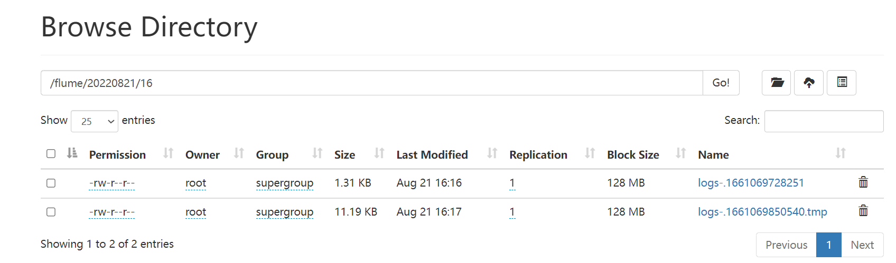
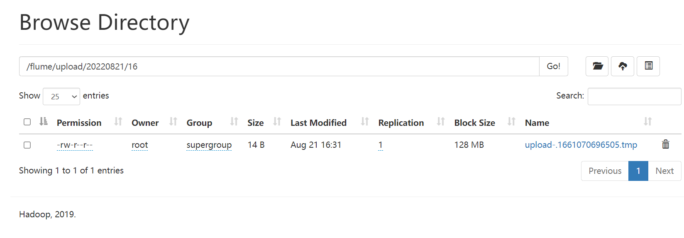
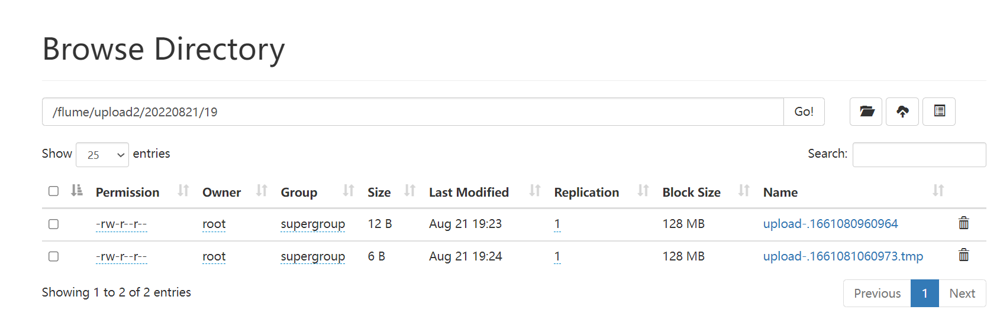

### Flume安装

```shell
tar -zxf /opt/software/apacheflume-1.9.0-bin.tar.gz -C /opt/module/ 
mv /opt/module/apache-flume-1.9.0-bin /opt/module/flume 
rm /opt/module/flume/lib/guava-11.0.2.jar 
```

#### 入门案例

```shell
#安装netcat工具
yum install -y nc
netstat -nlp | grep 44444
mkdir /opt/module/flume/job
#在job文件夹下创建Flume Agent配置文件flume-netcat-logger.conf
vim flume-netcat-logger.conf
#在flume-netcat-logger.conf文件中添加如下内容
添加内容如下：
# Name the components on this agent   a1:表示agent的名称
a1.sources = r1			#r1:表示a1的source的名称
a1.sinks = k1			#k1:表示a1的sink的名称
a1.channels = c1		#c1:表示a1的Channel的名称
# Describe/configure the source 	
a1.sources.r1.type = netcat			#表示a1的输入源类型为netcat端口类型
a1.sources.r1.bind = localhost		#表示a1的监听的主机
a1.sources.r1.port = 44444			#表示a1的监听的端口号
# Describe the sink
a1.sinks.k1.type = logger			#表示a1的输出目的地是控制台logger类型
# Use a channel which buffers events in memory
a1.channels.c1.type = memory		#表示a1的channel类型是memory内存型
a1.channels.c1.capacity = 1000		#表示a1的channel总容量100o个event
a1.channels.c1.transactionCapacity = 100	#表示a1的channel传输时收集到了100条event以后再去提交事务
#Bind the source and sink to the channel
# Bind the source and sink to the channel
a1.sources.r1.channels = c1			#表示将r1和c1连接起来
a1.sinks.k1.channel = c1			#表示将k1和c1连接起来

#先开启flume监听端口
#写法一：
bin/flume-ng agent --conf conf/ --name a1 --conf-file job/flume-netcat-logger.conf -Dflume.root.logger=INFO,console
#写法二：
bin/flume-ng agent -c conf/ -n a1 -f job/flume-netcat-logger.conf -Dflume.root.logger=INFO,console

#参数说明
--conf/-c：表示配置文件存储在 conf/目录 
--name/-n：表示给 agent 起名为 a1 
--conf-file/-f：flume 本次启动读取的配置文件是在 job 文件夹下的 flume-telnet.conf 文件。 
-Dflume.root.logger=INFO,console ：-D 表示 flume 运行时动态修改 flume.root.logger
参数属性值，并将控制台日志打印级别设置为 INFO 级别。日志级别包括:log、info、warn、
error。 

#使用netcat工具向本机的44444端口发送内容
nc localhost 44444
123

#在Flume监听页面观察接收数据情况
2022-08-21 15:35:17,007 (SinkRunner-PollingRunner-DefaultSinkProcessor) [INFO - org.apache.flume.sink.LoggerSink.process(LoggerSink.java:95)] Event: { headers:{} body: 31 32 33                                        123 }
```

#### **实时监控单个追加文件**

**案例需求：实时监控 Hive 日志，并上传到 HDFS 中** 

实现步骤：

（1）Flume 要想将数据输出到 HDFS，依赖 Hadoop 相关 jar 包

```shell
检查/etc/profile.d/my_env.sh 文件，确认 Hadoop 和 Java 环境变量配置正确
JAVA_HOME=/opt/module/jdk1.8.0_212
HADOOP_HOME=/opt/module/ha/hadoop-3.1.3
PATH=$PATH:$JAVA_HOME/bin:$HADOOP_HOME/bin:$HADOOP_HOME/sbin
export PATH JAVA_HOME HADOOP_HOME
```

（2）创建 flume-file-hdfs.conf 文件

```shell
vim flume-file-hdfs.conf
注：要想读取 Linux 系统中的文件，就得按照 Linux 命令的规则执行命令。由于 Hive
日志在 Linux 系统中所以读取文件的类型选择：exec 即 execute 执行的意思。表示执行
Linux 命令来读取文件。
添加如下内容
# Name the components on this agent
a2.sources = r2
a2.sinks = k2
a2.channels = c2
# Describe/configure the source
a2.sources.r2.type = exec
a2.sources.r2.command = tail -F /opt/module/hive/logs/hive.log
# Describe the sink
a2.sinks.k2.type = hdfs
a2.sinks.k2.hdfs.path = hdfs://hadoop102:8020/flume/%Y%m%d/%H
#上传文件的前缀
a2.sinks.k2.hdfs.filePrefix = logs- 
#是否按照时间滚动文件夹
a2.sinks.k2.hdfs.round = true
#多少时间单位创建一个新的文件夹
a2.sinks.k2.hdfs.roundValue = 1
#重新定义时间单位
a2.sinks.k2.hdfs.roundUnit = hour
#是否使用本地时间戳
a2.sinks.k2.hdfs.useLocalTimeStamp = true
#积攒多少个 Event 才 flush 到 HDFS 一次
a2.sinks.k2.hdfs.batchSize = 100
#设置文件类型，可支持压缩
a2.sinks.k2.hdfs.fileType = DataStream
#多久生成一个新的文件
a2.sinks.k2.hdfs.rollInterval = 60
#设置每个文件的滚动大小
a2.sinks.k2.hdfs.rollSize = 134217700
#文件的滚动与 Event 数量无关
a2.sinks.k2.hdfs.rollCount = 0
# Use a channel which buffers events in memory
a2.channels.c2.type = memory
a2.channels.c2.capacity = 1000
a2.channels.c2.transactionCapacity = 100
# Bind the source and sink to the channel
a2.sources.r2.channels = c2
a2.sinks.k2.channel = c2

注意：对于所有与时间相关的转义序列，Event Header 中必须存在以 “timestamp”的
key（除非 hdfs.useLocalTimeStamp 设置为 true，此方法会使用 TimestampInterceptor 自动添加 timestamp）。
a3.sinks.k3.hdfs.useLocalTimeStamp = true  
```

（3）运行 Flume

```shell
特别注意hdfs://hadoop102:8020
hdfs://localhost:9000	识别localhost

bin/flume-ng agent --conf conf/ --name a2 --conf-file job/flume-file-hdfs.conf -Dflume.root.logger=INFO,console
```

（4）开启 Hadoop 和 Hive 并操作 Hive 产生日志

```
[atguigu@hadoop102 hadoop-2.7.2]$ sbin/start-dfs.sh
[atguigu@hadoop103 hadoop-2.7.2]$ sbin/start-yarn.sh
[atguigu@hadoop102 hive]$ bin/hive
hive (default)>
```

（5）在 HDFS 上查看文件



#### **实时监控目录下多个新文件**

**案例需求：使用 Flume 监听整个目录的文件，并上传至 HDFS**

**3）实现步骤：**

（1）创建配置文件 flume-dir-hdfs.conf

```shell
vim flume-dir-hdfs.conf
添加如下内容
a3.sources = r3
a3.sinks = k3
a3.channels = c3
# Describe/configure the source
a3.sources.r3.type = spooldir
a3.sources.r3.spoolDir = /opt/module/flume/upload
a3.sources.r3.fileSuffix = .COMPLETED
a3.sources.r3.fileHeader = true
#忽略所有以.tmp 结尾的文件，不上传
a3.sources.r3.ignorePattern = ([^ ]*\.tmp)
# Describe the sink
a3.sinks.k3.type = hdfs
a3.sinks.k3.hdfs.path = hdfs://hadoop102:8020/flume/upload/%Y%m%d/%H
#上传文件的前缀
a3.sinks.k3.hdfs.filePrefix = upload- 
#是否按照时间滚动文件夹
a3.sinks.k3.hdfs.round = true
#多少时间单位创建一个新的文件夹
a3.sinks.k3.hdfs.roundValue = 1
#重新定义时间单位
a3.sinks.k3.hdfs.roundUnit = hour
#是否使用本地时间戳
a3.sinks.k3.hdfs.useLocalTimeStamp = true
#积攒多少个 Event 才 flush 到 HDFS 一次
a3.sinks.k3.hdfs.batchSize = 100 
#设置文件类型，可支持压缩
a3.sinks.k3.hdfs.fileType = DataStream
#多久生成一个新的文件
a3.sinks.k3.hdfs.rollInterval = 60
#设置每个文件的滚动大小大概是 128M
a3.sinks.k3.hdfs.rollSize = 134217700
#文件的滚动与 Event 数量无关
a3.sinks.k3.hdfs.rollCount = 0
# Use a channel which buffers events in memory
a3.channels.c3.type = memory
a3.channels.c3.capacity = 1000
a3.channels.c3.transactionCapacity = 100
# Bind the source and sink to the channel
a3.sources.r3.channels = c3
a3.sinks.k3.channel = c3
```

（2）启动监控文件夹命令

```shell
在/opt/module/flume 目录下创建 upload 文件夹
mkdir upload

bin/flume-ng agent --conf conf/ --name a3 --conf-file job/flume-dir-hdfs.conf

说明：在使用 Spooling Directory Source 时，不要在监控目录中创建并持续修改文
件；上传完成的文件会以.COMPLETED 结尾；被监控文件夹每 500 毫秒扫描一次文件变动。
```

（3）向 upload 文件夹中添加文件

```
向 upload 文件夹中添加文件
[atguigu@hadoop102 upload]$ touch atguigu.txt
[atguigu@hadoop102 upload]$ touch atguigu.tmp
[atguigu@hadoop102 upload]$ touch atguigu.log
```

（4）查看 HDFS 上的数据



#### 实时监控目录下的多个追加文件

Exec source适用于监控一个实时追加的文件，不能实现断点续传；Spooldir Source 适合用于同步新文件，但不适合对实时追加日志的文件进行监听并同步；而Taildir Source 适合用于监听多个实时追加的文件，并且能够实现断点续传。

**案例需求:使用Flume监听整个目录的实时追加文件，并上传至HDFS**

（1）创建配置文件 flume-taildir-hdfs.conf

```shell
vim flume-taildir-hdfs.conf

添加如下内容
a3.sources = r3
a3.sinks = k3
a3.channels = c3
# Describe/configure the source
a3.sources.r3.type = TAILDIR
a3.sources.r3.positionFile = /opt/module/flume/tail_dir.json
a3.sources.r3.filegroups = f1 f2
a3.sources.r3.filegroups.f1 = /opt/module/flume/files/.*file.*
a3.sources.r3.filegroups.f2 = /opt/module/flume/files2/.*log.*
# Describe the sink
a3.sinks.k3.type = hdfs
a3.sinks.k3.hdfs.path = 
hdfs://hadoop102:8020/flume/upload2/%Y%m%d/%H
#上传文件的前缀
a3.sinks.k3.hdfs.filePrefix = upload- 
#是否按照时间滚动文件夹
a3.sinks.k3.hdfs.round = true
#多少时间单位创建一个新的文件夹
a3.sinks.k3.hdfs.roundValue = 1
#重新定义时间单位
a3.sinks.k3.hdfs.roundUnit = hour
#是否使用本地时间戳
a3.sinks.k3.hdfs.useLocalTimeStamp = true
#积攒多少个 Event 才 flush 到 HDFS 一次
a3.sinks.k3.hdfs.batchSize = 100
#设置文件类型，可支持压缩
a3.sinks.k3.hdfs.fileType = DataStream
#多久生成一个新的文件
a3.sinks.k3.hdfs.rollInterval = 60
#设置每个文件的滚动大小大概是 128M
a3.sinks.k3.hdfs.rollSize = 134217700
#文件的滚动与 Event 数量无关
a3.sinks.k3.hdfs.rollCount = 0
# Use a channel which buffers events in memory
a3.channels.c3.type = memory
a3.channels.c3.capacity = 1000
a3.channels.c3.transactionCapacity = 100
# Bind the source and sink to the channel
a3.sources.r3.channels = c3
a3.sinks.k3.channel = c3
```

（2）启动监控文件夹命令

```shell
在/opt/module/flume 目录下创建 files 文件夹
mkdir files 
mkdir fiels2

bin/flume-ng agent --conf conf/ --name a3 --conf-file job/flume-taildir-hdfs.conf -Dflume.root.logger=INFO,console
```

（3）向 files 文件夹中追加内容

```shell
向 upload 文件夹中添加文件
[atguigu@hadoop102 files]$ echo hello >> file1.txt
[atguigu@hadoop102 files]$ echo atguigu >> file2.txt
```

（4）查看 HDFS 上的数据

