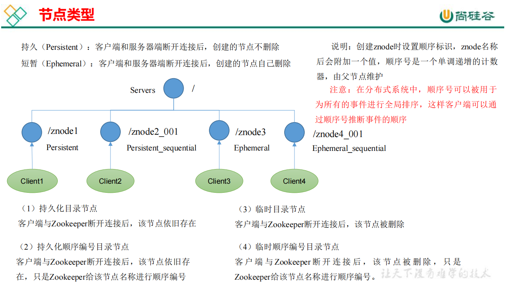

### 安装zookeeper

#### 环境准备

```shell
（1）安装 JDK
（2）拷贝 apache-zookeeper-3.5.7-bin.tar.gz 安装包到 Linux 系统下
（3）解压到指定目录
tar -zxvf apache-zookeeper-3.5.7-bin.tar.gz -C /opt/module/

（4）修改名称
mv apache-zookeeper-3.5.7-bin zookeeper-3.5.7
```

#### 修改配置文件

```shell
（1）将/opt/module/zookeeper-3.5.7/conf 这个路径下的 zoo_sample.cfg 修改为 zoo.cfg；
mv zoo_sample.cfg zoo.cfg

（2）打开 zoo.cfg 文件，修改 dataDir 路径：
 vim zoo.cfg
修改如下内容：
dataDir=/opt/module/zookeeper-3.5.7/zkData

（3）在/opt/module/zookeeper-3.5.7/这个目录上创建 zkData 文件夹
mkdir zkData
```
#### 操作zookeeper
```shell
（1）启动 Zookeeper
[atguigu@hadoop102 zookeeper-3.5.7]$ bin/zkServer.sh start

（2）查看进程是否启动
jps -l

（3）查看状态
bin/zkServer.sh status

（4）启动客户端
 bin/zkCli.sh

（5）退出客户端：
[zk: localhost:2181(CONNECTED) 0] quit

（6）停止 Zookeeper
bin/zkServer.sh stop
```

### zookeeper集群安装

zookeeper集群安装还需以下操作

```
在/opt/module/zookeeper-3.5.7/zkData 目录下创建一个 myid 的文件
[atguigu@hadoop102 zkData]$ vi myid
在文件中添加与 server 对应的编号（注意：上下不要有空行，左右不要有空格）
2
注意：添加 myid 文件，一定要在 Linux 里面创建，在 notepad++里面很可能乱码

拷贝配置好的 zookeeper 到其他机器上
[atguigu@hadoop102 module ]$ xsync zookeeper-3.5.7
并分别在 hadoop103、hadoop104 上修改 myid 文件中内容为 3、4

zoo.cfg文件需增加以下参数
server.2=hadoop102:2888:3888
server.3=hadoop103:2888:3888
server.4=hadoop104:2888:3888

同步 zoo.cfg 配置文件
[atguigu@hadoop102 conf]$ xsync zoo.cfg


配置参数解读
server.A=B:C:D。 A 是一个数字，表示这个是第几号服务器；
集群模式下配置一个文件 myid，这个文件在 dataDir 目录下，这个文件里面有一个数据就是 A 的值，Zookeeper 启动时读取此文件，拿到里面的数据与 zoo.cfg 里面的配置信息比较从而判断到底是哪个 server。 
B 是这个服务器的地址；
C 是这个服务器 Follower 与集群中的 Leader 服务器交换信息的端口；
D 是万一集群中的 Leader 服务器挂了，需要一个端口来重新进行选举，选出一个新的
Leader，而这个端口就是用来执行选举时服务器相互通信的端口。
```

 ### ==选举机制（面试重点）==


#### **Zookeeper选举机制——第一次启动**

```
（1）服务器1启 动，发起一次选举。服务器1投自己一票。此时服务器1票数一票，不够半数以上（3票），选举无法完成，服务器1状态保持为LOOKING； 

（2）服务器2启动，再发起一次选举。服务器1和2分别投自己一票并交换选票信息：此时服务器1发现服务器2的myid比自己目前投票推举的（服务器1） 大，更改选票为推举服务器2。此时服务器1票数0票，服务器2票数2票，没有半数以上结果，选举无法完成，服务器1，2状态保持LOOKING

（3）服务器3启动，发起一次选举。此时服务器1和2都会更改选票为服务器3。此次投票结果：服务器1为0票，服务器2为0票，服务器3为3票。此时服务器3的票数已经超过半数，服务器3当选Leader。服务器1，2更改状态为FOLLOWING，服务器3更改状态为LEADING；

（4）服务器4启动，发起一次选举。此时服务器1，2，3已经不是LOOKING状态，不会更改选票信息。交换选票信息结果：服务器3为3票，服务器4为 1票。此时服务器4服从多数，更改选票信息为服务器3，并更改状态为FOLLOWING； 

（5）服务器5启动，同4一样当小弟。
```

```
SID：服务器ID。用来唯一标识一台ZooKeeper集群中的机器，每台机器不能重复，和myid一致。

ZXID：事务ID。ZXID是一个事务ID，用来标识一次服务器状态的变更。在某一时刻，集群中的每台机器的ZXID值不一定完全一致，这和ZooKeeper服务器对于客户端“更新请求”的处理逻辑有关。

Epoch：每个Leader任期的代号。没有Leader时同一轮投票过程中的逻辑时钟值是相同的。每投完一次票这个数据就会增加
```

#### **Zookeeper选举机制——非第一次启动**

```
（1）当ZooKeeper集群中的一台服务器出现以下两种情况之一时，就会开始进入Leader选举：
• 服务器初始化启动。
• 服务器运行期间无法和Leader保持连接。

（2）而当一台机器进入Leader选举流程时，当前集群也可能会处于以下两种状态：
• 集群中本来就已经存在一个Leader。
 对于第一种已经存在Leader的情况，机器试图去选举Leader时，会被告知当前服务器的Leader信息，对于该机器来说，仅仅需要和Leader机器建立连接，并进行状态同步即可。
• 集群中确实不存在Leader。
 假设ZooKeeper由5台服务器组成，SID分别为1、2、3、4、5，ZXID分别为8、8、8、7、7，并且此时SID为3的服务器是Leader。某一时刻，3和5服务器出现故障，因此开始进行Leader选举。
 
  						 （EPOCH，ZXID，SID ）（EPOCH，ZXID，SID ）（EPOCH，ZXID，SID ）
 SID为1、2、4的机器投票情况：（1，8，1） 		   （1，8，2） 			（1，7，4）  
```

==选举Leader规则： ①EPOCH大的直接胜出 ②EPOCH相同，事务id大的胜出 ③事务id相同，服务器id大的胜出==

### **ZK** **集群启动停止脚本**

```shell
#!/bin/bash
case $1 in
"start"){
for i in hadoop102 hadoop103 hadoop104
do
 echo ---------- zookeeper $i 启动 ------------
ssh $i "/opt/module/zookeeper-3.5.7/bin/zkServer.sh 
start"
done
};;
"stop"){
for i in hadoop102 hadoop103 hadoop104
do
 echo ---------- zookeeper $i 停止 ------------ 
ssh $i "/opt/module/zookeeper-3.5.7/bin/zkServer.sh 
stop"
done
};;
"status"){
for i in hadoop102 hadoop103 hadoop104
do
 echo ---------- zookeeper $i 状态 ------------ 
ssh $i "/opt/module/zookeeper-3.5.7/bin/zkServer.sh 
status"
done
};;
esac
```

### 客户端命令行操作

1. 启动客户端

```
[atguigu@hadoop102 zookeeper-3.5.7]$ bin/zkCli.sh -server hadoop102:2181
```

2. 显示所有操作命令

```
[zk: hadoop102:2181(CONNECTED) 1] help
```



==（1）czxid：创建节点的事务 zxid==

zxid每次修改 ZooKeeper 状态都会产生一个 ZooKeeper 事务 ID。事务 ID 是ZooKeeper 中所有修改总的次序。每次修改都有唯一的 zxid，如果 zxid1 小于 zxid2，那么 zxid1 在 zxid2 之前发生。
（2）ctime：znode 被创建的毫秒数（从 1970 年开始）
（3）mzxid：znode 最后更新的事务 zxid
（4）mtime：znode 最后修改的毫秒数（从 1970 年开始）
（5）pZxid：znode 最后更新的子节点 zxid
（6）cversion：znode 子节点变化号，znode 子节点修改次数
==（7）dataversion：znode 数据变化号==
（8）aclVersion：znode 访问控制列表的变化号
（9）ephemeralOwner：如果是临时节点，这个是 znode 拥有者的 session id。如果不是临时节点则是 0。 ==（10）dataLength：znode 的数据长度==
==（11）numChildren：znode 子节点数量==

```
查看当前znode中所包含的内容
ls /

查看当前节点详细数据
ls -s /

分别创建2个普通节点（永久节点 + 不带序号）
注意：创建节点时，要赋值
create /sanguo "diaochan"
create /sanguo/shuguo "liubei"

获得节点的值
get -s /sanguo
get -s /sanguo/shuguo

创建带序号的节点（永久节点 + 带序号）
先创建一个普通的根节点/sanguo/weiguo
create /sanguo/weiguo "caocao"
创建带序号的节点
create -s /sanguo/weiguo/zhangliao "zhangliao"
Created /sanguo/weiguo/zhangliao0000000000

create -s /sanguo/weiguo/zhangliao "zhangliao"
Created /sanguo/weiguo/zhangliao0000000001

create -s /sanguo/weiguo/xuchu "xuchu"
Created /sanguo/weiguo/xuchu0000000002

创建短暂节点（短暂节点 + 不带序号 or 带序号）
create -e /sanguo/wuguo "zhouyu"
Created /sanguo/wuguo

create -e -s /sanguo/wuguo "zhouyu"
Created /sanguo/wuguo0000000001

修改节点数据值
set /sanguo/weiguo "simayi"
```

```
查看节点内容
ls 节点

查看节点详细内容
ls -s 节点 

创建节点-e为短暂节点，-s为带序号
create [-e] [-s] 节点 值 

获取节点值
get -s 节点	

修改节点值
set 节点 值	
```

