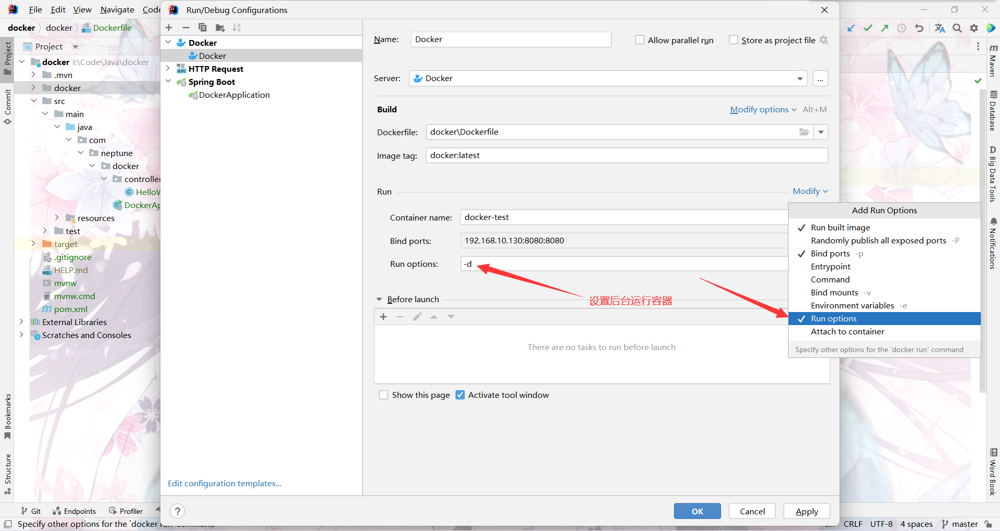
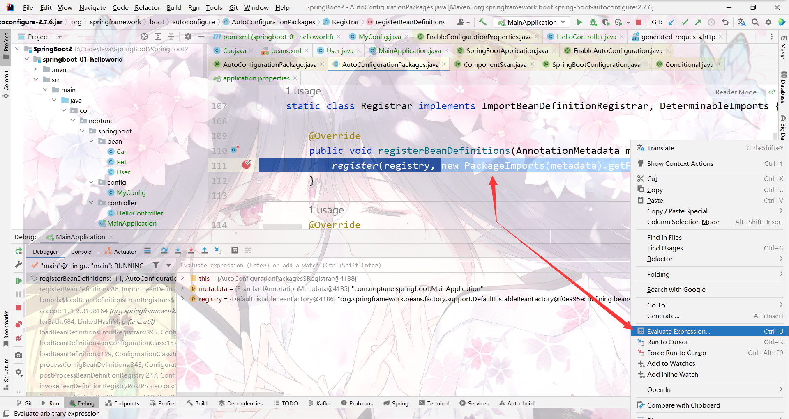

# 1 IDEA集成docker

## 1.1 修改docker配置

```perl
#1、编辑docker.service
vim /usr/lib/systemd/system/docker.service

#2、修改ExecStart属性，在后面添加-H tcp://0.0.0.0:2375 -H unix:///var/run/docker.sock
ExecStart=/usr/bin/dockerd -H fd:// --containerd=/run/containerd/containerd.sock -H tcp://0.0.0.0:2375 -H unix:///var/run/docker.sock

#3、刷新配置，重启服务
systemctl daemon-reload
systemctl restart docker
```

## 1.2 **验证tcp是否开启**

```json
[root@Neptune ~]# curl -s http://192.168.10.130:2333/version|python -m json.tool
{
    "ApiVersion": "1.41",
    "Arch": "amd64",
    "BuildTime": "2022-10-25T18:02:38.000000000+00:00",
    "Components": [
        {
            "Details": {
                "ApiVersion": "1.41",
                "Arch": "amd64",
                "BuildTime": "2022-10-25T18:02:38.000000000+00:00",
                "Experimental": "false",
                "GitCommit": "3056208",
                "GoVersion": "go1.18.7",
                "KernelVersion": "3.10.0-1160.80.1.el7.x86_64",
                "MinAPIVersion": "1.12",
                "Os": "linux"
            },
            "Name": "Engine",
            "Version": "20.10.21"
        },
        ...
    ],
....
}
```

## 1.3 通过docker的maven插件构建镜像

## 1.4 通过IDEA的Docker插件构建镜像

### 1.4.1 连接docker


### 1.4.2 配置docker服务

#### 1.4.2.1 创建Dockerfile目录

创建一个docker目录，并在docker目录下新建一个Dockerfile文件，其内容如下所示：

```dockerfile
# Base images 基础镜像
FROM java:8u111
ENV JAVA_HOME=/opt/java/openjdk
COPY --from=eclipse-temurin:17 $JAVA_HOME $JAVA_HOME
ENV PATH="${JAVA_HOME}/bin:${PATH}"

#MAINTAINER 维护者信息
MAINTAINER Neptune

#VOLUME：挂载目录
VOLUME /tmp

#ADD  将microservicecloud-eureka-7001-1.0-SNAPSHOT.jar文件将拷贝到容器中，默认拷贝到根路径下
#注意：docker-0.0.1-SNAPSHOT.jar的名称前的docker对应<artifactId>标签中的内容，
#0.0.1-SNAPSHOT对应<version>标签中的内容
ADD docker-0.0.1-SNAPSHOT.jar app.jar

RUN bash -c "touch /app.jar"

#EXPOSE 容器暴露端口
EXPOSE 8080

#ENTRYPOINT 应用启动命令 参数设定
#由于tomcat的session id的生成主要通过java.security.SecureRandom生成随机数来实现，导致启动过程很慢
#通过-Djava.security.egd=file:/dev/./urandom参数可以加快随机数产生过程
ENTRYPOINT ["java", "-Djava.security.egd=file:/dev/./urandom", "-jar", "/app.jar"]
```

#### 1.4.2.2  **创建Dockerfile启动项**


==注意：容器端口，是项目的application.yml / application.properties 配置文件中server.port指定的端口==





#### 1.4.2.3 在pom中添加插件

在pom.xml文件中添加SpringBoot的maven插件，如果不添加，运行容器时，会报错，错误信息为：no main manifest attribute, in /xxx.jar

```xml
<build>
   <plugins>
       <plugin>
           <groupId>org.springframework.boot</groupId>
           <artifactId>spring-boot-maven-plugin</artifactId>
           <!-- 项目基于maven pom多模块的开发的，需要设置goal-repackage属性为true，否则打包后文件依赖文件没有一起打包，然后镜像内没有可以运行的程序文件 -->
           <executions>
               <execution>
                   <goals>
                       <goal>repackage</goal>
                   </goals>
               </execution>
           </executions>
           <configuration>
               <includeSystemScope>true</includeSystemScope>
           </configuration>
       </plugin>
   </plugins>
</build>
```

### 1.4.3 打包项目

执行mvn clean install命令，打包项目并安装到本地的maven仓库中

或点击maven插件执行打包


打包完成后将jar包放在Dockerfile相同目录下


### 1.4.4  运行项目


### 1.4.5 访问测试


# 2 IDEA 快捷键

## 2.1 控制台搜索


## 2.2 表达式计算

debug时，选中表达式右键可计算出表达式的值




# 3 IDEA Service

## 3.1 Service 管理Springboot


移除service管理，右键=>delete

