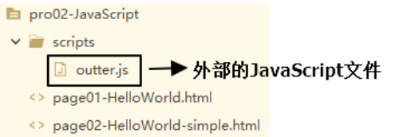
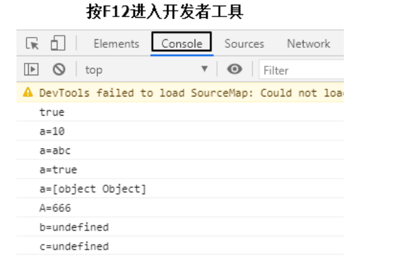

## 1、JavaScript代码嵌入方式

### [#](https://heavy_code_industry.gitee.io/code_heavy_industry/pro001-javaweb/lecture/chapter03/verse03.html#_1html文档内)①HTML文档内

- JavaScript代码要写在script标签内
- script标签可以写在文档内的任意位置
- 为了能够方便查询或操作HTML标签（元素）script标签可以写在body标签后面

可以参考简化版的HelloWorld

```html
<!-- 在HBuilderX中，script标签通过打字“sc”两个字母就可以直接完整生成 -->
<script type="text/javascript">
	
	// 下面是同样实现HelloWorld功能的简化版代码
	document.getElementById("helloBtn").onclick = function() {
		alert("Hello simple");
	};
	
</script>
```

### [#](https://heavy_code_industry.gitee.io/code_heavy_industry/pro001-javaweb/lecture/chapter03/verse03.html#_2引入外部javascript文档)②引入外部JavaScript文档

在script标签内通过src属性指定外部xxx.js文件的路径即可。但是要注意以下两点：

- 引用外部JavaScript文件的script标签里面不能写JavaScript代码
- 先引入，再使用
- script标签不能写成单标签



引入方式如下：

```html
<body>
</body>

<!-- 使用script标签的src属性引用外部JavaScript文件，和Java中的import语句类似 -->
<!-- 引用外部JavaScript文件的script标签里面不能写JavaScript代码 -->
<!-- 引用外部JavaScript文件的script标签不能改成单标签 -->
<!-- 外部JavaScript文件一定要先引入再使用 -->
<script src="/pro02-JavaScript/scripts/outter.js" type="text/javascript" charset="utf-8"></script>

<script type="text/javascript">
	
	// 调用外部JavaScript文件中声明的方法
	showMessage();
</script>
```

## [#](https://heavy_code_industry.gitee.io/code_heavy_industry/pro001-javaweb/lecture/chapter03/verse03.html#_2、声明和使用变量)2、声明和使用变量

### [#](https://heavy_code_industry.gitee.io/code_heavy_industry/pro001-javaweb/lecture/chapter03/verse03.html#_1javascript数据类型)①JavaScript数据类型

- 基本数据类型

  - 数值型：JavaScript不区分整数、小数

  - 字符串：JavaScript不区分字符、字符串；单引号、双引号意思一样。

  - 布尔型：true、false

    在JavaScript中，其他类型和布尔类型的自动转换。

    true：非零的数值，非空字符串，非空对象

    false：零，空字符串，null，undefined

    例如："false"放在if判断中

    ```javascript
    // "false"是一个非空字符串，直接放在if判断中会被当作『真』处理
    if("false"){
    	alert("true");
    }else{
    	alert("false");
    }
    ```

- 引用类型

  - 所有new出来的对象
  - 用[]声明的数组
  - 用{}声明的对象

### [#](https://heavy_code_industry.gitee.io/code_heavy_industry/pro001-javaweb/lecture/chapter03/verse03.html#_2变量)②变量

- 关键字：var

- 数据类型：JavaScript变量可以接收任意类型的数据

- 标识符：严格区分大小写

- 变量使用规则

  - 如果使用了一个没有声明的变量，那么会在运行时报错

    Uncaught ReferenceError: b is not defined

  - 如果声明一个变量没有初始化，那么这个变量的值就是undefined

## [#](https://heavy_code_industry.gitee.io/code_heavy_industry/pro001-javaweb/lecture/chapter03/verse03.html#_3、函数)3、函数

### [#](https://heavy_code_industry.gitee.io/code_heavy_industry/pro001-javaweb/lecture/chapter03/verse03.html#_1内置函数)①内置函数

内置函数：系统已经声明好了可以直接使用的函数。

#### [#](https://heavy_code_industry.gitee.io/code_heavy_industry/pro001-javaweb/lecture/chapter03/verse03.html#_1-弹出警告框)[1]弹出警告框

```javascript
alert("警告框内容");
```

1

#### [#](https://heavy_code_industry.gitee.io/code_heavy_industry/pro001-javaweb/lecture/chapter03/verse03.html#_2-弹出确认框)[2]弹出确认框

用户点击『确定』返回true，点击『取消』返回false

```javascript
var result = confirm("老板，你真的不加个钟吗？");
if(result) {
	console.log("老板点了确定，表示要加钟");
}else{
	console.log("老板点了确定，表示不加钟");
}
```


#### [#](https://heavy_code_industry.gitee.io/code_heavy_industry/pro001-javaweb/lecture/chapter03/verse03.html#_3-在控制台打印日志)[3]在控制台打印日志

```javascript
console.log("日志内容");
```




### [#](https://heavy_code_industry.gitee.io/code_heavy_industry/pro001-javaweb/lecture/chapter03/verse03.html#_2声明函数)②声明函数

写法1：

```javascript
		function sum(a, b) {
			return a+b;
		}
```


写法2：

```javascript
		var total = function() {
			return a+b;
		};
```


写法2可以这样解读：声明一个函数，相当于创建了一个『函数对象』，将这个对象的『引用』赋值给变量total。最后加的分号不是给函数声明加的，而是给整体的赋值语句加的分号。

### [#](https://heavy_code_industry.gitee.io/code_heavy_industry/pro001-javaweb/lecture/chapter03/verse03.html#_3调用函数)③调用函数

JavaScript中函数本身就是一种对象，函数名就是这个**『对象』**的**『引用』**。而调用函数的格式是：**函数引用()**。

```javascript
		function sum(a, b) {
			return a+b;
		}
		
		var result = sum(2, 3);
		console.log("result="+result);
```


或：

```javascript
		var total = function() {
			return a+b;
		}
		
		var totalResult = total(3,6);
		console.log("totalResult="+totalResult);
```


## [#](https://heavy_code_industry.gitee.io/code_heavy_industry/pro001-javaweb/lecture/chapter03/verse03.html#_4、对象)4、对象

JavaScript中没有『类』的概念，对于系统内置的对象可以直接创建使用。

### [#](https://heavy_code_industry.gitee.io/code_heavy_industry/pro001-javaweb/lecture/chapter03/verse03.html#_1使用new关键字创建对象)①使用new关键字创建对象

```javascript
		// 创建对象
		var obj01 = new Object();
		
		// 给对象设置属性和属性值
		obj01.stuName = "tom";
		obj01.stuAge = 20;
		obj01.stuSubject = "java";
		
		// 在控制台输出对象
		console.log(obj01);
```


### [#](https://heavy_code_industry.gitee.io/code_heavy_industry/pro001-javaweb/lecture/chapter03/verse03.html#_2使用-创建对象)②使用{}创建对象

```javascript
		// 创建对象
		var obj02 = {
			"soldierName":"john",
			"soldierAge":35,
			"soldierWeapon":"gun"
		};
		
		// 在控制台输出对象
		console.log(obj02);
```


### [#](https://heavy_code_industry.gitee.io/code_heavy_industry/pro001-javaweb/lecture/chapter03/verse03.html#_3给对象设置函数属性)③给对象设置函数属性

```javascript
// 创建对象
var obj01 = new Object();

// 给对象设置属性和属性值
obj01.stuName = "tom";
obj01.stuAge = 20;
obj01.stuSubject = "java";

obj01.study = function() {
	console.log(this.stuName + " is studying");
};

// 在控制台输出对象
console.log(obj01);
// 调用函数
obj01.study();
```


或：

```javascript
// 创建对象
var obj02 = {
	"soldierName":"john",
	"soldierAge":35,
	"soldierWeapon":"gun",
	"soldierShoot":function(){
		console.log(this.soldierName + " is using " + this.soldierWeapon);
	}
};

// 在控制台输出对象
console.log(obj02);
// 调用函数
obj02.soldierShoot();
```


### [#](https://heavy_code_industry.gitee.io/code_heavy_industry/pro001-javaweb/lecture/chapter03/verse03.html#_4this关键字)④this关键字

this关键字只有两种情况：

- 在函数外面：this关键字指向window对象（代表当前浏览器窗口）
- 在函数里面：this关键字指向调用函数的对象

```javascript
// 直接打印this
console.log(this);

// 函数中的this
// 1.声明函数
function getName() {
	console.log(this.name);
}

// 2.创建对象
var obj01 = {
	"name":"tom",
	"getName":getName
};
var obj02 = {
	"name":"jerry",
	"getName":getName
};

// 3.调用函数
obj01.getName();
obj02.getName();
```


## [#](https://heavy_code_industry.gitee.io/code_heavy_industry/pro001-javaweb/lecture/chapter03/verse03.html#_5、数组)5、数组

### [#](https://heavy_code_industry.gitee.io/code_heavy_industry/pro001-javaweb/lecture/chapter03/verse03.html#_1使用new关键字创建数组)①使用new关键字创建数组

```javascript
// 1.创建数组对象
var arr01 = new Array();

// 2.压入数据
arr01.push("apple");
arr01.push("orange");
arr01.push("banana");
arr01.push("grape");

// 3.遍历数组
for (var i = 0; i < arr01.length; i++) {
	console.log(arr01[i]);
}

// 4.数组元素反序
arr01.reverse();
for (var i = 0; i < arr01.length; i++) {
	console.log(arr01[i]);
}

// 5.数组元素拼接成字符串
var arrStr = arr01.join(",");
console.log(arrStr);

// 6.字符串拆分成数组
var arr02 = arrStr.split(",");
for (var i = 0; i < arr02.length; i++) {
	console.log(arr02[i]);
}

// 7.弹出数组中最后一个元素
var ele = arr01.pop();
console.log(ele);
```


### [#](https://heavy_code_industry.gitee.io/code_heavy_industry/pro001-javaweb/lecture/chapter03/verse03.html#_2使用-创建数组)②使用[]创建数组

```javascript
// 8.使用[]创建数组
var arr03 = ["cat","dog","tiger"];
console.log(arr03);
```


## [#](https://heavy_code_industry.gitee.io/code_heavy_industry/pro001-javaweb/lecture/chapter03/verse03.html#_6、json)6、JSON

### [#](https://heavy_code_industry.gitee.io/code_heavy_industry/pro001-javaweb/lecture/chapter03/verse03.html#_1json格式的用途)①JSON格式的用途

在开发中凡是涉及到**『跨平台数据传输』**，JSON格式一定是首选。

### [#](https://heavy_code_industry.gitee.io/code_heavy_industry/pro001-javaweb/lecture/chapter03/verse03.html#_2json格式的说明)②JSON格式的说明

- JSON数据两端要么是**{}**，要么是**[]**
- **{}**定义JSON对象
- **[]**定义JSON数组
- JSON对象的格式是：

```json
{key:value,key:value,...,key:value}
```


- JOSN数组的格式是：

```json
[value,value,...,value]
```


- key的类型固定是字符串
- value的类型可以是：
  - 基本数据类型
  - 引用类型：JSON对象或JSON数组

正因为JSON格式中value部分还可以继续使用JSON对象或JSON数组，所以JSON格式是可以**『多层嵌套』**的，所以JSON格式不论多么复杂的数据类型都可以表达。

```json
{
	"stuId":556,
	"stuName":"carl",
	"school":{
		"schoolId":339,
		"schoolName":"atguigu"
	},
	"subjectList":[
		{
			"subjectName":"java",
			"subjectScore":50
		},
		{
			"subjectName":"PHP",
			"subjectScore":35
		},
		{
			"subjectName":"python",
			"subjectScore":24
		}
	],
	"teacherMap":{
		"aaa":{
			"teacherName":"zhangsan",
			"teacherAge":20
		},
		"bbb":{
			"teacherName":"zhangsanfeng",
			"teacherAge":108
		},
		"ccc":{
			"teacherName":"zhangwuji",
			"teacherAge":25
		}
	}
}
```


### [#](https://heavy_code_industry.gitee.io/code_heavy_industry/pro001-javaweb/lecture/chapter03/verse03.html#_3json对象和json字符串互转)③JSON对象和JSON字符串互转

#### [#](https://heavy_code_industry.gitee.io/code_heavy_industry/pro001-javaweb/lecture/chapter03/verse03.html#_1-json对象转json字符串)[1]JSON对象转JSON字符串

```javascript
var jsonObj = {"stuName":"tom","stuAge":20};
var jsonStr = JSON.stringify(jsonObj);

console.log(typeof jsonObj); // object
console.log(typeof jsonStr); // string
```


#### [#](https://heavy_code_industry.gitee.io/code_heavy_industry/pro001-javaweb/lecture/chapter03/verse03.html#_2-json字符串转json对象)[2]JSON字符串转JSON对象

```javascript
jsonObj = JSON.parse(jsonStr);
console.log(jsonObj); // {stuName: "tom", stuAge: 20}
```