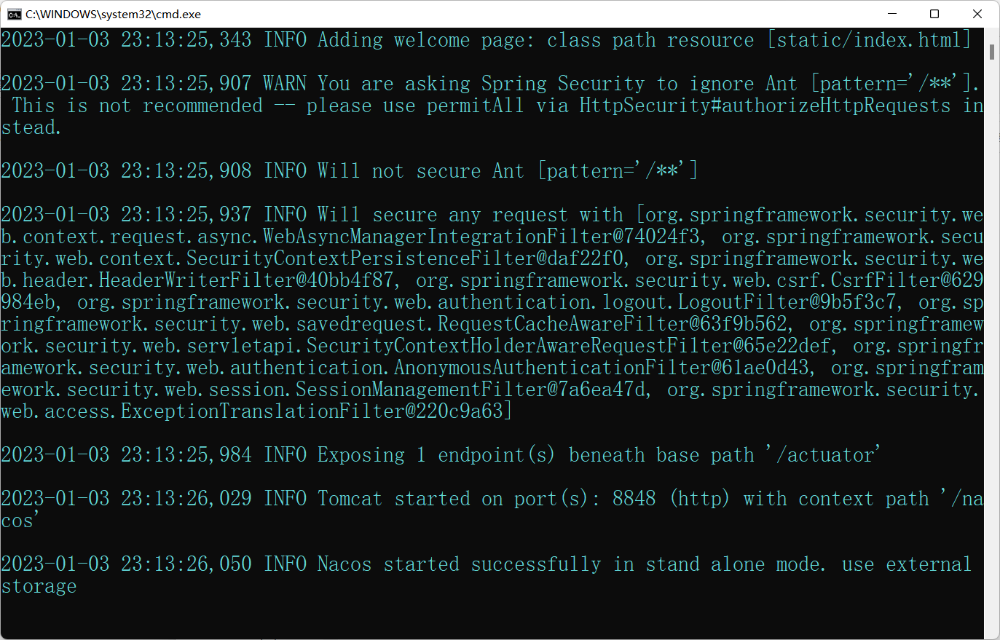
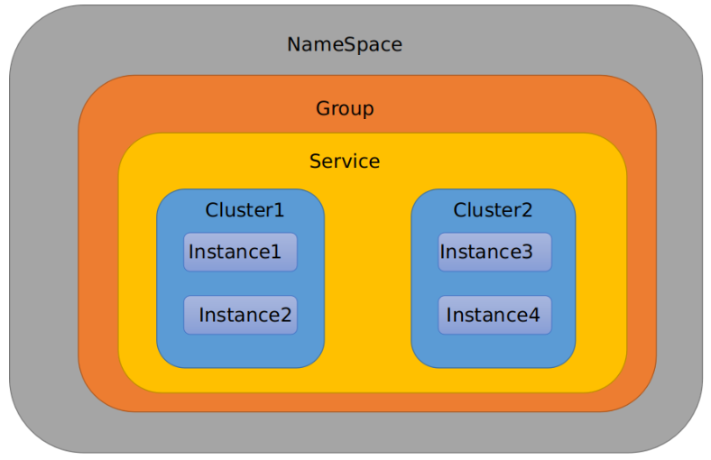
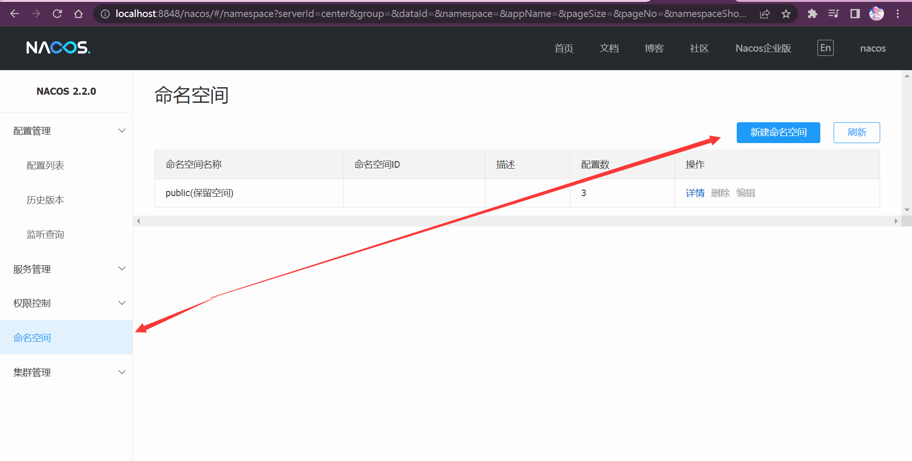

# Nacos服务注册和配置中心

# **1 Nacos** **简介**

## 1.1 **为什么叫Nacos**

前四个字母分别为Naming和Configuration的前两个字母，最后的s为Service。

## 1.2 **是什么**

* 一个更易于构建云原生应用的动态服务发现、配置管理和服务管理平台。
* Nacos: Dynamic Naming and Configuration Service
* Nacos就是注册中心＋配置中心的组合（Nacos = Eureka+Config +Bus）

## 1.3 能干嘛

* 替代Eureka做服务注册中心
* 替代Config做服务配置中心
* 支持负载均衡

## 1.4 去哪下

* https://github.com/alibaba/Nacos
* 官网文档
  * https://nacos.io/zh-cn/index.html
  * https://spring-cloud-alibaba-group.github.io/github-pages/greenwich/spring-cloud-alibaba.html#_spring_cloud_alibaba_nacos_discovery

## 1.5 各种注册中心比较

| 服务注册与发现框架 | CAP模型 | 控制台管理 | 社区活跃度       |
| ------------------ | ------- | ---------- | ---------------- |
| Eureka             | AP      | 支持       | 低(2.x 版本闭源) |
| Zookeeper          | CP      | 不支持     | 中               |
| Consul             | CP      | 支持       | 高               |
| Nacos              | AP      | 支持       | 高               |

# 2 安装并运行Nacos

## 2.1 环境准备

Java8

## 2.2 Windows安装Nacos

https://github.com/alibaba/nacos


双击startup.cmd启动

或

startup.cmd -m standalone启动（不需要修改脚本）



访问 http://localhost:8848/nacos

密码nacos/nacos


## 2.3 Linux安装Nacos

```bash
tar -zxvf nacos-server-2.2.0.tar.gz -C /opt/
cd /opt/nacos/
vim bin/startup.sh
vim conf/application.properties
mysql -uroot -p123456
```

```mysql
create database nacos;
use nacos;
source /opt/nacos/conf/mysql-schema.sql
```

```perl
bin/startup.sh
```

访问 http://192.168.10.130:8848/nacos

密码nacos/nacos


# 3 Nacos作为服务注册中心

## 3.1 官网文档

https://spring-cloud-alibaba-group.github.io/github-pages/greenwich/spring-cloud-alibaba.html

nacos：https://spring-cloud-alibaba-group.github.io/github-pages/greenwich/spring-cloud-alibaba.html#_spring_cloud_alibaba_nacos_config

springboot和springcloud版本对应关系：https://spring.io/projects/spring-cloud#overvie


==SpringBoot和SpringCloud版本对应关系==

```perl
springboot版本高于springcloud版本会报错
Caused by: java.lang.NoClassDefFoundError: org/springframework/boot/context/properties/ConfigurationBeanFactoryMetadata
```


## 3.2 基于Nacos的服务提供者

### 3.2.1 新建Module


### 3.2.2 POM

```xml
<?xml version="1.0" encoding="UTF-8"?>
<project xmlns="http://maven.apache.org/POM/4.0.0" xmlns:xsi="http://www.w3.org/2001/XMLSchema-instance"
         xsi:schemaLocation="http://maven.apache.org/POM/4.0.0 https://maven.apache.org/xsd/maven-4.0.0.xsd">
    <modelVersion>4.0.0</modelVersion>
    <parent>
        <groupId>org.springframework.boot</groupId>
        <artifactId>spring-boot-starter-parent</artifactId>
        <version>3.0.1</version>
        <relativePath/> <!-- lookup parent from repository -->
    </parent>
    <groupId>com.example</groupId>
    <artifactId>springboot-nacos</artifactId>
    <version>0.0.1-SNAPSHOT</version>
    <name>springboot-nacos</name>
    <description>springboot-nacos</description>
    <properties>
        <java.version>17</java.version>
    </properties>

    <!-- 添加 alibaba 的依赖管理 -->
    <dependencyManagement>
        <dependencies>
            <dependency>
                <groupId>com.alibaba.cloud</groupId>
                <artifactId>spring-cloud-alibaba-dependencies</artifactId>
                <version>2022.0.0.0-RC1</version>
                <type>pom</type>
                <scope>import</scope>
            </dependency>
        </dependencies>
    </dependencyManagement>

    <dependencies>
        <!--SpringCloud ailibaba nacos -->
        <dependency>
            <groupId>com.alibaba.cloud</groupId>
            <artifactId>spring-cloud-starter-alibaba-nacos-discovery</artifactId>
        </dependency>

        <dependency>
            <groupId>org.springframework.boot</groupId>
            <artifactId>spring-boot-starter-web</artifactId>
        </dependency>

        <dependency>
            <groupId>org.springframework.boot</groupId>
            <artifactId>spring-boot-devtools</artifactId>
            <scope>runtime</scope>
            <optional>true</optional>
        </dependency>
        <dependency>
            <groupId>org.projectlombok</groupId>
            <artifactId>lombok</artifactId>
            <optional>true</optional>
        </dependency>
        <dependency>
            <groupId>org.springframework.boot</groupId>
            <artifactId>spring-boot-starter-test</artifactId>
            <scope>test</scope>
        </dependency>
    </dependencies>

    <build>
        <plugins>
            <plugin>
                <groupId>org.springframework.boot</groupId>
                <artifactId>spring-boot-maven-plugin</artifactId>
                <configuration>
                    <excludes>
                        <exclude>
                            <groupId>org.projectlombok</groupId>
                            <artifactId>lombok</artifactId>
                        </exclude>
                    </excludes>
                </configuration>
            </plugin>
        </plugins>
    </build>

</project>

```

### 3.2.3 YML

```yaml
server:
  port: 8001
spring:
  application:
    name: nacos-payment-provider #注册到Nacos的服务名
  cloud:
    nacos: # 客户端注册的地址
      server-addr: localhost:8848
      username: nacos
      password: nacos
#      discovery: #命名空间 可以做项目隔离
#        namespace: car-namespace
#        group: dev # 在命名空间下的组别，可以用来做细粒度的隔离

#Endpoint 本身对外界隐藏显示，我们需要在配置里面开启对 Endponit 的显示支持。
#对外界保留那些 Endpoint，若是所有则使用* ；
management:
  endpoints:
    web:
      exposure:
        include: '*'
```

### 3.2.4 主启动类

```java
import org.springframework.boot.SpringApplication;
import org.springframework.boot.autoconfigure.SpringBootApplication;
import org.springframework.cloud.client.discovery.EnableDiscoveryClient;

@EnableDiscoveryClient //自动注册到nacos，默认为true,这注解不写也能注册
@SpringBootApplication
public class SpringbootNacosApplication {

    public static void main(String[] args) {
        SpringApplication.run(SpringbootNacosApplication.class, args);
    }

}
```

### 3.2.5 业务类

```java
import org.springframework.beans.factory.annotation.Value;
import org.springframework.web.bind.annotation.GetMapping;
import org.springframework.web.bind.annotation.PathVariable;
import org.springframework.web.bind.annotation.RestController;

@RestController
public class PaymentController {
    @Value("${server.port}")
    private String serverPort;

    @GetMapping(value = "/payment/nacos/{id}")
    public String getPayment(@PathVariable("id") Integer id) {
        return "nacos registry, serverPort: " + serverPort + "\t id：" + id;
    }
}
```

### 3.2.6测试

```perl
http://localhost:8001//payment/nacos/123
```


**nacos服务注册中心+服务提供者8001都OK了**

### 3.2.7 新建第二个微服务(负载均衡用)

#### 3.2.7.1  物理新建

#### 3.2.7.2 虚拟映射拷贝


## 3.3 基于Nacos的服务消费者

### 3.3.1 新建Module


### 3.3.2 POM

```xml
<?xml version="1.0" encoding="UTF-8"?>
<project xmlns="http://maven.apache.org/POM/4.0.0" xmlns:xsi="http://www.w3.org/2001/XMLSchema-instance"
         xsi:schemaLocation="http://maven.apache.org/POM/4.0.0 https://maven.apache.org/xsd/maven-4.0.0.xsd">
    <modelVersion>4.0.0</modelVersion>
    <parent>
        <groupId>org.springframework.boot</groupId>
        <artifactId>spring-boot-starter-parent</artifactId>
        <version>3.0.1</version>
        <relativePath/> <!-- lookup parent from repository -->
    </parent>
    <groupId>com.example</groupId>
    <artifactId>springboot-nacos2</artifactId>
    <version>0.0.1-SNAPSHOT</version>
    <name>springboot-nacos2</name>
    <description>springboot-nacos2</description>
    <properties>
        <java.version>17</java.version>
    </properties>

    <!-- 添加 alibaba 的依赖管理 -->
    <dependencyManagement>
        <dependencies>
            <dependency>
                <groupId>com.alibaba.cloud</groupId>
                <artifactId>spring-cloud-alibaba-dependencies</artifactId>
                <version>2022.0.0.0-RC1</version>
                <type>pom</type>
                <scope>import</scope>
            </dependency>
        </dependencies>
    </dependencyManagement>

    <dependencies>
        <!--SpringCloud ailibaba nacos -->
        <dependency>
            <groupId>com.alibaba.cloud</groupId>
            <artifactId>spring-cloud-starter-alibaba-nacos-discovery</artifactId>
        </dependency>

        <!-- 高版本nacos已移除ribbon，需要自行添加负载均衡依赖-->
        <dependency>
            <groupId>org.springframework.cloud</groupId>
            <artifactId>spring-cloud-starter-loadbalancer</artifactId>
            <version>4.0.0</version>
        </dependency>

        <dependency>
            <groupId>org.springframework.boot</groupId>
            <artifactId>spring-boot-starter-web</artifactId>
        </dependency>

        <dependency>
            <groupId>org.springframework.boot</groupId>
            <artifactId>spring-boot-devtools</artifactId>
            <scope>runtime</scope>
            <optional>true</optional>
        </dependency>
        <dependency>
            <groupId>org.projectlombok</groupId>
            <artifactId>lombok</artifactId>
            <optional>true</optional>
        </dependency>
        <dependency>
            <groupId>org.springframework.boot</groupId>
            <artifactId>spring-boot-starter-test</artifactId>
            <scope>test</scope>
        </dependency>
    </dependencies>

    <build>
        <plugins>
            <plugin>
                <groupId>org.springframework.boot</groupId>
                <artifactId>spring-boot-maven-plugin</artifactId>
                <configuration>
                    <excludes>
                        <exclude>
                            <groupId>org.projectlombok</groupId>
                            <artifactId>lombok</artifactId>
                        </exclude>
                    </excludes>
                </configuration>
            </plugin>
        </plugins>
    </build>

</project>

```

### 3.3.3 YML

```yaml
server:
  port: 8003
spring:
  application:
    name: nacos-order-consumer #注册到Nacos的服务名
  cloud:
    nacos: # 客户端注册的地址
      server-addr: localhost:8848
      username: nacos
      password: nacos
      discovery:
        register-enabled: false #默认为true，只订阅，不注册自己则为false

#消费者将要去访问的微服务名称(注册成功进nacos的微服务提供者)
service-url:
  nacos-user-service: http://nacos-payment-provider

```

### 3.2.4 主启动类

```java
import org.springframework.boot.SpringApplication;
import org.springframework.boot.autoconfigure.SpringBootApplication;
import org.springframework.cloud.client.discovery.EnableDiscoveryClient;

@EnableDiscoveryClient //自动注册到nacos，默认为true,这注解不写也能注册
@SpringBootApplication
public class SpringbootNacos2Application {

    public static void main(String[] args) {
        SpringApplication.run(SpringbootNacos2Application.class, args);
    }

}
```

### 3.2.5 业务类

```java
import org.springframework.cloud.client.loadbalancer.LoadBalanced;
import org.springframework.context.annotation.Bean;
import org.springframework.context.annotation.Configuration;
import org.springframework.web.client.RestTemplate;

@Configuration
public class ApplicationContextBean
{
    @Bean
    @LoadBalanced//负载均衡
    public RestTemplate getRestTemplate()
    {
        return new RestTemplate();
    }
}
```


```java
import jakarta.annotation.Resource;
import org.springframework.beans.factory.annotation.Autowired;
import org.springframework.beans.factory.annotation.Value;
import org.springframework.cloud.client.ServiceInstance;
import org.springframework.cloud.client.discovery.DiscoveryClient;
import org.springframework.web.bind.annotation.GetMapping;
import org.springframework.web.bind.annotation.PathVariable;
import org.springframework.web.bind.annotation.RestController;
import org.springframework.web.client.RestTemplate;

import java.util.List;

@RestController
public class OrderNacosController {

    @Resource
    private RestTemplate restTemplate;

    @Value("${service-url.nacos-user-service}")
    private String serverURL;

    @GetMapping("/consumer/payment/nacos/{id}")
    public String paymentInfo(@PathVariable("id") Long id) {
        return restTemplate.getForObject(serverURL + "/payment/nacos/" + id, String.class);
    }

    //注入服务发现组件
    @Autowired
    private DiscoveryClient discoveryClient;

    //http://localhost:8003/discovery?serviceId=nacos-payment-provider
    @GetMapping("discovery")
    public String discoveryService(String serviceId) {
        // 根据实例名称拿到实例集合
        List<ServiceInstance> instances = discoveryClient.getInstances(serviceId);
        // 从实例集合列表中获取一个实例对象
        ServiceInstance serviceInstance = instances.get(0);
        System.out.println(serviceInstance.getHost() + ":" + serviceInstance.getPort());
        return serviceInstance.getHost() + ":" + serviceInstance.getPort() ;
    }
}

```

### 3.2.6 测试


```perl
http://localhost:8003/consumer/payment/nacos/13
```


## 3.4  **openfeign** **做远程调用和负载均衡**

### 3.4.1 添加依赖

```xml
        <!-- 第三方HTTP Client OpenFeign-->
        <dependency>
            <groupId>org.springframework.cloud</groupId>
            <artifactId>spring-cloud-starter-openfeign</artifactId>
            <version>4.0.0</version>
        </dependency>
```

### 3.4.2 主启动类

```java
import org.springframework.boot.SpringApplication;
import org.springframework.boot.autoconfigure.SpringBootApplication;
import org.springframework.cloud.client.discovery.EnableDiscoveryClient;
import org.springframework.cloud.openfeign.EnableFeignClients;

@EnableDiscoveryClient //自动注册到nacos，默认为true,这注解不写也能注册
@SpringBootApplication
@EnableFeignClients //开启 feign 的客户端
public class SpringbootNacos2Application {

    public static void main(String[] args) {
        SpringApplication.run(SpringbootNacos2Application.class, args);
    }

}
```

### 3.4.3 业务类

==添加一个 feign 的接口，注意和提供者一致==

```java
import org.springframework.cloud.openfeign.FeignClient;
import org.springframework.web.bind.annotation.GetMapping;
import org.springframework.web.bind.annotation.PathVariable;

//添加一个 feign 的接口，注意和提供者一致
@FeignClient(value = "nacos-payment-provider")
public interface ProviderFeign {

    //远程调用provider接口
    @GetMapping(value = "/payment/nacos/{id}")
    String getPayment(@PathVariable("id") Integer id);
}
```

```java
import com.example.springbootnacos2.interfaces.ProviderFeign;
import org.springframework.beans.factory.annotation.Autowired;
import org.springframework.web.bind.annotation.GetMapping;
import org.springframework.web.bind.annotation.RestController;

@RestController
public class FeignController {
    @Autowired
    private ProviderFeign providerFeign;

    //测试远程调用
    @GetMapping("rpc")
    public String testRpc() {
        String id = providerFeign.getPayment(789);
        System.out.println(id);
        return id;
    }

}
```

### 3.4.4 测试

```perl
http://localhost:8003/rpc
```


**<font color=blue>至此，nacos 做注册中心，服务发现，以及远程调用都完成了</font>**

## 3.5 **Nacos Discovery** **对外暴露** **Endpoint**

Nacos Discovery 内 部 提 供 了 一 个 Endpoint, 对 应 的 endpoint id 为nacos-discovery。我们通过该 Endpoint，能获取到：

* 当前服务有哪些服务订阅者 ；

* 当前应用 Nacos 的基础配置信息 ；

假设我们想看消费者的一些信息，我们给消费者添加依赖

```xml
<dependency>
<groupId>org.springframework.boot</groupId>
<artifactId>spring-boot-starter-actuator</artifactId>
</dependency>
```

Endpoint 本身对外界隐藏显示，需要在配置里面开启对 Endponit 的显示支持。修改 application.yml 配置文件，在里面添加如下的配置：

* `exposure.include`：对外界保留那些 Endpoint，若是所有则使用* ；

```yaml
management:
  endpoints:
    web:
      exposure:
        include: '*'
```

启动项目访问查看效果

```perl
http://localhost:8003/actuator

#不可用?
http://localhost:8003/actuator/nacosdiscovery          
```


## 3.6 更多配置

==如果不想使用 Nacos 作为服务注册与发现，可以将 spring.cloud.nacos.discovery.enabled 设置为 false。==

更多关于 spring-cloud-starter-alibaba-nacos-discovery 的 starter 配置项见：

https://github.com/alibaba/spring-cloud-alibaba/wiki/Nacos-discovery

# 4 Nacos作为服务配置中心

## 4.1 基础配置

### 4.1.1 新建Module


### 4.1.2 POM

```xml
<?xml version="1.0" encoding="UTF-8"?>
<project xmlns="http://maven.apache.org/POM/4.0.0" xmlns:xsi="http://www.w3.org/2001/XMLSchema-instance"
         xsi:schemaLocation="http://maven.apache.org/POM/4.0.0 https://maven.apache.org/xsd/maven-4.0.0.xsd">
    <modelVersion>4.0.0</modelVersion>
    <parent>
        <groupId>org.springframework.boot</groupId>
        <artifactId>spring-boot-starter-parent</artifactId>
        <version>3.0.1</version>
        <relativePath/> <!-- lookup parent from repository -->
    </parent>
    <groupId>com.example</groupId>
    <artifactId>springboot-nacos3</artifactId>
    <version>0.0.1-SNAPSHOT</version>
    <name>springboot-nacos3</name>
    <description>springboot-nacos3</description>
    <properties>
        <java.version>17</java.version>
    </properties>

    <!-- 添加 alibaba 的依赖管理 -->
    <dependencyManagement>
        <dependencies>
            <dependency>
                <groupId>com.alibaba.cloud</groupId>
                <artifactId>spring-cloud-alibaba-dependencies</artifactId>
                <version>2022.0.0.0-RC1</version>
                <type>pom</type>
                <scope>import</scope>
            </dependency>
        </dependencies>
    </dependencyManagement>

    <dependencies>
        <!--SpringCloud ailibaba nacos-config -->
        <dependency>
            <groupId>com.alibaba.cloud</groupId>
            <artifactId>spring-cloud-starter-alibaba-nacos-config</artifactId>
        </dependency>
        <!--SpringCloud ailibaba nacos-config-dependency -->
        <dependency>
            <groupId>org.springframework.cloud</groupId>
            <artifactId>spring-cloud-starter-bootstrap</artifactId>
            <version>4.0.0</version>
        </dependency>

        <dependency>
            <groupId>org.springframework.boot</groupId>
            <artifactId>spring-boot-starter-web</artifactId>
        </dependency>

        <dependency>
            <groupId>org.springframework.boot</groupId>
            <artifactId>spring-boot-starter-test</artifactId>
            <scope>test</scope>
        </dependency>
    </dependencies>

    <build>
        <plugins>
            <plugin>
                <groupId>org.springframework.boot</groupId>
                <artifactId>spring-boot-maven-plugin</artifactId>
            </plugin>
        </plugins>
    </build>

</project>

```

### 4.1.3 YML

Nacos在项目初始化时，要保证先从配置中心进行配置拉取，拉取配置之后，才能保证项目的正常启动。

springboot中配置文件的加载是存在优先级顺序的，==bootstrap优先级高于application==

#### 4.1.3.1 bootstrap.yml

```yaml
# nacos配置
server:
  port: 8004

spring:
  application:
    name: nacos-config-client
  cloud:
    nacos:
      discovery:
        server-addr: localhost:8848 #Nacos服务注册中心地址
      config:
        server-addr: localhost:8848 #Nacos作为配置中心地址
        file-extension: yaml #指定yaml格式的配置

# ${spring.application.name}-${spring.profile.active}.${spring.cloud.nacos.config.file-extension}
```

#### 4.1.3.2 application.yml

```yaml
spring:
  profiles:
    active: dev # 表示开发环境
```

### 4.1.4 主启动类

```java
import org.springframework.boot.SpringApplication;
import org.springframework.boot.autoconfigure.SpringBootApplication;

@SpringBootApplication
public class SpringbootNacos3Application {

    public static void main(String[] args) {
        SpringApplication.run(SpringbootNacos3Application.class, args);
    }

}
```

### 4.1.5 业务类

```java
通过Spring Cloud 原生注解@RefreshScope实现配置自动更新:
```

```java
import org.springframework.beans.factory.annotation.Value;
import org.springframework.cloud.context.config.annotation.RefreshScope;
import org.springframework.web.bind.annotation.GetMapping;
import org.springframework.web.bind.annotation.RestController;

@RestController
@RefreshScope //在控制器类加入@RefreshScope注解使当前类下的配置支持Nacos的动态刷新功能。
public class ConfigClientController
{
    @Value("${config.info}")
    private String configInfo;

    @GetMapping("/config/info")
    public String getConfigInfo() {
        return configInfo;
    }
}
```

### 4.1.6 在Nacos中添加配置信息~匹配规则

#### 4.1.6.1 理论

Nacos中的DataId的组成格式及与SpringBoot配置文件中的匹配规则

==DataId公式：==

```shell
${spring.application.name}-${spring.profiles.active}.${spring.cloud.nacos.config.file-extension}
```

官网：https://nacos.io/zh-cn/docs/quick-start-spring-cloud.html


##### 4.1.6.1.1 总结DataId


#### 4.1.6.2 实践

##### 4.1.6.2.1 配置新增


##### 4.1.6.2.2 界面配置对应

==DataId为：nacos-config-client-dev.yaml==

```yaml
config: 
  info: config from nacos-dev
```


##### 4.1.6.2.3 测试

发布配置后启动项目


动态刷新配置


##### 4.1.6.2.4 历史配置

Nacos会记录配置文件的历史版本默认保留30天，此外还有一键回滚功能，回滚操作将会触发配置更新


## 4.2 分类配置

### 4.2.1 问题

**多环境多项目管理**

<font color=blue>**问题1：**</font>

实际开发中，通常一个系统会准备

dev开发环境

test测试环境

prod生产环境。

如何保证指定环境启动时服务能正确读取到Nacos上相应环境的配置文件呢？


<font color=blue>**问题2：**</font>

一个大型分布式微服务系统会有很多微服务子项目，

每个微服务项目又都会有相应的开发环境、测试环境、预发环境、正式环境......

那怎么对这些微服务配置进行管理呢？

 

### 4.2.2 Nacos图形化管理界面

#### 4.2.2.1 配置管理


#### 4.2.2.2 命名空间


#### 4.2.2.3 Nacos配置分类

##### 4.2.2.3.1 是什么

Namespace+Group+Data lD

类似Java里面的package名和类名

最外层的namespace是可以用于区分部署环境的，Group和Data ID逻辑上区分两个目标对象。

##### 4.2.2.3.2 三者情况

   

<font color=blue>**默认情况：**</font>

<font color=blue>**Namespace=public，Group=DEFAULT_GROUP, 默认Cluster是DEFAULT**</font>

###### 4.2.2.3.2.1 Namespace

Nacos默认的命名空间是public，Namespace主要用来实现隔离。

比如现在有三个环境：开发、测试、生产环境，就可以创建三个Namespace，不同的Namespace之间是隔离的。

###### 4.2.2.3.2.2 Group

Group默认是DEFAULT_GROUP，Group可以把不同的微服务划分到同一个分组里面去

###### 4.2.2.3.2.3 Service

Service就是微服务；一个Service可以包含多个Cluster（集群），Nacos默认Cluster是DEFAULT，Cluster是对指定微服务的一个虚拟划分。

比如为了容灾，将Service微服务分别部署在了上海机房和福州机房，

这时就可以给上海机房的Service微服务起一个集群名称（SH），

给福州机房的Service微服务起一个集群名称（FZ），还可以尽量让同一个机房的微服务互相调用，以提升性能。

###### 4.2.2.3.2.4 Instance

最后是Instance，就是微服务的实例。

### 4.2.3 案例

#### 4.2.3.1 Data ID方案

##### 4.2.3.1.1 新增test配置


##### 4.2.3.1.2 修改配置文件


##### 4.1.3.2.3 测试

重启服务，测试接口


#### 4.2.3.2 Group方案

##### 4.2.3.2.1 新建Group


##### 4.2.3.2.2 修改配置文件

在config下新增group属性


##### 4.2.3.2.3 测试

重启服务，测试接口


#### 4.2.3.3 NameSpace方案

##### 4.2.3.3.1 新建NameSpace

新增dev和test的NameSpace




##### 4.2.3.3.2 新增配置


##### 4.2.3.3.3 修改配置文件


##### 4.2.3.3.4 测试

重启服务，测试接口


# 5 Nacos集群和持久化配置（重要）

