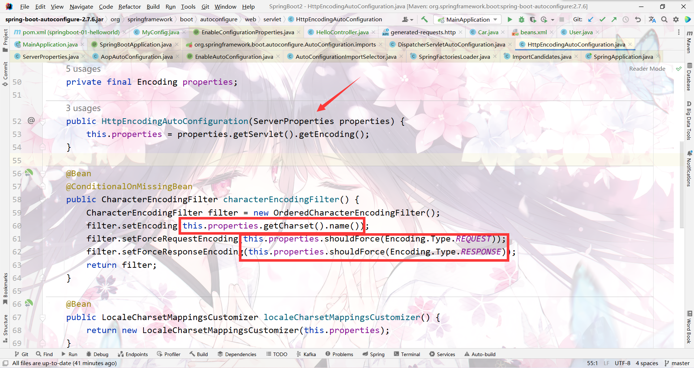
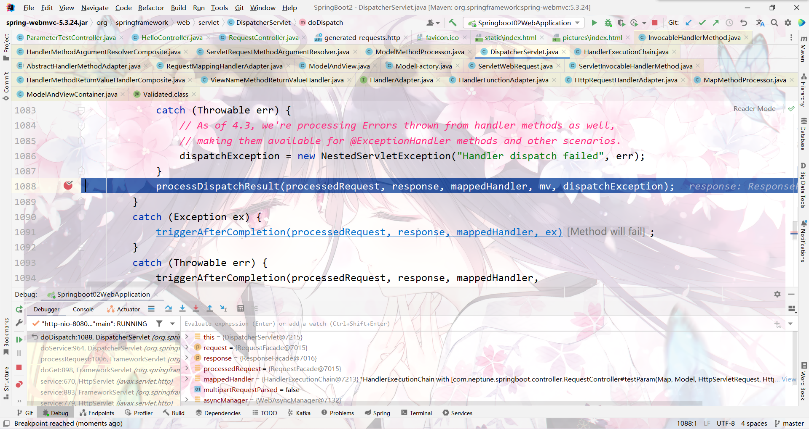
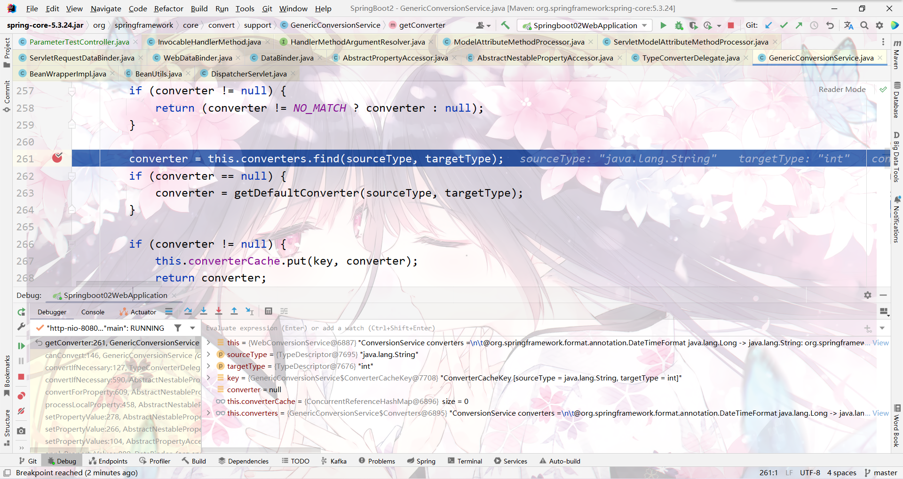

* Windows11
* IDEA 2022.2.3
* Java 8 
* Maven 3.8.5
* springboot2.7

## 1.1 maven配置

```xml
<localRepository>H:\Source\maven-repo</localRepository>

<mirrors>
	<mirror>
		<id>nexus-aliyun</id>
		<mirrorOf>central</mirrorOf>
		<name>Nexus aliyun</name>
		<url>http://maven.aliyun.com/nexus/content/groups/public</url>
	</mirror>
  </mirrors>
 
  <profiles>
	<profile>
	  <id>jdk-1.8</id>
	  <activation>
		<activeByDefault>true</activeByDefault>
		<jdk>1.8</jdk>
	  </activation>
	  <properties>
		<maven.compiler.source>1.8</maven.compiler.source>
		<maven.compiler.target>1.8</maven.compiler.target>
		<maven.compiler.compilerVersion>1.8</maven.compiler.compilerVersion>
	  </properties>
	</profile>
  </profiles>
```
# 2 HelloWorld

需求：浏览发送/hello请求，响应 Hello，Spring Boot 2 
https://docs.spring.io/spring-boot/docs/current/reference/html/index.html【教程】

## 2.1 创建maven工程

选择maven对应的版本3.8.5，仓库，settings，创建maven工程

## 2.2 引入依赖

```xml
<parent>
        <groupId>org.springframework.boot</groupId>
        <artifactId>spring-boot-starter-parent</artifactId>
        <version>2.7.6</version>
    </parent>

    <dependencies>
        <dependency>
            <groupId>org.springframework.boot</groupId>
            <artifactId>spring-boot-starter-web</artifactId>
        </dependency>
    </dependencies>
    
```
## 2.3 创建主程序

主程序固定写法，引导spring boot启动
```java
/**
 * 主程序类
 *
 * @springBootApplication;这是一个SpringBoot应用
 */
@SpringBootApplication
public class MainApplication {

    public static void main(String[] args) {
        SpringApplication.run(MainApplication.class, args);
    }

}
```
## 2.4 编写业务

正常编写业务，无需过多的配置
```java
@RestController
public class HelloController {
    @RequestMapping("/hello")
    public String hello() {
        return "Hello,Spring Boot 2!";
    }
}
```
## 2.5 测试

直接运行main方法


## 2.6 简化配置

application.properties
可以将所有配置写在里面
https://docs.spring.io/spring-boot/docs/current/reference/html/application-properties.html#application-properties.mail【修改属性配置的文档】

```properties
server.port=8888
```


## 2.7 简化部署

springboot插件，自带tomcat环境
```XML
    <build>
        <plugins>
            <plugin>
                <groupId>org.springframework.boot</groupId>
                <artifactId>spring-boot-maven-plugin</artifactId>
            </plugin>
        </plugins>
    </build>
```
将项目打成jar包，直接在目标服务器执行即可
可用cmd命令执行jar包【java -jar boot-01-helloworld-1.0-SNAPSHOT.jar】
注意

* cmd去掉快速编辑模式！【否则点一下就卡住不动】


# 3 了解自动配置的原理
## 3.1 SpringBoot特点

### 3.1.1 依赖管理

* 父项目做依赖管理
```XML
依赖管理
    <parent>
        <groupId>org.springframework.boot</groupId>
        <artifactId>spring-boot-starter-parent</artifactId>
        <version>2.7.6</version>
    </parent>
它的父项目（按住Ctrl 点击spring-boot-starter-parent）
  <parent>
    <groupId>org.springframework.boot</groupId>
    <artifactId>spring-boot-dependencies</artifactId>
    <version>2.7.6</version>
  </parent>
  几乎声明了所有开发中常用的依赖的版本号,自动版本仲裁机制
```
* 开发导入starter场景启动器

```XML
1、见到很多 spring-boot-starter-* ： *就某种场景
2、只要引入starter，这个场景的所有常规需要的依赖我们都自动引入
3、SpringBoot所有支持的场景
https://docs.spring.io/spring-boot/docs/current/reference/html/using-spring-boot.html#using-boot-starter
4、见到的  *-spring-boot-starter： 第三方为我们提供的简化开发的场景启动器。
5、所有场景启动器最底层的依赖
      <dependency>
        <groupId>org.springframework.boot</groupId>
        <artifactId>spring-boot-starter</artifactId>
        <version>2.7.6</version>
        <scope>compile</scope>
      </dependency>
```

查看依赖树


* 无需关注版本号，自动版本仲裁
```XML
1、引入依赖默认都可以不写版本
2、引入非版本仲裁的jar，要写版本号。
```
* 可修改默认版本号
```XML
1、查看spring-boot-dependencies里面规定当前依赖的版本用的 key。
2、在当前项目里面重写配置
    <properties>
        <mysql.version>5.1.43</mysql.version>
    </properties>
```

### 3.1.2 自动配置

- 自动配好Tomcat

  * 引入Tomcat依赖。【引入spring-boot-starter-web时自动引入】

  - 配置Tomcat


- 自动配好SpringMVC

  * 引入SpringMVC全套组件

  - 自动配好SpringMVC常用组件（功能）

  

- 自动配好Web常见功能，如：字符编码问题

  * SpringBoot帮我们配置好了所有web开发的常见场景


- 默认的包结构

  * 主程序所在包及其下面的所有子包里面的组件都会被默认扫描进来

  - 无需以前的包扫描配置

  * 想要改变扫描路径，@SpringBootApplication(scanBasePackages=**"com.neptune"**)
    * 或者@ComponentScan 指定扫描路径


```java
@SpringBootApplication
等同于
@SpringBootConfiguration
@EnableAutoConfiguration
@ComponentScan("com.neptune.springboot")
```


- 各种配置拥有默认值

  * 默认配置最终都是映射到某个类上，如：MultipartProperties

  - 配置文件的值最终会绑定每个类上，这个类会在容器中创建对象

配置文件按住Ctrl可点进去看具体的类，可在容器组件找到。


- ==按需加载==所有自动配置项

  * 非常多的starter

  - 引入了哪些场景这个场景的自动配置才会开启

  * SpringBoot所有的自动配置功能都在 spring-boot-autoconfigure 包里面


- ......

## 3.2 示例

### 3.2.1 实体类

```java
public class Pet {
    private String name;

    public Pet() {
    }

    public Pet(String name) {
        this.name = name;
    }

    public String getName() {
        return name;
    }

    public void setName(String name) {
        this.name = name;
    }

    @Override
    public String toString() {
        return "Pet{" +
                "name='" + name + '\'' +
                '}';
    }
}

```

```java
public class User {
   private String name;

   private int age;

   private Pet pet;

    public User() {
    }

    public User(String name, int age) {
        this.name = name;
        this.age = age;
    }

    public Pet getPet() {
        return pet;
    }

    public void setPet(Pet pet) {
        this.pet = pet;
    }

    public String getName() {
        return name;
    }

    public void setName(String name) {
        this.name = name;
    }

    public int getAge() {
        return age;
    }

    public void setAge(int age) {
        this.age = age;
    }

    @Override
    public String toString() {
        return "User{" +
                "name='" + name + '\'' +
                ", age=" + age +
                ", pet=" + pet +
                '}';
    }
}
```

### 3.2.2 配置文件

```xml
<?xml version="1.0" encoding="UTF-8"?>
<beans xmlns="http://www.springframework.org/schema/beans"
       xmlns:xsi="http://www.w3.org/2001/XMLSchema-instance"
       xsi:schemaLocation="http://www.springframework.org/schema/beans http://www.springframework.org/schema/beans/spring-beans.xsd">
    <bean id="user01" class="com.neptune.springboot.bean.User">
        <property name="name" value="zhangsan"></property>
        <property name="age" value="32"></property>
    </bean>
    <bean id="cat" class="com.neptune.springboot.bean.Pet">
        <property name="name" value="tom"></property>
    </bean>
</beans>
```

### 3.2.3 配置类

```java
package com.neptune.springboot.config;

import com.neptune.springboot.bean.Pet;
import com.neptune.springboot.bean.User;
import org.springframework.context.annotation.Bean;
import org.springframework.context.annotation.Configuration;

@Configuration//告诉Spring boot这是一个配置类
public class MyConfig {

    @Bean //给容器添加组件，以方法名作为组件的id。返回类型就是组件类型。返回的值，就是组件在容器中的实例
    public User user01(){
        return new User("zhangsan",32);
    }

    @Bean("tomcat")//可自定义组件id
    public Pet tom(){
        return new Pet("tom");
    }
}

```


# 2 容器功能

## 2.1 组件添加

### 2.1.1 @Configuration

- 基本使用
- **Full模式与Lite模式**

- 示例
  - 最佳实战
    * 配置类组件之间无依赖关系用Lite模式加速容器启动过程，减少判断
    * 配置类组件之间有依赖关系，方法会被调用得到之前单实例组件，用Full模式


```java
/**
 * 1、配置类里面使用@Bean标注在方法上给容器注册组件，默认也是单实例的对象
 * 2、配置类本身也是组件
 * 3、proxyBeanMethods：代理bean的方法(默认为true)
 *      Full(proxyBeanMethods = true)【保证每个@Bean方法被调用多少次返回的组件都是单实例的】
 *      Lite(proxyBeanMethods = false)【每个@Bean方法被调用多少次返回的组件都是新创建的】
 *      组件依赖必须使用Full模式（默认）。其他默认设为Lite模式
 *      Full启动慢，Lite启动快
 */

@Configuration(proxyBeanMethods=true)//告诉Spring boot这是一个配置类
public class MyConfig {

    /**
     * 外部无论对配置类中的这个组件注册方法调用多少次获取的都是之前注册容器中的单实例
     * @return
     */
    @Bean //给容器添加组件，以方法名作为组件的id。返回类型就是组件类型。返回的值，就是组件在容器中的实例
    public User user01(){
        User user = new User("zhangsan", 32);
        user.setPet(tom());
        return user;
    }

    @Bean("tomcat")//可自定义组件id
    public Pet tom(){
        return new Pet("tom");
    }
}
```

```java
/**
 * 主程序类
 *
 * @springBootApplication;这是一个SpringBoot应用
 */

//@SpringBootApplication
@SpringBootConfiguration
@EnableAutoConfiguration
@ComponentScan("com.neptune.springboot")
public class MainApplication {

    public static void main(String[] args) {

        //1、返回IOC容器
        ConfigurableApplicationContext run = SpringApplication.run(MainApplication.class, args);

        //2、查看容器里的组件
        String[] names = run.getBeanDefinitionNames();
        for (String name : names) {
            System.out.println("name = " + name);
        }

        //3、从容器中获取组件
        Pet tomcat1 = run.getBean("tomcat", Pet.class);
        Pet tomcat2 = run.getBean("tomcat", Pet.class);

        System.out.println("组件："+(tomcat1==tomcat2));//true

        MyConfig bean = run.getBean(MyConfig.class);
        //@configuration( proxyBeanMethods = true)
        //获取到代理对象com.neptune.springboot.config.MyConfig$$EnhancerBySpringCGLIB$$4b8186f7@60baef24

        //@configuration( proxyBeanMethods = false)
        //获取到对象com.neptune.springboot.config.MyConfig@67207d8a
        System.out.println("配置类："+bean);

        //如果@configuration( proxyBeanMethods = true) 就是代理对象调用方法。
        //SpringBoot总会检查这个组件是否在容器中，保持组件单实例

        //如果@configuration( proxyBeanMethods = false)。
        //每次调用组件的方法都会产生新对象
        User user1 = bean.user01();
        User user2 = bean.user01();
        System.out.println("对组件注册方法调用多次：" + (user1==user2));

        //@configuration( proxyBeanMethods = true)
        User user01 = run.getBean("user01", User.class);
        Pet tomcat = run.getBean("tomcat", Pet.class);
        System.out.println("组件调用方法创建的对象与容器对象："+(user01.getPet()==tomcat));//true

    }

}
```

### 2.1.2 @Bean、@Component、@Controller、@Service、@Repository

```java
@Bean：放在方法的上面， 把方法的返回值对象，注入到spring容器中。
@Component:  放在类的上面，创建此类的对象，放入到容器中。 
@Controller: 放在类的上面，创建控制器对象，注入到容器中
@Service ： 放在业务层的实现类上面，创建service对象，注入到容器
@Repository : 放在dao层的实现类上面，创建dao对象，放入到容器。 没有使用这个注解，是因为现在使用MyBatis框     架，  dao对象是MyBatis通过代理生成的。 不需要使用@Repository、 所以没有使用。
```

### 2.1.3 @ComponentScan、@Import

```java
//@SpringBootApplication
@SpringBootConfiguration
@EnableAutoConfiguration
@ComponentScan("com.neptune.springboot") 默认扫描的包就是主程序类所在的包
public class MainApplication {
```

```java
 * 4、@Import({User.class, DBHelper.class})
 *      给容器中自动创建出这两个类型的组件、默认组件的名字就是全类名
 *
 */

@Import({User.class, StaticLoggerBinder.class})
@Configuration(proxyBeanMethods=true)//告诉Spring boot这是一个配置类
public class MyConfig {
```


@Import 高级用法： https://www.bilibili.com/video/BV1gW411W7wy?p=8

### 2.1.4 @Conditional

条件装配：满足Conditional指定的条件，则进行组件注入


**测试条件装配**

```java
//@ConditionalOnBean(name="tomcat")//容器中有tomcat组件时注入整个配置类（包括类中的组件）
@ConditionalOnMissingBean(name="tomcat")//容器中没有tomcat组件时注入整个配置类（包括类中的组件）
@Import({User.class, StaticLoggerBinder.class})
@Configuration(proxyBeanMethods=true)//告诉Spring boot这是一个配置类
public class MyConfig {

    /**
     * 外部无论对配置类中的这个组件注册方法调用多少次获取的都是之前注册容器中的单实例
     * @return
     */
//    @ConditionalOnBean(name="tomcat")//容器中有tomcat组件时注入user01
    @Bean //给容器添加组件，以方法名作为组件的id。返回类型就是组件类型。返回的值，就是组件在容器中的实例
    public User user01(){
        User user = new User("zhangsan", 32);
        user.setPet(tom());
        return user;
    }

    @Bean("tomcat")//可自定义组件id
    public Pet tom(){
        return new Pet("tom");
    }

    @Bean
    public Pet tom22(){
        return new Pet("tom");
    }
}
```

```java
@SpringBootConfiguration
@EnableAutoConfiguration
@ComponentScan("com.neptune.springboot")
public class MainApplication {

    public static void main(String[] args) {

        //1、返回IOC容器
        ConfigurableApplicationContext run = SpringApplication.run(MainApplication.class, args);

        //2、查看容器里的组件
        String[] names = run.getBeanDefinitionNames();
        for (String name : names) {
            System.out.println("name = " + name);
        }


        boolean tomcat = run.containsBean("tomcat");
        System.out.println("容器中是否存在tomcat组件："+tomcat);

        boolean user01 = run.containsBean("user01");
        System.out.println("容器中是否存在user01组件："+user01);

        boolean tom22 = run.containsBean("tom22");
        System.out.println("容器中是否存在tom22组件："+tom22);

        boolean myConfig = run.containsBean("myConfig");
        System.out.println("容器中是否存在myConfig组件："+myConfig);

    }

}
```


## 2.2 原生配置文件引入

### 2.2.1 @ImportResource

```java
@ImportResource ： 加载其他的xml配置文件， 把文件中的对象注入到spring容器中
```

```xml
======================beans.xml=========================
<?xml version="1.0" encoding="UTF-8"?>
<beans xmlns="http://www.springframework.org/schema/beans"
       xmlns:xsi="http://www.w3.org/2001/XMLSchema-instance"
       xmlns:context="http://www.springframework.org/schema/context"
       xsi:schemaLocation="http://www.springframework.org/schema/beans http://www.springframework.org/schema/beans/spring-beans.xsd http://www.springframework.org/schema/context https://www.springframework.org/schema/context/spring-context.xsd">

    <bean id="haha" class="com.atguigu.boot.bean.User">
        <property name="name" value="zhangsan"></property>
        <property name="age" value="18"></property>
    </bean>

    <bean id="hehe" class="com.atguigu.boot.bean.Pet">
        <property name="name" value="tomcat"></property>
    </bean>
</beans>
@ImportResource("classpath:beans.xml")
public class MyConfig {}

======================测试=================
        boolean haha = run.containsBean("haha");
        boolean hehe = run.containsBean("hehe");
        System.out.println("haha："+haha);//true
        System.out.println("hehe："+hehe);//true
```

## 2.3、配置绑定 

如何使用Java读取到properties文件中的内容，并且把它封装到JavaBean中，以供随时使用；

```java
public class getProperties {
     public static void main(String[] args) throws FileNotFoundException, IOException {
         Properties pps = new Properties();
         pps.load(new FileInputStream("a.properties"));
         Enumeration enum1 = pps.propertyNames();//得到配置文件的名字
         while(enum1.hasMoreElements()) {
             String strKey = (String) enum1.nextElement();
             String strValue = pps.getProperty(strKey);
             System.out.println(strKey + "=" + strValue);
             //封装到JavaBean。
         }
     }
 }
```

### 2.3.1 @Component + @ConfigurationProperties

```java
/**
 * 只有在容器中的组件，才会拥有SpringBoot提供的强大功能
 */
@Component
@ConfigurationProperties(prefix = "mycar")
public class Car {

    private String brand;
    private Integer price;

    public String getBrand() {
        return brand;
    }

    public void setBrand(String brand) {
        this.brand = brand;
    }

    public Integer getPrice() {
        return price;
    }

    public void setPrice(Integer price) {
        this.price = price;
    }

    @Override
    public String toString() {
        return "Car{" +
                "brand='" + brand + '\'' +
                ", price=" + price +
                '}';
    }
}
```

### 2、@EnableConfigurationProperties + @ConfigurationProperties

```java
@EnableConfigurationProperties(Car.class)
//1、开启Car配置绑定功能
//2、把这个Car这个组件自动注册到容器中
public class MyConfig {
}

==============================================
    
 //@Component
@ConfigurationProperties(prefix = "mycar")
public class Car {
```

# 3 自动配置原理入门

## 3.1 引导加载自动配置类

```java
@SpringBootConfiguration
@EnableAutoConfiguration
@ComponentScan(excludeFilters = { @Filter(type = FilterType.CUSTOM, classes = TypeExcludeFilter.class),
		@Filter(type = FilterType.CUSTOM, classes = AutoConfigurationExcludeFilter.class) })
public @interface SpringBootApplication{}


======================
    
```

### 3.1.1 @SpringBootConfiguration

@Configuration。代表当前是一个配置类


### 3.1.2 @ComponentScan

指定扫描哪些，Spring注解；

### 3.1.3 @EnableAutoConfiguration

```java
@AutoConfigurationPackage
@Import(AutoConfigurationImportSelector.class)
public @interface EnableAutoConfiguration {}
```

#### 3.1.3.1 @AutoConfigurationPackage

自动配置包？指定了默认的包规则

```java
@Import(AutoConfigurationPackages.Registrar.class)  //给容器中导入一个组件
public @interface AutoConfigurationPackage {}

//利用Registrar给容器中导入一系列组件
//将指定的一个包下的所有组件导入进来 => MainApplication 所在包下。
```


#### 3.1.3.2 @Import(AutoConfigurationImportSelector.class)

```java
1、利用getAutoConfigurationEntry(annotationMetadata);给容器中批量导入一些组件
2、调用List<String> configurations = getCandidateConfigurations(annotationMetadata, attributes)获取到所有需要导入到容器中的配置类
3、利用静态方法public static ImportCandidates load(Class<?> annotation, ClassLoader classLoader)；得到所有的组件
4、从META-INF/spring/%s.imports位置来加载一个文件。
	默认扫描我们当前系统里面所有META-INF/spring/%s.imports位置的文件
    spring-boot-autoconfigure-2.7.6.jar包里面有
    META-INF/spring/org.springframework.boot.autoconfigure.AutoConfiguration.imports
    
```


## 


```properties
#文件里面写死了spring-boot一启动就要给容器中加载的所有配置类
#spring-boot-autoconfigure-2.7.6.jar/META-INF/spring/org.springframework.boot.autoconfigure.AutoConfiguration.imports

org.springframework.boot.autoconfigure.admin.SpringApplicationAdminJmxAutoConfiguration
org.springframework.boot.autoconfigure.aop.AopAutoConfiguration
org.springframework.boot.autoconfigure.amqp.RabbitAutoConfiguration
org.springframework.boot.autoconfigure.batch.BatchAutoConfiguration
org.springframework.boot.autoconfigure.cache.CacheAutoConfiguration
org.springframework.boot.autoconfigure.cassandra.CassandraAutoConfiguration
org.springframework.boot.autoconfigure.context.ConfigurationPropertiesAutoConfiguration
org.springframework.boot.autoconfigure.context.LifecycleAutoConfiguration
org.springframework.boot.autoconfigure.context.MessageSourceAutoConfiguration
org.springframework.boot.autoconfigure.context.PropertyPlaceholderAutoConfiguration
org.springframework.boot.autoconfigure.couchbase.CouchbaseAutoConfiguration
org.springframework.boot.autoconfigure.dao.PersistenceExceptionTranslationAutoConfiguration
org.springframework.boot.autoconfigure.data.cassandra.CassandraDataAutoConfiguration
org.springframework.boot.autoconfigure.data.cassandra.CassandraReactiveDataAutoConfiguration
org.springframework.boot.autoconfigure.data.cassandra.CassandraReactiveRepositoriesAutoConfiguration
org.springframework.boot.autoconfigure.data.cassandra.CassandraRepositoriesAutoConfiguration
org.springframework.boot.autoconfigure.data.couchbase.CouchbaseDataAutoConfiguration
org.springframework.boot.autoconfigure.data.couchbase.CouchbaseReactiveDataAutoConfiguration
org.springframework.boot.autoconfigure.data.couchbase.CouchbaseReactiveRepositoriesAutoConfiguration
org.springframework.boot.autoconfigure.data.couchbase.CouchbaseRepositoriesAutoConfiguration
org.springframework.boot.autoconfigure.data.elasticsearch.ElasticsearchDataAutoConfiguration
org.springframework.boot.autoconfigure.data.elasticsearch.ElasticsearchRepositoriesAutoConfiguration
org.springframework.boot.autoconfigure.data.elasticsearch.ReactiveElasticsearchRepositoriesAutoConfiguration
org.springframework.boot.autoconfigure.data.elasticsearch.ReactiveElasticsearchRestClientAutoConfiguration
org.springframework.boot.autoconfigure.data.jdbc.JdbcRepositoriesAutoConfiguration
org.springframework.boot.autoconfigure.data.jpa.JpaRepositoriesAutoConfiguration
org.springframework.boot.autoconfigure.data.ldap.LdapRepositoriesAutoConfiguration
org.springframework.boot.autoconfigure.data.mongo.MongoDataAutoConfiguration
org.springframework.boot.autoconfigure.data.mongo.MongoReactiveDataAutoConfiguration
org.springframework.boot.autoconfigure.data.mongo.MongoReactiveRepositoriesAutoConfiguration
org.springframework.boot.autoconfigure.data.mongo.MongoRepositoriesAutoConfiguration
org.springframework.boot.autoconfigure.data.neo4j.Neo4jDataAutoConfiguration
org.springframework.boot.autoconfigure.data.neo4j.Neo4jReactiveDataAutoConfiguration
org.springframework.boot.autoconfigure.data.neo4j.Neo4jReactiveRepositoriesAutoConfiguration
org.springframework.boot.autoconfigure.data.neo4j.Neo4jRepositoriesAutoConfiguration
org.springframework.boot.autoconfigure.data.r2dbc.R2dbcDataAutoConfiguration
org.springframework.boot.autoconfigure.data.r2dbc.R2dbcRepositoriesAutoConfiguration
org.springframework.boot.autoconfigure.data.redis.RedisAutoConfiguration
org.springframework.boot.autoconfigure.data.redis.RedisReactiveAutoConfiguration
org.springframework.boot.autoconfigure.data.redis.RedisRepositoriesAutoConfiguration
org.springframework.boot.autoconfigure.data.rest.RepositoryRestMvcAutoConfiguration
org.springframework.boot.autoconfigure.data.web.SpringDataWebAutoConfiguration
org.springframework.boot.autoconfigure.elasticsearch.ElasticsearchRestClientAutoConfiguration
org.springframework.boot.autoconfigure.flyway.FlywayAutoConfiguration
org.springframework.boot.autoconfigure.freemarker.FreeMarkerAutoConfiguration
org.springframework.boot.autoconfigure.graphql.GraphQlAutoConfiguration
org.springframework.boot.autoconfigure.graphql.data.GraphQlReactiveQueryByExampleAutoConfiguration
org.springframework.boot.autoconfigure.graphql.data.GraphQlReactiveQuerydslAutoConfiguration
org.springframework.boot.autoconfigure.graphql.data.GraphQlQueryByExampleAutoConfiguration
org.springframework.boot.autoconfigure.graphql.data.GraphQlQuerydslAutoConfiguration
org.springframework.boot.autoconfigure.graphql.reactive.GraphQlWebFluxAutoConfiguration
org.springframework.boot.autoconfigure.graphql.rsocket.GraphQlRSocketAutoConfiguration
org.springframework.boot.autoconfigure.graphql.rsocket.RSocketGraphQlClientAutoConfiguration
org.springframework.boot.autoconfigure.graphql.security.GraphQlWebFluxSecurityAutoConfiguration
org.springframework.boot.autoconfigure.graphql.security.GraphQlWebMvcSecurityAutoConfiguration
org.springframework.boot.autoconfigure.graphql.servlet.GraphQlWebMvcAutoConfiguration
org.springframework.boot.autoconfigure.groovy.template.GroovyTemplateAutoConfiguration
org.springframework.boot.autoconfigure.gson.GsonAutoConfiguration
org.springframework.boot.autoconfigure.h2.H2ConsoleAutoConfiguration
org.springframework.boot.autoconfigure.hateoas.HypermediaAutoConfiguration
org.springframework.boot.autoconfigure.hazelcast.HazelcastAutoConfiguration
org.springframework.boot.autoconfigure.hazelcast.HazelcastJpaDependencyAutoConfiguration
org.springframework.boot.autoconfigure.http.HttpMessageConvertersAutoConfiguration
org.springframework.boot.autoconfigure.http.codec.CodecsAutoConfiguration
org.springframework.boot.autoconfigure.influx.InfluxDbAutoConfiguration
org.springframework.boot.autoconfigure.info.ProjectInfoAutoConfiguration
org.springframework.boot.autoconfigure.integration.IntegrationAutoConfiguration
org.springframework.boot.autoconfigure.jackson.JacksonAutoConfiguration
org.springframework.boot.autoconfigure.jdbc.DataSourceAutoConfiguration
org.springframework.boot.autoconfigure.jdbc.JdbcTemplateAutoConfiguration
org.springframework.boot.autoconfigure.jdbc.JndiDataSourceAutoConfiguration
org.springframework.boot.autoconfigure.jdbc.XADataSourceAutoConfiguration
org.springframework.boot.autoconfigure.jdbc.DataSourceTransactionManagerAutoConfiguration
org.springframework.boot.autoconfigure.jms.JmsAutoConfiguration
org.springframework.boot.autoconfigure.jmx.JmxAutoConfiguration
org.springframework.boot.autoconfigure.jms.JndiConnectionFactoryAutoConfiguration
org.springframework.boot.autoconfigure.jms.activemq.ActiveMQAutoConfiguration
org.springframework.boot.autoconfigure.jms.artemis.ArtemisAutoConfiguration
org.springframework.boot.autoconfigure.jersey.JerseyAutoConfiguration
org.springframework.boot.autoconfigure.jooq.JooqAutoConfiguration
org.springframework.boot.autoconfigure.jsonb.JsonbAutoConfiguration
org.springframework.boot.autoconfigure.kafka.KafkaAutoConfiguration
org.springframework.boot.autoconfigure.availability.ApplicationAvailabilityAutoConfiguration
org.springframework.boot.autoconfigure.ldap.embedded.EmbeddedLdapAutoConfiguration
org.springframework.boot.autoconfigure.ldap.LdapAutoConfiguration
org.springframework.boot.autoconfigure.liquibase.LiquibaseAutoConfiguration
org.springframework.boot.autoconfigure.mail.MailSenderAutoConfiguration
org.springframework.boot.autoconfigure.mail.MailSenderValidatorAutoConfiguration
org.springframework.boot.autoconfigure.mongo.embedded.EmbeddedMongoAutoConfiguration
org.springframework.boot.autoconfigure.mongo.MongoAutoConfiguration
org.springframework.boot.autoconfigure.mongo.MongoReactiveAutoConfiguration
org.springframework.boot.autoconfigure.mustache.MustacheAutoConfiguration
org.springframework.boot.autoconfigure.neo4j.Neo4jAutoConfiguration
org.springframework.boot.autoconfigure.netty.NettyAutoConfiguration
org.springframework.boot.autoconfigure.orm.jpa.HibernateJpaAutoConfiguration
org.springframework.boot.autoconfigure.quartz.QuartzAutoConfiguration
org.springframework.boot.autoconfigure.r2dbc.R2dbcAutoConfiguration
org.springframework.boot.autoconfigure.r2dbc.R2dbcTransactionManagerAutoConfiguration
org.springframework.boot.autoconfigure.rsocket.RSocketMessagingAutoConfiguration
org.springframework.boot.autoconfigure.rsocket.RSocketRequesterAutoConfiguration
org.springframework.boot.autoconfigure.rsocket.RSocketServerAutoConfiguration
org.springframework.boot.autoconfigure.rsocket.RSocketStrategiesAutoConfiguration
org.springframework.boot.autoconfigure.security.servlet.SecurityAutoConfiguration
org.springframework.boot.autoconfigure.security.servlet.UserDetailsServiceAutoConfiguration
org.springframework.boot.autoconfigure.security.servlet.SecurityFilterAutoConfiguration
org.springframework.boot.autoconfigure.security.reactive.ReactiveSecurityAutoConfiguration
org.springframework.boot.autoconfigure.security.reactive.ReactiveUserDetailsServiceAutoConfiguration
org.springframework.boot.autoconfigure.security.rsocket.RSocketSecurityAutoConfiguration
org.springframework.boot.autoconfigure.security.saml2.Saml2RelyingPartyAutoConfiguration
org.springframework.boot.autoconfigure.sendgrid.SendGridAutoConfiguration
org.springframework.boot.autoconfigure.session.SessionAutoConfiguration
org.springframework.boot.autoconfigure.security.oauth2.client.servlet.OAuth2ClientAutoConfiguration
org.springframework.boot.autoconfigure.security.oauth2.client.reactive.ReactiveOAuth2ClientAutoConfiguration
org.springframework.boot.autoconfigure.security.oauth2.resource.servlet.OAuth2ResourceServerAutoConfiguration
org.springframework.boot.autoconfigure.security.oauth2.resource.reactive.ReactiveOAuth2ResourceServerAutoConfiguration
org.springframework.boot.autoconfigure.solr.SolrAutoConfiguration
org.springframework.boot.autoconfigure.sql.init.SqlInitializationAutoConfiguration
org.springframework.boot.autoconfigure.task.TaskExecutionAutoConfiguration
org.springframework.boot.autoconfigure.task.TaskSchedulingAutoConfiguration
org.springframework.boot.autoconfigure.thymeleaf.ThymeleafAutoConfiguration
org.springframework.boot.autoconfigure.transaction.TransactionAutoConfiguration
org.springframework.boot.autoconfigure.transaction.jta.JtaAutoConfiguration
org.springframework.boot.autoconfigure.validation.ValidationAutoConfiguration
org.springframework.boot.autoconfigure.web.client.RestTemplateAutoConfiguration
org.springframework.boot.autoconfigure.web.embedded.EmbeddedWebServerFactoryCustomizerAutoConfiguration
org.springframework.boot.autoconfigure.web.reactive.HttpHandlerAutoConfiguration
org.springframework.boot.autoconfigure.web.reactive.ReactiveMultipartAutoConfiguration
org.springframework.boot.autoconfigure.web.reactive.ReactiveWebServerFactoryAutoConfiguration
org.springframework.boot.autoconfigure.web.reactive.WebFluxAutoConfiguration
org.springframework.boot.autoconfigure.web.reactive.WebSessionIdResolverAutoConfiguration
org.springframework.boot.autoconfigure.web.reactive.error.ErrorWebFluxAutoConfiguration
org.springframework.boot.autoconfigure.web.reactive.function.client.ClientHttpConnectorAutoConfiguration
org.springframework.boot.autoconfigure.web.reactive.function.client.WebClientAutoConfiguration
org.springframework.boot.autoconfigure.web.servlet.DispatcherServletAutoConfiguration
org.springframework.boot.autoconfigure.web.servlet.ServletWebServerFactoryAutoConfiguration
org.springframework.boot.autoconfigure.web.servlet.error.ErrorMvcAutoConfiguration
org.springframework.boot.autoconfigure.web.servlet.HttpEncodingAutoConfiguration
org.springframework.boot.autoconfigure.web.servlet.MultipartAutoConfiguration
org.springframework.boot.autoconfigure.web.servlet.WebMvcAutoConfiguration
org.springframework.boot.autoconfigure.websocket.reactive.WebSocketReactiveAutoConfiguration
org.springframework.boot.autoconfigure.websocket.servlet.WebSocketServletAutoConfiguration
org.springframework.boot.autoconfigure.websocket.servlet.WebSocketMessagingAutoConfiguration
org.springframework.boot.autoconfigure.webservices.WebServicesAutoConfiguration
org.springframework.boot.autoconfigure.webservices.client.WebServiceTemplateAutoConfiguration
```

## 3.2 按需开启自动配置项

```java
虽然我们144个场景的所有自动配置启动的时候默认全部加载。xxxxAutoConfiguration
按照条件装配规则（@Conditional），最终会按需配置。
```


## 3.3 修改默认配置

**修改用户自己注册的组件名称（bean重命名）**

```java
        @Bean
		@ConditionalOnBean(MultipartResolver.class)  //容器中有这个类型组件
		@ConditionalOnMissingBean(name = DispatcherServlet.MULTIPART_RESOLVER_BEAN_NAME) //容器中没有这个名字 multipartResolver 的组件
		public MultipartResolver multipartResolver(MultipartResolver resolver) {
            //给@Bean标注的方法传入了对象参数，这个参数的值就会从容器中找。
            //SpringMVC multipartResolver。防止有些用户配置的文件上传解析器不符合规范
			// Detect if the user has created a MultipartResolver but named it incorrectly
			return resolver;
		}
给容器中加入了文件上传解析器；
```

SpringBoot默认会在底层配好所有的组件。但是如果用户自己配置了以用户的优先

```java
@Bean
	@ConditionalOnMissingBean
	public CharacterEncodingFilter characterEncodingFilter() {
    }
```




总结：

- SpringBoot先加载所有的自动配置类  xxxxxAutoConfiguration

- 每个自动配置类按照条件进行生效，默认都会绑定配置文件指定的值。xxxxProperties里面拿。xxxProperties和配置文件进行了绑定

- 生效的配置类就会给容器中装配很多组件

- 只要容器中有这些组件，相当于这些功能就有了

- 定制化配置

  * 用户直接自己@Bean替换底层的组件

  - 用户去看这个组件是获取的配置文件什么值就去修改。

==xxxxxAutoConfiguration ➡ 组件  ➡ xxxxProperties里面拿值  ➡ application.properties==

## 3.4 最佳实践

- 引入场景依赖

  * https://docs.spring.io/spring-boot/docs/current/reference/html/using-spring-boot.html#using-boot-starter

- 查看自动配置了哪些（选做）

  * 自己分析，引入场景对应的自动配置一般都生效了（pom文件引入的依赖）

  - 配置文件中debug=true开启自动配置报告。Negative（不生效）\Positive（生效）


- 是否需要修改

  * 参照文档修改配置项
    * https://docs.spring.io/spring-boot/docs/current/reference/html/appendix-application-properties.html#common-application-properties
    * 自己分析。xxxxProperties绑定了配置文件的哪些。

  如：更换spring启动图标

  

  * 自定义加入或者替换组件

    * @Bean、@Component。。。
  * 自定义器  **XXXXXCustomizer**；

  

  * ......


# 4 开发小技巧

## 4.1 Lombok

简化JavaBean开发

```xml
        <dependency>
            <groupId>org.projectlombok</groupId>
            <artifactId>lombok</artifactId>
        </dependency>
```

```java
idea中搜索安装lombok插件
===============================简化JavaBean开发===================================
@NoArgsConstructor//无参构造器
//@AllArgsConstructor//全参构造器
@Data//setter and getter
@ToString//toString
@EqualsAndHashCode//hashcode
public class User {
    private String name;

    private int age;

    private Pet pet;

    public User(String name, int age) {
        this.name = name;
        this.age = age;
    }
}

================================简化日志开发===================================
@Slf4j
@RestController
public class HelloController {
    @RequestMapping("/hello")
    public String handle01(@RequestParam("name") String name){
        
        log.info("请求进来了....");
        
        return "Hello, Spring Boot 2!"+"你好："+name;
    }
}
```

## 4.2 dev-tools

```xml
        <dependency>
            <groupId>org.springframework.boot</groupId>
            <artifactId>spring-boot-devtools</artifactId>
            <optional>true</optional>
        </dependency>
```

项目或者页面修改以后：Ctrl+F9；


## 4.3 Spring Initailizr（项目初始化向导）

# 5 配置文件

==*优先级：properties>yml>yaml*==

==使用yml文件可以避免中文乱码==

## 5.1 文件类型

### 5.1.1 properties

同以前的properties用法

### 5.1.2 yaml

#### 5.1.2.1 简介

YAML 是 "YAML Ain't Markup Language"（YAML 不是一种标记语言）的递归缩写。在开发的这种语言时，YAML 的意思其实是："Yet Another Markup Language"（仍是一种标记语言）。 

非常适合用来做以数据为中心的配置文件

#### 5.1.2.2 基本语法

- key: value；kv之间有空格
- 大小写敏感
- 使用缩进表示层级关系
- 缩进不允许使用tab，只允许空格
- 缩进的空格数不重要，只要相同层级的元素左对齐即可
- '#'表示注释
- 字符串无需加引号，如果要加，''与""表示字符串内容 会被 转义/不转义

#### 5.1.2.3 数据类型

- 字面量：单个的、不可再分的值。date、boolean、string、number、null

```yaml
k: v
```

- 对象：键值对的集合。map、hash、set、object 

```yaml
行内写法：  k: {k1:v1,k2:v2,k3:v3}
#或
k: 
  k1: v1
  k2: v2
  k3: v3
```

- 数组：一组按次序排列的值。array、list、queue

```yaml
行内写法：  k: [v1,v2,v3]
#或者
k:
 - v1
 - v2
 - v3
```

#### 5.1.2.4 示例

```java
@Data
public class Person {
	
	private String userName;
	private Boolean boss;
	private Date birth;
	private Integer age;
	private Pet pet;
	private String[] interests;
	private List<String> animal;
	private Map<String, Object> score;
	private Set<Double> salarys;
	private Map<String, List<Pet>> allPets;
}

@Data
public class Pet {
	private String name;
	private Double weight;
}
```

```yaml
# yaml表示以上对象
person:
  userName: zhangsan
  boss: false
  birth: 2019/12/12 20:12:33
  age: 18
  pet: 
    name: tomcat
    weight: 23.4
  interests: [篮球,游泳]
  animal: 
    - jerry
    - mario
  score:
    english: 
      first: 30
      second: 40
      third: 50
    math: [131,140,148]
    chinese: {first: 128,second: 136}
  salarys: [3999,4999.98,5999.99]
  allPets:
    sick:
      - {name: tom}
      - {name: jerry,weight: 47}
    health: [{name: mario,weight: 47}]
```

## 5.2 配置提示

自定义的类和配置文件绑定一般没有提示。

```xml
        <dependency>
            <groupId>org.springframework.boot</groupId>
            <artifactId>spring-boot-configuration-processor</artifactId>
            <optional>true</optional>
        </dependency>


打包时排除spring-boot-configuration-processor
 <build>
        <plugins>
            <plugin>
                <groupId>org.springframework.boot</groupId>
                <artifactId>spring-boot-maven-plugin</artifactId>
                <configuration>
                    <excludes>
                        <exclude>
                            <groupId>org.springframework.boot</groupId>
                            <artifactId>spring-boot-configuration-processor</artifactId>
                        </exclude>
                    </excludes>
                </configuration>
            </plugin>
        </plugins>
    </build>
```

# 6 Web开发


## 6.1 SpringMVC自动配置概览

Spring Boot provides auto-configuration for Spring MVC that **works well with most applications.(大多场景我们都无需自定义配置)**

The auto-configuration adds the following features on top of Spring’s defaults:

- Inclusion of `ContentNegotiatingViewResolver` and `BeanNameViewResolver` beans.

- - 内容协商视图解析器和BeanName视图解析器

- Support for serving static resources, including support for WebJars (covered [later in this document](https://docs.spring.io/spring-boot/docs/current/reference/html/spring-boot-features.html#boot-features-spring-mvc-static-content))).

- - 静态资源（包括webjars）

- Automatic registration of `Converter`, `GenericConverter`, and `Formatter` beans.

- - 自动注册 `Converter，GenericConverter，Formatter `

- Support for `HttpMessageConverters` (covered [later in this document](https://docs.spring.io/spring-boot/docs/current/reference/html/spring-boot-features.html#boot-features-spring-mvc-message-converters)).

- - 支持 `HttpMessageConverters` （后来我们配合内容协商理解原理）

- Automatic registration of `MessageCodesResolver` (covered [later in this document](https://docs.spring.io/spring-boot/docs/current/reference/html/spring-boot-features.html#boot-features-spring-message-codes)).

- - 自动注册 `MessageCodesResolver` （国际化用）

- Static `index.html` support.

- - 静态index.html 页支持

- Custom `Favicon` support (covered [later in this document](https://docs.spring.io/spring-boot/docs/current/reference/html/spring-boot-features.html#boot-features-spring-mvc-favicon)).

- - 自定义 `Favicon`  

- Automatic use of a `ConfigurableWebBindingInitializer` bean (covered [later in this document](https://docs.spring.io/spring-boot/docs/current/reference/html/spring-boot-features.html#boot-features-spring-mvc-web-binding-initializer)).

- - 自动使用 `ConfigurableWebBindingInitializer` ，（DataBinder负责将请求数据绑定到JavaBean上）

If you want to keep those Spring Boot MVC customizations and make more [MVC customizations](https://docs.spring.io/spring/docs/5.2.9.RELEASE/spring-framework-reference/web.html#mvc) (interceptors, formatters, view controllers, and other features), you can add your own `@Configuration` class of type `WebMvcConfigurer` but **without** `@EnableWebMvc`.

**不用@EnableWebMvc注解。使用** `@Configuration` **+** `WebMvcConfigurer` **自定义规则**


If you want to provide custom instances of `RequestMappingHandlerMapping`, `RequestMappingHandlerAdapter`, or `ExceptionHandlerExceptionResolver`, and still keep the Spring Boot MVC customizations, you can declare a bean of type `WebMvcRegistrations` and use it to provide custom instances of those components.

**声明** `WebMvcRegistrations` **改变默认底层组件**


If you want to take complete control of Spring MVC, you can add your own `@Configuration` annotated with `@EnableWebMvc`, or alternatively add your own `@Configuration`-annotated `DelegatingWebMvcConfiguration` as described in the Javadoc of `@EnableWebMvc`.

**使用** `@EnableWebMvc+@Configuration+DelegatingWebMvcConfiguration 全面接管SpringMVC`

## 6.2 简单功能分析


### 6.2.1 静态资源访问

#### 6.2.1.1 静态资源目录

只要静态资源放在类路径下： called `/static` (or `/public` or `/resources` or `/META-INF/resources`


访问 ： 当前项目根路径/ + 静态资源名 


原理： 静态映射/**。

请求进来，先去找Controller看能不能处理。不能处理的所有请求又都交给静态资源处理器。静态资源也找不到则响应404页面


改变默认的静态资源路径

```yaml
spring:
  mvc:
    static-path-pattern: /res/**

  resources:
    static-locations: [classpath:/haha/]
```


#### 6.2.1.2 静态资源访问前缀

默认无前缀

```yaml
spring:
  mvc:
    static-path-pattern: /res/**
```

当前项目 + static-path-pattern + 静态资源名 = 静态资源文件夹下找

#### 6.2.1.3 webjar

自动映射 /[webjars](http://localhost:8080/webjars/jquery/3.5.1/jquery.js)/**

https://www.webjars.org/

```xml
        <dependency>
            <groupId>org.webjars</groupId>
            <artifactId>jquery</artifactId>
            <version>3.5.1</version>
        </dependency>
```

访问地址：[http://localhost:8080/webjars/**jquery/3.5.1/jquery.js**](http://localhost:8080/webjars/jquery/3.5.1/jquery.js)   后面地址要按照依赖里面的包路径


### 6.2.2 欢迎页支持

- 静态资源路径下  index.html

  * 可以配置静态资源路径

  - 但是不可以配置静态资源的访问前缀。否则导致 index.html不能被默认访问


```yaml
spring:
#  mvc:
#    static-path-pattern: /res/**	这个会导致welcome page功能失效
  web:
    resources:
      static-locations: [classpath:/pictures/]
```

- controller能处理/index


### 6.2.3 自定义 `Favicon`

浏览器显示不出来时,由于缓存问题，按Ctrl+F5 强制刷新屏幕。（以后遇到很多浏览器问题，在代码没有问题的情况下，通过强制刷新浏览器都可能会很有效）

favicon.ico 放在静态资源目录下即可。

```yaml
spring:
#  mvc:
#    static-path-pattern: /res/**   这个会导致 Favicon 功能失效
```


### 6.2.4 静态资源配置原理

- SpringBoot启动默认加载  xxxAutoConfiguration 类（自动配置类）
- SpringMVC功能的自动配置类 WebMvcAutoConfiguration，生效

```java
@SuppressWarnings("deprecation")
@AutoConfiguration(after = { DispatcherServletAutoConfiguration.class, TaskExecutionAutoConfiguration.class,
		ValidationAutoConfiguration.class })
@ConditionalOnWebApplication(type = Type.SERVLET)
@ConditionalOnClass({ Servlet.class, DispatcherServlet.class, WebMvcConfigurer.class })
@ConditionalOnMissingBean(WebMvcConfigurationSupport.class)
@AutoConfigureOrder(Ordered.HIGHEST_PRECEDENCE + 10)
public class WebMvcAutoConfiguration {}

===================================================
@ConfigurationProperties(prefix = "spring.mvc")
public class WebMvcProperties {}

================================================
@ConfigurationProperties("spring.web")
public class WebProperties {}
```

- 给容器中配了什么。

```java
	@SuppressWarnings("deprecation")
	@Configuration(proxyBeanMethods = false)
	@Import(EnableWebMvcConfiguration.class)
	@EnableConfigurationProperties({ WebMvcProperties.class, WebProperties.class })
	@Order(0)
	public static class WebMvcAutoConfigurationAdapter implements WebMvcConfigurer, ServletContextAware {}
```

- 配置文件的相关属性和xxx进行了绑定。WebMvcProperties **spring.mvc**、WebProperties **spring.web**

#### 6.2.4.1 配置类只有一个有参构造器

```java
	//有参构造器所有参数的值都会从容器中确定
//WebProperties webProperties；获取和spring.web绑定的所有的值的对象
//WebMvcProperties mvcProperties 获取和spring.mvc绑定的所有的值的对象
//ListableBeanFactory beanFactory Spring的beanFactory
//HttpMessageConverters 找到所有的HttpMessageConverters
//ResourceHandlerRegistrationCustomizer 找到 资源处理器的自定义器。=========
//DispatcherServletPath  
//ServletRegistrationBean   给应用注册Servlet、Filter....
		public WebMvcAutoConfigurationAdapter(WebProperties webProperties, WebMvcProperties mvcProperties,
				ListableBeanFactory beanFactory, ObjectProvider<HttpMessageConverters> messageConvertersProvider,
				ObjectProvider<ResourceHandlerRegistrationCustomizer> resourceHandlerRegistrationCustomizerProvider,
				ObjectProvider<DispatcherServletPath> dispatcherServletPath,
				ObjectProvider<ServletRegistrationBean<?>> servletRegistrations) {
			this.resourceProperties = webProperties.getResources();
			this.mvcProperties = mvcProperties;
			this.beanFactory = beanFactory;
			this.messageConvertersProvider = messageConvertersProvider;
			this.resourceHandlerRegistrationCustomizer = resourceHandlerRegistrationCustomizerProvider.getIfAvailable();
			this.dispatcherServletPath = dispatcherServletPath;
			this.servletRegistrations = servletRegistrations;
			this.mvcProperties.checkConfiguration();
		}
```

#### 6.2.4.2 资源处理的默认规则

```java
		@Override
		public void addResourceHandlers(ResourceHandlerRegistry registry) {
			if (!this.resourceProperties.isAddMappings()) {
				logger.debug("Default resource handling disabled");
				return;
			}
			addResourceHandler(registry, "/webjars/**", "classpath:/META-INF/resources/webjars/");
			addResourceHandler(registry, this.mvcProperties.getStaticPathPattern(), (registration) -> {
				registration.addResourceLocations(this.resourceProperties.getStaticLocations());
				if (this.servletContext != null) {
					ServletContextResource resource = new ServletContextResource(this.servletContext, SERVLET_LOCATION);
					registration.addResourceLocations(resource);
				}
			});
		}
```

```yaml
spring:
  web:
    resources:
      add-mappings: false	禁用所有静态资源规则
```

```java
	public static class Resources {

		private static final String[] CLASSPATH_RESOURCE_LOCATIONS = { "classpath:/META-INF/resources/",
				"classpath:/resources/", "classpath:/static/", "classpath:/public/" };

		/**
		 * Locations of static resources. Defaults to classpath:[/META-INF/resources/,
		 * /resources/, /static/, /public/].
		 */
		private String[] staticLocations = CLASSPATH_RESOURCE_LOCATIONS;
```

#### 6.2.4.3 欢迎页的处理规则

```java
	HandlerMapping：处理器映射。保存了每一个Handler能处理哪些请求。	
		@Bean
		public WelcomePageHandlerMapping welcomePageHandlerMapping(ApplicationContext applicationContext,
				FormattingConversionService mvcConversionService, ResourceUrlProvider mvcResourceUrlProvider) {
			WelcomePageHandlerMapping welcomePageHandlerMapping = new WelcomePageHandlerMapping(
					new TemplateAvailabilityProviders(applicationContext), applicationContext, getWelcomePage(),
					this.mvcProperties.getStaticPathPattern());
			welcomePageHandlerMapping.setInterceptors(getInterceptors(mvcConversionService, mvcResourceUrlProvider));
			welcomePageHandlerMapping.setCorsConfigurations(getCorsConfigurations());
			return welcomePageHandlerMapping;
		}
```

```java
	WelcomePageHandlerMapping(TemplateAvailabilityProviders templateAvailabilityProviders,
			ApplicationContext applicationContext, Resource welcomePage, String staticPathPattern) {
		if (welcomePage != null && "/**".equals(staticPathPattern)) {
            	    //要用欢迎页功能，必须是/**
			logger.info("Adding welcome page: " + welcomePage);
			setRootViewName("forward:index.html");
		}
		else if (welcomeTemplateExists(templateAvailabilityProviders, applicationContext)) {
            	    // 调用Controller  /index
			logger.info("Adding welcome page template: index");
			setRootViewName("index");
		}
	}

================
    	private void setRootViewName(String viewName) {
		ParameterizableViewController controller = new ParameterizableViewController();
		controller.setViewName(viewName);
		setRootHandler(controller);
		setOrder(2);
	}
```

#### 6.2.4.4 favicon

浏览器会自动发送/favicon.ico请求获取到图标，整个session期间不再获取

## 6.3 请求参数处理

### 6.3.1 请求映射

#### 6.3.1.1 rest使用与原理

- @xxxMapping；
- Rest风格支持（*使用**HTTP**请求方式动词来表示对资源的操作*）

  * *以前：/getUser*  *获取用户*    */deleteUser* *删除用户*   */editUser*  *修改用户*      */saveUser* *保存用户*

  - *现在： /user*    *GET-获取用户*    *DELETE-删除用户*     *PUT-修改用户*      *POST-保存用户*
  - 核心Filter；HiddenHttpMethodFilter
    * 用法： 表单method=post，隐藏域 _method=put
    * SpringBoot中手动开启

  * 扩展：如何把_method 这个名字换成我们自己喜欢的。


```java
    @RequestMapping(value = "/user",method = RequestMethod.GET)
    public String getUser(){
        return "GET-张三";
    }

    @RequestMapping(value = "/user",method = RequestMethod.POST)
    public String saveUser(){
        return "POST-张三";
    }


    @RequestMapping(value = "/user",method = RequestMethod.PUT)
    public String putUser(){
        return "PUT-张三";
    }

    @RequestMapping(value = "/user",method = RequestMethod.DELETE)
    public String deleteUser(){
        return "DELETE-张三";
    }


	@Bean
	@ConditionalOnMissingBean(HiddenHttpMethodFilter.class)
	@ConditionalOnProperty(prefix = "spring.mvc.hiddenmethod.filter", name = "enabled", matchIfMissing = false)
	public OrderedHiddenHttpMethodFilter hiddenHttpMethodFilter() {
		return new OrderedHiddenHttpMethodFilter();
	}


//自定义filter
    @Bean
    public HiddenHttpMethodFilter hiddenHttpMethodFilter(){
        HiddenHttpMethodFilter methodFilter = new HiddenHttpMethodFilter();
        methodFilter.setMethodParam("_m");
        return methodFilter;
    }
```

Rest原理（表单提交要使用REST的时候）

- 表单提交会带上**_method=DELETE**
- **请求过来被**HiddenHttpMethodFilter拦截
  * 请求是否正常，并且是POST
    * 获取到**_method**的值。
    * 兼容以下请求；**PUT**.**DELETE**.**PATCH**
    * **原生request（post），包装模式requesWrapper重写了getMethod方法，返回的是传入的值。**
    * **过滤器链放行的时候用wrapper。以后的方法调用getMethod是调用requesWrapper的。**


**Rest使用客户端工具，**

- 如PostMan直接发送Put、delete等方式请求，无需Filter。

```yaml
spring:
  mvc:
    hiddenmethod:
      filter:
        enabled: true   #开启页面表单的Rest功能
```

#### 6.3.1.2 请求映射原理

SpringMVC的`DispatcherServlet`是处理所有请求的开始


SpringMVC功能分析都从 org.springframework.web.servlet.DispatcherServlet -> doDispatch（）

```java
protected void doDispatch(HttpServletRequest request, HttpServletResponse response) throws Exception {
		HttpServletRequest processedRequest = request;
		HandlerExecutionChain mappedHandler = null;
		boolean multipartRequestParsed = false;

		WebAsyncManager asyncManager = WebAsyncUtils.getAsyncManager(request);

		try {
			ModelAndView mv = null;
			Exception dispatchException = null;

			try {
				processedRequest = checkMultipart(request);
				multipartRequestParsed = (processedRequest != request);

				// 找到当前请求使用哪个Handler（Controller的方法）处理
				mappedHandler = getHandler(processedRequest);
                
                //HandlerMapping：处理器映射。/xxx->>xxxx
```


**RequestMappingHandlerMapping**：保存了所有@RequestMapping 和handler的映射规则。


所有的请求映射都在HandlerMapping中。


- SpringBoot自动配置欢迎页的 WelcomePageHandlerMapping 。访问 /能访问到index.html；
- SpringBoot自动配置了默认的 RequestMappingHandlerMapping
- 请求进来，挨个尝试所有的HandlerMapping看是否有请求信息。

  * 如果有就找到这个请求对应的handler

  - 如果没有就是下一个 HandlerMapping

- 我们需要一些自定义的映射处理，我们也可以自己给容器中放**HandlerMapping**。自定义 **HandlerMapping**

```java
	@Nullable
	protected HandlerExecutionChain getHandler(HttpServletRequest request) throws Exception {
		if (this.handlerMappings != null) {
			for (HandlerMapping mapping : this.handlerMappings) {
				HandlerExecutionChain handler = mapping.getHandler(request);
				if (handler != null) {
					return handler;
				}
			}
		}
		return null;
	}
```

### 6.3.2 普通参数与基本注解

#### 6.3.2.1 注解

```java
@PathVariable：路径变量
@RequestHeader：获取请求头
@ModelAttribute：
@RequestParam：获取请求参数
@MatrixVariable：获取矩阵变量
@CookieValue：获取cookie值
@RequestBody：获取请求体[POST]
@RequestAttribute：获取请求属性
```

```java
@RestController
public class ParameterTestController {

    //  car/2/owner/zhangsan
     @GetMapping("/car/{id}/owner/{username}")
    public Map<String, Object> getCar(@PathVariable("id") Integer id,
                                      @PathVariable("username") String name,
                                      @PathVariable Map<String, String> pv,
                                      @RequestHeader("User-Agent") String userAgent,
                                      @RequestHeader Map<String, String> header, @RequestParam("age") Integer age,
                                      @RequestParam("inters") List<String> inters,
                                      @RequestParam Map<String, String> params,
                                      @CookieValue Cookie cookie) {
        Map<String, Object> map = new HashMap<>();
        map.put("id", id);
        map.put("name", name);
        map.put("pv", pv);
        map.put("userAgent", userAgent);
        map.put("headers", header);
        map.put("age", age);
        map.put("inters", inters);
        map.put("params", params);
        System.out.println(cookie.getName()+"===>"+cookie.getValue());
        return map;
    }


    @PostMapping("/save")
    public Map postMethod(@RequestBody String content){
        Map<String,Object> map = new HashMap<>();
        map.put("content",content);
        return map;
    }

    //禁用cookie时，可将cookie作为矩阵变量
    //1、语法： 请求路径：/cars/sell;low=34;brand=byd,audi,yd
    // 或/cars/sell;low=34;brand=byd;brand=audi;brand=yd
    //2、SpringBoot默认是禁用了矩阵变量的功能
    //      手动开启：原理。对于路径的处理。UrlPathHelper进行解析。
    //              removeSemicolonContent（移除分号内容）支持矩阵变量的
    //3、矩阵变量必须有url路径变量才能被解析，不写默认第一个路径变量
    @GetMapping("/cars/{path}")
    public Map carsSell(@MatrixVariable("low") Integer low,
                        @MatrixVariable("brand") List<String> brand,
                        @PathVariable("path") String path){
        Map<String,Object> map = new HashMap<>();

        map.put("low",low);
        map.put("brand",brand);
        map.put("path",path);
        return map;//{"path":"sell","low":34,"brand":["byd","audi","yd"]}
    }

    // /boss/1;age=20/2;age=10

    @GetMapping("/boss/{bossId}/{empId}")
    public Map boss(@MatrixVariable(value = "age",pathVar = "bossId") Integer bossAge,
                    @MatrixVariable(value = "age",pathVar = "empId") Integer empAge){
        Map<String,Object> map = new HashMap<>();

        map.put("bossAge",bossAge);
        map.put("empAge",empAge);
        return map;//{"bossAge":20,"empAge":10}

    }

}
```


##### 6.3.2.1.1 @RequestAttribute 

**@Controller+@ResponseBody+return "forward:/success" 可实现转发请求**

```java
@Controller
public class RequestController {

    @GetMapping("/goto")
    public String goToPage(HttpServletRequest request) {
        request.setAttribute("msg", "成功了。。。");
        request.setAttribute("code",200);
        return "forward:/success";//转发到 /success请求 或 return "/success"
    }

    @ResponseBody
    @GetMapping("/success")
    public Map<String, Object> success(@RequestAttribute("msg") String msg,
                                       @RequestAttribute("code") Integer code,
                                       HttpServletRequest request) {
        Object msg1 = request.getAttribute("msg");
        HashMap<String, Object> map = new HashMap<>();
        map.put("reqMethod_msg", msg1);
        map.put("annotation_msg", msg);
        map.put("code",code);
        return map;
    }


}
```

##### 6.3.2.1.2 自定义组件，矩阵变量

```java
@Configuration(proxyBeanMethods = false)
public class WebConfig implements WebMvcConfigurer {

    @Override
    public void configurePathMatch(PathMatchConfigurer configurer) {
        UrlPathHelper urlPathHelper = new UrlPathHelper();
        //不移除;后面的内容。矩阵变量功能就可以生效
        urlPathHelper.setRemoveSemicolonContent(false);
        configurer.setUrlPathHelper(urlPathHelper);
    }
    
或者====================================================
    
    @Bean
    public WebMvcConfigurer webMvcConfigurer() {
        return new WebMvcConfigurer() {
            @Override
            public void configurePathMatch(PathMatchConfigurer configurer) {
                UrlPathHelper urlPathHelper = new UrlPathHelper();
                //不移除;后面的内容。矩阵变量功能就可以生效
                urlPathHelper.setRemoveSemicolonContent(false);
                configurer.setUrlPathHelper(urlPathHelper);
            }

            @Override
            public void addFormatters(FormatterRegistry registry) {
                registry.addConverter(new Converter<String, Pet>() {
                    //自定义类型转换器
                    @Override
                    public Pet convert(String source) {
                        //pet=tom,18
                        if (StringUtils.hasLength(source)) {
                            Pet pet = new Pet();
                            String[] split = source.split(",");
                            pet.setName(split[0]);
                            pet.setAge(Integer.parseInt(split[1]));
                            return pet;
                        }
                        return null;
                    }
                });
            }
        };
    }
```

##### 6.3.2.1.3 自定义转换器

```java
@Override
            public void addFormatters(FormatterRegistry registry) {

                registry.addConverter(String.class, Pet.class, source -> {
                    //pet=tom,18
                    if (StringUtils.hasLength(source)) {
                        Pet pet = new Pet();
                        String[] split = source.split(",");
                        pet.setName(split[0]);
                        pet.setAge(Integer.parseInt(split[1]));
                        return pet;
                    }
                    return null;
                });
   }
```


#### 6.3.2.2 Servlet API

WebRequest、ServletRequest、MultipartRequest、 HttpSession、javax.servlet.http.PushBuilder、Principal、InputStream、Reader、HttpMethod、Locale、TimeZone、ZoneId


**ServletRequestMethodArgumentResolver  以上的部分参数**

```java
	@Override
	public boolean supportsParameter(MethodParameter parameter) {
		Class<?> paramType = parameter.getParameterType();
		return (WebRequest.class.isAssignableFrom(paramType) ||
				ServletRequest.class.isAssignableFrom(paramType) ||
				MultipartRequest.class.isAssignableFrom(paramType) ||
				HttpSession.class.isAssignableFrom(paramType) ||
				(pushBuilder != null && pushBuilder.isAssignableFrom(paramType)) ||
				(Principal.class.isAssignableFrom(paramType) && !parameter.hasParameterAnnotations()) ||
				InputStream.class.isAssignableFrom(paramType) ||
				Reader.class.isAssignableFrom(paramType) ||
				HttpMethod.class == paramType ||
				Locale.class == paramType ||
				TimeZone.class == paramType ||
				ZoneId.class == paramType);
	}
```

#### 6.3.2.3 复杂参数

**Map**、**Model（map、model里面的数据会被放在request的请求域  request.setAttribute）、**Errors/BindingResult、**RedirectAttributes（ 重定向携带数据）**、**ServletResponse（response）**、SessionStatus、UriComponentsBuilder、ServletUriComponentsBuilder

```java
Map<String,Object> map,  Model model, HttpServletRequest request 都是可以给request域中放数据，
request.getAttribute();//获取
```

**Map、Model类型的参数**，都会返回 mavContainer.getModel（）；---> BindingAwareModelMap 是Model 也是Map 

两者都是通过**mavContainer**.getModel(); 获取到值的

mavContainer全称为ModelAndViewContainer


 





#### 6.3.2.4 自定义对象参数

可以自动类型转换与格式化，可以级联封装。

```java
/**
 *     姓名： <input name="userName"/> <br/>
 *     年龄： <input name="age"/> <br/>
 *     生日： <input name="birth"/> <br/>
 *     宠物姓名：<input name="pet.name"/><br/>
 *     宠物年龄：<input name="pet.age"/>
 */
@Data
public class Person {
    
    private String userName;
    private Integer age;
    private Date birth;
    private Pet pet;
    
}

@Data
public class Pet {

    private String name;
    private String age;

}

result
```

### 6.3.3 POJO封装过程

- **ServletModelAttributeMethodProcessor** 

将web请求中的内容String，一个个转换，赋值到java Bean里


```java
	public static boolean isSimpleValueType(Class<?> type) {
		return (Void.class != type && void.class != type &&
				(ClassUtils.isPrimitiveOrWrapper(type) ||
				Enum.class.isAssignableFrom(type) ||
				CharSequence.class.isAssignableFrom(type) ||
				Number.class.isAssignableFrom(type) ||
				Date.class.isAssignableFrom(type) ||
				Temporal.class.isAssignableFrom(type) ||
				URI.class == type ||
				URL.class == type ||
				Locale.class == type ||
				Class.class == type));
	}
```





### 6.3.4 参数处理原理

- HandlerMapping中找到能处理请求的Handler（Controller.method()）
- 为当前Handler 找一个适配器 HandlerAdapter； **RequestMappingHandlerAdapter**
- 适配器执行目标方法并确定方法参数的每一个值

#### 6.3.4.1 HandlerAdapter


* 0 - 支持方法上标注@RequestMapping 

* 1 - 支持函数式编程的

* ......

#### 6.3.4.2 执行目标方法

```java
// Actually invoke the handler.
//DispatcherServlet -- doDispatch
mv = ha.handle(processedRequest, response, mappedHandler.getHandler());
```
```java
 //执行目标方法
mav = invokeHandlerMethod(request, response, handlerMethod);

===================================================
invocableMethod.invokeAndHandle(webRequest, mavContainer);
```
```java
//ServletInvocableHandlerMethod
Object returnValue = invokeForRequest(webRequest, mavContainer, providedArgs);
//获取方法的参数值
Object[] args = getMethodArgumentValues(request, mavContainer, providedArgs);
```

#### 6.3.4.3 参解析器-HandlerMethodArgumentResolver

确定将要执行的目标方法的每一个参数的值是什么;

SpringMC目标方法能写多少种参数类型。取决于参数解析器。


- 当前解析器是否支持解析这种参数
- 支持就调用 resolveArgument

#### 6.3.4.4 返回值处理器


### 6.3.5 如何确定目标方法每一个参数的值

```java
============InvocableHandlerMethod==========================
protected Object[] getMethodArgumentValues(NativeWebRequest request, @Nullable ModelAndViewContainer mavContainer,
			Object... providedArgs) throws Exception {

		MethodParameter[] parameters = getMethodParameters();
		if (ObjectUtils.isEmpty(parameters)) {
			return EMPTY_ARGS;
		}

		Object[] args = new Object[parameters.length];
		for (int i = 0; i < parameters.length; i++) {
			MethodParameter parameter = parameters[i];
			parameter.initParameterNameDiscovery(this.parameterNameDiscoverer);
			args[i] = findProvidedArgument(parameter, providedArgs);
			if (args[i] != null) {
				continue;
			}
			if (!this.resolvers.supportsParameter(parameter)) {
				throw new IllegalStateException(formatArgumentError(parameter, "No suitable resolver"));
			}
			try {
				args[i] = this.resolvers.resolveArgument(parameter, mavContainer, request, this.dataBinderFactory);
			}
			catch (Exception ex) {
				// Leave stack trace for later, exception may actually be resolved and handled...
				if (logger.isDebugEnabled()) {
					String exMsg = ex.getMessage();
					if (exMsg != null && !exMsg.contains(parameter.getExecutable().toGenericString())) {
						logger.debug(formatArgumentError(parameter, exMsg));
					}
				}
				throw ex;
			}
		}
		return args;
	}
```


#### 6.3.5.1 挨个判断所有参数解析器那个支持解析这个参数

```java
	@Override
	public boolean supportsParameter(MethodParameter parameter) {
		return getArgumentResolver(parameter) != null;
	}

===============================================================
    
	@Nullable
	private HandlerMethodArgumentResolver getArgumentResolver(MethodParameter parameter) {
		HandlerMethodArgumentResolver result = this.argumentResolverCache.get(parameter);
		if (result == null) {
			for (HandlerMethodArgumentResolver resolver : this.argumentResolvers) {
				if (resolver.supportsParameter(parameter)) {
					result = resolver;
					this.argumentResolverCache.put(parameter, result);
					break;
				}
			}
		}
		return result;
	}
```

#### 6.3.5.2 解析这个参数的值

```java
调用各自 HandlerMethodArgumentResolver 的 resolveArgument 方法即可
```

#### 6.3.5.3 自定义类型参数 封装POJO

**ServletModelAttributeMethodProcessor  这个参数处理器支持**

 **是否为简单类型。**

```java
public static boolean isSimpleValueType(Class<?> type) {
		return (Void.class != type && void.class != type &&
				(ClassUtils.isPrimitiveOrWrapper(type) ||
				Enum.class.isAssignableFrom(type) ||
				CharSequence.class.isAssignableFrom(type) ||
				Number.class.isAssignableFrom(type) ||
				Date.class.isAssignableFrom(type) ||
				Temporal.class.isAssignableFrom(type) ||
				URI.class == type ||
				URL.class == type ||
				Locale.class == type ||
				Class.class == type));
	}
@Override
	@Nullable
	public final Object resolveArgument(MethodParameter parameter, @Nullable ModelAndViewContainer mavContainer,
			NativeWebRequest webRequest, @Nullable WebDataBinderFactory binderFactory) throws Exception {

		Assert.state(mavContainer != null, "ModelAttributeMethodProcessor requires ModelAndViewContainer");
		Assert.state(binderFactory != null, "ModelAttributeMethodProcessor requires WebDataBinderFactory");

		String name = ModelFactory.getNameForParameter(parameter);
		ModelAttribute ann = parameter.getParameterAnnotation(ModelAttribute.class);
		if (ann != null) {
			mavContainer.setBinding(name, ann.binding());
		}

		Object attribute = null;
		BindingResult bindingResult = null;

		if (mavContainer.containsAttribute(name)) {
			attribute = mavContainer.getModel().get(name);
		}
		else {
			// Create attribute instance
			try {
				attribute = createAttribute(name, parameter, binderFactory, webRequest);
			}
			catch (BindException ex) {
				if (isBindExceptionRequired(parameter)) {
					// No BindingResult parameter -> fail with BindException
					throw ex;
				}
				// Otherwise, expose null/empty value and associated BindingResult
				if (parameter.getParameterType() == Optional.class) {
					attribute = Optional.empty();
				}
				bindingResult = ex.getBindingResult();
			}
		}

		if (bindingResult == null) {
			// Bean property binding and validation;
			// skipped in case of binding failure on construction.
			WebDataBinder binder = binderFactory.createBinder(webRequest, attribute, name);
			if (binder.getTarget() != null) {
				if (!mavContainer.isBindingDisabled(name)) {
					bindRequestParameters(binder, webRequest);
				}
				validateIfApplicable(binder, parameter);
				if (binder.getBindingResult().hasErrors() && isBindExceptionRequired(binder, parameter)) {
					throw new BindException(binder.getBindingResult());
				}
			}
			// Value type adaptation, also covering java.util.Optional
			if (!parameter.getParameterType().isInstance(attribute)) {
				attribute = binder.convertIfNecessary(binder.getTarget(), parameter.getParameterType(), parameter);
			}
			bindingResult = binder.getBindingResult();
		}

		// Add resolved attribute and BindingResult at the end of the model
		Map<String, Object> bindingResultModel = bindingResult.getModel();
		mavContainer.removeAttributes(bindingResultModel);
		mavContainer.addAllAttributes(bindingResultModel);

		return attribute;
	}
```

**WebDataBinder binder = binderFactory.createBinder(webRequest, attribute, name);**

**WebDataBinder :web数据绑定器，将请求参数的值绑定到指定的JavaBean里面**

**WebDataBinder 利用它里面的 Converters 将请求数据转成指定的数据类型。再次封装到JavaBean中**

**GenericConversionService：在设置每一个值的时候，找它里面的所有converter那个可以将这个数据类型（request带来参数的字符串）转换到指定的类型（JavaBean -- Integer）**

**byte -- > file**

@FunctionalInterface**public interface** Converter<S, T>


未来我们可以给WebDataBinder里面放自己的Converter；

**private static final class** StringToNumber<T **extends** Number> **implements** Converter<String, T>


自定义 Converter

```java
    //1、WebMvcConfigurer定制化SpringMVC的功能
    @Bean
    public WebMvcConfigurer webMvcConfigurer(){
        return new WebMvcConfigurer() {
            @Override
            public void configurePathMatch(PathMatchConfigurer configurer) {
                UrlPathHelper urlPathHelper = new UrlPathHelper();
                // 不移除；后面的内容。矩阵变量功能就可以生效
                urlPathHelper.setRemoveSemicolonContent(false);
                configurer.setUrlPathHelper(urlPathHelper);
            }

            @Override
            public void addFormatters(FormatterRegistry registry) {
                registry.addConverter(new Converter<String, Pet>() {

                    @Override
                    public Pet convert(String source) {
                        // 啊猫,3
                        if(!StringUtils.isEmpty(source)){
                            Pet pet = new Pet();
                            String[] split = source.split(",");
                            pet.setName(split[0]);
                            pet.setAge(Integer.parseInt(split[1]));
                            return pet;
                        }
                        return null;
                    }
                });
            }
        };
    }
```

### 6.3.6 目标方法执行完成

将所有的数据都放在 **ModelAndViewContainer**；包含要去的页面地址View。还包含Model数据。


### 6.3.7 处理派发结果

**processDispatchResult**(processedRequest, response, mappedHandler, mv, dispatchException);

**renderMergedOutputModel**(mergedModel, getRequestToExpose(request), response);

```java
InternalResourceView：
	/**
	 * Render the internal resource given the specified model.
	 * This includes setting the model as request attributes.
	 */
	@Override
	protected void renderMergedOutputModel(
			Map<String, Object> model, HttpServletRequest request, HttpServletResponse response) throws Exception {

		// Expose the model object as request attributes.
		exposeModelAsRequestAttributes(model, request);

		// Expose helpers as request attributes, if any.
		exposeHelpers(request);

		// Determine the path for the request dispatcher.
		String dispatcherPath = prepareForRendering(request, response);

		// Obtain a RequestDispatcher for the target resource (typically a JSP).
		RequestDispatcher rd = getRequestDispatcher(request, dispatcherPath);
		if (rd == null) {
			throw new ServletException("Could not get RequestDispatcher for [" + getUrl() +
					"]: Check that the corresponding file exists within your web application archive!");
		}

		// If already included or response already committed, perform include, else forward.
		if (useInclude(request, response)) {
			response.setContentType(getContentType());
			if (logger.isDebugEnabled()) {
				logger.debug("Including [" + getUrl() + "]");
			}
			rd.include(request, response);
		}

		else {
			// Note: The forwarded resource is supposed to determine the content type itself.
			if (logger.isDebugEnabled()) {
				logger.debug("Forwarding to [" + getUrl() + "]");
			}
			rd.forward(request, response);
		}
	}

```

```java
暴露模型作为请求域属性
// Expose the model object as request attributes.
		exposeModelAsRequestAttributes(model, request);
```

```java
protected void exposeModelAsRequestAttributes(Map<String, Object> model,
			HttpServletRequest request) throws Exception {

    //model中的所有数据遍历挨个放在请求域中,跳转之前，渲染时放的
		model.forEach((name, value) -> {
			if (value != null) {
				request.setAttribute(name, value);
			}
			else {
				request.removeAttribute(name);
			}
		});
	}
```

# 4、数据响应与内容协商


## 1、响应JSON

### 1.1、jackson.jar+@ResponseBody

```xml
        <dependency>
            <groupId>org.springframework.boot</groupId>
            <artifactId>spring-boot-starter-web</artifactId>
        </dependency>
web场景自动引入了json场景
    <dependency>
      <groupId>org.springframework.boot</groupId>
      <artifactId>spring-boot-starter-json</artifactId>
      <version>2.3.4.RELEASE</version>
      <scope>compile</scope>
    </dependency>
```

### 


给前端自动返回json数据；


#### 1、返回值解析器


```java
try {
			this.returnValueHandlers.handleReturnValue(
					returnValue, getReturnValueType(returnValue), mavContainer, webRequest);
		}
	@Override
	public void handleReturnValue(@Nullable Object returnValue, MethodParameter returnType,
			ModelAndViewContainer mavContainer, NativeWebRequest webRequest) throws Exception {

		HandlerMethodReturnValueHandler handler = selectHandler(returnValue, returnType);
		if (handler == null) {
			throw new IllegalArgumentException("Unknown return value type: " + returnType.getParameterType().getName());
		}
		handler.handleReturnValue(returnValue, returnType, mavContainer, webRequest);
	}
RequestResponseBodyMethodProcessor  	
@Override
	public void handleReturnValue(@Nullable Object returnValue, MethodParameter returnType,
			ModelAndViewContainer mavContainer, NativeWebRequest webRequest)
			throws IOException, HttpMediaTypeNotAcceptableException, HttpMessageNotWritableException {

		mavContainer.setRequestHandled(true);
		ServletServerHttpRequest inputMessage = createInputMessage(webRequest);
		ServletServerHttpResponse outputMessage = createOutputMessage(webRequest);

		// Try even with null return value. ResponseBodyAdvice could get involved.
        // 使用消息转换器进行写出操作
		writeWithMessageConverters(returnValue, returnType, inputMessage, outputMessage);
	}
```


#### 2、返回值解析器原理

### 


- 1、返回值处理器判断是否支持这种类型返回值 supportsReturnType
- 2、返回值处理器调用 handleReturnValue 进行处理
- 3、RequestResponseBodyMethodProcessor 可以处理返回值标了@ResponseBody 注解的。

- - \1.  利用 MessageConverters 进行处理 将数据写为json

- - - 1、内容协商（浏览器默认会以请求头的方式告诉服务器他能接受什么样的内容类型）
    - 2、服务器最终根据自己自身的能力，决定服务器能生产出什么样内容类型的数据，
    - 3、SpringMVC会挨个遍历所有容器底层的 HttpMessageConverter ，看谁能处理？

- - - - 1、得到MappingJackson2HttpMessageConverter可以将对象写为json
      - 2、利用MappingJackson2HttpMessageConverter将对象转为json再写出去。


### 1.2、SpringMVC到底支持哪些返回值

```java
ModelAndView
Model
View
ResponseEntity 
ResponseBodyEmitter
StreamingResponseBody
HttpEntity
HttpHeaders
Callable
DeferredResult
ListenableFuture
CompletionStage
WebAsyncTask
有 @ModelAttribute 且为对象类型的
@ResponseBody 注解 ---> RequestResponseBodyMethodProcessor；
```

### 1.3、HTTPMessageConverter原理


#### 1、MessageConverter规范


HttpMessageConverter: 看是否支持将 此 Class类型的对象，转为MediaType类型的数据。

例子：Person对象转为JSON。或者 JSON转为Person


#### 2、默认的MessageConverter


0 - 只支持Byte类型的

1 - String

2 - String

3 - Resource

4 - ResourceRegion

5 - DOMSource.**class \** SAXSource.**class**) \ StAXSource.**class \**StreamSource.**class \**Source.**class**

**6 -** MultiValueMap

7 - **true** 

**8 - true**

**9 - 支持注解方式xml处理的。**


最终 MappingJackson2HttpMessageConverter  把对象转为JSON（利用底层的jackson的objectMapper转换的）


## 2、内容协商

根据客户端接收能力不同，返回不同媒体类型的数据。

### 1、引入xml依赖

```xml
 <dependency>
            <groupId>com.fasterxml.jackson.dataformat</groupId>
            <artifactId>jackson-dataformat-xml</artifactId>
</dependency>
```

### 2、postman分别测试返回json和xml

只需要改变请求头中Accept字段。Http协议中规定的，告诉服务器本客户端可以接收的数据类型。


### 3、开启浏览器参数方式内容协商功能

为了方便内容协商，开启基于请求参数的内容协商功能。

```yaml
spring:
    contentnegotiation:
      favor-parameter: true  #开启请求参数内容协商模式
```

发请求： http://localhost:8080/test/person?format=json

[http://localhost:8080/test/person?format=](http://localhost:8080/test/person?format=json)xml


确定客户端接收什么样的内容类型；

1、Parameter策略优先确定是要返回json数据（获取请求头中的format的值）


2、最终进行内容协商返回给客户端json即可。

### 4、内容协商原理

- 1、判断当前响应头中是否已经有确定的媒体类型。MediaType
- **2、获取客户端（PostMan、浏览器）支持接收的内容类型。（获取客户端Accept请求头字段）【application/xml】**

- - **contentNegotiationManager 内容协商管理器 默认使用基于请求头的策略**
  - 
  - **HeaderContentNegotiationStrategy  确定客户端可以接收的内容类型** 
  - 

- 3、遍历循环所有当前系统的 **MessageConverter**，看谁支持操作这个对象（Person）
- 4、找到支持操作Person的converter，把converter支持的媒体类型统计出来。
- 5、客户端需要【application/xml】。服务端能力【10种、json、xml】
-   
- 6、进行内容协商的最佳匹配媒体类型
- 7、用 支持 将对象转为 最佳匹配媒体类型 的converter。调用它进行转化 。


导入了jackson处理xml的包，xml的converter就会自动进来

```java
WebMvcConfigurationSupport
jackson2XmlPresent = ClassUtils.isPresent("com.fasterxml.jackson.dataformat.xml.XmlMapper", classLoader);

if (jackson2XmlPresent) {
			Jackson2ObjectMapperBuilder builder = Jackson2ObjectMapperBuilder.xml();
			if (this.applicationContext != null) {
				builder.applicationContext(this.applicationContext);
			}
			messageConverters.add(new MappingJackson2XmlHttpMessageConverter(builder.build()));
		}
```


### 5、自定义 MessageConverter

**实现多协议数据兼容。json、xml、x-guigu**

**0、**@ResponseBody 响应数据出去 调用 **RequestResponseBodyMethodProcessor** 处理

1、Processor 处理方法返回值。通过 **MessageConverter** 处理

2、所有 **MessageConverter** 合起来可以支持各种媒体类型数据的操作（读、写）

3、内容协商找到最终的 **messageConverter**；


SpringMVC的什么功能。一个入口给容器中添加一个  WebMvcConfigurer

```java
 @Bean
    public WebMvcConfigurer webMvcConfigurer(){
        return new WebMvcConfigurer() {

            @Override
            public void extendMessageConverters(List<HttpMessageConverter<?>> converters) {

            }
        }
    }
```


**有可能我们添加的自定义的功能会覆盖默认很多功能，导致一些默认的功能失效。**

**大家考虑，上述功能除了我们完全自定义外？SpringBoot有没有为我们提供基于配置文件的快速修改媒体类型功能？怎么配置呢？【提示：参照SpringBoot官方文档web开发内容协商章节】**


# 5、视图解析与模板引擎

视图解析：**SpringBoot默认不支持 JSP，需要引入第三方模板引擎技术实现页面渲染。**

## 1、视图解析


### 1、视图解析原理流程

1、目标方法处理的过程中，所有数据都会被放在 **ModelAndViewContainer 里面。包括数据和视图地址**

**2、方法的参数是一个自定义类型对象（从请求参数中确定的），把他重新放在** **ModelAndViewContainer** 

**3、任何目标方法执行完成以后都会返回 ModelAndView（****数据和视图地址****）。**

**4、****processDispatchResult  处理派发结果（页面改如何响应）**

- 1、**render**(**mv**, request, response); 进行页面渲染逻辑

- - 1、根据方法的String返回值得到 **View** 对象【定义了页面的渲染逻辑】

- - - 1、所有的视图解析器尝试是否能根据当前返回值得到**View**对象
    - 2、得到了  **redirect:/main.html** --> Thymeleaf new **RedirectView**()
    - 3、ContentNegotiationViewResolver 里面包含了下面所有的视图解析器，内部还是利用下面所有视图解析器得到视图对象。
    - 4、view.render(mv.getModelInternal(), request, response);   视图对象调用自定义的render进行页面渲染工作

- - - - **RedirectView 如何渲染【重定向到一个页面】**
      - **1、获取目标url地址**
      - **2、****response.sendRedirect(encodedURL);**


**视图解析：**

- - **返回值以 forward: 开始： new InternalResourceView(forwardUrl); -->  转发****request.getRequestDispatcher(path).forward(request, response);** 
  - **返回值以** **redirect: 开始：** **new RedirectView() --》 render就是重定向** 
  - **返回值是普通字符串： new ThymeleafView（）--->** 


自定义视图解析器+自定义视图； **大厂学院。**


## 2、模板引擎-Thymeleaf

### 1、thymeleaf简介

Thymeleaf is a modern server-side Java template engine for both web and standalone environments, capable of processing HTML, XML, JavaScript, CSS and even plain text.

**现代化、服务端Java模板引擎**


### 2、基本语法

#### 1、表达式

| 表达式名字 | 语法   | 用途                               |
| ---------- | ------ | ---------------------------------- |
| 变量取值   | ${...} | 获取请求域、session域、对象等值    |
| 选择变量   | *{...} | 获取上下文对象值                   |
| 消息       | #{...} | 获取国际化等值                     |
| 链接       | @{...} | 生成链接                           |
| 片段表达式 | ~{...} | jsp:include 作用，引入公共页面片段 |


#### 2、字面量

文本值: **'one text'** **,** **'Another one!'** **,…**数字: **0** **,** **34** **,** **3.0** **,** **12.3** **,…**布尔值: **true** **,** **false**

空值: **null**

变量： one，two，.... 变量不能有空格

#### 3、文本操作

字符串拼接: **+**

变量替换: **|The name is ${name}|** 


#### 4、数学运算

运算符: + , - , * , / , %


#### 5、布尔运算

运算符:  **and** **,** **or**

一元运算: **!** **,** **not** 


#### 6、比较运算

比较: **>** **,** **<** **,** **>=** **,** **<=** **(** **gt** **,** **lt** **,** **ge** **,** **le** **)**等式: **==** **,** **!=** **(** **eq** **,** **ne** **)** 


#### 7、条件运算

If-then: **(if) ? (then)**

If-then-else: **(if) ? (then) : (else)**

Default: (value) **?: (defaultvalue)** 


#### 8、特殊操作

无操作： _


### 3、设置属性值-th:attr

设置单个值

```html
<form action="subscribe.html" th:attr="action=@{/subscribe}">
  <fieldset>
    <input type="text" name="email" />
    <input type="submit" value="Subscribe!" th:attr="value=#{subscribe.submit}"/>
  </fieldset>
</form>
```

设置多个值

```html

```


以上两个的代替写法 th:xxxx

```html
<input type="submit" value="Subscribe!" th:value="#{subscribe.submit}"/>
<form action="subscribe.html" th:action="@{/subscribe}">
```


所有h5兼容的标签写法

https://www.thymeleaf.org/doc/tutorials/3.0/usingthymeleaf.html#setting-value-to-specific-attributes


### 4、迭代

```html
<tr th:each="prod : ${prods}">
        <td th:text="${prod.name}">Onions</td>
        <td th:text="${prod.price}">2.41</td>
        <td th:text="${prod.inStock}? #{true} : #{false}">yes</td>
</tr>
```


```html
<tr th:each="prod,iterStat : ${prods}" th:class="${iterStat.odd}? 'odd'">
  <td th:text="${prod.name}">Onions</td>
  <td th:text="${prod.price}">2.41</td>
  <td th:text="${prod.inStock}? #{true} : #{false}">yes</td>
</tr>
```


### 5、条件运算

```html
<a href="comments.html"
th:href="@{/product/comments(prodId=${prod.id})}"
th:if="${not #lists.isEmpty(prod.comments)}">view</a>
```


```html
<div th:switch="${user.role}">
  <p th:case="'admin'">User is an administrator</p>
  <p th:case="#{roles.manager}">User is a manager</p>
  <p th:case="*">User is some other thing</p>
</div>
```

# 

### 6、属性优先级


# 

## 3、thymeleaf使用

#### 1、引入Starter

```java
        <dependency>
            <groupId>org.springframework.boot</groupId>
            <artifactId>spring-boot-starter-thymeleaf</artifactId>
        </dependency>
```

#### 2、自动配置好了thymeleaf

```java
@Configuration(proxyBeanMethods = false)
@EnableConfigurationProperties(ThymeleafProperties.class)
@ConditionalOnClass({ TemplateMode.class, SpringTemplateEngine.class })
@AutoConfigureAfter({ WebMvcAutoConfiguration.class, WebFluxAutoConfiguration.class })
public class ThymeleafAutoConfiguration { }
```

# 

自动配好的策略

- 1、所有thymeleaf的配置值都在 ThymeleafProperties
- 2、配置好了 **SpringTemplateEngine** 
- **3、配好了** **ThymeleafViewResolver** 
- 4、我们只需要直接开发页面

```java
	public static final String DEFAULT_PREFIX = "classpath:/templates/";

	public static final String DEFAULT_SUFFIX = ".html";  //xxx.html
```

#### 3、页面开发

```java
<!DOCTYPE html>
<html lang="en" xmlns:th="http://www.thymeleaf.org">
<head>
    <meta charset="UTF-8">
    <title>Title</title>
</head>
<body>
<h1 th:text="${msg}">哈哈</h1>
<h2>
    <a href="www.atguigu.com" th:href="${link}">去百度</a>  <br/>
    <a href="www.atguigu.com" th:href="@{link}">去百度2</a>
</h2>
</body>
</html>
```

## 4、构建后台管理系统

### 1、项目创建

thymeleaf、web-starter、devtools、lombok


### 2、静态资源处理

自动配置好，我们只需要把所有静态资源放到 static 文件夹下

### 3、路径构建

th:action="@{/login}"


### 4、模板抽取

th:insert/replace/include


### 5、页面跳转

```java
    @PostMapping("/login")
    public String main(User user, HttpSession session, Model model){

        if(StringUtils.hasLength(user.getUserName()) && "123456".equals(user.getPassword())){
            //把登陆成功的用户保存起来
            session.setAttribute("loginUser",user);
            //登录成功重定向到main.html;  重定向防止表单重复提交
            return "redirect:/main.html";
        }else {
            model.addAttribute("msg","账号密码错误");
            //回到登录页面
            return "login";
        }

    }
```


### 6、数据渲染

```java
    @GetMapping("/dynamic_table")
    public String dynamic_table(Model model){
        //表格内容的遍历
        List<User> users = Arrays.asList(new User("zhangsan", "123456"),
                new User("lisi", "123444"),
                new User("haha", "aaaaa"),
                new User("hehe ", "aaddd"));
        model.addAttribute("users",users);

        return "table/dynamic_table";
    }
        <table class="display table table-bordered" id="hidden-table-info">
        <thead>
        <tr>
            <th>#</th>
            <th>用户名</th>
            <th>密码</th>
        </tr>
        </thead>
        <tbody>
        <tr class="gradeX" th:each="user,stats:${users}">
            <td th:text="${stats.count}">Trident</td>
            <td th:text="${user.userName}">Internet</td>
            <td >[[${user.password}]]</td>
        </tr>
        </tbody>
        </table>
```


# 6、拦截器

## 1、HandlerInterceptor 接口

```java
/**
 * 登录检查
 * 1、配置好拦截器要拦截哪些请求
 * 2、把这些配置放在容器中
 */
@Slf4j
public class LoginInterceptor implements HandlerInterceptor {

    /**
     * 目标方法执行之前
     * @param request
     * @param response
     * @param handler
     * @return
     * @throws Exception
     */
    @Override
    public boolean preHandle(HttpServletRequest request, HttpServletResponse response, Object handler) throws Exception {

        String requestURI = request.getRequestURI();
        log.info("preHandle拦截的请求路径是{}",requestURI);

        //登录检查逻辑
        HttpSession session = request.getSession();

        Object loginUser = session.getAttribute("loginUser");

        if(loginUser != null){
            //放行
            return true;
        }

        //拦截住。未登录。跳转到登录页
        request.setAttribute("msg","请先登录");
//        re.sendRedirect("/");
        request.getRequestDispatcher("/").forward(request,response);
        return false;
    }

    /**
     * 目标方法执行完成以后
     * @param request
     * @param response
     * @param handler
     * @param modelAndView
     * @throws Exception
     */
    @Override
    public void postHandle(HttpServletRequest request, HttpServletResponse response, Object handler, ModelAndView modelAndView) throws Exception {
        log.info("postHandle执行{}",modelAndView);
    }

    /**
     * 页面渲染以后
     * @param request
     * @param response
     * @param handler
     * @param ex
     * @throws Exception
     */
    @Override
    public void afterCompletion(HttpServletRequest request, HttpServletResponse response, Object handler, Exception ex) throws Exception {
        log.info("afterCompletion执行异常{}",ex);
    }
}
```


## 2、配置拦截器

```java
/**
 * 1、编写一个拦截器实现HandlerInterceptor接口
 * 2、拦截器注册到容器中（实现WebMvcConfigurer的addInterceptors）
 * 3、指定拦截规则【如果是拦截所有，静态资源也会被拦截】
 */
@Configuration
public class AdminWebConfig implements WebMvcConfigurer {

    @Override
    public void addInterceptors(InterceptorRegistry registry) {
        registry.addInterceptor(new LoginInterceptor())
                .addPathPatterns("/**")  //所有请求都被拦截包括静态资源
                .excludePathPatterns("/","/login","/css/**","/fonts/**","/images/**","/js/**"); //放行的请求
    }
}
```


## 3、拦截器原理

1、根据当前请求，找到**HandlerExecutionChain【**可以处理请求的handler以及handler的所有 拦截器】

2、先来**顺序执行** 所有拦截器的 preHandle方法

- 1、如果当前拦截器prehandler返回为true。则执行下一个拦截器的preHandle
- 2、如果当前拦截器返回为false。直接    倒序执行所有已经执行了的拦截器的  afterCompletion；

**3、如果任何一个拦截器返回false。直接跳出不执行目标方法**

**4、所有拦截器都返回True。执行目标方法**

**5、倒序执行所有拦截器的postHandle方法。**

**6、前面的步骤有任何异常都会直接倒序触发** afterCompletion

7、页面成功渲染完成以后，也会倒序触发 afterCompletion


# 7、文件上传

## 1、页面表单

```html
<form method="post" action="/upload" enctype="multipart/form-data">
    <input type="file" name="file"><br>
    <input type="submit" value="提交">
</form>
```


## 2、文件上传代码


```java
    /**
     * MultipartFile 自动封装上传过来的文件
     * @param email
     * @param username
     * @param headerImg
     * @param photos
     * @return
     */
    @PostMapping("/upload")
    public String upload(@RequestParam("email") String email,
                         @RequestParam("username") String username,
                         @RequestPart("headerImg") MultipartFile headerImg,
                         @RequestPart("photos") MultipartFile[] photos) throws IOException {

        log.info("上传的信息：email={}，username={}，headerImg={}，photos={}",
                email,username,headerImg.getSize(),photos.length);

        if(!headerImg.isEmpty()){
            //保存到文件服务器，OSS服务器
            String originalFilename = headerImg.getOriginalFilename();
            headerImg.transferTo(new File("H:\\cache\\"+originalFilename));
        }

        if(photos.length > 0){
            for (MultipartFile photo : photos) {
                if(!photo.isEmpty()){
                    String originalFilename = photo.getOriginalFilename();
                    photo.transferTo(new File("H:\\cache\\"+originalFilename));
                }
            }
        }


        return "main";
    }
```

## 3、自动配置原理

**文件上传自动配置类-MultipartAutoConfiguration-****MultipartProperties**

- 自动配置好了 **StandardServletMultipartResolver   【文件上传解析器】**
- **原理步骤**

- - **1、请求进来使用文件上传解析器判断（**isMultipart**）并封装（**resolveMultipart，**返回**MultipartHttpServletRequest**）文件上传请求**
  - **2、参数解析器来解析请求中的文件内容封装成MultipartFile**
  - **3、将request中文件信息封装为一个Map；**MultiValueMap<String, MultipartFile>

**FileCopyUtils**。实现文件流的拷贝

```java
    @PostMapping("/upload")
    public String upload(@RequestParam("email") String email,
                         @RequestParam("username") String username,
                         @RequestPart("headerImg") MultipartFile headerImg,
                         @RequestPart("photos") MultipartFile[] photos)
```


# 8、异常处理

## 1、错误处理

#### 1、默认规则

- 默认情况下，Spring Boot提供`/error`处理所有错误的映射
- 对于机器客户端，它将生成JSON响应，其中包含错误，HTTP状态和异常消息的详细信息。对于浏览器客户端，响应一个“ whitelabel”错误视图，以HTML格式呈现相同的数据
- 
- **要对其进行自定义，添加**`**View**`**解析为**`**error**``**
  **`
- 要完全替换默认行为，可以实现 `ErrorController `并注册该类型的Bean定义，或添加`ErrorAttributes类型的组件`以使用现有机制但替换其内容。
- error/下的4xx，5xx页面会被自动解析；

- - 

#### 2、定制错误处理逻辑

- 自定义错误页

- - error/404.html   error/5xx.html；有精确的错误状态码页面就匹配精确，没有就找 4xx.html；如果都没有就触发白页

- @ControllerAdvice+@ExceptionHandler处理全局异常；底层是 **ExceptionHandlerExceptionResolver 支持的**
- @ResponseStatus+自定义异常 ；底层是 **ResponseStatusExceptionResolver ，把responsestatus注解的信息底层调用** **response.sendError(statusCode, resolvedReason)；tomcat发送的/error**
- Spring底层的异常，如 参数类型转换异常；**DefaultHandlerExceptionResolver 处理框架底层的异常。**

- - response.sendError(HttpServletResponse.**SC_BAD_REQUEST**, ex.getMessage()); 
  - 

- 自定义实现 HandlerExceptionResolver 处理异常；可以作为默认的全局异常处理规则

- - 

- **ErrorViewResolver**  实现自定义处理异常；

- - response.sendError 。error请求就会转给controller
  - 你的异常没有任何人能处理。tomcat底层 response.sendError。error请求就会转给controller
  - **basicErrorController 要去的页面地址是** **ErrorViewResolver**  ；


#### 3、异常处理自动配置原理

- **ErrorMvcAutoConfiguration  自动配置异常处理规则**

- - **容器中的组件：类型：DefaultErrorAttributes ->** **id：errorAttributes**

- - - **public class** **DefaultErrorAttributes** **implements** **ErrorAttributes**, **HandlerExceptionResolver**
    - **DefaultErrorAttributes**：定义错误页面中可以包含哪些数据。
    - 
    - 

- - **容器中的组件：类型：****BasicErrorController --> id：basicErrorController（json+白页 适配响应）**

- - - **处理默认** **/error 路径的请求；页面响应** **new** ModelAndView(**"error"**, model)；
    - **容器中有组件 View**->**id是error**；（响应默认错误页）
    - 容器中放组件 **BeanNameViewResolver（视图解析器）；按照返回的视图名作为组件的id去容器中找View对象。**

- - **容器中的组件：**类型：**DefaultErrorViewResolver -> id：**conventionErrorViewResolver

- - - 如果发生错误，会以HTTP的状态码 作为视图页地址（viewName），找到真正的页面
    - error/404、5xx.html


如果想要返回页面；就会找error视图【**StaticView**】。(默认是一个白页)


写出去json

 错误页


#### 4、异常处理步骤流程

1、执行目标方法，目标方法运行期间有任何异常都会被catch、而且标志当前请求结束；并且用 **dispatchException** 

2、进入视图解析流程（页面渲染？） 

processDispatchResult(processedRequest, response, mappedHandler, **mv**, **dispatchException**);

3、**mv** = **processHandlerException**；处理handler发生的异常，处理完成返回ModelAndView；

- 1、遍历所有的 **handlerExceptionResolvers，看谁能处理当前异常【****HandlerExceptionResolver处理器异常解析器****】**
- 
- **2、系统默认的  异常解析器；**
- 

- - **1、DefaultErrorAttributes先来处理异常。把异常信息保存到rrequest域，并且返回null；**
  - **2、默认没有任何人能处理异常，所以异常会被抛出**

- - - **1、如果没有任何人能处理最终底层就会发送 /error 请求。会被底层的BasicErrorController处理**
    - **2、解析错误视图；遍历所有的**  **ErrorViewResolver  看谁能解析。**
    - 
    - **3、默认的** **DefaultErrorViewResolver ,作用是把响应状态码作为错误页的地址，error/500.html** 
    - **4、模板引擎最终响应这个页面** **error/500.html** 

# 9、Web原生组件注入（Servlet、Filter、Listener）

## 1、使用Servlet API

@ServletComponentScan(basePackages = **"com.atguigu.admin"**) :指定原生Servlet组件都放在那里

@WebServlet(urlPatterns = **"/my"**)：效果：直接响应，**没有经过Spring的拦截器？**

@WebFilter(urlPatterns={**"/css/\*"**,**"/images/\*"**})

@WebListener


推荐可以这种方式；


扩展：DispatchServlet 如何注册进来

- 容器中自动配置了  DispatcherServlet  属性绑定到 WebMvcProperties；对应的配置文件配置项是 **spring.mvc。**
- **通过** **ServletRegistrationBean**<DispatcherServlet> 把 DispatcherServlet  配置进来。
- 默认映射的是 / 路径。


Tomcat-Servlet；

多个Servlet都能处理到同一层路径，精确优选原则

A： /my/

B： /my/1


## 2、使用RegistrationBean

```
ServletRegistrationBean`, `FilterRegistrationBean`, and `ServletListenerRegistrationBean
@Configuration
public class MyRegistConfig {

    @Bean
    public ServletRegistrationBean myServlet(){
        MyServlet myServlet = new MyServlet();

        return new ServletRegistrationBean(myServlet,"/my","/my02");
    }


    @Bean
    public FilterRegistrationBean myFilter(){

        MyFilter myFilter = new MyFilter();
//        return new FilterRegistrationBean(myFilter,myServlet());
        FilterRegistrationBean filterRegistrationBean = new FilterRegistrationBean(myFilter);
        filterRegistrationBean.setUrlPatterns(Arrays.asList("/my","/css/*"));
        return filterRegistrationBean;
    }

    @Bean
    public ServletListenerRegistrationBean myListener(){
        MySwervletContextListener mySwervletContextListener = new MySwervletContextListener();
        return new ServletListenerRegistrationBean(mySwervletContextListener);
    }
}
```


# 10、嵌入式Servlet容器

## 1、切换嵌入式Servlet容器

- 默认支持的webServer

- - `Tomcat`, `Jetty`, or `Undertow`
  - `ServletWebServerApplicationContext 容器启动寻找ServletWebServerFactory 并引导创建服务器`

- 切换服务器


```xml
<dependency>
    <groupId>org.springframework.boot</groupId>
    <artifactId>spring-boot-starter-web</artifactId>
    <exclusions>
        <exclusion>
            <groupId>org.springframework.boot</groupId>
            <artifactId>spring-boot-starter-tomcat</artifactId>
        </exclusion>
    </exclusions>
</dependency>
```


- 原理

- - SpringBoot应用启动发现当前是Web应用。web场景包-导入tomcat
  - web应用会创建一个web版的ioc容器 `ServletWebServerApplicationContext` 
  - `ServletWebServerApplicationContext` 启动的时候寻找 `**ServletWebServerFactory**``（Servlet 的web服务器工厂---> Servlet 的web服务器）` 
  - SpringBoot底层默认有很多的WebServer工厂；`TomcatServletWebServerFactory`, `JettyServletWebServerFactory`, or `UndertowServletWebServerFactory`
  - `底层直接会有一个自动配置类。ServletWebServerFactoryAutoConfiguration`
  - `ServletWebServerFactoryAutoConfiguration导入了ServletWebServerFactoryConfiguration（配置类）`
  - `ServletWebServerFactoryConfiguration 配置类 根据动态判断系统中到底导入了那个Web服务器的包。（默认是web-starter导入tomcat包），容器中就有 TomcatServletWebServerFactory`
  - `TomcatServletWebServerFactory 创建出Tomcat服务器并启动；TomcatWebServer 的构造器拥有初始化方法initialize---this.tomcat.start();`
  - `内嵌服务器，就是手动把启动服务器的代码调用（tomcat核心jar包存在）`

- ``

## 2、定制Servlet容器

- 实现  **WebServerFactoryCu**stomizer<ConfigurableServletWebServerFactory> 

- - 把配置文件的值和`**ServletWebServerFactory 进行绑定**`

- 修改配置文件 **server.xxx**
- 直接自定义 **ConfigurableServletWebServerFactory** 


**xxxxx****Customizer****：定制化器，可以改变xxxx的默认规则**

```java
import org.springframework.boot.web.server.WebServerFactoryCustomizer;
import org.springframework.boot.web.servlet.server.ConfigurableServletWebServerFactory;
import org.springframework.stereotype.Component;

@Component
public class CustomizationBean implements WebServerFactoryCustomizer<ConfigurableServletWebServerFactory> {

    @Override
    public void customize(ConfigurableServletWebServerFactory server) {
        server.setPort(9000);
    }

}
```

# 11、定制化原理

## 1、定制化的常见方式 

- 修改配置文件；
- **xxxxxCustomizer；**
- **编写自定义的配置类   xxxConfiguration；+** **@Bean替换、增加容器中默认组件；视图解析器** 
- **Web应用 编写一个配置类实现** **WebMvcConfigurer 即可定制化web功能；+ @Bean给容器中再扩展一些组件**

```java
@Configuration
public class AdminWebConfig implements WebMvcConfigurer
```

- @EnableWebMvc + WebMvcConfigurer —— @Bean  可以全面接管SpringMVC，所有规则全部自己重新配置； 实现定制和扩展功能

- - 原理
  - 1、WebMvcAutoConfiguration  默认的SpringMVC的自动配置功能类。静态资源、欢迎页.....
  - 2、一旦使用 @EnableWebMvc 、。会 @Import(DelegatingWebMvcConfiguration.**class**)
  - 3、**DelegatingWebMvcConfiguration** 的 作用，只保证SpringMVC最基本的使用

- - - 把所有系统中的 WebMvcConfigurer 拿过来。所有功能的定制都是这些 WebMvcConfigurer  合起来一起生效
    - 自动配置了一些非常底层的组件。**RequestMappingHandlerMapping**、这些组件依赖的组件都是从容器中获取
    - **public class** DelegatingWebMvcConfiguration **extends** **WebMvcConfigurationSupport**

- - 4、**WebMvcAutoConfiguration** 里面的配置要能生效 必须  @ConditionalOnMissingBean(**WebMvcConfigurationSupport**.**class**)
  - 5、@EnableWebMvc  导致了 **WebMvcAutoConfiguration  没有生效。**

- ... ...


## 2、原理分析套路

**场景starter** **- xxxxAutoConfiguration - 导入xxx组件 - 绑定xxxProperties --** **绑定配置文件项**