# 1️⃣基础篇（零基小白）

# 1. Docker简介

Docker是基于Go语言实现的云开源项目。

Docker的主要目标是：`Build, Ship and Run Any App, Anywhere`，也就是通过对应用组件的封装、分发、部署、运行等生命周期的管理，使用户的APP及其运行环境能做到**一次镜像,处处运行**。

==解决了运行环境和配置问题的软件容器，方便做持续集成并有助于整体发布的容器虚拟化技术。==

## 1.1 Docker应用场景

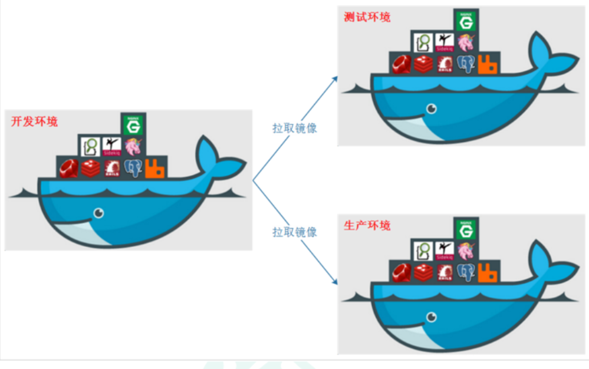

## 1.2 传统虚拟机和容器对比

| 特性         | 容器               | 虚拟机     |
| ------------ | ------------------ | ---------- |
| 启动         | 秒级               | 分钟级     |
| 大小         | 一般为Mb           | 一般为Gb   |
| 速度         | 接近原生           | 比较慢     |
| 系统支持数量 | 单机支持上千个容器 | 一般几十个 |

# 2 Docker安装

## 2.1 前提说明

CentOS Docker 安装

Docker并非一个通用的容器工具，它依赖于已经存在并运行的Linux内核环境。（在Windows上安装Docker时需要依赖WLS，也即Windows下的Linux子系统）。

Docker实质上是在已经运行的Linux下制造了一个隔离的文件环境，因此它执行的效率几乎等同于所部署的Linux主机。

Docker的基本组成部分：

- 镜像（image）

- 容器（container）

- 仓库（repository）


## 2.2 Docker的基本组成

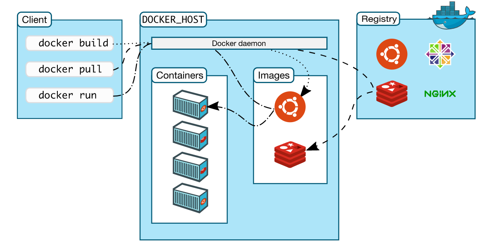

Docker是一个Client-Server结构的系统，Docker守护进程运行在主机上， 然后通过Socket连接从客户端访问，守护进程从客户端接受命令并管理运行在主机上的容器。 容器，是一个运行时环境，就是我们前面说到的集装箱。可以对比mysql演示对比讲解

Docker守护进程运行在主机上，然后通过Socket连接从客户端访问，守护进程从容器接收命令并管理运行在主机上的容器。

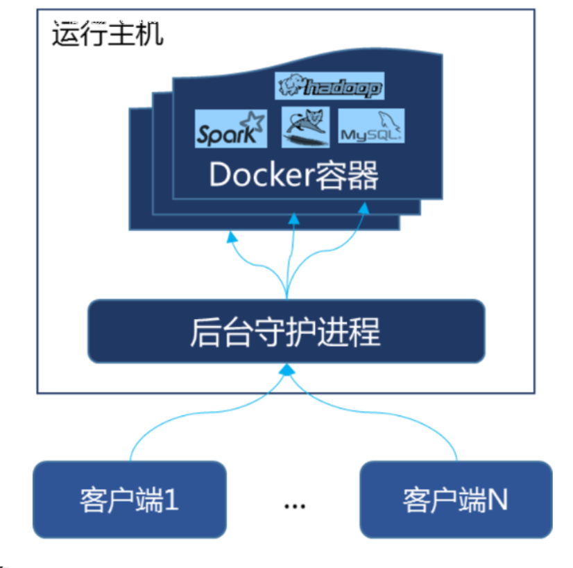

### 2.2.1 镜像(image)

Docker 镜像（Image）就是一个只读的模板。镜像可以用来创建 Docker 容器，一个镜像可以创建很多容器。

它也相当于是一个root文件系统。比如官方镜像 centos:7 就包含了完整的一套 centos:7 最小系统的 root 文件系统。

相当于容器的“源代码”，docker镜像文件类似于Java的类模板，而docker容器实例类似于java中new出来的实例对象。

| Docker | 面向对象 |
| ------ | -------- |
| 容器   | 对象     |
| 镜像   | 类       |

### 2.2.2 容器(container)

**1 从面向对象角度**

Docker 利用容器（Container）独立运行的一个或一组应用，应用程序或服务运行在容器里面，容器就类似于一个虚拟化的运行环境，容器是用镜像创建的运行实例。就像是Java中的类和实例对象一样，镜像是静态的定义，容器是镜像运行时的实体。容器为镜像提供了一个标准的和隔离的运行环境，它可以被启动、开始、停止、删除。每个容器都是相互隔离的、保证安全的平台

**2 从镜像容器角度**

可以把容器看做是一个简易版的 Linux 环境（包括root用户权限、进程空间、用户空间和网络空间等）和运行在其中的应用程序。

### 2.2.3 仓库(repository)

仓库（Repository）是集中存放镜像文件的场所。

类似于

Maven仓库，存放各种jar包的地方；

github仓库，存放各种git项目的地方；

Docker公司提供的官方registry被称为Docker Hub，存放各种镜像模板的地方。

仓库分为公开仓库（Public）和私有仓库（Private）两种形式。

最大的公开仓库是 Docker Hub(https://hub.docker.com/)，

存放了数量庞大的镜像供用户下载。国内的公开仓库包括阿里云 、网易云等。

### 2.2.4 小总结

需要正确的理解仓库/镜像/容器这几个概念:

Docker 本身是一个容器运行载体或称之为管理引擎。我们把应用程序和配置依赖打包好形成一个可交付的运行环境，这个打包好的运行环境就是image镜像文件。只有通过这个镜像文件才能生成Docker容器实例(类似Java中new出来一个对象)。

image文件可以看作是容器的模板。Docker 根据 image 文件生成容器的实例。同一个 image 文件，可以生成多个同时运行的容器实例。

#### 镜像文件
* image 文件生成的容器实例，本身也是一个文件，称为镜像文件。

#### 容器实例
* 一个容器运行一种服务，当我们需要的时候，就可以通过docker客户端创建一个对应的运行实例，也就是我们的容器

#### 仓库
* 就是放一堆镜像的地方，我们可以把镜像发布到仓库中，需要的时候再从仓库中拉下来就可以了。

## 2.3 Docker平台架构图解(架构版)

Docker 是一个 C/S 模式的架构，后端是一个松耦合架构，众多模块各司其职。 

1. 用户是使用Docker Client 与 Docker Daemon 建立通信，并发送请求给后者
2. Docker Daemon 作为 Docker 架构的主体部分，首先提供 Docker Server 的功能使其可以接收 Docker Client 的请求
3. Docker Engine 执行 Docker 内部的一系列工作，每一项工作都是以一个 Job 的形式存在
4. Job 的运行过程中，当需要容器镜像时，则从 Docker Registry 中下载镜像，并通过镜像管理驱动 Graph Driver 将下载镜像以 Graph 的形式存储
5. 当需要为 Docker 创建网络环境时，通过网络管理驱动 Network driver 创建并配置 Docker 容器网络环境
6. 当需要限制 Docker 容器运行资源或执行用户指令等操作时，则通过 Exec driver 来完成
7. Libcontainer 是一项独立的容器管理包，Network driver 以及 Exec driver 都是通过 Libcontainer 来实现具体对容器进行的操作


## 2.4 安装步骤

CentOS7安装Docker：https://docs.docker.com/engine/install/centos/

### 2.4.1 确定你是CentOS7及以上版本 

目前，CentOS 仅发行版本中的内核支持 Docker。Docker 运行在CentOS 7 (64-bit)上，

要求系统为64位、Linux系统内核版本为 3.8以上，这里选用Centos7.x

```perl
查看自己的内核
cat /etc/redhat-release

uname命令用于打印当前系统相关信息（内核版本号、硬件架构、主机名称和操作系统类型等）。
uname -r
```


###  2.4.2 卸载旧版本

https://docs.docker.com/engine/install/centos/

```perl
sudo yum remove docker \
                  docker-client \
                  docker-client-latest \
                  docker-common \
                  docker-latest \
                  docker-latest-logrotate \
                  docker-logrotate \
                  docker-engine
```

### 2.4.3 yum安装gcc相关

CentOS7能上外网

```perl
yum -y install gcc
yum -y install gcc-c++
```

### 2.4.4 安装需要的软件包

执行命令

```perl
yum install -y yum-utils
```

### 2.4.5 设置stable镜像仓库

==设置为阿里云镜像仓库==

```perl
若为python3,需执行(python3与yum自带的python2.7不兼容)
vi /usr/bin/yum-config-manager
将首行改为
#!/usr/bin/python2.7 -tt

yum-config-manager --add-repo http://mirrors.aliyun.com/docker-ce/linux/centos/docker-ce.repo
```

### 2.4.6 更新yum软件包索引(非必须)

```perl
yum makecache fast
or
yum clean all && yum makecache #(centOS 8)
```

### 2.4.7 安装DOCKER CE

```perl
yum -y install docker-ce docker-ce-cli containerd.io
```

### 2.4.8 启动docker

```perl
systemctl start docker
```

### 2.4.9 测试

```perl
docker version
```

###  2.4.10 卸载

```perl
systemctl stop docker 
yum remove docker-ce docker-ce-cli containerd.io
rm -rf /var/lib/docker
rm -rf /var/lib/containerd
```

### 2.4.11 配置

```perl
vim /etc/docker/daemon.json
{"data-root":"/srv/bigdata/disk01/docker",
	"log-opts":{
	"max-size":"500m",
	"max-file":3
	}
}
```


## 2.5 阿里云镜像加速

1. 是什么

https://promotion.aliyun.com/ntms/act/kubernetes.html

1. 注册一个属于自己的阿里云账户(可复用淘宝账号)
2. 获得加速器地址连接

1. 1. 登陆阿里云开发者平台

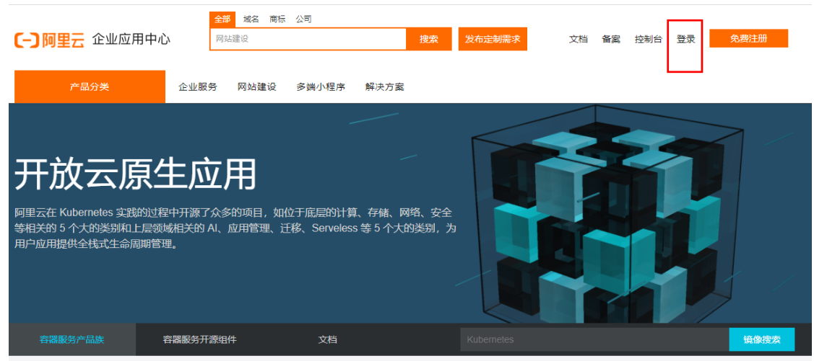

1. 1. 点击控制台	
   2. 选择容器镜像服务

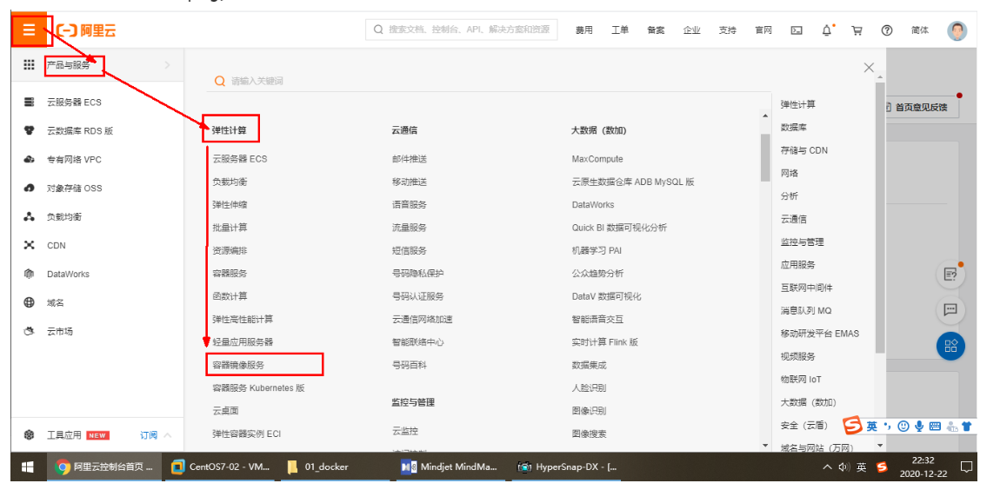

1. 1. 获取加速器地址

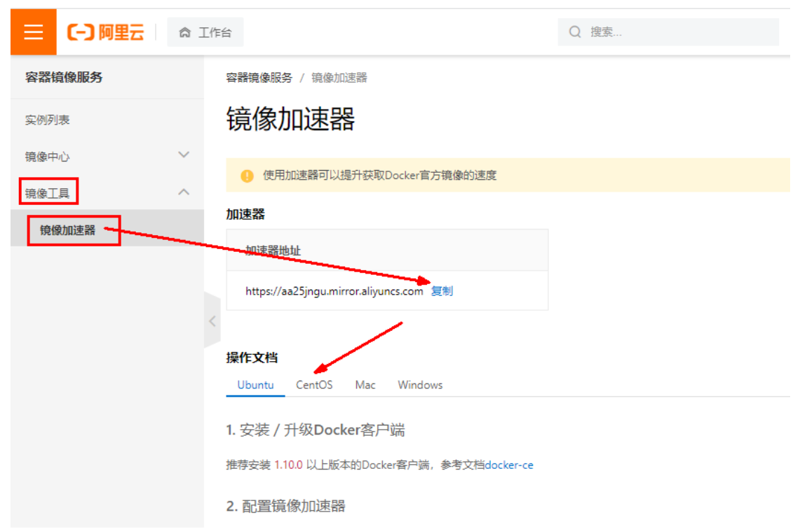

粘贴脚本直接执行

```perl
#mkdir -p /etc/docker
tee /etc/docker/daemon.json <<-'EOF'
{
  "registry-mirrors": ["https://b04dj7er.mirror.aliyuncs.com"]
}
EOF
sudo systemctl daemon-reload
sudo systemctl restart docker
```

或者分步骤都行

```perl
#mkdir -p /etc/docker
vim  /etc/docker/daemon.json
#重启服务器
systemctl daemon-reload
systemctl restart docker
```


## 2.6 永远的HelloWorld

启动Docker后台容器(测试运行 hello-world)

```perl
docker run hello-world

[root@Neptune ~]# docker run hello-world
Unable to find image 'hello-world:latest' locally
latest: Pulling from library/hello-world#由于本地没有hello-world这个镜像，所l以会下载—个hello-world的镜像，并在容器内运行.
2db29710123e: Pull complete
Digest: sha256:18a657d0cc1c7d0678a3fbea8b7eb4918bba25968d3e1b0adebfa71caddbc346
Status: Downloaded newer image for hello-world:latest

Hello from Docker!#输出这段提示以后，hello world就会停止运行，容器自动终止。
This message shows that your installation appears to be working correctly.

To generate this message, Docker took the following steps:
 1. The Docker client contacted the Docker daemon.
 2. The Docker daemon pulled the "hello-world" image from the Docker Hub.
    (amd64)
 3. The Docker daemon created a new container from that image which runs the
    executable that produces the output you are currently reading.
 4. The Docker daemon streamed that output to the Docker client, which sent it
    to your terminal.

To try something more ambitious, you can run an Ubuntu container with:
 $ docker run -it ubuntu bash

Share images, automate workflows, and more with a free Docker ID:
 https://hub.docker.com/

For more examples and ideas, visit:
 https://docs.docker.com/get-started/

[root@Neptune ~]# ls /etc/docker/
```

run干了什么？

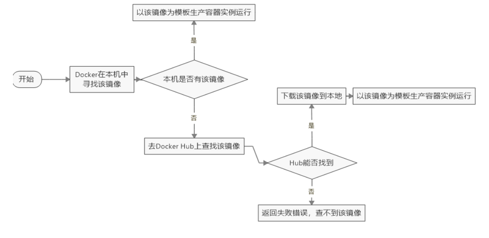


## 2.7 底层原理

为什么Docker会比VM虚拟机快

**(1)docker有着比虚拟机更少的抽象层**

   由于docker不需要Hypervisor(虚拟机)实现硬件资源虚拟化,运行在docker容器上的程序直接使用的都是实际物理机的硬件资源。因此在CPU、内存利用率上docker将会在效率上有明显优势。

**(2)docker利用的是宿主机的内核,而不需要加载操作系统OS内核**

   当新建一个容器时,docker不需要和虚拟机一样重新加载一个操作系统内核。进而避免引寻、加载操作系统内核返回等比较费时费资源的过程,当新建一个虚拟机时,虚拟机软件需要加载OS,返回新建过程是分钟级别的。而docker由于直接利用宿主机的操作系统,则省略了返回过程,因此新建一个docker容器只需要几秒钟。


|            | Docker容器              | 虚拟机                      |
| ---------- | ----------------------- | --------------------------- |
| 操作系统   | 与宿主机共享OS          | 宿主机OS上运行虚拟机OS      |
| 存储大小   | 镜像小，便于存储与传输  | 镜像庞大(vmdk、vdi等)       |
| 运行性能   | 几乎无额外性能损失      | 操作系统额外的CPU、内存消耗 |
| 移植性     | 轻便、灵活，适应于Linux | 笨重，与虚拟化技术耦合度高  |
| 硬件亲和性 | 面向软件开发者          | 面向硬件运维者              |
| 部署速度   | 快速，秒级              | 较慢，10s以上               |

# 3 Docker常用命令

## 3.1 帮助启动类命令

- 启动docker： `systemctl start docker`
- 停止docker： `systemctl stop docker`
- 重启docker： `systemctl restart docker`
- 查看docker状态： `systemctl status docker`
- 开机启动： `systemctl enable docker`
- 查看docker概要信息： `docker info`
- 查看docker总体帮助文档： `docker --help`
- 查看docker命令帮助文档：` docker 具体命令 --help`

## 3.2 镜像命令

### 3.2.1`docker images`

列出本地主机上的镜像

```perl
[root@Neptune ~]# docker images
REPOSITORY    TAG       IMAGE ID       CREATED         SIZE
hello-world   latest    feb5d9fea6a5   13 months ago   13.3kB
```

各个选项说明:

`REPOSITORY`：表示镜像的仓库源

`TAG`：镜像的标签版本号

`IMAGE ID`：镜像ID

`CREATED`：镜像创建时间

`SIZE`：镜像大小

 同一仓库源可以有多个 TAG版本，代表这个仓库源的不同个版本，我们使用 REPOSITORY:TAG 来定义不同的镜像。

如果你不指定一个镜像的版本标签，例如你只使用 ubuntu，docker 将默认使用 ubuntu:latest 镜像

OPTIONS说明：

 `-a` :列出本地所有的镜像（含历史映像层）

`-q` :只显示镜像ID。

### 3.2.2`docker search 某个XXX镜像名字`

网站：https://hub.docker.com

命令：`docker search [OPTIONS] 镜像名字`

| 参数        | 说明             |
| ----------- | ---------------- |
| NAME        | 镜像名称         |
| DESCRIPTION | 镜像说明         |
| STARS       | 点赞数量         |
| OFFICIAL    | 是否是官方的     |
| AUTOMATED   | 是否是自动构建的 |

```perl
[root@Neptune ~]# docker search redis
NAME                                        DESCRIPTION                                     STARS     OFFICIAL   AUTOMATED
redis                                       Redis is an open source key-value store that…   11489     [OK]
bitnami/redis                               Bitnami Redis Docker Image                      231                  [OK]
```

OPTIONS说明：

`--limit` : 只列出N个镜像，默认25个

```perl
docker search --limit 5 redis
```

### 3.2.3`docker pull 某个XXX镜像名字`

下载镜像

```perl
docker pull 镜像名字[:TAG]
docker pull 镜像名字
```

没有TAG就是最新版

等价于

```perl
docker pull 镜像名字:latest
docker pull ubuntu

[root@Neptune ~]# docker pull ubuntu
Using default tag: latest
latest: Pulling from library/ubuntu
7b1a6ab2e44d: Pull complete
Digest: sha256:626ffe58f6e7566e00254b638eb7e0f3b11d4da9675088f4781a50ae288f3322
Status: Downloaded newer image for ubuntu:latest
docker.io/library/ubuntu:latest
```

### 3.2.4`docker system df `

查看镜像/容器/数据卷所占的空间

```perl
[root@Neptune ~]# docker system df
TYPE            TOTAL     ACTIVE    SIZE      RECLAIMABLE
Images          2         1         72.79MB   72.78MB (99%)
Containers      1         0         0B        0B
Local Volumes   0         0         0B        0B
Build Cache     0         0         0B        0B
```

### 3.2.5`docker rmi 某个XXX镜像名字ID`

删除镜像

```perl
#删除单个
docker rmi -f 镜像ID

#删除多个
docker rmi -f 镜像名1:TAG 镜像名2:TAG 

#删除全部
docker rmi -f $(docker images -qa)
```

### 3.2.6 面试题：谈谈docker虚悬镜像是什么？

是什么？

仓库名、标签都是<none>的镜像，俗称虚悬镜像dangling image

长什么样？

```perl
[root@Neptune ~]# docker images
REPOSITORY                                             TAG       IMAGE ID       CREATED         SIZE
<none>                               			<none>    5c34f737c008   3 seconds ago    933MB#虚悬镜像
quay.io/debezium/connect                       1.9       7500797ddbb7   2 minutes ago    933MB
```

## 3.3 容器命令

### 3.3.1 有镜像才能创建容器， 这是根本前提(下载一个CentOS或者ubuntu镜像演示)

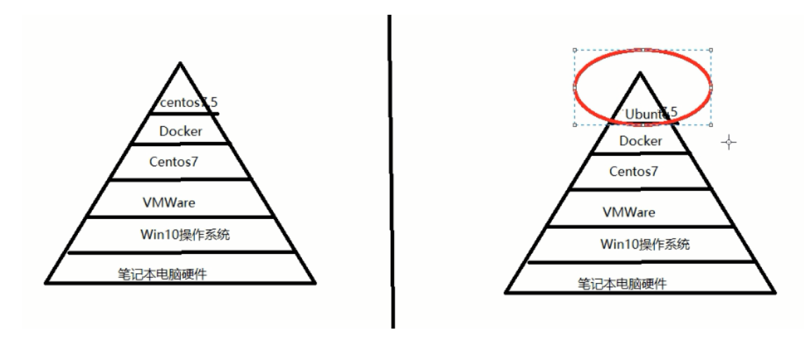

### 3.3.2 新建+启动容器

```perl
docker run [OPTIONS] IMAGE [COMMAND] [ARG...]
```

OPTIONS说明

 OPTIONS说明（常用）：有些是一个减号，有些是两个减号

`--name`="容器新名字"       为容器指定一个名称；

`-d`: 后台运行容器并返回容器ID，也即启动守护式容器(后台运行)；

`-e`: 为容器添加环境变量

`-i`：以交互模式运行容器，通常与 -t 同时使用；

`-t`：为容器重新分配一个伪输入终端，通常与 -i 同时使用；

也即启动交互式容器(前台有伪终端，等待交互)；

`-P`: 随机端口映射，大写P

`-p`: 指定端口映射，小写p

| 参数                          | 说明                              |
| ----------------------------- | --------------------------------- |
| -p hostPort:containerPort     | 端口映射-p 8080:80                |
| -p ip:hostPort:containerPort  | 配置监听地址-p 10.0.0.100:8080:80 |
| -p ip:containerPort           | 随机分配端口-p 10.0.0.100::80     |
| -p hostPort:containerPort:udp | 指定协议-p 8080:80:tcp            |
| -p 81:80 -p 443:443           | 指定多个                          |

启动交互式容器(前台命令行)

```perl
[root@Neptune ~]# docker run -it ubuntu /bin/bash
root@cfa66f8c40df:/# ps -ef
UID         PID   PPID  C STIME TTY          TIME CMD
root          1      0  1 14:48 pts/0    00:00:00 /bin/bash
root          9      1  0 14:48 pts/0    00:00:00 ps -ef
root@cfa66f8c40df:/#
```

参数说明：

`-i`: 交互式操作。

`-t`: 终端。

`ubuntu`: ubuntu镜像。

`/bin/bash`：放在镜像名后的是命令，这里我们希望有个交互式 Shell，因此用的是 /bin/bash。

要退出终端，直接输入 `exit`:

### 容器启动Warning

```perl
WARNING: IPv4 forwarding is disabled. Networking will not work.
```

- **问题原因**

是没有开启转发,`docker`网桥配置完后，需要开启转发，不然容器启动后，就会没有网络，配置`/etc/sysctl.conf`,添加`net.ipv4.ip_forward=1`

- **问题解决：**

**修改文件**

```perl
vim /etc/sysctl.conf

net.ipv4.ip_forward=1    #添加此行配置
```

**注：也可修改此文件：/usr/lib/sysctl.d/00-system.conf**

```perl
#重启network和docker服务
systemctl restart network 
systemctl restart docker

#查看是否修改成功
sysctl net.ipv4.ip_forward
#如果返回为“net.ipv4.ip_forward = 1”则表示修改成功
#再次执行查看，使用docker不再报错
```

### 3.3.3 列出当前所有正在运行的容器

```perl
docker ps [OPTIONS]
```

OPTIONS说明（常用）：

`-a` :列出当前所有正在运行的容器+历史上运行过的

`-l` :显示最近创建的容器。

`-n`：显示最近n个创建的容器。

`-q` :静默模式，只显示容器编号。

### 3.3.4 退出容器

```perl
exit
或
ctrl+p+q
```

### 3.3.5 启动已停止运行的容器

```perl
docker start 容器ID或者容器名
```

### 3.3.6 重启容器

```perl
docker restart 容器ID或者容器名
```

### 3.3.7 停止容器

```perl
docker stop 容器ID或者容器名
```

### 3.3.8 强制停止容器

```perl
docker kill 容器ID或容器名
```

### 3.3.9 删除已停止的容器

```perl
docker rm 容器ID

#一次性删除多个容器实例
docker rm -f $(docker ps -a -q)
docker ps -a -q | xargs docker rm
```

### 3.3.10 重要

**有镜像才能创建容器，这是根本前提(下载一个Redis6.0.8镜像演示)**

#### **启动守护式容器(后台服务器)**

在大部分的场景下，我们希望 docker 的服务是在后台运行的， 我们可以过 -d 指定容器的后台运行模式。

```perl
docker run -d 容器名

#使用镜像ubuntu:latest以后台模式启动一个容器
docker run -d ubuntu
```

问题：然后`docker ps -a` 进行查看, 会发现容器已经退出


很重要的要说明的一点: Docker容器后台运行,就必须有一个前台进程。
容器运行的命令如果不是那些一直挂起的命令（比如运行top，tail），就是会自动退出的。

这个是docker的机制问题,比如你的web容器,我们以nginx为例，正常情况下,我们配置启动服务只需要启动响应的service即可。例如service nginx start。但是,这样做,nginx为后台进程模式运行,就导致docker前台没有运行的应用，这样的容器后台启动后，会立即自杀因为他觉得他没事可做了。所以，最佳的解决方案是将你要运行的程序以前台进程的形式运行，常见就是命令行模式，表示我还有交互操作，别中断。


#### redis 前后台启动演示case

```perl
#前台交互式启动
docker run -it redis:6.0.8

#后台守护式启动
docker run -d redis:6.0.8

#查看容器日志
docker logs 容器ID

#查看容器内运行的进程
docker top 容器ID

#查看容器内部细节
docker inspect 容器ID

#进入正在运行的容器并以命令行交互
docker exec -it 容器ID bashShell

#重新进入
docker attach 容器ID

```

```perl
[root@Neptune ~]# docker exec --help
Usage:  docker exec [OPTIONS] CONTAINER COMMAND [ARG...]

Run a command in a running container

Options:
  -d, --detach               Detached mode: run command in the background
      --detach-keys string   Override the key sequence for detaching a container
  -e, --env list             Set environment variables
      --env-file list        Read in a file of environment variables
  -i, --interactive          Keep STDIN open even if not attached
      --privileged           Give extended privileges to the command
  -t, --tty                  Allocate a pseudo-TTY
  -u, --user string          Username or UID (format: <name|uid>[:<group|gid>])
  -w, --workdir string       Working directory inside the container
[root@Neptune ~]#
```

`attach`和`exec`区别？

`attach` 直接进入容器启动命令的终端，不会启动新的进程 用exit退出，会导致容器的停止。

`exec` 是在容器中打开新的终端，并且可以启动新的进程 用exit退出，不会导致容器的停止。

推荐大家使用 `docker exec` 命令，因为退出容器终端，不会导致容器的停止。

用之前的redis容器实例进入试试

进入redis服务

```perl
docker exec -it 容器ID /bin/bash
docker exec -it 容器ID redis-cli
```

一般用-d后台启动的程序，再用exec进入对应容器实例

#### **从容器内拷贝文件到主机上**

容器→主机

```perl
docker cp 容器ID:容器内路径 目的主机路径
```

#### **导入和导出容器**

`export `导出容器的内容留作为一个tar归档文件[对应import命令]

`import `从tar包中的内容创建一个新的文件系统再导入为镜像[对应export]

案例

```perl
docker export 容器ID > 文件名.tar
cat 文件名.tar | docker import - 镜像用户/镜像名:镜像版本号
```

## 3.4 小总结

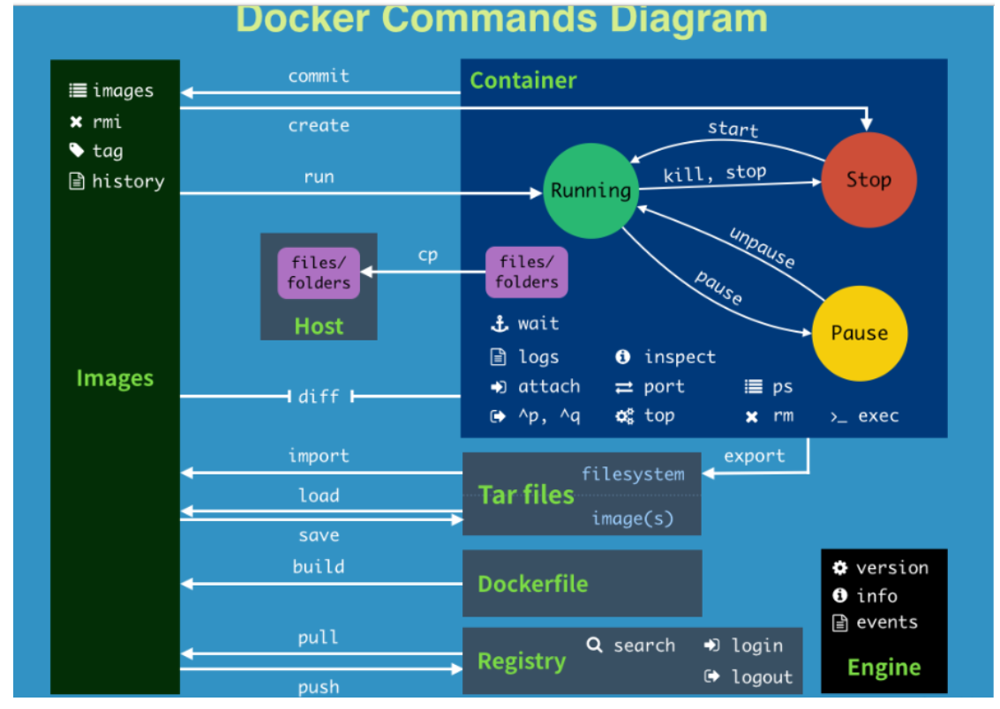
<pre>
attach    Attach to a running container                 # 当前 shell 下 attach 连接指定运行镜像
build     Build an image from a Dockerfile              # 通过 Dockerfile 定制镜像
commit    Create a new image from a container changes   # 提交当前容器为新的镜像
cp        Copy files/folders from the containers filesystem to the host path   #从容器中拷贝指定文件或者目录到宿主机中
create    Create a new container                        # 创建一个新的容器，同 run，但不启动容器
diff      Inspect changes on a container's filesystem   # 查看 docker 容器变化
events    Get real time events from the server          # 从 docker 服务获取容器实时事件
exec      Run a command in an existing container        # 在已存在的容器上运行命令
export    Stream the contents of a container as a tar archive   # 导出容器的内容流作为一个 tar 归档文件[对应 import ]
history   Show the history of an image                  # 展示一个镜像形成历史
images    List images                                   # 列出系统当前镜像
import    Create a new filesystem image from the contents of a tarball # 从tar包中的内容创建一个新的文件系统映像[对应export]
info      Display system-wide information               # 显示系统相关信息
inspect   Return low-level information on a container   # 查看容器详细信息
kill      Kill a running container                      # kill 指定 docker 容器
load      Load an image from a tar archive              # 从一个 tar 包中加载一个镜像[对应 save]
login     Register or Login to the docker registry server    # 注册或者登陆一个 docker 源服务器
logout    Log out from a Docker registry server          # 从当前 Docker registry 退出
logs      Fetch the logs of a container                 # 输出当前容器日志信息
port      Lookup the public-facing port which is NAT-ed to PRIVATE_PORT    # 查看映射端口对应的容器内部源端口
pause     Pause all processes within a container        # 暂停容器
ps        List containers                               # 列出容器列表
pull      Pull an image or a repository from the docker registry server   # 从docker镜像源服务器拉取指定镜像或者库镜像
push      Push an image or a repository to the docker registry server    # 推送指定镜像或者库镜像至docker源服务器
restart   Restart a running container                   # 重启运行的容器
rm        Remove one or more containers                 # 移除一个或者多个容器
rmi       Remove one or more images       # 移除一个或多个镜像[无容器使用该镜像才可删除，否则需删除相关容器才可继续或 -f 强制删除]
run       Run a command in a new container              # 创建一个新的容器并运行一个命令
save      Save an image to a tar archive                # 保存一个镜像为一个 tar 包[对应 load]
search    Search for an image on the Docker Hub         # 在 docker hub 中搜索镜像
start     Start a stopped containers                    # 启动容器
stop      Stop a running containers                     # 停止容器
tag       Tag an image into a repository                # 给源中镜像打标签
top       Lookup the running processes of a container   # 查看容器中运行的进程信息
unpause   Unpause a paused container                    # 取消暂停容器
version   Show the docker version information           # 查看 docker 版本号
wait      Block until a container stops, then print its exit code   # 截取容器停止时的退出状态值
stats	Display a live stream of container(s) resource usage statistics #显示容器资源使用统计的实时流(CPU、内存)
</pre>

# 4 Docker镜像

### 4.1 是什么

是一种轻量级、可执行的独立软件包，它包含运行某个软件所需的所有内容，我们把应用程序和配置依赖打包好形成一个可交付的运行环境(包括代码、运行时需要的库、环境变量和配置文件等)，这个打包好的运行环境就是image镜像文件。

只有通过这个镜像文件才能生成Docker容器实例(类似Java中new出来一个对象)。

#### 4.1.1 分层的镜像

以我们的pull为例，在下载的过程中我们可以看到docker的镜像好像是在一层一层的在下载

```perl
[root@Neptune ~]# docker pull tomcat
Using default tag: latest
latest: Pulling from library/tomcat
0e29546d541c: Pull complete
9b829c73b52b: Pull complete
cb5b7ae36172: Pull complete
6494e4811622: Pull complete
668f6fcc5fa5: Pull complete
dc120c3e0290: Pull complete
8f7c0eebb7b1: Downloading [===================>                               ]  79.27MB/203.1MB
77b694f83996: Download complete
0f611256ec3a: Download complete
4f25def12f23: Download complete
```

#### 4.1.2 UnionFS（联合文件系统）

UnionFS（联合文件系统）：Union文件系统（UnionFS）是一种分层、轻量级并且高性能的文件系统，它支持对文件系统的修改作为一次提交来一层层的叠加，同时可以将不同目录挂载到同一个虚拟文件系统下(unite several directories into a single virtual filesystem)。Union 文件系统是 Docker 镜像的基础。镜像可以通过分层来进行继承，基于基础镜像（没有父镜像），可以制作各种具体的应用镜像。

特性：一次同时加载多个文件系统，但从外面看起来，只能看到一个文件系统，联合加载会把各层文件系统叠加起来，这样最终的文件系统会包含所有底层的文件和目录

####  4.1.3 Docker镜像加载原理

docker的镜像实际上由一层一层的文件系统组成，这种层级的文件系统UnionFS。

bootfs(boot file system)主要包含bootloader和kernel, bootloader主要是引导加载kernel, Linux刚启动时会加载bootfs文件系统，在Docker镜像的最底层是引导文件系统bootfs。这一层与我们典型的Linux/Unix系统是一样的，包含boot加载器和内核。当boot加载完成之后整个内核就都在内存中了，此时内存的使用权已由bootfs转交给内核，此时系统也会卸载bootfs。

rootfs (root file system) ，在bootfs之上。包含的就是典型 Linux 系统中的 /dev, /proc, /bin, /etc 等标准目录和文件。rootfs就是各种不同的操作系统发行版，比如Ubuntu，Centos等等。 

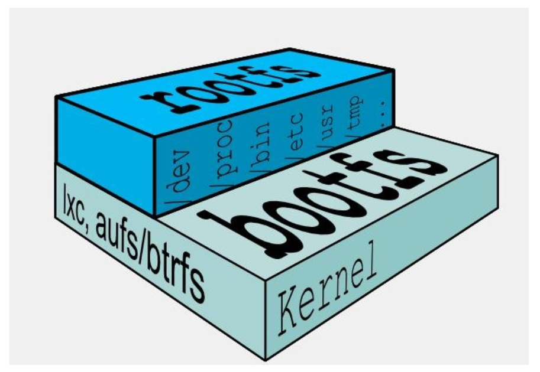

 平时我们安装进虚拟机的CentOS都是好几个G，为什么docker这里才200M？？

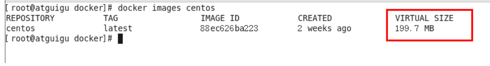

对于一个精简的OS，rootfs可以很小，只需要包括最基本的命令、工具和程序库就可以了，因为底层直接用Host的kernel，自己只需要提供 rootfs 就行了。由此可见对于不同的linux发行版, bootfs基本是一致的, rootfs会有差别, 因此不同的发行版可以公用bootfs。

#### 4.1.4 为什么 Docker 镜像要采用这种分层结构呢

镜像分层最大的一个好处就是共享资源，方便复制迁移，就是为了复用。

比如说有多个镜像都从相同的 base 镜像构建而来，那么 Docker Host 只需在磁盘上保存一份 base 镜像；

同时内存中也只需加载一份 base 镜像，就可以为所有容器服务了。而且镜像的每一层都可以被共享。

### 4.2 重点理解

Docker镜像层都是只读的，容器层是可写的。当容器启动时，一个新的可写层被加载到镜像的顶部。 这一层通常被称作“容器层”，“容器层”之下的都叫“镜像层”。

所有对容器的改动 - 无论添加、删除、还是修改文件都只会发生在容器层中。只有容器层是可写的，容器层下面的所有镜像层都是只读的。

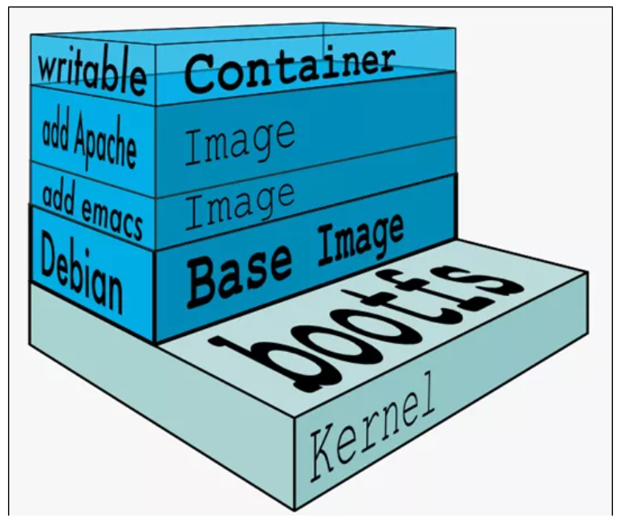

### 4.3 Docker镜像commit操作案例

docker commit 提交容器副本使之成为一个新的镜像

```perl
docker commit -m="提交的描述信息" -a="作者" 容器ID 要创建的目标镜像名:[标签名]
```

#### 4.3.1 案例演示ubuntu安装vim

1. **从Hub上下载ubuntu镜像到本地并成功运行**
2. **原始的默认Ubuntu镜像是不带着vim命令的**

**外网连通的情况下，安装vim**

**docker容器内执行**

```perl
apt-get update
apt-get -y install vim
```

```perl
root@0123a4775d12:/# vi a.txt
bash: vi: command not found
root@0123a4775d12:/# apt-get update
Fetched 24.1 MB in 1min 57s (207 kB/s)
Reading package lists... Done
root@0123a4775d12:/# apt-get -y install vim
Reading package lists... Done
Building dependency tree
Reading state information... Done
The following additional packages will be installed:
root@0123a4775d12:/# vi 1.txt
root@0123a4775d12:/#
```

**安装完成后，commit我们自己的新镜像**

```perl
[root@Neptune ~]# docker commit -m="add vim cmd" -a="Neptune" 0123a4775d12 myubuntu:1.0
sha256:d22511c47f80f75e979ce0884c60395af47fde25b1f2d329211fd1cc8fdb6466
[root@Neptune ~]# docker images
REPOSITORY    TAG       IMAGE ID       CREATED         SIZE
myubuntu      1.0       d22511c47f80   8 seconds ago   180MB
kisa          1.9       0df0f9a8b101   7 hours ago     1.26GB
dbz_test      1.9       68f805f1b592   22 hours ago    1.26GB
tomcat        latest    fb5657adc892   10 months ago   680MB
ubuntu        latest    ba6acccedd29   12 months ago   72.8MB
hello-world   latest    feb5d9fea6a5   13 months ago   13.3kB

```

**启动我们的新镜像并和原来的对比**

```perl
[root@Neptune ~]# docker run -it d22511c47f80
root@7e03ce59051a:/# vi a.txt
root@7e03ce59051a:/#
```

**官网是默认下载的Ubuntu没有vim命令**

**我们自己commit构建的镜像，新增加了vim功能，可以成功使用。**

#### 4.3.2 小总结

Docker中的镜像分层，支持通过扩展现有镜像，创建新的镜像。类似Java继承于一个Base基础类，自己再按需扩展。

新镜像是从 base 镜像一层一层叠加生成的。每安装一个软件，就在现有镜像的基础上增加一层

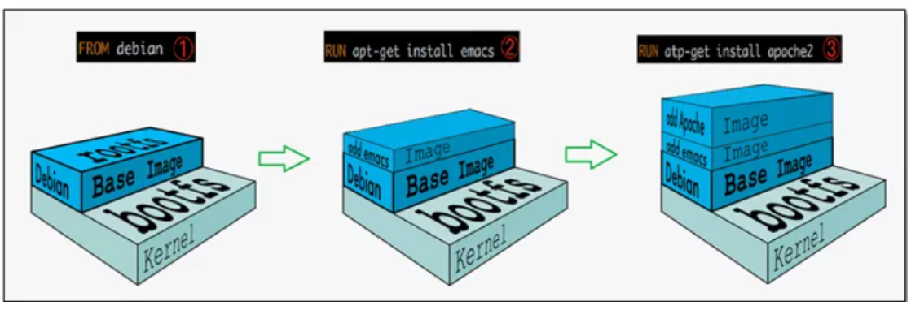

# 5 本地镜像发布到阿里云

## 5.1 本地镜像发布到阿里云流程

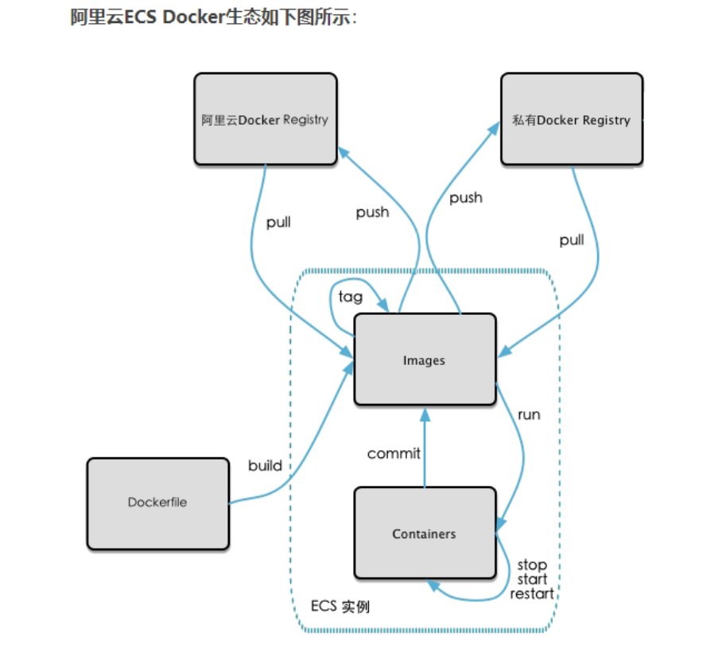

## 5.2 镜像的生成方法

基于当前容器创建一个新的镜像，新功能增强 `docker commit [OPTIONS] 容器ID [REPOSITORY[:TAG]]`

OPTIONS说明：

`-a` :提交的镜像作者；

`-m` :提交时的说明文字；

```perl
[root@Neptune ~]# docker commit -a neptune -m "hello world" dbz_130_kisa kisa:1.9
sha256:0df0f9a8b101caa55621e524edf2aa614319cf1e14db3ddc6907458e43329c30
[root@Neptune ~]# docker images
REPOSITORY    TAG       IMAGE ID       CREATED         SIZE
kisa          1.9       0df0f9a8b101   5 seconds ago   1.26GB
dbz_test      1.9       68f805f1b592   15 hours ago    1.26GB
tomcat        latest    fb5657adc892   10 months ago   680MB
ubuntu        latest    ba6acccedd29   12 months ago   72.8MB
hello-world   latest    feb5d9fea6a5   13 months ago   13.3kB
[root@Neptune ~]# docker run -d --name dbz_130_kisaA -p 8083:8083 --add-host Neptune:192.168.10.130 -e BOOTSTRAP_SERVERS=192.168.10.130:9092 -e GROUP_ID=8 -e CONFIG_STORAGE_TOPIC=dbz_kisa_configs -e OFFSET_STORAGE_TOPIC=dbz_kisa_offsets -e STATUS_STORAGE_TOPIC=dbz_kisa_statuses -e LD_LIBRARY_PATH=/instant_client kisa:1.9
cd5f99f9218048f59157de08e27848a2ede46183e51f956307358486de8cdf20
```

## 5.3 将本地镜像推送到阿里云

本地镜像素材原型

```perl
[root@Neptune ~]# docker images myubuntu
REPOSITORY   TAG       IMAGE ID       CREATED          SIZE
myubuntu     1.0       d22511c47f80   40 minutes ago   180MB
[root@Neptune ~]#
```

阿里云开发者平台

https://promotion.aliyun.com/ntms/act/kubernetes.html


### 5.3.1 创建仓库镜像

1. **选择控制台，进入容器镜像服务**

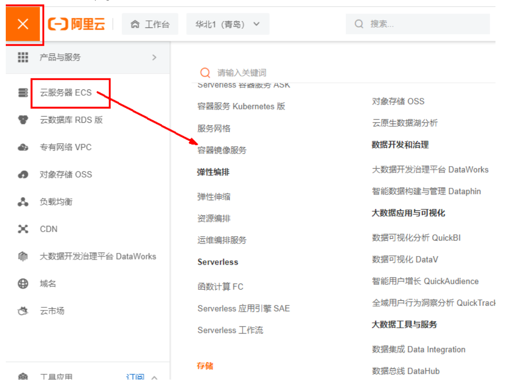

1. **选择个人实例**


1. **命名空间**


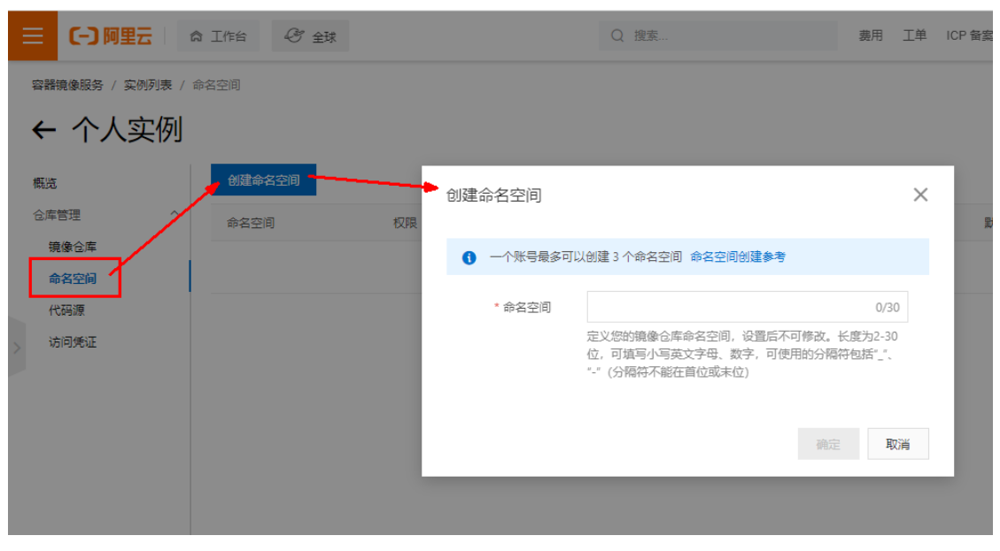

1. **仓库名称**

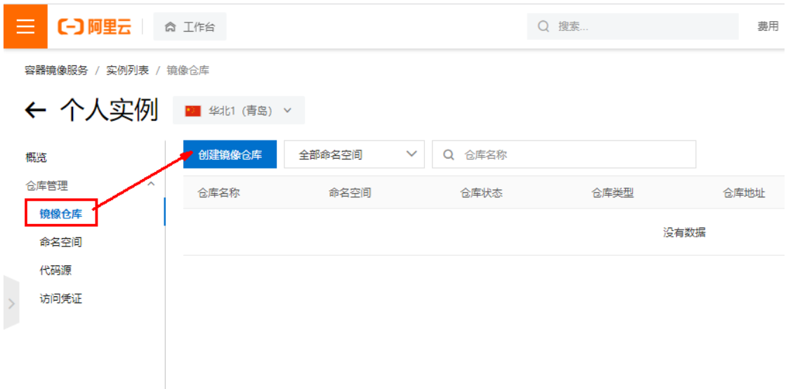

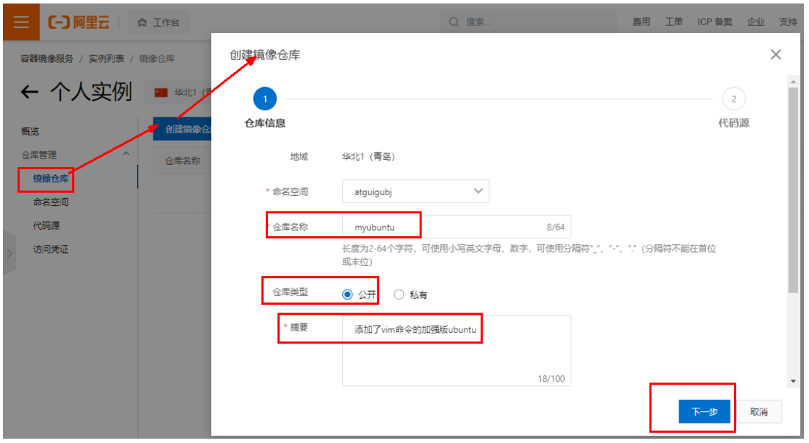

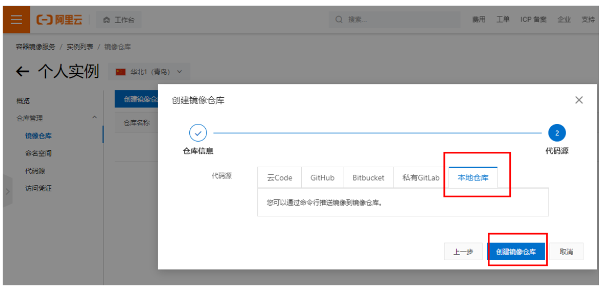

1. **进入管理界面获得脚本**

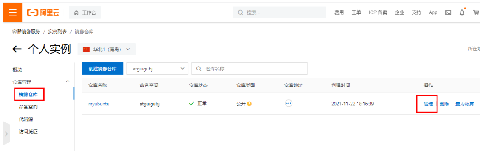

### 5.3.2 将镜像推送到阿里云

1. **管理界面脚本**

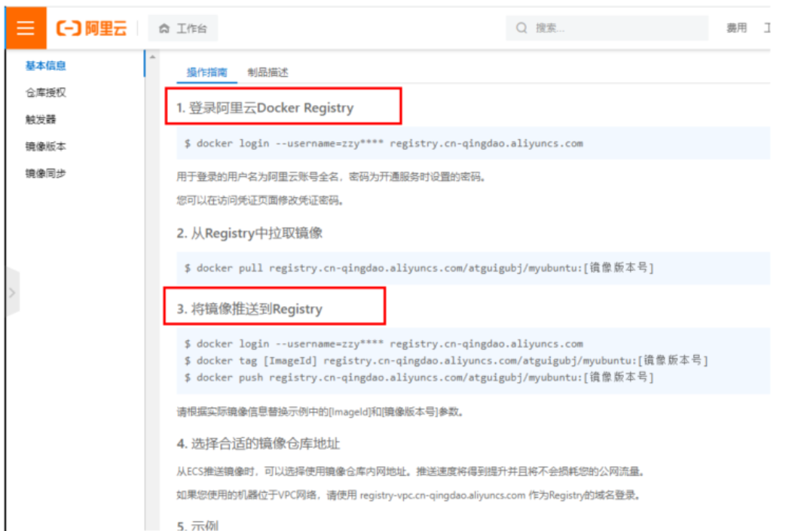

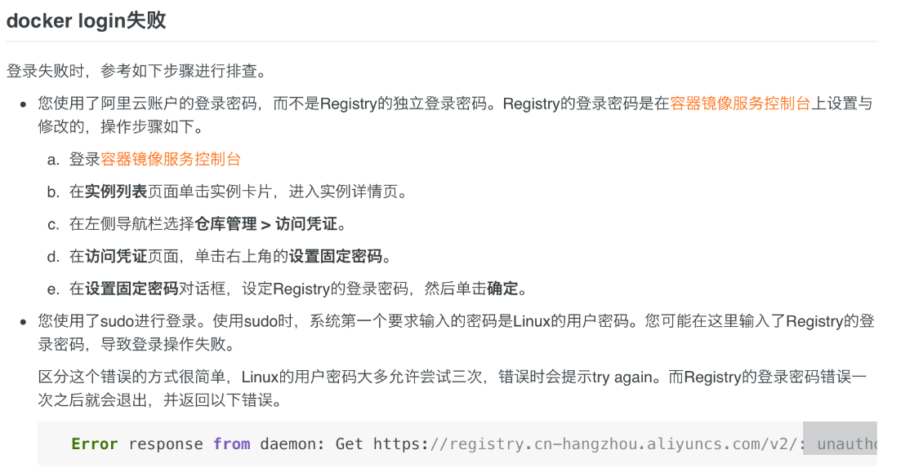

```perl
docker login --username=aliyun1983826194 registry.cn-shanghai.aliyuncs.com
#拉取镜像
docker pull registry.cn-shanghai.aliyuncs.com/nep_kisa/neptune:[镜像版本号]
#推送镜像
docker tag [ImageId] registry.cn-shanghai.aliyuncs.com/nep_kisa/neptune:[镜像版本号]
docker tag d22511c47f80 registry.cn-shanghai.aliyuncs.com/nep_kisa/neptune:1.0

docker push registry.cn-shanghai.aliyuncs.com/nep_kisa/neptune:[镜像版本号]
docker push registry.cn-shanghai.aliyuncs.com/nep_kisa/neptune:1.0
```

```perl
[root@Neptune ~]# docker login --username=aliyun1983826194 registry.cn-shanghai.aliyuncs.com
Password:
WARNING! Your password will be stored unencrypted in /root/.docker/config.json.
Configure a credential helper to remove this warning. See
https://docs.docker.com/engine/reference/commandline/login/#credentials-store

Login Succeeded
[root@Neptune ~]# docker tag d22511c47f80 registry.cn-shanghai.aliyuncs.com/nep_kisa/neptune:1.0
[root@Neptune ~]# docker push registry.cn-shanghai.aliyuncs.com/nep_kisa/neptune:1.0
The push refers to repository [registry.cn-shanghai.aliyuncs.com/nep_kisa/neptune]
1e11e3374920: Mounted from nep_kisa/myubuntu
9f54eef41275: Mounted from nep_kisa/myubuntu
1.0: digest: sha256:a327e37f4ddeb11be3e1d543a2c1dc4531f3531bd1669b6768004a3e1d41ad44 size: 741
[root@Neptune ~]#
```


## 5.4 将阿里云上的镜像下载到本地

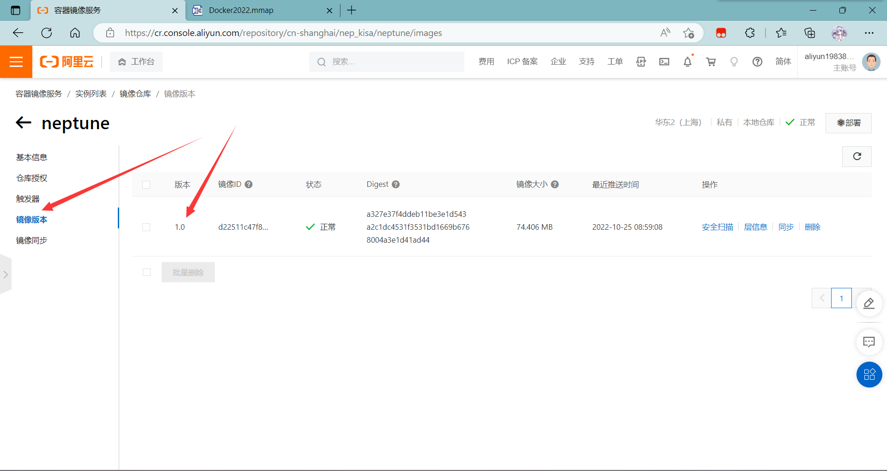

```perl
docker pull registry.cn-shanghai.aliyuncs.com/nep_kisa/neptune:[镜像版本号]
docker pull registry.cn-shanghai.aliyuncs.com/nep_kisa/neptune:1.0
```

```perl
[root@Neptune ~]# docker pull registry.cn-shanghai.aliyuncs.com/nep_kisa/neptune:1.0
1.0: Pulling from nep_kisa/neptune
Digest: sha256:a327e37f4ddeb11be3e1d543a2c1dc4531f3531bd1669b6768004a3e1d41ad44
Status: Image is up to date for registry.cn-shanghai.aliyuncs.com/nep_kisa/neptune:1.0
registry.cn-shanghai.aliyuncs.com/nep_kisa/neptune:1.0
[root@Neptune ~]# docker images
REPOSITORY                                            TAG       IMAGE ID       CREATED         SIZE
registry.cn-shanghai.aliyuncs.com/nep_kisa/neptune    1.0       d22511c47f80   16 hours ago    180MB
myubuntu                                              1.0       d22511c47f80   16 hours ago    180MB
tomcat                                                latest    fb5657adc892   10 months ago   680MB
ubuntu                                                latest    ba6acccedd29   12 months ago   72.8MB
hello-world                                           latest    feb5d9fea6a5   13 months ago   13.3kB
[root@Neptune ~]#
```

# 6 本地镜像发布到私有库

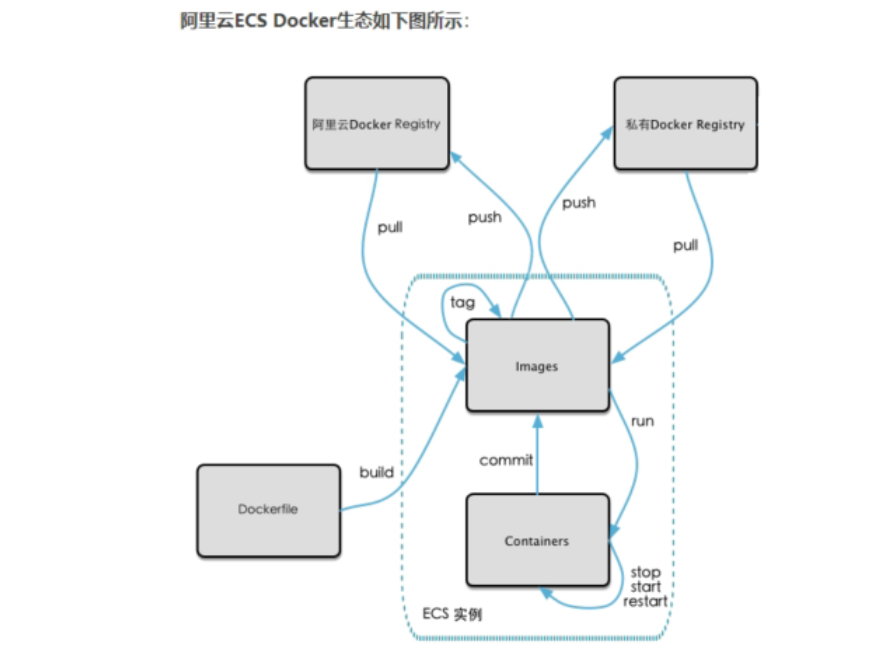

## 6.1 是什么

1 官方Docker Hub地址：https://hub.docker.com/，中国大陆访问太慢了且准备被阿里云取代的趋势，不太主流。

2 Dockerhub、阿里云这样的公共镜像仓库可能不太方便，涉及机密的公司不可能提供镜像给公网，所以需要创建一个本地私人仓库供给团队使用，基于公司内部项目构建镜像。

Docker Registry是官方提供的工具，可以用于构建私有镜像仓库

## 6.2 将本地镜像推送到私有库

### 6.2.1 下载镜像Docker Registry

```perl
docker pull registry 
```
```perl
[root@Neptune ~]# docker pull registry
Using default tag: latest
latest: Pulling from library/registry
79e9f2f55bf5: Pull complete
0d96da54f60b: Pull complete
5b27040df4a2: Pull complete
e2ead8259a04: Pull complete
3790aef225b9: Pull complete
Digest: sha256:169211e20e2f2d5d115674681eb79d21a217b296b43374b8e39f97fcf866b375
Status: Downloaded newer image for registry:latest
docker.io/library/registry:latest
[root@Neptune ~]# docker images
REPOSITORY                                            TAG       IMAGE ID       CREATED         SIZE
myubuntu                                              1.0       d22511c47f80   16 hours ago    180MB
registry.cn-shanghai.aliyuncs.com/nep_kisa/myubuntu   1.0       d22511c47f80   16 hours ago    180MB
```

### 6.2.2 运行私有库Registry，相当于本地有个私有Docker hub

```perl
docker run -d -p 5000:5000  -v /neptune/myregistry/:/tmp/registry --privileged=true registry
```

**默认情况，仓库被创建在容器的/var/lib/registry目录下，建议自行用容器卷映射，方便于宿主机联调**

```perl
[root@Neptune ~]# docker run -d -p 5000:5000  -v /neptune/myregistry/:/tmp/registry --privileged=true registry
b74346f7b5fb4c741ca83ec299d2b05c45c4769374a822772354702d2e041f27
[root@Neptune ~]# docker ps
CONTAINER ID   IMAGE          COMMAND                  CREATED         STATUS         PORTS                                       NAMES
b74346f7b5fb   registry       "/entrypoint.sh /etc…"   4 seconds ago   Up 3 seconds   0.0.0.0:5000->5000/tcp, :::5000->5000/tcp   vigilant_kalam
```

### 6.2.3 案例演示创建一个新镜像，ubuntu安装ifconfig命令

1. **从Hub上下载ubuntu镜像到本地并成功运行**
2. **原始的Ubuntu镜像是不带着ifconfig命令的**

```perl
docker run -it ubuntu /bin/bash
```

3. **外网连通的情况下，安装ifconfig命令并测试通过**

```perl
docker容器内执行
apt-get update
apt-get install net-tools
```

4. **安装完成后，commit我们自己的新镜像**

```perl
docker commit -m="提交的描述信息" -a="作者" 容器ID 要创建的目标镜像名:[标签名]
docker commit -m="ifconfig cmd add" -a="neptune" a69d7c825c4f neptune:1.2
```

5. **启动我们的新镜像并和原来的对比**

官网是默认下载的Ubuntu没有ifconfig命令。

我们自己commit构建的新镜像，新增加了ifconfig功能，可以成功使用。

### 6.2.4 curl验证私服库上有什么镜像

```perl
curl 192.168.10.130:5000/v2/_catalog
```

```perl
[root@Neptune ~]# curl 192.168.10.130:5000/v2/_catalog
{"repositories":[]}#可以看到，目前私服库没有任何镜像上传过。
```

### 6.2.5 将新镜像neptune:1.2修改符合私服规范的Tag

```perl
docker tag 镜像:Tag Host:Port/Repository:Tag
docker tag myubuntu:1.0 192.168.10.130:5000/myubuntu:1.0
```

```perl
[root@Neptune ~]# docker tag myubuntu:1.0 192.168.10.130:5000/myubuntu:1.0
[root@Neptune ~]# docker images
REPOSITORY                                            TAG       IMAGE ID       CREATED         SIZE
192.168.10.130:5000/myubuntu                          1.0       d22511c47f80   17 hours ago    180MB
myubuntu                                              1.0       d22511c47f80   17 hours ago    180MB
```

### 6.2.6 修改配置文件使之支持http

```perl
cat /etc/docker/daemon.json
{
  "registry-mirrors": ["https://b04dj7er.mirror.aliyuncs.com"],
  "insecure-registries": ["192.168.10.130:5000"]
}

systemctl restart docker		#重启docker服务使配置生效
docker start vigilant_kalam		#开启docker里registry端口映射服务容器
```

**上述理由：docker默认不允许http方式推送镜像，通过配置选项来取消这个限制。====> 修改完后如果不生效，建议重启docker。**

### 6.2.7 push推送到私服库

```perl
docker push 192.168.10.130:5000/myubuntu:1.0

[root@Neptune ~]# docker push 192.168.10.130:5000/myubuntu:1.0
The push refers to repository [192.168.10.130:5000/myubuntu]
1e11e3374920: Pushed
9f54eef41275: Pushed
1.0: digest: sha256:a327e37f4ddeb11be3e1d543a2c1dc4531f3531bd1669b6768004a3e1d41ad44 size: 741
```

### 6.2.8 curl验证私服库上有什么镜像2

```perl
curl 192.168.10.130:5000/v2/_catalog

[root@Neptune ~]# curl 192.168.10.130:5000/v2/_catalog
{"repositories":["myubuntu"]}
```

### 6.2.9 pull到本地并运行

```perl
docker pull 192.168.10.130:5000/myubuntu:1.0
docker run -it 镜像ID /bin/bash
```

# 7 Docker容器数据卷

## 7.1 坑：容器卷记得加入

```perl
--privileged=true
```

 Docker挂载主机目录访问如果出现cannot open directory .: Permission denied

==**解决办法：在挂载目录后多加一个--privileged=true参数即可**==

如果是CentOS7安全模块会比之前系统版本加强，不安全的会先禁止，所以目录挂载的情况被默认为不安全的行为，在SELinux里面挂载目录被禁止掉了，如果要开启，我们一般使用--privileged=true命令，扩大容器的权限解决挂载目录没有权限的问题，也即使用该参数，container内的root拥有真正的root权限，否则，container内的root只是外部的一个普通用户权限。

## 7.2 回顾下上一讲的知识点，参数V

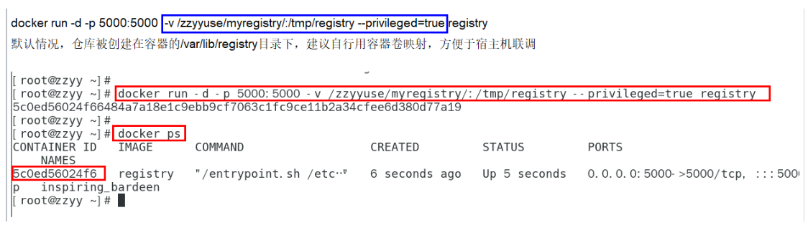

## 7.3 是什么

卷就是目录或文件，存在于一个或多个容器中，由docker挂载到容器，但不属于联合文件系统，因此能够绕过Union File System提供一些用于持续存储或共享数据的特性：卷的设计目的就是数据的持久化，完全独立于容器的生存周期，因此Docker不会在容器删除时删除其挂载的数据卷。

**一句话：有点类似我们Redis里面的rdb和aof文件。**

将docker容器内的数据保存进宿主机的磁盘中，运行一个带有容器卷存储功能的容器实例。

```perl
 docker run -it --privileged=true -v /宿主机绝对路径目录:/容器内目录      镜像名
```

## 7.4 能干嘛

将运用与运行的环境打包镜像，run后形成容器实例运行 ，但是我们对数据的要求希望是持久化的。

Docker容器产生的数据，如果不备份，那么当容器实例删除后，容器内的数据自然也就没有了。为了能保存数据在docker中我们使用卷。

 特点：

1. **数据卷可在容器之间共享或重用数据**
2. **卷中的更改可以直接实时生效，爽**
3. **数据卷中的更改不会包含在镜像的更新中**
4. **数据卷的生命周期一直持续到没有容器使用它为止**

## 7.5 数据卷案例

### 7.5.1 宿主vs容器之间映射添加容器卷

1. `直接命令添加`

```perl
docker run -it --privileged=true -v /宿主机绝对路径目录:/容器内目录 镜像名
```

公式：`docker run -it -v /宿主机目录:/容器内目录 ubuntu /bin/bash`

```perl
docker run -it --name myu3 --privileged=true -v /tmp/myHostData:/tmp/myDockerData ubuntu /bin/bash
```

 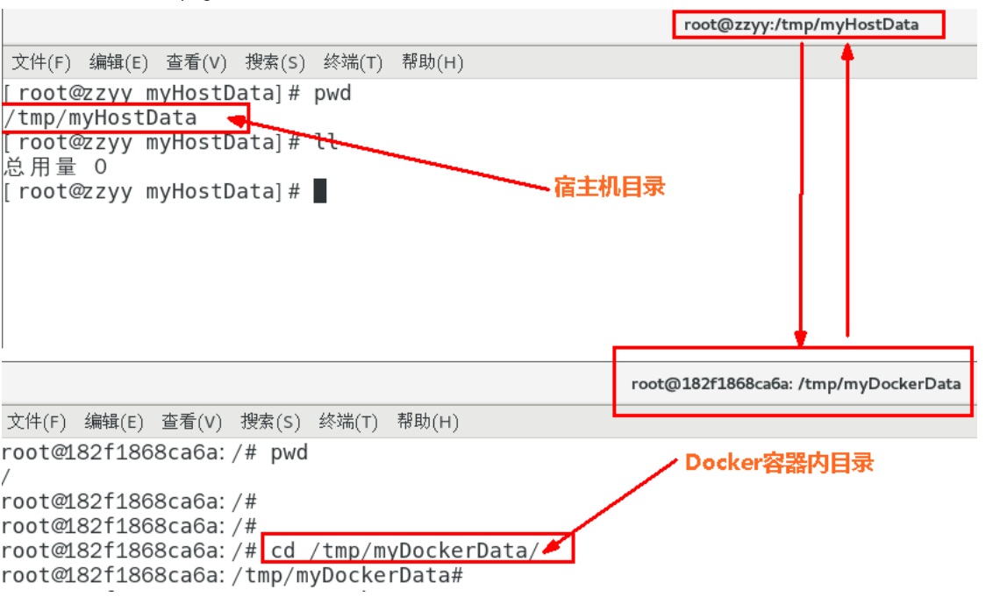

1. **查看数据卷是否挂载成功**

```perl
docker inspect 容器ID
```

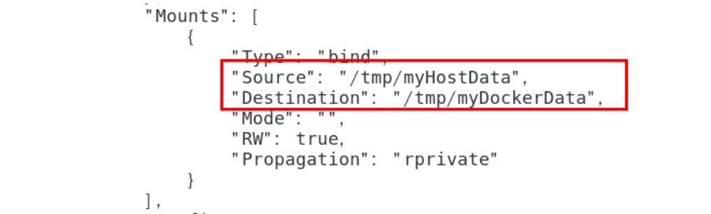

1. **容器和宿主机之间数据共享**

1. 1. docker修改，主机同步获得 。
   2. 主机修改，docker同步获得。
   3. docker容器stop，主机修改，docker容器重启看数据是否同步。

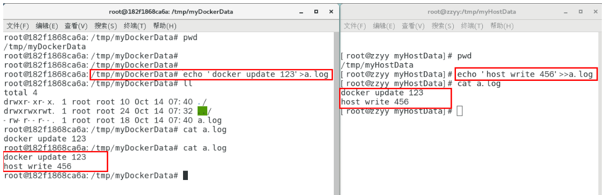

### 7.5.2 读写规则映射添加说明

读写(默认)

```perl
docker run -it --privileged=true -v /宿主机绝对路径目录:/容器内目录:rw 镜像名
```

默认同上案例，默认就是rw

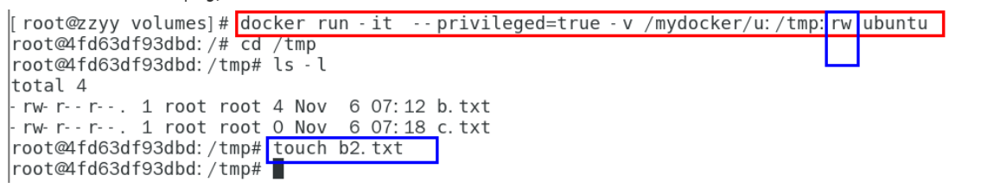

 rw = read + write


只读

容器实例内部被限制，只能读取不能写

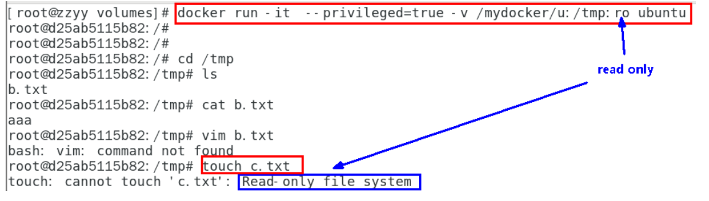

 /容器目录:ro 镜像名               就能完成功能，此时容器自己只能读取不能写  

ro = read only

此时如果宿主机写入内容，可以同步给容器内，容器可以读取到。

```perl
docker run -it --privileged=true -v /宿主机绝对路径目录:/容器内目录:ro 镜像名
```

### 7.5.3 卷的继承和共享

容器1完成和宿主机的映射

```perl
docker run -it  --privileged=true -v /mydocker/u:/tmp --name u1 ubuntu
```

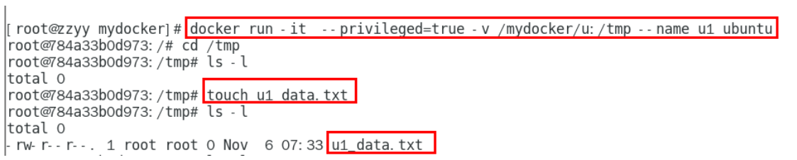

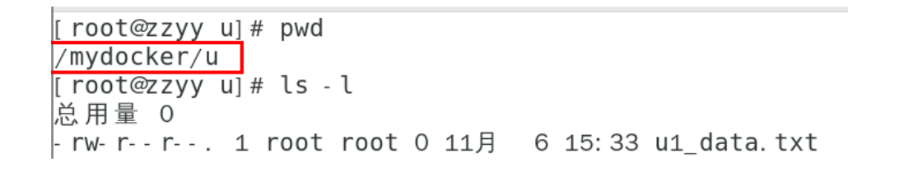

容器2继承容器1的卷规则

```perl
docker run -it  --privileged=true --volumes-from 父类  --name u2 ubuntu
```

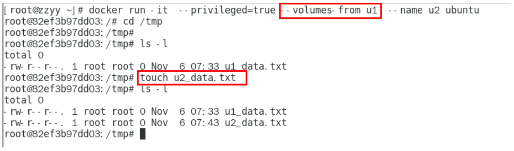

# 8 Docker常规安装简介

## 8.1 总体步骤

1. 搜索镜像
2. 拉取镜像
3. 查看镜像
4. 启动镜像 - 服务端口映射
5. 停止容器
6. 移除容器

## 8.2 安装tomcat

1. **docker hub上面查找tomcat镜像**

```perl
docker search tomcat
```

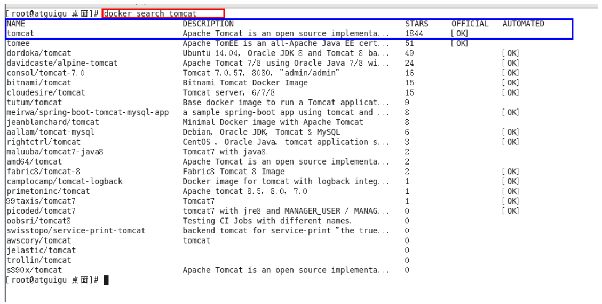

1. **从docker hub上拉取tomcat镜像到本地**

```perl
docker pull tomcat
```

2. **docker images查看是否有拉取到的tomcat**

```perl
docker images
```

3. **使用tomcat镜像创建容器实例(也叫运行镜像)**

```perl
docker run -it -p 8080:8080 tomcat
```

-p 小写，主机端口:docker容器端口

-P 大写，随机分配端口

-i 交互

-t 终端

-d 后台

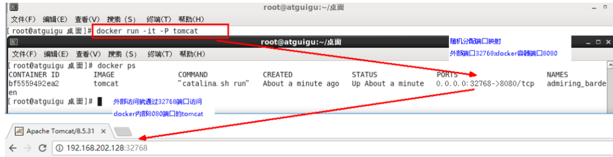

**访问猫首页404**

解决

1. 1. 可能没有映射端口或者没有关闭防火墙
   2. 把webapps.dist目录换成webapps

先成功启动tomcat

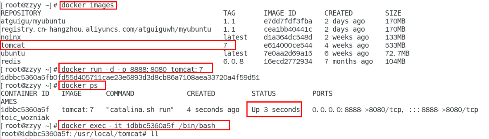

查看webapps 文件夹查看为空

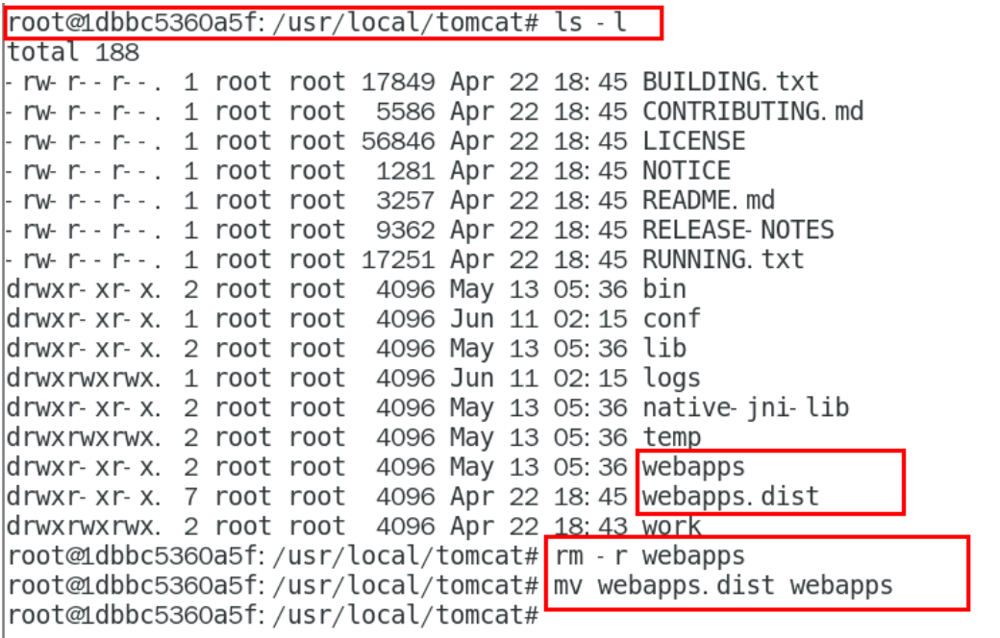

1. **免修改版说明**

```perl
docker pull billygoo/tomcat8-jdk8
docker run -d -p 8080:8080 --name mytomcat8 billygoo/tomcat8-jdk8
```

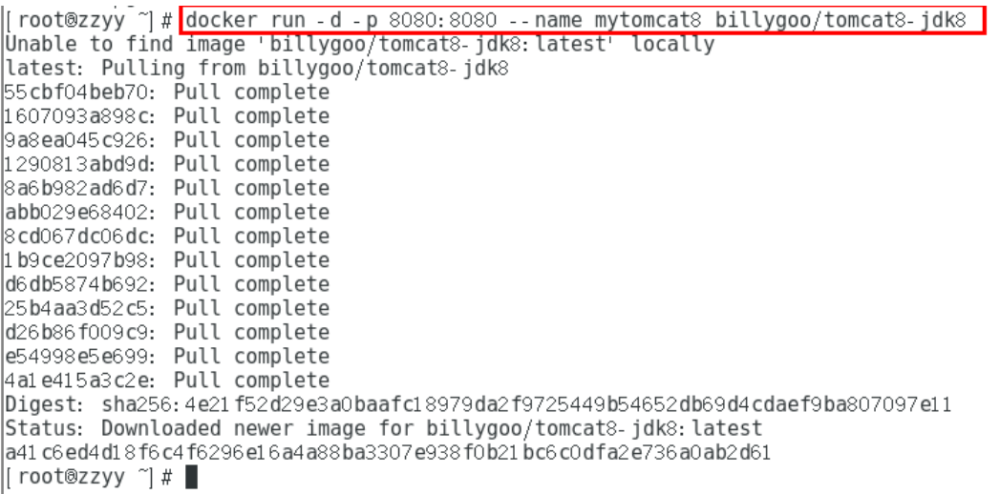

## 8.3 安装mysql

### 8.3.1 docker hub上面查找mysql镜像

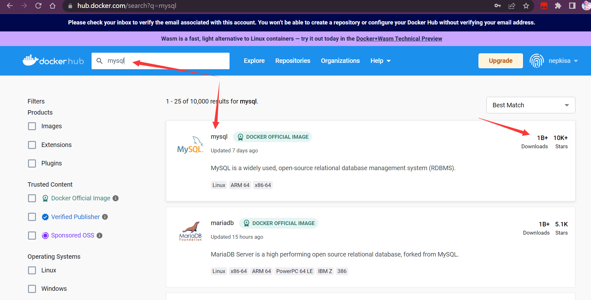

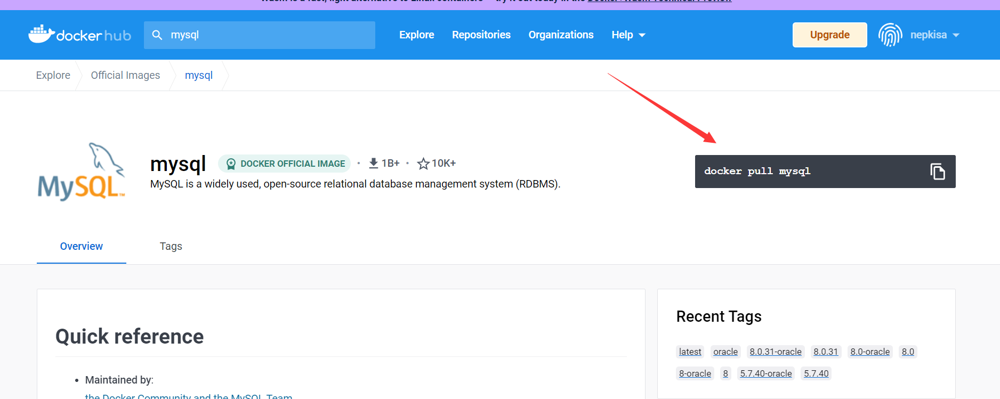

### 8.3.2 从docker hub上(阿里云加速器)拉取mysql镜像到本地标签为5.7

```perl
docker pull mysql:5.7
```

### 8.3.3 使用mysql5.7镜像创建容器(也叫运行镜像)

#### 8.3.3.1 命令出处，哪里来的？

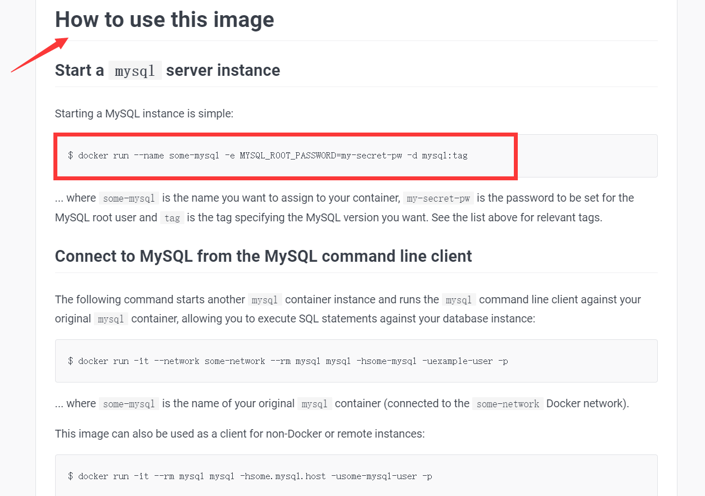

#### 8.3.3.2 简单版

使用mysql镜像

```perl
docker run -p 3309:3306 -e MYSQL_ROOT_PASSWORD=123456 -d mysql:5.7
docker ps
docker exec -it 容器ID /bin/bash
mysql -uroot -p
```

建库建表插入数据

```perl
mysql> create database test;
Query OK, 1 row affected (0.00 sec)

mysql> use test;
Database changed
mysql> create table test(id int,name varchar(50));
Query OK, 0 rows affected (0.00 sec)

mysql> insert into test values(1,'k');
Query OK, 1 row affected (0.00 sec)

```

外部Win10也来连接运行在dokcer上的mysql容器实例服务


问题

插入中文数据试试

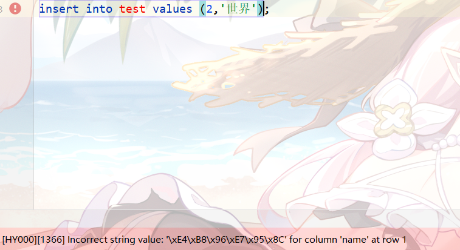

为什么报错?

docker上默认字符集编码隐患,docker里面的mysql容器实例查看，内容如下：

```perl
SHOW VARIABLES LIKE 'character%'

mysql> SHOW VARIABLES LIKE 'character%';
+--------------------------+----------------------------+
| Variable_name            | Value                      |
+--------------------------+----------------------------+
| character_set_client     | latin1                     |
| character_set_connection | latin1                     |
| character_set_database   | latin1                     |
| character_set_filesystem | binary                     |
| character_set_results    | latin1                     |
| character_set_server     | latin1                     |
| character_set_system     | utf8                       |
| character_sets_dir       | /usr/share/mysql/charsets/ |
+--------------------------+----------------------------+
8 rows in set (0.00 sec)
```

删除容器后，里面的mysql数据怎么办？

#### 8.3.3.3 实战版

新建mysql容器实例

```shell
docker run -d -p 3309:3306
--privileged=true \
-v /data/mysql/log:/var/log/mysql \
-v /data/mysql/data:/var/lib/mysql \
-v /data/mysql/conf:/etc/mysql/conf.d \
-e MYSQL_ROOT_PASSWORD=123456  \
--name mysql mysql:5.7
```

新建my.cnf，通过容器卷同步给mysql容器实例

```shell
[client]
default_character_set=utf8
[mysqld]
collation_server = utf8_general_ci
character_set_server = utf8
```

```perl
[root@Neptune ~]# cd /data/mysql/
[root@Neptune mysql]# cat <<! > conf/my.cnf
> [client]
> default_character_set=utf8
> [mysqld]
> collation_server = utf8_general_ci
> character_set_server = utf8
> !
[root@Neptune mysql]# cat conf/my.cnf
[client]
default_character_set=utf8
[mysqld]
collation_server = utf8_general_ci
character_set_server = utf8
```

重新启动mysql容器实例再重新进入并查看字符编码

```perl
docker restart mysql
docker exec -it mysql bash -c "mysql -uroot -p123456 -e "\""SHOW VARIABLES LIKE 'character%';"\"""
```

```shell
[root@Neptune mysql]# docker exec -it mysql bash -c "mysql -uroot -p123456 -e "\""SHOW VARIABLES LIKE 'character%';"\""" mysql: [Warning] Using a password on the command line interface can be insecure.
+--------------------------+----------------------------+
| Variable_name            | Value                      |
+--------------------------+----------------------------+
| character_set_client     | utf8                       |
| character_set_connection | utf8                       |
| character_set_database   | utf8                       |
| character_set_filesystem | binary                     |
| character_set_results    | utf8                       |
| character_set_server     | utf8                       |
| character_set_system     | utf8                       |
| character_sets_dir       | /usr/share/mysql/charsets/ |
+--------------------------+----------------------------+
```

再新建库新建表再插入中文测试

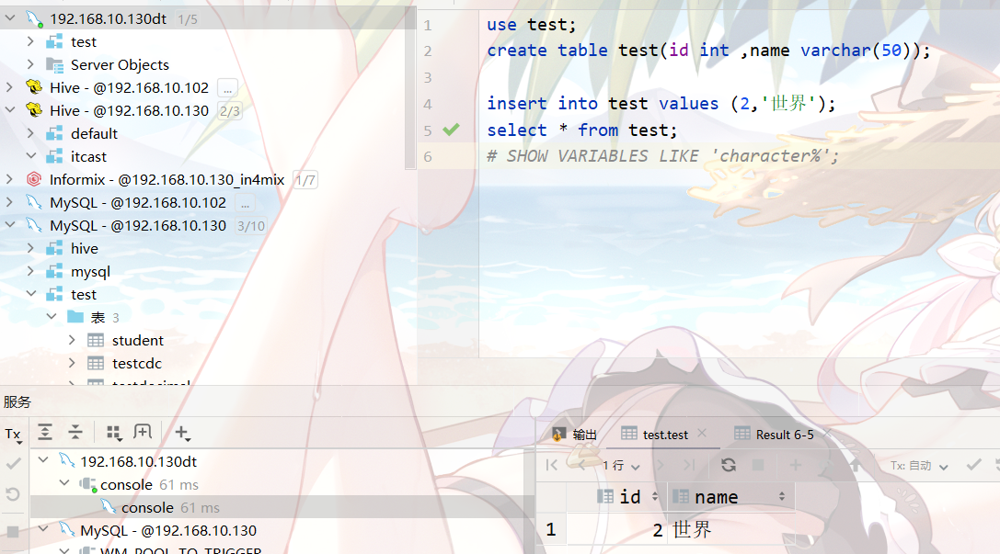

**注意**

==修改字符集编码之前的database  无效，修改字符集操作+重启mysql容器实例==

==之后的database  有效，需要新建==

结论：docker安装完MySQL并run出容器后，建议请先修改完字符集编码后再新建mysql库-表-插数据

假如将当前容器实例删除，再重新来一次，之前建的实例还有吗？

```shell
[root@Neptune mysql]# docker exec -it mysql bash -c "mysql -uroot -p123456 -e "\""select * from test.test;"\"""
mysql: [Warning] Using a password on the command line interface can be insecure.
+------+--------+
| id   | name   |
+------+--------+
|    2 | 世界   |
+------+--------+
[root@Neptune mysql]# docker rm -f mysql
mysql
[root@Neptune mysql]# docker exec -it mysql bash -c "mysql -uroot -p123456 -e "\""select * from test.test;"\"""
Error: No such container: mysql
[root@Neptune mysql]# docker run -d -p 3309:3306 --privileged=true -v /data/mysql/log:/var/log/mysql -v /data/mysql/data:/var/lib/mysql -v /data/mysql/conf:/etc/mysql/conf.d -e MYSQL_ROOT_PASSWORD=123456  --name mysql mysql:5.7
b93c7eee4773f57e6053bfae3a2e76c51c546894612f8d3e71fccd82710c0716
[root@Neptune mysql]# docker exec -it mysql bash -c "mysql -uroot -p123456 -e "\""select * from test.test;"\"""          mysql: [Warning] Using a password on the command line interface can be insecure.
+------+--------+
| id   | name   |
+------+--------+
|    2 | 世界   |
+------+--------+
```

**结论：有，数据做了持久化**

## 8.4 安装redis

### 前置准备

从docker hub上(阿里云加速器)拉取redis镜像到本地标签为6.0.8

```perl
docker pull redis:6.0.8
docker images
```

**命令提醒：容器卷记得加入--privileged=true**

Docker挂载主机目录Docker访问出现cannot open directory .: Permission denied

解决办法：在挂载目录后多加一个--privileged=true参数即可

**在CentOS宿主机下新建目录/data/redis**

```perl
mkdir -p /data/redis
```

**将一个redis.conf文件模板拷贝进/data/redis目录下**

```perl
cp redis.conf /data/redis
```

**/data/redis目录下修改redis.conf文件**

1. 开启redis验证    ==可选==
   **requirepass 123**

2. 允许redis外地连接  ==必须==
   **注释掉 # bind 127.0.0.1**

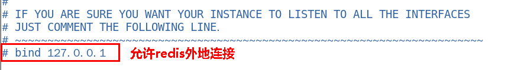

3. ==daemonize no  必须== 
   **将daemonize yes注释起来或者 daemonize no设置，因为该配置和docker run中-d参数冲突，会导致容器一直启动失败**

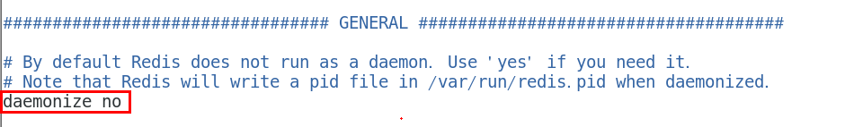

4. 开启redis数据持久化  ==appendonly yes  可选==

### 原始redis.conf

```shell
# Redis configuration file example.
#
# Note that in order to read the configuration file, Redis must be
# started with the file path as first argument:
#
# ./redis-server /path/to/redis.conf
 
# Note on units: when memory size is needed, it is possible to specify
# it in the usual form of 1k 5GB 4M and so forth:
#
# 1k => 1000 bytes
# 1kb => 1024 bytes
# 1m => 1000000 bytes
# 1mb => 1024*1024 bytes
# 1g => 1000000000 bytes
# 1gb => 1024*1024*1024 bytes
#
# units are case insensitive so 1GB 1Gb 1gB are all the same.
 
################################## INCLUDES ###################################
 
# Include one or more other config files here.  This is useful if you
# have a standard template that goes to all Redis servers but also need
# to customize a few per-server settings.  Include files can include
# other files, so use this wisely.
#
# Notice option "include" won't be rewritten by command "CONFIG REWRITE"
# from admin or Redis Sentinel. Since Redis always uses the last processed
# line as value of a configuration directive, you'd better put includes
# at the beginning of this file to avoid overwriting config change at runtime.
#
# If instead you are interested in using includes to override configuration
# options, it is better to use include as the last line.
#
# include /path/to/local.conf
# include /path/to/other.conf
 
################################## MODULES #####################################
 
# Load modules at startup. If the server is not able to load modules
# it will abort. It is possible to use multiple loadmodule directives.
#
# loadmodule /path/to/my_module.so
# loadmodule /path/to/other_module.so
 
################################## NETWORK #####################################
 
# By default, if no "bind" configuration directive is specified, Redis listens
# for connections from all the network interfaces available on the server.
# It is possible to listen to just one or multiple selected interfaces using
# the "bind" configuration directive, followed by one or more IP addresses.
#
# Examples:
#
# bind 192.168.1.100 10.0.0.1
# bind 127.0.0.1 ::1
#
# ~~~ WARNING ~~~ If the computer running Redis is directly exposed to the
# internet, binding to all the interfaces is dangerous and will expose the
# instance to everybody on the internet. So by default we uncomment the
# following bind directive, that will force Redis to listen only into
# the IPv4 loopback interface address (this means Redis will be able to
# accept connections only from clients running into the same computer it
# is running).
#
# IF YOU ARE SURE YOU WANT YOUR INSTANCE TO LISTEN TO ALL THE INTERFACES
# JUST COMMENT THE FOLLOWING LINE.
# ~~~~~~~~~~~~~~~~~~~~~~~~~~~~~~~~~~~~~~~~~~~~~~~~~~~~~~~~~~~~~~~~~~~~~~~~
#bind 127.0.0.1
 
# Protected mode is a layer of security protection, in order to avoid that
# Redis instances left open on the internet are accessed and exploited.
#
# When protected mode is on and if:
#
# 1) The server is not binding explicitly to a set of addresses using the
#    "bind" directive.
# 2) No password is configured.
#
# The server only accepts connections from clients connecting from the
# IPv4 and IPv6 loopback addresses 127.0.0.1 and ::1, and from Unix domain
# sockets.
#
# By default protected mode is enabled. You should disable it only if
# you are sure you want clients from other hosts to connect to Redis
# even if no authentication is configured, nor a specific set of interfaces
# are explicitly listed using the "bind" directive.
protected-mode no
 
# Accept connections on the specified port, default is 6379 (IANA #815344).
# If port 0 is specified Redis will not listen on a TCP socket.
port 6379
 
# TCP listen() backlog.
#
# In high requests-per-second environments you need an high backlog in order
# to avoid slow clients connections issues. Note that the Linux kernel
# will silently truncate it to the value of /proc/sys/net/core/somaxconn so
# make sure to raise both the value of somaxconn and tcp_max_syn_backlog
# in order to get the desired effect.
tcp-backlog 511
 
# Unix socket.
#
# Specify the path for the Unix socket that will be used to listen for
# incoming connections. There is no default, so Redis will not listen
# on a unix socket when not specified.
#
# unixsocket /tmp/redis.sock
# unixsocketperm 700
 
# Close the connection after a client is idle for N seconds (0 to disable)
timeout 0
 
# TCP keepalive.
#
# If non-zero, use SO_KEEPALIVE to send TCP ACKs to clients in absence
# of communication. This is useful for two reasons:
#
# 1) Detect dead peers.
# 2) Take the connection alive from the point of view of network
#    equipment in the middle.
#
# On Linux, the specified value (in seconds) is the period used to send ACKs.
# Note that to close the connection the double of the time is needed.
# On other kernels the period depends on the kernel configuration.
#
# A reasonable value for this option is 300 seconds, which is the new
# Redis default starting with Redis 3.2.1.
tcp-keepalive 300
 
################################# GENERAL #####################################
 
# By default Redis does not run as a daemon. Use 'yes' if you need it.
# Note that Redis will write a pid file in /var/run/redis.pid when daemonized.
daemonize no
 
# If you run Redis from upstart or systemd, Redis can interact with your
# supervision tree. Options:
#   supervised no      - no supervision interaction
#   supervised upstart - signal upstart by putting Redis into SIGSTOP mode
#   supervised systemd - signal systemd by writing READY=1 to $NOTIFY_SOCKET
#   supervised auto    - detect upstart or systemd method based on
#                        UPSTART_JOB or NOTIFY_SOCKET environment variables
# Note: these supervision methods only signal "process is ready."
#       They do not enable continuous liveness pings back to your supervisor.
supervised no
 
# If a pid file is specified, Redis writes it where specified at startup
# and removes it at exit.
#
# When the server runs non daemonized, no pid file is created if none is
# specified in the configuration. When the server is daemonized, the pid file
# is used even if not specified, defaulting to "/var/run/redis.pid".
#
# Creating a pid file is best effort: if Redis is not able to create it
# nothing bad happens, the server will start and run normally.
pidfile /var/run/redis_6379.pid
 
# Specify the server verbosity level.
# This can be one of:
# debug (a lot of information, useful for development/testing)
# verbose (many rarely useful info, but not a mess like the debug level)
# notice (moderately verbose, what you want in production probably)
# warning (only very important / critical messages are logged)
loglevel notice
 
# Specify the log file name. Also the empty string can be used to force
# Redis to log on the standard output. Note that if you use standard
# output for logging but daemonize, logs will be sent to /dev/null
logfile ""
 
# To enable logging to the system logger, just set 'syslog-enabled' to yes,
# and optionally update the other syslog parameters to suit your needs.
# syslog-enabled no
 
# Specify the syslog identity.
# syslog-ident redis
 
# Specify the syslog facility. Must be USER or between LOCAL0-LOCAL7.
# syslog-facility local0
 
# Set the number of databases. The default database is DB 0, you can select
# a different one on a per-connection basis using SELECT <dbid> where
# dbid is a number between 0 and 'databases'-1
databases 16
 
# By default Redis shows an ASCII art logo only when started to log to the
# standard output and if the standard output is a TTY. Basically this means
# that normally a logo is displayed only in interactive sessions.
#
# However it is possible to force the pre-4.0 behavior and always show a
# ASCII art logo in startup logs by setting the following option to yes.
always-show-logo yes
 
################################ SNAPSHOTTING  ################################
#
# Save the DB on disk:
#
#   save <seconds> <changes>
#
#   Will save the DB if both the given number of seconds and the given
#   number of write operations against the DB occurred.
#
#   In the example below the behaviour will be to save:
#   after 900 sec (15 min) if at least 1 key changed
#   after 300 sec (5 min) if at least 10 keys changed
#   after 60 sec if at least 10000 keys changed
#
#   Note: you can disable saving completely by commenting out all "save" lines.
#
#   It is also possible to remove all the previously configured save
#   points by adding a save directive with a single empty string argument
#   like in the following example:
#
#   save ""
 
save 900 1
save 300 10
save 60 10000
 
# By default Redis will stop accepting writes if RDB snapshots are enabled
# (at least one save point) and the latest background save failed.
# This will make the user aware (in a hard way) that data is not persisting
# on disk properly, otherwise chances are that no one will notice and some
# disaster will happen.
#
# If the background saving process will start working again Redis will
# automatically allow writes again.
#
# However if you have setup your proper monitoring of the Redis server
# and persistence, you may want to disable this feature so that Redis will
# continue to work as usual even if there are problems with disk,
# permissions, and so forth.
stop-writes-on-bgsave-error yes
 
# Compress string objects using LZF when dump .rdb databases?
# For default that's set to 'yes' as it's almost always a win.
# If you want to save some CPU in the saving child set it to 'no' but
# the dataset will likely be bigger if you have compressible values or keys.
rdbcompression yes
 
# Since version 5 of RDB a CRC64 checksum is placed at the end of the file.
# This makes the format more resistant to corruption but there is a performance
# hit to pay (around 10%) when saving and loading RDB files, so you can disable it
# for maximum performances.
#
# RDB files created with checksum disabled have a checksum of zero that will
# tell the loading code to skip the check.
rdbchecksum yes
 
# The filename where to dump the DB
dbfilename dump.rdb
 
# The working directory.
#
# The DB will be written inside this directory, with the filename specified
# above using the 'dbfilename' configuration directive.
#
# The Append Only File will also be created inside this directory.
#
# Note that you must specify a directory here, not a file name.
dir ./
 
################################# REPLICATION #################################
 
# Master-Replica replication. Use replicaof to make a Redis instance a copy of
# another Redis server. A few things to understand ASAP about Redis replication.
#
#   +------------------+      +---------------+
#   |      Master      | ---> |    Replica    |
#   | (receive writes) |      |  (exact copy) |
#   +------------------+      +---------------+
#
# 1) Redis replication is asynchronous, but you can configure a master to
#    stop accepting writes if it appears to be not connected with at least
#    a given number of replicas.
# 2) Redis replicas are able to perform a partial resynchronization with the
#    master if the replication link is lost for a relatively small amount of
#    time. You may want to configure the replication backlog size (see the next
#    sections of this file) with a sensible value depending on your needs.
# 3) Replication is automatic and does not need user intervention. After a
#    network partition replicas automatically try to reconnect to masters
#    and resynchronize with them.
#
# replicaof <masterip> <masterport>
 
# If the master is password protected (using the "requirepass" configuration
# directive below) it is possible to tell the replica to authenticate before
# starting the replication synchronization process, otherwise the master will
# refuse the replica request.
#
# masterauth <master-password>
 
# When a replica loses its connection with the master, or when the replication
# is still in progress, the replica can act in two different ways:
#
# 1) if replica-serve-stale-data is set to 'yes' (the default) the replica will
#    still reply to client requests, possibly with out of date data, or the
#    data set may just be empty if this is the first synchronization.
#
# 2) if replica-serve-stale-data is set to 'no' the replica will reply with
#    an error "SYNC with master in progress" to all the kind of commands
#    but to INFO, replicaOF, AUTH, PING, SHUTDOWN, REPLCONF, ROLE, CONFIG,
#    SUBSCRIBE, UNSUBSCRIBE, PSUBSCRIBE, PUNSUBSCRIBE, PUBLISH, PUBSUB,
#    COMMAND, POST, HOST: and LATENCY.
#
replica-serve-stale-data yes
 
# You can configure a replica instance to accept writes or not. Writing against
# a replica instance may be useful to store some ephemeral data (because data
# written on a replica will be easily deleted after resync with the master) but
# may also cause problems if clients are writing to it because of a
# misconfiguration.
#
# Since Redis 2.6 by default replicas are read-only.
#
# Note: read only replicas are not designed to be exposed to untrusted clients
# on the internet. It's just a protection layer against misuse of the instance.
# Still a read only replica exports by default all the administrative commands
# such as CONFIG, DEBUG, and so forth. To a limited extent you can improve
# security of read only replicas using 'rename-command' to shadow all the
# administrative / dangerous commands.
replica-read-only yes
 
# Replication SYNC strategy: disk or socket.
#
# -------------------------------------------------------
# WARNING: DISKLESS REPLICATION IS EXPERIMENTAL CURRENTLY
# -------------------------------------------------------
#
# New replicas and reconnecting replicas that are not able to continue the replication
# process just receiving differences, need to do what is called a "full
# synchronization". An RDB file is transmitted from the master to the replicas.
# The transmission can happen in two different ways:
#
# 1) Disk-backed: The Redis master creates a new process that writes the RDB
#                 file on disk. Later the file is transferred by the parent
#                 process to the replicas incrementally.
# 2) Diskless: The Redis master creates a new process that directly writes the
#              RDB file to replica sockets, without touching the disk at all.
#
# With disk-backed replication, while the RDB file is generated, more replicas
# can be queued and served with the RDB file as soon as the current child producing
# the RDB file finishes its work. With diskless replication instead once
# the transfer starts, new replicas arriving will be queued and a new transfer
# will start when the current one terminates.
#
# When diskless replication is used, the master waits a configurable amount of
# time (in seconds) before starting the transfer in the hope that multiple replicas
# will arrive and the transfer can be parallelized.
#
# With slow disks and fast (large bandwidth) networks, diskless replication
# works better.
repl-diskless-sync no
 
# When diskless replication is enabled, it is possible to configure the delay
# the server waits in order to spawn the child that transfers the RDB via socket
# to the replicas.
#
# This is important since once the transfer starts, it is not possible to serve
# new replicas arriving, that will be queued for the next RDB transfer, so the server
# waits a delay in order to let more replicas arrive.
#
# The delay is specified in seconds, and by default is 5 seconds. To disable
# it entirely just set it to 0 seconds and the transfer will start ASAP.
repl-diskless-sync-delay 5
 
# Replicas send PINGs to server in a predefined interval. It's possible to change
# this interval with the repl_ping_replica_period option. The default value is 10
# seconds.
#
# repl-ping-replica-period 10
 
# The following option sets the replication timeout for:
#
# 1) Bulk transfer I/O during SYNC, from the point of view of replica.
# 2) Master timeout from the point of view of replicas (data, pings).
# 3) Replica timeout from the point of view of masters (REPLCONF ACK pings).
#
# It is important to make sure that this value is greater than the value
# specified for repl-ping-replica-period otherwise a timeout will be detected
# every time there is low traffic between the master and the replica.
#
# repl-timeout 60
 
# Disable TCP_NODELAY on the replica socket after SYNC?
#
# If you select "yes" Redis will use a smaller number of TCP packets and
# less bandwidth to send data to replicas. But this can add a delay for
# the data to appear on the replica side, up to 40 milliseconds with
# Linux kernels using a default configuration.
#
# If you select "no" the delay for data to appear on the replica side will
# be reduced but more bandwidth will be used for replication.
#
# By default we optimize for low latency, but in very high traffic conditions
# or when the master and replicas are many hops away, turning this to "yes" may
# be a good idea.
repl-disable-tcp-nodelay no
 
# Set the replication backlog size. The backlog is a buffer that accumulates
# replica data when replicas are disconnected for some time, so that when a replica
# wants to reconnect again, often a full resync is not needed, but a partial
# resync is enough, just passing the portion of data the replica missed while
# disconnected.
#
# The bigger the replication backlog, the longer the time the replica can be
# disconnected and later be able to perform a partial resynchronization.
#
# The backlog is only allocated once there is at least a replica connected.
#
# repl-backlog-size 1mb
 
# After a master has no longer connected replicas for some time, the backlog
# will be freed. The following option configures the amount of seconds that
# need to elapse, starting from the time the last replica disconnected, for
# the backlog buffer to be freed.
#
# Note that replicas never free the backlog for timeout, since they may be
# promoted to masters later, and should be able to correctly "partially
# resynchronize" with the replicas: hence they should always accumulate backlog.
#
# A value of 0 means to never release the backlog.
#
# repl-backlog-ttl 3600
 
# The replica priority is an integer number published by Redis in the INFO output.
# It is used by Redis Sentinel in order to select a replica to promote into a
# master if the master is no longer working correctly.
#
# A replica with a low priority number is considered better for promotion, so
# for instance if there are three replicas with priority 10, 100, 25 Sentinel will
# pick the one with priority 10, that is the lowest.
#
# However a special priority of 0 marks the replica as not able to perform the
# role of master, so a replica with priority of 0 will never be selected by
# Redis Sentinel for promotion.
#
# By default the priority is 100.
replica-priority 100
 
# It is possible for a master to stop accepting writes if there are less than
# N replicas connected, having a lag less or equal than M seconds.
#
# The N replicas need to be in "online" state.
#
# The lag in seconds, that must be <= the specified value, is calculated from
# the last ping received from the replica, that is usually sent every second.
#
# This option does not GUARANTEE that N replicas will accept the write, but
# will limit the window of exposure for lost writes in case not enough replicas
# are available, to the specified number of seconds.
#
# For example to require at least 3 replicas with a lag <= 10 seconds use:
#
# min-replicas-to-write 3
# min-replicas-max-lag 10
#
# Setting one or the other to 0 disables the feature.
#
# By default min-replicas-to-write is set to 0 (feature disabled) and
# min-replicas-max-lag is set to 10.
 
# A Redis master is able to list the address and port of the attached
# replicas in different ways. For example the "INFO replication" section
# offers this information, which is used, among other tools, by
# Redis Sentinel in order to discover replica instances.
# Another place where this info is available is in the output of the
# "ROLE" command of a master.
#
# The listed IP and address normally reported by a replica is obtained
# in the following way:
#
#   IP: The address is auto detected by checking the peer address
#   of the socket used by the replica to connect with the master.
#
#   Port: The port is communicated by the replica during the replication
#   handshake, and is normally the port that the replica is using to
#   listen for connections.
#
# However when port forwarding or Network Address Translation (NAT) is
# used, the replica may be actually reachable via different IP and port
# pairs. The following two options can be used by a replica in order to
# report to its master a specific set of IP and port, so that both INFO
# and ROLE will report those values.
#
# There is no need to use both the options if you need to override just
# the port or the IP address.
#
# replica-announce-ip 5.5.5.5
# replica-announce-port 1234
 
################################## SECURITY ###################################
 
# Require clients to issue AUTH <PASSWORD> before processing any other
# commands.  This might be useful in environments in which you do not trust
# others with access to the host running redis-server.
#
# This should stay commented out for backward compatibility and because most
# people do not need auth (e.g. they run their own servers).
#
# Warning: since Redis is pretty fast an outside user can try up to
# 150k passwords per second against a good box. This means that you should
# use a very strong password otherwise it will be very easy to break.
#
# requirepass foobared
 
# Command renaming.
#
# It is possible to change the name of dangerous commands in a shared
# environment. For instance the CONFIG command may be renamed into something
# hard to guess so that it will still be available for internal-use tools
# but not available for general clients.
#
# Example:
#
# rename-command CONFIG b840fc02d524045429941cc15f59e41cb7be6c52
#
# It is also possible to completely kill a command by renaming it into
# an empty string:
#
# rename-command CONFIG ""
#
# Please note that changing the name of commands that are logged into the
# AOF file or transmitted to replicas may cause problems.
 
################################### CLIENTS ####################################
 
# Set the max number of connected clients at the same time. By default
# this limit is set to 10000 clients, however if the Redis server is not
# able to configure the process file limit to allow for the specified limit
# the max number of allowed clients is set to the current file limit
# minus 32 (as Redis reserves a few file descriptors for internal uses).
#
# Once the limit is reached Redis will close all the new connections sending
# an error 'max number of clients reached'.
#
# maxclients 10000
 
############################## MEMORY MANAGEMENT ################################
 
# Set a memory usage limit to the specified amount of bytes.
# When the memory limit is reached Redis will try to remove keys
# according to the eviction policy selected (see maxmemory-policy).
#
# If Redis can't remove keys according to the policy, or if the policy is
# set to 'noeviction', Redis will start to reply with errors to commands
# that would use more memory, like SET, LPUSH, and so on, and will continue
# to reply to read-only commands like GET.
#
# This option is usually useful when using Redis as an LRU or LFU cache, or to
# set a hard memory limit for an instance (using the 'noeviction' policy).
#
# WARNING: If you have replicas attached to an instance with maxmemory on,
# the size of the output buffers needed to feed the replicas are subtracted
# from the used memory count, so that network problems / resyncs will
# not trigger a loop where keys are evicted, and in turn the output
# buffer of replicas is full with DELs of keys evicted triggering the deletion
# of more keys, and so forth until the database is completely emptied.
#
# In short... if you have replicas attached it is suggested that you set a lower
# limit for maxmemory so that there is some free RAM on the system for replica
# output buffers (but this is not needed if the policy is 'noeviction').
#
# maxmemory <bytes>
 
# MAXMEMORY POLICY: how Redis will select what to remove when maxmemory
# is reached. You can select among five behaviors:
#
# volatile-lru -> Evict using approximated LRU among the keys with an expire set.
# allkeys-lru -> Evict any key using approximated LRU.
# volatile-lfu -> Evict using approximated LFU among the keys with an expire set.
# allkeys-lfu -> Evict any key using approximated LFU.
# volatile-random -> Remove a random key among the ones with an expire set.
# allkeys-random -> Remove a random key, any key.
# volatile-ttl -> Remove the key with the nearest expire time (minor TTL)
# noeviction -> Don't evict anything, just return an error on write operations.
#
# LRU means Least Recently Used
# LFU means Least Frequently Used
#
# Both LRU, LFU and volatile-ttl are implemented using approximated
# randomized algorithms.
#
# Note: with any of the above policies, Redis will return an error on write
#       operations, when there are no suitable keys for eviction.
#
#       At the date of writing these commands are: set setnx setex append
#       incr decr rpush lpush rpushx lpushx linsert lset rpoplpush sadd
#       sinter sinterstore sunion sunionstore sdiff sdiffstore zadd zincrby
#       zunionstore zinterstore hset hsetnx hmset hincrby incrby decrby
#       getset mset msetnx exec sort
#
# The default is:
#
# maxmemory-policy noeviction
 
# LRU, LFU and minimal TTL algorithms are not precise algorithms but approximated
# algorithms (in order to save memory), so you can tune it for speed or
# accuracy. For default Redis will check five keys and pick the one that was
# used less recently, you can change the sample size using the following
# configuration directive.
#
# The default of 5 produces good enough results. 10 Approximates very closely
# true LRU but costs more CPU. 3 is faster but not very accurate.
#
# maxmemory-samples 5
 
# Starting from Redis 5, by default a replica will ignore its maxmemory setting
# (unless it is promoted to master after a failover or manually). It means
# that the eviction of keys will be just handled by the master, sending the
# DEL commands to the replica as keys evict in the master side.
#
# This behavior ensures that masters and replicas stay consistent, and is usually
# what you want, however if your replica is writable, or you want the replica to have
# a different memory setting, and you are sure all the writes performed to the
# replica are idempotent, then you may change this default (but be sure to understand
# what you are doing).
#
# Note that since the replica by default does not evict, it may end using more
# memory than the one set via maxmemory (there are certain buffers that may
# be larger on the replica, or data structures may sometimes take more memory and so
# forth). So make sure you monitor your replicas and make sure they have enough
# memory to never hit a real out-of-memory condition before the master hits
# the configured maxmemory setting.
#
# replica-ignore-maxmemory yes
 
############################# LAZY FREEING ####################################
 
# Redis has two primitives to delete keys. One is called DEL and is a blocking
# deletion of the object. It means that the server stops processing new commands
# in order to reclaim all the memory associated with an object in a synchronous
# way. If the key deleted is associated with a small object, the time needed
# in order to execute the DEL command is very small and comparable to most other
# O(1) or O(log_N) commands in Redis. However if the key is associated with an
# aggregated value containing millions of elements, the server can block for
# a long time (even seconds) in order to complete the operation.
#
# For the above reasons Redis also offers non blocking deletion primitives
# such as UNLINK (non blocking DEL) and the ASYNC option of FLUSHALL and
# FLUSHDB commands, in order to reclaim memory in background. Those commands
# are executed in constant time. Another thread will incrementally free the
# object in the background as fast as possible.
#
# DEL, UNLINK and ASYNC option of FLUSHALL and FLUSHDB are user-controlled.
# It's up to the design of the application to understand when it is a good
# idea to use one or the other. However the Redis server sometimes has to
# delete keys or flush the whole database as a side effect of other operations.
# Specifically Redis deletes objects independently of a user call in the
# following scenarios:
#
# 1) On eviction, because of the maxmemory and maxmemory policy configurations,
#    in order to make room for new data, without going over the specified
#    memory limit.
# 2) Because of expire: when a key with an associated time to live (see the
#    EXPIRE command) must be deleted from memory.
# 3) Because of a side effect of a command that stores data on a key that may
#    already exist. For example the RENAME command may delete the old key
#    content when it is replaced with another one. Similarly SUNIONSTORE
#    or SORT with STORE option may delete existing keys. The SET command
#    itself removes any old content of the specified key in order to replace
#    it with the specified string.
# 4) During replication, when a replica performs a full resynchronization with
#    its master, the content of the whole database is removed in order to
#    load the RDB file just transferred.
#
# In all the above cases the default is to delete objects in a blocking way,
# like if DEL was called. However you can configure each case specifically
# in order to instead release memory in a non-blocking way like if UNLINK
# was called, using the following configuration directives:
 
lazyfree-lazy-eviction no
lazyfree-lazy-expire no
lazyfree-lazy-server-del no
replica-lazy-flush no
 
############################## APPEND ONLY MODE ###############################
 
# By default Redis asynchronously dumps the dataset on disk. This mode is
# good enough in many applications, but an issue with the Redis process or
# a power outage may result into a few minutes of writes lost (depending on
# the configured save points).
#
# The Append Only File is an alternative persistence mode that provides
# much better durability. For instance using the default data fsync policy
# (see later in the config file) Redis can lose just one second of writes in a
# dramatic event like a server power outage, or a single write if something
# wrong with the Redis process itself happens, but the operating system is
# still running correctly.
#
# AOF and RDB persistence can be enabled at the same time without problems.
# If the AOF is enabled on startup Redis will load the AOF, that is the file
# with the better durability guarantees.
#
# Please check http://redis.io/topics/persistence for more information.
 
appendonly no
 
# The name of the append only file (default: "appendonly.aof")
 
appendfilename "appendonly.aof"
 
# The fsync() call tells the Operating System to actually write data on disk
# instead of waiting for more data in the output buffer. Some OS will really flush
# data on disk, some other OS will just try to do it ASAP.
#
# Redis supports three different modes:
#
# no: don't fsync, just let the OS flush the data when it wants. Faster.
# always: fsync after every write to the append only log. Slow, Safest.
# everysec: fsync only one time every second. Compromise.
#
# The default is "everysec", as that's usually the right compromise between
# speed and data safety. It's up to you to understand if you can relax this to
# "no" that will let the operating system flush the output buffer when
# it wants, for better performances (but if you can live with the idea of
# some data loss consider the default persistence mode that's snapshotting),
# or on the contrary, use "always" that's very slow but a bit safer than
# everysec.
#
# More details please check the following article:
# http://antirez.com/post/redis-persistence-demystified.html
#
# If unsure, use "everysec".
 
# appendfsync always
appendfsync everysec
# appendfsync no
 
# When the AOF fsync policy is set to always or everysec, and a background
# saving process (a background save or AOF log background rewriting) is
# performing a lot of I/O against the disk, in some Linux configurations
# Redis may block too long on the fsync() call. Note that there is no fix for
# this currently, as even performing fsync in a different thread will block
# our synchronous write(2) call.
#
# In order to mitigate this problem it's possible to use the following option
# that will prevent fsync() from being called in the main process while a
# BGSAVE or BGREWRITEAOF is in progress.
#
# This means that while another child is saving, the durability of Redis is
# the same as "appendfsync none". In practical terms, this means that it is
# possible to lose up to 30 seconds of log in the worst scenario (with the
# default Linux settings).
#
# If you have latency problems turn this to "yes". Otherwise leave it as
# "no" that is the safest pick from the point of view of durability.
 
no-appendfsync-on-rewrite no
 
# Automatic rewrite of the append only file.
# Redis is able to automatically rewrite the log file implicitly calling
# BGREWRITEAOF when the AOF log size grows by the specified percentage.
#
# This is how it works: Redis remembers the size of the AOF file after the
# latest rewrite (if no rewrite has happened since the restart, the size of
# the AOF at startup is used).
#
# This base size is compared to the current size. If the current size is
# bigger than the specified percentage, the rewrite is triggered. Also
# you need to specify a minimal size for the AOF file to be rewritten, this
# is useful to avoid rewriting the AOF file even if the percentage increase
# is reached but it is still pretty small.
#
# Specify a percentage of zero in order to disable the automatic AOF
# rewrite feature.
 
auto-aof-rewrite-percentage 100
auto-aof-rewrite-min-size 64mb
 
# An AOF file may be found to be truncated at the end during the Redis
# startup process, when the AOF data gets loaded back into memory.
# This may happen when the system where Redis is running
# crashes, especially when an ext4 filesystem is mounted without the
# data=ordered option (however this can't happen when Redis itself
# crashes or aborts but the operating system still works correctly).
#
# Redis can either exit with an error when this happens, or load as much
# data as possible (the default now) and start if the AOF file is found
# to be truncated at the end. The following option controls this behavior.
#
# If aof-load-truncated is set to yes, a truncated AOF file is loaded and
# the Redis server starts emitting a log to inform the user of the event.
# Otherwise if the option is set to no, the server aborts with an error
# and refuses to start. When the option is set to no, the user requires
# to fix the AOF file using the "redis-check-aof" utility before to restart
# the server.
#
# Note that if the AOF file will be found to be corrupted in the middle
# the server will still exit with an error. This option only applies when
# Redis will try to read more data from the AOF file but not enough bytes
# will be found.
aof-load-truncated yes
 
# When rewriting the AOF file, Redis is able to use an RDB preamble in the
# AOF file for faster rewrites and recoveries. When this option is turned
# on the rewritten AOF file is composed of two different stanzas:
#
#   [RDB file][AOF tail]
#
# When loading Redis recognizes that the AOF file starts with the "REDIS"
# string and loads the prefixed RDB file, and continues loading the AOF
# tail.
aof-use-rdb-preamble yes
 
################################ LUA SCRIPTING  ###############################
 
# Max execution time of a Lua script in milliseconds.
#
# If the maximum execution time is reached Redis will log that a script is
# still in execution after the maximum allowed time and will start to
# reply to queries with an error.
#
# When a long running script exceeds the maximum execution time only the
# SCRIPT KILL and SHUTDOWN NOSAVE commands are available. The first can be
# used to stop a script that did not yet called write commands. The second
# is the only way to shut down the server in the case a write command was
# already issued by the script but the user doesn't want to wait for the natural
# termination of the script.
#
# Set it to 0 or a negative value for unlimited execution without warnings.
lua-time-limit 5000
 
################################ REDIS CLUSTER  ###############################
 
# Normal Redis instances can't be part of a Redis Cluster; only nodes that are
# started as cluster nodes can. In order to start a Redis instance as a
# cluster node enable the cluster support uncommenting the following:
#
# cluster-enabled yes
 
# Every cluster node has a cluster configuration file. This file is not
# intended to be edited by hand. It is created and updated by Redis nodes.
# Every Redis Cluster node requires a different cluster configuration file.
# Make sure that instances running in the same system do not have
# overlapping cluster configuration file names.
#
# cluster-config-file nodes-6379.conf
 
# Cluster node timeout is the amount of milliseconds a node must be unreachable
# for it to be considered in failure state.
# Most other internal time limits are multiple of the node timeout.
#
# cluster-node-timeout 15000
 
# A replica of a failing master will avoid to start a failover if its data
# looks too old.
#
# There is no simple way for a replica to actually have an exact measure of
# its "data age", so the following two checks are performed:
#
# 1) If there are multiple replicas able to failover, they exchange messages
#    in order to try to give an advantage to the replica with the best
#    replication offset (more data from the master processed).
#    Replicas will try to get their rank by offset, and apply to the start
#    of the failover a delay proportional to their rank.
#
# 2) Every single replica computes the time of the last interaction with
#    its master. This can be the last ping or command received (if the master
#    is still in the "connected" state), or the time that elapsed since the
#    disconnection with the master (if the replication link is currently down).
#    If the last interaction is too old, the replica will not try to failover
#    at all.
#
# The point "2" can be tuned by user. Specifically a replica will not perform
# the failover if, since the last interaction with the master, the time
# elapsed is greater than:
#
#   (node-timeout * replica-validity-factor) + repl-ping-replica-period
#
# So for example if node-timeout is 30 seconds, and the replica-validity-factor
# is 10, and assuming a default repl-ping-replica-period of 10 seconds, the
# replica will not try to failover if it was not able to talk with the master
# for longer than 310 seconds.
#
# A large replica-validity-factor may allow replicas with too old data to failover
# a master, while a too small value may prevent the cluster from being able to
# elect a replica at all.
#
# For maximum availability, it is possible to set the replica-validity-factor
# to a value of 0, which means, that replicas will always try to failover the
# master regardless of the last time they interacted with the master.
# (However they'll always try to apply a delay proportional to their
# offset rank).
#
# Zero is the only value able to guarantee that when all the partitions heal
# the cluster will always be able to continue.
#
# cluster-replica-validity-factor 10
 
# Cluster replicas are able to migrate to orphaned masters, that are masters
# that are left without working replicas. This improves the cluster ability
# to resist to failures as otherwise an orphaned master can't be failed over
# in case of failure if it has no working replicas.
#
# Replicas migrate to orphaned masters only if there are still at least a
# given number of other working replicas for their old master. This number
# is the "migration barrier". A migration barrier of 1 means that a replica
# will migrate only if there is at least 1 other working replica for its master
# and so forth. It usually reflects the number of replicas you want for every
# master in your cluster.
#
# Default is 1 (replicas migrate only if their masters remain with at least
# one replica). To disable migration just set it to a very large value.
# A value of 0 can be set but is useful only for debugging and dangerous
# in production.
#
# cluster-migration-barrier 1
 
# By default Redis Cluster nodes stop accepting queries if they detect there
# is at least an hash slot uncovered (no available node is serving it).
# This way if the cluster is partially down (for example a range of hash slots
# are no longer covered) all the cluster becomes, eventually, unavailable.
# It automatically returns available as soon as all the slots are covered again.
#
# However sometimes you want the subset of the cluster which is working,
# to continue to accept queries for the part of the key space that is still
# covered. In order to do so, just set the cluster-require-full-coverage
# option to no.
#
# cluster-require-full-coverage yes
 
# This option, when set to yes, prevents replicas from trying to failover its
# master during master failures. However the master can still perform a
# manual failover, if forced to do so.
#
# This is useful in different scenarios, especially in the case of multiple
# data center operations, where we want one side to never be promoted if not
# in the case of a total DC failure.
#
# cluster-replica-no-failover no
 
# In order to setup your cluster make sure to read the documentation
# available at http://redis.io web site.
 
########################## CLUSTER DOCKER/NAT support  ########################
 
# In certain deployments, Redis Cluster nodes address discovery fails, because
# addresses are NAT-ted or because ports are forwarded (the typical case is
# Docker and other containers).
#
# In order to make Redis Cluster working in such environments, a static
# configuration where each node knows its public address is needed. The
# following two options are used for this scope, and are:
#
# * cluster-announce-ip
# * cluster-announce-port
# * cluster-announce-bus-port
#
# Each instruct the node about its address, client port, and cluster message
# bus port. The information is then published in the header of the bus packets
# so that other nodes will be able to correctly map the address of the node
# publishing the information.
#
# If the above options are not used, the normal Redis Cluster auto-detection
# will be used instead.
#
# Note that when remapped, the bus port may not be at the fixed offset of
# clients port + 10000, so you can specify any port and bus-port depending
# on how they get remapped. If the bus-port is not set, a fixed offset of
# 10000 will be used as usually.
#
# Example:
#
# cluster-announce-ip 10.1.1.5
# cluster-announce-port 6379
# cluster-announce-bus-port 6380
 
################################## SLOW LOG ###################################
 
# The Redis Slow Log is a system to log queries that exceeded a specified
# execution time. The execution time does not include the I/O operations
# like talking with the client, sending the reply and so forth,
# but just the time needed to actually execute the command (this is the only
# stage of command execution where the thread is blocked and can not serve
# other requests in the meantime).
#
# You can configure the slow log with two parameters: one tells Redis
# what is the execution time, in microseconds, to exceed in order for the
# command to get logged, and the other parameter is the length of the
# slow log. When a new command is logged the oldest one is removed from the
# queue of logged commands.
 
# The following time is expressed in microseconds, so 1000000 is equivalent
# to one second. Note that a negative number disables the slow log, while
# a value of zero forces the logging of every command.
slowlog-log-slower-than 10000
 
# There is no limit to this length. Just be aware that it will consume memory.
# You can reclaim memory used by the slow log with SLOWLOG RESET.
slowlog-max-len 128
 
################################ LATENCY MONITOR ##############################
 
# The Redis latency monitoring subsystem samples different operations
# at runtime in order to collect data related to possible sources of
# latency of a Redis instance.
#
# Via the LATENCY command this information is available to the user that can
# print graphs and obtain reports.
#
# The system only logs operations that were performed in a time equal or
# greater than the amount of milliseconds specified via the
# latency-monitor-threshold configuration directive. When its value is set
# to zero, the latency monitor is turned off.
#
# By default latency monitoring is disabled since it is mostly not needed
# if you don't have latency issues, and collecting data has a performance
# impact, that while very small, can be measured under big load. Latency
# monitoring can easily be enabled at runtime using the command
# "CONFIG SET latency-monitor-threshold <milliseconds>" if needed.
latency-monitor-threshold 0
 
############################# EVENT NOTIFICATION ##############################
 
# Redis can notify Pub/Sub clients about events happening in the key space.
# This feature is documented at http://redis.io/topics/notifications
#
# For instance if keyspace events notification is enabled, and a client
# performs a DEL operation on key "foo" stored in the Database 0, two
# messages will be published via Pub/Sub:
#
# PUBLISH __keyspace@0__:foo del
# PUBLISH __keyevent@0__:del foo
#
# It is possible to select the events that Redis will notify among a set
# of classes. Every class is identified by a single character:
#
#  K     Keyspace events, published with __keyspace@<db>__ prefix.
#  E     Keyevent events, published with __keyevent@<db>__ prefix.
#  g     Generic commands (non-type specific) like DEL, EXPIRE, RENAME, ...
#  $     String commands
#  l     List commands
#  s     Set commands
#  h     Hash commands
#  z     Sorted set commands
#  x     Expired events (events generated every time a key expires)
#  e     Evicted events (events generated when a key is evicted for maxmemory)
#  A     Alias for g$lshzxe, so that the "AKE" string means all the events.
#
#  The "notify-keyspace-events" takes as argument a string that is composed
#  of zero or multiple characters. The empty string means that notifications
#  are disabled.
#
#  Example: to enable list and generic events, from the point of view of the
#           event name, use:
#
#  notify-keyspace-events Elg
#
#  Example 2: to get the stream of the expired keys subscribing to channel
#             name __keyevent@0__:expired use:
#
  notify-keyspace-events Ex
#
#  By default all notifications are disabled because most users don't need
#  this feature and the feature has some overhead. Note that if you don't
#  specify at least one of K or E, no events will be delivered.
#notify-keyspace-events ""
 
############################### ADVANCED CONFIG ###############################
 
# Hashes are encoded using a memory efficient data structure when they have a
# small number of entries, and the biggest entry does not exceed a given
# threshold. These thresholds can be configured using the following directives.
hash-max-ziplist-entries 512
hash-max-ziplist-value 64
 
# Lists are also encoded in a special way to save a lot of space.
# The number of entries allowed per internal list node can be specified
# as a fixed maximum size or a maximum number of elements.
# For a fixed maximum size, use -5 through -1, meaning:
# -5: max size: 64 Kb  <-- not recommended for normal workloads
# -4: max size: 32 Kb  <-- not recommended
# -3: max size: 16 Kb  <-- probably not recommended
# -2: max size: 8 Kb   <-- good
# -1: max size: 4 Kb   <-- good
# Positive numbers mean store up to _exactly_ that number of elements
# per list node.
# The highest performing option is usually -2 (8 Kb size) or -1 (4 Kb size),
# but if your use case is unique, adjust the settings as necessary.
list-max-ziplist-size -2
 
# Lists may also be compressed.
# Compress depth is the number of quicklist ziplist nodes from *each* side of
# the list to *exclude* from compression.  The head and tail of the list
# are always uncompressed for fast push/pop operations.  Settings are:
# 0: disable all list compression
# 1: depth 1 means "don't start compressing until after 1 node into the list,
#    going from either the head or tail"
#    So: [head]->node->node->...->node->[tail]
#    [head], [tail] will always be uncompressed; inner nodes will compress.
# 2: [head]->[next]->node->node->...->node->[prev]->[tail]
#    2 here means: don't compress head or head->next or tail->prev or tail,
#    but compress all nodes between them.
# 3: [head]->[next]->[next]->node->node->...->node->[prev]->[prev]->[tail]
# etc.
list-compress-depth 0
 
# Sets have a special encoding in just one case: when a set is composed
# of just strings that happen to be integers in radix 10 in the range
# of 64 bit signed integers.
# The following configuration setting sets the limit in the size of the
# set in order to use this special memory saving encoding.
set-max-intset-entries 512
 
# Similarly to hashes and lists, sorted sets are also specially encoded in
# order to save a lot of space. This encoding is only used when the length and
# elements of a sorted set are below the following limits:
zset-max-ziplist-entries 128
zset-max-ziplist-value 64
 
# HyperLogLog sparse representation bytes limit. The limit includes the
# 16 bytes header. When an HyperLogLog using the sparse representation crosses
# this limit, it is converted into the dense representation.
#
# A value greater than 16000 is totally useless, since at that point the
# dense representation is more memory efficient.
#
# The suggested value is ~ 3000 in order to have the benefits of
# the space efficient encoding without slowing down too much PFADD,
# which is O(N) with the sparse encoding. The value can be raised to
# ~ 10000 when CPU is not a concern, but space is, and the data set is
# composed of many HyperLogLogs with cardinality in the 0 - 15000 range.
hll-sparse-max-bytes 3000
 
# Streams macro node max size / items. The stream data structure is a radix
# tree of big nodes that encode multiple items inside. Using this configuration
# it is possible to configure how big a single node can be in bytes, and the
# maximum number of items it may contain before switching to a new node when
# appending new stream entries. If any of the following settings are set to
# zero, the limit is ignored, so for instance it is possible to set just a
# max entires limit by setting max-bytes to 0 and max-entries to the desired
# value.
stream-node-max-bytes 4096
stream-node-max-entries 100
 
# Active rehashing uses 1 millisecond every 100 milliseconds of CPU time in
# order to help rehashing the main Redis hash table (the one mapping top-level
# keys to values). The hash table implementation Redis uses (see dict.c)
# performs a lazy rehashing: the more operation you run into a hash table
# that is rehashing, the more rehashing "steps" are performed, so if the
# server is idle the rehashing is never complete and some more memory is used
# by the hash table.
#
# The default is to use this millisecond 10 times every second in order to
# actively rehash the main dictionaries, freeing memory when possible.
#
# If unsure:
# use "activerehashing no" if you have hard latency requirements and it is
# not a good thing in your environment that Redis can reply from time to time
# to queries with 2 milliseconds delay.
#
# use "activerehashing yes" if you don't have such hard requirements but
# want to free memory asap when possible.
activerehashing yes
 
# The client output buffer limits can be used to force disconnection of clients
# that are not reading data from the server fast enough for some reason (a
# common reason is that a Pub/Sub client can't consume messages as fast as the
# publisher can produce them).
#
# The limit can be set differently for the three different classes of clients:
#
# normal -> normal clients including MONITOR clients
# replica  -> replica clients
# pubsub -> clients subscribed to at least one pubsub channel or pattern
#
# The syntax of every client-output-buffer-limit directive is the following:
#
# client-output-buffer-limit <class> <hard limit> <soft limit> <soft seconds>
#
# A client is immediately disconnected once the hard limit is reached, or if
# the soft limit is reached and remains reached for the specified number of
# seconds (continuously).
# So for instance if the hard limit is 32 megabytes and the soft limit is
# 16 megabytes / 10 seconds, the client will get disconnected immediately
# if the size of the output buffers reach 32 megabytes, but will also get
# disconnected if the client reaches 16 megabytes and continuously overcomes
# the limit for 10 seconds.
#
# By default normal clients are not limited because they don't receive data
# without asking (in a push way), but just after a request, so only
# asynchronous clients may create a scenario where data is requested faster
# than it can read.
#
# Instead there is a default limit for pubsub and replica clients, since
# subscribers and replicas receive data in a push fashion.
#
# Both the hard or the soft limit can be disabled by setting them to zero.
client-output-buffer-limit normal 0 0 0
client-output-buffer-limit replica 256mb 64mb 60
client-output-buffer-limit pubsub 32mb 8mb 60
 
# Client query buffers accumulate new commands. They are limited to a fixed
# amount by default in order to avoid that a protocol desynchronization (for
# instance due to a bug in the client) will lead to unbound memory usage in
# the query buffer. However you can configure it here if you have very special
# needs, such us huge multi/exec requests or alike.
#
# client-query-buffer-limit 1gb
 
# In the Redis protocol, bulk requests, that are, elements representing single
# strings, are normally limited ot 512 mb. However you can change this limit
# here.
#
# proto-max-bulk-len 512mb
 
# Redis calls an internal function to perform many background tasks, like
# closing connections of clients in timeout, purging expired keys that are
# never requested, and so forth.
#
# Not all tasks are performed with the same frequency, but Redis checks for
# tasks to perform according to the specified "hz" value.
#
# By default "hz" is set to 10. Raising the value will use more CPU when
# Redis is idle, but at the same time will make Redis more responsive when
# there are many keys expiring at the same time, and timeouts may be
# handled with more precision.
#
# The range is between 1 and 500, however a value over 100 is usually not
# a good idea. Most users should use the default of 10 and raise this up to
# 100 only in environments where very low latency is required.
hz 10
 
# Normally it is useful to have an HZ value which is proportional to the
# number of clients connected. This is useful in order, for instance, to
# avoid too many clients are processed for each background task invocation
# in order to avoid latency spikes.
#
# Since the default HZ value by default is conservatively set to 10, Redis
# offers, and enables by default, the ability to use an adaptive HZ value
# which will temporary raise when there are many connected clients.
#
# When dynamic HZ is enabled, the actual configured HZ will be used as
# as a baseline, but multiples of the configured HZ value will be actually
# used as needed once more clients are connected. In this way an idle
# instance will use very little CPU time while a busy instance will be
# more responsive.
dynamic-hz yes
 
# When a child rewrites the AOF file, if the following option is enabled
# the file will be fsync-ed every 32 MB of data generated. This is useful
# in order to commit the file to the disk more incrementally and avoid
# big latency spikes.
aof-rewrite-incremental-fsync yes
 
# When redis saves RDB file, if the following option is enabled
# the file will be fsync-ed every 32 MB of data generated. This is useful
# in order to commit the file to the disk more incrementally and avoid
# big latency spikes.
rdb-save-incremental-fsync yes
 
# Redis LFU eviction (see maxmemory setting) can be tuned. However it is a good
# idea to start with the default settings and only change them after investigating
# how to improve the performances and how the keys LFU change over time, which
# is possible to inspect via the OBJECT FREQ command.
#
# There are two tunable parameters in the Redis LFU implementation: the
# counter logarithm factor and the counter decay time. It is important to
# understand what the two parameters mean before changing them.
#
# The LFU counter is just 8 bits per key, it's maximum value is 255, so Redis
# uses a probabilistic increment with logarithmic behavior. Given the value
# of the old counter, when a key is accessed, the counter is incremented in
# this way:
#
# 1. A random number R between 0 and 1 is extracted.
# 2. A probability P is calculated as 1/(old_value*lfu_log_factor+1).
# 3. The counter is incremented only if R < P.
#
# The default lfu-log-factor is 10. This is a table of how the frequency
# counter changes with a different number of accesses with different
# logarithmic factors:
#
# +--------+------------+------------+------------+------------+------------+
# | factor | 100 hits   | 1000 hits  | 100K hits  | 1M hits    | 10M hits   |
# +--------+------------+------------+------------+------------+------------+
# | 0      | 104        | 255        | 255        | 255        | 255        |
# +--------+------------+------------+------------+------------+------------+
# | 1      | 18         | 49         | 255        | 255        | 255        |
# +--------+------------+------------+------------+------------+------------+
# | 10     | 10         | 18         | 142        | 255        | 255        |
# +--------+------------+------------+------------+------------+------------+
# | 100    | 8          | 11         | 49         | 143        | 255        |
# +--------+------------+------------+------------+------------+------------+
#
# NOTE: The above table was obtained by running the following commands:
#
#   redis-benchmark -n 1000000 incr foo
#   redis-cli object freq foo
#
# NOTE 2: The counter initial value is 5 in order to give new objects a chance
# to accumulate hits.
#
# The counter decay time is the time, in minutes, that must elapse in order
# for the key counter to be divided by two (or decremented if it has a value
# less <= 10).
#
# The default value for the lfu-decay-time is 1. A Special value of 0 means to
# decay the counter every time it happens to be scanned.
#
# lfu-log-factor 10
# lfu-decay-time 1
 
########################### ACTIVE DEFRAGMENTATION #######################
#
# WARNING THIS FEATURE IS EXPERIMENTAL. However it was stress tested
# even in production and manually tested by multiple engineers for some
# time.
#
# What is active defragmentation?
# -------------------------------
#
# Active (online) defragmentation allows a Redis server to compact the
# spaces left between small allocations and deallocations of data in memory,
# thus allowing to reclaim back memory.
#
# Fragmentation is a natural process that happens with every allocator (but
# less so with Jemalloc, fortunately) and certain workloads. Normally a server
# restart is needed in order to lower the fragmentation, or at least to flush
# away all the data and create it again. However thanks to this feature
# implemented by Oran Agra for Redis 4.0 this process can happen at runtime
# in an "hot" way, while the server is running.
#
# Basically when the fragmentation is over a certain level (see the
# configuration options below) Redis will start to create new copies of the
# values in contiguous memory regions by exploiting certain specific Jemalloc
# features (in order to understand if an allocation is causing fragmentation
# and to allocate it in a better place), and at the same time, will release the
# old copies of the data. This process, repeated incrementally for all the keys
# will cause the fragmentation to drop back to normal values.
#
# Important things to understand:
#
# 1. This feature is disabled by default, and only works if you compiled Redis
#    to use the copy of Jemalloc we ship with the source code of Redis.
#    This is the default with Linux builds.
#
# 2. You never need to enable this feature if you don't have fragmentation
#    issues.
#
# 3. Once you experience fragmentation, you can enable this feature when
#    needed with the command "CONFIG SET activedefrag yes".
#
# The configuration parameters are able to fine tune the behavior of the
# defragmentation process. If you are not sure about what they mean it is
# a good idea to leave the defaults untouched.
 
# Enabled active defragmentation
# activedefrag yes
 
# Minimum amount of fragmentation waste to start active defrag
# active-defrag-ignore-bytes 100mb
 
# Minimum percentage of fragmentation to start active defrag
# active-defrag-threshold-lower 10
 
# Maximum percentage of fragmentation at which we use maximum effort
# active-defrag-threshold-upper 100
 
# Minimal effort for defrag in CPU percentage
# active-defrag-cycle-min 5
 
# Maximal effort for defrag in CPU percentage
# active-defrag-cycle-max 75
 
# Maximum number of set/hash/zset/list fields that will be processed from
# the main dictionary scan
# active-defrag-max-scan-fields 1000
 
 
```

### 创建容器(运行镜像)

```shell
docker run  \
-p 6399:6379 \
--name redis \
--privileged=true \
-v /data/redis/redis.conf:/etc/redis/redis.conf \
-v /data/redis/data:/data \
-d redis:6.0.8 redis-server /etc/redis/redis.conf
```

**测试redis-cli连接上来**

```perl
docker exec -it 运行着Rediis服务的容器ID 
redis-cli
```

```shell
[root@Neptune redis]# docker run  -p 6399:6379 --name redis --privileged=true -v /data/redis/redis.conf:/etc/redis/redis.conf -v /data/redis/data:/data -d redis:6.0.8 redis-server /etc/redis/redis.conf
bb552be9ff5c9f127278f2979cd0cbf129752e781c90ae32f05ce31c8ce43dff
[root@Neptune redis]# docker ps
CONTAINER ID   IMAGE          COMMAND                  CREATED             STATUS             PORTS                                                  NAMES
bb552be9ff5c   redis:6.0.8    "docker-entrypoint.s…"   3 seconds ago       Up 2 seconds       0.0.0.0:6399->6379/tcp, :::6399->6379/tcp              redis
b93c7eee4773   mysql:5.7      "docker-entrypoint.s…"   About an hour ago   Up About an hour   33060/tcp, 0.0.0.0:3309->3306/tcp, :::3309->3306/tcp   mysql
3d30a6409b53   dbz_test:1.9   "/docker-entrypoint.…"   2 weeks ago         Up 11 days         0.0.0.0:8083->8083/tcp, :::8083->8083/tcp, 9092/tcp    dbz_130_kisa
[root@Neptune redis]# docker exec -it redis bash
root@bb552be9ff5c:/data# redis-cli
127.0.0.1:6379> set k1 v1
OK
127.0.0.1:6379> get k1
"v1"
127.0.0.1:6379>
```

## 9 命令自动补全

docker支持命令自动补全功能，当输入镜像名前几位时，可以按`tab`键自动补全镜像名称、tag等。

```perl
# 如果镜像中有ubuntu，查看输入ub按下tab是否可以补全
docker run ub
```

如果按下`tab`时没有自动补全，可以按以下步骤操作：

检查是否安装了`bash-completion`（命令补全增强包） 

```shell
# 检查有 /usr/share/bash-completion/bash_completion 这个文件
ls /usr/share/bash-completion/bash_completion
```

 如果有`/usr/share/bash-completion`目录，但是没有`/usr/share/bash-completion/bash_completion`文件（centos6为`/etc/bash_completion`文件），则需要安装`bash-completion` 

```shell
yum -y install bash-completion
```

检查是否安装了docker的自动补全 

```shell
# 检查/usr/share/bash-completion/completions文件夹下是否有docker开头的自动补全
# docker安装完后会在该文件夹下生成自动补全文件docker
# 如果安装了docker-compose，则该文件夹下还会有 docker-compose文件
ll /usr/share/bash-completion/completions/docker*
```

如果已经安装了docker自动补全，使用`source`命令使其生效 

```shell
source /usr/share/bash-completion/completions/docker
```

 再次使用`tab`查看是否可以自动补全 

```shell
# 如果镜像中有ubuntu，查看输入ub按下tab是否可以补全
docker run ub
```

如果有报错，且报错中提示`_get_comp_words_by_ref: command not found`。说明`bash-completion`的配置文件没有生效，需要`source`一下 

```shell
# 对于centos7，bash-completion安装的是2.x版本，配置文件为/usr/share/bash-completion/bash_completion
source /usr/share/bash-completion/bash_completion

# 如果是centos6，自动安装的bash-completion最新版为1.x版本，配置文件为/etc/bash_completion
# bash /etc/bash_completion
```

再次使用`tab`查看是否可以自动补全 

```shell
# 如果镜像中有ubuntu，查看输入ub按下tab是否可以补全
docker run ub
```

 