2️⃣高级篇（大厂进阶）

 

# 1 Docker复杂安装详说

## 1.1 安装MySQL主从复制

### 1.1.1 主从复制原理

https://blog.csdn.net/Guzarish/article/details/123244487

### 1.1.2 主从搭建步骤

1.  新建主服务器容器实例3307

```perl
docker run -p 3307:3306 --name mysql-master \
-v /data/mysql-master/log:/var/log/mysql \
-v /data/mysql-master/data:/var/lib/mysql \
-v /data/mysql-master/conf:/etc/mysql \
-e MYSQL_ROOT_PASSWORD=root  \
-d mysql:5.7
```

2. 进入/data/mysql-master/conf目录下新建my.cnf

```perl
cd /data/mysql-master/conf
vim my.cnf
[mysqld]
## 设置server_id，同一局域网中需要唯一
server_id=101 
## 指定不需要同步的数据库名称
binlog-ignore-db=mysql  
## 开启二进制日志功能
log-bin=mall-mysql-bin  
## 设置二进制日志使用内存大小（事务）
binlog_cache_size=1M  
## 设置使用的二进制日志格式（mixed,statement,row）
binlog_format=mixed  
## 二进制日志过期清理时间。默认值为0，表示不自动清理。
expire_logs_days=7  
## 跳过主从复制中遇到的所有错误或指定类型的错误，避免slave端复制中断。
## 如：1062错误是指一些主键重复，1032错误是因为主从数据库数据不一致
slave_skip_errors=1062
```

3. 修改完配置后重启master实例

```perl
docker restart mysql-master
```

4. 进入mysql-master容器

```perl
docker exec -it mysql-master /bin/bash
mysql -uroot -proot
```

5. master容器实例内创建数据同步用户

```perl
CREATE USER 'slave'@'%' IDENTIFIED BY '123456';
GRANT REPLICATION SLAVE, REPLICATION CLIENT ON *.* TO 'slave'@'%';
```

6. 新建从服务器容器实例3308

```perl
docker run -p 3308:3306 --name mysql-slave \
-v /data/mysql-slave/log:/var/log/mysql \
-v /data/mysql-slave/data:/var/lib/mysql \
-v /data/mysql-slave/conf:/etc/mysql \
-e MYSQL_ROOT_PASSWORD=root  \
-d mysql:5.7
```

7. 进入/data/mysql-slave/conf目录下新建my.cnf

```perl
vim my.cnf
[mysqld]
## 设置server_id，同一局域网中需要唯一
server_id=102
## 指定不需要同步的数据库名称
binlog-ignore-db=mysql  
## 开启二进制日志功能，以备Slave作为其它数据库实例的Master时使用
log-bin=mall-mysql-slave1-bin  
## 设置二进制日志使用内存大小（事务）
binlog_cache_size=1M  
## 设置使用的二进制日志格式（mixed,statement,row）
binlog_format=mixed  
## 二进制日志过期清理时间。默认值为0，表示不自动清理。
expire_logs_days=7  
## 跳过主从复制中遇到的所有错误或指定类型的错误，避免slave端复制中断。
## 如：1062错误是指一些主键重复，1032错误是因为主从数据库数据不一致
slave_skip_errors=1062  
## relay_log配置中继日志
relay_log=mall-mysql-relay-bin  
## log_slave_updates表示slave将复制事件写进自己的二进制日志
log_slave_updates=1  
## slave设置为只读（具有super权限的用户除外）
read_only=1
```

8. 修改完配置后重启slave实例

```perl
docker restart mysql-slave
```

9. 在主数据库中查看主从同步状态

```perl
show master status;
```

10. 进入mysql-slave容器

```perl
docker exec -it mysql-slave /bin/bash
mysql -uroot -proot
```

11. 在从数据库中配置主从复制

```bash
change master to master_host='宿主机ip', master_user='slave', master_password='123456', 
master_port=3307, master_log_file='mall-mysql-bin.000001', master_log_pos=617, master_connect_retry=30;
```

```shell
[root@Neptune ~]# docker exec -it mysql-slave bash
root@4e02cd70fb8f:/# mysql -uroot -proot
mysql: [Warning] Using a password on the command line interface can be insecure.
Welcome to the MySQL monitor.  Commands end with ; or \g.
Your MySQL connection id is 2
Server version: 5.7.36-log MySQL Community Server (GPL)

Copyright (c) 2000, 2021, Oracle and/or its affiliates.

Oracle is a registered trademark of Oracle Corporation and/or its
affiliates. Other names may be trademarks of their respective
owners.

Type 'help;' or '\h' for help. Type '\c' to clear the current input statement.

mysql> change master to master_host='192.168.10.130', master_user='slave', master_password='123456',
    -> master_port=3307, master_log_file='mall-mysql-bin.000001', master_log_pos=617, master_connect_retry=30;
Query OK, 0 rows affected, 2 warnings (0.01 sec)

mysql>

```

主从复制命令参数说明

`master_host`：主数据库的IP地址；

`master_port`：主数据库的运行端口；

`master_user`：在主数据库创建的用于同步数据的用户账号；

`master_password`：在主数据库创建的用于同步数据的用户密码；

`master_log_file`：指定从数据库要复制数据的日志文件，通过查看主数据的状态，获取File参数；

`master_log_pos`：指定从数据库从哪个位置开始复制数据，通过查看主数据的状态，获取Position参数；

`master_connect_retry`：连接失败重试的时间间隔，单位为秒。

12. 在从数据库中查看主从同步状态

```perl
show slave status \G;
```

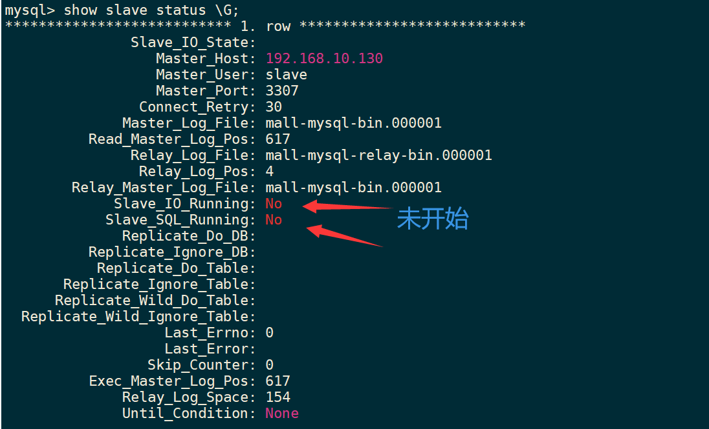

13. 在从数据库中开启主从同步

```perl
start slave;
```

14. 查看从数据库状态发现已经同步

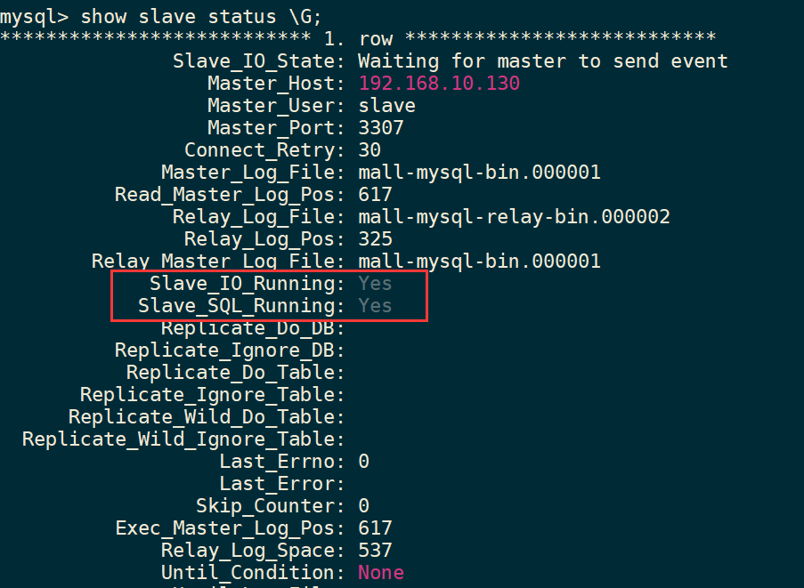

15. 主从复制测试

1. 主机新建库-使用库-新建表-插入数据，ok

2. 从机使用库-查看记录，ok

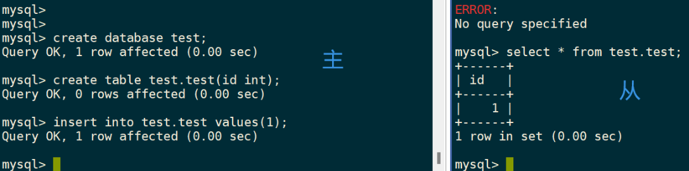

## 1.2 安装redis集群(大厂面试题第4季-分布式存储案例真题)

cluster(集群)模式-docker版

哈希槽分区进行亿级数据存储

### 1.2.1 面试题

1~2亿条数据需要缓存，请问如何设计这个存储案例？

回答：单机单台100%不可能，肯定是分布式存储，用redis如何落地？

上述问题阿里P6~P7工程案例和场景设计类必考题目， 一般业界有3种解决方案

1. 哈希取余分区

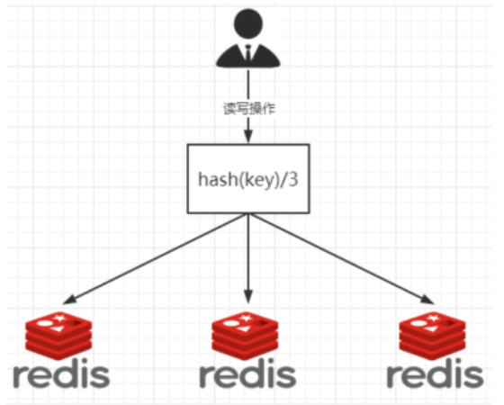

2亿条记录就是2亿个k,v，我们单机不行必须要分布式多机，假设有3台机器构成一个集群，用户每次读写操作都是根据公式：

hash(key) % N个机器台数，计算出哈希值，用来决定数据映射到哪一个节点上。

优点：

  简单粗暴，直接有效，只需要预估好数据规划好节点，例如3台、8台、10台，就能保证一段时间的数据支撑。使用Hash算法让固定的一部分请求落到同一台服务器上，这样每台服务器固定处理一部分请求（并维护这些请求的信息），起到负载均衡+分而治之的作用。

缺点：

   原来规划好的节点，进行扩容或者缩容就比较麻烦了额，不管扩缩，每次数据变动导致节点有变动，映射关系需要重新进行计算，在服务器个数固定不变时没有问题，如果需要弹性扩容或故障停机的情况下，原来的取模公式就会发生变化：Hash(key)/3会变成Hash(key) /?。此时地址经过取余运算的结果将发生很大变化，根据公式获取的服务器也会变得不可控。

某个redis机器宕机了，由于台数数量变化，会导致hash取余全部数据重新洗牌。

2. 一致性哈希算法分区

是什么

一致性Hash算法背景

　　一致性哈希算法在1997年由麻省理工学院中提出的，设计目标是为了解决分布式缓存数据变动和映射问题，某个机器宕机了，分母数量改变了，自然取余数不OK了。

2.1 能干嘛

提出一致性Hash解决方案。 目的是当服务器个数发生变动时， 尽量减少影响客户端到服务器的映射关系

2.2 大步骤

2.2.1 算法构建一致性哈希环

一致性哈希环

​        一致性哈希算法必然有个hash函数并按照算法产生hash值，这个算法的所有可能哈希值会构成一个全量集，这个集合可以成为一个hash空间[0,2^32-1]，这个是一个线性空间，但是在算法中，我们通过适当的逻辑控制将它首尾相连(0 = 2^32),这样让它逻辑上形成了一个环形空间。

​        它也是按照使用取模的方法，前面笔记介绍的节点取模法是对节点（服务器）的数量进行取模。而一致性Hash算法是对2^32取模，简单来说，一致性Hash算法将整个哈希值空间组织成一个虚拟的圆环，如假设某哈希函数H的值空间为0-2^32-1（即哈希值是一个32位无符号整形），整个哈希环如下图：整个空间按顺时针方向组织，圆环的正上方的点代表0，0点右侧的第一个点代表1，以此类推，2、3、4、……直到2^32-1，也就是说0点左侧的第一个点代表2^32-1， 0和2^32-1在零点中方向重合，我们把这个由2^32个点组成的圆环称为Hash环。


2.2.2 服务器IP节点映射

节点映射

   将集群中各个IP节点映射到环上的某一个位置。

   将各个服务器使用Hash进行一个哈希，具体可以选择服务器的IP或主机名作为关键字进行哈希，这样每台机器就能确定其在哈希环上的位置。假如4个节点NodeA、B、C、D，经过IP地址的哈希函数计算(hash(ip))，使用IP地址哈希后在环空间的位置如下：  

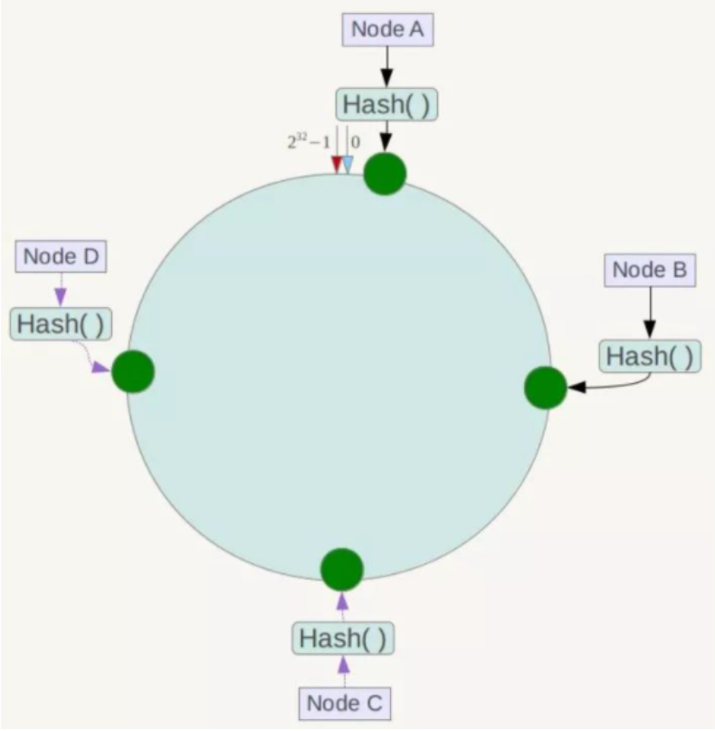

2.2.3 key落到服务器的落键规则

当我们需要存储一个kv键值对时，首先计算key的hash值，hash(key)，将这个key使用相同的函数Hash计算出哈希值并确定此数据在环上的位置，从此位置沿环顺时针“行走”，第一台遇到的服务器就是其应该定位到的服务器，并将该键值对存储在该节点上。

如我们有Object A、Object B、Object C、Object D四个数据对象，经过哈希计算后，在环空间上的位置如下：根据一致性Hash算法，数据A会被定为到Node A上，B被定为到Node B上，C被定为到Node C上，D被定为到Node D上。

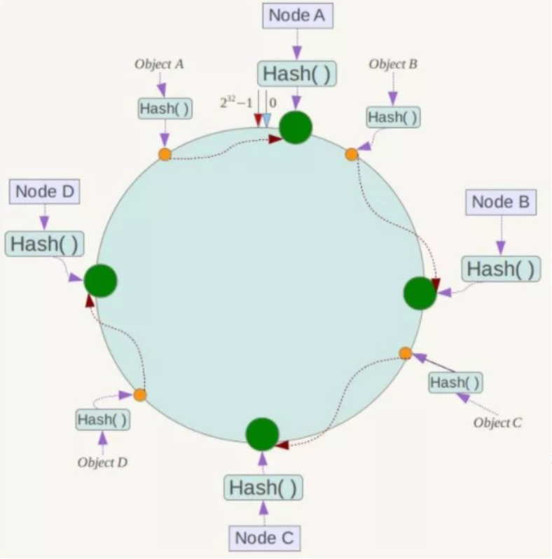

2.2.4 优点

2.2.4.1 ==一致性哈希算法的容错性==


容错性

假设Node C宕机，可以看到此时对象A、B、D不会受到影响，只有C对象被重定位到Node D。一般的，在一致性Hash算法中，如果一台服务器不可用，则受影响的数据仅仅是此服务器到其环空间中前一台服务器（即沿着逆时针方向行走遇到的第一台服务器）之间数据，其它不会受到影响。简单说，就是C挂了，受到影响的只是B、C之间的数据，并且这些数据会转移到D进行存储。

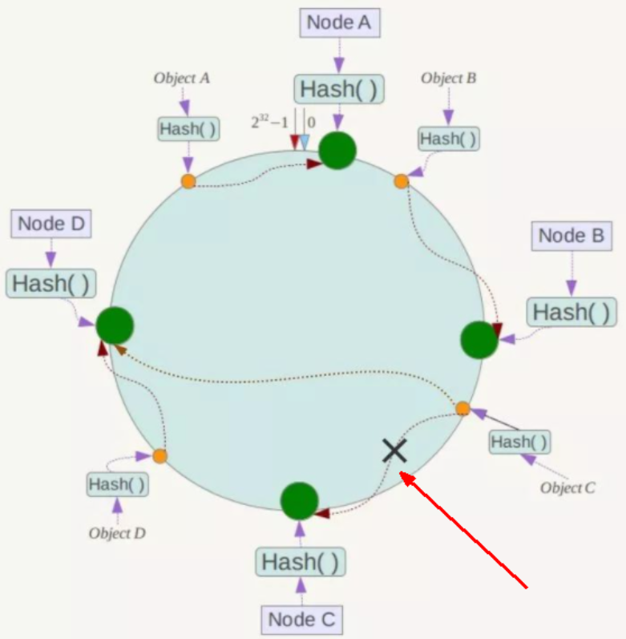

2.2.4.2 ==一致性哈希算法的扩展性==

数据量增加了，需要增加一台节点NodeX，X的位置在A和B之间，那收到影响的也就是A到X之间的数据，重新把A到X的数据录入到X上即可，

不会导致hash取余全部数据重新洗牌。

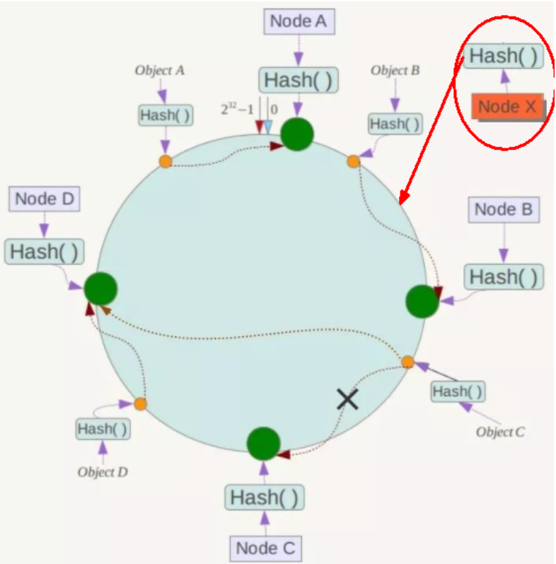

2.2.5 缺点

==一致性哈希算法的数据倾斜问题==

Hash环的数据倾斜问题

一致性Hash算法在服务节点太少时，容易因为节点分布不均匀而造成数据倾斜（被缓存的对象大部分集中缓存在某一台服务器上）问题，

例如系统中只有两台服务器：

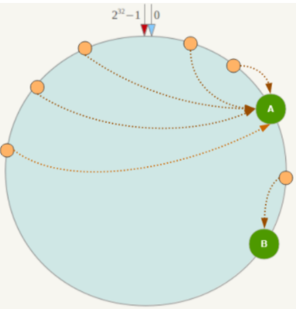

3. 小总结

为了在节点数目发生改变时尽可能少的迁移数据

将所有的存储节点排列在收尾相接的Hash环上，每个key在计算Hash后会顺时针找到临近的存储节点存放。

而当有节点加入或退出时仅影响该节点在Hash环上顺时针相邻的后续节点。  

优点

加入和删除节点只影响哈希环中顺时针方向的相邻的节点，对其他节点无影响。

缺点 

数据的分布和节点的位置有关，因为这些节点不是均匀的分布在哈希环上的，所以数据在进行存储时达不到均匀分布的效果。

3. 哈希槽分区

3.1 是什么

3.1.2 为什么出现

==为了解决一致性哈希算法的数据倾斜问题==

哈希槽实质就是一个数组，数组[0,2^14 -1]形成hash slot空间。

3.1.3 能干什么

解决均匀分配的问题，在数据和节点之间又加入了一层，把这层称为哈希槽（slot），用于管理数据和节点之间的关系，现在就相当于节点上放的是槽，槽里放的是数据。


槽解决的是粒度问题，相当于把粒度变大了，这样便于数据移动。

哈希解决的是映射问题，使用key的哈希值来计算所在的槽，便于数据分配。

3.1.4 多少个hash槽

一个集群只能有16384个槽，编号0-16383（0-2^14-1）。这些槽会分配给集群中的所有主节点，分配策略没有要求。可以指定哪些编号的槽分配给哪个主节点。集群会记录节点和槽的对应关系。解决了节点和槽的关系后，接下来就需要对key求哈希值，然后对16384取余，余数是几key就落入对应的槽里。slot = CRC16(key) % 16384。以槽为单位移动数据，因为槽的数目是固定的，处理起来比较容易，这样数据移动问题就解决了。

3.1.4.1 哈希槽计算

Redis 集群中内置了 16384 个哈希槽，redis 会根据节点数量大致均等的将哈希槽映射到不同的节点。当需要在 Redis 集群中放置一个 key-value时，redis 先对 key 使用 crc16 算法算出一个结果，然后把结果对 16384 求余数，这样每个 key 都会对应一个编号在 0-16383 之间的哈希槽，也就是映射到某个节点上。如下代码，key之A 、B在Node2， key之C落在Node3上

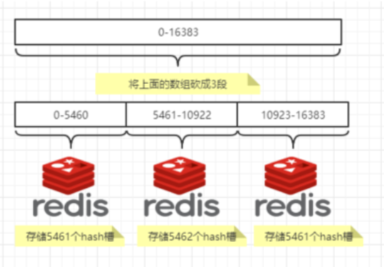

```java
@Test
public void test3(){
// import io.lettuce.core.cluster.sLotHash;
System.out.println(slotHash.getslot( key: "A"));//6373
System.out.println(slotHash.getslot( key: "B"));//1037
System.out.println(slotHash.getslot( key: "c"));//14503
System.out.println(slotHash.getslot( key: "hello"));//866
}
```

### 1.2.2 3主3从redis集群扩缩容配置案例架构说明

### 1.2.3 步骤

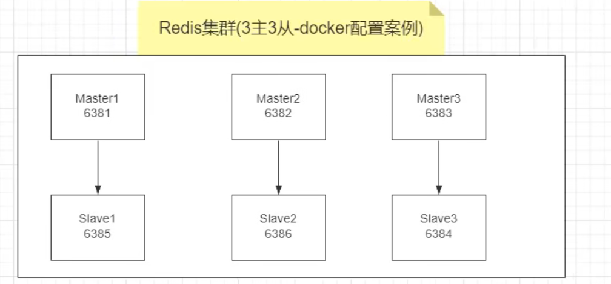

关闭防火墙+启动docker后台服务

```perl
systemctl start docker
```

新建6个docker容器redis实例

```perl
docker run -d --name redis-node-1 --net host --privileged=true -v /data/redis/share/redis-node-1:/data redis:6.0.8 --cluster-enabled yes --appendonly yes --port 6381
 
docker run -d --name redis-node-2 --net host --privileged=true -v /data/redis/share/redis-node-2:/data redis:6.0.8 --cluster-enabled yes --appendonly yes --port 6382
 
docker run -d --name redis-node-3 --net host --privileged=true -v /data/redis/share/redis-node-3:/data redis:6.0.8 --cluster-enabled yes --appendonly yes --port 6383
 
docker run -d --name redis-node-4 --net host --privileged=true -v /data/redis/share/redis-node-4:/data redis:6.0.8 --cluster-enabled yes --appendonly yes --port 6384
 
docker run -d --name redis-node-5 --net host --privileged=true -v /data/redis/share/redis-node-5:/data redis:6.0.8 --cluster-enabled yes --appendonly yes --port 6385
 
docker run -d --name redis-node-6 --net host --privileged=true -v /data/redis/share/redis-node-6:/data redis:6.0.8 --cluster-enabled yes --appendonly yes --port 6386
```

命令分步解释

`docker run` 创建并运行docker容器实例

`--name redis-node-6` 容器名字

`--net host` 使用宿主机的IP和端口，默认

`--privileged=true` 获取宿主机root用户权限

`-v /data/redis/share/redis-node-6:/data` 容器卷，宿主机地址:docker内部地址

`redis:6.0.8 redis` 镜像和版本号

`--cluster-enabled yes` 开启redis集群

`--appendonly yes` 开启持久化

`--port 6386` redis端口号

```shell
[root@Neptune ~]# docker ps
CONTAINER ID   IMAGE          COMMAND                  CREATED          STATUS          PORTS                                                  NAMES
fb8b1b40abcd   redis:6.0.8    "docker-entrypoint.s…"   31 seconds ago   Up 30 seconds                                                          redis-node-6
3a20b4535bbd   redis:6.0.8    "docker-entrypoint.s…"   33 seconds ago   Up 32 seconds                                                          redis-node-5
dd29551d395e   redis:6.0.8    "docker-entrypoint.s…"   33 seconds ago   Up 32 seconds                                                          redis-node-4
f7e7139b1de2   redis:6.0.8    "docker-entrypoint.s…"   33 seconds ago   Up 32 seconds                                                          redis-node-3
c7329e573055   redis:6.0.8    "docker-entrypoint.s…"   33 seconds ago   Up 32 seconds                                                          redis-node-2
d91445434800   redis:6.0.8    "docker-entrypoint.s…"   34 seconds ago   Up 32 seconds                                                          redis-node-1
4e02cd70fb8f   mysql:5.7      "docker-entrypoint.s…"   5 hours ago      Up 5 hours      33060/tcp, 0.0.0.0:3308->3306/tcp, :::3308->3306/tcp   mysql-slave
befa3ca70879   mysql:5.7      "docker-entrypoint.s…"   5 hours ago      Up 5 hours      33060/tcp, 0.0.0.0:3307->3306/tcp, :::3307->3306/tcp   mysql-master
3d30a6409b53   dbz_test:1.9   "/docker-entrypoint.…"   2 weeks ago      Up 11 days      0.0.0.0:8083->8083/tcp, :::8083->8083/tcp, 9092/tcp    dbz_130_kisa
```

进入容器redis-node-1并为6台机器构建集群关系

进入容器

```perl
docker exec -it redis-node-1 /bin/bash
```

构建主从关系

==注意，进入docker容器后才能执行一下命令，且注意自己的真实IP地址==

==--cluster-replicas 1 表示为每个master创建一个slave节点==

```perl
redis-cli --cluster create 192.168.10.130:6381 192.168.10.130:6382 192.168.10.130:6383 192.168.10.130:6384 192.168.10.130:6385 192.168.10.130:6386 --cluster-replicas 1
```

一切OK的话，3主3从搞定

```shell
[root@Neptune ~]# docker exec -it redis-node-1 /bin/bash
root@Neptune:/data# redis-cli --cluster create 192.168.10.130:6381 192.168.10.130:6382 192.168.10.130:6383 192.168.10.130:6384 192.168.10.130:6385 192.168.10.130:6386 --cluster-replicas 1
>>> Performing hash slots allocation on 6 nodes...
Master[0] -> Slots 0 - 5460
Master[1] -> Slots 5461 - 10922
Master[2] -> Slots 10923 - 16383
Adding replica 192.168.10.130:6385 to 192.168.10.130:6381
Adding replica 192.168.10.130:6386 to 192.168.10.130:6382
Adding replica 192.168.10.130:6384 to 192.168.10.130:6383
>>> Trying to optimize slaves allocation for anti-affinity
[WARNING] Some slaves are in the same host as their master
M: cbdef3293df1737d6a7563571cb3befbd80254c6 192.168.10.130:6381
   slots:[0-5460] (5461 slots) master
M: df379831d26b9178b2dc2d31296ff12c17bdd8c3 192.168.10.130:6382
   slots:[5461-10922] (5462 slots) master
M: 105b567b483e37e69e5259933f24783a655610e1 192.168.10.130:6383
   slots:[10923-16383] (5461 slots) master
S: 1f46c02e05f5462b474ff0db01f95ad78394c8b3 192.168.10.130:6384
   replicates 105b567b483e37e69e5259933f24783a655610e1
S: e350401679cbb0c5ff54dcad056744b3c3deaf50 192.168.10.130:6385
   replicates cbdef3293df1737d6a7563571cb3befbd80254c6
S: c9c38b60cd0b2087a9abc8b2c764082d55f8c9ac 192.168.10.130:6386
   replicates df379831d26b9178b2dc2d31296ff12c17bdd8c3
Can I set the above configuration? (type 'yes' to accept): yes
>>> Nodes configuration updated
>>> Assign a different config epoch to each node
>>> Sending CLUSTER MEET messages to join the cluster
Waiting for the cluster to join
..
>>> Performing Cluster Check (using node 192.168.10.130:6381)
M: cbdef3293df1737d6a7563571cb3befbd80254c6 192.168.10.130:6381
   slots:[0-5460] (5461 slots) master
   1 additional replica(s)
S: 1f46c02e05f5462b474ff0db01f95ad78394c8b3 192.168.10.130:6384
   slots: (0 slots) slave
   replicates 105b567b483e37e69e5259933f24783a655610e1
M: df379831d26b9178b2dc2d31296ff12c17bdd8c3 192.168.10.130:6382
   slots:[5461-10922] (5462 slots) master
   1 additional replica(s)
M: 105b567b483e37e69e5259933f24783a655610e1 192.168.10.130:6383
   slots:[10923-16383] (5461 slots) master
   1 additional replica(s)
S: e350401679cbb0c5ff54dcad056744b3c3deaf50 192.168.10.130:6385
   slots: (0 slots) slave
   replicates cbdef3293df1737d6a7563571cb3befbd80254c6
S: c9c38b60cd0b2087a9abc8b2c764082d55f8c9ac 192.168.10.130:6386
   slots: (0 slots) slave
   replicates df379831d26b9178b2dc2d31296ff12c17bdd8c3
[OK] All nodes agree about slots configuration.
>>> Check for open slots...
>>> Check slots coverage...
[OK] All 16384 slots covered.
root@Neptune:/data#
```

进入6381作为切入点，查看集群状态与节点状态，防止路由失效加参数-c

```perl
redis-cli -p 6381 -c
cluster info
cluster nodes
```

```shell
root@Neptune:/data# redis-cli -p 6381 -c
127.0.0.1:6381> cluster info
cluster_state:ok
cluster_slots_assigned:16384
cluster_slots_ok:16384
cluster_slots_pfail:0
cluster_slots_fail:0
cluster_known_nodes:6
cluster_size:3
cluster_current_epoch:6
cluster_my_epoch:1
cluster_stats_messages_ping_sent:76
cluster_stats_messages_pong_sent:85
cluster_stats_messages_sent:161
cluster_stats_messages_ping_received:80
cluster_stats_messages_pong_received:76
cluster_stats_messages_meet_received:5
cluster_stats_messages_received:161
127.0.0.1:6381> cluster nodes
1f46c02e05f5462b474ff0db01f95ad78394c8b3 192.168.10.130:6384@16384 slave 105b567b483e37e69e5259933f24783a655610e1 0 1668248766000 3 connected
df379831d26b9178b2dc2d31296ff12c17bdd8c3 192.168.10.130:6382@16382 master - 0 1668248768581 2 connected 5461-10922
105b567b483e37e69e5259933f24783a655610e1 192.168.10.130:6383@16383 master - 0 1668248766571 3 connected 10923-16383
e350401679cbb0c5ff54dcad056744b3c3deaf50 192.168.10.130:6385@16385 slave cbdef3293df1737d6a7563571cb3befbd80254c6 0 1668248768000 1 connected
cbdef3293df1737d6a7563571cb3befbd80254c6 192.168.10.130:6381@16381 myself,master - 0 1668248766000 1 connected 0-5460
c9c38b60cd0b2087a9abc8b2c764082d55f8c9ac 192.168.10.130:6386@16386 slave df379831d26b9178b2dc2d31296ff12c17bdd8c3 0 1668248769588 2 connected
127.0.0.1:6381>
```

主从容错切换迁移案例

容错切换迁移

```perl
redis-cli --cluster check 192.168.10.130:6381
```

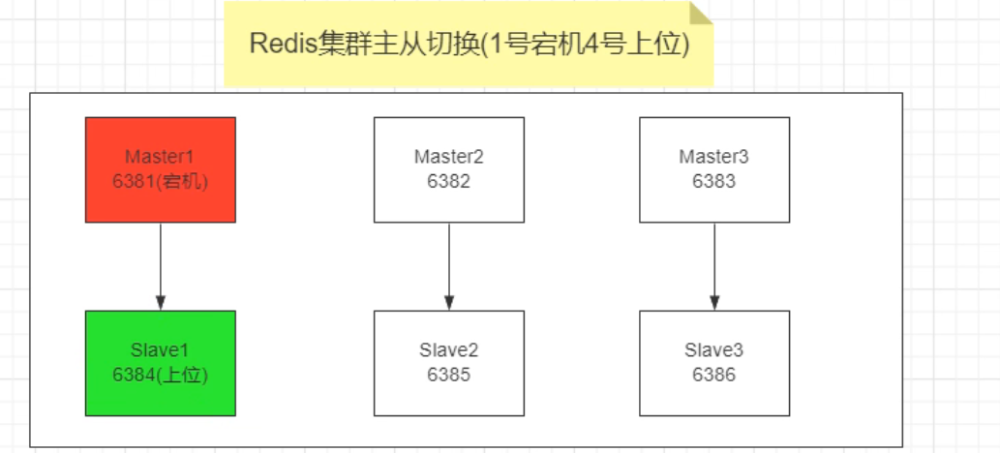

**1号恢复后，不再是master，此时将4号关闭，1号变为master，4号再启动变为slave**

### 1.3 主从扩容案例

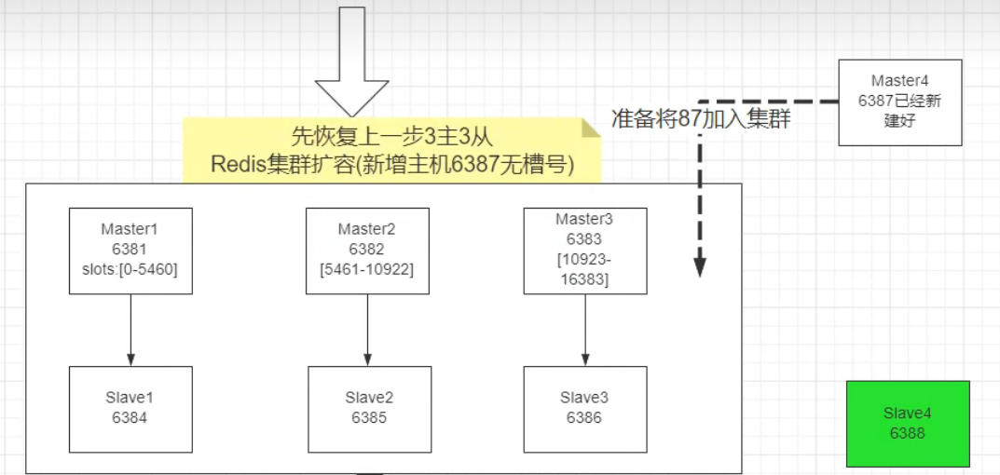

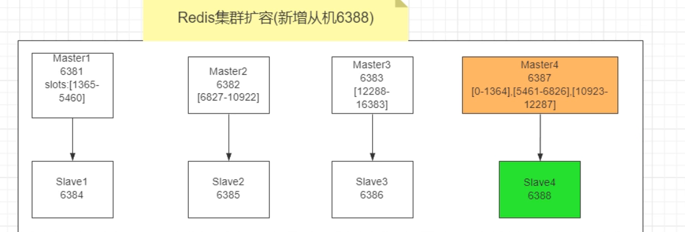

新建6387、6388两个节点+新建后启动+查看是否8节点

```perl
docker run -d --name redis-node-7 --net host --privileged=true -v /data/redis/share/redis-node-7:/data redis:6.0.8 --cluster-enabled yes --appendonly yes --port 6387

docker run -d --name redis-node-8 --net host --privileged=true -v /data/redis/share/redis-node-8:/data redis:6.0.8 --cluster-enabled yes --appendonly yes --port 6388

docker ps
```

进入6387容器实例内部

```perl
docker exec -it redis-node-7 /bin/bash
```

将新增的6387作为master节点加入集群

6387就是将要作为master新增节点
6381就是原来集群节点里面的领路人，相当于6387拜拜6381的码头从而找到组织加入集群

```perl
redis-cli --cluster add-node 192.168.10.130:6387 192.168.10.130:6381
```

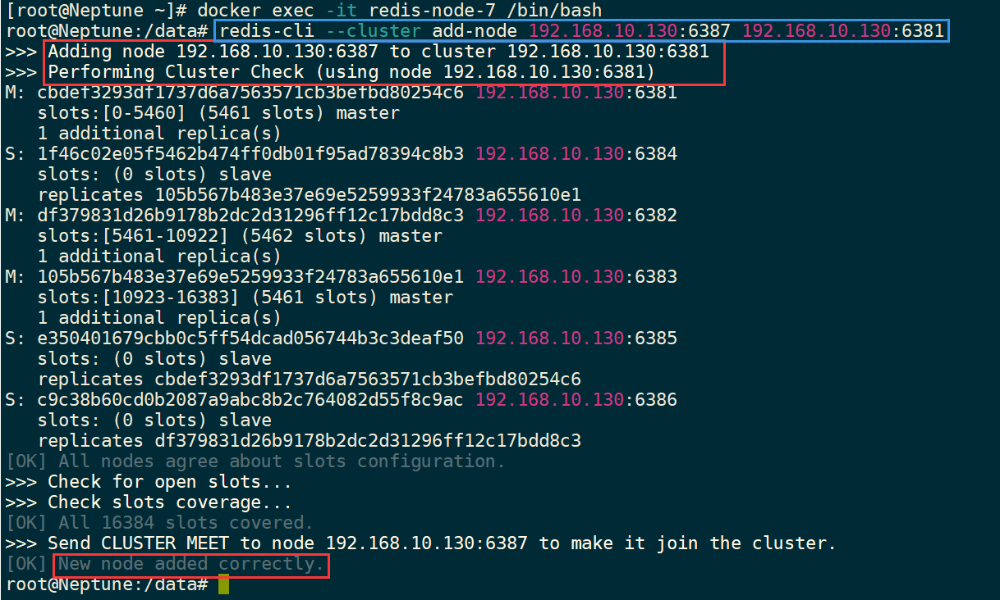

检查集群情况第一次

```perl
redis-cli --cluster check 192.168.10.130:6381
```

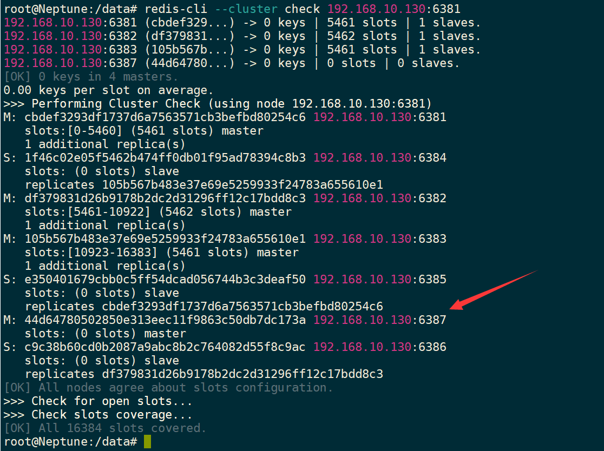

重新分派槽号

```perl
redis-cli --cluster reshard 192.168.10.130:6381
```

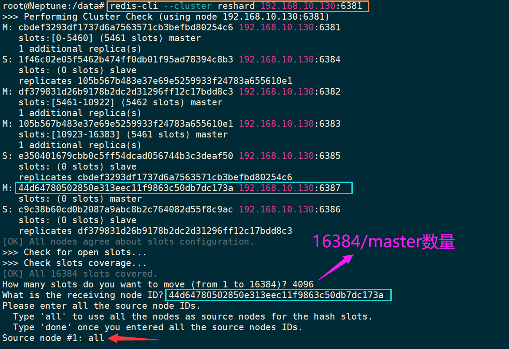

检查集群情况第二次

```perl
redis-cli --cluster check 192.168.10.130:6381
```

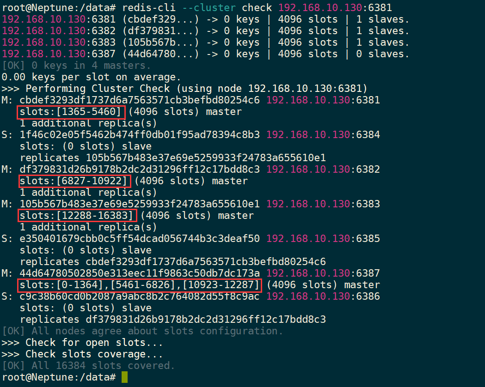

为什么6387是3个新的区间，以前的还是连续？

**重新分配成本太高，所以前3家各自匀出来一部分，从6381/6382/6383三个旧节点分别匀出1364个坑位**

为主节点6387分配从节点6388

`命令：redis-cli --cluster add-node ip:新slave端口 ip:新master端口 --cluster-slave --cluster-master-id 新主机节点ID`

```perl
redis-cli --cluster add-node 192.168.10.130:6388 192.168.10.130:6387 --cluster-slave --cluster-master-id 44d64780502850e313eec11f9863c50db7dc173a        -------这个是6387的编号，按照自己实际情况
```

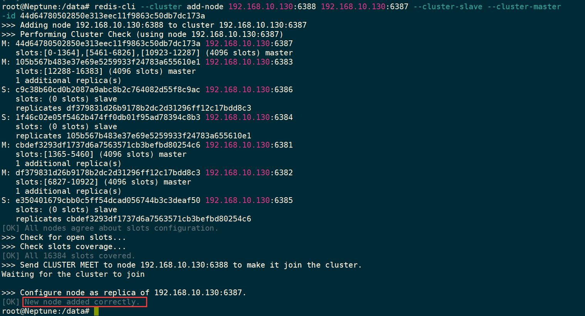

检查集群情况第三次

```perl
redis-cli --cluster check 192.168.10.130:6381
```

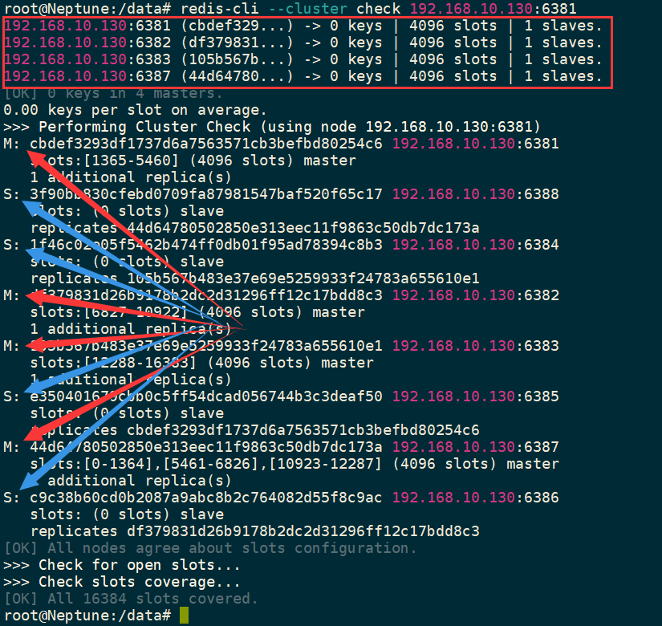

**扩容完成，四主四从**

### 1.4 主从缩容案例

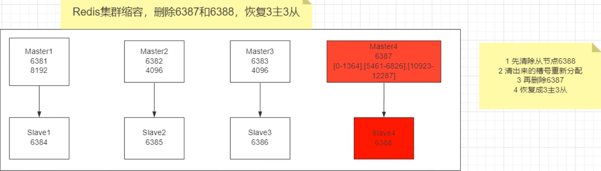

检查集群情况第一次，获得6388的节点ID

```perl
redis-cli --cluster check 192.168.10.130:6381
```

从集群中将4号从节点6388删除

`命令：redis-cli --cluster del-node ip:从机端口 从机6388节点ID`

 ```perl
redis-cli --cluster del-node 192.168.10.130:6388 3f90bb830cfebd0709fa87981547baf520f65c17
 ```

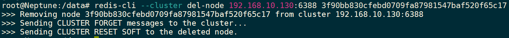

检查集群情况第二次，确认6388节点已被删除

```perl
redis-cli --cluster check 192.168.10.130:6381
```

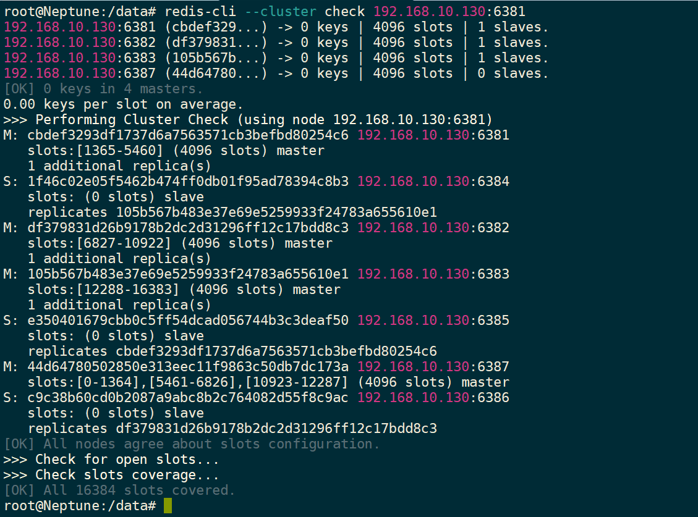

将6387的槽号清空，重新分配，本例将清出来的槽号都给6381

```perl
redis-cli --cluster reshard 192.168.10.130:6381
```

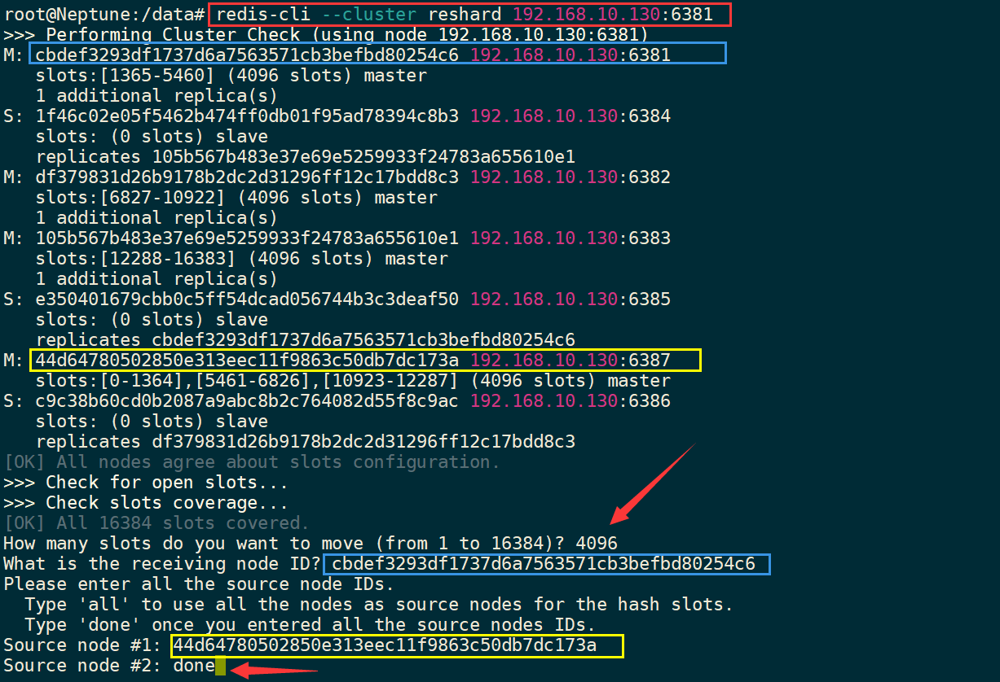

检查集群情况第三次

```perl
redis-cli --cluster check 192.168.10.130:6381
```

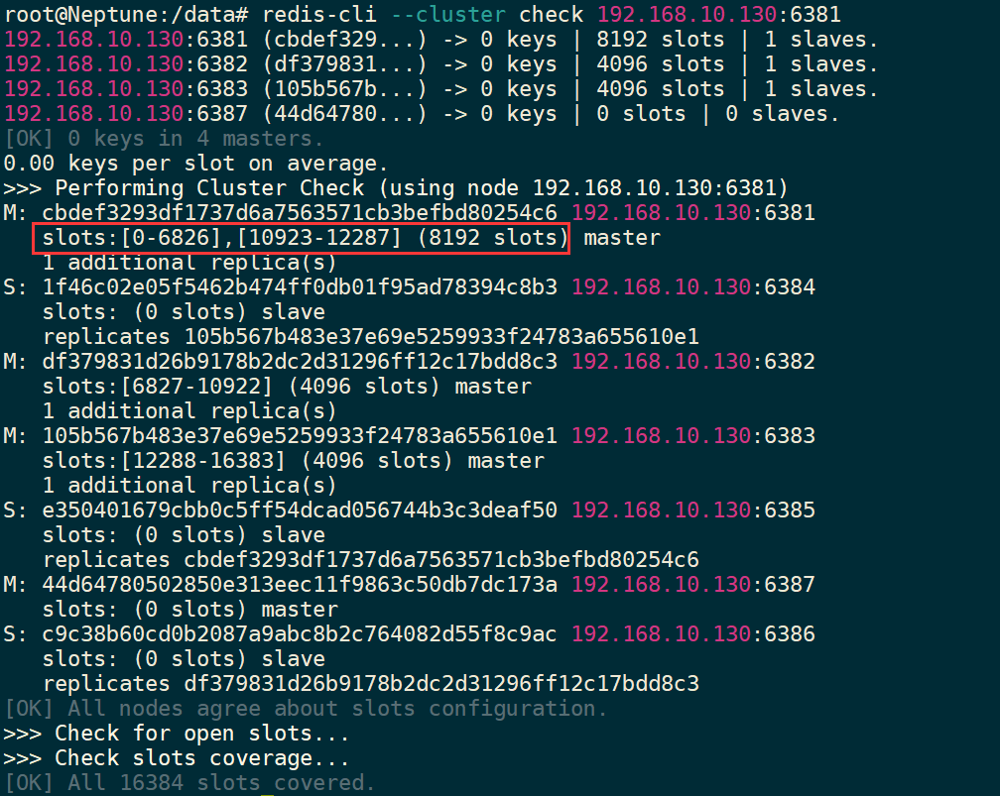

**4096个槽位都指给6381，它变成了8192个槽位，相当于全部都给6381了，不然要输入3次，一锅端**

删除节点6387

`命令：redis-cli --cluster del-node ip:端口 6387节点ID`

```perl
redis-cli --cluster del-node 192.168.10.130:6387 44d64780502850e313eec11f9863c50db7dc173a
```

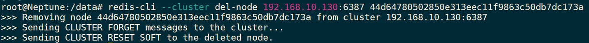

检查集群情况第四次

```perl
redis-cli --cluster check 192.168.10.130:6381
```

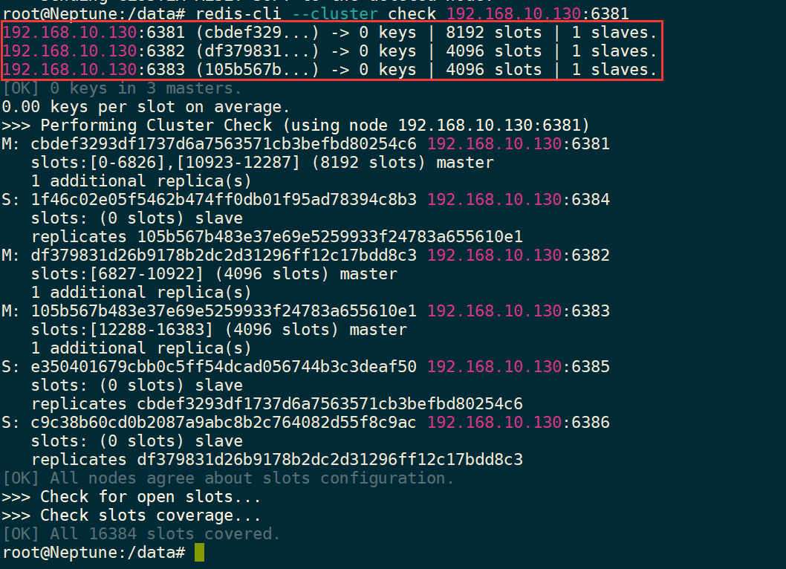

**三主三从，已完成缩容**

# 2 DockerFile解析

## 2.1 是什么

Dockerfile是用来构建Docker镜像的文本文件，是由一条条构建镜像所需的指令和参数构成的脚本。

**概述**

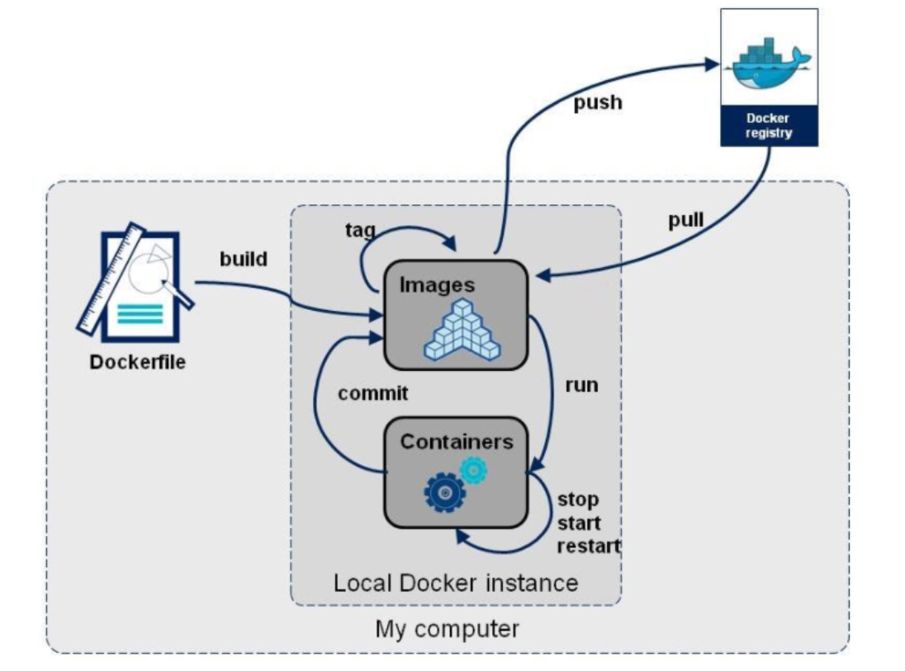

**官网**

https://docs.docker.com/engine/reference/builder/

**构建三步骤**

1. 编写Dockerfile文件
2. docker build 命令构建镜像
3. docker run 镜像 运行容器实例

## 2.2 DockerFile构建过程解析

### 2.2.1 Dockerfile内容基础知识

1. 每条保留字指令都必须为大写字母且后面要跟随至少一个参数
2. 指令按照从上到下，顺序执行
3. \#表示注释
4. 每条指令都会创建一个新的镜像层并对镜像进行提交

### 2.2.2 Docker执行Dockerfile的大致流程

1. docker从基础镜像运行一个容器
2. 执行一条指令并对容器作出修改
3. 执行类似docker commit的操作提交一个新的镜像层
4. docker再基于刚提交的镜像运行一个新容器
5. 执行dockerfile中的下一条指令直到所有指令都执行完成

### 2.2.3 小总结

从应用软件的角度来看，Dockerfile、Docker镜像与Docker容器分别代表软件的三个不同阶段，

- Dockerfile是软件的原材料
- Docker镜像是软件的交付品
- Docker容器则可以认为是软件镜像的运行态，也即依照镜像运行的容器实例

Dockerfile面向开发，Docker镜像成为交付标准，Docker容器则涉及部署与运维，三者缺一不可，合力充当Docker体系的基石。

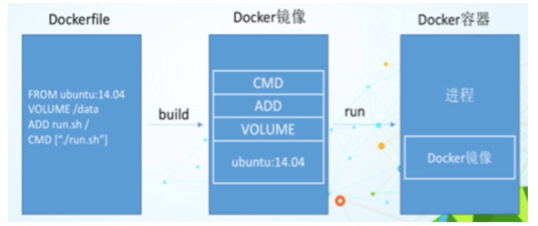

1. Dockerfile，需要定义一个Dockerfile，Dockerfile定义了进程需要的一切东西。Dockerfile涉及的内容包括执行代码或者是文件、环境变量、依赖包、运行时环境、动态链接库、操作系统的发行版、服务进程和内核进程(当应用进程需要和系统服务和内核进程打交道，这时需要考虑如何设计namespace的权限控制)等等;
2. Docker镜像，在用Dockerfile定义一个文件之后，docker build时会产生一个Docker镜像，当运行 Docker镜像时会真正开始提供服务;
3. Docker容器，容器是直接提供服务的。

## 2.3 DockerFile常用保留字指令

**参考tomcat8的dockerfile入门**

https://github.com/docker-library/tomcat

**FROM**

基础镜像，当前新镜像是基于哪个镜像的，指定一个已经存在的镜像作为模板，第一条必须是from

**MAINTAINER**

镜像维护者的姓名和邮箱地址

**RUN**

容器构建时需要运行的命令

两种格式

1. shell格式

```perl
RUN <命令行命令>
<命令行命令〉等同于，在终端操作的 shell命令。
RUN yum -y install vim
```

2. exec格式

```perl
RUN["可执行文件"，"参数1"，"参数2"]
#例如:
RUN [ "./test.php","dev", "offline"]等价于RUN ./test.php dev offline
RUN是在 docker build时运行
```

**EXPOSE**

当前容器对外暴露出的端口

**WORKDIR**

指定在创建容器后，终端默认登陆的进来工作目录，一个落脚点

**USER**

指定该镜像以什么样的用户去执行，如果都不指定，默认是root

**ENV**

用来在构建镜像过程中设置环境变量

```perl
ENV MY_PATH /usr/mytest
```

这个环境变量可以在后续的任何RUN指令中使用，这就如同在命令前面指定了环境变量前缀一样；

也可以在其它指令中直接使用这些环境变量。

比如：`WORKDIR $MY_PATH`

**ADD**

将宿主机目录下的文件拷贝进镜像且会自动处理URL和解压tar压缩包

**COPY**

类似ADD，拷贝文件和目录到镜像中。

将从构建上下文目录中 <源路径> 的文件/目录复制到新的一层的镜像内的 <目标路径> 位置

```perl
COPY src dest
COPY ["src", "dest"]
```

<src源路径>：源文件或者源目录

<dest目标路径>：容器内的指定路径，该路径不用事先建好，路径不存在的话，会自动创建。

**VOLUME**

容器数据卷，用于数据保存和持久化工作

**CMD**

指定容器启动后的要干的事情

CMD容器启动命令
`CMD`指令的格式和`RUN`相似，也是两种格式:

* `shell`格式: `CMD <命令>`
* `exec`格式: `CMD ["可执行文件","参数1","参数2"...]`
* 参数列表格式: CMD["参数1","参数2"...]。在指定了`ENTRYPOINT `指令后，用`CMD`指定具体的参数。

**注意：**

Dockerfile 中可以有多个 CMD 指令，但只有最后一个生效，CMD 会被 docker run 之后的参数替换。

参考官网Tomcat的dockerfile演示讲解：

官网最后一行命令

```perl
157 EXPOSE 8080
158 CMD[ "catalina.sh", "run"]
```

我们演示自己的覆盖操作

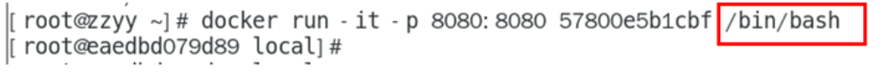

它和前面RUN命令的区别

- CMD是在==docker run== 时运行。
- RUN是在 ==docker build==时运行。

**ENTRYPOINT**

也是用来指定一个容器启动时要运行的命令

类似于 CMD 指令，但是ENTRYPOINT不会被docker run后面的命令覆盖， 而且这些命令行参数会被当作参数送给 ENTRYPOINT 指令指定的程序。

命令格式和案例说明

 命令格式：

`ENTRYPOINT [ "<executeable>" , "<param1>" , "<param2>",...]`

ENTRYPOINT可以和CMD一起用，一般是变参才会使用 CMD ，这里的 CMD 等于是在给 ENTRYPOINT 传参。

当指定了ENTRYPOINT后，CMD的含义就发生了变化，不再是直接运行其命令而是将CMD的内容作为参数传递给ENTRYPOINT指令，他两个组合会变成

`<ENTRYPOINT> "<CMD>"`

案例如下：假设已通过 Dockerfile 构建了 nginx:test 镜像：

```perl
FROM nginx

ENTRYPOINT [ "nginx", "-c"]#定参
CMD [ "/etc/nginx/nginx.conf"]# 变参

```

| 是否传参         | 按照dockerfile编写执行         | 传参运行                                     |
| ---------------- | ------------------------------ | -------------------------------------------- |
| Docker命令       | docker run nginx:test          | docker run nginx:test -c /etc/nginx/new.conf |
| 衍生出的实际命令 | nginx -c /etc/nginx/nginx.conf | nginx -c /etc/nginx/new.conf                 |

优点：在执行docker run的时候可以指定 ENTRYPOINT 运行所需的参数。

注意：如果 Dockerfile 中如果存在多个 ENTRYPOINT 指令，仅最后一个生效。

**小总结**

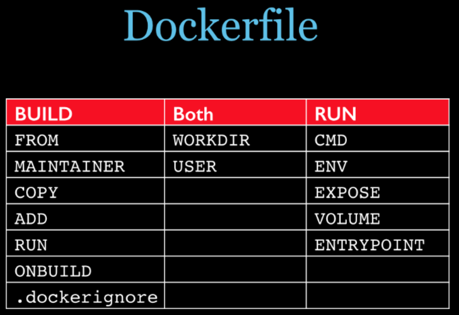

## 2.4 案例

### 2.4.1 自定义镜像mycentosjava8

**要求**

Centos7镜像具备vim+ifconfig+jdk8

JDK的下载镜像地址：https://www.oracle.com/java/technologies/downloads/#java8


https://mirrors.yangxingzhen.com/jdk/

```perl
wget https://download.oracle.com/otn/java/jdk/8u351-b10/10e8cce67c7843478f41411b7003171c/jdk-8u351-linux-x64.tar.gz
```

**编写**

准备编写Dockerfile文件

```dockerfile
FROM centos
MAINTAINER neptune

ENV MYPATH /usr/local
WORKDIR $MYPATH

#安装vim编辑器
RUN yum -y install vim
#安装ifconfig命令查看网络IP
RUN yum -y install net-tools
#安装java8及lib库
RUN yum -y install glibc.i686
RUN mkdir /usr/local/java
#ADD 是相对路径jar,把jdk-8u171-linux-x64.tar.gz添加到容器中,安装包必须要和Dockerfile文件在同一位置
ADD jdk-8u351-linux-x64.tar.gz /usr/local/java
#配置java环境变量
ENV JAVA_HOME /usr/local/java/jdk1.8.0_351
ENV JRE_HOME $JAVA_HOME/jre
ENV CLASSPATH $JAVA_HOME/lib/dt.jar:$JAVA_HOME/lib/tools.jar:$JRE_HOME/lib:$CLASSPATH
ENV PATH $JAVA_HOME/bin:$PATH

EXPOSE 80

CMD /bin/bash

```

大写字母D

**构建**

`docker build -t 新镜像名字:TAG .`默认当前路径

==注意，上面TAG后面有个空格，有个点==

`docker build -t 新镜像名字:TAG -f Dockerfile路径`

```perl
docker build -t centosjava8:1.5 .
```

```shell
[root@Neptune mycentos]# vim Dockerfile
[root@Neptune mycentos]# docker build -t centosjava8:1.5 .
Sending build context to Docker daemon  143.1MB
Step 1/12 : FROM centos
 ---> 5d0da3dc9764
Step 2/12 : MAINTAINER neptune
 ---> Using cache
 ---> 90295530d352
Step 3/12 : ENV MYPATH /usr/local
 ---> Using cache
 ---> 797f9b2d3aad
Step 4/12 : WORKDIR $MYPATH
 ---> Using cache
 ---> 7f8a33ea51cf
Step 5/12 : RUN mkdir /usr/local/java
 ---> Using cache
 ---> be89e20066b5
Step 6/12 : ADD jdk-8u271-linux-x64.tar.gz /usr/local/java
 ---> 348ada2881e8
Step 7/12 : ENV JAVA_HOME /usr/local/java/jdk1.8.0_271
 ---> Running in 3e32fd8f4c11
Removing intermediate container 3e32fd8f4c11
 ---> bb2ab3148e53
Step 8/12 : ENV JRE_HOME $JAVA_HOME/jre
 ---> Running in ce0e5f6b6254
Removing intermediate container ce0e5f6b6254
 ---> 950350e815f5
Step 9/12 : ENV CLASSPATH $JAVA_HOME/lib/dt.jar:$JAVA_HOME/lib/tools.jar:$JRE_HOME/lib:$CLASSPATH
 ---> Running in 527aa108208a
Removing intermediate container 527aa108208a
 ---> b7f7e52328e7
Step 10/12 : ENV PATH $JAVA_HOME/bin:$PATH
 ---> Running in 47a0906cc6e7
Removing intermediate container 47a0906cc6e7
 ---> 8f8adb0eaf04
Step 11/12 : EXPOSE 80
 ---> Running in 4c9fcdceb2f5
Removing intermediate container 4c9fcdceb2f5
 ---> 57f240f4888a
Step 12/12 : CMD /bin/bash
 ---> Running in 24c3d094d7b0
Removing intermediate container 24c3d094d7b0
 ---> a57f316ba924
Successfully built a57f316ba924
Successfully tagged centosjava8:1.5
```

**运行**

`docker run -it 新镜像名字:TAG `

```perl
docker run -it centosjava8:1.5
```

```shell
[root@Neptune mycentos]# docker images
REPOSITORY                                            TAG       IMAGE ID       CREATED          SIZE
centosjava8                                           1.5       a57f316ba924   58 seconds ago   587MB
[root@Neptune mycentos]# docker run -it centosjava8:1.5
[root@7c6d32d7a37b local]# java -version
java version "1.8.0_271"
Java(TM) SE Runtime Environment (build 1.8.0_271-b09)
Java HotSpot(TM) 64-Bit Server VM (build 25.271-b09, mixed mode)
```

**再体会下UnionFS（联合文件系统）**

UnionFS（联合文件系统）：Union文件系统（UnionFS）是一种分层、轻量级并且高性能的文件系统，它支持对文件系统的修改作为一次提交来一层层的叠加，同时可以将不同目录挂载到同一个虚拟文件系统下(unite several directories into a single virtual filesystem)。Union 文件系统是 Docker 镜像的基础。镜像可以通过分层来进行继承，基于基础镜像（没有父镜像），可以制作各种具体的应用镜像。

特性：一次同时加载多个文件系统，但从外面看起来，只能看到一个文件系统，联合加载会把各层文件系统叠加起来，这样最终的文件系统会包含所有底层的文件和目录

### 2.4.2 虚悬镜像

**是什么**

仓库名、标签都是<none>的镜像，俗称dangling image

==构建失败的镜像==


Dockerfile写一个

1. `vim Dockerfile`

```dockerfile
from ubuntu
CMD echo 'action is success'
```

1. `docker build .`

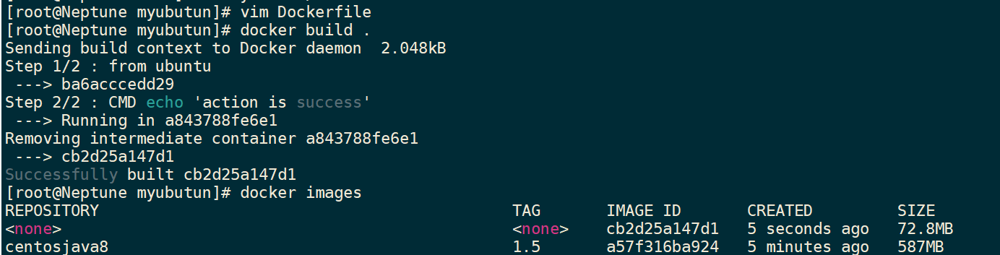

**查看**

```perl
docker image ls -f dangling=true
```

命令结果

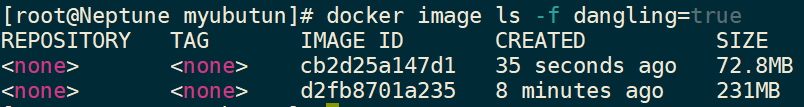

**删除**

```
docker image prune
```

虚悬镜像已经失去存在价值，可以删除

```shell
[root@Neptune myubutun]# docker image ls -f dangling=true
REPOSITORY   TAG       IMAGE ID       CREATED          SIZE
<none>       <none>    cb2d25a147d1   35 seconds ago   72.8MB
[root@Neptune myubutun]# docker image prune
WARNING! This will remove all dangling images.
Are you sure you want to continue? [y/N] y
Deleted Images:
deleted: sha256:cb2d25a147d101ec0e639a3b28fe216410e0cde3922b349699ef6ffd53ee0863
```

## 2.5 小总结


# 3 Docker微服务实战

## 3.1 通过IDEA新建一个普通微服务模块

application.yml

```yaml
server:
  port: 8888
  servlet:
    context-path: /myboot
```

controller业务层

```java
package com.neptune.springboot.controller;

import com.neptune.springboot.vo.StudentInfo;
import org.springframework.web.bind.annotation.RequestMapping;
import org.springframework.web.bind.annotation.RestController;

import javax.annotation.Resource;

@RestController
public class HelloController {

    @Resource
    private StudentInfo studentInfo;

    @RequestMapping("/hello")
    public String hello(){

        return "Hello, Spring Boot 2!";
    }

    @RequestMapping("/info")
    public String toString() {
        return "HelloController{" +
                "studentInfo=" + studentInfo +
                '}';
    }
}
```

## 3.2 通过dockerfile发布微服务部署到docker容器

**IDEA工具里面搞定微服务jar包**

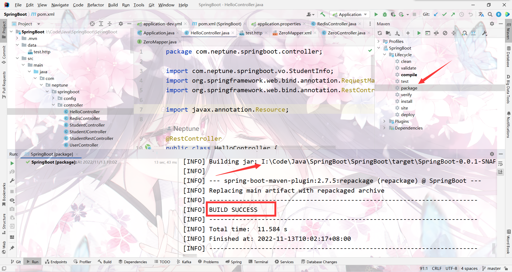

**编写Dockerfile**

```dockerfile
# 基础镜像使用java
FROM centosjava8:1.5
# 作者
MAINTAINER neptune
# VOLUME 指定临时文件目录为/tmp，在主机/var/lib/docker目录下创建了一个临时文件并链接到容器的/tmp
VOLUME /tmp
# 将jar包添加到容器中并更名为zzyy_docker.jar
ADD SpringBoot-0.0.1-SNAPSHOT.jar /hello.jar
# 运行jar包
ENTRYPOINT ["java","-jar","/hello.jar"]
#暴露8888端口作为微服务
EXPOSE 8888
```

将微服务jar包和Dockerfile文件上传到同一个目录下/mydocker

```shell
[root@Neptune springboot-docker]# ls
Dockerfile  SpringBoot-0.0.1-SNAPSHOT.jar
[root@Neptune springboot-docker]# cat Dockerfile
# 基础镜像使用java
FROM centosjava8:1.5
# 作者
MAINTAINER neptune
# VOLUME 指定临时文件目录为/tmp，在主机/var/lib/docker目录下创建了一个临时文件并链接到容器的/tmp
VOLUME /tmp
# 将jar包添加到容器中并更名为zzyy_docker.jar
ADD SpringBoot-0.0.1-SNAPSHOT.jar /hello.jar
# 运行jar包
ENTRYPOINT ["java","-jar","/hello.jar"]
#暴露8888端口作为微服务
EXPOSE 8888
```

**构建镜像**

```
docker build -t hello:1.0 .
```

打包成镜像文件

```shell
[root@Neptune springboot-docker]# docker build -t hello:1.0 .
Sending build context to Docker daemon  34.86MB
Step 1/6 : FROM centosjava8:1.5
 ---> a57f316ba924
Step 2/6 : MAINTAINER neptune
 ---> Running in 8893b1509ae8
Removing intermediate container 8893b1509ae8
 ---> 678afe33eb4c
Step 3/6 : VOLUME /tmp
 ---> Running in 634cb91f0c6e
Removing intermediate container 634cb91f0c6e
 ---> 0daf82b1e1fe
Step 4/6 : ADD SpringBoot-0.0.1-SNAPSHOT.jar /hello.jar
 ---> 69ef5db414e5
Step 5/6 : ENTRYPOINT ["java","-jar","/hello.jar"]
 ---> Running in cb926e1966f5
Removing intermediate container cb926e1966f5
 ---> 25c7a034881e
Step 6/6 : EXPOSE 8888
 ---> Running in cdede3b670fe
Removing intermediate container cdede3b670fe
 ---> 3d7929e019a1
Successfully built 3d7929e019a1
Successfully tagged hello:1.0
```

**运行容器**

```perl
docker run -d -p 8889:8888 hello:1.0
```

**访问测试**

```perl
curl 192.168.10.130:8889/myboot/hello
```

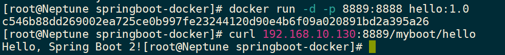

# 4 Docker网络

## 是什么

**docker不启动，默认网络情况**

* ens33

* lo

* virbr0

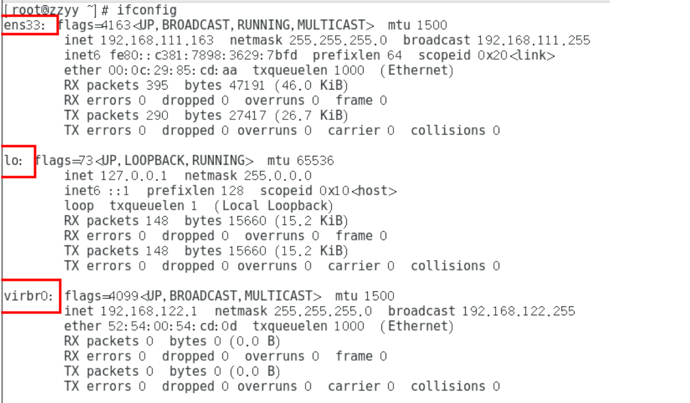

在CentOS7的安装过程中如果有选择相关虚拟化的的服务安装系统后，启动网卡时会发现有一个以网桥连接的私网地址的virbr0网卡(virbr0网卡：它还有一个固定的默认IP地址192.168.122.1)，是做虚拟机网桥的使用的，其作用是为连接其上的虚机网卡提供 NAT访问外网的功能。

 

我们之前学习Linux安装，勾选安装系统的时候附带了libvirt服务才会生成的一个东西，如果不需要可以直接将libvirtd服务卸载，

`yum remove libvirt-libs.x86_64`

**docker启动后，网络情况**

会产生一个名为docker0的虚拟网桥

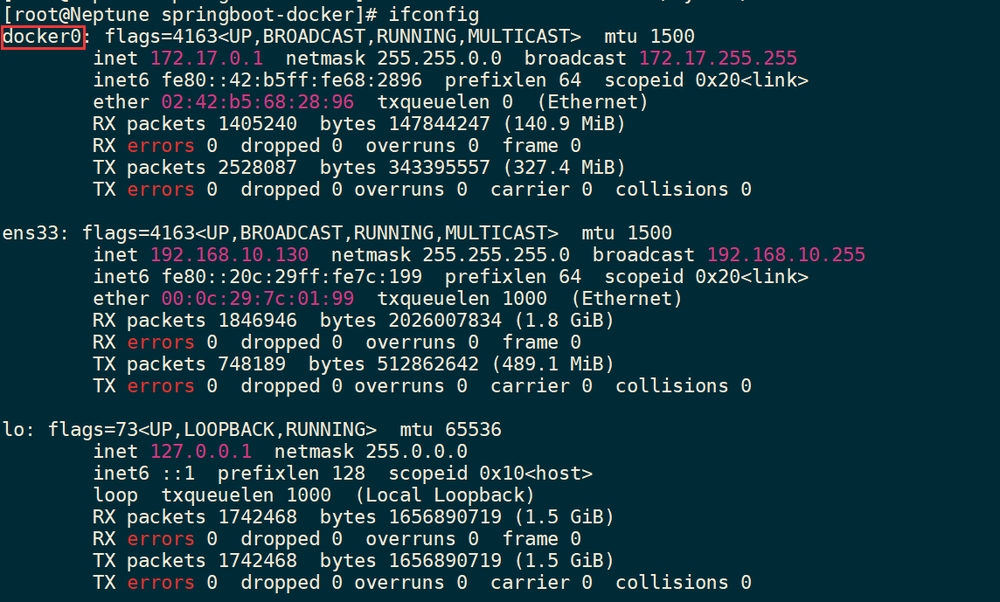

查看docker网络模式命令，默认创建3大网络模式。

```perl
[root@Neptune springboot-docker]# docker network ls
NETWORK ID     NAME      DRIVER    SCOPE
64c4d58191c3   bridge    bridge    local
2d74653ca40f   host      host      local
afe01cb455fa   none      null      local
```

## 常用基本命令

**All命令**

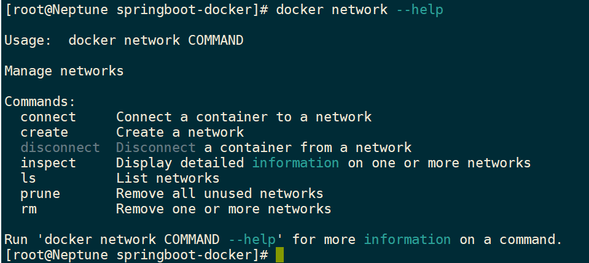

**查看网络**

```perl
docker network ls
```

**查看网络源数据**

```perl
docker network inspect XXX网络名字
```

**删除网络**

```perl
docker network rm XXX网络名字
```

**案例**

```perl
[root@Neptune springboot-docker]# docker network create test_network
71105b7c4d659d531fd5c2af11f78ce29d62266ecd20d68283af4a05c2f49314
[root@Neptune springboot-docker]# docker network ls
NETWORK ID     NAME           DRIVER    SCOPE
64c4d58191c3   bridge         bridge    local
2d74653ca40f   host           host      local
afe01cb455fa   none           null      local
71105b7c4d65   test_network   bridge    local
[root@Neptune springboot-docker]# docker network rm test_network
test_network
[root@Neptune springboot-docker]#
```

## 能干嘛

==容器间的互联和通信以及端口映射==

==容器IP变动时候可以通过服务名直接网络通信而不受到影响==

## 网络模式

**总体介绍**

| 网络模式  | 简介                                                         |
| --------- | ------------------------------------------------------------ |
| bridge    | 为每一个容器分配、设置IP等，并将容器连接到一个docker0<br/><font color=red>虚拟网桥，默认为该模式。</font> |
| host      | 容器将不会虚拟出自己的网卡，配置自己的IP等，而是使用宿主机的IP和端口。 |
| none      | 容器有独立的Network namespace，但并没有对其进行任何网络设置，如分配veth pair和网桥连接，IP等。 |
| container | 新创建的容器不会创建自己的网卡和配置自己的IP，而是和一个指定的容器共享IP、端口范围等。 |

bridge模式：使用--network bridge指定，默认使用docker0

host模式：使用--network host指定

none模式：使用--network none指定

container模式：使用--network container:NAME或者容器ID指定

**容器实例内默认网络IP生产规则**

先启动两个ubuntu容器实例

```perl
docker run -it --name u1 ubuntu bash
docker run -it --name u2 ubuntu bash
```

docker inspect 容器ID or 容器名字

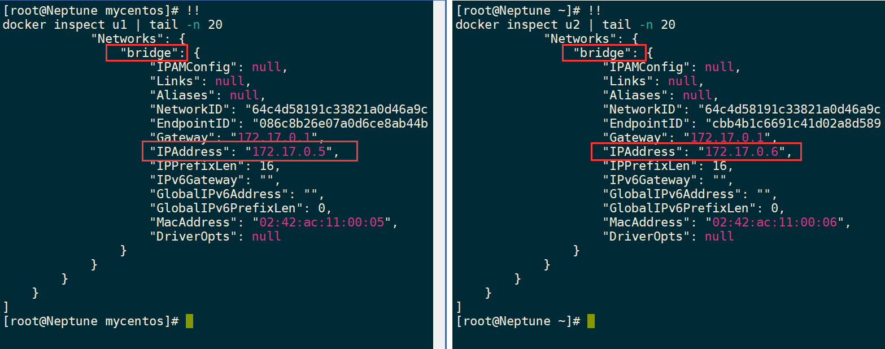

1. 关闭u2实例，新建u3，查看ip变化

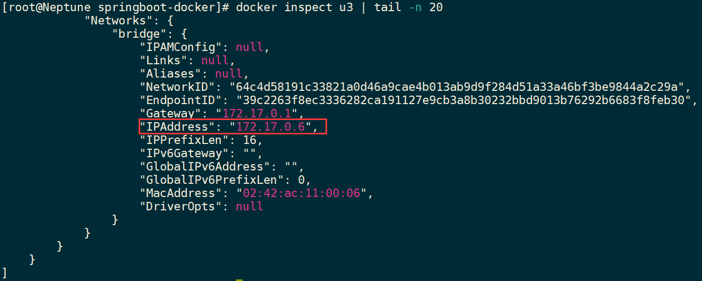

结论

**docker容器内部的ip是有可能会发生改变的**

#### bridge

Docker 服务默认会创建一个 docker0 网桥（其上有一个 docker0 内部接口），该桥接网络的名称为docker0，它在==内核层==连通了其他的物理或虚拟网卡，这就将所有容器和本地主机都放到==同一个物理网络==。Docker 默认指定了 docker0 接口 的 IP 地址和子网掩码，==让主机和容器之间可以通过网桥相互通信==。

 ```perl
# 查看 bridge 网络的详细信息，并通过 grep 获取名称项
docker network inspect bridge | grep name
 ```

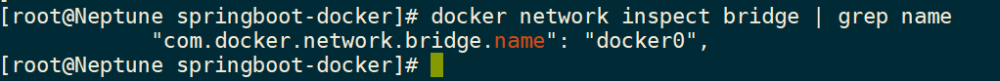

```perl
ifconfig|grep docker 
```

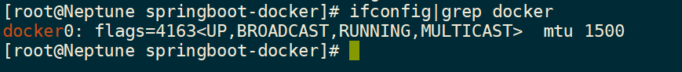

* Docker使用Linux桥接，在宿主机虚拟一个Docker容器网桥(docker0)，Docker启动一个容器时会根据Docker网桥的网段分配给容器一个IP地址，称为Container-IP，同时Docker网桥是每个容器的默认网关。因为在同一宿主机内的容器都接入同一个网桥，这样容器之间就能够通过容器的Container-IP直接通信。

* docker run 的时候，没有指定network的话默认使用的网桥模式就是bridge，使用的就是docker0。在宿主机ifconfig,就可以看到docker0和自己create的network(后面讲)eth0，eth1，eth2……代表网卡一，网卡二，网卡三……，lo代表127.0.0.1，即localhost，inet addr用来表示网卡的IP地址

* 网桥docker0创建一对对等虚拟设备接口一个叫veth，另一个叫eth0，成对匹配。
  * 整个宿主机的网桥模式都是docker0，类似一个交换机有一堆接口，每个接口叫veth，在本地主机和容器内分别创建一个虚拟接口，并让他们彼此联通（这样一对接口叫veth pair）；
  * 每个容器实例内部也有一块网卡，每个接口叫eth0；
  * docker0上面的每个veth匹配某个容器实例内部的eth0，两两配对，一一匹配。

 通过上述，将宿主机上的所有容器都连接到这个内部网络上，两个容器在同一个网络下,会从这个网关下各自拿到分配的ip，此时两个容器的网络是互通的。

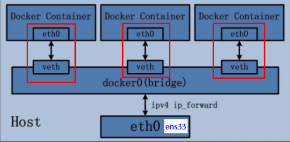

```perl
docker run -d -p 8081:8080 --name tomcat81 billygoo/tomcat8-jdk8
docker run -d -p 8082:8080 --name tomcat82 billygoo/tomcat8-jdk8
```

宿主机

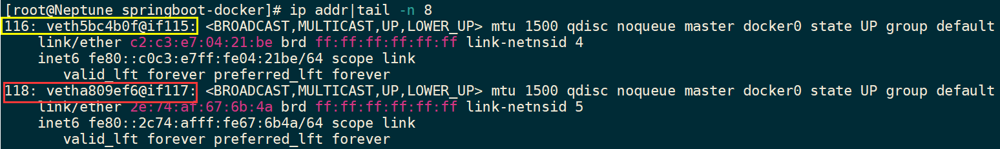

tomcat81

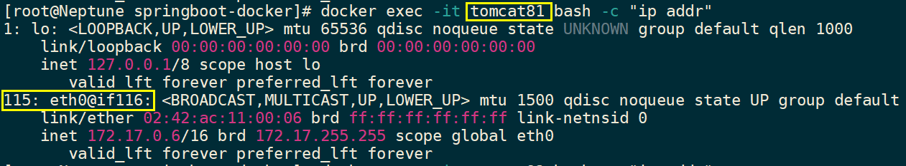

tomcat82

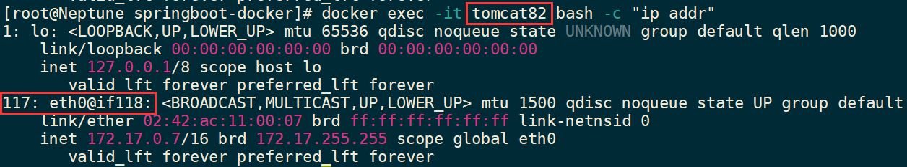

#### host

直接使用宿主机的 IP 地址与外界进行通信，不再需要额外进行NAT 转换。

容器将==不会获得==一个独立的Network Namespace， 而是和宿主机共用一个Network Namespace。

==容器将不会虚拟出自己的网卡而是使用宿主机的IP和端口==。

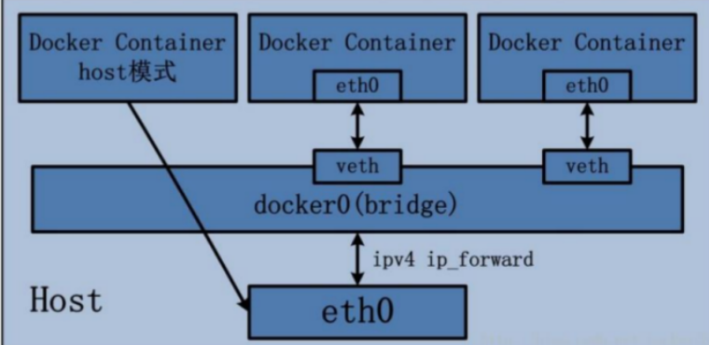


**错误演示**

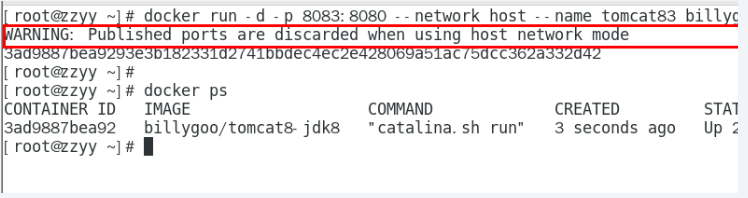

问题：

   docke启动时总是遇见标题中的警告

原因：

  docker启动时指定--network=host或-net=host，如果还指定了-p映射端口，那这个时候就会有此警告，

并且通过==-p设置的参数将不会起到任何作用==，端口号会以主机端口号为主，重复时则递增。

解决:

  解决的办法就是使用docker的其他网络模式，例如--network=bridge，这样就可以解决问题，或者直接无视。。。。O(∩_∩)O哈哈~

**正确命令**

```perl
docker run -d --network host --name tomcat83 billygoo/tomcat8-jdk8
```

无之前的配对显示了


==容器实例内部（与宿主机一致）==

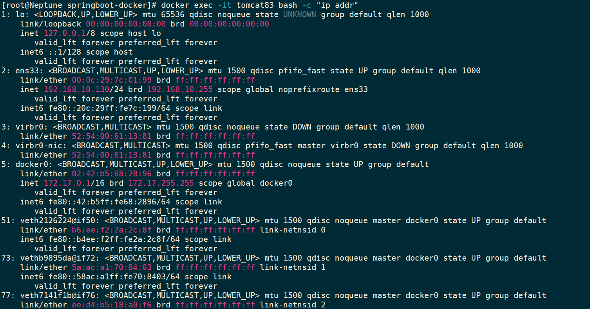

**在CentOS里面用默认的火狐浏览器访问容器内的tomcat83看到访问成功，因为此时容器的IP借用主机的，所以容器共享宿主机网络IP，这样的好处是外部主机与容器可以直接通信**

#### none

禁用网络功能，只有lo标识(就是127.0.0.1表示本地回环)

```perl
docker run -d -p 8084:8080 --network none --name tomcat84 billygoo/tomcat8-jdk8
```

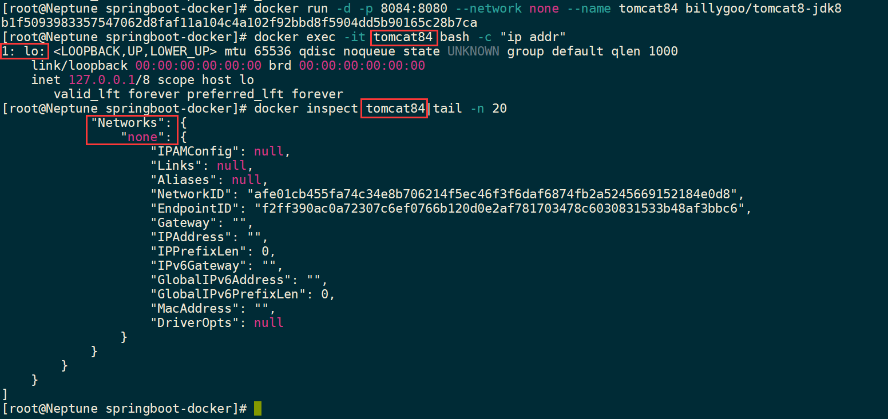

#### container

新建的容器和已经存在的一个容器共享一个网络ip配置而不是和宿主机共享。新创建的容器不会创建自己的网卡，配置自己的IP，而是和一个指定的容器共享IP、端口范围等。同样，两个容器除了网络方面，其他的如文件系统、进程列表等还是隔离的。


**错误演示**

```shell
docker run -d -p 8085:8080 --name tomcat85 billygoo/tomcat8-jdk8
docker run -d -p 8086:8080 --network container:tomcat85 --name tomcat86 billygoo/tomcat8-jdk8
```


\# 相当于tomcat86和tomcat85公用同一个ip同一个端口，导致端口冲突

本案例用**tomcat演示不合适**。。。演示坑。。。。。。o(╥﹏╥)o

换一个镜像给演示

**正确操作**

Alpine操作系统是一个面向安全的轻型Linux发行版

Alpine Linux 是一款独立的、非商业的通用 Linux 发行版，专为追求安全性、简单性和资源效率的用户而设计。 可能很多人没听说过这个 Linux 发行版本，但是经常用 Docker 的朋友可能都用过，因为他小，简单，安全而著称，所以作为基础镜像是非常好的一个选择，可谓是麻雀虽小但五脏俱全，镜像非常小巧，不到 6M的大小，所以特别适合容器打包

```perl
docker run -it --name alpine1 alpine /bin/sh
docker run -it --network container:alpine1 --name alpine2 alpine /bin/sh
```


假如此时关闭alpine1，再看看alpine2


#### 自定义网络

--link已过时


**IP地址可ping通**

```perl
docker exec -it tomcat82 bash -c "ip addr"
docker exec -it tomcat81 bash -c "ping 172.17.0.7"

docker exec -it tomcat81 bash -c "ip addr"
docker exec -it tomcat82 bash -c "ping 172.17.0.6"
```


**服务名无法ping通**

```perl
docker exec -it tomcat81 bash -c "ping tomcat82"
docker exec -it tomcat82 bash -c "ping tomcat81"
```


==自定义桥接网络,自定义网络默认使用的是桥接网络bridge==

* 新建自定义网络

```perl
docker network create nepnep
```


```perl
docker run -d -p 8086:8080 --network nepnep --name tomcat86 billygoo/tomcat8-jdk8
docker run -d -p 8087:8080 --network nepnep --name tomcat87 billygoo/tomcat8-jdk8
```

* 测试连通性

```perl
docker exec -it tomcat86 bash -c "ping tomcat87"
docker exec -it tomcat87 bash -c "ping tomcat86"
```


* 结论

==自定义网络本身就维护好了主机名和ip的对应关系（ip和域名都能通)==

## Docker平台架构图解

**整体说明**

从其架构和运行流程来看，Docker 是一个 C/S 模式的架构，后端是一个松耦合架构，众多模块各司其职。 

Docker 运行的基本流程为：

1. 用户是使用 Docker Client 与 Docker Daemon 建立通信，并发送请求给后者。
2. Docker Daemon 作为 Docker 架构中的主体部分，首先提供 Docker Server 的功能使其可以接受 Docker Client 的请求。

3. Docker Engine 执行 Docker 内部的一系列工作，每一项工作都是以一个 Job 的形式的存在。

4. Job 的运行过程中，当需要容器镜像时，则从 Docker Registry 中下载镜像，并通过镜像管理驱动 Graph driver将下载镜像以Graph的形式存储。

5. 当需要为 Docker 创建网络环境时，通过网络管理驱动 Network driver 创建并配置 Docker 容器网络环境。

6. 当需要限制 Docker 容器运行资源或执行用户指令等操作时，则通过 Execdriver 来完成。

7. Libcontainer是一项独立的容器管理包，Network driver以及Exec driver都是通过Libcontainer来实现具体对容器进行的操作。

**整体架构**


# 5 Docker-compose容器编排

## 是什么 

Docker-Compose是Docker官方的开源项目，负责实现对Docker容器集群的快速编排。

Compose 是 Docker 公司推出的一个工具软件，可以管理多个 Docker 容器组成一个应用。你需要定义一个 YAML 格式的配置文件docker-compose.yml，==写好多个容器之间的调用关系==。然后，只要一个命令，就能同时启动/关闭这些容器

## 能干嘛

docker建议我们每一个容器中只运行一个服务,因为docker容器本身占用资源极少,所以最好是将每个服务单独的分割开来但是这样我们又面临了一个问题？

如果我需要同时部署好多个服务,难道要每个服务单独写Dockerfile然后在构建镜像,构建容器,这样累都累死了,所以docker官方给我们提供了docker-compose多服务部署的工具

例如要实现一个Web微服务项目，除了Web服务容器本身，往往还需要再加上后端的数据库mysql服务容器，redis服务器，注册中心eureka，甚至还包括负载均衡容器等等。。。。。。

Compose允许用户通过一个单独的==docker-compose.yml模板文件==（YAML 格式）来定义==一组相关联的应用容器为一个项目（project）。==

可以很容易地用一个配置文件定义一个多容器的应用，然后使用一条指令安装这个应用的所有依赖，完成构建。Docker-Compose 解决了容器与容器之间如何管理编排的问题

## 去哪下

官网 https://docs.docker.com/compose/compose-file/compose-file-v3/

官网下载 https://docs.docker.com/compose/install/

**安装**

```perl
yum update
yum install docker-compose-plugin
docker compose version
docker --version
```

| **Compose file format** | **Docker Engine release** |
| :---------------------- | :------------------------ |
| Compose specification   | 19.03.0+                  |
| 3.8                     | 19.03.0+                  |
| 3.7                     | 18.06.0+                  |
| 3.6                     | 18.02.0+                  |
| 3.5                     | 17.12.0+                  |
| 3.4                     | 17.09.0+                  |
| 3.3                     | 17.06.0+                  |
| 3.2                     | 17.04.0+                  |
| 3.1                     | 1.13.1+                   |
| 3.0                     | 1.13.0+                   |
| 2.4                     | 17.12.0+                  |
| 2.3                     | 17.06.0+                  |
| 2.2                     | 1.13.0+                   |
| 2.1                     | 1.12.0+                   |
| 2.0                     | 1.10.0+                   |

## Compose核心概念

* 文件 

docker-compose.yml

* 两要素

  * 服务（service）

    一个个应用容器实例，比如订单微服务、库存微服务、mysql容器、nginx容器或者redis容器

  * 工程（project）

    由一组关联的应用容器组成的一个<font color=red>完整业务单元</font>，在docker-compose.yml文件中定义。

## Compose使用的三个步骤

* 编写Dockerfile定义各个微服务应用并构建出对应的镜像文件使用docker-compose.yml
* 定义一个完整业务单元，安排好整体应用中的各个容器服务。
* 最后，执行docker-compose up命令来启动并运行整个应用程序，完成—键部署上线

## Compose常用命令

```perl
# 查看帮助
docker-compose -h
# 启动所有docker-compose服务
docker-compose up
# 启动所有docker-compose服务并后台运行
docker-compose up -d
# 停止并删除容器、网络、卷、镜像。
docker-compose down
# 进入容器实例内部  docker-compose exec docker-compose.yml文件中写的服务id /bin/bash
docker-compose exec  yml里面的服务id
# 展示当前docker-compose编排过的运行的所有容器
docker-compose ps
# 展示当前docker-compose编排过的容器进程
docker-compose top
# 查看容器输出日志
docker-compose logs  yml里面的服务id
# 检查配置
docker-compose config
# 检查配置，有问题才有输出
docker-compose config -q
# 重启服务
docker-compose restart
# 启动服务
docker-compose start
# 停止服务
docker-compose stop      
```

## Compose编排微服务

**docker-compose.yml**

```yaml
version: "3"

services:
  microService:
    image: zzyy_docker:1.6
    container_name: ms01
    ports:
      - "6001:6001"
    volumes:
      - /app/microService:/data
    networks: 
      - atguigu_net 
    depends_on: 
      - redis
      - mysql
      
  redis:
    image: redis:6.0.8
    ports:
      - "6379:6379"
    volumes:
      - /app/redis/redis.conf:/etc/redis/redis.conf
      - /app/redis/data:/data
    networks: 
      - atguigu_net
    command: redis-server /etc/redis/redis.conf
    
  mysql:
    image: mysql:5.7
    environment:
      MYSQL_ROOT_PASSWORD: '123456'
      MYSQL_ALLOW_EMPTY_PASSWORD: 'no'
      MYSQL_DATABASE: 'db2021'
      MYSQL_USER: 'zzyy'
      MYSQL_PASSWORD: 'zzyy123'
    ports:
       - "3306:3306"
    volumes:
       - /app/mysql/db:/var/lib/mysql
       - /app/mysql/conf/my.cnf:/etc/my.cnf
       - /app/mysql/init:/docker-entrypoint-initdb.d
    networks:
      - atguigu_net
    command: --default-authentication-plugin=mysql_native_password #解决外部无法访问
    
networks: 
   atguigu_net: 
```


# 6 Docker轻量级可视化工具Portainer

## 是什么

Portainer 是一款轻量级的应用，它提供了图形化界面，用于方便地管理Docker环境，包括单机环境和集群环境。

## 安装

**官网**

https://www.portainer.io/

https://docs.portainer.io/v/ce-2.9/start/install/server/docker/linux

**步骤**

**docker命令安装**

```bash
docker run -d -p 8000:8000 -p 9000:9000 \
--name portainer \
--restart=always \
-v /var/run/docker.sock:/var/run/docker.sock \
-v portainer_data:/data/portainer \
portainer/portainer 
```

## 登陆并演示介绍常用操作case

**第一次登录需创建admin，访问地址：192.168.10.130:9000**

用户名，直接用默认admin

密码记得8位，随便你写


**设置admin用户和密码后首次登陆，选择local选项卡后本地docker详细信息展示**


Dashboard 仪表盘

**上一步的图形展示，能想得起对应命令吗？**

```perl
docker system df 
```

# 7 Docker容器监控之 CAdvisor+InfluxDB+Granfana

## 原生命令

```perl
docker stat
```

**问题**

通过docker stats命令可以很方便的看到当前宿主机上所有容器的CPU,内存以及网络流量等数据，==一般小公司够用了。。。。==

但是，docker stats统计结果只能是当前宿主机的全部容器，数据资料是实时的，没有地方存储、没有健康指标过线预警等功能

## 是什么

### 容器监控三剑客

**CAdvisor监控收集+InfluxDB存储数据+Granfana展示图表**


#### CAdvisor
CAdvisor是一个容器资源监控工具,包括容器的内存,CPU,网络IO,磁盘Io等监控,同时提供了一个WEB页面用于查看容器的实时运行状态。CAdvisor默认存储2分钟的数据,而且只是针对单物理机。不过，CAdvisor提供了很多数据集成接口,支持InfluxDB,Redis,Kafka,Elasticsearch等集成,可以加上对应配置将监控数据发往这些数据库存储起来。

CAdvisor功能主要有两点:

* 展示Host和容器两个层次的监控数据。
* 展示历史变化数据。

#### lnfluxDB
InfluxDB是用Go语言编写的一个开源分布式时序、事件和指标数据库,无需外部依赖。

CAdvisor默认只在本机保存最近2分钟的数据，为了持久化存储数据和统一收集展示监控
数据，需要将数据存储到InfluxDB中。InfluxDB是一个时序数据库,专门用于存储时序相关数据，很适合存储CAdvisor的数据。而且，CAdvisor本身已经提供了InfluxDB的集成方法，丰启动容器时指定配置即可。

lnfluxDB主要功能:

* 基于时间序列,支持与时间有关的相关函数(如最大、最小、求和等)
* 可度量性:你可以实时对大量数据进行计算
* 基于事件:它支持任意的事件数据

#### Granfana
Grafana是一个开源的数据监控分析可视化平台,支持多种数据源配置(支持的数据源包括
lnfluxDB,MySQL,Elasticsearch,OpenTSDB,Graphite等)和丰富的插件及模板功能,支持图表权限控制和报警。

Grafan主要特性:

* 灵活丰富的图形化选项
* 可以混合多种风格
* 支持白天和夜间模式
* 多个数据源


## compose容器编排三剑客

```perl
mkdir /data/cig
cd /data/cig
vim docker-compose.yml
```

```yaml
version: '3.8'

volumes:
  grafana_data: {}
  
services:
 influxdb:
  image: tutum/influxdb:0.9
  restart: always
  environment:
    - PRE_CREATE_DB=cadvisor
  ports:
    - "8083:8083"
    - "8086:8086"
  volumes:
    - ./data/influxdb:/data/influxdb
    
 cadvisor:
  image: google/cadvisor
  links:
    - influxdb:influxsrv
  command: -storage_driver=influxdb -storage_driver_db=cadvisor -storage_driver_host=influxsrv:8086
  restart: always
  ports:
    - "8080:8080"
  volumes:
    - /:/rootfs:ro
    - /var/run:/var/run:rw
    - /sys:/sys:ro
    - /var/lib/docker/:/var/lib/docker:ro

 grafana:
  user: "104"
  image: grafana/grafana
  user: "104"
  restart: always
  links:
    - influxdb:influxsrv
  ports:
    - "3000:3000"
  volumes:
    - grafana_data:/var/lib/grafana
  environment:
    - HTTP_USER=admin
    - HTTP_PASS=admin
    - INFLUXDB_HOST=influxsrv
    - INFLUXDB_PORT=8086
    - INFLUXDB_NAME=cadvisor
    - INFLUXDB_USER=root
    - INFLUXDB_PASS=root
```

```perl
docker compose up
```


## 配置服务

浏览cAdvisor==收集==服务，http://192.168.10.130:8080/
cadvisor也有基础的图形展现功能，这里主要用它来作数据采集


浏览influxdb==存储==服务，http://192.168.10.130:8083/


浏览grafana==展现==服务，http://192.168.10.130:3000

默认密码 admin/admin


配置数据源


选择InfluxDB数据源


# 8 终章の总结

知识回顾简单串讲和总结

```perl
镜像仓库
docker images
```


==进阶篇：K8S==

**单主机编排 docker compose**

**多主机编排 k8s**