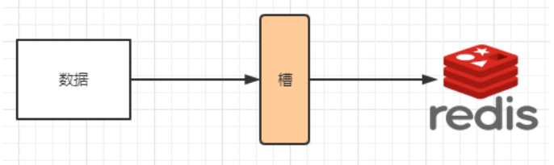

2️⃣高级篇（大厂进阶）

 

# 1 Docker复杂安装详说

## 1.1 安装MySQL主从复制

### 1.1.1 主从复制原理

https://blog.csdn.net/Guzarish/article/details/123244487

### 1.1.2 主从搭建步骤

1.  新建主服务器容器实例3307

```perl
docker run -p 3307:3306 --name mysql-master \
-v /data/mysql-master/log:/var/log/mysql \
-v /data/mysql-master/data:/var/lib/mysql \
-v /data/mysql-master/conf:/etc/mysql \
-e MYSQL_ROOT_PASSWORD=root  \
-d mysql:5.7
```

2. 进入/data/mysql-master/conf目录下新建my.cnf

```perl
cd /data/mysql-master/conf
vim my.cnf
[mysqld]
## 设置server_id，同一局域网中需要唯一
server_id=101 
## 指定不需要同步的数据库名称
binlog-ignore-db=mysql  
## 开启二进制日志功能
log-bin=mall-mysql-bin  
## 设置二进制日志使用内存大小（事务）
binlog_cache_size=1M  
## 设置使用的二进制日志格式（mixed,statement,row）
binlog_format=mixed  
## 二进制日志过期清理时间。默认值为0，表示不自动清理。
expire_logs_days=7  
## 跳过主从复制中遇到的所有错误或指定类型的错误，避免slave端复制中断。
## 如：1062错误是指一些主键重复，1032错误是因为主从数据库数据不一致
slave_skip_errors=1062
```

3. 修改完配置后重启master实例

```perl
docker restart mysql-master
```

4. 进入mysql-master容器

```perl
docker exec -it mysql-master /bin/bash
mysql -uroot -proot
```

5. master容器实例内创建数据同步用户

```perl
CREATE USER 'slave'@'%' IDENTIFIED BY '123456';
GRANT REPLICATION SLAVE, REPLICATION CLIENT ON *.* TO 'slave'@'%';
```

6. 新建从服务器容器实例3308

```perl
docker run -p 3308:3306 --name mysql-slave \
-v /data/mysql-slave/log:/var/log/mysql \
-v /data/mysql-slave/data:/var/lib/mysql \
-v /data/mysql-slave/conf:/etc/mysql \
-e MYSQL_ROOT_PASSWORD=root  \
-d mysql:5.7
```

7. 进入/data/mysql-slave/conf目录下新建my.cnf

```perl
vim my.cnf
[mysqld]
## 设置server_id，同一局域网中需要唯一
server_id=102
## 指定不需要同步的数据库名称
binlog-ignore-db=mysql  
## 开启二进制日志功能，以备Slave作为其它数据库实例的Master时使用
log-bin=mall-mysql-slave1-bin  
## 设置二进制日志使用内存大小（事务）
binlog_cache_size=1M  
## 设置使用的二进制日志格式（mixed,statement,row）
binlog_format=mixed  
## 二进制日志过期清理时间。默认值为0，表示不自动清理。
expire_logs_days=7  
## 跳过主从复制中遇到的所有错误或指定类型的错误，避免slave端复制中断。
## 如：1062错误是指一些主键重复，1032错误是因为主从数据库数据不一致
slave_skip_errors=1062  
## relay_log配置中继日志
relay_log=mall-mysql-relay-bin  
## log_slave_updates表示slave将复制事件写进自己的二进制日志
log_slave_updates=1  
## slave设置为只读（具有super权限的用户除外）
read_only=1
```

8. 修改完配置后重启slave实例

```perl
docker restart mysql-slave
```

9. 在主数据库中查看主从同步状态

```perl
show master status;
```

10. 进入mysql-slave容器

```perl
docker exec -it mysql-slave /bin/bash
mysql -uroot -proot
```

11. 在从数据库中配置主从复制

```bash
change master to master_host='宿主机ip', master_user='slave', master_password='123456', 
master_port=3307, master_log_file='mall-mysql-bin.000001', master_log_pos=617, master_connect_retry=30;
```

```shell
[root@Neptune ~]# docker exec -it mysql-slave bash
root@4e02cd70fb8f:/# mysql -uroot -proot
mysql: [Warning] Using a password on the command line interface can be insecure.
Welcome to the MySQL monitor.  Commands end with ; or \g.
Your MySQL connection id is 2
Server version: 5.7.36-log MySQL Community Server (GPL)

Copyright (c) 2000, 2021, Oracle and/or its affiliates.

Oracle is a registered trademark of Oracle Corporation and/or its
affiliates. Other names may be trademarks of their respective
owners.

Type 'help;' or '\h' for help. Type '\c' to clear the current input statement.

mysql> change master to master_host='192.168.10.130', master_user='slave', master_password='123456',
    -> master_port=3307, master_log_file='mall-mysql-bin.000001', master_log_pos=617, master_connect_retry=30;
Query OK, 0 rows affected, 2 warnings (0.01 sec)

mysql>

```

主从复制命令参数说明

`master_host`：主数据库的IP地址；

`master_port`：主数据库的运行端口；

`master_user`：在主数据库创建的用于同步数据的用户账号；

`master_password`：在主数据库创建的用于同步数据的用户密码；

`master_log_file`：指定从数据库要复制数据的日志文件，通过查看主数据的状态，获取File参数；

`master_log_pos`：指定从数据库从哪个位置开始复制数据，通过查看主数据的状态，获取Position参数；

`master_connect_retry`：连接失败重试的时间间隔，单位为秒。

12. 在从数据库中查看主从同步状态

```perl
show slave status \G;
```


13. 在从数据库中开启主从同步

```perl
start slave;
```

14. 查看从数据库状态发现已经同步


15. 主从复制测试

1. 主机新建库-使用库-新建表-插入数据，ok

2. 从机使用库-查看记录，ok


## 1.2 安装redis集群(大厂面试题第4季-分布式存储案例真题)

cluster(集群)模式-docker版

哈希槽分区进行亿级数据存储

### 1.2.1 面试题

1~2亿条数据需要缓存，请问如何设计这个存储案例？

回答：单机单台100%不可能，肯定是分布式存储，用redis如何落地？

上述问题阿里P6~P7工程案例和场景设计类必考题目， 一般业界有3种解决方案

1. 哈希取余分区


2亿条记录就是2亿个k,v，我们单机不行必须要分布式多机，假设有3台机器构成一个集群，用户每次读写操作都是根据公式：

hash(key) % N个机器台数，计算出哈希值，用来决定数据映射到哪一个节点上。

优点：

  简单粗暴，直接有效，只需要预估好数据规划好节点，例如3台、8台、10台，就能保证一段时间的数据支撑。使用Hash算法让固定的一部分请求落到同一台服务器上，这样每台服务器固定处理一部分请求（并维护这些请求的信息），起到负载均衡+分而治之的作用。

缺点：

   原来规划好的节点，进行扩容或者缩容就比较麻烦了额，不管扩缩，每次数据变动导致节点有变动，映射关系需要重新进行计算，在服务器个数固定不变时没有问题，如果需要弹性扩容或故障停机的情况下，原来的取模公式就会发生变化：Hash(key)/3会变成Hash(key) /?。此时地址经过取余运算的结果将发生很大变化，根据公式获取的服务器也会变得不可控。

某个redis机器宕机了，由于台数数量变化，会导致hash取余全部数据重新洗牌。

2. 一致性哈希算法分区

是什么

一致性Hash算法背景

　　一致性哈希算法在1997年由麻省理工学院中提出的，设计目标是为了解决分布式缓存数据变动和映射问题，某个机器宕机了，分母数量改变了，自然取余数不OK了。

2.1 能干嘛

提出一致性Hash解决方案。 目的是当服务器个数发生变动时， 尽量减少影响客户端到服务器的映射关系

2.2 大步骤

2.2.1 算法构建一致性哈希环

一致性哈希环

​        一致性哈希算法必然有个hash函数并按照算法产生hash值，这个算法的所有可能哈希值会构成一个全量集，这个集合可以成为一个hash空间[0,2^32-1]，这个是一个线性空间，但是在算法中，我们通过适当的逻辑控制将它首尾相连(0 = 2^32),这样让它逻辑上形成了一个环形空间。

​        它也是按照使用取模的方法，前面笔记介绍的节点取模法是对节点（服务器）的数量进行取模。而一致性Hash算法是对2^32取模，简单来说，一致性Hash算法将整个哈希值空间组织成一个虚拟的圆环，如假设某哈希函数H的值空间为0-2^32-1（即哈希值是一个32位无符号整形），整个哈希环如下图：整个空间按顺时针方向组织，圆环的正上方的点代表0，0点右侧的第一个点代表1，以此类推，2、3、4、……直到2^32-1，也就是说0点左侧的第一个点代表2^32-1， 0和2^32-1在零点中方向重合，我们把这个由2^32个点组成的圆环称为Hash环。


2.2.2 服务器IP节点映射

节点映射

   将集群中各个IP节点映射到环上的某一个位置。

   将各个服务器使用Hash进行一个哈希，具体可以选择服务器的IP或主机名作为关键字进行哈希，这样每台机器就能确定其在哈希环上的位置。假如4个节点NodeA、B、C、D，经过IP地址的哈希函数计算(hash(ip))，使用IP地址哈希后在环空间的位置如下：  


2.2.3 key落到服务器的落键规则

当我们需要存储一个kv键值对时，首先计算key的hash值，hash(key)，将这个key使用相同的函数Hash计算出哈希值并确定此数据在环上的位置，从此位置沿环顺时针“行走”，第一台遇到的服务器就是其应该定位到的服务器，并将该键值对存储在该节点上。

如我们有Object A、Object B、Object C、Object D四个数据对象，经过哈希计算后，在环空间上的位置如下：根据一致性Hash算法，数据A会被定为到Node A上，B被定为到Node B上，C被定为到Node C上，D被定为到Node D上。


2.2.4 优点

2.2.4.1 ==一致性哈希算法的容错性==


容错性

假设Node C宕机，可以看到此时对象A、B、D不会受到影响，只有C对象被重定位到Node D。一般的，在一致性Hash算法中，如果一台服务器不可用，则受影响的数据仅仅是此服务器到其环空间中前一台服务器（即沿着逆时针方向行走遇到的第一台服务器）之间数据，其它不会受到影响。简单说，就是C挂了，受到影响的只是B、C之间的数据，并且这些数据会转移到D进行存储。


2.2.4.2 ==一致性哈希算法的扩展性==

数据量增加了，需要增加一台节点NodeX，X的位置在A和B之间，那收到影响的也就是A到X之间的数据，重新把A到X的数据录入到X上即可，

不会导致hash取余全部数据重新洗牌。


2.2.5 缺点

==一致性哈希算法的数据倾斜问题==

Hash环的数据倾斜问题

一致性Hash算法在服务节点太少时，容易因为节点分布不均匀而造成数据倾斜（被缓存的对象大部分集中缓存在某一台服务器上）问题，

例如系统中只有两台服务器：


3. 小总结

为了在节点数目发生改变时尽可能少的迁移数据

将所有的存储节点排列在收尾相接的Hash环上，每个key在计算Hash后会顺时针找到临近的存储节点存放。

而当有节点加入或退出时仅影响该节点在Hash环上顺时针相邻的后续节点。  

优点

加入和删除节点只影响哈希环中顺时针方向的相邻的节点，对其他节点无影响。

缺点 

数据的分布和节点的位置有关，因为这些节点不是均匀的分布在哈希环上的，所以数据在进行存储时达不到均匀分布的效果。

3. 哈希槽分区

3.1 是什么

3.1.2 为什么出现

==为了解决一致性哈希算法的数据倾斜问题==

哈希槽实质就是一个数组，数组[0,2^14 -1]形成hash slot空间。

3.1.3 能干什么

解决均匀分配的问题，在数据和节点之间又加入了一层，把这层称为哈希槽（slot），用于管理数据和节点之间的关系，现在就相当于节点上放的是槽，槽里放的是数据。



槽解决的是粒度问题，相当于把粒度变大了，这样便于数据移动。

哈希解决的是映射问题，使用key的哈希值来计算所在的槽，便于数据分配。

3.1.4 多少个hash槽

一个集群只能有16384个槽，编号0-16383（0-2^14-1）。这些槽会分配给集群中的所有主节点，分配策略没有要求。可以指定哪些编号的槽分配给哪个主节点。集群会记录节点和槽的对应关系。解决了节点和槽的关系后，接下来就需要对key求哈希值，然后对16384取余，余数是几key就落入对应的槽里。slot = CRC16(key) % 16384。以槽为单位移动数据，因为槽的数目是固定的，处理起来比较容易，这样数据移动问题就解决了。

3.1.4.1 哈希槽计算

Redis 集群中内置了 16384 个哈希槽，redis 会根据节点数量大致均等的将哈希槽映射到不同的节点。当需要在 Redis 集群中放置一个 key-value时，redis 先对 key 使用 crc16 算法算出一个结果，然后把结果对 16384 求余数，这样每个 key 都会对应一个编号在 0-16383 之间的哈希槽，也就是映射到某个节点上。如下代码，key之A 、B在Node2， key之C落在Node3上


```java
@Test
public void test3(){
// import io.lettuce.core.cluster.sLotHash;
System.out.println(slotHash.getslot( key: "A"));//6373
System.out.println(slotHash.getslot( key: "B"));//1037
System.out.println(slotHash.getslot( key: "c"));//14503
System.out.println(slotHash.getslot( key: "hello"));//866
}
```

### 1.2.2 3主3从redis集群扩缩容配置案例架构说明

### 1.2.3 步骤


关闭防火墙+启动docker后台服务

```perl
systemctl start docker
```

新建6个docker容器redis实例

```perl
docker run -d --name redis-node-1 --net host --privileged=true -v /data/redis/share/redis-node-1:/data redis:6.0.8 --cluster-enabled yes --appendonly yes --port 6381
 
docker run -d --name redis-node-2 --net host --privileged=true -v /data/redis/share/redis-node-2:/data redis:6.0.8 --cluster-enabled yes --appendonly yes --port 6382
 
docker run -d --name redis-node-3 --net host --privileged=true -v /data/redis/share/redis-node-3:/data redis:6.0.8 --cluster-enabled yes --appendonly yes --port 6383
 
docker run -d --name redis-node-4 --net host --privileged=true -v /data/redis/share/redis-node-4:/data redis:6.0.8 --cluster-enabled yes --appendonly yes --port 6384
 
docker run -d --name redis-node-5 --net host --privileged=true -v /data/redis/share/redis-node-5:/data redis:6.0.8 --cluster-enabled yes --appendonly yes --port 6385
 
docker run -d --name redis-node-6 --net host --privileged=true -v /data/redis/share/redis-node-6:/data redis:6.0.8 --cluster-enabled yes --appendonly yes --port 6386
```

命令分步解释

`docker run` 创建并运行docker容器实例

`--name redis-node-6` 容器名字

`--net host` 使用宿主机的IP和端口，默认

`--privileged=true` 获取宿主机root用户权限

`-v /data/redis/share/redis-node-6:/data` 容器卷，宿主机地址:docker内部地址

`redis:6.0.8 redis` 镜像和版本号

`--cluster-enabled yes` 开启redis集群

`--appendonly yes` 开启持久化

`--port 6386` redis端口号

```shell
[root@Neptune ~]# docker ps
CONTAINER ID   IMAGE          COMMAND                  CREATED          STATUS          PORTS                                                  NAMES
fb8b1b40abcd   redis:6.0.8    "docker-entrypoint.s…"   31 seconds ago   Up 30 seconds                                                          redis-node-6
3a20b4535bbd   redis:6.0.8    "docker-entrypoint.s…"   33 seconds ago   Up 32 seconds                                                          redis-node-5
dd29551d395e   redis:6.0.8    "docker-entrypoint.s…"   33 seconds ago   Up 32 seconds                                                          redis-node-4
f7e7139b1de2   redis:6.0.8    "docker-entrypoint.s…"   33 seconds ago   Up 32 seconds                                                          redis-node-3
c7329e573055   redis:6.0.8    "docker-entrypoint.s…"   33 seconds ago   Up 32 seconds                                                          redis-node-2
d91445434800   redis:6.0.8    "docker-entrypoint.s…"   34 seconds ago   Up 32 seconds                                                          redis-node-1
4e02cd70fb8f   mysql:5.7      "docker-entrypoint.s…"   5 hours ago      Up 5 hours      33060/tcp, 0.0.0.0:3308->3306/tcp, :::3308->3306/tcp   mysql-slave
befa3ca70879   mysql:5.7      "docker-entrypoint.s…"   5 hours ago      Up 5 hours      33060/tcp, 0.0.0.0:3307->3306/tcp, :::3307->3306/tcp   mysql-master
3d30a6409b53   dbz_test:1.9   "/docker-entrypoint.…"   2 weeks ago      Up 11 days      0.0.0.0:8083->8083/tcp, :::8083->8083/tcp, 9092/tcp    dbz_130_kisa
```

进入容器redis-node-1并为6台机器构建集群关系

进入容器

```perl
docker exec -it redis-node-1 /bin/bash
```

构建主从关系

==注意，进入docker容器后才能执行一下命令，且注意自己的真实IP地址==

==--cluster-replicas 1 表示为每个master创建一个slave节点==

```perl
redis-cli --cluster create 192.168.10.130:6381 192.168.10.130:6382 192.168.10.130:6383 192.168.10.130:6384 192.168.10.130:6385 192.168.10.130:6386 --cluster-replicas 1
```

一切OK的话，3主3从搞定

```shell
[root@Neptune ~]# docker exec -it redis-node-1 /bin/bash
root@Neptune:/data# redis-cli --cluster create 192.168.10.130:6381 192.168.10.130:6382 192.168.10.130:6383 192.168.10.130:6384 192.168.10.130:6385 192.168.10.130:6386 --cluster-replicas 1
>>> Performing hash slots allocation on 6 nodes...
Master[0] -> Slots 0 - 5460
Master[1] -> Slots 5461 - 10922
Master[2] -> Slots 10923 - 16383
Adding replica 192.168.10.130:6385 to 192.168.10.130:6381
Adding replica 192.168.10.130:6386 to 192.168.10.130:6382
Adding replica 192.168.10.130:6384 to 192.168.10.130:6383
>>> Trying to optimize slaves allocation for anti-affinity
[WARNING] Some slaves are in the same host as their master
M: cbdef3293df1737d6a7563571cb3befbd80254c6 192.168.10.130:6381
   slots:[0-5460] (5461 slots) master
M: df379831d26b9178b2dc2d31296ff12c17bdd8c3 192.168.10.130:6382
   slots:[5461-10922] (5462 slots) master
M: 105b567b483e37e69e5259933f24783a655610e1 192.168.10.130:6383
   slots:[10923-16383] (5461 slots) master
S: 1f46c02e05f5462b474ff0db01f95ad78394c8b3 192.168.10.130:6384
   replicates 105b567b483e37e69e5259933f24783a655610e1
S: e350401679cbb0c5ff54dcad056744b3c3deaf50 192.168.10.130:6385
   replicates cbdef3293df1737d6a7563571cb3befbd80254c6
S: c9c38b60cd0b2087a9abc8b2c764082d55f8c9ac 192.168.10.130:6386
   replicates df379831d26b9178b2dc2d31296ff12c17bdd8c3
Can I set the above configuration? (type 'yes' to accept): yes
>>> Nodes configuration updated
>>> Assign a different config epoch to each node
>>> Sending CLUSTER MEET messages to join the cluster
Waiting for the cluster to join
..
>>> Performing Cluster Check (using node 192.168.10.130:6381)
M: cbdef3293df1737d6a7563571cb3befbd80254c6 192.168.10.130:6381
   slots:[0-5460] (5461 slots) master
   1 additional replica(s)
S: 1f46c02e05f5462b474ff0db01f95ad78394c8b3 192.168.10.130:6384
   slots: (0 slots) slave
   replicates 105b567b483e37e69e5259933f24783a655610e1
M: df379831d26b9178b2dc2d31296ff12c17bdd8c3 192.168.10.130:6382
   slots:[5461-10922] (5462 slots) master
   1 additional replica(s)
M: 105b567b483e37e69e5259933f24783a655610e1 192.168.10.130:6383
   slots:[10923-16383] (5461 slots) master
   1 additional replica(s)
S: e350401679cbb0c5ff54dcad056744b3c3deaf50 192.168.10.130:6385
   slots: (0 slots) slave
   replicates cbdef3293df1737d6a7563571cb3befbd80254c6
S: c9c38b60cd0b2087a9abc8b2c764082d55f8c9ac 192.168.10.130:6386
   slots: (0 slots) slave
   replicates df379831d26b9178b2dc2d31296ff12c17bdd8c3
[OK] All nodes agree about slots configuration.
>>> Check for open slots...
>>> Check slots coverage...
[OK] All 16384 slots covered.
root@Neptune:/data#
```

进入6381作为切入点，查看集群状态与节点状态，防止路由失效加参数-c

```perl
redis-cli -p 6381 -c
cluster info
cluster nodes
```

```shell
root@Neptune:/data# redis-cli -p 6381 -c
127.0.0.1:6381> cluster info
cluster_state:ok
cluster_slots_assigned:16384
cluster_slots_ok:16384
cluster_slots_pfail:0
cluster_slots_fail:0
cluster_known_nodes:6
cluster_size:3
cluster_current_epoch:6
cluster_my_epoch:1
cluster_stats_messages_ping_sent:76
cluster_stats_messages_pong_sent:85
cluster_stats_messages_sent:161
cluster_stats_messages_ping_received:80
cluster_stats_messages_pong_received:76
cluster_stats_messages_meet_received:5
cluster_stats_messages_received:161
127.0.0.1:6381> cluster nodes
1f46c02e05f5462b474ff0db01f95ad78394c8b3 192.168.10.130:6384@16384 slave 105b567b483e37e69e5259933f24783a655610e1 0 1668248766000 3 connected
df379831d26b9178b2dc2d31296ff12c17bdd8c3 192.168.10.130:6382@16382 master - 0 1668248768581 2 connected 5461-10922
105b567b483e37e69e5259933f24783a655610e1 192.168.10.130:6383@16383 master - 0 1668248766571 3 connected 10923-16383
e350401679cbb0c5ff54dcad056744b3c3deaf50 192.168.10.130:6385@16385 slave cbdef3293df1737d6a7563571cb3befbd80254c6 0 1668248768000 1 connected
cbdef3293df1737d6a7563571cb3befbd80254c6 192.168.10.130:6381@16381 myself,master - 0 1668248766000 1 connected 0-5460
c9c38b60cd0b2087a9abc8b2c764082d55f8c9ac 192.168.10.130:6386@16386 slave df379831d26b9178b2dc2d31296ff12c17bdd8c3 0 1668248769588 2 connected
127.0.0.1:6381>
```

主从容错切换迁移案例

容错切换迁移

```perl
redis-cli --cluster check 192.168.10.130:6381
```


**1号恢复后，不再是master，此时将4号关闭，1号变为master，4号再启动变为slave**

### 1.3 主从扩容案例


新建6387、6388两个节点+新建后启动+查看是否8节点

```perl
docker run -d --name redis-node-7 --net host --privileged=true -v /data/redis/share/redis-node-7:/data redis:6.0.8 --cluster-enabled yes --appendonly yes --port 6387

docker run -d --name redis-node-8 --net host --privileged=true -v /data/redis/share/redis-node-8:/data redis:6.0.8 --cluster-enabled yes --appendonly yes --port 6388

docker ps
```

进入6387容器实例内部

```perl
docker exec -it redis-node-7 /bin/bash
```

将新增的6387作为master节点加入集群

6387就是将要作为master新增节点
6381就是原来集群节点里面的领路人，相当于6387拜拜6381的码头从而找到组织加入集群

```perl
redis-cli --cluster add-node 192.168.10.130:6387 192.168.10.130:6381
```


检查集群情况第一次

```perl
redis-cli --cluster check 192.168.10.130:6381
```


重新分派槽号

```perl
redis-cli --cluster reshard 192.168.10.130:6381
```


检查集群情况第二次

```perl
redis-cli --cluster check 192.168.10.130:6381
```


为什么6387是3个新的区间，以前的还是连续？

**重新分配成本太高，所以前3家各自匀出来一部分，从6381/6382/6383三个旧节点分别匀出1364个坑位**

为主节点6387分配从节点6388

`命令：redis-cli --cluster add-node ip:新slave端口 ip:新master端口 --cluster-slave --cluster-master-id 新主机节点ID`

```perl
redis-cli --cluster add-node 192.168.10.130:6388 192.168.10.130:6387 --cluster-slave --cluster-master-id 44d64780502850e313eec11f9863c50db7dc173a        -------这个是6387的编号，按照自己实际情况
```


检查集群情况第三次

```perl
redis-cli --cluster check 192.168.10.130:6381
```


**扩容完成，四主四从**

### 1.4 主从缩容案例


检查集群情况第一次，获得6388的节点ID

```perl
redis-cli --cluster check 192.168.10.130:6381
```

从集群中将4号从节点6388删除

`命令：redis-cli --cluster del-node ip:从机端口 从机6388节点ID`

 ```perl
redis-cli --cluster del-node 192.168.10.130:6388 3f90bb830cfebd0709fa87981547baf520f65c17
 ```


检查集群情况第二次，确认6388节点已被删除

```perl
redis-cli --cluster check 192.168.10.130:6381
```


将6387的槽号清空，重新分配，本例将清出来的槽号都给6381

```perl
redis-cli --cluster reshard 192.168.10.130:6381
```


检查集群情况第三次

```perl
redis-cli --cluster check 192.168.10.130:6381
```


**4096个槽位都指给6381，它变成了8192个槽位，相当于全部都给6381了，不然要输入3次，一锅端**

删除节点6387

`命令：redis-cli --cluster del-node ip:端口 6387节点ID`

```perl
redis-cli --cluster del-node 192.168.10.130:6387 44d64780502850e313eec11f9863c50db7dc173a
```


检查集群情况第四次

```perl
redis-cli --cluster check 192.168.10.130:6381
```


**三主三从，已完成缩容**

# 2 DockerFile解析

## 2.1 是什么

Dockerfile是用来构建Docker镜像的文本文件，是由一条条构建镜像所需的指令和参数构成的脚本。

**概述**


**官网**

https://docs.docker.com/engine/reference/builder/

**构建三步骤**

1. 编写Dockerfile文件
2. docker build 命令构建镜像
3. docker run 镜像 运行容器实例

## 2.2 DockerFile构建过程解析

### 2.2.1 Dockerfile内容基础知识

1. 每条保留字指令都必须为大写字母且后面要跟随至少一个参数
2. 指令按照从上到下，顺序执行
3. \#表示注释
4. 每条指令都会创建一个新的镜像层并对镜像进行提交

### 2.2.2 Docker执行Dockerfile的大致流程

1. docker从基础镜像运行一个容器
2. 执行一条指令并对容器作出修改
3. 执行类似docker commit的操作提交一个新的镜像层
4. docker再基于刚提交的镜像运行一个新容器
5. 执行dockerfile中的下一条指令直到所有指令都执行完成

### 2.2.3 小总结

从应用软件的角度来看，Dockerfile、Docker镜像与Docker容器分别代表软件的三个不同阶段，

- Dockerfile是软件的原材料
- Docker镜像是软件的交付品
- Docker容器则可以认为是软件镜像的运行态，也即依照镜像运行的容器实例

Dockerfile面向开发，Docker镜像成为交付标准，Docker容器则涉及部署与运维，三者缺一不可，合力充当Docker体系的基石。


1. Dockerfile，需要定义一个Dockerfile，Dockerfile定义了进程需要的一切东西。Dockerfile涉及的内容包括执行代码或者是文件、环境变量、依赖包、运行时环境、动态链接库、操作系统的发行版、服务进程和内核进程(当应用进程需要和系统服务和内核进程打交道，这时需要考虑如何设计namespace的权限控制)等等;
2. Docker镜像，在用Dockerfile定义一个文件之后，docker build时会产生一个Docker镜像，当运行 Docker镜像时会真正开始提供服务;
3. Docker容器，容器是直接提供服务的。

## 2.3 DockerFile常用保留字指令

**参考tomcat8的dockerfile入门**

https://github.com/docker-library/tomcat

**FROM**

基础镜像，当前新镜像是基于哪个镜像的，指定一个已经存在的镜像作为模板，第一条必须是from

**MAINTAINER**

镜像维护者的姓名和邮箱地址

**RUN**

容器构建时需要运行的命令

两种格式

1. shell格式


```
RUN yum -y install vim
```

1. exec格式


RUN是在 docker build时运行

**EXPOSE**

当前容器对外暴露出的端口

**WORKDIR**

指定在创建容器后，终端默认登陆的进来工作目录，一个落脚点

**USER**

指定该镜像以什么样的用户去执行，如果都不指定，默认是root

**ENV**

用来在构建镜像过程中设置环境变量

```
ENV MY_PATH /usr/mytest
```

这个环境变量可以在后续的任何RUN指令中使用，这就如同在命令前面指定了环境变量前缀一样；

也可以在其它指令中直接使用这些环境变量。

比如：`WORKDIR $MY_PATH`

**ADD**

将宿主机目录下的文件拷贝进镜像且会自动处理URL和解压tar压缩包

**COPY**

类似ADD，拷贝文件和目录到镜像中。

将从构建上下文目录中 <源路径> 的文件/目录复制到新的一层的镜像内的 <目标路径> 位置

```
COPY src dest
COPY ["src", "dest"]
```

<src源路径>：源文件或者源目录

<dest目标路径>：容器内的指定路径，该路径不用事先建好，路径不存在的话，会自动创建。

**VOLUME**

容器数据卷，用于数据保存和持久化工作

**CMD**

指定容器启动后的要干的事情


**注意：**

Dockerfile 中可以有多个 CMD 指令，但只有最后一个生效，CMD 会被 docker run 之后的参数替换。

参考官网Tomcat的dockerfile演示讲解：

官网最后一行命令


我们演示自己的覆盖操作


它和前面RUN命令的区别

- CMD是在docker run 时运行。
- RUN是在 docker build 时运行。

**ENTRYPOINT**

也是用来指定一个容器启动时要运行的命令

类似于 CMD 指令，但是ENTRYPOINT不会被docker run后面的命令覆盖， 而且这些命令行参数会被当作参数送给 ENTRYPOINT 指令指定的程序。

命令格式和案例说明

 命令格式：


ENTRYPOINT可以和CMD一起用，一般是变参才会使用 CMD ，这里的 CMD 等于是在给 ENTRYPOINT 传参。

当指定了ENTRYPOINT后，CMD的含义就发生了变化，不再是直接运行其命令而是将CMD的内容作为参数传递给ENTRYPOINT指令，他两个组合会变成

 

案例如下：假设已通过 Dockerfile 构建了 nginx:test 镜像：


优点：在执行docker run的时候可以指定 ENTRYPOINT 运行所需的参数。

注意：如果 Dockerfile 中如果存在多个 ENTRYPOINT 指令，仅最后一个生效。

**小总结**


## 2.4 案例

### 2.4.1 自定义镜像mycentosjava8

**要求**

Centos7镜像具备vim+ifconfig+jdk8


JDK的下载镜像地址：https://www.oracle.com/java/technologies/downloads/#java8


https://mirrors.yangxingzhen.com/jdk/

**编写**

准备编写Dockerfile文件

```dockerfile
FROM centos
MAINTAINER zzyy<zzyybs@126.com>

ENV MYPATH /usr/local
WORKDIR $MYPATH

#安装vim编辑器
RUN yum -y install vim
#安装ifconfig命令查看网络IP
RUN yum -y install net-tools
#安装java8及lib库
RUN yum -y install glibc.i686
RUN mkdir /usr/local/java
#ADD 是相对路径jar,把jdk-8u171-linux-x64.tar.gz添加到容器中,安装包必须要和Dockerfile文件在同一位置
ADD jdk-8u171-linux-x64.tar.gz /usr/local/java/
#配置java环境变量
ENV JAVA_HOME /usr/local/java/jdk1.8.0_171
ENV JRE_HOME $JAVA_HOME/jre
ENV CLASSPATH $JAVA_HOME/lib/dt.jar:$JAVA_HOME/lib/tools.jar:$JRE_HOME/lib:$CLASSPATH
ENV PATH $JAVA_HOME/bin:$PATH

EXPOSE 80

CMD echo $MYPATH
CMD echo "success--------------ok"
CMD /bin/bash
```

大写字母D

**构建**

docker build -t 新镜像名字:TAG .

```
docker build -t centosjava8:1.5 .
```


注意，上面TAG后面有个空格，有个点

**运行**

docker run -it 新镜像名字:TAG 

```
docker run -it centosjava8:1.5 /bin/bash
```


**再体会下UnionFS（联合文件系统）**

UnionFS（联合文件系统）：Union文件系统（UnionFS）是一种分层、轻量级并且高性能的文件系统，它支持对文件系统的修改作为一次提交来一层层的叠加，同时可以将不同目录挂载到同一个虚拟文件系统下(unite several directories into a single virtual filesystem)。Union 文件系统是 Docker 镜像的基础。镜像可以通过分层来进行继承，基于基础镜像（没有父镜像），可以制作各种具体的应用镜像。

 

特性：一次同时加载多个文件系统，但从外面看起来，只能看到一个文件系统，联合加载会把各层文件系统叠加起来，这样最终的文件系统会包含所有底层的文件和目录

### 2.4.2 虚悬镜像

**是什么**

仓库名、标签都是<none>的镜像，俗称dangling image

Dockerfile写一个

1. `vim Dockerfile`

```dockerfile
from ubuntu
CMD echo 'action is success'
```

1. `docker build .`


**查看**

```
docker image ls -f dangling=true
```

命令结果


**删除**

```
docker image prune
```

虚悬镜像已经失去存在价值，可以删除


### 2.4.3 家庭作业-自定义镜像myubuntu

**编写**

准备编写DockerFile文件


```dockerfile
FROM ubuntu
MAINTAINER zzyy<zzyybs@126.com>
 
ENV MYPATH /usr/local
WORKDIR $MYPATH
 
RUN apt-get update
RUN apt-get install net-tools
#RUN apt-get install -y iproute2
#RUN apt-get install -y inetutils-ping
 
EXPOSE 80
 
CMD echo $MYPATH
CMD echo "install inconfig cmd into ubuntu success--------------ok"
CMD /bin/bash
```

**构建**

```
docker build -t 新镜像名字:TAG .
```

**运行**

```
docker run -it 新镜像名字:TAG
```

## 2.5 小总结


# 3 Docker微服务实战

## 3.1 通过IDEA新建一个普通微服务模块

**建Module**

docker_boot

**改POM**

```xml
<?xml version="1.0" encoding="UTF-8"?>
<project xmlns="http://maven.apache.org/POM/4.0.0" xmlns:xsi="http://www.w3.org/2001/XMLSchema-instance"
         xsi:schemaLocation="http://maven.apache.org/POM/4.0.0 https://maven.apache.org/xsd/maven-4.0.0.xsd">
  <modelVersion>4.0.0</modelVersion>
  <parent>
    <groupId>org.springframework.boot</groupId>
    <artifactId>spring-boot-starter-parent</artifactId>
    <version>2.5.6</version>
    <relativePath/>
  </parent>
  
  <groupId>com.atguigu.docker</groupId>
  <artifactId>docker_boot</artifactId>
  <version>0.0.1-SNAPSHOT</version>
  
  <properties>
    <project.build.sourceEncoding>UTF-8</project.build.sourceEncoding>
    <maven.compiler.source>1.8</maven.compiler.source>
    <maven.compiler.target>1.8</maven.compiler.target>
    <junit.version>4.12</junit.version>
    <log4j.version>1.2.17</log4j.version>
    <lombok.version>1.16.18</lombok.version>
    <mysql.version>5.1.47</mysql.version>
    <druid.version>1.1.16</druid.version>
    <mapper.version>4.1.5</mapper.version>
    <mybatis.spring.boot.version>1.3.0</mybatis.spring.boot.version>
  </properties>
  
  <dependencies>
    <!--SpringBoot通用依赖模块-->
    <dependency>
      <groupId>org.springframework.boot</groupId>
      <artifactId>spring-boot-starter-web</artifactId>
    </dependency>
    <dependency>
      <groupId>org.springframework.boot</groupId>
      <artifactId>spring-boot-starter-actuator</artifactId>
    </dependency>
    <!--test-->
    <dependency>
      <groupId>org.springframework.boot</groupId>
      <artifactId>spring-boot-starter-test</artifactId>
      <scope>test</scope>
    </dependency>
  </dependencies>
  
  <build>
    <plugins>
      <plugin>
        <groupId>org.springframework.boot</groupId>
        <artifactId>spring-boot-maven-plugin</artifactId>
      </plugin>
      <plugin>
        <groupId>org.apache.maven.plugins</groupId>
        <artifactId>maven-resources-plugin</artifactId>
        <version>3.1.0</version>
      </plugin>
    </plugins>
  </build>
  
</project>
```

**写YML**

```
server.port=6001
```

**主启动**

```java
package com.atguigu.docker;

import org.springframework.boot.SpringApplication;
import org.springframework.boot.autoconfigure.SpringBootApplication;

@SpringBootApplication
public class DockerBootApplication
{
    public static void main(String[] args)
    {
        SpringApplication.run(DockerBootApplication.class, args);
    }
    
}
```

**业务类**

```java
package com.atguigu.docker.controller;

import org.springframework.beans.factory.annotation.Value;
import org.springframework.web.bind.annotation.RequestMapping;
import org.springframework.web.bind.annotation.RequestMethod;
import org.springframework.web.bind.annotation.RestController;

import java.util.UUID;

/**
 * @auther zzyy
 * @create 2021-10-25 17:43
 */
@RestController
public class OrderController
{
    @Value("${server.port}")
    private String port;

    @RequestMapping("/order/docker")
    public String helloDocker()
    {
        return "hello docker"+"\t"+port+"\t"+ UUID.randomUUID().toString();
    }

    @RequestMapping(value ="/order/index",method = RequestMethod.GET)
    public String index()
    {
        return "服务端口号: "+"\t"+port+"\t"+UUID.randomUUID().toString();
    }
}
```

## 3.2 通过dockerfile发布微服务部署到docker容器

**IDEA工具里面搞定微服务jar包**

docker_boot-0.0.1-SNAPSHOT.jar


**编写Dockerfile**

```dockerfile
# 基础镜像使用java
FROM java:8
# 作者
MAINTAINER zzyy
# VOLUME 指定临时文件目录为/tmp，在主机/var/lib/docker目录下创建了一个临时文件并链接到容器的/tmp
VOLUME /tmp
# 将jar包添加到容器中并更名为zzyy_docker.jar
ADD docker_boot-0.0.1-SNAPSHOT.jar zzyy_docker.jar
# 运行jar包
RUN bash -c 'touch /zzyy_docker.jar'
ENTRYPOINT ["java","-jar","/zzyy_docker.jar"]
#暴露6001端口作为微服务
EXPOSE 6001
```

将微服务jar包和Dockerfile文件上传到同一个目录下/mydocker


```
docker build -t zzyy_docker:1.6 .
```

**构建镜像**

```
docker build -t zzyy_docker:1.6 .
```

打包成镜像文件


**运行容器**

```
 docker run -d -p 6001:6001 zzyy_docker:1.6
```


**访问测试**


# 4 Docker网络

## 是什么

**docker不启动，默认网络情况**


ens33

lo

virbr0

在CentOS7的安装过程中如果有选择相关虚拟化的的服务安装系统后，启动网卡时会发现有一个以网桥连接的私网地址的virbr0网卡(virbr0网卡：它还有一个固定的默认IP地址192.168.122.1)，是做虚拟机网桥的使用的，其作用是为连接其上的虚机网卡提供 NAT访问外网的功能。

 

我们之前学习Linux安装，勾选安装系统的时候附带了libvirt服务才会生成的一个东西，如果不需要可以直接将libvirtd服务卸载，

yum remove libvirt-libs.x86_64

**docker启动后，网络情况**

会产生一个名为docker0的虚拟网桥


查看docker网络模式命令，默认创建3大网络模式。


## 常用基本命令

**All命令**


**查看网络**

```
docker network ls
```

**查看网络源数据**

```
docker network inspect XXX网络名字
```

**删除网络**

```
docker network rm XXX网络名字
```

**案例**


## 能干嘛

容器间的互联和通信以及端口映射

容器IP变动时候可以通过服务名直接网络通信而不受到影响

## 网络模式

**总体介绍**


bridge模式：使用--network bridge指定，默认使用docker0

host模式：使用--network host指定

none模式：使用--network none指定

container模式：使用--network container:NAME或者容器ID指定

**容器实例内默认网络IP生产规则**

1. 先启动两个ubuntu容器实例


1. docker inspect 容器ID or 容器名字


1. 关闭u2实例，新建u3，查看ip变化


结论

docker容器内部的ip是有可能会发生改变的

**案例说明**

todo

案例说明

bridge

是什么

案例

说明

代码

docker run -d -p 8081:8080 --name tomcat81 billygoo/tomcat8-jdk8

docker run -d -p 8082:8080 --name tomcat82 billygoo/tomcat8-jdk8

两两匹配验证

host

是什么

案例

说明

代码

警告

docker run -d -p 8083:8080 --network host --name tomcat83 billygoo/tomcat8-jdk8

正确

docker run -d --network host --name tomcat83 billygoo/tomcat8-jdk8

无之前的配对显示了，看容器实例内部

没有设置-p的端口映射了，如何访问启动的tomcat83？？

none

是什么

禁用网络功能，只有lo标识(就是127.0.0.1表示本地回环)

案例

docker run -d -p 8084:8080 --network none --name tomcat84 billygoo/tomcat8-jdk8

container

是什么

案例

docker run -d -p 8085:8080 --name tomcat85 billygoo/tomcat8-jdk8

docker run -d -p 8086:8080 --network container:tomcat85 --name tomcat86 billygoo/tomcat8-jdk8

运行结果

案例2

Alpine操作系统是一个面向安全的轻型 Linux发行版

docker run -it --name alpine1 alpine /bin/sh

docker run -it --network container:alpine1 --name alpine2 alpine /bin/sh

运行结果，验证共用搭桥

假如此时关闭alpine1，再看看alpine2

自定义网络

过时的link

是什么

案例

before

案例

docker run -d -p 8081:8080 --name tomcat81 billygoo/tomcat8-jdk8

docker run -d -p 8082:8080 --name tomcat82 billygoo/tomcat8-jdk8

上述成功启动并用docker exec进入各自容器实例内部

问题

按照IP地址ping是OK的

按照服务名ping结果???

after

案例

自定义桥接网络,自定义网络默认使用的是桥接网络bridge

新建自定义网络

新建容器加入上一步新建的自定义网络

docker run -d -p 8081:8080 --network zzyy_network --name tomcat81 billygoo/tomcat8-jdk8

docker run -d -p 8082:8080 --network zzyy_network --name tomcat82 billygoo/tomcat8-jdk8

互相ping测试

问题结论

自定义网络本身就维护好了主机名和ip的对应关系（ip和域名都能通）

自定义网络本身就维护好了主机名和ip的对应关系（ip和域名都能通）

自定义网络本身就维护好了主机名和ip的对应关系（ip和域名都能通）

## Docker平台架构图解

**整体说明**

从其架构和运行流程来看，Docker 是一个 C/S 模式的架构，后端是一个松耦合架构，众多模块各司其职。 

Docker 运行的基本流程为：

1 用户是使用 Docker Client 与 Docker Daemon 建立通信，并发送请求给后者。

2 Docker Daemon 作为 Docker 架构中的主体部分，首先提供 Docker Server 的功能使其可以接受 Docker Client 的请求。

3 Docker Engine 执行 Docker 内部的一系列工作，每一项工作都是以一个 Job 的形式的存在。

4 Job 的运行过程中，当需要容器镜像时，则从 Docker Registry 中下载镜像，并通过镜像管理驱动 Graph driver将下载镜像以Graph的形式存储。

5 当需要为 Docker 创建网络环境时，通过网络管理驱动 Network driver 创建并配置 Docker 容器网络环境。

6 当需要限制 Docker 容器运行资源或执行用户指令等操作时，则通过 Execdriver 来完成。

7 Libcontainer是一项独立的容器管理包，Network driver以及Exec driver都是通过Libcontainer来实现具体对容器进行的操作。

**整体架构**


# 5 Docker-compose容器编排

Docker-compose容器编排

是什么

Docker-Compose是Docker官方的开源项目， 负责实现对Docker容器集群的快速编排。

能干嘛

去哪下

官网

https://docs.docker.com/compose/compose-file/compose-file-v3/

官网下载

https://docs.docker.com/compose/install/

安装步骤

卸载步骤

Compose核心概念

一文件

docker-compose.yml

两要素

服务（service）

一个个应用容器实例，比如订单微服务、库存微服务、mysql容器、nginx容器或者redis容器

工程（project）

由一组关联的应用容器组成的一个完整业务单元，在 docker-compose.yml 文件中定义。

Compose使用的三个步骤

编写Dockerfile定义各个微服务应用并构建出对应的镜像文件

使用 docker-compose.yml 定义一个完整业务单元，安排好整体应用中的各个容器服务。

最后，执行docker-compose up命令 来启动并运行整个应用程序，完成一键部署上线

Compose常用命令

Compose编排微服务

改造升级微服务工程docker_boot

以前的基础版

SQL建表建库

一键生成说明

改POM

写YML

主启动

业务类

mvn package命令将微服务形成新的jar包 并上传到Linux服务器/mydocker目录下

编写Dockerfile

构建镜像

docker build -t zzyy_docker:1.6 .

不用Compose

单独的mysql容器实例

新建mysql容器实例

进入mysql容器实例并新建库db2021+新建表t_user

单独的redis容器实例

微服务工程

上面三个容器实例依次顺序启动成功

swagger测试

http://localhost:你的微服务端口/swagger-ui.html#/

上面成功了，有哪些问题?

先后顺序要求固定，先mysql+redis才能微服务访问成功

多个run命令......

容器间的启停或宕机，有可能导致IP地址对应的容器实例变化，映射出错， 要么生产IP写死(可以但是不推荐)，要么通过服务调用

使用Compose

服务编排，一套带走，安排

编写docker-compose.yml文件

第二次修改微服务工程docker_boot

写YML

通过服务名访问，IP无关

mvn package命令将微服务形成新的jar包 并上传到Linux服务器/mydocker目录下

编写Dockerfile

构建镜像

docker build -t zzyy_docker:1.6 .

执行 docker-compose up 或者 执行 docker-compose up -d

进入mysql容器实例并新建库db2021+新建表t_user

测试通过

Compose常用命令

关停

# 6 Docker轻量级可视化工具Portainer

## 是什么

Portainer 是一款轻量级的应用，它提供了图形化界面，用于方便地管理Docker环境，包括单机环境和集群环境。

## 安装

**官网**

https://www.portainer.io/

https://docs.portainer.io/v/ce-2.9/start/install/server/docker/linux

**步骤**

1. **docker命令安装**

```bash
docker run -d -p 8000:8000 -p 9000:9000 
--name portainer 
--restart=always 
-v /var/run/docker.sock:/var/run/docker.sock 
-v portainer_data:/data 
portainer/portainer 
```

1. **第一次登录需创建admin，访问地址：xxx.xxx.xxx.xxx:9000**

用户名，直接用默认admin

密码记得8位，随便你写


1. **设置admin用户和密码后首次登陆**


1. **选择local选项卡后本地docker详细信息展示**


1. **上一步的图形展示，能想得起对应命令吗？**


## 登陆并演示介绍常用操作case

# 7 Docker容器监控之 CAdvisor+InfluxDB+Granfana

Docker容器监控之 CAdvisor+InfluxDB+Granfana

原生命令

操作

问题

是什么

容器监控3剑客

一句话

CAdvisor监控收集+InfluxDB存储数据+Granfana展示图表

CAdvisor

InfluxDB

Granfana

总结

compose容器编排，一套带走

新建目录

新建3件套组合的 docker-compose.yml

启动docker-compose文件

docker-compose up

查看三个服务容器是否启动

测试

浏览cAdvisor收集服务，http://ip:8080/

第一次访问慢，请稍等

cadvisor也有基础的图形展现功能，这里主要用它来作数据采集

浏览influxdb存储服务，http://ip:8083/

浏览grafana展现服务，http://ip:3000

ip+3000端口的方式访问,默认帐户密码（admin/admin）

配置步骤

配置数据源

选择influxdb数据源

配置细节

1

2

配置面板panel

1

2

3

4

5

6

到这里cAdvisor+InfluxDB+Grafana容器监控系统就部署完成了

# 8 终章の总结

知识回顾简单串讲和总结

