1.**Elasticsearch** 概述

## **1.1 Elasticsearch** 是什么

The Elastic Stack, 包括 Elasticsearch、Kibana、Beats 和 Logstash（也称为 ELK Stack）。能够安全可靠地获取任何来源、任何格式的数据，然后实时地对数据进行搜索、分析和可视化。

Elaticsearch，简称为 ES，ES 是一个**开源的高扩展的分布式全文搜索引擎**，是整个 Elastic Stack 技术栈的核心。它可以近乎实时的存储、检索数据；本身扩展性很好，可以扩展到上百台服务器，处理 PB 级别的数据。

## 1.2 全文搜索引擎

Google，百度类的网站搜索，它们都是根据网页中的关键字生成索引，在搜索的时候输入关键字，它们会将该关键字即索引匹配到的所有网页返回；还有常见的项目中应用日志的搜索等等。对于这些非结构化的数据文本，关系型数据库搜索不是能很好的支持。

在一些生产环境中，使用常规的搜索方式，性能是非常差的：

* 搜索的数据对象是大量的非结构化的文本数据。

* 文件记录量达到数十万或数百万个甚至更多。

* 支持大量基于交互式文本的查询。

* 需求非常灵活的全文搜索查询。

* 对高度相关的搜索结果的有特殊需求，但是没有可用的关系数据库可以满足。 

* 对不同记录类型、非文本数据操作或安全事务处理的需求相对较少的情况。

为了解决结构化数据搜索和非结构化数据搜索性能问题，就需要专业，健壮，强大的全文搜索引擎。

这里的全文搜索引擎指的是目前广泛应用的主流搜索引擎。它的工作原理是计算机索引程序通过扫描文章中的每一个词，对每一个词建立一个索引，指明该词在文章中出现的次数和位置，当用户查询时，检索程序就根据事先建立的索引进行查找，并将查找的结果反馈给用户的检索方式。这个过程类似于通过字典中的检索字表查字的过程。

## 1.3 Elasticsearch And Solr

目前市面上流行的搜索引擎软件，主流的就两款：**Elasticsearch** 和 **Solr**,这两款都是基于 Lucene 搭建的，可以独立部署启动的搜索引擎服务软件。由于内核相同，所以两者除了服务器安装、部署、管理、集群以外，对于数据的操作 修改、添加、保存、查询等等都十分类似。

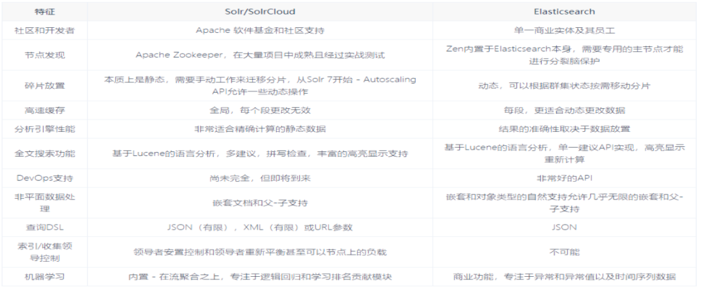

## 1.4 **Elasticsearch** 应用案例

* **GitHub**: 2013 年初，抛弃了 Solr，采取 Elasticsearch 来做 PB 级的搜索。“GitHub 使用Elasticsearch 搜索 20TB 的数据，包括 13 亿文件和 1300 亿行代码”。

* **维基百科**：启动以 Elasticsearch 为基础的核心搜索架构

* **SoundCloud**：“SoundCloud 使用 Elasticsearch 为 1.8 亿用户提供即时而精准的音乐搜索服务”。

* **百度**：目前广泛使用 Elasticsearch 作为文本数据分析，采集百度所有服务器上的各类指标数据及用户自定义数据，通过对各种数据进行多维分析展示，辅助定位分析实例异常或业务层面异常。目前覆盖百度内部 20 多个业务线（包括云分析、网盟、预测、文库、直达号、钱包、风控等），单集群最大 100 台机器，200 个 ES 节点，每天导入 30TB+数据。

* **新浪**：使用 Elasticsearch 分析处理 32 亿条实时日志。

* **阿里**：使用 Elasticsearch 构建日志采集和分析体系。

* **Stack Overflow**：解决 Bug 问题的网站，全英文，编程人员交流的网站。

# 2. **Elasticsearch** **入门**

## **2.1 Elasticsearch** **安装**

### 2.1.1 Windows安装

Elasticsearch 的官方地址：https://www.elastic.co/cn/

Windows 版的 Elasticsearch 的安装很简单，解压即安装完毕

解压后，进入 bin 文件目录，点击 elasticsearch.bat 文件启动 ES 服务

==注意： ElasticSearch所放的磁盘占用不要超过95%，否则会无限被设置为index只读==

==注意：9300 端口为 Elasticsearch 集群间组件的通信端口，9200 端口为浏览器访问的 http协议 RESTful 端口。==

打开浏览器（推荐使用谷歌浏览器），输入地址：http://localhost:9200，测试结果

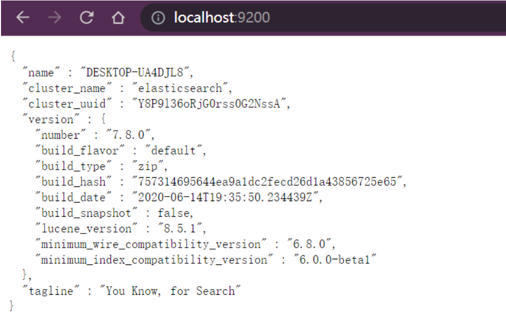

Elasticsearch 是使用 java 开发的，且 7.8 版本的 ES 需要 JDK 版本 1.8 以上，默认安装包带有 jdk 环境，如果系统配置 JAVA_HOME，那么使用系统默认的 JDK，如果没有配置使用自带的 JDK，一般建议使用系统配置的 JDK。

双击启动窗口闪退，通过路径访问追踪错误，如果是“空间不足”，请修改config/jvm.options 配置文件

```powershell
# 设置 JVM 初始内存为 1G。此值可以设置与-Xmx 相同，以避免每次垃圾回收完成后 JVM 重新分配内存
# Xms represents the initial size of total heap space
# 设置 JVM 最大可用内存为 1G
# Xmx represents the maximum size of total heap space
-Xms1g
-Xmx1g
```

### 2.1.2 Linux安装

软件下载地址：https://www.elastic.co/cn/downloads/past-releases/elasticsearch-7-8-0

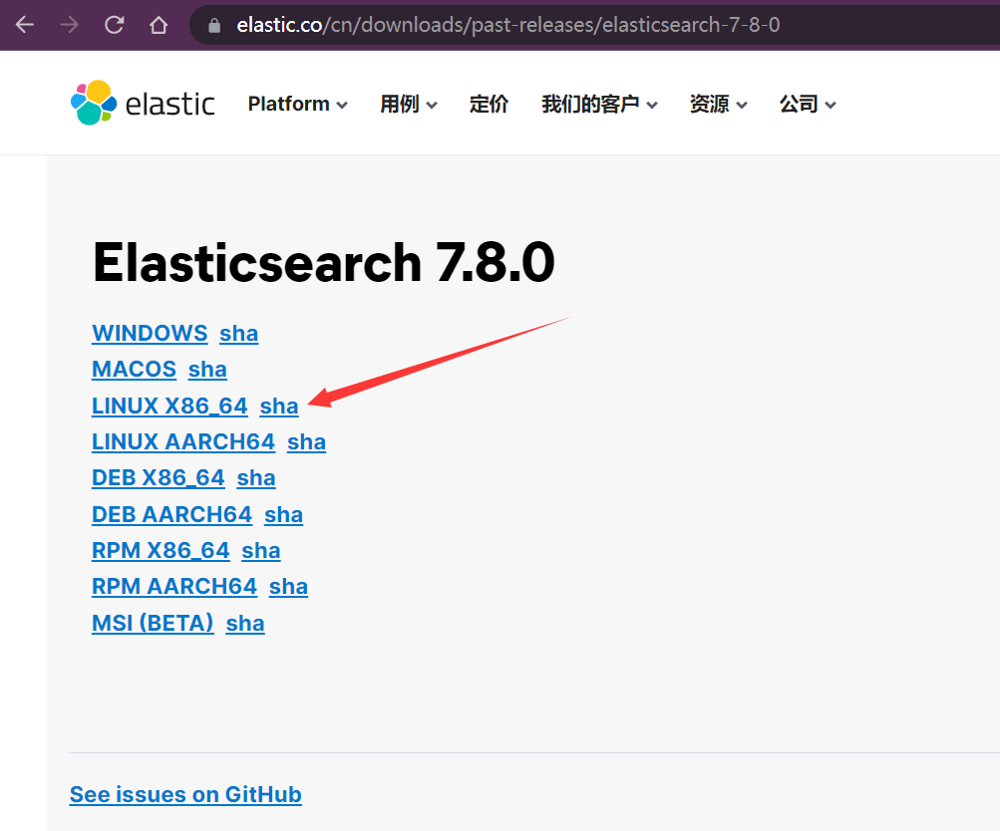

**解压软件**

```perl
# 解压缩
tar -zxvf elasticsearch-7.8.0-linux-x86_64.tar.gz -C /opt/module
```

**创建用户**

因为安全问题，Elasticsearch 不允许 root 用户直接运行，所以要创建新用户，在 root 用户中创建新用户

```perl
useradd es #新增 es 用户
passwd es #为 es 用户设置密码
userdel -r es #如果错了，可以删除再加
chown -R es:es /opt/elasticsearch-7.8.0/ #文件夹所有者
```

**修改配置文件**

```perl
vim /opt/elasticsearch-7.8.0/config/elasticsearch.yml

# 加入如下配置
cluster.name: elasticsearch
node.name: node-1
network.host: 0.0.0.0
http.port: 9200
cluster.initial_master_nodes: ["node-1"]
```

```perl
vim /etc/security/limits.conf

# 在文件末尾中增加下面内容
# 每个进程可以打开的文件数的限制
es soft nofile 65536
es hard nofile 65536
```

```perl
vim /etc/security/limits.d/20-nproc.conf

# 在文件末尾中增加下面内容
# 每个进程可以打开的文件数的限制
es soft nofile 65536
es hard nofile 65536
# 操作系统级别对每个用户创建的进程数的限制
* hard nproc 4096
# 注：* 带表 Linux 所有用户名称
```

```perl
vim /etc/sysctl.conf

# 在文件中增加下面内容
# 一个进程可以拥有的 VMA(虚拟内存区域)的数量,默认值为 65536
vm.max_map_count=655360
```

重新加载

```perl
sysctl -p
```

使用 ES 用户启动

```perl
cd /opt/module/es/
#启动
bin/elasticsearch
#后台启动
bin/elasticsearch -d
```

启动时，会动态生成文件，如果文件所属用户不匹配，会发生错误，需要重新进行修改用户和用户组

```shell
Cannot open file logs/gc.log due to Permission denied
```

关闭防火墙

```perl
#暂时关闭防火墙
systemctl stop firewalld
#永久关闭防火墙
systemctl enable firewalld.service #打开放货抢永久性生效，重启后不会复原
systemctl disable firewalld.service #关闭防火墙，永久性生效，重启后不会复原
```

浏览器中输入地址：http://192.168.10.130:9200/ 测试结果

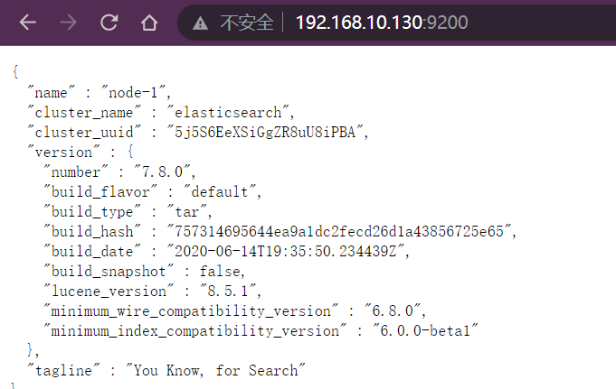

## **2.2 Elasticsearch** **基本操作**

### **2.2.1 RESTful**

每一个URI代表1种资源

客户端使用GET、POST、PUT、DELETE4个表示操作方式的动词对服务端资源进行操作：GET用来获取资源，POST用来新建资源（也可以用于更新资源），PUT用来更新资源，DELETE用来删除资源；

==POST 请求不具有幂等性==

==GET、PUT、DELETE请求具有幂等性，多次请求返回结果相同==

REST 指的是一组架构约束条件和原则。满足这些约束条件和原则的应用程序或设计就是 RESTful。

Web 应用程序最重要的 REST 原则是，客户端和服务器之间的交互在请求之间是无状态的。从客户端到服务器的每个请求都必须包含理解请求所必需的信息。如果服务器在请求之间的任何时间点重启，客户端不会得到通知。此外，无状态请求可以由任何可用服务器回答，这十分适合云计算之类的环境。客户端可以缓存数据以改进性能。

在服务器端，应用程序状态和功能可以分为各种资源。资源是一个有趣的概念实体，它向客户端公开。资源的例子有：应用程序对象、数据库记录、算法等等。每个资源都使用 URI (Universal Resource Identifier) 得到一个唯一的地址。所有资源都共享统一的接口，以便在客户端和服务器之间传输状态。使用的是标准的 HTTP 方法，比如 GET、PUT、POST 和DELETE。

在 REST 样式的 Web 服务中，每个资源都有一个地址。资源本身都是方法调用的目标，方法列表对所有资源都是一样的。这些方法都是标准方法，包括 HTTP GET、POST、PUT、DELETE，还可能包括 HEAD 和 OPTIONS。简单的理解就是，如果想要访问互联网上的资源，就必须向资源所在的服务器发出请求，请求体中必须包含资源的网络路径，以及对资源进行的操作(增删改查)。

### 2.2.2 **数据格式**

Elasticsearch 是面向文档型数据库，一条数据在这里就是一个文档。

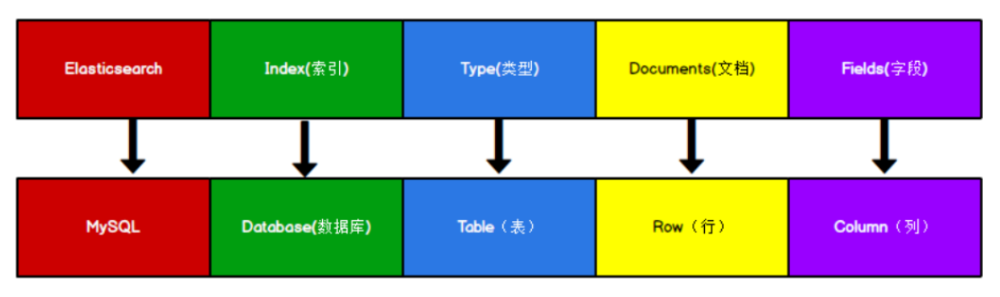

ES 里的 Index 可以看做一个库，而 Types 相当于表，Documents 则相当于表的行。这里 Types 的概念已经被逐渐弱化，Elasticsearch 6.X 中，一个 index 下已经只能包含一个type，Elasticsearch 7.X 中, Type 的概念已经被删除了。

```javascript
//JSON
//Javascript object Notation
var obj = { "name" : "zhangsan", "age":30，"info" : { "email" : "XXxxx"}}var objs = [obj,obj]
new 0bject ()I
//JSON字符串:网络中传递的字符串的格式符合JSON格式，
```

用 JSON 作为文档序列化的格式

```json
{
 "name" : "John",
 "sex" : "Male",
 "age" : 25,
 "birthDate": "1990/05/01",
 "about" : "I love to go rock climbing",
 "interests": [ "sports", "music" ]
}
```

#### 2.2.2.1 倒排索引

正排（正向）索引

| id   | content              |
| ---- | -------------------- |
| 1001 | my name is zhang san |
| 1002 | my name is li si     |

倒排索引

| keyword | id        |
| ------- | --------- |
| name    | 1001,1002 |
| zhang   | 1001      |


### **2.2.3 HTTP** **操作**

#### **2.2.4.1** **索引操作**

##### 2.2.4.1.1 **创建索引**

对比关系型数据库，创建索引就等同于创建数据库

向 ES 服务器发 ==PUT== 请求 ：

```perl
###创建索引
PUT http://192.168.10.130:9200/shopping
```

```json
{
 "acknowledged"【响应结果】: true, # true 操作成功
 "shards_acknowledged"【分片结果】: true, # 分片操作成功
 "index"【索引名称】: "shopping"
}
```

==注意：创建索引库的分片数默认 1 片，在 7.0.0 之前的 Elasticsearch 版本中，默认 5 片==

如果重复添加索引，会返回错误信息`already exists`

##### 2.2.4.1.2 **查看所有索引**

向 ES 服务器发 ==GET== 请求 ：

```perl
###查看所有索引
GET http://192.168.10.130:9200/_cat/indices?v
Accept: application/json
```

这里请求路径中的_cat 表示查看的意思，indices 表示索引

整体含义就是查看当前 ES服务器中的所有索引，就好像 MySQL 中的 show tables 的感觉，服务器响应结果如下

```powershell
[
  {
    "health": "yellow",
    "status": "open",
    "index": "shopping",
    "uuid": "64eMG-gXQdyrsUXCsPL2Fg",
    "pri": "1",
    "rep": "1",
    "docs.count": "0",
    "docs.deleted": "0",
    "store.size": "208b",
    "pri.store.size": "208b"
  }
]
```

| 表头           | 含义                                                         |
| -------------- | ------------------------------------------------------------ |
| health         | 当前服务器健康状态：<font color=green>**green**</font>(集群完整) 、<font color=orange>**yellow**</font>(单点正常、集群不完整)、 <font color=red>**red**</font>(单点不正常) |
| status         | 索引打开、关闭状态                                           |
| index          | 索引名                                                       |
| uuid           | 索引统一编号                                                 |
| pri            | 主分片数量                                                   |
| rep            | 副本数量                                                     |
| docs.count     | 可用文档数量                                                 |
| docs.deleted   | 文档删除状态（逻辑删除）                                     |
| store.size     | 主分片和副分片整体占空间大小                                 |
| pri.store.size | 主分片占空间大小                                             |

##### 2.2.4.1.3 **查看单个索引**

向 ES 服务器发 ==GET== 请求 ：

```perl
###查看单个索引
GET http://192.168.10.130:9200/shopping
```

```json
{ 
    "shopping"【索引名】: {         
        "aliases"【别名】: {}, 
        "mappings"【映射】: {}, 
        "settings"【设置】: { 
            "index"【设置 - 索引】: { 
                "creation_date"【设置 - 索引 - 创建时间】: "1614265373911", 
                "number_of_shards"【设置 - 索引 - 主分片数量】: "1", 
                "number_of_replicas"【设置 - 索引 - 副分片数量】: "1", 
                "uuid"【设置 - 索引 - 唯一标识】: "eI5wemRERTumxGCc1bAk2A", 
                "version"【设置 - 索引 - 版本】: { 
                    "created": "7080099" 
                }, 
                "provided_name"【设置 - 索引 - 名称】: "shopping" 
            } 
        } 
    }
}
```

##### 2.2.4.1.4 **删除索引**

向 ES 服务器发 ==DELETE== 请求：

```perl
###删除索引
DELETE http://192.168.10.130:9200/shopping
```

重新访问索引时，服务器返回响应：**索引不存在**

```perl
###查看单个索引
GET http://192.168.10.130:9200/shopping
```

```json
{
  "error": {
    "root_cause": [
      {
        "type": "index_not_found_exception",
        "reason": "no such index [shopping]",
        "resource.type": "index_or_alias",
        "resource.id": "shopping",
        "index_uuid": "_na_",
        "index": "shopping"
      }
    ],
    "type": "index_not_found_exception",
    "reason": "no such index [shopping]",
    "resource.type": "index_or_alias",
    "resource.id": "shopping",
    "index_uuid": "_na_",
    "index": "shopping"
  },
  "status": 404
}
```

#### **2.2.4.2** **文档操作**

索引已经创建好了，接下来创建文档，并添加数据。

这里的文档可以类比为关系型数据库中的表数据，添加的数据格式为 JSON 格式

##### 2.2.4.2.1 **创建文档**

向 ES 服务器发 ==POST==请求，不可以用PUT，因为**ID是随机生成的，返回结果不具有幂等性不可用PUT**

```perl
### 创建文档
POST http://192.168.10.130:9200/shopping/_doc
Content-Type: application/json

{
  "title":"小米手机",
  "category":"小米",
  "images":"https://github.com/yukiasumi/Study/blob/master/images/aniya.png",
  "price":3999.00
}
```

```json
{
  "_index"【索引】: "shopping",
  "_type"【类型-文档】: "_doc",
  "_id"【唯一标识】: "dlEI8oQBH4gCHR81eoI5", #可以类比为 MySQL 中的主键，随机生成
  "_version"【版本】: 1,
  "result"【结果】: "created",#这里的 create 表示创建成功
  "_shards"【分片】: {
    "total"【分片 - 总数】: 2,
    "successful"【分片 - 成功】: 1,
    "failed"【分片 - 失败】: 0
  },
  "_seq_no": 0,
  "_primary_term": 1
}
```

上面的数据创建后，由于没有指定数据唯一性标识（ID），默认情况下，ES 服务器会随机生成一个。

如果想要自定义唯一性标识，需要在创建时指定：

```perl
### 创建文档，自定义唯一性标识
POST http://192.168.10.130:9200/shopping/_doc/1
Content-Type: application/json

{
  "title":"华为手机",
  "category":"华为",
  "images":"https://github.com/yukiasumi/Study/blob/master/images/aniya.png",
  "price":3999.00
}
```

```json
{
  "_index": "shopping",
  "_type": "_doc",
  "_id": "1",
  "_version": 1,
  "result": "created",
  "_shards": {
    "total": 2,
    "successful": 1,
    "failed": 0
  },
  "_seq_no": 1,
  "_primary_term": 3
}
```

==此处需要注意：如果增加数据时明确数据主键，那么请求方式也可以为 PUT==

##### 2.2.4.2.2 **查看文档**

查看文档时，需要指明文档的唯一性标识，类似于 MySQL 中数据的**主键查询**

###### 2.2.4.2.2.1 主键查询

向 ES 服务器发 ==GET== 请求 ：

```perl
### 查看文档
GET http://192.168.10.130:9200/shopping/_doc/1
```

```json
{
  "_index"【索引】: "shopping",
  "_type"【文档类型】: "_doc",
  "_id": "1",
  "_version": 1,
  "_seq_no": 1,
  "_primary_term": 3,
  "found"【查询结果】: true, # true 表示查找到，false 表示未查找到
  "_source"【文档源信息】: {
    "title": "华为手机",
    "category": "华为",
    "images": "https://github.com/yukiasumi/Study/blob/master/images/aniya.png",
    "price": 3999.00
  }
}
```

###### 2.2.4.2.2.2 **查询所有**

```perl
### 查看文档
GET http://192.168.10.130:9200/shopping/_search
```

```json
{
  "took": 111,
  "timed_out": false,
  "_shards": {
    "total": 1,
    "successful": 1,
    "skipped": 0,
    "failed": 0
  },
  "hits": {
    "total": {
      "value": 2,
      "relation": "eq"
    },
    "max_score": 1.0,
    "hits": [
      {
        "_index": "shopping",
        "_type": "_doc",
        "_id": "1",
        "_score": 1.0,
        "_source": {
          "title": "华为手机",
          "category": "华为",
          "images": "https://github.com/yukiasumi/Study/blob/master/images/aniya.png",
          "price": 4999.00
        }
      },
      {
        "_index": "shopping",
        "_type": "_doc",
        "_id": "2",
        "_score": 1.0,
        "_source": {
          "title": "小米手机",
          "category": "小米",
          "images": "https://github.com/yukiasumi/Study/blob/master/images/aniya.png",
          "price": 3999.00
        }
      }
    ]
  }
}
```

###### 2.2.4.2.2.3 条件查询

```perl
### 查看文档（条件）
GET http://192.168.10.130:9200/shopping/_search?q=category:小米
```

##### 2.2.4.2.3 **修改文档**

和新增文档一样，输入相同的 URL 地址请求，如果请求体变化，会将原有的数据内容覆盖。

向 ES 服务器发 ==POST== 请求 ：

```perl
### 全量修改文档
POST http://192.168.10.130:9200/shopping/_doc/1
Content-Type: application/json

{
 "title":"华为手机",
 "category":"华为",
 "images":"https://github.com/yukiasumi/Study/blob/master/images/aniya.png",
 "price":4999.00
}
```

```json
{
  "_index": "shopping",
  "_type": "_doc",
  "_id": "1",
  "_version"【版本】: 2,
  "result"【结果】: "updated",# updated 表示数据被更新
  "_shards": {
    "total": 2,
    "successful": 1,
    "failed": 0
  },
  "_seq_no": 2,
  "_primary_term": 3
}
```

##### 2.2.4.2.4 **修改字段**

修改数据时，也可以只修改某一给条数据的局部信息

向 ES 服务器发 ==POST== 请求

```perl
### 修改字段
POST http://192.168.10.130:9200/shopping/_update/1
Content-Type: application/json

{
 "doc": {
 "price":3000.00
 }
}
```

```json
{
  "_index": "shopping",
  "_type": "_doc",
  "_id": "1",
  "_version": 3,
  "result": "updated",
  "_shards": {
    "total": 2,
    "successful": 1,
    "failed": 0
  },
  "_seq_no": 3,
  "_primary_term": 3
}
```

根据唯一性标识，查询文档数据，文档数据已经更新

```perl
### 查看文档
GET http://192.168.10.130:9200/shopping/_doc/1

{
  "_index": "shopping",
  "_type": "_doc",
  "_id": "1",
  "_version": 3,
  "_seq_no": 3,
  "_primary_term": 3,
  "found": true,
  "_source": {
    "title": "华为手机",
    "category": "华为",
    "images": "https://github.com/yukiasumi/Study/blob/master/images/aniya.png",
    "price": 3000.0
  }
}
```

##### 2.2.4.2.5 **删除文档**

删除一个文档不会立即从磁盘上移除，它只是被标记成已删除（逻辑删除）。

向 ES 服务器发 ==DELETE== 请求 ：

```perl
### 删除文档
DELETE http://192.168.10.130:9200/shopping/_doc/1
```

```json
{
  "_index": "shopping",
  "_type": "_doc",
  "_id": "1",
  "_version"【版本】: 4, #对数据的操作，都会更新版本
  "result"【结果】: "deleted",# deleted 表示数据被标记为删除
  "_shards": {
    "total": 2,
    "successful": 1,
    "failed": 0
  },
  "_seq_no": 4,
  "_primary_term": 3
}
```

删除后再查询当前文档信息

```perl
### 查看文档
GET http://192.168.10.130:9200/shopping/_doc/1

{
  "_index": "shopping",
  "_type": "_doc",
  "_id": "1",
  "found": false
}
```

删除一个并不存在的文档

```perl
### 删除文档
DELETE http://192.168.10.130:9200/shopping/_doc/1

{
  "_index": "shopping",
  "_type": "_doc",
  "_id": "1",
  "_version": 1,
  "result"【结果】: "not_found",# not_found 表示未查找到
  "_shards": {
    "total": 2,
    "successful": 1,
    "failed": 0
  },
  "_seq_no": 5,
  "_primary_term": 3
}
```

##### 2.2.4.2.6 **条件删除文档**

一般删除数据都是根据文档的唯一性标识进行删除，实际操作时，也可以根据条件对多条数据进行删除

首先分别增加多条数据:

```perl
POST http://192.168.10.130:9200/shopping/_doc/1
Content-Type: application/json

{
  "title":"华为手机",
  "category":"华为",
  "images":"https://github.com/yukiasumi/Study/blob/master/images/aniya.png",
  "price":3999.00
}


POST http://192.168.10.130:9200/shopping/_doc/2
Content-Type: application/json

{
  "title":"小米手机",
  "category":"小米",
  "images":"https://github.com/yukiasumi/Study/blob/master/images/aniya.png",
  "price":3999.00
}
```

向 ES 服务器发 ==POST== 请求 ：

```perl
### 条件删除文档
POST http://192.168.10.130:9200/shopping/_delete_by_query
Content-Type: application/json

{
  "query": {
    "match": {
      "price": 3999.00
    }
  }
}
```

```json
{
  "took"【耗时】: 26,
  "timed_out"【是否超时】: false,
  "total"【总数】: 1,
  "deleted"【删除数量】: 1,
  "batches": 1,
  "version_conflicts": 0,
  "noops": 0,
  "retries": {
    "bulk": 0,
    "search": 0
  },
  "throttled_millis": 0,
  "requests_per_second": -1.0,
  "throttled_until_millis": 0,
  "failures": []
}
```

#### **2.2.4.3** **映射操作**

有了索引库，等于有了数据库中的 database。

接下来就需要建索引库(index)中的映射了，类似于数据库(database)中的表结构(table)。

创建数据库表需要设置字段名称，类型，长度，约束等；索引库也一样，需要知道这个类型下有哪些字段，每个字段有哪些约束信息，这就叫做映射(mapping)。

##### 2.2.4.3.1 **创建映射**

向 ES 服务器发 ==PUT==请求 ：

```perl
###创建索引
PUT http://192.168.10.130:9200/student

### 创建映射（需先创建索引）
PUT http://192.168.10.130:9200/student/_mapping
Content-Type: application/json

{
  "properties": {
    "name": {
      "type": "text",
      "index": true
    },
    "sex": {
      "type": "text",
      "index": false
    },
    "age": {
      "type": "long",
      "index": false
    }
  }
}

### 插入数据
POST http://192.168.10.130:9200/student/_create/1001
Content-Type: application/json

{
  "age": 12,
  "name": "琉璃",
  "sex": "女"
}
```

```json
{
  "acknowledged": true
}
```

映射数据说明：

* 字段名：任意填写，下面指定许多属性，例如：title、subtitle、images、price

* type：类型，Elasticsearch 中支持的数据类型非常丰富，说几个关键的：

  * String 类型，又分两种：
    * text：可分词
    * keyword：==不可分词，数据会作为完整字段进行匹配==
  * Numerical：数值类型，分两类
    * 基本数据类型：long、integer、short、byte、double、float、half_float
    * 浮点数的高精度类型：scaled_float
  * Date：日期类型
  * Array：数组类型
  * Object：对象

* index：是否索引，默认为 true，也就是说你不进行任何配置，所有字段都会被索引。

  * true：字段会被索引，则可以用来进行搜索
  * false：==字段不会被索引，不能用来搜索==

* store：是否将数据进行独立存储，默认为 false

  原始的文本会存储在_source 里面，默认情况下其他提取出来的字段都不是独立存储的，是从_source 里面提取出来的。当然你也可以独立的存储某个字段，只要设置"store": true 即可，获取独立存储的字段要比从_source 中解析快得多，但是也会占用更多的空间，所以要根据实际业务需求来设置。

* analyzer：分词器，这里的 ik_max_word 即使用 ik 分词器。

##### 2.2.4.3.2 **查看映射**

向 ES 服务器发 ==GET==请求

```perl
### 查看映射
GET http://192.168.10.130:9200/student/_mapping
```

```json
{
  "student": {
    "mappings": {
      "properties": {
        "age": {
          "type": "long",
          "index": false
        },
        "name": {
          "type": "text"
        },
        "sex": {
          "type": "text",
          "index": false
        }
      }
    }
  }
}
```

##### 2.2.4.3.3 **创建索引时创建映射**

向 ES 服务器发 ==PUT== 请求

```perl
### 索引映射关联（创建索引时定义映射）
PUT http://192.168.10.130:9200/student
Content-Type: application/json

{
  "settings": {},
  "mappings": {
    "properties": {
      "name": {
        "type": "text",
        "index": true
      },
      "sex": {
        "type": "text",
        "index": false
      },
      "age": {
        "type": "long",
        "index": false
      }
    }
  }
}
```

```json
{
  "acknowledged": true,
  "shards_acknowledged": true,
  "index": "student1"
}
```

#### **2.2.4.4** **高级查询**

Elasticsearch 提供了基于 JSON 提供完整的查询 DSL 来定义查询

##### 2.2.4.4.1 定义数据

```perl
###删除索引
DELETE http://192.168.10.130:9200/student

### 索引映射关联（创建索引时定义映射）
PUT http://192.168.10.130:9200/student
Content-Type: application/json

{
  "settings": {},
  "mappings": {
    "properties": {
      "name": {
        "type": "text",
        "index": true
      },
      "sex": {
        "type": "text",
        "index": false
      },
      "age": {
        "type": "long",
        "index": false
      }
    }
  }
}

### 插入数据1
POST http://192.168.10.130:9200/student/_doc/1001
Content-Type: application/json

{
  "name": "zhangsan",
  "nickname": "zhangsan",
  "sex": "男",
  "age": 30
}

### 插入数据2
POST http://192.168.10.130:9200/student/_doc/1002
Content-Type: application/json

{
  "name": "lisi",
  "nickname": "lisi",
  "sex": "男",
  "age": 20
}

### 插入数据3
POST http://192.168.10.130:9200/student/_doc/1003
Content-Type: application/json

{
  "name": "wangwu",
  "nickname": "wangwu",
  "sex": "女",
  "age": 40
}

### 插入数据4
POST http://192.168.10.130:9200/student/_doc/1004
Content-Type: application/json

{
  "name": "zhangsan1",
  "nickname": "zhangsan1",
  "sex": "女",
  "age": 50
}

### 插入数据5
POST http://192.168.10.130:9200/student/_doc/1005
Content-Type: application/json

{
  "name": "zhangsan2",
  "nickname": "zhangsan2",
  "sex": "女",
  "age": 30
}
```

##### 2.2.4.4.2 查询所有

```perl
### 查看所有文档
GET http://192.168.10.130:9200/student/_search
Content-Type: application/json

{
  "query": {
    "match_all": {
    }
  }
}

# "query"：这里的 query 代表一个查询对象，里面可以有不同的查询属性
# "match_all"：查询类型，例如：match_all(代表查询所有)， match，term ， range 等等
# {查询条件}：查询条件会根据类型的不同，写法也有差异
```

```json
{
  "took"【查询花费时间，单位毫秒】: 707,
  "timed_out"【是否超时】: false,
  "_shards"【分片信息】: {
    "total"【总数】: 1,
    "successful"【成功】: 1,
    "skipped"【忽略】: 0,
    "failed"【失败】: 0
  },
  "hits"【搜索命中结果】: {
    "total"【搜索条件匹配的文档总数】: {
      "value"【总命中计数的值】: 5,
      "relation"【计数规则】: "eq"	# eq 表示计数准确， gte 表示计数不准确
    },
    "max_score"【匹配度分值】: 1.0,
    "hits"【命中结果集合】: [...]
  }
}
```

##### 2.2.4.4.3 **匹配查询**

match 匹配类型查询，会把查询条件进行分词，然后进行查询，多个词条之间是 or 的关系

```perl
### 匹配查询
GET http://192.168.10.130:9200/student/_search
Content-Type: application/json

{
  "query": {
    "match": {			
      "name":"zhangsan"	
    }
  }
}
```

##### 2.2.4.4.4 **字段匹配查询**

multi_match 与 match 类似，不同的是它可以在多个字段中查询。

```perl
### 字段匹配查询
GET http://192.168.10.130:9200/student/_search
Content-Type: application/json

{
  "query": {
    "multi_match": {
      "query": "zhangsan",
      "fields": ["name","nickname"]
    }
  }
}
```

##### 2.2.4.4.5 **关键字精确查询**

term 查询，精确的关键词匹配查询，不对查询条件进行分词。

```perl
### 关键字精确查询
GET http://192.168.10.130:9200/student/_search
Content-Type: application/json

{
  "query": {
    "term": {
      "name": {
        "value": "zhangsan"
      }
    }
  }
}
```

##### 2.2.4.4.6 **多关键字精确查询**

erms 查询和 term 查询一样，但它允许你指定多值进行匹配。

如果这个字段包含了指定值中的任何一个值，那么这个文档满足条件，类似于 mysql 的 in

```perl
### 多关键字精确查询
GET http://192.168.10.130:9200/student/_search
Content-Type: application/json

{
  "query": {
    "terms": {
      "name": ["zhangsan","lisi"]
    }
  }
}
```

##### 2.2.4.4.7 **指定查询字段**

默认情况下，Elasticsearch 在搜索的结果中，会把文档中保存在_source 的所有字段都返回。

如果只想获取其中的部分字段，可以添加_source 的过滤

```perl
### 指定查询字段
GET http://192.168.10.130:9200/student/_search
Content-Type: application/json

{
  "_source": ["name","nickname"],
  "query": {
    "terms": {
      "nickname": ["zhangsan"]
    }
  }
}
```

##### 2.2.4.4.8 **过滤字段**

* includes：指定想要显示的字段

* excludes：指定不想要显示的字段

```perl
### 过滤字段白名单
GET http://192.168.10.130:9200/student/_search
Content-Type: application/json

{
  "_source": {
    "includes": ["name","nickname"]
  },
  "query": {
    "terms": {
      "nickname": ["zhangsan"]
    }
  }
}

### 过滤字段黑名单
GET http://192.168.10.130:9200/student/_search
Content-Type: application/json

{
  "_source": {
    "excludes": ["name","nickname"]
  },
  "query": {
    "terms": {
      "nickname": ["zhangsan"]
    }
  }
}
```

##### 2.2.4.4.9 **组合查询**

`bool`把各种其它查询通过`must`（必须 ）、`must_not`（必须不）、`should`（应该）的方式进行组合

```perl
### 组合查询
GET http://192.168.10.130:9200/student/_search
Content-Type: application/json
        
{
  "query": {
    "bool": {
      "must": [
        {
          "match": {
            "name": "zhangsan"
          }
        }
      ],
      "must_not": [
        {
          "match": {
            "age": "40"
          }
        }
      ],
      "should": [
        {
          "match": {
            "sex": "男"
          }
        }
      ]
    }
  }
}
```

##### 2.2.4.4.10 **范围查询**

range 查询找出那些落在指定区间内的数字或者时间。range 查询允许以下字符

| 操作符 | 说明          |
| ------ | ------------- |
| gt     | ＞（大于）    |
| gte    | ≥（大于等于） |
| lt     | ＜（小于）    |
| lte    | ≤（小于等于） |

```perl
### 范围查询
GET http://192.168.10.130:9200/student/_search
Content-Type: application/json

{
  "query": {
    "range": {
      "age": {
        "gte": 30,
        "lte": 35
      }
    }
  }
}
```

##### 2.2.4.4.11 **模糊查询**

返回包含与搜索字词相似的字词的文档。

编辑距离是将一个术语转换为另一个术语所需的一个字符更改的次数。这些更改可以包括：

* 更改字符（box → fox）

* 删除字符（black → lack）

* 插入字符（sic → sick）

* 转置两个相邻字符（act → cat）

为了找到相似的术语，fuzzy 查询会在指定的编辑距离内创建一组搜索词的所有可能的变体或扩展。然后查询返回每个扩展的完全匹配。

通过 fuzziness 修改编辑距离。一般使用默认值 AUTO，根据术语的长度生成编辑距离。

```perl
### 模糊查询
GET http://192.168.10.130:9200/student/_search
Content-Type: application/json

{
  "query": {
    "fuzzy": {
      "name": {
        "value": "zhangsan"
      }
    }
  }
}

### 模糊查询2
GET http://192.168.10.130:9200/student/_search
Content-Type: application/json

{
  "query": {
    "fuzzy": {
      "name": {
        "value": "zhangsan",
        "fuzziness": 2
      }
    }
  }
}
```

##### 2.2.4.4.12 **单字段排序**

sort 可以按照不同的字段进行排序，并且通过 order 指定排序的方式。desc 降序，asc升序。

```perl
### 单字段排序
GET http://192.168.10.130:9200/student/_search
Content-Type: application/json

{
  "query": {
    "match": {
      "name":"zhangsan"
    }
  },
  "sort": {
    "age": {
      "order":"desc"
    }
  }
}
```

##### 2.2.4.4.13 **多字段排序**

结合使用 age 和 _score 进行查询，并且匹配的结果首先按照年龄排序，然后按照相关性得分排序··

```perl
### 多字段排序
GET http://192.168.10.130:9200/student/_search
Content-Type: application/json

{
  "query": {
    "match_all": {}
  },
  "sort": [
    {
      "age": {
        "order": "desc"
      }
    },
    {
      "_score":{
        "order": "desc"
      }
    }
  ]
}
```

##### 2.2.4.4.14 **高亮查询**

在进行关键字搜索时，搜索出的内容中的关键字会显示不同的颜色，称之为高亮。

Elasticsearch 可以对查询内容中的关键字部分，进行标签和样式(高亮)的设置。

在使用 match 查询的同时，加上一个 highlight 属性：

* pre_tags：前置标签

* post_tags：后置标签

* fields：需要高亮的字段

* title：这里声明 title 字段需要高亮，后面可以为这个字段设置特有配置，也可以空

```perl
### 高亮查询
GET http://192.168.10.130:9200/student/_search
Content-Type: application/json

{
  "query": {
    "match": {
      "name": "zhangsan"
    }
  },
  "highlight": {
    "pre_tags": "<font color='red'>",
    "post_tags": "</font>",
    "fields": {
      "name": {}
    }
  }
}
```

##### 2.2.4.4.15 **分页查询**

from：当前页的起始索引，默认从 0 开始。 from = (pageNum - 1) * size

size：每页显示多少条

```perl
### 分页查询
GET http://192.168.10.130:9200/student/_search
Content-Type: application/json

{
  "query": {
    "match_all": {}
  },
  "sort": [
    {
      "age": {
        "order": "desc"
      }
    }
  ],
  "from": 0,
  "size": 2
}
```

##### 2.2.4.4.16 **聚合查询**

对 es 文档进行统计分析，类似关系型数据库中的 group by，还有很多其他的聚合，例如取最大值、平均值等等。

###### 2.2.4.4.16.1 max

 对某个字段取最大值 max

```perl
### 聚合查询-最大值 max
GET http://192.168.10.130:9200/student/_search
Content-Type: application/json

{
  "aggs": {
    "max_age": {
      "max": {
        "field": "age"
      }
    }
  },
  "size": 0
}
```

###### 2.2.4.4.16.2 min

 对某个字段取最小值 min

```perl
### 聚合查询-最小值 min
GET http://192.168.10.130:9200/student/_search
Content-Type: application/json

{
  "aggs": {
    "min_age": {
      "min": {
        "field": "age"
      }
    }
  },
  "size": 0
}
```

###### 2.2.4.4.16.3 sum

对某个字段求和 sum

```perl
### 聚合查询-求和 sum
GET http://192.168.10.130:9200/student/_search
Content-Type: application/json

{
  "aggs": {
    "sum_age": {
      "sum": {
        "field": "age"
      }
    }
  },
  "size": 0
}
```

###### 2.2.4.4.16.4 avg

对某个字段取平均值 avg

```perl
### 聚合查询-平均值 avg
GET http://192.168.10.130:9200/student/_search
Content-Type: application/json

{
  "aggs": {
    "avg_age": {
      "avg": {
        "field": "age"
      }
    }
  },
  "size": 0
}
```

###### 2.2.4.4.16.5 distinct+count

对某个字段的值进行去重之后再取总数

```perl
### 聚合查询-对某个字段的值进行去重之后再取总数
GET http://192.168.10.130:9200/student/_search
Content-Type: application/json

{
  "aggs": {
    "distinct_age": {
      "cardinality": {
        "field": "age"
      }
    }
  },
  "size": 0
}
```

###### 2.2.4.4.16.6 State 聚合

stats 聚合，对某个字段一次性返回 count，max，min，avg 和 sum 五个指标

```perl
### State 聚合
GET http://192.168.10.130:9200/student/_search
Content-Type: application/json

{
  "aggs":{
    "stats_age":{
      "stats":{"field":"age"}
    }
  },
  "size":0
}
```

##### 2.2.4.4.17 **桶聚合查询**

桶聚和相当于 sql 中的 group by 语句

terms 聚合，分组统计

```perl
### 桶聚合-terms 聚合，分组统计
GET http://192.168.10.130:9200/student/_search
Content-Type: application/json

{
  "aggs":{ //聚合操作
    "age_groupby":{	//名称，随意起名
      "terms":{"field":"age"} //分组字段
    }
  },
  "size":0	//减少显示信息
}
```

在 terms 分组下再进行聚合

```perl
### 桶聚合-在 terms 分组下再进行聚合
GET http://192.168.10.130:9200/student/_search
Content-Type: application/json

{
  "aggs": {
    "age_groupby": {
      "terms": {"field": "age"},
      "aggs": {
        "sum_age": {
          "sum": {"field": "age"}
        }
      }
    }
  },
  "size": 0
}
```

### **2.2.5 Java API** **操作**

Elasticsearch 软件是由 Java 语言开发的，所以也可以通过 Java API 的方式对 Elasticsearch服务进行访问

#### **2.2.5.1** **创建** **Maven** **项目**

```xml
    <dependencies>
        <dependency>
            <groupId>org.elasticsearch</groupId>
            <artifactId>elasticsearch</artifactId>
            <version>7.8.0</version>
        </dependency>
        <!-- elasticsearch 的客户端 -->
        <dependency>
            <groupId>org.elasticsearch.client</groupId>
            <artifactId>elasticsearch-rest-high-level-client</artifactId>
            <version>7.8.0</version>
        </dependency>
        <!-- elasticsearch 依赖 2.x 的 log4j -->
        <dependency>
            <groupId>org.apache.logging.log4j</groupId>
            <artifactId>log4j-api</artifactId>
            <version>2.8.2</version>
        </dependency>
        <dependency>
            <groupId>org.apache.logging.log4j</groupId>
            <artifactId>log4j-core</artifactId>
            <version>2.8.2</version>
        </dependency>
        <dependency>
            <groupId>com.fasterxml.jackson.core</groupId>
            <artifactId>jackson-databind</artifactId>
            <version>2.9.9</version>
        </dependency>
        <!-- junit 单元测试 -->
        <dependency>
            <groupId>junit</groupId>
            <artifactId>junit</artifactId>
            <version>4.12</version>
        </dependency>
    </dependencies>
```

#### **2.2.5.2** **客户端对象**

```java
package org.example;

import org.apache.http.HttpHost;
import org.elasticsearch.client.RestClient;
import org.elasticsearch.client.RestHighLevelClient;

import java.io.IOException;

public class ElasticSearchClient01 {
    public static void main(String[] args) throws IOException {
        // 创建客户端对象
        // 9200 端口为 Elasticsearch 的 Web 通信端口
        // 192.168.10.130 为启动 ES 服务的主机名
        RestHighLevelClient client = new RestHighLevelClient(
                RestClient.builder(new HttpHost("192.168.10.130", 9200, "http")));

        client.close();
    }
}

```

#### **2.2.5.3** **索引操作**

##### 2.2.5.3.1 创建索引

```java
package org.example;

import org.apache.http.HttpHost;
import org.elasticsearch.client.RequestOptions;
import org.elasticsearch.client.RestClient;
import org.elasticsearch.client.RestHighLevelClient;
import org.elasticsearch.client.indices.CreateIndexRequest;
import org.elasticsearch.client.indices.CreateIndexResponse;

import java.io.IOException;

public class IndexCreate {
    public static void main(String[] args) throws IOException {
        //创建客户端
        RestHighLevelClient client = new RestHighLevelClient(
                RestClient.builder(new HttpHost("192.168.10.130", 9200, "http")));

        // 创建索引 - 请求对象
        CreateIndexRequest request = new CreateIndexRequest("user");
        // 发送请求，获取响应
        CreateIndexResponse response = client.indices().create(request, RequestOptions.DEFAULT);
        boolean acknowledged = response.isAcknowledged();
        // 响应状态
        System.out.println("操作状态 = " + acknowledged);

        //关闭客户端
        client.close();
    }
}
```

##### 2.2.5.3.2 查看索引

```java
package org.example;

import org.apache.http.HttpHost;
import org.elasticsearch.client.RequestOptions;
import org.elasticsearch.client.RestClient;
import org.elasticsearch.client.RestHighLevelClient;
import org.elasticsearch.client.indices.GetIndexRequest;
import org.elasticsearch.client.indices.GetIndexResponse;

import java.io.IOException;

public class IndexSearch {
    public static void main(String[] args) throws IOException {
        RestHighLevelClient client = new RestHighLevelClient(
                RestClient.builder(new HttpHost("192.168.10.130", 9200, "http")));

        // 查询索引 - 请求对象
        GetIndexRequest request = new GetIndexRequest("user");
        // 发送请求，获取响应
        GetIndexResponse response = client.indices().get(request, RequestOptions.DEFAULT);
        System.out.println("aliases:"+response.getAliases());
        System.out.println("mappings:"+response.getMappings());
        System.out.println("settings:"+response.getSettings());
        
        //关闭客户端
        client.close();
    }
}
```

##### 2.2.5.3.3 删除索引

```java
package org.example;

import org.apache.http.HttpHost;
import org.elasticsearch.action.admin.indices.delete.DeleteIndexRequest;
import org.elasticsearch.action.support.master.AcknowledgedResponse;
import org.elasticsearch.client.RequestOptions;
import org.elasticsearch.client.RestClient;
import org.elasticsearch.client.RestHighLevelClient;

import java.io.IOException;

public class IndexDelete {
    public static void main(String[] args) throws IOException {

        RestHighLevelClient client = new RestHighLevelClient(
                RestClient.builder(new HttpHost("192.168.10.130", 9200, "http")));

        // 删除索引 - 请求对象
        DeleteIndexRequest request = new DeleteIndexRequest("user");
        // 发送请求，获取响应
        AcknowledgedResponse response = client.indices().delete(request,
                RequestOptions.DEFAULT);
        // 操作结果
        System.out.println("操作结果 ： " + response.isAcknowledged());

        client.close();
    }
}
```

#### 2.2.5.4 **文档操作**

##### 2.2.5.4.1 **新增文档**

创建数据模型

```java
package org.example.model;

class User {
    private String name;
    private Integer age;
    private String sex;

    public String getName() {
        return name;
    }

    public void setName(String name) {
        this.name = name;
    }

    public Integer getAge() {
        return age;
    }

    public void setAge(Integer age) {
        this.age = age;
    }

    public String getSex() {
        return sex;
    }

    public void setSex(String sex) {
        this.sex = sex;
    }
}

```

创建数据，添加到文档中

```java
package org.example;


import com.fasterxml.jackson.databind.ObjectMapper;
import org.apache.http.HttpHost;
import org.elasticsearch.action.index.IndexRequest;
import org.elasticsearch.action.index.IndexResponse;
import org.elasticsearch.client.RequestOptions;
import org.elasticsearch.client.RestClient;
import org.elasticsearch.client.RestHighLevelClient;
import org.example.model.User;
import org.elasticsearch.common.xcontent.XContentType;

import java.io.IOException;

public class DocumentCreate {
    public static void main(String[] args) throws IOException {

        RestHighLevelClient client = new RestHighLevelClient(
                RestClient.builder(new HttpHost("192.168.10.130", 9200, "http")));
        // 新增文档 - 请求对象
        IndexRequest request = new IndexRequest();
        // 设置索引及唯一性标识
        request.index("user").id("1001");
        // 创建数据对象
        User user = new User();
        user.setName("zhangsan");
        user.setAge(30);
        user.setSex("男");
        ObjectMapper objectMapper = new ObjectMapper();
        String productJson = objectMapper.writeValueAsString(user);
        // 添加文档数据，数据格式为 JSON 格式
        request.source(productJson, XContentType.JSON);
        // 客户端发送请求，获取响应对象
        IndexResponse response = client.index(request, RequestOptions.DEFAULT);
        //3.打印结果信息
        System.out.println("_index:" + response.getIndex());
        System.out.println("_id:" + response.getId());
        System.out.println("_result:" + response.getResult());

        client.close();
    }
}
```

##### 2.2.5.4.2 **修改文档**

```java
package org.example;

import org.apache.http.HttpHost;
import org.elasticsearch.action.update.UpdateRequest;
import org.elasticsearch.action.update.UpdateResponse;
import org.elasticsearch.client.RequestOptions;
import org.elasticsearch.client.RestClient;
import org.elasticsearch.client.RestHighLevelClient;
import org.elasticsearch.common.xcontent.XContentType;

import java.io.IOException;

public class DocumentAlter {
    public static void main(String[] args) throws IOException {
        RestHighLevelClient client = new RestHighLevelClient(
                RestClient.builder(new HttpHost("192.168.10.130", 9200, "http")));

        // 修改文档 - 请求对象
        UpdateRequest request = new UpdateRequest();
        // 配置修改参数
        request.index("user").id("1001");
        // 设置请求体，对数据进行修改
        request.doc(XContentType.JSON, "sex", "女");
        // 客户端发送请求，获取响应对象
        UpdateResponse response = client.update(request, RequestOptions.DEFAULT);
        System.out.println("_index:" + response.getIndex());
        System.out.println("_id:" + response.getId());
        System.out.println("_result:" + response.getResult());

        client.close();
    }
}
```

##### 2.2.5.4.3 **查询文档**

```java
package org.example;

import org.apache.http.HttpHost;
import org.elasticsearch.action.get.GetRequest;
import org.elasticsearch.action.get.GetResponse;
import org.elasticsearch.client.RequestOptions;
import org.elasticsearch.client.RestClient;
import org.elasticsearch.client.RestHighLevelClient;

import java.io.IOException;

public class DocumentSearch {
    public static void main(String[] args) throws IOException {
        RestHighLevelClient client = new RestHighLevelClient(
                RestClient.builder(new HttpHost("192.168.10.130", 9200, "http")));

        //1.创建请求对象
        GetRequest request = new GetRequest().index("user").id("1001");
        //2.客户端发送请求，获取响应对象
        GetResponse response = client.get(request, RequestOptions.DEFAULT);
        //3.打印结果信息
        System.out.println("_index:" + response.getIndex());
        System.out.println("_type:" + response.getType());
        System.out.println("_id:" + response.getId());
        System.out.println("source:" + response.getSourceAsString());
        client.close();
    }
}
```

##### 2.2.5.4.4 **删除文档**

```java
package org.example;

import org.apache.http.HttpHost;
import org.elasticsearch.action.delete.DeleteRequest;
import org.elasticsearch.action.delete.DeleteResponse;
import org.elasticsearch.client.RequestOptions;
import org.elasticsearch.client.RestClient;
import org.elasticsearch.client.RestHighLevelClient;

import java.io.IOException;

public class DocumentDelete {
    public static void main(String[] args) throws IOException {
        RestHighLevelClient client = new RestHighLevelClient(
                RestClient.builder(new HttpHost("192.168.10.130", 9200, "http")));

        //创建请求对象
        DeleteRequest request = new DeleteRequest().index("user").id("1");
        //客户端发送请求，获取响应对象
        DeleteResponse response = client.delete(request, RequestOptions.DEFAULT);
        //打印信息
        System.out.println(response.toString());
        client.close();
    }
}
```

##### 2.2.5.4.5 **批量操作**

```java
package org.example;

import org.apache.http.HttpHost;
import org.elasticsearch.action.bulk.BulkRequest;
import org.elasticsearch.action.bulk.BulkResponse;
import org.elasticsearch.action.delete.DeleteRequest;
import org.elasticsearch.action.index.IndexRequest;
import org.elasticsearch.client.RequestOptions;
import org.elasticsearch.client.RestClient;
import org.elasticsearch.client.RestHighLevelClient;
import org.elasticsearch.common.xcontent.XContentType;

import java.io.IOException;

public class DocumentBulkOption {
    public static void main(String[] args) throws IOException {
        RestHighLevelClient client = new RestHighLevelClient(
                RestClient.builder(new HttpHost("192.168.10.130", 9200, "http")));

        //批量新增
        bulkInsert(client);

        //批量删除
        bulkDelete(client);

        client.close();
    }

    public static void bulkInsert(RestHighLevelClient client) throws IOException {
        //创建批量新增请求对象
        BulkRequest request = new BulkRequest();
        request.add(new IndexRequest().index("user").id("1001").source(XContentType.JSON, "name", "zhangsan"));
        request.add(new IndexRequest().index("user").id("1002").source(XContentType.JSON, "name", "lisi"));
        request.add(new IndexRequest().index("user").id("1003").source(XContentType.JSON, "name", "wangwu"));
        //客户端发送请求，获取响应对象
        BulkResponse responses = client.bulk(request, RequestOptions.DEFAULT);
        //打印结果信息
        System.out.println("took:" + responses.getTook());
        System.out.println("items:" + responses.getItems());
    }

    public static void bulkDelete(RestHighLevelClient client) throws IOException {
        //创建批量删除请求对象
        BulkRequest request = new BulkRequest();
        request.add(new DeleteRequest().index("user").id("1001"));
        request.add(new DeleteRequest().index("user").id("1002"));
        request.add(new DeleteRequest().index("user").id("1003"));
        //客户端发送请求，获取响应对象
        BulkResponse responses = client.bulk(request, RequestOptions.DEFAULT);
        //打印结果信息
        System.out.println("took:" + responses.getTook());
        System.out.println("items:" + responses.getItems());
    }
}
```

##### **2.2.5.5** **高级查询**

##### 2.2.5.5.1 **请求体查询**

###### 2.2.5.5.1.1 查询所有

查询所有索引数据

```java
import org.apache.http.HttpHost;
import org.elasticsearch.action.search.SearchRequest;
import org.elasticsearch.action.search.SearchResponse;
import org.elasticsearch.client.RequestOptions;
import org.elasticsearch.client.RestClient;
import org.elasticsearch.client.RestHighLevelClient;
import org.elasticsearch.index.query.QueryBuilders;
import org.elasticsearch.search.SearchHit;
import org.elasticsearch.search.SearchHits;
import org.elasticsearch.search.builder.SearchSourceBuilder;

import java.io.IOException;

public class SeniorQueryMatchAll {
    public static void main(String[] args) throws IOException {

        RestHighLevelClient client = new RestHighLevelClient(
                RestClient.builder(new HttpHost("192.168.10.130", 9200, "http")));

        // 创建搜索请求对象
        SearchRequest request = new SearchRequest();
        request.indices("student");
        // 构建查询的请求体
        SearchSourceBuilder sourceBuilder = new SearchSourceBuilder();
        // 查询所有数据
        sourceBuilder.query(QueryBuilders.matchAllQuery());
        request.source(sourceBuilder);
        SearchResponse response = client.search(request, RequestOptions.DEFAULT);
        // 查询匹配
        SearchHits hits = response.getHits();
        System.out.println("took:" + response.getTook());
        System.out.println("timeout:" + response.isTimedOut());
        System.out.println("total:" + hits.getTotalHits());
        System.out.println("MaxScore:" + hits.getMaxScore());
        System.out.println("hits========>>");
        for (SearchHit hit : hits) {
            //输出每条查询的结果信息
            System.out.println(hit.getSourceAsString());
        }
        System.out.println("<<========");
        client.close();
    }
}

```

###### 2.2.5.5.1.2 term 查询（关键字）

查询条件为关键字

```java
import org.apache.http.HttpHost;
import org.elasticsearch.action.search.SearchRequest;
import org.elasticsearch.action.search.SearchResponse;
import org.elasticsearch.client.RequestOptions;
import org.elasticsearch.client.RestClient;
import org.elasticsearch.client.RestHighLevelClient;
import org.elasticsearch.index.query.QueryBuilders;
import org.elasticsearch.search.SearchHit;
import org.elasticsearch.search.SearchHits;
import org.elasticsearch.search.builder.SearchSourceBuilder;

import java.io.IOException;

public class SeniorQueryTermKeyWord {
    public static void main(String[] args) throws IOException {

        RestHighLevelClient client = new RestHighLevelClient(
                RestClient.builder(new HttpHost("192.168.10.130", 9200, "http")));

        // 创建搜索请求对象
        SearchRequest request = new SearchRequest();
        request.indices("student");
        // 构建查询的请求体
        SearchSourceBuilder sourceBuilder = new SearchSourceBuilder();
        sourceBuilder.query(QueryBuilders.termQuery("age", "30"));
        request.source(sourceBuilder);
        SearchResponse response = client.search(request, RequestOptions.DEFAULT);
        // 查询匹配
        SearchHits hits = response.getHits();
        System.out.println("took:" + response.getTook());
        System.out.println("timeout:" + response.isTimedOut());
        System.out.println("total:" + hits.getTotalHits());
        System.out.println("MaxScore:" + hits.getMaxScore());
        System.out.println("hits========>>");
        for (SearchHit hit : hits) {
            //输出每条查询的结果信息
            System.out.println(hit.getSourceAsString());
        }
        System.out.println("<<========");

        client.close();
    }
}
```

###### 2.2.5.5.1.3 分页查询

```java
import org.apache.http.HttpHost;
import org.elasticsearch.action.search.SearchRequest;
import org.elasticsearch.action.search.SearchResponse;
import org.elasticsearch.client.RequestOptions;
import org.elasticsearch.client.RestClient;
import org.elasticsearch.client.RestHighLevelClient;
import org.elasticsearch.index.query.QueryBuilders;
import org.elasticsearch.search.SearchHit;
import org.elasticsearch.search.SearchHits;
import org.elasticsearch.search.builder.SearchSourceBuilder;

import java.io.IOException;

public class SeniorQueryPage {
    public static void main(String[] args) throws IOException {

        RestHighLevelClient client = new RestHighLevelClient(
                RestClient.builder(new HttpHost("192.168.10.130", 9200, "http")));
        // 创建搜索请求对象
        SearchRequest request = new SearchRequest();
        request.indices("student");
        // 构建查询的请求体
        SearchSourceBuilder sourceBuilder = new SearchSourceBuilder();
        sourceBuilder.query(QueryBuilders.matchAllQuery());
        // 分页查询
        // 当前页其实索引(第一条数据的顺序号)，from
        sourceBuilder.from(0);
        // 每页显示多少条 size
        sourceBuilder.size(2);
        request.source(sourceBuilder);
        SearchResponse response = client.search(request, RequestOptions.DEFAULT);
        // 查询匹配
        SearchHits hits = response.getHits();
        System.out.println("took:" + response.getTook());
        System.out.println("timeout:" + response.isTimedOut());
        System.out.println("total:" + hits.getTotalHits());
        System.out.println("MaxScore:" + hits.getMaxScore());
        System.out.println("hits========>>");
        for (SearchHit hit : hits) {
            //输出每条查询的结果信息
            System.out.println(hit.getSourceAsString());
        }
        System.out.println("<<========");
        client.close();
    }
}
```

###### 2.2.5.5.1.4 排序

数据排序(sort)

```java
import org.apache.http.HttpHost;
import org.elasticsearch.action.search.SearchRequest;
import org.elasticsearch.action.search.SearchResponse;
import org.elasticsearch.client.RequestOptions;
import org.elasticsearch.client.RestClient;
import org.elasticsearch.client.RestHighLevelClient;
import org.elasticsearch.index.query.QueryBuilders;
import org.elasticsearch.search.SearchHit;
import org.elasticsearch.search.SearchHits;
import org.elasticsearch.search.builder.SearchSourceBuilder;
import org.elasticsearch.search.sort.SortOrder;

import java.io.IOException;

public class SeniorQuerySort {
    public static void main(String[] args) throws IOException {

        RestHighLevelClient client = new RestHighLevelClient(
                RestClient.builder(new HttpHost("192.168.10.130", 9200, "http")));

        // 创建搜索请求对象
        SearchRequest request = new SearchRequest();
        request.indices("student");
        // 构建查询的请求体
        SearchSourceBuilder sourceBuilder = new SearchSourceBuilder();
        sourceBuilder.query(QueryBuilders.matchAllQuery());
        // 排序
        sourceBuilder.sort("age", SortOrder.ASC);
        request.source(sourceBuilder);
        SearchResponse response = client.search(request, RequestOptions.DEFAULT);
        // 查询匹配
        SearchHits hits = response.getHits();
        System.out.println("took:" + response.getTook());
        System.out.println("timeout:" + response.isTimedOut());
        System.out.println("total:" + hits.getTotalHits());
        System.out.println("MaxScore:" + hits.getMaxScore());
        System.out.println("hits========>>");
        for (SearchHit hit : hits) {
            //输出每条查询的结果信息
            System.out.println(hit.getSourceAsString());
        }
        System.out.println("<<========");
        client.close();
    }
}
```

###### 2.2.5.5.1.5 过滤字段

```java
import org.apache.http.HttpHost;
import org.elasticsearch.action.search.SearchRequest;
import org.elasticsearch.action.search.SearchResponse;
import org.elasticsearch.client.RequestOptions;
import org.elasticsearch.client.RestClient;
import org.elasticsearch.client.RestHighLevelClient;
import org.elasticsearch.index.query.QueryBuilders;
import org.elasticsearch.search.SearchHit;
import org.elasticsearch.search.SearchHits;
import org.elasticsearch.search.builder.SearchSourceBuilder;

import java.io.IOException;

public class SeniorQueryFilterColumn {
    public static void main(String[] args) throws IOException {

        RestHighLevelClient client = new RestHighLevelClient(
                RestClient.builder(new HttpHost("192.168.10.130", 9200, "http")));
        // 创建搜索请求对象
        SearchRequest request = new SearchRequest();
        request.indices("student");
        // 构建查询的请求体
        SearchSourceBuilder sourceBuilder = new SearchSourceBuilder();
        sourceBuilder.query(QueryBuilders.matchAllQuery());
        //查询字段过滤
        String[] excludes = {};
        String[] includes = {"name", "age"};
        sourceBuilder.fetchSource(includes, excludes);
        request.source(sourceBuilder);
        SearchResponse response = client.search(request, RequestOptions.DEFAULT);
        // 查询匹配
        SearchHits hits = response.getHits();
        System.out.println("took:" + response.getTook());
        System.out.println("timeout:" + response.isTimedOut());
        System.out.println("total:" + hits.getTotalHits());
        System.out.println("MaxScore:" + hits.getMaxScore());
        System.out.println("hits========>>");
        for (SearchHit hit : hits) {
            //输出每条查询的结果信息
            System.out.println(hit.getSourceAsString());
        }
        System.out.println("<<========");
        client.close();
    }
}
```

###### 2.2.5.5.1.6 Bool 查询

```java
import org.apache.http.HttpHost;
import org.elasticsearch.action.search.SearchRequest;
import org.elasticsearch.action.search.SearchResponse;
import org.elasticsearch.client.RequestOptions;
import org.elasticsearch.client.RestClient;
import org.elasticsearch.client.RestHighLevelClient;
import org.elasticsearch.index.query.BoolQueryBuilder;
import org.elasticsearch.index.query.QueryBuilders;
import org.elasticsearch.search.SearchHit;
import org.elasticsearch.search.SearchHits;
import org.elasticsearch.search.builder.SearchSourceBuilder;

import java.io.IOException;

public class SeniorQueryBool {
    public static void main(String[] args) throws IOException {

        RestHighLevelClient client = new RestHighLevelClient(
                RestClient.builder(new HttpHost("192.168.10.130", 9200, "http")));

        // 创建搜索请求对象
        SearchRequest request = new SearchRequest();
        request.indices("student");
        // 构建查询的请求体
        SearchSourceBuilder sourceBuilder = new SearchSourceBuilder();
        BoolQueryBuilder boolQueryBuilder = QueryBuilders.boolQuery();
        // 必须包含
        boolQueryBuilder.must(QueryBuilders.matchQuery("age", "30"));
        // 一定不含
        boolQueryBuilder.mustNot(QueryBuilders.matchQuery("name", "zhangsan"));
        // 可能包含
        boolQueryBuilder.should(QueryBuilders.matchQuery("sex", "男"));
        sourceBuilder.query(boolQueryBuilder);
        request.source(sourceBuilder);
        SearchResponse response = client.search(request, RequestOptions.DEFAULT);
        // 查询匹配
        SearchHits hits = response.getHits();
        System.out.println("took:" + response.getTook());
        System.out.println("timeout:" + response.isTimedOut());
        System.out.println("total:" + hits.getTotalHits());
        System.out.println("MaxScore:" + hits.getMaxScore());
        System.out.println("hits========>>");
        for (SearchHit hit : hits) {
            //输出每条查询的结果信息
            System.out.println(hit.getSourceAsString());
        }
        System.out.println("<<========");
        client.close();
    }
}
```

###### 2.2.5.5.1.7 范围查询

```java
import org.apache.http.HttpHost;
import org.elasticsearch.action.search.SearchRequest;
import org.elasticsearch.action.search.SearchResponse;
import org.elasticsearch.client.RequestOptions;
import org.elasticsearch.client.RestClient;
import org.elasticsearch.client.RestHighLevelClient;
import org.elasticsearch.index.query.QueryBuilders;
import org.elasticsearch.index.query.RangeQueryBuilder;
import org.elasticsearch.search.SearchHit;
import org.elasticsearch.search.SearchHits;
import org.elasticsearch.search.builder.SearchSourceBuilder;

import java.io.IOException;

public class SeniorQueryRange {
    public static void main(String[] args) throws IOException {

        RestHighLevelClient client = new RestHighLevelClient(
                RestClient.builder(new HttpHost("192.168.10.130", 9200, "http")));

        // 创建搜索请求对象
        SearchRequest request = new SearchRequest();
        request.indices("student");
        // 构建查询的请求体
        SearchSourceBuilder sourceBuilder = new SearchSourceBuilder();
        RangeQueryBuilder rangeQuery = QueryBuilders.rangeQuery("age");
        // 大于等于
        rangeQuery.gte("30");
        // 小于等于
        rangeQuery.lte("40");
        sourceBuilder.query(rangeQuery);
        request.source(sourceBuilder);
        SearchResponse response = client.search(request, RequestOptions.DEFAULT);
        // 查询匹配
        SearchHits hits = response.getHits();
        System.out.println("took:" + response.getTook());
        System.out.println("timeout:" + response.isTimedOut());
        System.out.println("total:" + hits.getTotalHits());
        System.out.println("MaxScore:" + hits.getMaxScore());
        System.out.println("hits========>>");
        for (SearchHit hit : hits) {
            //输出每条查询的结果信息
            System.out.println(hit.getSourceAsString());
        }
        System.out.println("<<========");
        client.close();
    }
}
```

###### 2.2.5.5.1.8 模糊查询

```java
import org.apache.http.HttpHost;
import org.elasticsearch.action.search.SearchRequest;
import org.elasticsearch.action.search.SearchResponse;
import org.elasticsearch.client.RequestOptions;
import org.elasticsearch.client.RestClient;
import org.elasticsearch.client.RestHighLevelClient;
import org.elasticsearch.common.unit.Fuzziness;
import org.elasticsearch.index.query.QueryBuilders;
import org.elasticsearch.search.SearchHit;
import org.elasticsearch.search.SearchHits;
import org.elasticsearch.search.builder.SearchSourceBuilder;

import java.io.IOException;

public class SeniorQueryFuzzy {
    public static void main(String[] args) throws IOException {

        RestHighLevelClient client = new RestHighLevelClient(
                RestClient.builder(new HttpHost("192.168.10.130", 9200, "http")));
        // 创建搜索请求对象
        SearchRequest request = new SearchRequest();
        request.indices("student");
        // 构建查询的请求体
        SearchSourceBuilder sourceBuilder = new SearchSourceBuilder();
        sourceBuilder.query(QueryBuilders.fuzzyQuery("name","zhangsan").fuzziness(Fuzziness.ONE));
        request.source(sourceBuilder);
        SearchResponse response = client.search(request, RequestOptions.DEFAULT);
        // 查询匹配
        SearchHits hits = response.getHits();
        System.out.println("took:" + response.getTook());
        System.out.println("timeout:" + response.isTimedOut());
        System.out.println("total:" + hits.getTotalHits());
        System.out.println("MaxScore:" + hits.getMaxScore());
        System.out.println("hits========>>");
        for (SearchHit hit : hits) {
            //输出每条查询的结果信息
            System.out.println(hit.getSourceAsString());
        }
        System.out.println("<<========");
        client.close();
    }
}
```

##### 2.2.5.5.2 高亮查询

```java
import org.apache.http.HttpHost;
import org.elasticsearch.action.search.SearchRequest;
import org.elasticsearch.action.search.SearchResponse;
import org.elasticsearch.client.RequestOptions;
import org.elasticsearch.client.RestClient;
import org.elasticsearch.client.RestHighLevelClient;
import org.elasticsearch.index.query.QueryBuilders;
import org.elasticsearch.index.query.TermsQueryBuilder;
import org.elasticsearch.search.SearchHit;
import org.elasticsearch.search.SearchHits;
import org.elasticsearch.search.builder.SearchSourceBuilder;
import org.elasticsearch.search.fetch.subphase.highlight.HighlightBuilder;
import org.elasticsearch.search.fetch.subphase.highlight.HighlightField;

import java.io.IOException;
import java.util.Map;

public class HighLightQuery {
    public static void main(String[] args) throws IOException {

        RestHighLevelClient client = new RestHighLevelClient(
                RestClient.builder(new HttpHost("192.168.10.130", 9200, "http")));

        // 高亮查询
        SearchRequest request = new SearchRequest().indices("student");
        //2.创建查询请求体构建器
        SearchSourceBuilder sourceBuilder = new SearchSourceBuilder();
        //构建查询方式：高亮查询
        TermsQueryBuilder termsQueryBuilder =
                QueryBuilders.termsQuery("name","zhangsan");
        //设置查询方式
        sourceBuilder.query(termsQueryBuilder);
        //构建高亮字段
        HighlightBuilder highlightBuilder = new HighlightBuilder();
        highlightBuilder.preTags("<font color='red'>");//设置标签前缀
        highlightBuilder.postTags("</font>");//设置标签后缀
        highlightBuilder.field("name");//设置高亮字段
        //设置高亮构建对象
        sourceBuilder.highlighter(highlightBuilder);
        //设置请求体
        request.source(sourceBuilder);
        //3.客户端发送请求，获取响应对象
        SearchResponse response = client.search(request, RequestOptions.DEFAULT);
        //4.打印响应结果
        SearchHits hits = response.getHits();
        System.out.println("took::"+response.getTook());
        System.out.println("time_out::"+response.isTimedOut());
        System.out.println("total::"+hits.getTotalHits());
        System.out.println("max_score::"+hits.getMaxScore());
        System.out.println("hits::::>>");
        for (SearchHit hit : hits) {
            String sourceAsString = hit.getSourceAsString();
            System.out.println(sourceAsString);
            //打印高亮结果
            Map<String, HighlightField> highlightFields = hit.getHighlightFields();
            System.out.println(highlightFields);
        }
        System.out.println("<<::::");
        client.close();
    }
}
```

##### 2.2.5.5.3 **聚合查询**

###### 2.2.5.5.3.1 max

```java
package org.example.aggregate;

import org.apache.http.HttpHost;
import org.elasticsearch.action.search.SearchRequest;
import org.elasticsearch.action.search.SearchResponse;
import org.elasticsearch.client.RequestOptions;
import org.elasticsearch.client.RestClient;
import org.elasticsearch.client.RestHighLevelClient;
import org.elasticsearch.search.SearchHits;
import org.elasticsearch.search.aggregations.AggregationBuilders;
import org.elasticsearch.search.builder.SearchSourceBuilder;

import java.io.IOException;

public class AggregateMax {
    public static void main(String[] args) throws IOException {

        RestHighLevelClient client = new RestHighLevelClient(
                RestClient.builder(new HttpHost("192.168.10.130", 9200, "http")));

        // 高亮查询
        SearchRequest request = new SearchRequest().indices("student");
        SearchSourceBuilder sourceBuilder = new SearchSourceBuilder();
        sourceBuilder.aggregation(AggregationBuilders.max("maxAge").field("age"));
        //设置请求体
        request.source(sourceBuilder);
        //3.客户端发送请求，获取响应对象
        SearchResponse response = client.search(request, RequestOptions.DEFAULT);
        //4.打印响应结果
        SearchHits hits = response.getHits();
        hits.forEach(System.out::println);
        client.close();
    }
}
```

###### 2.2.5.5.3.2 分组统计

```java
package org.example.aggregate;

import org.apache.http.HttpHost;
import org.elasticsearch.action.search.SearchRequest;
import org.elasticsearch.action.search.SearchResponse;
import org.elasticsearch.client.RequestOptions;
import org.elasticsearch.client.RestClient;
import org.elasticsearch.client.RestHighLevelClient;
import org.elasticsearch.search.SearchHits;
import org.elasticsearch.search.aggregations.AggregationBuilders;
import org.elasticsearch.search.builder.SearchSourceBuilder;

import java.io.IOException;

public class AggregateGroup {
    public static void main(String[] args) throws IOException {

        RestHighLevelClient client = new RestHighLevelClient(
                RestClient.builder(new HttpHost("192.168.10.130", 9200, "http")));

        // 高亮查询
        SearchRequest request = new SearchRequest().indices("student");
        SearchSourceBuilder sourceBuilder = new SearchSourceBuilder();
        sourceBuilder.aggregation(AggregationBuilders.terms("age_groupby").field("age"));
        //设置请求体
        request.source(sourceBuilder);
        //3.客户端发送请求，获取响应对象
        SearchResponse response = client.search(request, RequestOptions.DEFAULT);
        //4.打印响应结果
        SearchHits hits = response.getHits();
        //System.out.println(response);
        hits.forEach(System.out::println);
        client.close();
    }
}
```

# 3 **Elasticsearch** **环境**

## **3.1** **相关概念**

### **3.1.1** **单机** **&** **集群**

单台 Elasticsearch 服务器提供服务，往往都有最大的负载能力，超过这个阈值，服务器性能就会大大降低甚至不可用，所以生产环境中，一般都是运行在指定服务器集群中。除了负载能力，单点服务器也存在其他问题：

* 单台机器存储容量有限

* 单服务器容易出现单点故障，无法实现高可用

* 单服务的并发处理能力有限

配置服务器集群时，集群中节点数量没有限制，大于等于 2 个节点就可以看做是集群了。一般出于高性能及高可用方面来考虑集群中节点数量都是 3 个以上。

### **3.1.2** **集群** **Cluster**

一个集群就是由一个或多个服务器节点组织在一起，共同持有整个的数据，并一起提供索引和搜索功能。一个 Elasticsearch 集群有一个唯一的名字标识，这个名字默认就是”elasticsearch”。这个名字是重要的，因为一个节点只能==通过指定某个集群的名字，来加入这个集群==。

### **3.1.3** **节点** **Node**

集群中包含很多服务器，==一个节点就是其中的一个服务器==。作为集群的一部分，它存储数据，参与集群的索引和搜索功能。

一个节点也是由一个名字来标识的，默认情况下，这个名字是一个随机的漫威漫画角色的名字，这个名字会在启动的时候赋予节点。这个名字对于管理工作来说挺重要的，因为在这个管理过程中，你会去确定网络中的哪些服务器对应于 Elasticsearch 集群中的哪些节点。

一个节点可以通过配置集群名称的方式来加入一个指定的集群。默认情况下，每个节点都会被安排加入到一个叫做“elasticsearch”的集群中，这意味着，如果你在你的网络中启动了若干个节点，并假定它们能够相互发现彼此，它们将会自动地形成并加入到一个叫做“elasticsearch”的集群中。

在一个集群里，只要你想，可以拥有任意多个节点。而且，如果当前你的网络中没有运行任何 Elasticsearch 节点，这时启动一个节点，会默认创建并加入一个叫做“elasticsearch”的集群。

## **3.2 Windows** **集群**

### **3.2.1** **部署集群**

* **创建 elasticsearch-cluster 文件夹，在内部复制三个 elasticsearch 服务**

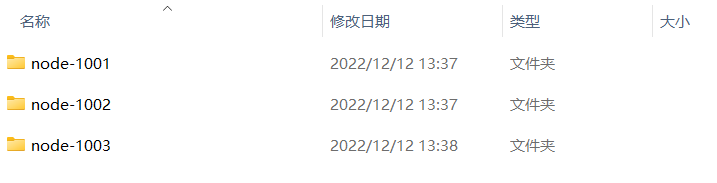

* **修改集群文件目录中每个节点的 config/elasticsearch.yml 配置文件**

node-1001 节点

```yaml
#节点 1 的配置信息：
#集群名称，节点之间要保持一致
cluster.name: my-elasticsearch
#节点名称，集群内要唯一
node.name: node-1001
node.master: true
node.data: true
#ip 地址
network.host: localhost
#http 端口
http.port: 1001
#tcp 监听端口
transport.tcp.port: 9301
#discovery.seed_hosts: ["localhost:9301", "localhost:9302","localhost:9303"]
#discovery.zen.fd.ping_timeout: 1m
#discovery.zen.fd.ping_retries: 5
#集群内的可以被选为主节点的节点列表
#cluster.initial_master_nodes: ["node-1", "node-2","node-3"]
#跨域配置
#action.destructive_requires_name: true
http.cors.enabled: true
http.cors.allow-origin: "*"
```

node-1002节点

```yaml
#节点 2 的配置信息：
#集群名称，节点之间要保持一致
cluster.name: my-elasticsearch
#节点名称，集群内要唯一
node.name: node-1002
node.master: true
node.data: true
#ip 地址
network.host: localhost
#http 端口
http.port: 1002
#tcp 监听端口
transport.tcp.port: 9302
discovery.seed_hosts: ["localhost:9301"]
discovery.zen.fd.ping_timeout: 1m
discovery.zen.fd.ping_retries: 5
#集群内的可以被选为主节点的节点列表
#cluster.initial_master_nodes: ["node-1", "node-2","node-3"]
#跨域配置
#action.destructive_requires_name: true
http.cors.enabled: true
http.cors.allow-origin: "*"
```

node-1003 节点

```yaml
#节点 3 的配置信息：
#集群名称，节点之间要保持一致
cluster.name: my-elasticsearch
#节点名称，集群内要唯一
node.name: node-1003
node.master: true
node.data: true
#ip 地址
network.host: localhost
#http 端口
http.port: 1003
#tcp 监听端口
transport.tcp.port: 9303
#候选主节点的地址，在开启服务后可以被选为主节点
discovery.seed_hosts: ["localhost:9301", "localhost:9302"]
discovery.zen.fd.ping_timeout: 1m
discovery.zen.fd.ping_retries: 5
#集群内的可以被选为主节点的节点列表
#cluster.initial_master_nodes: ["node-1", "node-2","node-3"]
#跨域配置
#action.destructive_requires_name: true
http.cors.enabled: true
http.cors.allow-origin: "*"
```

### **3.2.2** **启动集群**

* 启动前先删除**每个节点**中的 data 目录中所有内容（如果存在）

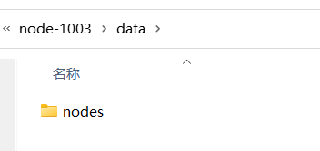

* 分别双击执行 bin/elasticsearch.bat, 启动节点服务器，启动后，会自动加入指定名称的集群

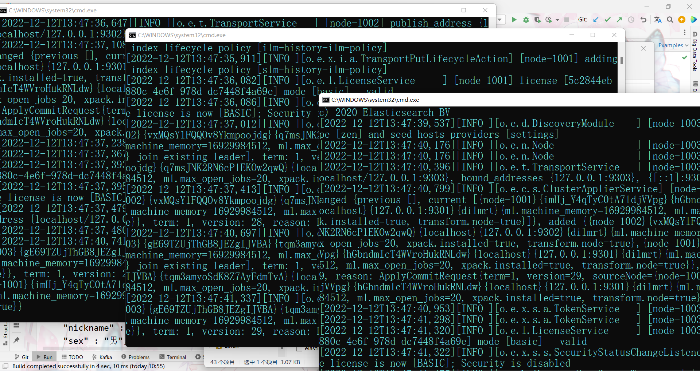

### **3.2.3** **测试集群**

**查看集群状态**

```perl
### 查看集群状态 node-1001节点
GET http://127.0.0.1:1001/_cluster/health

### 查看集群状态 node-1002节点
GET http://127.0.0.1:1002/_cluster/health

### 查看集群状态 node-1003节点
GET http://127.0.0.1:1003/_cluster/health
```


**status字段指示着当前集群在总体上是否工作正常。它的三种颜色含义如下:**

| 颜色   | 含义                                                   |
| ------ | ------------------------------------------------------ |
| green  | 所有的主分片和副本分片都正常运行                       |
| yellow | 所有的主分片都正常运行，但不是所有的副本分片都正常运行 |
| red    | 有主分片没能正常运行                                   |

**向集群中的 node-1001 节点增加索引**

```perl
### 向集群中的 node-1001 节点增加索引
PUT http://127.0.0.1:1001/user

### 向集群中的 node-1002 节点查询索引
GET http://127.0.0.1:1002/user
```

```json
{
  "acknowledged": true,
  "shards_acknowledged": true,
  "index": "user"
}
```

```json
{
  "user": {
    "aliases": {},
    "mappings": {},
    "settings": {
      "index": {
        "creation_date": "1670824619841",
        "number_of_shards": "1",
        "number_of_replicas": "1",
        "uuid": "ug2E0aOBQwGvcZK6hk2Dwg",
        "version": {
          "created": "7080099"
        },
        "provided_name": "user"
      }
    }
  }
}
```

## 3.3 **Linux** **集群**

### 3.3.1 **安装软件**

```perl
# 解压缩
tar -zxvf elasticsearch-7.8.0-linux-x86_64.tar.gz -C /opt/module
#分发集群
/opt/module/elasticsearch-7.8.0/

#因为安全问题，Elasticsearch 不允许 root 用户直接运行，所以要在每个节点中创建新用户
useradd es #新增 es 用户
passwd es #为 es 用户设置密码
userdel -r es #如果错了，可以删除再加
chown -R es:es /opt/module/es-cluster #文件夹所有者
```

### 3.3.2 **修改配置文件**

* 添加环境变量

```perl
#ELASTICSEARCH_HOME
export ELASTICSEARCH_HOME=/opt/moudule/elasticsearch-7.8.0
export PATH=$PATH:$ELASTICSEARCH_HOME/bin
```

* 修改/opt/module/elasticsearch-7.8.0/config/elasticsearch.yml 文件，分发文件

```yaml
cluster.name: cluster-es
#节点名称，每个节点的名称不能重复
node.name: node-1
#ip 地址，每个节点的地址不能重复
network.host: hadoop102
#是不是有资格主节点
node.master: true
node.data: true
http.port: 9200
# head 插件需要这打开这两个配置
http.cors.allow-origin: "*"
http.cors.enabled: true
http.max_content_length: 200mb
#es7.x 之后新增的配置，初始化一个新的集群时需要此配置来选举 master
cluster.initial_master_nodes: ["node-1"]
#es7.x 之后新增的配置，节点发现
discovery.seed_hosts: ["hadoop101:9300"]
gateway.recover_after_nodes: 2
network.tcp.keep_alive: true
network.tcp.no_delay: true
transport.tcp.compress: true
#集群内同时启动的数据任务个数，默认是 2 个
cluster.routing.allocation.cluster_concurrent_rebalance: 16
#添加或删除节点及负载均衡时并发恢复的线程个数，默认 4 个
cluster.routing.allocation.node_concurrent_recoveries: 16
#初始化数据恢复时，并发恢复线程的个数，默认 4 个
cluster.routing.allocation.node_initial_primaries_recoveries: 16
```

* 修改/etc/security/limits.conf ，分发文件

```properties
# 在文件末尾中增加下面内容
es soft nofile 65536
es hard nofile 65536
```

* 修改/etc/security/limits.d/20-nproc.conf，分发文件

```properties
# 在文件末尾中增加下面内容
es soft nofile 65536
es hard nofile 65536
* hard nproc 4096
# 注：* 带表 Linux 所有用户名称
```

* 修改/etc/sysctl.conf

```properties
# 在文件中增加下面内容
vm.max_map_count=655360
```

* 分发文件并重新加载

```perl
sudo /home/atguigu/bin/xsync /etc/profile.d/my_env.sh
sudo /home/atguigu/bin/xsync /etc/profile.d/my_env.sh /opt/module/elasticsearch-7.8.0/config/elasticsearch.yml
sudo /home/atguigu/bin/xsync /etc/profile.d/my_env.sh /etc/security/limits.conf
sudo /home/atguigu/bin/xsync /etc/profile.d/my_env.sh /etc/security/limits.d/20-nproc.conf
sudo /home/atguigu/bin/xsync /etc/profile.d/my_env.sh /etc/sysctl.conf

source /etc/profile
sysctl -p
```

### 3.3.3 **启动软件**

分别在不同节点上启动 ES 软件，按顺序启动hadoop102、hadoop103、hadoop104

```perl
cd /opt/module/es-cluster
#启动
bin/elasticsearch
#后台启动
bin/elasticsearch -d
```

### 3.3.4 **测试集群**

```perl
curl hadoop102:9200/_cat/nodes
```

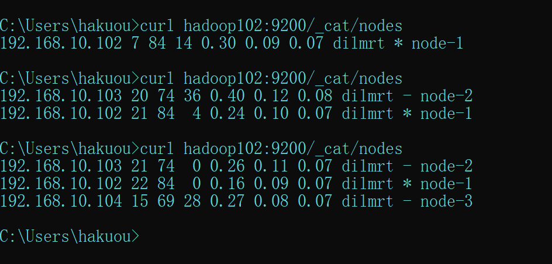

# 4 **Elasticsearch** **进阶**

## **4.1** **核心概念**

### **4.1.1** 索引（Index）

* 一个索引就是一个拥有几份相似特征的文档的集合。比如说，你可以有一个客户数据的索引，另一个产品目录的索引，还有一个订单数据的索引。

* 一个索引由一个名字来标识（必须全部是小写字母），并且当我们要对这个索引中的文档进行索引、搜索、更新和删除的时候，都要使用到这个名字。在一个集群中，可以定义任意多的索引。

* 能搜索的数据必须索引，这样的好处是可以提高查询速度，比如：新华字典前面的目录就是索引的意思，目录可以提高查询速度。

==Elasticsearch 索引的精髓：一切设计都是为了提高搜索的性能。==

### **4.1.2** 类型（Type）

在一个索引中，可以定义一种或多种类型。

一个类型是索引的一个逻辑上的分类/分区，其语义完全自定义。通常，会为具有一组共同字段的文档定义一个类型。不同的版本，类型发生了不同的变化。

| 版本 | Type                                           |
| ---- | ---------------------------------------------- |
| 5.X  | 支持多种 type                                  |
| 6.X  | 只能有一种 type                                |
| 7.X  | 默认不再支持自定义索引类型（默认类型为：_doc） |

### 4.1.3 文档（Document）

一个文档是一个可被索引的基础信息单元，也就是一条数据

比如：你可以拥有某一个客户的文档，某一个产品的一个文档，当然，也可以拥有某个订单的一个文档。文档以 JSON（Javascript Object Notation）格式来表示，而 JSON 是一个到处存在的互联网数据交互格式。在一个 index/type 里面，可以存储任意多的文档。

### 4.1.4 字段（Field）

相当于是数据表的字段，对文档数据根据不同属性进行的分类标识。

### 4.1.5 映射（Mapping）

mapping 是处理数据的方式和规则方面做一些限制，如：某个字段的数据类型、默认值、分析器、是否被索引等等。这些都是映射里面可以设置的，其它就是处理 ES 里面数据的一些使用规则设置也叫做映射，按着最优规则处理数据对性能提高很大，因此才需要建立映射，并且需要思考如何建立映射才能对性能更好。

### 4.1.6 分片（Shards）

一个索引可以存储超出单个节点硬件限制的大量数据。比如，一个具有 10 亿文档数据的索引占据 1TB 的磁盘空间，而任一节点都可能没有这样大的磁盘空间。或者单个节点处理搜索请求，响应太慢。为了解决这个问题，Elasticsearch 提供了将索引划分成多份的能力，每一份就称之为分片。

当创建一个索引的时候，可以指定想要的分片的数量。每个分片本身也是一个功能完善并且独立的“索引”，这个“索引”可以被放置到集群中的任何节点上。

分片很重要，主要有两方面的原因：

* 允许水平分割 / 扩展你的内容容量。
* 允许在分片之上进行分布式的、并行的操作，进而提高性能/吞吐量。

至于一个分片怎样分布，它的文档怎样聚合和搜索请求，是完全由 Elasticsearch 管理的，对于用户来说，这些都是透明的，无需过分关心。

==一个 Lucene 索引 我们在 Elasticsearch 称作分片 。 一个Elasticsearch 索引 是分片的集合。 当 Elasticsearch 在索引中搜索的时候， 它发送查询到每一个属于索引的分片(Lucene 索引)，然后合并每个分片的结果到一个全局的结果集。==

### 4.1.7 副本（Replicas）

在一个网络 / 云的环境里，失败随时都可能发生，在某个分片/节点不知怎么的就处于离线状态，或者由于任何原因消失了，这种情况下，有一个故障转移机制是非常有用并且是强烈推荐的。为此Elasticsearch 允许创建分片的一份或多份拷贝，这些拷贝叫做复制分片(副本)。

复制分片之所以重要，有两个主要原因：

* 在分片/节点失败的情况下，提供了高可用性。因为这个原因，注意到复制分片从不与原/主要（original/primary）分片置于同一节点上是非常重要的。
* 扩展搜索量/吞吐量，因为搜索可以在所有的副本上并行运行。

每个索引可以被分成多个分片。一个索引也可以被复制 0 次（没有复制）或多次。一旦复制了，每个索引就有了主分片（作为复制源的原来的分片）和复制分片（主分片的拷贝）之别。

分片和复制的数量可以在索引创建的时候指定。在索引创建之后，可以在任何时候动态地改变复制的数量，但是事后不能改变分片的数量。

默认情况下，Elasticsearch 中的每个索引被分片 1 个主分片和 1 个复制，这意味着，如果集群中至少有两个节点，索引将会有 1 个主分片和另外 1 个复制分片（1 个完全拷贝）每个索引总共就有 2 个分片，我们需要根据索引需要确定分片个数。

### 4.1.8 分配（Allocation）

将分片分配给某个节点的过程，包括分配主分片或者副本。如果是副本，还包含从主分片复制数据的过程。这个过程是由 master 节点完成的。

## **4.2** **系统架构**

`Lucene Index` ：一种全文搜索引擎

`P0-P2`：partition 分片

`R0-R2`：replication 副本


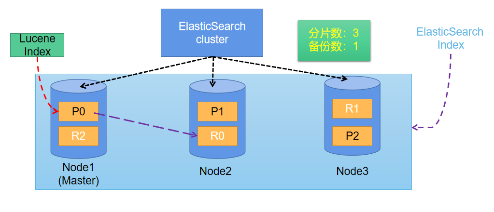

* 一个运行中的 Elasticsearch 实例称为一个节点，而集群是由一个或者多个拥有相同cluster.name 配置的节点组成， 它们共同承担数据和负载的压力。当有节点加入集群中或者从集群中移除节点时，集群将会重新平均分布所有的数据。
* 当一个节点被选举成为主节点时， 它将负责管理集群范围内的所有变更，例如增加、删除索引，或者增加、删除节点等。 而主节点并不需要涉及到文档级别的变更和搜索等操作，所以当集群只拥有一个主节点的情况下，即使流量的增加它也不会成为瓶颈。 任何节点都可以成为主节点。
* 作为用户，我们可以将请求发送到集群中的任何节点 ，包括主节点。 每个节点都知道任意文档所处的位置，并且能够将我们的请求直接转发到存储我们所需文档的节点。 无论我们将请求发送到哪个节点，它都能负责从各个包含我们所需文档的节点收集回数据，并将最终结果返回给客户端。 

## **4.3** **分布式集群**

### **4.3.1** **单节点集群**

在包含一个空节点的集群内创建名为 users 的索引，分配 3个主分片和一份副本（每个主分片拥有一个副本分片）

```perl
### 在 node-1001 节点增加索引
PUT http://127.0.0.1:1001/users
Content-Type: application/json

{
  "settings": {
    "number_of_shards": 3,
    "number_of_replicas": 1
  }
}
```

添加chrome elasticsearch浏览器插件


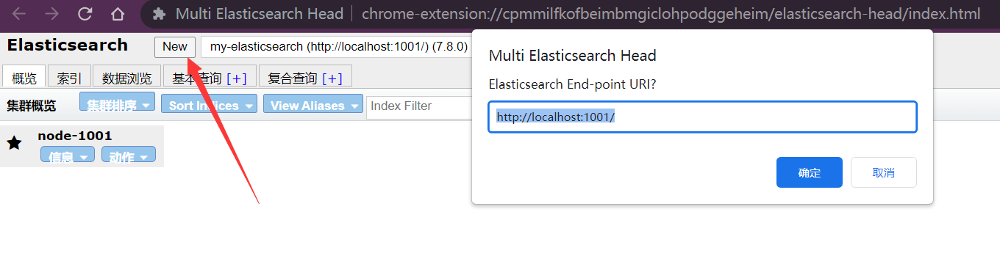

集群现在是拥有一个索引的单节点集群。所有 3 个主分片都被分配在 node-1 。


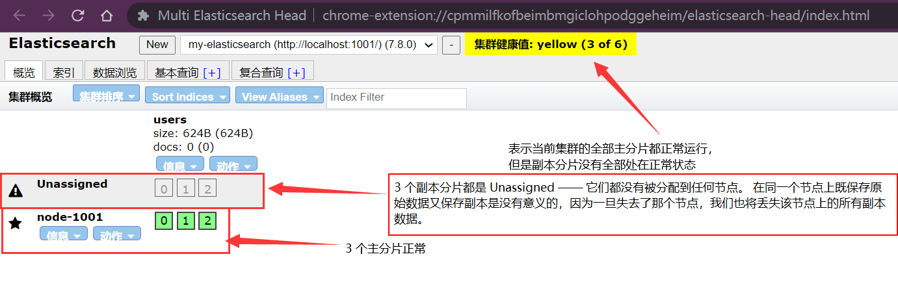

当前集群是正常运行的，但是在硬件故障时有丢失数据的风险。

### **4.3.2** **故障转移**

当集群中只有一个节点在运行时，意味着会有一个单点故障问题——没有冗余。只需再启动一个节点即可防止数据丢失。当你在同一台机器上启动了第二个节点时，只要它和第一个节点有同样的 cluster.name 配置，它就会自动发现集群并加入到其中。

但是在不同机器上启动节点的时候，为了加入到同一集群，你需要配置一个可连接到的单播主机列表。之所以配置为使用单播发现，以防止节点无意中加入集群。**只有在同一台机器上行的节点才会自动组成集群**。

如果启动了第二个节点，我们的集群将会拥有两个节点的集群 : 所有主分片和副本分片都已被分配。

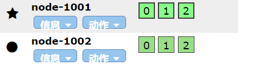

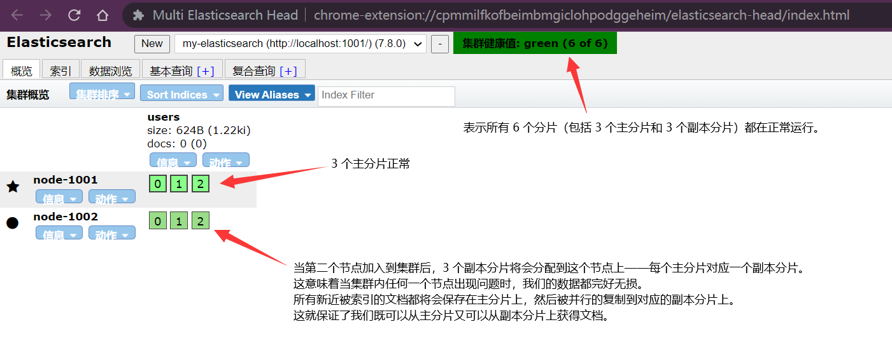

### **4.3.3** **水平扩容**

当启动了第三个节点，集群将会拥有三个节点的集群 : 为了分散负载而对分片进行重新分配。

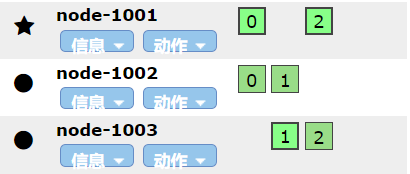

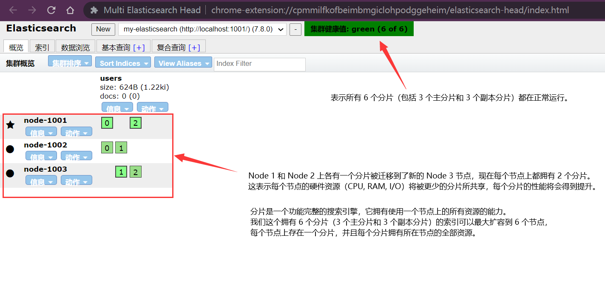

**如果我们想要扩容超过** **6** **个节点怎么办呢？**

主分片的数目在索引创建时就已经确定了下来。实际上，这个数目定义了这个索引能够存储 的最大数据量。（实际大小取决于你的数据、硬件和使用场景。） 

但是，读操作——搜索和返回数据——可以同时被主分片 或 副本分片所处理，所以当你拥有越多的副本分片时，也将拥有越高的吞吐量。

==在运行中的集群上是可以动态调整副本分片数目的，可以按需伸缩集群。==

把副本数从默认的 1 增加到 2

```perl
### 增加分片数目
PUT http://127.0.0.1:1001/users/_settings
Content-Type: application/json

{
  "number_of_replicas": 2
}
```

users 索引现在拥有 9 个分片：3 个主分片和 6 个副本分片。 集群扩容到 9 个节点，每个节点上一个分片。相比原来 3 个节点时，集群搜索性能可以提升 3 倍。

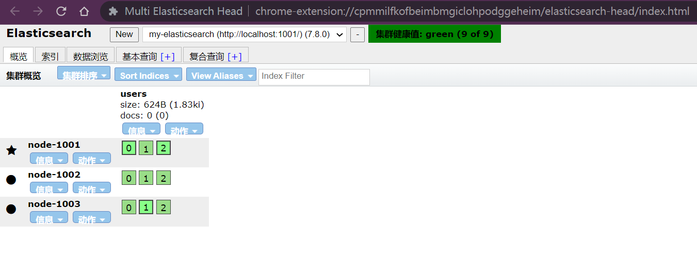

如果只是在相同节点数目的集群上增加更多的副本分片并不能提高性能，因为每个分片从节点上获得的资源会变少。 需要增加更多的硬件资源来提升吞吐量。但是更多的副本分片数提高了数据冗余量：按照上面的节点配置，可以在失去 2 个节点的情况下不丢失任何数据。

### **4.3.4** **应对故障**

关闭第一个节点，这时集群的状态为:关闭了一个节点后的集群。

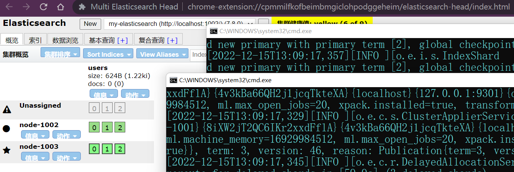

关闭的节点是一个主节点。而集群必须拥有一个主节点来保证正常工作，所以发生的第一件事情就是选举一个新的主节点： Node 3 。

在其它节点上存在着两个主分片的完整副本， 所以新的主节点立即将这些分片在 Node 2 和 Node 3 上对应的副本分片提升为主分片， 此时集群的状态将会为yellow。这个提升主分片的过程是瞬间发生的，如同按下一个开关一般。

**为什么集群状态是 yellow 而不是 green 呢？**

虽然我们拥有所有的三个主分片，但是同时设置了每个主分片需要对应 2 份副本分片，而此时只存在一份副本分片。 所以集群不能为 green 的状态。

如果同样关闭了 Node 2 ，程序依然可以保持在不丢任何数据的情况下运行，因为Node 3 为每一个分片都保留着一份副本。

如果重新启动 Node 1 ，集群可以将缺失的副本分片再次进行分配，那么集群的状态也将恢复成之前的状态。 如果 Node 1 依然拥有着之前的分片，它将尝试去重用它们，同时仅从主分片复制发生了修改的数据文件。和之前的集群相比，只是 Master 节点切换了。

**修改Node1节点配置文件elasticsearch.yml**

```yaml
#添加以下内容
discovery.seed_hosts: ["localhost:9301", "localhost:9302","localhost:9303"]
```

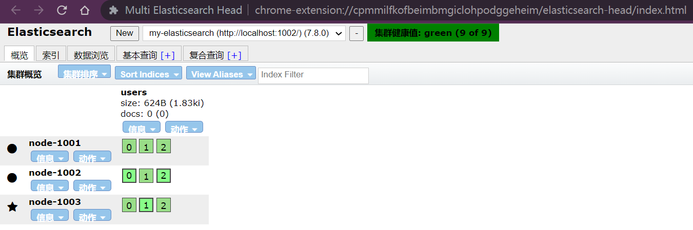

## **4.4** **路由计算**

==当索引一个文档的时候，文档会被存储到一个主分片中。具体位置根据下面这个公式决定的：==
$$
shard = hash(routing) \% number\_of\_primary\_shard
$$
`routing` ：是一个可变值，默认是文档的 _id ，也可以设置成一个自定义的值。 routing 通过hash 函数生成一个数字，然后这个数字再除以 number_of_primary_shards （主分片的数量）后得到余数 。这个分布在 0 到number_of_primary_shards-1 之间的余数，就是我们所寻求的文档所在分片的位置。

这就解释了为什么要在创建索引的时候就确定好主分片的数量 并且永远不会改变这个数量：因为如果数量变化了，那么所有之前路由的值都会无效，文档也再也找不到了。

所有的文档 API（ get、index、delete、bulk、update 以及 mget ）都接受一个叫做 routing 的路由参数 ，通过这个参数可以自定义文档到分片的映射。

一个自定义的路由参数可以用来确保所有相关的文档——例如所有属于同一个用户的文档——都被存储到同一个分片中。

## **4.5** **分片控制**

我们假设有一个集群由三个节点组成。 它包含一个叫 emps 的索引，有两个主分片，每个主分片有两个副本分片。相同分片的副本不会放在同一节点。

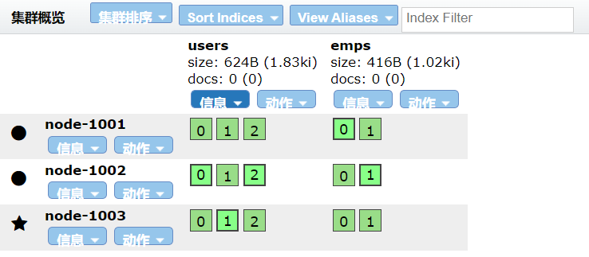

我们可以发送请求到集群中的任一节点。 每个节点都有能力处理任意请求。 

每个节点都知道集群中任一文档位置，所以可以直接将请求转发到需要的节点上。 在下面的例子中，将

所有的请求发送到 Node 1，我们将其称为 **协调节点**(coordinating node) 。

**当发送请求的时候， 为了扩展负载，更好的做法是轮询集群中所有的节点**

### **4.5.1** **写流程**

新建、索引和删除 请求都是 写 操作， 必须在主分片上面完成之后才能被复制到相关的副本分片。

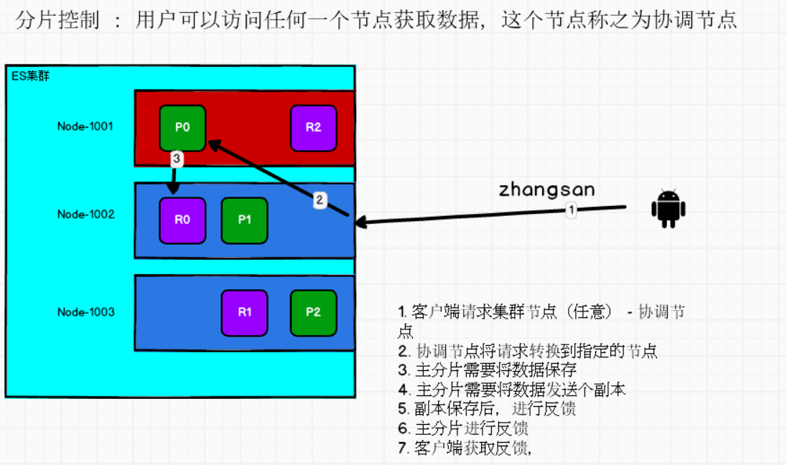

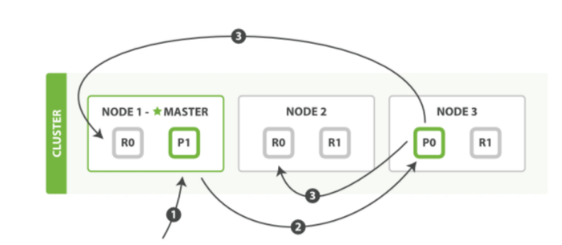

**新建，索引和删除文档所需要的步骤顺序**：

* 客户端向 Node 1 发送新建、索引或者删除请求。
* 节点使用文档的 _id 确定文档属于分片 0 。请求会被转发到 Node 3，因为分片 0 的主分片目前被分配在 Node 3 上。
* Node 3 在主分片上面执行请求。如果成功了，它将请求并行转发到 Node 1 和 Node 2 的副本分片上。一旦所有的副本分片都报告成功, Node 3 将向协调节点报告成功，协调节点向客户端报告成功。

在客户端收到成功响应时，文档变更已经在主分片和所有副本分片执行完成，变更是安全的。有一些可选的请求参数允许您影响这个过程，可能以数据安全为代价提升性能。这些选项很少使用，因为 Elasticsearch 已经很快，但是为了完整起见，参考以下参数：

`consistency`：consistency，即一致性。在默认设置下，即使仅仅是在试图执行一个**写**操作之前，主分片都会要求必须要有规定数量(quorum)（大多数）的分片副本处于活跃可用状态，才会去执行**写**操作(其中分片副本可以是主分片或者副本分片)。这是为了避免在发生网络分区故障（network partition）的时候进行**写**操作，进而导致数据不一致。**规定数量**即：

$$int( (primary + number\_of\_replicas) / 2 ) + 1$$

consistency 参数的值可以设为 one （只要主分片状态 ok 就允许执行_写_操作）,all（必须要主分片和所有副本分片的状态没问题才允许执行_写_操作）, 或quorum 。默认值为 quorum , 即大多数的分片副本状态没问题就允许执行**写**操作。

注意，规定数量 的计算公式中 number_of_replicas 指的是在索引设置中的设定副本分片数，而不是指当前处理活动状态的副本分片数。如果你的索引设置中指定了当前索引拥有三个副本分片，那规定数量的计算结果即：

$$int( (primary + 3\ replicas) / 2 ) + 1 = 3$$

如果此时你只启动两个节点，那么处于活跃状态的分片副本数量就达不到规定数量，也因此您将无法索引和删除任何文档。

`timeout `：如果没有足够的副本分片会发生什么？ Elasticsearch 会等待，希望更多的分片出现。默认情况下，它最多等待 1 分钟。 如果你需要，你可以使用 timeout 参数使它更早终止： 100是100 毫秒，30s 是 30 秒。

**<font color=blue>注意：新索引默认有 1 个副本分片，这意味着为满足规定数量应该需要两个活动的分片副本。 但是，这些默认的设置会阻止我们在单一节点上做任何事情。为了避免这个问题，要求只有当 number_of_replicas 大于 1 的时候，规定数量才会执行。</font>**

### **4.5.2** **读流程**

可以从主分片或者从其它任意副本分片检索文档

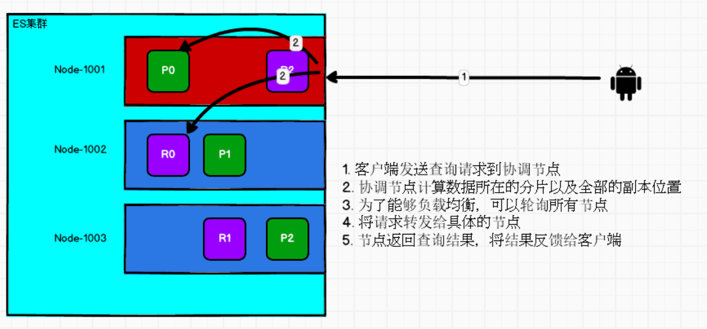

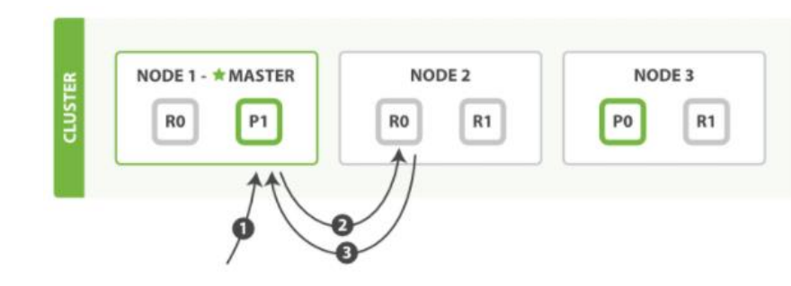

**从主分片或者副本分片检索文档的步骤顺序**：

* 客户端向 Node 1 发送获取请求。
* 节点使用文档的 _id 来确定文档属于分片 0 。分片 0 的副本分片存在于所有的三个节点上。 在这种情况下，它将请求转发到 Node 2 。
* Node 2 将文档返回给 Node 1 ，然后将文档返回给客户端。

在处理读取请求时，协调结点在每次请求的时候都会通过轮询所有的副本分片来达到负载均衡。在文档被检索时，已经被索引的文档可能已经存在于主分片上但是还没有复制到副本分片。 

在这种情况下，副本分片可能会报告文档不存在，但是主分片可能成功返回文档。 一旦索引请求成功返回给用户，文档在主分片和副本分片都是可用的。

### **4.5.3** **更新流程**

部分更新一个文档结合了先前说明的读取和写入流程：

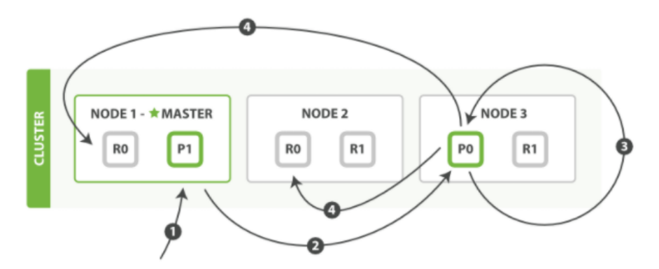

**部分更新一个文档的步骤如下**：

* 客户端向 Node 1 发送更新请求。
* 它将请求转发到主分片所在的 Node 3 。
* Node 3 从主分片检索文档，修改 _source 字段中的 JSON ，并且尝试重新索引主分片的文档。如果文档已经被另一个进程修改，它会重试步骤 3 ，超过 `retry_on_conflict` 次后放弃。
* 如果 Node 3 成功地更新文档，它将新版本的文档并行转发到 Node 1 和 Node 2 上的副本分片，重新建立索引。一旦所有副本分片都返回成功， Node 3 向协调节点也返回成功，协调节点向客户端返回成功。

**<font color=blue>注意：当主分片把更改转发到副本分片时， 它不会转发更新请求。 相反，它转发完整文档的新版本。请记住，这些更改将会异步转发到副本分片，并且不能保证它们以发送它们相同的顺序到达。 如果 Elasticsearch 仅转发更改请求，则可能以错误的顺序应用更改，导致得到损坏的文档。</font>**

### **4.5.4** **多文档操作流程**

mget 和 bulk API 的模式类似于单文档模式。区别在于协调节点知道每个文档存在于哪个分片中。它将整个多文档请求分解成 每个分片 的多文档请求，并且将这些请求并行转发到每个参与节点。

协调节点一旦收到来自每个节点的应答，就将每个节点的响应收集整理成单个响应，返回给客户端。

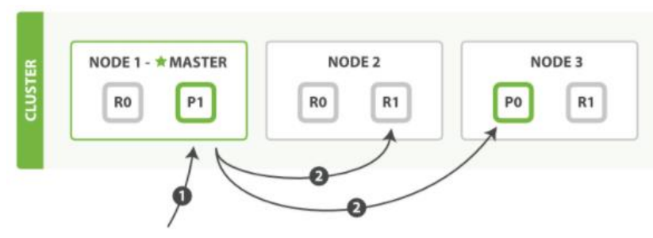

**用单个** **<font color=blue>mget</font>** **请求取回多个文档所需的步骤顺序**:

* 客户端向 Node 1 发送 mget 请求。
* Node 1 为每个分片构建多文档获取请求，然后并行转发这些请求到托管在每个所需的主分片或者副本分片的节点上。一旦收到所有答复， Node 1 构建响应并将其返回给客户端。

可以对 docs 数组中每个文档设置 routing 参数。

**<font color=blue>bulk API</font>**：允许在单个批量请求中执行多个创建、索引、删除和更新请求。

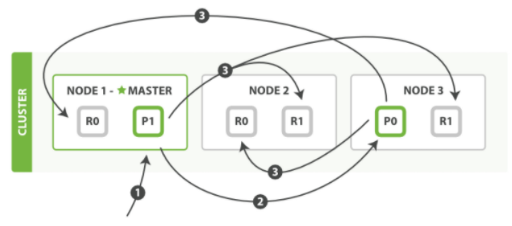

bulk API 按如下步骤顺序执行：

* 客户端向 Node 1 发送 bulk 请求。
* Node 1 为每个节点创建一个批量请求，并将这些请求并行转发到每个包含主分片的节点主机。
* 主分片一个接一个按顺序执行每个操作。当每个操作成功时，主分片并行转发新文档（或删除）到副本分片，然后执行下一个操作。 一旦所有的副本分片报告所有操作成功，该节点将向协调节点报告成功，协调节点将这些响应收集整理并返回给客户端。

## **4.6** **分片原理**

分片是 Elasticsearch 最小的工作单元。但是究竟什么是一个分片，它是如何工作的？

传统的数据库每个字段存储单个值，但这对全文检索并不够。文本字段中的每个单词需要被搜索，对数据库意味着需要单个字段有索引多值的能力。最好的支持是一个字段多个值需求的数据结构是<font color=blue>倒排索</font>引。

### **4.6.1** **倒排索引**

Elasticsearch 使用一种称为**<font color=blue>倒排索引</font>**的结构，它适用于快速的全文搜索。

词条：索引中最小存储和查询单元

词典： 字典，词条的集合，B+，HashMap存储

倒排表：每个词条对应的文档id

==查询过程：==

1. 根据词条查询词典，查询不到直接结束，查询到后去倒排表中找词条
2. 倒排表中找到词条后获取对应文档id列表
3. 通过文档id查找文档

```perl
#可设置分词
keyword
text
ik_max_word
ik_smart
```

一个倒排索引由文档中所有不重复词的列表构成，对于其中每个词，有一个包含它的文档列表。例如，假设我们有两个文档，每个文档的 content 域包含如下内容：

* The quick brown fox jumped over the lazy dog
* Quick brown foxes leap over lazy dogs in summer

为了创建倒排索引，我们首先将每个文档的 content 域拆分成单独的 词（我们称它为 词条或 tokens ），创建一个包含所有不重复词条的排序列表，然后列出每个词条出现在哪个文档。结果如下所示：

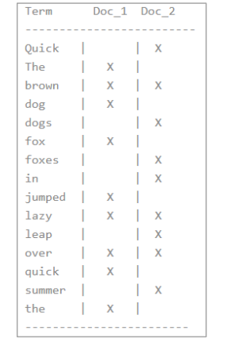

现在，如果我们想搜索 <font color=red style="background: yellow">quick</font> <font color=red style="background: yellow">brown</font>，我们只需要查找包含每个词条的文档：

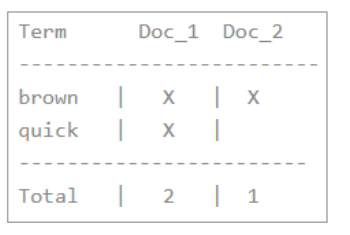

两个文档都匹配，但是第一个文档比第二个匹配度更高。如果我们使用仅计算匹配词条数量的简单相似性算法，那么我们可以说，对于我们查询的相关性来讲，第一个文档比第二个文档更佳。

### **4.6.2** **文档搜索**

早期的全文检索会为整个文档集合建立一个很大的倒排索引并将其写入到磁盘。 一旦新的索引就绪，旧的就会被其替换，这样最近的变化便可以被检索到。

倒排索引被写入磁盘后是<font color=red>不可改变的</font>：它永远不会修改。

不变性有重要的价值：

* 不需要锁。如果你从来不更新索引，你就不需要担心多进程同时修改数据的问题。
* 一旦索引被读入内核的文件系统缓存，便会留在哪里，由于其不变性。只要文件系统缓存中还有足够的空间，那么大部分读请求会直接请求内存，而不会命中磁盘。这提供了很大的性能提升。
* 其它缓存(像 filter 缓存)，在索引的生命周期内始终有效。它们不需要在每次数据改变时被重建，因为数据不会变化。
* 写入单个大的倒排索引允许数据被压缩，减少磁盘 I/O 和 需要被缓存到内存的索引的使用量。

当然，一个不变的索引也有不好的地方。主要事实是它是不可变的! 你不能修改它。如果你需要让一个新的文档 可被搜索，你需要重建整个索引。这要么对一个索引所能包含的数据量造成了很大的限制，要么对索引可被更新的频率造成了很大的限制。

### **4.6.3** **动态更新索引**

如何在保留不变性的前提下实现倒排索引的更新？

答案是: 用更多的索引。通过增加新的补充索引来反映新近的修改，而不是直接重写整个倒排索引。每一个倒排索引都会被轮流查询到，从最早的开始查询完后再对结果进行合并。

Elasticsearch 基于 Lucene, 这个 java 库引入了**<font color=blue>按段搜索</font>**的概念。 每一段本身都是一个倒排索引， 但索引在 Lucene 中除表示所有段的集合外， 还增加了提交点的概念 ：一个列出了所有已知段的文件

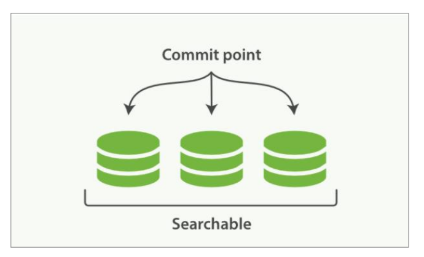

**<font color=blue>按段搜索</font>**会以如下流程执行：

**1.新文档被收集到内存索引缓存**

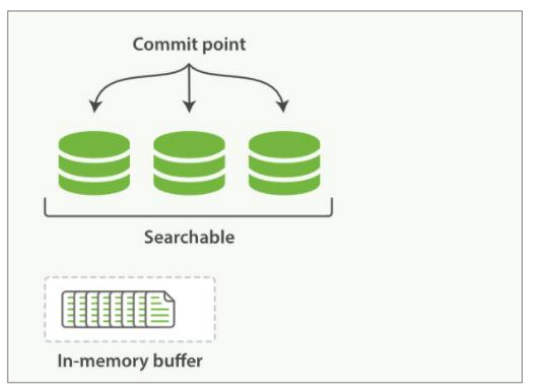

**2.不时地, 缓存被提交**

* 一个新的段：一个追加的倒排索引被写入磁盘。
* 一个新的包含：新段名字的提交点被写入磁盘
* 磁盘进行同步：所有在文件系统缓存中等待的写入都刷新到磁盘，以确保它们被写入物理文件

**3.新的段被开启，让它包含的文档可见以被搜索**

**4.内存缓存被清空，等待接收新的文档**

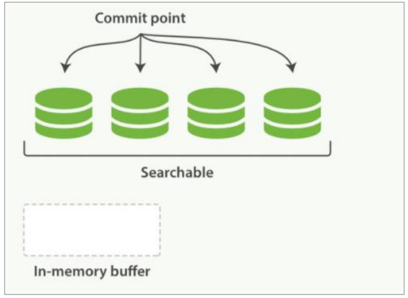

当一个查询被触发，所有已知的段按顺序被查询。词项统计会对所有段的结果进行聚合，以保证每个词和每个文档的关联都被准确计算。 这种方式可以用相对较低的成本将新文档添加到索引。

段是不可改变的，所以既不能从把文档从旧的段中移除，也不能修改旧的段来进行反映文档的更新。 取而代之的是，每个提交点会包含一个 .del 文件，文件中会列出这些被删除文档的段信息。

当一个文档被 “删除” 时，它实际上只是在 .del 文件中被**标记**删除。一个被标记删除的文档仍然可以被查询匹配到， 但它会在最终结果被返回前从结果集中移除。

文档更新也是类似的操作方式：当一个文档被更新时，旧版本文档被标记删除，文档的新版本被索引到一个新的段中。 可能两个版本的文档都会被一个查询匹配到，但被删除的那个旧版本文档在结果集返回前就已经被移除。

### **4.6.4** **近实时搜索**

随着按段（per-segment）搜索的发展，一个新的文档从索引到可被搜索的延迟显著降低了。新文档在几分钟之内即可被检索，但这样还是不够快。磁盘在这里成为了瓶颈。提交（Commiting）一个新的段到磁盘需要一个 **fsync** 来确保段被物理性地写入磁盘，这样在断电的时候就不会丢失数据。 但是 **fsync** 操作代价很大; 如果每次索引一个文档都去执行一次的话会造成很大的性能问题。

我们需要的是一个更轻量的方式来使一个文档可被搜索，这意味着 fsync 要从整个过程中被移除。在 Elasticsearch 和磁盘之间是文件系统缓存。 像之前描述的一样， 在内存索引缓冲区中的文档会被写入到一个新的段中。 但是这里新段会被先写入到文件系统缓存—这一步代价会比较低，稍后再被刷新到磁盘—这一步代价比较高。不过只要文件已经在缓存中，就可以像其它文件一样被打开和读取了。

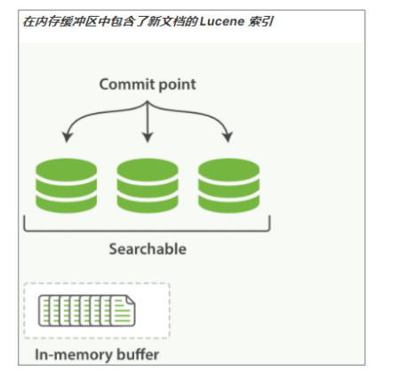

Lucene 允许新段被写入和打开—使其包含的文档在未进行一次完整提交时便对搜索可见。这种方式比进行一次提交代价要小得多，并且在不影响性能的前提下可以被频繁地执行。

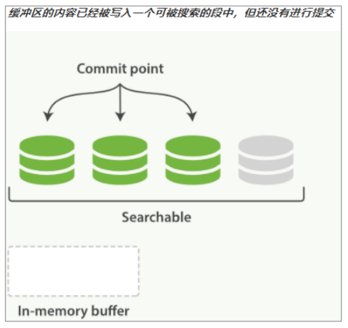

在 Elasticsearch 中，写入和打开一个新段的轻量的过程叫做 refresh 。 默认情况下每个分片会每秒自动刷新一次。这就是为什么我们说 Elasticsearch 是 近 实时搜索: 文档的变化并不是立即对搜索可见，但会在一秒之内变为可见。

这些行为可能会对新用户造成困惑: 他们索引了一个文档然后尝试搜索它，但却没有搜到。这个问题的解决办法是用 refresh API 执行一次手动刷新: /users/_refresh

**<font color=blue>尽管刷新是比提交轻量很多的操作，它还是会有性能开销。当写测试的时候， 手动刷新很有用，但是不要在生产环境下每次索引一个文档都去手动刷新。 相反，你的应用需要意识到 Elasticsearch 的近实时的性质，并接受它的不足。</font>**

并不是所有的情况都需要每秒刷新。可能你正在使用 Elasticsearch 索引大量的日志文件，你可能想优化索引速度而不是近实时搜索， 可以通过设置 refresh_interval ， 降低每个索引的刷新频率

```json
{
  "settings": {
    "refresh_interval": "30s"
  }
}
```

refresh_interval 可以在既存索引上进行动态更新。 在生产环境中，当你正在建立一个大的新索引时，可以先关闭自动刷新，待开始使用该索引时，再把它们调回来

```json
### 关闭自动刷新
PUT http://127.0.0.1:1001/users/_settings
Content-Type: application/json

{ "refresh_interval": -1 } 


### 每一秒刷新
PUT http://127.0.0.1:1001/users/_settings
Content-Type: application/json

{ "refresh_interval": "1s" }
```

### **4.6.5** **持久化变更**

如果没有用 fsync 把数据从文件系统缓存刷（flush）到硬盘，不能保证数据在断电甚至是程序正常退出之后依然存在。为了保证 Elasticsearch 的可靠性，需要确保数据变化被持久化到磁盘。在动态更新索引，一次完整的提交会将段刷到磁盘，并写入一个包含所有段列表的提交点。Elasticsearch 在启动或重新打开一个索引的过程中使用这个提交点来判断哪些段隶属于当前分片。

即使通过每秒刷新（refresh）实现了近实时搜索，我们仍然需要经常进行完整提交来确保能从失败中恢复。但在两次提交之间发生变化的文档怎么办？我们也不希望丢失掉这些数据。Elasticsearch 增加了一个 translog ，或者叫事务日志，在每一次对 Elasticsearch 进行操作时均进行了日志记录

整个流程如下：

* 一个文档被索引之后，就会被添加到内存缓冲区，并且追加到了 translog

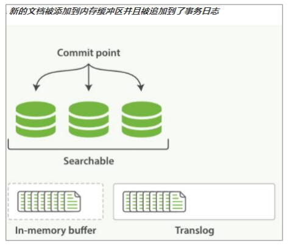

* 刷新（refresh）使分片每秒被刷新（refresh）一次：
  * 这些在内存缓冲区的文档被写入到一个新的段中，且没有进行 fsync 操作。
  * 这个段被打开，使其可被搜索
  * 内存缓冲区被清空


* 这个进程继续工作，更多的文档被添加到内存缓冲区和追加到事务日志

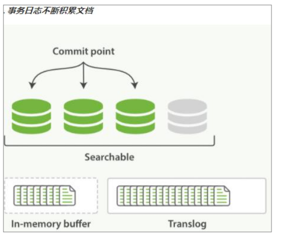

* 每隔一段时间—例如 translog 变得越来越大—索引被刷新（flush）；一个新的 translog 被创建，并且一个全量提交被执行
  * 所有在内存缓冲区的文档都被写入一个新的段。
  * 缓冲区被清空。
  * 一个提交点被写入硬盘。
  * 文件系统缓存通过 fsync 被刷新（flush）。
  * 老的 translog 被删除。

translog 提供所有还没有被刷到磁盘的操作的一个持久化纪录。当 Elasticsearch 启动的时候， 它会从磁盘中使用最后一个提交点去恢复已知的段，并且会重放 translog 中所有在最后一次提交后发生的变更操作。

translog 也被用来提供实时 CRUD 。当你试着通过 ID 查询、更新、删除一个文档，它会在尝试从相应的段中检索之前， 首先检查 translog 任何最近的变更。这意味着它总是能够实时地获取到文档的最新版本。

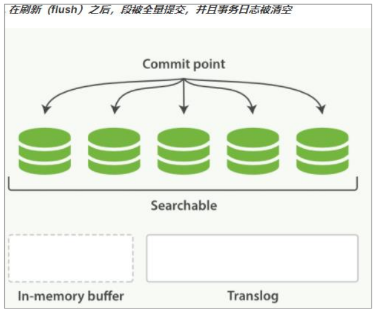

执行一个提交并且截断 translog 的行为在 Elasticsearch 被称作一次 flush分片每 30 分钟被自动刷新（flush），或者在 translog 太大的时候也会刷新

### **4.6.6** **段合并**

由于自动刷新流程每秒会创建一个新的段 ，这样会导致短时间内的段数量暴增。而段数目太多会带来较大的麻烦。 每一个段都会消耗文件句柄、内存和 cpu 运行周期。更重要的是，每个搜索请求都必须轮流检查每个段；所以段越多，搜索也就越慢。Elasticsearch 通过在后台进行段合并来解决这个问题。小的段被合并到大的段，然后这些大的段再被合并到更大的段。

段合并的时候会将那些旧的已删除文档从文件系统中清除。被删除的文档（或被更新文档的旧版本）不会被拷贝到新的大段中。

启动段合并不需要你做任何事。进行索引和搜索时会自动进行。

1. 当索引的时候，刷新（refresh）操作会创建新的段并将段打开以供搜索使用。

2. 合并进程选择一小部分大小相似的段，并且在后台将它们合并到更大的段中。这并不会中断索引和搜索。

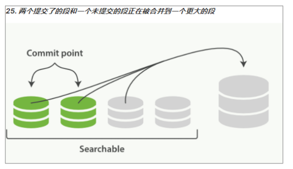

3. 一旦合并结束，老的段被删除
   * 新的段被刷新（flush）到了磁盘。 ** 写入一个包含新段且排除旧的和较小的段的新提交点。
   * 新的段被打开用来搜索。
   * 老的段被删除。

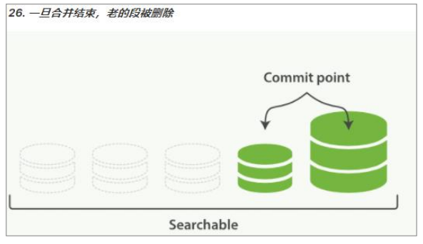

合并大的段需要消耗大量的 I/O 和 CPU 资源，如果任其发展会影响搜索性能。Elasticsearch在默认情况下会对合并流程进行资源限制，所以搜索仍然 有足够的资源很好地执行。

### 4.6.3~4.6.6总结

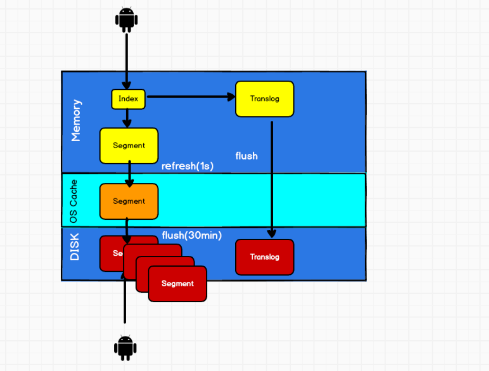

## **4.7** **文档分析**

