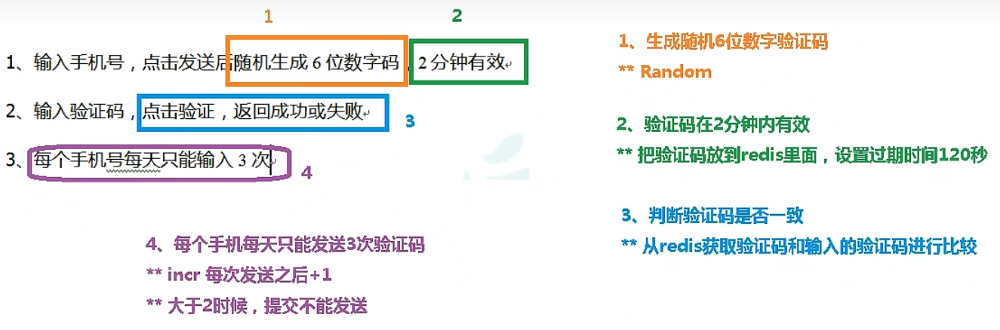
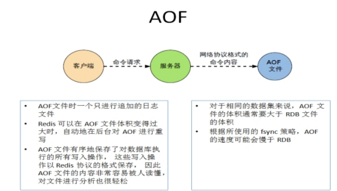
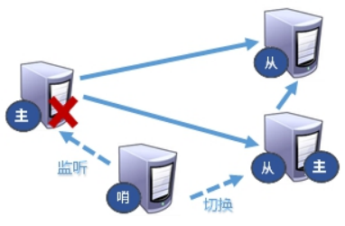
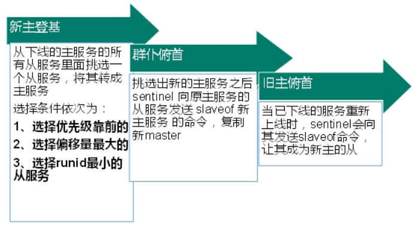
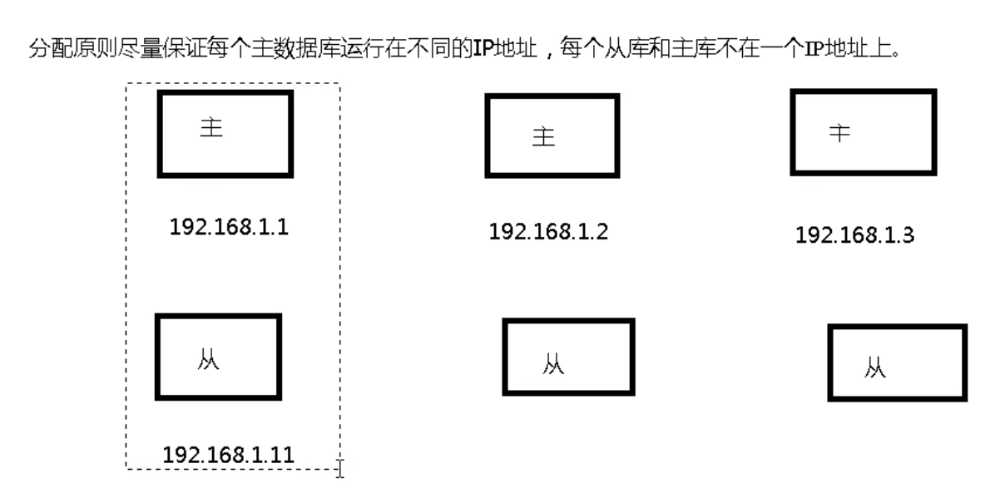
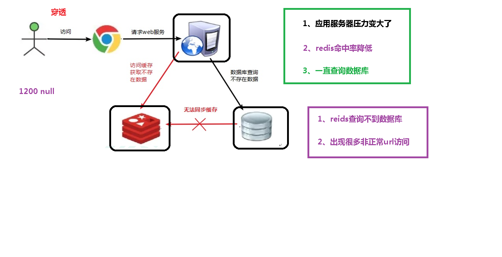
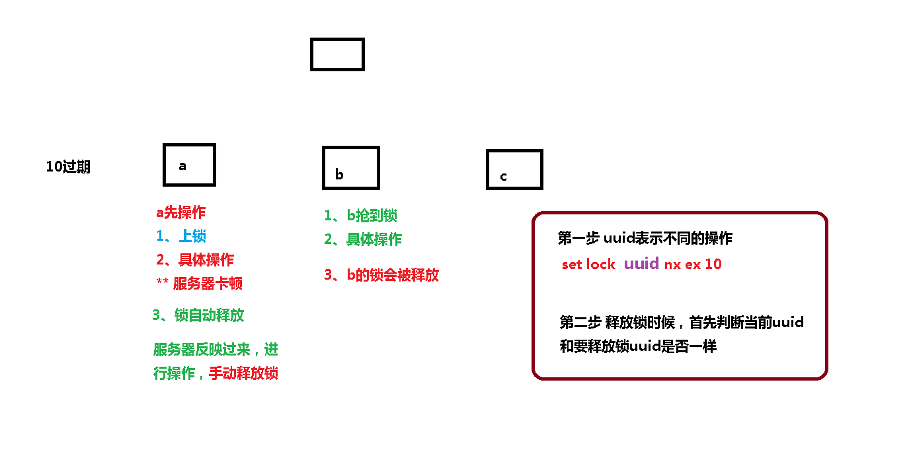

## 1. Redis安装

```perl
#安装
gcc --version  #查看C语言环境，没有需要安装 yum -y install gcc
tar -zxvf redis-6.2.1.tar.gz -C /opt/
cd /opt/redis-6.2.1/
make
make install

#前台启动
cd /usr/local/bin/
redis-server

#后台启动设置daemonize no改成yes
cp redis.conf /etc/
vim /etc/redis.conf
:%s/daemonize no/daemonize yes/g
cd /usr/local/bin/
redis-server /etc/redis.conf

#查看redis进程
ps -ef|grep redis
#连接客户端
[root@Neptune bin]# redis-cli
127.0.0.1:6379> ping
PONG
127.0.0.1:6379>

#redis关闭
客户端执行shutdown
or
找到进程 kill -9
```

## 2. 简介

默认16个数据库，类似数组下标从0开始，初始默认使用0号库

使用命令 `select  <dbid>`来切换数据库。如: `select 8 `

统一密码管理，所有库同样密码。

`dbsize`查看当前数据库的key的数量

`flushdb`清空当前库

`flushall`通杀全部库


## 3. 常用五大数据类型

### 3.1 Redis键(key)操作

```perl
keys *查看当前库所有key    (匹配：keys *1)
exists key判断某个key是否存在
type key 查看你的key是什么类型
del key       删除指定的key数据
unlink key   根据value选择非阻塞删除，仅将keys从keyspace元数据中删除，真正的删除会在后续异步操作。（异步）
expire key 10   10秒钟：为给定的key设置过期时间
ttl key 查看还有多少秒过期，-1表示永不过期，-2表示已过期

select命令切换数据库
dbsize查看当前数据库的key的数量
flushdb清空当前库
flushall通杀全部库
```


```perl
[root@Neptune bin]# redis-cli
127.0.0.1:6379> keys *
(empty array)
127.0.0.1:6379> set k1 alice
OK
127.0.0.1:6379> set k2 kirito
OK
127.0.0.1:6379> set k3 asuna
OK
127.0.0.1:6379> keys *
1) "k3"
2) "k1"
3) "k2"
127.0.0.1:6379> exists k1
(integer) 1
127.0.0.1:6379> exists k4
(integer) 0
127.0.0.1:6379> type k2
string
127.0.0.1:6379> del k3
(integer) 1
127.0.0.1:6379> keys *
1) "k1"
2) "k2"
127.0.0.1:6379> expire k1 10
(integer) 1
127.0.0.1:6379> ttl k1
(integer) 6
127.0.0.1:6379> ttl k1
(integer) 3
127.0.0.1:6379> ttl k1
(integer) -2
127.0.0.1:6379> ttl k2
(integer) -1
127.0.0.1:6379> select 1
OK
127.0.0.1:6379[1]> select 0
OK
127.0.0.1:6379> dbsize
(integer) 1
127.0.0.1:6379>
```


### 3.2 Redis字符串(String)

#### 3.2.1 简介

String是Redis最基本的类型，你可以理解成与Memcached一模一样的类型，一个key对应一个value。

String类型是二进制安全的。意味着Redis的string可以包含任何数据。比如jpg图片或者序列化的对象。

String类型是Redis最基本的数据类型，一个Redis中字符串value最多可以是512M

#### 3.2.2 常用命令

`set  <key><value>`添加键值对

 ```perl
127.0.0.1:6379> set k1 v100
OK
127.0.0.1:6379> set k2 v200
OK
127.0.0.1:6379> keys *
1) "k1"
2) "k2"

 ```

*NX：当数据库中key不存在时，可以将key-value添加数据库

*XX：当数据库中key存在时，可以将key-value添加数据库，与NX参数互斥

*EX：key的超时秒数

*PX：key的超时毫秒数，与EX互斥

`get  <key>`查询对应键值

```perl
127.0.0.1:6379> get k1
"v100"
127.0.0.1:6379> set k1 v1100
OK
127.0.0.1:6379> get k1
"v1100"
```

`append  <key><value>`将给定的<value> 追加到原值的末尾

```perl
127.0.0.1:6379> append k1 abc
(integer) 8
127.0.0.1:6379> get k1
```

`strlen  <key>`获得值的长度

```perl
127.0.0.1:6379> strlen k1
(integer) 8
```

`setnx  <key><value>`只有在 key 不存在时   设置 key 的值

 ```perl
127.0.0.1:6379> setnx k1 v1
(integer) 0
127.0.0.1:6379> get k1
"v1100abc"
127.0.0.1:6379> setnx k3 v3
(integer) 1
127.0.0.1:6379> get k3
"v3"
 ```

`incr  <key>`将 key 中储存的数字值增1，只能对数字值操作，如果为空，新增值为1

```perl
127.0.0.1:6379> set k4 500
OK
127.0.0.1:6379> incr k4
(integer) 501
127.0.0.1:6379> get k4
"501"
```

`decr  <key>`将 key 中储存的数字值减1，只能对数字值操作，如果为空，新增值为-1

```perl
127.0.0.1:6379> decr k4
(integer) 500
```

`incrby / decrby  <key> <步长>`将 key 中储存的数字值增减。自定义步长。

```perl
127.0.0.1:6379> incrby k4 10
(integer) 510
127.0.0.1:6379> decrby k4 20
(integer) 490
```

==原子性==

INCR key
起始版本:1.0.0时间复杂度:O(1)
对存储在指定key的数值执行**原子**的加1操作。

所谓**原子**操作是指不会被线程调度机制打断的操作；

这种操作一旦开始，就一直运行到结束，中间不会有任何 context switch （切换到另一个线程）。

（1）在单线程中， 能够在单条指令中完成的操作都可以认为是"原子操作"，因为中断只能发生于指令之间。

（2）在多线程中，不能被其它进程（线程）打断的操作就叫原子操作。

Redis单命令的原子性主要得益于Redis的单线程。


`mset  <key1><value1><key2><value2>  ..... `同时设置一个或多个 key-value对  

```perl
127.0.0.1:6379> mset k1 v1 k2 v2 k3 v3
OK
127.0.0.1:6379> keys *
1) "k3"
2) "k1"
3) "k2"
```

`mget  <key1><key2><key3> .....`同时获取一个或多个 value  

```perl
127.0.0.1:6379> mget k1 k2 k3
1) "v1"
2) "v2"
3) "v3"
```

`msetnx <key1><value1><key2><value2>  ..... `同时设置一个或多个 key-value 对，当且仅当所有给定 key 都不存在。

==原子性，有一个失败则都失败==

```perl
127.0.0.1:6379> msetnx k11 v11 k12 v12 k3 v13
(integer) 0
127.0.0.1:6379> keys *
1) "k3"
2) "k1"
3) "k2"
127.0.0.1:6379> msetnx k11 v11 k12 v12 k3 v3
(integer) 0
127.0.0.1:6379> msetnx k11 v11 k12 v12 k13 v13
(integer) 1
127.0.0.1:6379> keys *
1) "k1"
2) "k12"
3) "k13"
4) "k2"
5) "k3"
6) "k11"
```

`getrange  <key><起始位置><结束位置>`获得值的范围，类似java中的substring，**前包，后包**

```perl
127.0.0.1:6379> set name alicesoft
OK
127.0.0.1:6379> getrange name 0 4
"alice"
```

`setrange  <key><起始位置><value>`用 <value>  覆写<key>所储存的字符串值，从<起始位置>开始(**索引从0开始**)。

 ```perl
127.0.0.1:6379> setrange name 3 xxx
(integer) 9
127.0.0.1:6379> get name
"alixxxoft"
 ```

`setex  <过期时间>`设置键值的同时，设置过期时间，单位秒。

```perl
127.0.0.1:6379> setex age 20 value20
OK
127.0.0.1:6379> ttl age
(integer) 16
127.0.0.1:6379> ttl age
(integer) 11
```

`getset <key><value>`以新换旧，设置了新值同时获得旧值。

```perl
127.0.0.1:6379> getset name asuna
"alixxxoft"
127.0.0.1:6379> get name
"asuna"
```

#### 3.2.3 数据结构

String的数据结构为简单动态字符串(Simple Dynamic String,缩写SDS)。是可以修改的字符串，内部结构实现上类似于Java的ArrayList，采用预分配冗余空间的方式来减少内存的频繁分配.


如图中所示，内部为当前字符串实际分配的空间capacity一般要高于实际字符串长度len。当字符串长度小于1M时，扩容都是加倍现有的空间，如果超过1M，扩容时一次只会多扩1M的空间。需要注意的是字符串最大长度为512M。

### 3.3 Redis列表(List)

#### 3.3.1 简介

单键多值

Redis 列表是简单的字符串列表，按照插入顺序排序。你可以添加一个元素到列表的头部（左边）或者尾部（右边）。

它的底层实际是个==双向链表==，对两端的操作性能很高，通过索引下标的操作中间的节点性能会较差。


#### 3.3.2 常用命令

`lpush/rpush  <key><value1><value2><value3> .... `从左边/右边插入一个或多个值。

`lpush` 从左插入，之前进入的值会被推到右边

`rpush` 从左插入，之前进入的值会被推到左边

```perl
127.0.0.1:6379> lpush k1 v1 v2 v3
(integer) 3
127.0.0.1:6379> lrange k1 0 -1
1) "v3"
2) "v2"
3) "v1"
127.0.0.1:6379> rpush k2 v1 v2 v3
(integer) 3
127.0.0.1:6379> lrange k2 0 -1
1) "v1"
2) "v2"
3) "v3"
```


`lpop/rpop  <key>`从左边/右边吐出一个值。==值在键在，值光键亡。==

 ```perl
127.0.0.1:6379> lpop k1
"v3"
127.0.0.1:6379> lpop k1
"v2"
127.0.0.1:6379> lpop k1
"v1"
127.0.0.1:6379> lpop k1
(nil)
127.0.0.1:6379> keys *
1) "k2"
127.0.0.1:6379> lpop k2
"v1"
127.0.0.1:6379> rpop k2
"v3"
127.0.0.1:6379> rpop k2
"v2"
127.0.0.1:6379> rpop k2
(nil)
 ```

`rpoplpush  <key1> <key2>`从<key1>列表右边吐出一个值，插到<key2>列表左边。

 ```perl
127.0.0.1:6379> rpoplpush k1 k2
"v1"
127.0.0.1:6379> lrange k2 0 -1
1) "v1"
2) "v11"
3) "v12"
4) "v13"
127.0.0.1:6379> lrange k1 0 -1
1) "v3"
2) "v2"
 ```

`lrange <key> <start> <stop>`按照索引下标获得元素(从左到右)

`lrange mylist 0 -1`  0左边第一个，-1右边第一个，（0-1表示获取所有）

```perl
127.0.0.1:6379> lrange k2 0 -1
1) "v1"
2) "v11"
3) "v12"
4) "v13"
```

`lindex <key> <index>`按照索引下标获得元素(从左到右)

```perl
127.0.0.1:6379> lrange k2 0 -1
1) "v1"
2) "v11"
3) "v12"
4) "v13"
127.0.0.1:6379> lindex k2 0
"v1"
127.0.0.1:6379> lindex k2 2
"v12"
```

`llen <key>`获得列表长度 

 ```perl
127.0.0.1:6379> llen k2
(integer) 4
 ```


`linsert <key>  before <value> <newvalue>`在<value>的后面插入<newvalue>插入值

```perl
127.0.0.1:6379> linsert k2 after "v12" "newv11"
(integer) 6
127.0.0.1:6379> lrange k2 0 -1
1) "v1"
2) "newv11"
3) "v11"
4) "v12"
5) "newv11"
6) "v13"
```

`lrem <key> <n> <value>`从<value>左边删除n个value(从左到右)

```perl
127.0.0.1:6379> lrem k2 2 "newv11"
(integer) 2
127.0.0.1:6379> lrange k2 0 -1
1) "v1"
2) "v11"
3) "v12"
4) "v13"
```

`lset <key> <index> <value>`将列表key下标为index的值替换成value

```perl
127.0.0.1:6379> lset k2 1 neptune
OK
127.0.0.1:6379> lrange k2 0 -1
1) "v1"
2) "neptune"
3) "v12"
4) "v13"
```

#### 3.3.3 数据结构

List的数据结构为快速链表quickList。

首先在列表元素较少的情况下会使用一块连续的内存存储，这个结构是ziplist，也即是压缩列表。

它将所有的元素紧挨着一起存储，分配的是一块连续的内存。

当数据量比较多的时候才会改成quicklist。

因为普通的链表需要的附加指针空间太大，会比较浪费空间。比如这个列表里存的只是int类型的数据，结构上还需要两个额外的指针prev和next。


Redis将链表和ziplist结合起来组成了quicklist。也就是将多个ziplist使用双向指针串起来使用。这样既满足了快速的插入删除性能，又不会出现太大的空间冗余。

### 3.4 Redis集合(Set)

#### 3.4.1 简介

Redis set对外提供的功能与list类似是一个列表的功能，特殊之处在于set是可以==**自动排重且无序**==的，当你需要存储一个列表数据，又不希望出现重复数据时，set是一个很好的选择，并且set提供了判断某个成员是否在一个set集合内的重要接口，这个也是list所不能提供的。

Redis的Set是string类型的无序集合。它底层其实是一个value为null的hash表，所以添加，删除，查找的**复杂度都是O(1)**。

一个算法，随着数据的增加，执行时间的长短，如果是O(1)，数据增加，查找数据的时间不变

#### 3.4.2 常用命令

`sadd <key> <value1> <value2> ..... `将一个或多个 member 元素加入到集合 key 中，已经存在的 member 元素将被忽略

`smembers <key>`取出该集合的所有值。

```perl
127.0.0.1:6379> sadd k1 v1 v2 v3
(integer) 3
127.0.0.1:6379> smembers k1
1) "v3"
2) "v1"
3) "v2"
```

`sismember <key> <value>`判断集合`<key>`是否为含有该`<value>`值，有1，没有0

```perl
127.0.0.1:6379> sismember k1 v1
(integer) 1
127.0.0.1:6379> sismember k1 v9
(integer) 0
```

`scard <key>`返回该集合的元素个数。

`srem <key> <value1> <value2> .... `删除集合中的某个元素。

`spop <key>`随机从该集合中吐出一个值。

`srandmember <key> <n>`随机从该集合中取出n个值。不会从集合中删除 。

```perl
127.0.0.1:6379> sismember k1 v1
(integer) 1
127.0.0.1:6379> sismember k1 v9
(integer) 0
127.0.0.1:6379> scard k1
(integer) 3
127.0.0.1:6379> srem k1 v1 v2
(integer) 2
127.0.0.1:6379> spop k1 1
1) "v3"
127.0.0.1:6379> sadd k2 v1 v2 v3 v4
(integer) 4
127.0.0.1:6379> spop k2 1
1) "v3"
127.0.0.1:6379> srandmember k2 2
1) "v1"
2) "v2"
```

`smove <source> <destination> value`把集合中一个值从一个集合移动到另一个集合

```perl
127.0.0.1:6379> sadd k1 v1 v2 v3
(integer) 3
127.0.0.1:6379> sadd k2 v4 v5 v6
(integer) 3
127.0.0.1:6379> smove k1 k2 v3
(integer) 1
127.0.0.1:6379> smembers k1
1) "v1"
2) "v2"
127.0.0.1:6379> smembers k2
1) "v3"
2) "v6"
3) "v4"
4) "v5"
```

`sinter <key1> <key2>`返回两个集合的交集元素。

`sunion <key1> <key2>`返回两个集合的并集元素。

`sdiff <key1> <key2>`返回两个集合的差集元素(key1中的，不包含key2中的)

```perl
127.0.0.1:6379> sadd k3 v4 v6 v7
(integer) 3
127.0.0.1:6379> smembers k2
1) "v3"
2) "v6"
3) "v4"
4) "v5"
127.0.0.1:6379> smembers k3
1) "v6"
2) "v4"
3) "v7"
127.0.0.1:6379> sinter k2 k3
1) "v6"
2) "v4"
127.0.0.1:6379> sunion k2 k3
1) "v5"
2) "v3"
3) "v6"
4) "v4"
5) "v7"
127.0.0.1:6379> sdiff k2 k3
1) "v3"
2) "v5"
```

#### 3.4.3 数据结构

Set数据结构是dict字典，字典是用哈希表实现的。

Java中HashSet的内部实现使用的是HashMap，只不过所有的value都指向同一个对象。Redis的set结构也是一样，它的内部也使用hash结构，所有的value都指向同一个内部值。

### 3.5 Redis哈希(Hash)

#### 3.5.1 简介

Redis hash 是一个键值对集合。

Redis hash是一个string类型的field和value的映射表，hash特别适合用于存储对象。

类似Java里面的Map<String,Object>

用户ID为查找的key，存储的value用户对象包含姓名，年龄，生日等信息，如果用普通的key/value结构来存储

主要有以下2种存储方式：


第一种：每次修改用户的某个属性需要，先反序列化改好后再序列化回去。开销较大。

第二种：用户ID数据冗余

第三种：通过 ==key(用户ID) + field(属性标签)== 就可以操作对应属性数据了，既不需要重复存储数据，也不会带来序列化和并发修改控制的问题

#### 3.5.2 常用命令

`hset <key> <field> <value>`给`<key>`集合中的  `<field>`键赋值`<value>`

`hget <key1> <field>`从`<key1>`集合`<field>`取出 value 

```perl
127.0.0.1:6379> hset user:1001 id 1
(integer) 1
127.0.0.1:6379> hset user:1001 name ircus
(integer) 1
127.0.0.1:6379> hget user:1001 name
"ircus"
```

`hmset <key1> <field1> <value1> <field2> <value2>... `批量设置hash的值

`hexists <key1> <field>`查看哈希表 key 中，给定域 field 是否存在。 

`hkeys <key>`列出该hash集合的所有field

`hvals <key>`列出该hash集合的所有value

```perl
127.0.0.1:6379> hmset user:1002 id 2 name unicorn age 17
OK
127.0.0.1:6379> hexists user:1002 id
(integer) 1
127.0.0.1:6379> hexists user:1002 addr
(integer) 0
127.0.0.1:6379> hkeys user:1002
1) "id"
2) "name"
3) "age"
127.0.0.1:6379> hvals user:1002
1) "2"
2) "unicorn"
3) "17"
```

`hincrby <key> <field> <increment>`为哈希表 key 中的域 field 的值加上增量 1  -1

`hsetnx <key> <field> <value>`将哈希表 key 中的域 field 的值设置为 value ，当且仅当域 field 不存在 

```perl
127.0.0.1:6379> hincrby user:1002 age 2
(integer) 19
127.0.0.1:6379> hsetnx user:1002 age 16
(integer) 0
127.0.0.1:6379> hsetnx user:1002 addr azur
(integer) 1
127.0.0.1:6379> hkeys user:1002
1) "id"
2) "name"
3) "age"
4) "addr"
127.0.0.1:6379> hvals user:1002
1) "2"
2) "unicorn"
3) "19"
4) "azur"
```

#### 3.5.3 数据结构

Hash类型对应的数据结构是两种：ziplist（压缩列表），hashtable（哈希表）。当field-value长度较短且个数较少时，使用ziplist，否则使用hashtable。

### 3.6 Redis有序集合Zset(sorted set) 

#### 3.6.1 简介

Redis有序集合zset与普通集合set非常相似，是一个==没有重复元素==的字符串集合。

不同之处是有序集合的每个成员都关联了一个==**评分（score）**==,这个评分（score）被用来按照从最低分到最高分的方式排序集合中的成员。==集合的成员是唯一的，但是评分可以是重复的== 。

因为元素是有序的, 所以你也可以很快的根据评分（score）或者次序（position）来获取一个范围的元素。

访问有序集合的中间元素也是非常快的,因此你能够使用有序集合作为一个没有重复成员的智能列表。

#### 3.6.2 常用命令

`zadd  <key> <score1> <value1> <score2> <value2>…`将一个或多个 member 元素及其 score 值加入到有序集 key 当中。

`zrange <key> <start> <stop>  [WITHSCORES]  ` 返回有序集 key 中，下标在<start><stop>之间的元素,带WITHSCORES，可以让分数一起和值返回到结果集。

```perl
127.0.0.1:6379> zadd topn 200 java 300 c++ 400 mysql 500 php
(integer) 4
127.0.0.1:6379> zrange topn 0 -1
1) "java"
2) "c++"
3) "mysql"
4) "php"
127.0.0.1:6379> zrange topn 0 -1 withscores
1) "java"
2) "200"
3) "c++"
4) "300"
5) "mysql"
6) "400"
7) "php"
8) "500"
```

`zrangebyscore key minmax [withscores] [limit offset count]`返回有序集 key 中，所有 score 值介于 min 和 max 之间(包括等于 min 或 max )的成员。有序集成员按 score 值递增(从小到大)次序排列。 

`zrevrangebyscore key maxmin [withscores] [limit offset count]  `      同上，改为从大到小排列。

```perl
127.0.0.1:6379> zrangebyscore topn 300 500
1) "c++"
2) "mysql"
3) "php"
127.0.0.1:6379> zrangebyscore topn 300 500 withscores
1) "c++"
2) "300"
3) "mysql"
4) "400"
5) "php"
6) "500"
127.0.0.1:6379> zrevrange topn 500 200 withscores
(empty array)
127.0.0.1:6379> zrevrangebyscore topn 500 200 withscores
1) "php"
2) "500"
3) "mysql"
4) "400"
5) "c++"
6) "300"
7) "java"
8) "200"
```

`zincrby <key> <increment> <value>`    为元素的score加上增量

`zrem  <key> <value>`删除该集合下，指定值的元素 

```perl
127.0.0.1:6379> zincrby topn 50 java
"250"
127.0.0.1:6379> zrem topn java php
(integer) 2
127.0.0.1:6379> zrange topn 0 -1
1) "c++"
2) "mysql"
```

`zcount <key> <min> <max>`统计该集合，分数区间内的元素个数 

`zrank <key> <value>`返回该值在集合中的排名，从0开始。

```perl
127.0.0.1:6379> zcount topn 200 300
(integer) 2
127.0.0.1:6379> zrank topn java
(integer) 0
127.0.0.1:6379> zrange topn 0 -1
1) "java"
2) "c++"
3) "mysql"
4) "php"
127.0.0.1:6379> zrange topn 0 -1 withscores
1) "java"
2) "250"
3) "c++"
4) "300"
5) "mysql"
6) "400"
7) "php"
8) "500"
127.0.0.1:6379> zrank topn mysql
(integer) 2
```

#### 3.6.3 数据结构

SortedSet(zset)是Redis提供的一个非常特别的数据结构，一方面它等价于Java的数据结构Map<String, Double>，可以给每一个元素value赋予一个权重score，另一方面它又类似于TreeSet，内部的元素会按照权重score进行排序，可以得到每个元素的名次，还可以通过score的范围来获取元素的列表。

zset底层使用了两个数据结构

（1）hash，hash的作用就是关联元素value和权重score，保障元素value的唯一性，可以通过元素value找到相应的score值。


（2）跳跃表，跳跃表的目的在于给元素value排序，根据score的范围获取元素列表。

#### 3.6.4 跳跃表


对比有序链表和跳跃表，从链表中查询出51

（1） 有序链表

要查找值为51的元素，需要从第一个元素开始依次查找、比较才能找到。共需要6次比较。

（2） 跳跃表

从第2层开始，1节点比51节点小，向后比较。

21节点比51节点小，继续向后比较，后面就是NULL了，所以从21节点向下到第1层

在第1层，41节点比51节点小，继续向后，61节点比51节点大，所以从41向下

在第0层，51节点为要查找的节点，节点被找到，共查找4次。

## 4. Redis配置文件介绍

自定义配置文件：/etc/redis.conf

### 4.1 ###Units单位### 

配置大小单位,开头定义了一些基本的度量单位，只支持bytes，不支持bit，大小写不敏感


### 4.2 ###INCLUDES包含###

类似jsp中的include，多实例的情况可以把公用的配置文件提取出来


### 4.3 网络配置相关

#### 4.3.1 bind

默认情况bind=127.0.0.1只能接受本机的访问请求

不写的情况下，无限制接受任何ip地址的访问

生产环境肯定要写你应用服务器的地址；服务器是需要远程访问的，所以需要将其注释掉

==如果开启了protected-mode，那么在没有设定bind ip且没有设密码的情况下，Redis只允许接受本机的响应==


注释掉


重启redis服务


#### 4.3.2 protected-mode

将本机访问保护模式设置no


#### 4.3.3 port

端口号，默认6379


#### 4.3.4 tcp-backlog

设置tcp的backlog，backlog其实是一个连接队列，backlog队列总和=未完成三次握手队列 + 已经完成三次握手队列。

在高并发环境下你需要一个高backlog值来避免慢客户端连接问题。

注意Linux内核会将这个值减小到/proc/sys/net/core/somaxconn的值（128），所以需要确认增大/proc/sys/net/core/somaxconn和/proc/sys/net/ipv4/tcp_max_syn_backlog（128）两个值来达到想要的效果

#### 4.3.5 timeout

一个空闲的客户端维持多少秒会关闭，0表示关闭该功能。即==永不关闭==。


#### 4.3.6 tcp-keepalive

对访问客户端的一种==心跳检测==，每个n秒检测一次。

单位为秒，如果设置为0，则不会进行Keepalive检测，建议设置成60 


### 4.4 ###GENERAL通用###

#### 4.4.1 daemonize
是否为后台进程，设置为yes
守护进程，后台启动


#### 4.4.2 pidfile
存放pid文件的位置，每个实例会产生一个不同的pid文件


#### 4.4.3 loglevel 
指定日志记录级别，Redis总共支持四个级别：debug、verbose、notice、warning，默认为==notice==
<font color=green>四个级别根据使用阶段来选择，生产环境选择notice 或者warning</font>


#### 4.4.5 databases 16 
设定库的数量 默认16，默认数据库为0，可以使用SELECT <dbid>命令在连接上指定数据库id


### 4.5 ###SECURITY安全###

#### 设置密码


访问密码的查看、设置和取消

在命令中设置密码，只是临时的。重启redis服务器，密码就还原了。

永久设置，需要再配置文件中进行设置。

```perl
127.0.0.1:6379> config get requirepass
1) "requirepass"
2) ""
127.0.0.1:6379> config set requirepass 123456
OK
127.0.0.1:6379> config get requirepass
1) "requirepass"
2) "123456"
127.0.0.1:6379> auth 123456
OK
127.0.0.1:6379> exit
[root@Neptune redis-6.2.1]# myredis.sh stop
已杀死
[root@Neptune redis-6.2.1]# myredis.sh start
[root@Neptune redis-6.2.1]# redis-cli
127.0.0.1:6379> config get requirepass
1) "requirepass"
2) ""
127.0.0.1:6379>
```

### 4.6 #### LIMITS限制 ###
#### 4.6.1 maxclients
* 设置redis同时可以与多少个客户端进行连接。

* 默认情况下为10000个客户端。
* 如果达到了此限制，redis则会拒绝新的连接请求，并且向这些连接请求方发出“max number of clients reached”以作回应。


#### 4.6.2 maxmemory 
* 建议==必须设置==，否则，将内存占满，造成服务器宕机
* 设置redis可以使用的内存量。一旦到达内存使用上限，redis将会试图移除内部数据，移除规则可以通过==maxmemory-policy==来指定。
* 如果redis无法根据移除规则来移除内存中的数据，或者设置了“不允许移除”，那么redis则会针对那些需要申请内存的指令返回错误信息，比如SET、LPUSH等。
* 但是对于无内存申请的指令，仍然会正常响应，比如GET等。如果你的redis是主redis（说明你的redis有从redis），那么在设置内存使用上限时，需要在系统中留出一些内存空间给同步队列缓存，只有在你设置的是“不移除”的情况下，才不用考虑这个因素。


#### 4.6.3 maxmemory-policy
* volatile-lru：使用LRU算法移除key，只对设置了过期时间的键；（最近最少使用）
* allkeys-lru：在所有集合key中，使用LRU算法移除key
* volatile-random：在过期集合中移除随机的key，只对设置了过期时间的键
* allkeys-random：在所有集合key中，移除随机的key
* volatile-ttl：移除那些TTL值最小的key，即那些最近要过期的key
* noeviction：不进行移除。针对写操作，只是返回错误信息

#### 4.6.4 maxmemory-samples
* 设置样本数量，LRU算法和最小TTL算法都并非是精确的算法，而是估算值，所以你可以设置样本的大小，redis默认会检查这么多个key并选择其中LRU的那个。
* 一般设置3到7的数字，数值越小样本越不准确，但性能消耗越小。


## 5 Redis的发布与订阅

### 5.1 什么是发布和订阅

Redis 发布订阅 (pub/sub) 是一种消息通信模式：发送者 (pub) 发送消息，订阅者 (sub) 接收消息。

Redis 客户端可以订阅任意数量的频道。

### 5.2 Redis的发布和订阅

1、客户端可以订阅频道如下图


2、当给这个频道发布消息后，消息就会发送给订阅的客户端


### 5.3 发布订阅命令行实现

1、 打开一个客户端订阅channel1

`SUBSCRIBE channel1`

```perl
127.0.0.1:6379> SUBSCRIBE channel1
Reading messages... (press Ctrl-C to quit)
1) "subscribe"
2) "channel1"
3) (integer) 1
```

2、打开另一个客户端，给channel1发布消息hello

`publish channel1 hello`

```perl
[root@Neptune ~]# redis-cli
127.0.0.1:6379> publish channel1 hello
(integer) 1
127.0.0.1:6379> publish channel1 world
(integer) 1
127.0.0.1:6379>
```

返回的1是订阅者数量

3、打开第一个客户端可以看到发送的消息

```perl
127.0.0.1:6379> SUBSCRIBE channel1
Reading messages... (press Ctrl-C to quit)
1) "subscribe"
2) "channel1"
3) (integer) 1
1) "message"
2) "channel1"
3) "hello"
1) "message"
2) "channel1"
3) "world"
```

**注：发布的消息没有持久化，只能收到订阅后发布的消息**

## 6.Redis新数据类型
### 6.1 Bitmaps
#### 6.1.1 简介

现代计算机用二进制（位） 作为信息的基础单位， 1个字节等于8位， 例如“abc”字符串是由3个字节组成， 但实际在计算机存储时将其用二进制表示， “abc”分别对应的ASCII码分别是97、 98、 99， 对应的二进制分别是01100001、 01100010和01100011，如下图

 

合理地使用操作位能够有效地提高内存使用率和开发效率。

​	Redis提供了Bitmaps这个“数据类型”可以实现对==位==的操作：

（1） Bitmaps本身不是一种数据类型， 实际上它就是字符串（key-value） ， 但是它可以对字符串的位进行操作。

（2） Bitmaps单独提供了一套命令， 所以在Redis中使用Bitmaps和使用字符串的方法不太相同。 可以把Bitmaps想象成一个以位为单位的数组， 数组的每个单元只能存储0和1， 数组的下标在Bitmaps中叫做偏移量。


#### 6.1.2 命令

1、setbit

（1）格式

`setbit <key> <offset> <value>`设置Bitmaps中某个偏移量的值（0或1）

 ```perl
127.0.0.1:6379> setbit k1 0 1
(integer) 0
127.0.0.1:6379> setbit k1 1 0
(integer) 0
 ```

==offset:偏移量从0开始==

（2）实例

每个独立用户是否访问过网站存放在Bitmaps中， 将访问的用户记做1， 没有访问的用户记做0， 用偏移量作为用户的id。

设置键的第offset个位的值（从0算起） ， 假设现在有20个用户，userid=1， 6， 11， 15， 19的用户对网站进行了访问， 那么当前Bitmaps初始化结果如图


unique:users:20201106代表2020-11-06这天的独立访问用户的Bitmaps

```perl
127.0.0.1:6379> setbit unique:users:20201106 1 1
(integer) 0
127.0.0.1:6379> setbit unique:users:20201106 2 1
(integer) 0
127.0.0.1:6379> setbit unique:users:20201106 3 0
(integer) 0
127.0.0.1:6379> setbit unique:users:20201106 11 1
(integer) 0
127.0.0.1:6379> setbit unique:users:20201106 19 1
(integer) 0
```

==注：==

很多应用的用户id以一个指定数字（例如10000） 开头， 直接将用户id和Bitmaps的偏移量对应势必会造成一定的浪费， 通常的做法是每次做setbit操作时将用户id减去这个指定数字。

在第一次初始化Bitmaps时， 假如偏移量非常大， 那么整个初始化过程执行会比较慢， 可能会造成Redis的阻塞。

2、getbit

（1）格式

`getbit <key> <offset>`获取Bitmaps中某个偏移量的值

```perl
127.0.0.1:6379> getbit k1 0
(integer) 1
```

（2）实例

获取id=3的用户是否在2020-11-06这天访问过， 返回0说明没有访问过：

```perl
127.0.0.1:6379> getbit unique:users:20201106 3
(integer) 0
127.0.0.1:6379> getbit unique:users:20201106 100
(integer) 0
```

**注：因为100根本不存在，所以也是返回0**

3、`bitcount`

统计字符串被设置为1的bit数。一般情况下，给定的整个字符串都会被进行计数，通过指定额外的 start 或 end 参数，可以让计数只在特定的位上进行。start 和 end 参数的设置，都可以使用负数值：比如 -1 表示最后一个位，而 -2 表示倒数第二个位，start、end 是指bit组的字节的下标数，二者皆包含。

（1）格式

`bitcount <key> [start end] `统计字符串从start字节到end字节比特值为1的数量

（2）实例

==举例： K1 【01000001 01000000  00000000 00100001】==，对应【0，1，2，3】
`bitcount K1 1 2`  ： 统计下标1、2字节组中bit=1的个数，

即`01000000  00000000` => `bitcount K1 1 2` 　=> 1

`bitcount K1 1 3`  ： 统计下标1、2字节组中bit=1的个数，

即`01000000  00000000 00100001`=> `bitcount K1 1 3`　=> 3

`bitcount K1 0 -2`  ： 统计下标0到下标倒数第2，字节组中bit=1的个数，

即`01000001  01000000   00000000`=> `bitcount K1 0 -2`   => 3

注意：==redis的setbit设置或清除的是**bit**位置，而bitcount计算的是**byte**位置==

4、`bittop`

(1)格式

`bitop and(or/not/xor) <destkey> [key…]`

 

bitop是一个复合操作， 它可以做多个Bitmaps的**and（交集） 、 or（并集） 、 not（非） 、 xor（异或**） 操作并将结果保存在destkey中。

(2)实例

```perl
2020-11-04 日访问网站的userid=1,2,5,9。
setbit unique:users:20201104 1 1
setbit unique:users:20201104 2 1
setbit unique:users:20201104 5 1
setbit unique:users:20201104 9 1

2020-11-03 日访问网站的userid=0,1,4,9。
setbit unique:users:20201103 0 1
setbit unique:users:20201103 1 1
setbit unique:users:20201103 4 1
setbit unique:users:20201103 9 1
 
 计算出两天都访问过网站的用户数量
bitop and unique:users:and:20201104_03 unique:users:20201103 unique:users:20201104
bitcount unique:users:and:20201104_03  

计算出任意一天都访问过网站的用户数量（例如月活跃就是类似这种） ， 可以使用or求并集
bitop or unique:users:and:20201104_03 unique:users:20201103 unique:users:20201104
bitcount unique:users:and:20201104_03
```

#### 6.1.3 Bitmaps与set对比

假设网站有1亿用户， 每天独立访问的用户有5千万， 如果每天用集合类型和Bitmaps分别存储活跃用户可以得到表

| set和Bitmaps存储一天活跃用户对比 |                    |                  |                        |
| -------------------------------- | ------------------ | ---------------- | ---------------------- |
| 数据类型                         | 每个用户id占用空间 | 需要存储的用户量 | 全部内存量             |
| 集合类型                         | 64位               | 50000000         | 64位*50000000 = 400MB  |
| Bitmaps                          | 1位                | 100000000        | 1位*100000000 = 12.5MB |

很明显， 这种情况下使用Bitmaps能节省很多的内存空间， 尤其是随着时间推移节省的内存还是非常可观的

| set和Bitmaps存储独立用户空间对比 |        |        |       |
| -------------------------------- | ------ | ------ | ----- |
| 数据类型                         | 一天   | 一个月 | 一年  |
| 集合类型                         | 400MB  | 12GB   | 144GB |
| Bitmaps                          | 12.5MB | 375MB  | 4.5GB |

但Bitmaps并不是万金油， 假如该网站每天的独立访问用户很少， 例如只有10万（大量的僵尸用户） ， 那么两者的对比如下表所示， 很显然， 这时候使用Bitmaps就不太合适了， 因为基本上大部分位都是0。

| set和Bitmaps存储一天活跃用户对比（独立用户比较少） |                    |                  |                        |
| -------------------------------------------------- | ------------------ | ---------------- | ---------------------- |
| 数据类型                                           | 每个userid占用空间 | 需要存储的用户量 | 全部内存量             |
| 集合类型                                           | 64位               | 100000           | 64位*100000 = 800KB    |
| Bitmaps                                            | 1位                | 100000000        | 1位*100000000 = 12.5MB |

### 6.2 HyperLogLog

#### 6.2.1 简介

在 Redis 里面，每个 HyperLogLog 键只需要花费 12 KB 内存，就可以计算接近 2^64 个不同元素的基数。这和计算基数时，元素越多耗费内存就越多的集合形成鲜明对比。

但是，因为 HyperLogLog 只会根据输入元素来计算基数，而不会储存输入元素本身，所以 HyperLogLog 不能像集合那样，返回输入的各个元素。

什么是基数?

比如数据集 {1, 3, 5, 7, 5, 7, 8}， 那么这个数据集的基数集为 {1, 3, 5 ,7, 8}, 基数(不重复元素)为5。 基数估计就是在误差可接受的范围内，快速计算基数。

**占用内存更小的set，无法返回值，只能返回size**

#### 6.2.2 命令

1、pfadd 

`pfadd <key> < element> [element ...] ` 添加指定元素到 HyperLogLog 中  

将所有元素添加到指定HyperLogLog数据结构中。如果执行命令后HLL估计的近似基数发生变化，则返回1，否则返回0。

2、pfcount

`pfcount <key> [key ...]` 计算HLL的近似基数，可以计算多个HLL，比如用HLL存储每天的UV，计算一周的UV可以使用7天的UV合并计算即可  

3、pfmerge

`pfmerge <destkey> <sourcekey> [sourcekey ...] ` 将一个或多个HLL合并后的结果存储在另一个HLL中，比如每月活跃用户可以使用每天的活跃用户来合并计算可得 

### 6.3 Geospatial 

#### 6.3.1 简介

Redis 3.2 中增加了对GEO类型的支持。GEO，Geographic，地理信息的缩写。该类型，就是元素的2维坐标，在地图上就是经纬度。redis基于该类型，提供了经纬度设置，查询，范围查询，距离查询，经纬度Hash等常见操作。

#### 6.3.2 命令

1、geoadd

`geoadd <key> < longitude> <latitude> <member> [longitude latitude member...]`  添加地理位置（经度，纬度，名称） 

（2）实例

```perl
geoadd china:city 121.47 31.23 shanghai
geoadd china:city 106.50 29.53 chongqing 114.05 22.52 shenzhen 116.38 39.90 beijing 
```

两极无法直接添加，一般会下载城市数据，直接通过 Java 程序一次性导入。

有效的经度从 -180 度到 180 度。有效的纬度从 -85.05112878 度到 85.05112878 度。

当坐标位置超出指定范围时，该命令将会返回一个错误。

已经添加的数据，是无法再次往里面添加的。

2、geopos  

（1）格式

`geopos  <key> <member> [member...] ` 获得指定地区的坐标值 

（2）实例

 ```perl
geopos china:city shanghai
 ```

3、geodist

（1）格式

`geodist <key> <member1> <member2>  [m|km|ft|mi ] ` 获取两个位置之间的直线距离

（2）实例

获取两个位置之间的直线距离

```perl
geodist china:city beijing shanghai km 
```

单位：

m 表示单位为米[默认值]。

km 表示单位为千米。

mi 表示单位为英里。

ft 表示单位为英尺。

如果用户没有显式地指定单位参数， 那么 GEODIST 默认使用米作为单位

4、georadius

（1）格式

`georadius <key> < longitude> <latitude> radius m|km|ft|mi ` 以给定的经纬度为中心，找出某一半径内的元素

经度 纬度 距离 单位

（2）实例

```perl
georadius china:city 110 30 1000 km 
```

## 7. Redis_Jedis_测试

### 7.1 Jedis所需要的jar包
```xml
<dependency>
<groupId>redis.clients</groupId>
<artifactId>jedis</artifactId>
<version>3.2.0</version>
</dependency>
```
### 7.2 连接Redis注意事项
禁用Linux的防火墙：Linux(CentOS7)里执行命令
systemctl stop/disable firewalld.service   
redis.conf中注释掉bind 127.0.0.1 ,然后 protected-mode no

### 7.3 Jedis常用操作
#### 7.3.1 创建测试程序
```java
import redis.clients.jedis.Jedis;
public class Demo01 {
public static void main(String[] args) {
Jedis jedis = new Jedis("192.168.137.3",6379);
String pong = jedis.ping();
System.out.println("连接成功："+pong);
jedis.close();
}
}
```
### 7.4 测试相关数据类型
#### 7.4.1 Jedis-API:    Key
```java
jedis.set("k1", "v1");
jedis.set("k2", "v2");
jedis.set("k3", "v3");
Set<String> keys = jedis.keys("*");
System.out.println(keys.size());
for (String key : keys) {
System.out.println(key);
}
System.out.println(jedis.exists("k1"));
System.out.println(jedis.ttl("k1"));                
System.out.println(jedis.get("k1"));
```
#### 7.4.2 Jedis-API:    String

```java
jedis.mset("str1","v1","str2","v2","str3","v3");
System.out.println(jedis.mget("str1","str2","str3"));
```
#### 7.4.3 Jedis-API:    List
```java
List<String> list = jedis.lrange("mylist",0,-1);
for (String element : list) {
System.out.println(element);
}
```
#### 7.4.4 Jedis-API:    set
```java
jedis.sadd("orders", "order01");
jedis.sadd("orders", "order02");
jedis.sadd("orders", "order03");
jedis.sadd("orders", "order04");
Set<String> smembers = jedis.smembers("orders");
for (String order : smembers) {
System.out.println(order);
}
jedis.srem("orders", "order02");
```
#### 7.4.5 Jedis-API:    hash
```java
jedis.hset("hash1","userName","lisi");
System.out.println(jedis.hget("hash1","userName"));
Map<String,String> map = new HashMap<String,String>();
map.put("telphone","13810169999");
map.put("address","atguigu");
map.put("email","abc@163.com");
jedis.hmset("hash2",map);
List<String> result = jedis.hmget("hash2", "telphone","email");
for (String element : result) {
System.out.println(element);
}
```
#### 7.4.6 Jedis-API:    zset
```java
jedis.zadd("zset01", 100d, "z3");
jedis.zadd("zset01", 90d, "l4");
jedis.zadd("zset01", 80d, "w5");
jedis.zadd("zset01", 70d, "z6");
 
Set<String> zrange = jedis.zrange("zset01", 0, -1);
for (String e : zrange) {
System.out.println(e);
}
```

## 8 Redis_Jedis_实例
### 8.1 完成一个手机验证码功能
要求：
1、输入手机号，点击发送后随机生成6位数字码，2分钟有效
2、输入验证码，点击验证，返回成功或失败
3、每个手机号每天只能输入3次

### 8.2 需求分析



### 8.3 实现代码

```java
package database;

import redis.clients.jedis.Jedis;

import java.util.Random;

public class PhoneCode {
    public static void main(String[] args) {
        //模拟验证码发送
        //verifyCode("13789418196");

        getRedisCode("13789418196","520939");
    }

    //1. 生成6位数字密码
    public static final String getCode() {
        Random random = new Random();
        String code = "";
        for (int i = 0; i < 6; i++) {
            code += random.nextInt(10);
        }
        return code;
    }

    //2. 每个手机每天只能发送三次，验证码放在redis中，设置过期时间
    public static final void verifyCode(String phone) {
        //连接redis
        Jedis jedis = new Jedis("192.168.10.130", 6379);

        //拼接key
        //手机发送次数key
        String countKey = "VerifyCode" + phone + ":count";
        //验证码Key
        String codeKey = "VerifyCode" + phone + ":code";

        //每个手机每天只能发送三次
        String count = jedis.get(countKey);
        if (count == null) {
            //没有发送，第一次发送
            //设置发送次数是1
            jedis.setex(countKey, 24 * 60 * 60, "1");
        } else if (Integer.parseInt(count) < 3) {
            //发送次数+1
            jedis.incr(countKey);
        } else {
            //发送三次，不能再发送
            System.out.println("发送次数超过三次");
            jedis.close();
            return;
        }

        //发送验证码到redis
        jedis.setex(codeKey,120,getCode());
        jedis.close();

    }

    //3. 验证码校验
    public static final void getRedisCode(String phone, String code) {
        //连接redis
        Jedis jedis = new Jedis("192.168.10.130", 6379);

        //验证码Key
        String codeKey = "VerifyCode" + phone + ":code";

        String redisCode = jedis.get(codeKey);

        //判断
        if (redisCode.equals(code)) {
            System.out.println("成功");
        } else {
            System.out.println("失败");
        }

        jedis.close();
    }
}

```

## 9 Redis与Spring Boot整合
Spring Boot(2.7.5)整合Redis非常简单，只需要按如下步骤整合即可
### 9.1 整合步骤
1、在pom.xml文件中引入redis相关依赖
```xml
        <!--redis起步依赖： 直接在项目中使用RedisTemplate(StringRedisTemplate)-->
        <dependency>
            <groupId>org.springframework.boot</groupId>
            <artifactId>spring-boot-starter-data-redis</artifactId>
        </dependency>
```
2、application.properties配置redis配置
```properties
#Redis服务器地址
spring.redis.host=192.168.140.136
#Redis服务器连接端口
spring.redis.port=6379
#Redis数据库索引（默认为0）
spring.redis.database= 0
#连接超时时间（毫秒）
spring.redis.timeout=1800000
#连接池最大连接数（使用负值表示没有限制）
spring.redis.lettuce.pool.max-active=20
#最大阻塞等待时间(负数表示没限制)
spring.redis.lettuce.pool.max-wait=-1
#连接池中的最大空闲连接
spring.redis.lettuce.pool.max-idle=5
#连接池中的最小空闲连接
spring.redis.lettuce.pool.min-idle=0
```
3、测试一下
RedisTestController中添加测试方法

```java
@RestController
@RequestMapping("/redisTest")
public class RedisTestController {
    @Autowired
    private RedisTemplate redisTemplate;

    @GetMapping
    public String testRedis() {
        //设置值到redis
        redisTemplate.opsForValue().set("name","lucy");
        //从redis获取值
        String name = (String)redisTemplate.opsForValue().get("name");
        return name;
    }
}
```
## 10 Redis 事务-锁-机制-秒杀
### 10.1 Redis的事务定义

Redis事务是一个单独的隔离操作：事务中的所有命令都会序列化、按顺序地执行。事务在执行的过程中，不会被其他客户端发送来的命令请求所打断。

Redis事务的主要作用就是==串联多个命令==防止别的命令插队。
### 10.2 Multi、Exec、discard

从输入Multi命令开始，输入的命令都会依次进入命令队列中，但不会执行，直到输入Exec后，Redis会将之前的命令队列中的命令依次执行。
组队的过程中可以通过discard来放弃组队。


```perl
127.0.0.1:6379> multi
OK
127.0.0.1:6379(TX)> set key1 value1
QUEUED
127.0.0.1:6379(TX)> set key2 value2
QUEUED
127.0.0.1:6379(TX)> exec
1) OK
2) OK
```
**通过discard来放弃组队**

```perl
127.0.0.1:6379> multi
OK
127.0.0.1:6379(TX)> set a1 v1
QUEUED
127.0.0.1:6379(TX)> set a2 v2
QUEUED
127.0.0.1:6379(TX)> discard
OK
```
### 10.3.事务的错误处理
组队中某个命令出现了报告错误，执行时整个的所有队列都会被取消。


```perl
127.0.0.1:6379> multi
OK
127.0.0.1:6379(TX)> set b1 v1
QUEUED
127.0.0.1:6379(TX)> set b2 v2
QUEUED
127.0.0.1:6379(TX)> set b3
(error) ERR wrong number of arguments for 'set' command
127.0.0.1:6379(TX)> exec
(error) EXECABORT Transaction discarded because of previous errors.
```

如果执行阶段某个命令报出了错误，则只有报错的命令不会被执行，而其他的命令都会执行，不会回滚。


```perl
127.0.0.1:6379> multi
OK
127.0.0.1:6379(TX)> set c1 v1
QUEUED
127.0.0.1:6379(TX)> incr c1
QUEUED
127.0.0.1:6379(TX)> set c2 v2
QUEUED
127.0.0.1:6379(TX)> exec
1) OK
2) (error) ERR value is not an integer or out of range
3) OK
```

### 10.4 事务冲突的问题
#### 10.4.1 例子
一个请求想给金额减8000
一个请求想给金额减5000
一个请求想给金额减1000


#### 10.4.1 悲观锁

==每次操作都上锁，其余操作不能进行==

**==悲观锁(Pessimistic Lock)==**, 顾名思义，就是很悲观，每次去拿数据的时候都认为别人会修改，所以每次在拿数据的时候都会上锁，这样别人想拿这个数据就会block直到它拿到锁。==传统的关系型数据库里边就用到了很多这种锁机制==，比如==行锁==，==表锁==等，==读锁==，==写锁==等，都是在做操作之前先上锁。


#### 10.4.2 乐观锁

==版本号区别，版本一致可操作，不一致不操作==

==乐观锁(Optimistic Lock)==, 顾名思义，就是很乐观，每次去拿数据的时候都认为别人不会修改，所以不会上锁，但是在更新的时候会判断一下在此期间别人有没有去更新这个数据，可以使用版本号等机制。==乐观锁适用于多读的应用类型，这样可以提高吞吐量。====Redis就是利用这种check-and-set机制实现事务的。==


#### 10.4.4 watch

`WATCH key [key ...]`

在执行multi之前，先执行`watch key1 [key2]`,可以监视一个(或多个) key ，如果在事务==执行之前这个(或这些) key 被其他命令所改动，那么事务将被打断。==

```perl
[root@Neptune ~]# redis-cli
127.0.0.1:6379> set balance 100    第一步
OK
127.0.0.1:6379> watch balance      第一步
OK
127.0.0.1:6379> multi                    第二步
OK
127.0.0.1:6379(TX)> incrby balance 10 第三步
QUEUED
127.0.0.1:6379(TX)> exec                    第四步
1) (integer) 110
127.0.0.1:6379>

先上后下

[root@Neptune ~]# redis-cli
127.0.0.1:6379> watch balance 第一步
OK
127.0.0.1:6379> multi               第二步
OK
127.0.0.1:6379(TX)> incrby balance 20 第三步
QUEUED
127.0.0.1:6379(TX)> exec               第四步
(nil)
127.0.0.1:6379>
```

#### 10.4.5 unwatch
取消 WATCH 命令对所有 key 的监视。
如果在执行 WATCH 命令之后，EXEC 命令或DISCARD 命令先被执行了的话，那么就不需要再执行UNWATCH 了。

### 10.5 Redis事务三特性
* 单独的隔离操作 
  * 事务中的所有命令都会序列化、按顺序地执行。事务在执行的过程中，不会被其他客户端发送来的命令请求所打断。 
* 没有隔离级别的概念 
  * 队列中的命令没有提交之前都不会实际被执行，因为事务提交前任何指令都不会被实际执行
* 不保证原子性 
  * 事务中如果有一条命令执行失败，其后的命令仍然会被执行，没有回滚 

## 11 Redis—事务—秒杀

```java
//秒杀过程
	public static boolean doSecKill(String uid,String prodid) throws IOException {
		//1 uid和prodid非空判断
		if(uid == null || prodid == null) {
			return false;
		}

		//2 连接redis
		//Jedis jedis = new Jedis("192.168.44.168",6379);
		//通过连接池得到jedis对象
		JedisPool jedisPoolInstance = JedisPoolUtil.getJedisPoolInstance();
		Jedis jedis = jedisPoolInstance.getResource();

		//3 拼接key
		// 3.1 库存key
		String kcKey = "sk:"+prodid+":qt";
		// 3.2 秒杀成功用户key
		String userKey = "sk:"+prodid+":user";

		//监视库存
		jedis.watch(kcKey);

		//4 获取库存，如果库存null，秒杀还没有开始
		String kc = jedis.get(kcKey);
		if(kc == null) {
			System.out.println("秒杀还没有开始，请等待");
			jedis.close();
			return false;
		}

		// 5 判断用户是否重复秒杀操作
		if(jedis.sismember(userKey, uid)) {
			System.out.println("已经秒杀成功了，不能重复秒杀");
			jedis.close();
			return false;
		}

		//6 判断如果商品数量，库存数量小于1，秒杀结束
		if(Integer.parseInt(kc)<=0) {
			System.out.println("秒杀已经结束了");
			jedis.close();
			return false;
		}

		//7 秒杀过程
		//使用事务
		Transaction multi = jedis.multi();

		//组队操作
		multi.decr(kcKey);
		multi.sadd(userKey,uid);

		//执行
		List<Object> results = multi.exec();

		if(results == null || results.size()==0) {
			System.out.println("秒杀失败了....");
			jedis.close();
			return false;
		}

		//7.1 库存-1
		//jedis.decr(kcKey);
		//7.2 把秒杀成功用户添加清单里面
		//jedis.sadd(userKey,uid);

		System.out.println("秒杀成功了..");
		jedis.close();
		return true;
	}
```

## 12 Redis持久化之RDB
### 12.1 总体介绍

Redis 提供了2个不同形式的持久化方式。

* RDB（Redis DataBase）

* AOF（Append Of File）

### 12.2 RDB（Redis DataBase）
#### 12.2.2 是什么
在指定的==时间间隔==内将内存中的数据集==快照==写入磁盘， 也就是行话讲的Snapshot快照，它恢复时是将快照文件直接读到内存里

#### 12.2.3 备份是如何执行的
Redis会单独创建（fork）一个子进程来进行持久化，会先将数据写入到 一个临时文件中，待持久化过程都结束了，再用这个临时文件替换上次持久化好的文件。 整个过程中，主进程是不进行任何IO操作的，这就确保了极高的性能 如果需要进行大规模数据的恢复，且对于数据恢复的完整性不是非常敏感，那RDB方式要比AOF方式更加的高效。RDB的缺点是最后一次持久化后的数据可能丢失。


#### 12.2.4 Fork
* Fork的作用是复制一个与当前进程一样的进程。新进程的所有数据（变量、环境变量、程序计数器等） 数值都和原进程一致，但是是一个全新的进程，并作为原进程的子进程
  l在Linux程序中，fork()会产生一个和父进程完全相同的子进程，但子进程在此后多会exec系统调用，出于效率考虑，Linux中引入了“写时复制技术”
* 一般情况父进程和子进程会共用同一段物理内存，只有进程空间的各段的内容要发生变化时，才会将父进程的内容复制一份给子进程。

#### 12.2.5 RDB持久化流程

 

 

#### 12.2.6 dump.rdb文件

在redis.conf中配置文件名称，默认为dump.rdb


#### 12.2.7 配置位置

rdb文件的保存路径，也可以修改。默认为Redis启动时命令行所在的目录下


#### 12.2.8 如何触发RDB快照；保持策略

##### 12.2.8.1 配置文件中默认的快照配置


#### 12.2.8.2 命令save VS bgsave

save ：save时只管保存，其它不管，全部阻塞。手动保存。不建议。
==bgsave：Redis会在后台异步进行快照操作， 快照同时还可以响应客户端请求。==
可以通过lastsave 命令获取最后一次成功执行快照的时间

##### 12.2.8.3 flushall命令
执行flushall命令，也会产生dump.rdb文件，但里面是空的，无意义
##### 12.2.8.4 SNAPSHOTTING快照
##### 12.2.8.5 Save
格式：`save 秒钟 写操作次数`
RDB是整个内存的压缩过的Snapshot，RDB的数据结构，可以配置复合的快照触发条件，
==默认是1分钟内改了1万次，或5分钟内改了10次，或15分钟内改了1次。==
==禁用==
==不设置save指令，或者给save传入空字符串==

##### 12.2.8.6 stop-writes-on-bgsave-error

当Redis无法写入磁盘的话，直接关掉Redis的写操作。推荐yes.


##### 12.2.8.7 rdbcompression 压缩文件

对于存储到磁盘中的快照，可以设置是否进行压缩存储。如果是的话，redis会采用==LZF算法==进行压缩。

如果你不想消耗CPU来进行压缩的话，可以设置为关闭此功能。推荐yes.


##### 12.2.8.8 rdbchecksum 检查完整性

在存储快照后，还可以让redis使用CRC64算法来进行数据校验，

但是这样做会增加大约10%的性能消耗，如果希望获取到最大的性能提升，可以关闭此功能

推荐yes.


##### 12.2.8.9 rdb的备份
先通过config get dir  查询rdb文件的目录将*.rdb的文件拷贝到别的地方

rdb的恢复

* 关闭Redis
* 先把备份的文件拷贝到工作目录下 cp dump2.rdb dump.rdb
* 启动Redis, 备份数据会直接加载

#### 12.2.9 优势

* 适合大规模的数据恢复
* 对数据完整性和一致性要求不高更适合使用

* 节省磁盘空间

* 恢复速度快


#### 12.2.10 劣势
* Fork的时候，内存中的数据被克隆了一份，大致2倍的膨胀性需要考虑
* 虽然Redis在fork时使用了写时拷贝技术,但是如果数据庞大时还是比较消耗性能。
* 在备份周期在一定间隔时间做一次备份，所以如果Redis意外down掉的话，就会丢失最后一次快照后的所有修改。
#### 12.2.11 如何停止
动态停止RDB：redis-cli config set save ""#save后给空值，表示禁用保存策略

#### 12.2.12 小总结


## 13 Redis持久化之AOF
### 13.1 AOF（Append Only File）
#### 13.1.1 是什么

==以日志的形式来记录每个写操作（增量保存）==，将Redis执行过的所有写指令记录下来(==读操作不记录==)， ==只许追加文件但不可以改写文件==，redis启动之初会读取该文件重新构建数据，换言之，redis 重启的话就根据日志文件的内容将写指令从前到后执行一次以完成数据的恢复工作

#### 13.1.2.AOF持久化流程
（1）客户端的请求写命令会被append追加到AOF缓冲区内；
（2）AOF缓冲区根据AOF持久化策略[always,everysec,no]将操作sync同步到磁盘的AOF文件中；
（3）AOF文件大小超过重写策略或手动重写时，会对AOF文件rewrite重写，压缩AOF文件容量；
（4）Redis服务重启时，会重新load加载AOF文件中的写操作达到数据恢复的目的；


### 13.1.3 AOF默认不开启
可以在redis.conf中配置文件名称，默认为 appendonly.aof
AOF文件的保存路径，同RDB的路径一致。


### 13.1.4 AOF和RDB同时开启，redis听谁的？
AOF和RDB同时开启，系统默认取AOF的数据（数据不会存在丢失）
### 13.1.5 AOF启动/修复/恢复
* AOF的备份机制和性能虽然和RDB不同, 但是备份和恢复的操作同RDB一样，都是拷贝备份文件，需要恢复时再拷贝到Redis工作目录下，启动系统即加载。
* 正常恢复
  * 修改默认的appendonly no，改为yes
  * 将有数据的aof文件复制一份保存到对应目录(查看目录：config get dir)
  * 恢复：重启redis然后重新加载

* 异常恢复
  * 修改默认的appendonly no，改为yes
  * 如遇到==AOF文件损坏==，通过/usr/local/bin/==redis-check-aof--fix appendonly.aof==进行恢复
  * 备份被写坏的AOF文件
  * 恢复：重启redis，然后重新加载

### 13.1.6.AOF同步频率设置
* appendfsync always
  始终同步，每次Redis的写入都会立刻记入日志；性能较差但数据完整性比较好
* appendfsync ==everysec==
  每秒同步，每秒记入日志一次，如果宕机，本秒的数据可能丢失。
* appendfsync no
  redis不主动进行同步，把==同步时机交给操作系统==。

### 13.1.7.Rewrite压缩

1. 是什么：
    AOF采用文件追加方式，文件会越来越大为避免出现此种情况，新增了重写机制, 当AOF文件的大小超过所设定的阈值时，Redis就会启动AOF文件的内容压缩， 只保留可以恢复数据的最小指令集.可以使用命令bgrewriteaof

  ==不关注过程，只关注结果==

  ```perl
  set a a1
  set b b1
  
  合并为
  set a a1 b b1
  ```

  

2. 重写原理，如何实现重写
    AOF文件持续增长而过大时，会fork出一条新进程来将文件重写(也是先写临时文件最后再rename)，redis4.0版本后的重写，是指上就是把rdb 的快照，以二级制的形式附在新的aof头部，作为已有的历史数据，替换掉原来的流水账操作。
    no-appendfsync-on-rewrite：
    如果 no-appendfsync-on-rewrite=yes ,不写入aof文件只写入缓存，用户请求不会阻塞，但是在这段时间如果宕机会丢失这段时间的缓存数据。（降低数据安全性，提高性能）
    如果 no-appendfsync-on-rewrite=no,  还是会把数据往磁盘里刷，但是遇到重写操作，可能会发生阻塞。（数据安全，但是性能降低）
    **触发机制，何时重写**
    Redis会记录上次重写时的AOF大小，默认配置是当AOF文件大小是上次rewrite后大小的一倍且文件==大于64M时触发==
    重写虽然可以节约大量磁盘空间，减少恢复时间。但是每次重写还是有一定的负担的，因此设定Redis要满足一定条件才会进行重写。 
    auto-aof-rewrite-percentage：设置重写的基准值，文件==达到100%时开始重写==（文件是原来重写后文件的2倍时触发）
    auto-aof-rewrite-min-size：设置重写的基准值，最小文件64MB。达到这个值开始重写。
    例如：文件达到70MB开始重写，降到50MB，下次什么时候开始重写？100MB
    系统载入时或者上次重写完毕时，Redis会记录此时AOF大小，设为base_size,
    如果Redis的AOF当前大小>= base_size +base_size*100% (默认)且当前大小>=64mb(默认)的情况下，Redis会对AOF进行重写。 

3. 重写流程
    （1）bgrewriteaof触发重写，判断是否当前有bgsave或bgrewriteaof在运行，如果有，则等待该命令结束后再继续执行。
    （2）主进程fork出子进程执行重写操作，保证主进程不会阻塞。
    （3）子进程遍历redis内存中数据到临时文件，客户端的写请求同时写入aof_buf缓冲区和aof_rewrite_buf重写缓冲区保证原AOF文件完整以及新AOF文件生成期间的新的数据修改动作不会丢失。
    （4）1).子进程写完新的AOF文件后，向主进程发信号，父进程更新统计信息。2).主进程把aof_rewrite_buf中的数据写入到新的AOF文件。
    （5）使用新的AOF文件覆盖旧的AOF文件，完成AOF重写。


### 13.1.8 优势

* 备份机制更稳健，丢失数据概率更低。
* 可读的日志文本，通过操作AOF文件，可以处理误操作。


### 13.1.9 劣势

* 比起RDB占用更多的磁盘空间。

* 恢复备份速度要慢。

* 每次读写都同步的话，有一定的性能压力。

* 存在个别Bug，造成恢复不能。

### 13.1.10 小总结



## 13.2.总结(Which one)
### 13.2.1.用哪个好
官方推荐两个都启用。
如果对数据不敏感，可以选单独用RDB。
不建议单独用 AOF，因为可能会出现Bug。
如果只是做纯内存缓存，可以都不用。

### 13.2.2 官网建议

* RDB持久化方式能够在指定的时间间隔能对你的数据进行快照存储

* AOF持久化方式记录每次对服务器写的操作,当服务器重启的时候会重新执行这些命令来恢复原始的数据,AOF命令以redis协议追加保存每次写的操作到文件末尾. 

* Redis还能对AOF文件进行后台重写,使得AOF文件的体积不至于过大

* 只做缓存：如果你只希望你的数据在服务器运行的时候存在,你也可以不使用任何持久化方式.

* 同时开启两种持久化方式

* 在这种情况下,当redis重启的时候会优先载入AOF文件来恢复原始的数据, 因为在通常情况下AOF文件保存的数据集要比RDB文件保存的数据集要完整.

* RDB的数据不实时，同时使用两者时服务器重启也只会找AOF文件。那要不要只使用AOF呢？ 

* 建议不要，因为RDB更适合用于备份数据库(AOF在不断变化不好备份)， 快速重启，而且不会有AOF可能潜在的bug，留着作为一个万一的手段。

* 性能建议

因为RDB文件只用作后备用途，建议只在Slave上持久化RDB文件，而且只要15分钟备份一次就够了，只保留save 900 1这条规则。

 

如果使用AOF，好处是在最恶劣情况下也只会丢失不超过两秒数据，启动脚本较简单只load自己的AOF文件就可以了。

代价,一是带来了持续的IO，二是AOF rewrite的最后将rewrite过程中产生的新数据写到新文件造成的阻塞几乎是不可避免的。

只要硬盘许可，应该尽量减少AOF rewrite的频率，AOF重写的基础大小默认值64M太小了，可以设到5G以上。

默认超过原大小100%大小时重写可以改到适当的数值。

## 14 Redis 主从复制

主机数据更新后根据配置和策略， 自动同步到备机的==master/slaver机制，Master以写为主，Slave以读为主==

### 14.2 能干嘛

* 读写分离，性能扩展
* 容灾快速恢复


### 14.3 怎么玩：主从复制
* 拷贝多个redis.conf文件include(写绝对路径)
* 开启daemonize yes
* Pid文件名字pidfile
* 指定端口port
* Log文件名字
* dump.rdb名字dbfilename
* Appendonly 关掉或者换名字


#### 14.3.1 新建配置文件

```perl
[root@Neptune ~]# mkdir /myredis
[root@Neptune ~]# cp /etc/redis.conf /myredis/
[root@Neptune ~]# cd /myredis/


cat > redis6379.conf << EOF
include /myredis/redis.conf
pidfile /var/run/redis_6379.pid
port 6379
dbfilename dump6379.rdb
EOF

cat > redis6380.conf << EOF
include /myredis/redis.conf
pidfile /var/run/redis_6380.pid
port 6380
dbfilename dump6380.rdb
EOF

cat > redis6381.conf << EOF
include /myredis/redis.conf
pidfile /var/run/redis_6381.pid
port 6381
dbfilename dump6381.rdb
EOF

```

#### 14.3.2 启动服务

```perl
[root@Neptune myredis]# redis-server redis6379.conf
[root@Neptune myredis]# redis-server redis6380.conf
[root@Neptune myredis]# redis-server redis6381.conf
[root@Neptune myredis]# ps -ef|grep redis |grep -v grep
root       1947      1  0 20:29 ?        00:00:00 redis-server *:6380
root       1955      1  0 20:29 ?        00:00:00 redis-server *:6381
root      69691      1  0 02:41 ?        00:01:42 /usr/local/bin/redis-server *:6379

```

#### 14.3.3 查看信息

`info replication`

打印主从复制的相关信息

```perl
[root@Neptune ~]# redis-cli -p 6379
127.0.0.1:6379> info replication
# Replication
role:master
connected_slaves:0

[root@Neptune ~]# redis-cli -p 6380
127.0.0.1:6380> info replication
# Replication
role:master
connected_slaves:0

[root@Neptune myredis]# redis-cli -p 6381
127.0.0.1:6381> info replication
# Replication
role:master
connected_slaves:0

```

#### 14.3.4 配置从库

`slaveof  <ip> <port>`

```perl
从
127.0.0.1:6380> slaveof 192.168.10.130 6379
OK
127.0.0.1:6380> info replication
# Replication
role:slave
master_host:192.168.10.130
master_port:6379

从
127.0.0.1:6381> slaveof 192.168.10.130 6379
OK
127.0.0.1:6381> info replication
# Replication
role:slave
master_host:192.168.10.130
master_port:6379

主
127.0.0.1:6379> info replication
# Replication
role:master
connected_slaves:2
slave0:ip=192.168.10.130,port=6380,state=online,offset=140,lag=1
slave1:ip=192.168.10.130,port=6381,state=online,offset=140,lag=1

```

#### 14.3.5 测试主从

在主机上写，在从机上可以读取数据

在从机上写数据报错

```perl
主
127.0.0.1:6379> set a1 ax
OK

从
127.0.0.1:6380> get a1
"ax"

从
127.0.0.1:6381> get a1
"ax"
127.0.0.1:6381> set a2 axx
(error) READONLY You can't write against a read only replica.
127.0.0.1:6381>

```

****

### 14.4 复制原理

**1、当从连接上主服务器之后，从服务器向主服务发送进行数据同步消息（sync命令）**

**2、主服务器接到从服务器发送过来同步消息，把主服务器数据进行持久化为rdb文件，把rdb文件发送从服务器，从服务器拿到rdb进行读取**

**3、每次主服务器进行写操作之后，和从服务器进行数据同步**

### 14.5 常用三招

#### 14.5.1 一主二仆

1. 从库挂掉后，无法加入主库，需重新加入（可以将配置增加到文件中。永久生效。）
2. 加入后从头开始复制主库数据
3. 主库挂掉，重启就行，一切如初

#### 14.5.2 薪火相传

**上一个Slave可以是下一个slave的Master**，Slave同样可以接收其他 slaves的连接和同步请求，那么该slave作为了链条中下一个的master, 可以有效减轻master的写压力,去中心化降低风险。


用 `slaveof <ip> <port>`

```perl
127.0.0.1:6381> slaveof 192.168.10.130 6380
OK
```

中途变更转向:会清除之前的数据，重新建立拷贝最新的

风险是一旦某个slave宕机，后面的slave都没法备份

主机挂了，从机还是从机，无法写数据了**(同一主二仆)**


#### 14.5.3 反客为主

当一个master宕机后，后面的slave可以立刻升为master，其后面的slave不用做任何修改。

用 `slaveof no one`  将从机变为主机。

```perl
127.0.0.1:6380> slaveof no one
OK
```

### 14.6 哨兵模式

#### 14.6.1 是什么
==反客为主的自动版==，能够后台监控主机是否故障，如果故障了根据投票数自动将从库转换为主库



#### 14.6.2 怎么玩(使用步骤)

1. 调整为一主二仆模式，6379带着6380、6381

2. 自定义的`/myredis`目录下新建`sentinel.conf`文件，名字绝不能错

3. 配置哨兵,填写内容
   `sentinel monitor mymaster 127.0.0.1 6379 1`
   其中==mymaster==为监控对象起的服务器名称， 1 为至少有多少个哨兵同意迁移的数量。

4. 启动哨兵
   `/usr/local/bin`
   redis做压测可以用自带的`redis-benchmark`工具
   执行`redis-sentinel /myredis/sentinel.conf `


5. 当主机挂掉，从机选举中产生新的主机
   (大概10秒左右可以看到哨兵窗口日志，切换了新的主机)
   哪个从机会被选举为主机呢？根据优先级别：slave-priority 
   原主机重启后会变为从机。


#### 14.6.3 复制延时
由于所有的写操作都是先在Master上操作，然后同步更新到Slave上，所以从Master同步到Slave机器有一定的延迟，当系统很繁忙的时候，延迟问题会更加严重，Slave机器数量的增加也会使这个问题更加严重。

#### 14.6.4 故障恢复



优先级在redis.conf中默认：slave-priority(replication) 100，值越小优先级越高

偏移量是指获得原主机数据最全的

每个redis实例启动后都会随机生成一个40位的runid

#### 14.6.5 主从复制

```java
private static JedisSentinelPool jedisSentinelPool=null;

public static  Jedis getJedisFromSentinel(){
if(jedisSentinelPool==null){
            Set<String> sentinelSet=new HashSet<>();
            sentinelSet.add("192.168.11.103:26379");

            JedisPoolConfig jedisPoolConfig =new JedisPoolConfig();
            jedisPoolConfig.setMaxTotal(10); //最大可用连接数
	    jedisPoolConfig.setMaxIdle(5); //最大闲置连接数
	    jedisPoolConfig.setMinIdle(5); //最小闲置连接数
	    jedisPoolConfig.setBlockWhenExhausted(true); //连接耗尽是否等待
	    jedisPoolConfig.setMaxWaitMillis(2000); //等待时间
	    jedisPoolConfig.setTestOnBorrow(true); //取连接的时候进行一下测试 ping pong

jedisSentinelPool=new JedisSentinelPool("mymaster",sentinelSet,jedisPoolConfig);
return jedisSentinelPool.getResource();
        }else{
return jedisSentinelPool.getResource();
        }
}
```

## 15 Redis集群

### 15.1 问题
容量不够，redis如何进行扩容？
并发写操作， redis如何分摊？
==另外，主从模式，薪火相传模式，主机宕机，导致ip地址发生变化，应用程序中配置需要修改对应的主机地址、端口等信息。==
之前通过代理主机来解决，但是==redis3.0==中提供了解决方案。就是==无中心化集群==配置。

### 15.2 什么是集群
Redis 集群实现了对Redis的水平扩容，即启动N个redis节点，将整个数据库分布存储在这N个节点中，每个节点存储总数据的==1/N==。
Redis 集群通过分区（partition）来提供一定程度的可用性（availability）： 即使集群中有一部分节点失效或者无法进行通讯， 集群也可以继续处理命令请求。

### 15.3.删除持久化数据
==将rdb,aof文件都删除掉。==

### 15.4 制作6个实例

1. 配置基本信息
   * 开启daemonize yes
   * ==Pid文件名字==
   * ==指定端口==
   * Log文件名字
   * ==Dump.rdb名字==
   * Appendonly 关掉或者换名字

2. redis cluster配置修改
   * cluster-enabled ==yes==    打开集群模式
   * cluster-config-file ==nodes-6379.conf==  设定节点配置文件名
   * cluster-node-timeout ==15000==   设定节点失联时间，超过该时间（毫秒），集群自动进行主从切换。

```perl

配置日志所需路径（也可不配，删除日志配置）
mkdir /data/redis_cluster
#新建配置文件
vim redis6379.conf

include /myredis/redis.conf
port 6379
pidfile "/var/run/redis_6379.pid"
dbfilename "dump6379.rdb"
dir "/data/redis_cluster"
logfile "/data/redis_cluster/redis_err_6379.log"
cluster-enabled yes
cluster-config-file nodes-6379.conf
cluster-node-timeout 15000
```
**使用shell脚本创建6个文件**

```perl
#!/bin/bash
touchfile(){
for i in `seq $1 $2`
do
cat > redis$i.conf <<- !
include /myredis/redis.conf
port $i
pidfile "/var/run/redis_$i.pid"
dbfilename "dump$i.rdb"
dir "/data/redis_cluster"
logfile "/data/redis_cluster/redis_err_$i.log"
cluster-enabled yes
cluster-config-file nodes-$i.conf
cluster-node-timeout 15000
!
done
}
touchfile 6379 6381
touchfile 6389 6391
```

3. 启动6个redis服务

```perl
for i in `seq 6379 6381`;do redis-server redis$i.conf;done
for i in `seq 6389 6391`;do redis-server redis$i.conf;done
```

```shell
[root@Neptune myredis]# cat > 1.sh
#!/bin/bash
touchfile(){
for i in `seq $1 $2`
do
cat > redis$i.conf <<- !
include /myredis/redis.conf
port $i
pidfile "/var/run/redis_$i.pid"
dbfilename "dump$i.rdb"
dir "/data/redis_cluster"
logfile "/data/redis_cluster/redis_err_$i.log"
cluster-enabled yes
cluster-config-file nodes-$i.conf
cluster-node-timeout 15000
!
done
}
touchfile 6379 6381
touchfile 6389 6391
^C
[root@Neptune myredis]# bash 1.sh
[root@Neptune myredis]# for i in `seq 6379 6381`;do redis-server redis$i.conf;done
[root@Neptune myredis]# for i in `seq 6389 6391`;do redis-server redis$i.conf;done
[root@Neptune myredis]# ps -ef|grep redis
root       9562      1  0 20:50 ?        00:00:00 redis-server *:6379 [cluster]
root       9564      1  0 20:50 ?        00:00:00 redis-server *:6380 [cluster]
root       9574      1  0 20:50 ?        00:00:00 redis-server *:6381 [cluster]
root       9586      1  0 20:50 ?        00:00:00 redis-server *:6389 [cluster]
root       9589      1  0 20:50 ?        00:00:00 redis-server *:6390 [cluster]
root       9594      1  0 20:50 ?        00:00:00 redis-server *:6391 [cluster]
root       9609   6663  0 20:50 pts/3    00:00:00 grep --color=auto redis
[root@Neptune src]# ls /myredis/
redis6379.conf  redis6380.conf  redis6381.conf  redis6389.conf  redis6390.conf  redis6391.conf  redis.conf
[root@Neptune myredis]# ls /data/redis_cluster
nodes-6379.conf  nodes-6381.conf  nodes-6390.conf  redis_err_6379.log  redis_err_6381.log  redis_err_6390.log
nodes-6380.conf  nodes-6389.conf  nodes-6391.conf  redis_err_6380.log  redis_err_6389.log  redis_err_6391.log
```

### 15.5 将6个节点合成一个集群

组合之前，请==确保所有redis实例启动==后，nodes-xxxx.conf文件都生成正常。

* 合体

```perl
cd /opt/redis-6.2.1/src/
redis-cli --cluster create --cluster-replicas 1 192.168.10.130:6379 192.168.10.130:6380 192.168.10.130:6381 192.168.10.130:6389 192.168.10.130:6390 192.168.10.130:6391
```

```shell
[root@Neptune myredis]# ls /data/redis_cluster
nodes-6379.conf  nodes-6381.conf  nodes-6390.conf  redis_err_6379.log  redis_err_6381.log  redis_err_6390.log
nodes-6380.conf  nodes-6389.conf  nodes-6391.conf  redis_err_6380.log  redis_err_6389.log  redis_err_6391.log
[root@Neptune myredis]# cd /opt/redis-6.2.1/src/
[root@Neptune src]# redis-cli --cluster create --cluster-replicas 1 192.168.10.130:6379 192.168.10.130:6380 192.168.10.130:6381 192.168.10.130:6389 192.168.10.130:6390 192.168.10.130:6391
>>> Performing hash slots allocation on 6 nodes...
Master[0] -> Slots 0 - 5460
Master[1] -> Slots 5461 - 10922
Master[2] -> Slots 10923 - 16383
Adding replica 192.168.10.130:6390 to 192.168.10.130:6379
Adding replica 192.168.10.130:6391 to 192.168.10.130:6380
Adding replica 192.168.10.130:6389 to 192.168.10.130:6381
>>> Trying to optimize slaves allocation for anti-affinity
[WARNING] Some slaves are in the same host as their master
M: 17d18b98c35ec92bde187e75f90cd021acdfc9f4 192.168.10.130:6379
   slots:[0-5460] (5461 slots) master
M: c2bc3a85a9c17531fc42fca97389609d03d5e495 192.168.10.130:6380
   slots:[5461-10922] (5462 slots) master
M: dac6934d8df19d74206c881d9a56ecff90bd9d89 192.168.10.130:6381
   slots:[10923-16383] (5461 slots) master
S: b185c688b85916b8b5b3ef2ea0226c4943a40aa0 192.168.10.130:6389
   replicates 17d18b98c35ec92bde187e75f90cd021acdfc9f4
S: 854f952d7bd06ef27c392b1c7b121e68df5f0fe7 192.168.10.130:6390
   replicates c2bc3a85a9c17531fc42fca97389609d03d5e495
S: 2c96958b34dbc89a58b5f4e7fc4305888543ee99 192.168.10.130:6391
   replicates dac6934d8df19d74206c881d9a56ecff90bd9d89
Can I set the above configuration? (type 'yes' to accept): yes
>>> Nodes configuration updated
>>> Assign a different config epoch to each node
>>> Sending CLUSTER MEET messages to join the cluster
Waiting for the cluster to join
.
>>> Performing Cluster Check (using node 192.168.10.130:6379)
M: 17d18b98c35ec92bde187e75f90cd021acdfc9f4 192.168.10.130:6379
   slots:[0-5460] (5461 slots) master
   1 additional replica(s)
M: dac6934d8df19d74206c881d9a56ecff90bd9d89 192.168.10.130:6381
   slots:[10923-16383] (5461 slots) master
   1 additional replica(s)
S: 854f952d7bd06ef27c392b1c7b121e68df5f0fe7 192.168.10.130:6390
   slots: (0 slots) slave
   replicates c2bc3a85a9c17531fc42fca97389609d03d5e495
M: c2bc3a85a9c17531fc42fca97389609d03d5e495 192.168.10.130:6380
   slots:[5461-10922] (5462 slots) master
   1 additional replica(s)
S: b185c688b85916b8b5b3ef2ea0226c4943a40aa0 192.168.10.130:6389
   slots: (0 slots) slave
   replicates 17d18b98c35ec92bde187e75f90cd021acdfc9f4
S: 2c96958b34dbc89a58b5f4e7fc4305888543ee99 192.168.10.130:6391
   slots: (0 slots) slave
   replicates dac6934d8df19d74206c881d9a56ecff90bd9d89
[OK] All nodes agree about slots configuration.
>>> Check for open slots...
>>> Check slots coverage...
[OK] All 16384 slots covered.
```

==此处不要用127.0.0.1， 请用真实IP地址==

==--replicas 1 采用最简单的方式配置集群，一台主机，一台从机，正好三组。==

* 普通方式登录

可能直接进入读主机，存储数据时，会出现MOVED重定向操作。所以，应该以集群方式登录。

### 15.6 连接集群

**-c 采用集群策略连接，设置数据会自动切换到相应的写主机**

`redis-cli -c -p 6389`

### 15.7 查看集群信息

`cluster nodes`


```perl
[root@Neptune src]# redis-cli -c -p 6389
127.0.0.1:6389> CLUSTER NODES
17d18b98c35ec92bde187e75f90cd021acdfc9f4 192.168.10.130:6379@16379 master - 0 1667827633000 1 connected 0-5460
2c96958b34dbc89a58b5f4e7fc4305888543ee99 192.168.10.130:6391@16391 slave dac6934d8df19d74206c881d9a56ecff90bd9d89 0 1667827632000 3 connected
854f952d7bd06ef27c392b1c7b121e68df5f0fe7 192.168.10.130:6390@16390 slave c2bc3a85a9c17531fc42fca97389609d03d5e495 0 1667827632000 2 connected
b185c688b85916b8b5b3ef2ea0226c4943a40aa0 192.168.10.130:6389@16389 myself,slave 17d18b98c35ec92bde187e75f90cd021acdfc9f4 0 1667827631000 1 connected
dac6934d8df19d74206c881d9a56ecff90bd9d89 192.168.10.130:6381@16381 master - 0 1667827633947 3 connected 10923-16383
c2bc3a85a9c17531fc42fca97389609d03d5e495 192.168.10.130:6380@16380 master - 0 1667827633000 2 connected 5461-10922
127.0.0.1:6389>

```

### 15.8 redis cluster 如何分配这六个节点?

一个集群至少要有==三个主节点==。

选项 --cluster-replicas 1 表示我们希望为集群中的每个主节点创建一个从节点。

分配原则尽量保证每个主数据库运行在不同的IP地址，每个从库和主库不在一个IP地址上。



### 15.9 什么是slots

```perl
[OK] All nodes agree about slots configuration.
>>> Check for open slots...
>>> Check slots coverage...
[OK] All 16384 slots covered.
```

一个 Redis 集群包含 16384 个插槽（hash slot）， 数据库中的每个键都属于这 16384 个插槽的其中一个， 

集群使用公式==CRC16(key) %==16384 来计算键 key 属于哪个槽， 其中 CRC16(key) 语句用于计算键 key 的 CRC16 校验和 。

集群中的每个节点负责处理一部分插槽。 举个例子， 如果一个集群可以有主节点， 其中：

节点 A 负责处理 0 号至 5460 号插槽。

节点 B 负责处理 5461 号至 10922 号插槽。

节点 C 负责处理 10923 号至 16383 号插槽。

**平均分散到每个节点**


### 15.10 在集群中录入值
在redis-cli每次录入、查询键值，redis都会计算出该key应该送往的插槽，如果不是该客户端对应服务器的插槽，redis会报错，并告知应前往的redis实例地址和端口。
redis-cli客户端提供了 –c 参数实现自动重定向。
如 redis-cli  -c –p 6379 登入后，再录入、查询键值对可以自动重定向。

```perl
127.0.0.1:6389> set k1 v1
-> Redirected to slot [12706] located at 192.168.10.130:6381
OK
```

不在一个slot下的键值，是==不能使用mget,mset等多键操作==。

```perl
192.168.10.130:6381> mest k11{a} v11 k22{a} v22
(error) ERR unknown command `mest`, with args beginning with: `k11{a}`, `v11`, `k22{a}`, `v22`,
```

可以通过{}来定义组的概念，从而使key中{}内相同内容的键值对放到一个slot中去。

```perl
192.168.10.130:6381> mset k11{a} v11 k22{a} v22
OK
```

### 15.11 查询集群中的值

`CLUSTER GETKEYSINSLOT <slot> <count>` 返回 count 个 slot 槽中的键。

```perl
192.168.10.130:6381> mset k11{b} v11 k22{b} v22
-> Redirected to slot [3300] located at 192.168.10.130:6379
OK
192.168.10.130:6379> CLUSTER GETKEYSINSLOT 3300 10
1) "k11{b}"
2) "k22{b}"
192.168.10.130:6379> cluster countkeysinslot 3300
(integer) 2
```

### 15.12 故障恢复

如果主节点下线，**从节点会自动升为主节点**。

主节点恢复后，**主节点回来变成从机**。

如果所有某一段插槽的主从节点都宕掉，redis服务是否还能继续?

redis.conf中的参数 **cluster-require-full-coverage**

如果某一段插槽的主从都挂掉，而cluster-require-full-coverage 为yes ，那么 ，整个集群都挂掉

如果某一段插槽的主从都挂掉，而cluster-require-full-coverage 为no ，那么，该插槽数据全都不能使用，也无法存储。


### 15.13 集群的Jedis开发
即使连接的不是主机，集群会自动切换主机存储。主机写，从机读。
无中心化主从集群。无论从哪台主机写的数据，其他主机上都能读到数据。

```java
public class JedisClusterTest {
  public static void main(String[] args) { 
  	HostAndPort hostAndPort = new HostAndPort( host: "192.168.10.130"，port: 6379);
  	JedisCluster jedisCluster = new JedisCluster(hostAndPort) ;
      jedisCluster.set("k1", "v1");
      System.out.println(jedisCluster.get("k1"));
  }
}
```

### 15.14 Redis 集群提供了以下好处
实现扩容
分摊压力
无中心配置相对简单

### 15.15 Redis 集群的不足
==多键操作是不被支持的==
==多键的Redis事务是不被支持的==。==lua脚本不被支持==
由于集群方案出现较晚，很多公司已经采用了其他的集群方案，而代理或者客户端分片的方案想要迁移至redis cluster，需要整体==迁移==而不是逐步过渡，复杂度较大。
## 16 Redis应用问题解决
### 16.1 缓存穿透
#### 16.1.1 问题描述

key对应的数据在数据源并不存在，每次针对此key的请求从缓存获取不到，请求都会压到数据源，从而可能压垮数据源。比如用一个不存在的用户id获取用户信息，不论缓存还是数据库都没有，若黑客利用此漏洞进行攻击可能压垮数据库。



#### 16.1.2.解决方案
一个一定不存在缓存及查询不到的数据，由于缓存是不命中时被动写的，并且出于容错考虑，如果从存储层查不到数据则不写入缓存，这将导致这个不存在的数据每次请求都要到存储层去查询，失去了缓存的意义。
解决方案：
==（1）对空值缓存==：如果一个查询返回的数据为空（不管是数据是否不存在），我们仍然把这个空结果（null）进行缓存，设置空结果的过期时间会很短，最长不超过五分钟
==（2）设置可访问的名单（白名单）==：
使用bitmaps类型定义一个可以访问的名单，名单id作为bitmaps的偏移量，每次访问和bitmap里面的id进行比较，如果访问id不在bitmaps里面，进行拦截，不允许访问。
==（3）采用布隆过滤器==：(布隆过滤器（Bloom Filter）是1970年由布隆提出的。它实际上是一个很长的二进制向量(位图)和一系列随机映射函数（哈希函数）。
布隆过滤器可以用于检索一个元素是否在一个集合中。它的优点是空间效率和查询时间都远远超过一般的算法，缺点是有一定的误识别率和删除困难。)
将所有可能存在的数据哈希到一个足够大的bitmaps中，一个一定不存在的数据会被 这个bitmaps拦截掉，从而避免了对底层存储系统的查询压力。
进行实时监控：当发现Redis的命中率开始急速降低，需要排查访问对象和访问的数据，和运维人员配合，可以设置黑名单限制服务

### 16.2 缓存击穿
#### 16.2.1问题描述
key对应的数据存在，但在redis中过期，此时若有大量并发请求过来，这些请求发现缓存过期一般都会从后端DB加载数据并回设到缓存，这个时候大并发的请求可能会瞬间把后端DB压垮。


#### 16.2.2 解决方案
key可能会在某些时间点被超高并发地访问，是一种非常“热点”的数据。这个时候，需要考虑一个问题：缓存被“击穿”的问题。
解决问题：
==（1）预先设置热门数据==：在redis高峰访问之前，把一些热门数据提前存入到redis里面，加大这些热门数据key的时长
==（2）实时调整==：现场监控哪些数据热门，实时调整key的过期时长
==（3）使用锁==：
（1）就是在缓存失效的时候（判断拿出来的值为空），不是立即去load db。
（2）先使用缓存工具的某些带成功操作返回值的操作（比如Redis的SETNX）去set一个mutex key
（3）当操作返回成功时，再进行load db的操作，并回设缓存,最后删除mutex key；
（4）当操作返回失败，证明有线程在load db，当前线程睡眠一段时间再重试整个get缓存的方法。


### 16.3 缓存雪崩
#### 16.3.1 问题描述
key对应的数据存在，但在redis中过期，此时若有大量并发请求过来，这些请求发现缓存过期一般都会从后端DB加载数据并回设到缓存，这个时候大并发的请求可能会瞬间把后端DB压垮。
缓存雪崩与缓存击穿的区别在于这里针对很多key缓存，前者则是某一个key


#### 16.3.2 解决方案
缓存失效时的雪崩效应对底层系统的冲击非常可怕！
解决方案：
==（1）构建多级缓存架构==：nginx缓存 + redis缓存 +其他缓存（ehcache等）
==（2）使用锁或队列==：
用加锁或者队列的方式保证来保证不会有大量的线程对数据库一次性进行读写，从而避免失效时大量的并发请求落到底层存储系统上。不适用高并发情况
==（3）设置过期标志更新缓存==：
记录缓存数据是否过期（设置提前量），如果过期会触发通知另外的线程在后台去更新实际key的缓存。
==（4）将缓存失效时间分散开==：
比如我们可以在原有的失效时间基础上增加一个随机值，比如1-5分钟随机，这样每一个缓存的过期时间的重复率就会降低，就很难引发集体失效的事件。

### 16.4 分布式锁
#### 16.4.1 问题描述
随着业务发展的需要，原单体单机部署的系统被演化成分布式集群系统后，由于分布式系统多线程、多进程并且分布在不同机器上，这将使原单机部署情况下的并发控制锁策略失效，单纯的Java API并不能提供分布式锁的能力。为了解决这个问题就需要一种跨JVM的互斥机制来控制共享资源的访问，这就是分布式锁要解决的问题！
分布式锁主流的实现方案：

1. 基于数据库实现分布式锁
2. 基于缓存（Redis等）
3. 基于Zookeeper
每一种分布式锁解决方案都有各自的优缺点：
1. 性能：redis最高
2. 可靠性：zookeeper最高
这里，我们就基于redis实现分布式锁。

#### 16.4.2 解决方案：使用redis实现分布式锁
`set sku:1:info “OK” NX PX 10000`

`EX second `：设置键的过期时间为 second 秒。 SET key value EX second 效果等同于 SETEX key second value 

`PX millisecond` ：设置键的过期时间为 millisecond 毫秒。 SET key value PX millisecond 效果等同于 PSETEX key millisecond value 

`NX` ：只在键不存在时，才对键进行设置操作。 SET key value NX 效果等同于 SETNX key value 

`XX` ：只在键已经存在时，才对键进行设置操作


1. 多个客户端同时获取锁（setnx）

2. 获取成功，执行业务逻辑{从db获取数据，放入缓存}，执行完成释放锁（del）

3. 其他客户端等待重试

Redis: `set num 0`

```java
GetMapping("testLock")
public void testLock(){
    //1获取锁，setne
    Boolean lock = redisTemplate.opsForValue().setIfAbsent("lock", "111");
    //2获取锁成功、查询num的值
    if(lock){
        Object value = redisTemplate.opsForValue().get("num");
        //2.1判断num为空return
        if(StringUtils.isEmpty(value)){
            return;
        }
        //2.2有值就转成成int
        int num = Integer.parseInt(value+"");
        //2.3把redis的num加1
        redisTemplate.opsForValue().set("num", ++num);
        //2.4释放锁，del
        redisTemplate.delete("lock");

    }else{
        //3获取锁失败、每隔0.1秒再获取
        try {
            Thread.sleep(100);
            testLock();
        } catch (InterruptedException e) {
            e.printStackTrace();
        }
    }
}
```

重启，服务集群，通过网关压力测试：

`ab -n 1000 -c 100 http://192.168.140.1:8080/test/testLock`


基本实现。

问题：setnx刚好获取到锁，业务逻辑出现异常，导致锁无法释放

解决：设置过期时间，自动释放锁。

#### 16.4.3 优化之设置锁的过期时间
设置过期时间有两种方式：

1. 首先想到通过expire设置过期时间（缺乏原子性：如果在setnx和expire之间出现异常，锁也无法释放）
2. 在set时指定过期时间（推荐）


#### 16.4.4 优化之UUID防误删



#### 16.4.5 优化之LUA脚本保证删除的原子性


```java
@GetMapping("testLockLua")
public void testLockLua() {
    //1 声明一个uuid ,将做为一个value 放入我们的key所对应的值中
    String uuid = UUID.randomUUID().toString();
    //2 定义一个锁：lua 脚本可以使用同一把锁，来实现删除！
    String skuId = "25"; // 访问skuId 为25号的商品 100008348542
    String locKey = "lock:" + skuId; // 锁住的是每个商品的数据

    // 3 获取锁
    Boolean lock = redisTemplate.opsForValue().setIfAbsent(locKey, uuid, 3, TimeUnit.SECONDS);

    // 第一种： lock 与过期时间中间不写任何的代码。
    // redisTemplate.expire("lock",10, TimeUnit.SECONDS);//设置过期时间
    // 如果true
    if (lock) {
        // 执行的业务逻辑开始
        // 获取缓存中的num 数据
        Object value = redisTemplate.opsForValue().get("num");
        // 如果是空直接返回
        if (StringUtils.isEmpty(value)) {
            return;
        }
        // 不是空 如果说在这出现了异常！ 那么delete 就删除失败！ 也就是说锁永远存在！
        int num = Integer.parseInt(value + "");
        // 使num 每次+1 放入缓存
        redisTemplate.opsForValue().set("num", String.valueOf(++num));
        /*使用lua脚本来锁*/
        // 定义lua 脚本
        String script = "if redis.call('get', KEYS[1]) == ARGV[1] then return redis.call('del', KEYS[1]) else return 0 end";
        // 使用redis执行lua执行
        DefaultRedisScript<Long> redisScript = new DefaultRedisScript<>();
        redisScript.setScriptText(script);
        // 设置一下返回值类型 为Long
        // 因为删除判断的时候，返回的0,给其封装为数据类型。如果不封装那么默认返回String 类型，
        // 那么返回字符串与0 会有发生错误。
        redisScript.setResultType(Long.class);
        // 第一个要是script 脚本 ，第二个需要判断的key，第三个就是key所对应的值。
        redisTemplate.execute(redisScript, Arrays.asList(locKey), uuid);
    } else {
        // 其他线程等待
        try {
            // 睡眠
            Thread.sleep(1000);
            // 睡醒了之后，调用方法。
            testLockLua();
        } catch (InterruptedException e) {
            e.printStackTrace();
        }
    }
}
```

#### 16.4.6 总结

1. 加锁

```java
// 1. 从redis中获取锁,set k1 v1 px 20000 nx
String uuid = UUID.randomUUID().toString();
Boolean lock = this.redisTemplate.opsForValue()
      .setIfAbsent("lock", uuid, 2, TimeUnit.SECONDS);
```

2. 使用lua释放锁

```java
// 2. 释放锁 del
String script = "if redis.call('get', KEYS[1]) == ARGV[1] then return redis.call('del', KEYS[1]) else return 0 end";
// 设置lua脚本返回的数据类型
DefaultRedisScript<Long> redisScript = new DefaultRedisScript<>();
// 设置lua脚本返回类型为Long
redisScript.setResultType(Long.class);
redisScript.setScriptText(script);
redisTemplate.execute(redisScript, Arrays.asList("lock"),uuid);
```

3. 重试

```java
Thread.sleep(500);
testLock();
```

为了确保分布式锁可用，我们至少要确保锁的实现同时**满足以下四个条件**：

- 互斥性。在任意时刻，只有一个客户端能持有锁。

- 不会发生死锁。即使有一个客户端在持有锁的期间崩溃而没有主动解锁，也能保证后续其他客户端能加锁。

- 解铃还须系铃人。加锁和解锁必须是同一个客户端，客户端自己不能把别人加的锁给解了。

- 加锁和解锁必须具有原子性。

## 17 Redis6.0新功能
### 17.1 ACL
#### 17.1.1.简介

Redis ACL是Access Control List（访问控制列表）的缩写，该功能允许根据可以执行的命令和可以访问的键来限制某些连接。

在Redis 5版本之前，Redis 安全规则只有密码控制 还有通过rename 来调整高危命令比如 flushdb ， KEYS* ， shutdown 等。Redis 6 则提供ACL的功能对用户进行更细粒度的权限控制 ：

（1）接入权限:用户名和密码 

（2）**可以执行的命令 **

（3）**可以操作的 KEY**

参考官网：https://redis.io/topics/acl

#### 17.1.2 命令
1、使用`acl list`命令展现用户权限列表
数据说明

```perl
192.168.10.130:6379> acl list
1) "user default on nopass ~* &* +@all"
      default 用户名  
      on 是否启用  (on/off)
      nopass 密码（无密码 nopass）
      ~* &*  可操作的key
      +@all" 可执行的命令
```

2、使用`acl cat`命令
(1) 查看添加权限指令类别

```perl
192.168.10.130:6379> acl cat
 1) "keyspace"
 2) "read"
 3) "write"
 4) "set"
 5) "sortedset"
 6) "list"
 7) "hash"
 8) "string"
 9) "bitmap"
10) "hyperloglog"
11) "geo"
12) "stream"
13) "pubsub"
14) "admin"
15) "fast"
16) "slow"
17) "blocking"
18) "dangerous"
19) "connection"
20) "transaction"
21) "scripting"
```

(2) 加参数类型名可以查看类型下具体命令

```perl
192.168.10.130:6379> acl cat string
 1) "mset"
 2) "setex"
 3) "set"
 4) "append"
 5) "decr"
 6) "mget"
 7) "strlen"
 8) "getrange"
 9) "get"
10) "msetnx"
11) "decrby"
12) "incr"
13) "stralgo"
14) "incrbyfloat"
15) "incrby"
16) "substr"
17) "setrange"
18) "getex"
19) "psetex"
20) "getset"
21) "getdel"
22) "setnx"
```

3、使用`acl whoami`命令查看当前用户

```perl
192.168.10.130:6379> acl whoami
"default"
```

4、使用`aclsetuser`命令创建和编辑用户ACL

（1）ACL规则

下面是有效ACL规则的列表。某些规则只是用于激活或删除标志，或对用户ACL执行给定更改的单个单词。其他规则是字符前缀，它们与命令或类别名称、键模式等连接在一起。

| 类型                 | 参数         | 说明                                                         |
| -------------------- | ------------ | ------------------------------------------------------------ |
| 启动和禁用用户       | on           | 激活某用户账号                                               |
| 启动和禁用用户       | off          | 禁用某用户账号。注意，已验证的连接仍然可以工作。如果默认用户被标记为off，则新连接将在未进行身份验证的情况下启动，并要求用户使用AUTH选项发送AUTH或HELLO，以便以某种方式进行身份验证。 |
| 权限的添加删除       | +<command>   | 将指令添加到用户可以调用的指令列表中                         |
| 权限的添加删除       | -<command>   | 从用户可执行指令列表移除指令                                 |
| 权限的添加删除       | +@<category> | 添加该类别中用户要调用的所有指令，有效类别为@admin、@set、@sortedset…等，通过调用ACL CAT命令查看完整列表。特殊类别@all表示所有命令，包括当前存在于服务器中的命令，以及将来将通过模块加载的命令。 |
| 权限的添加删除       | -@<actegory> | 从用户可调用指令中移除类别                                   |
| 权限的添加删除       | allcommands  | +@all的别名                                                  |
| 权限的添加删除       | nocommand    | -@all的别名                                                  |
| 可操作键的添加或删除 | ~<pattern>   | 添加可作为用户可操作的键的模式。例如~*允许所有的键           |

（2）通过命令创建新用户默认权限

`acl setuser user1`

```perl
192.168.10.130:6379> acl setuser user1
OK
192.168.10.130:6379> acl list
1) "user default on nopass ~* &* +@all"
2) "user user1 off &* -@all"
192.168.10.130:6379>
```

在上面的示例中，没有指定任何规则。如果用户不存在，这将使用just created的默认属性来创建用户。如果用户已经存在，则上面的命令将不执行任何操作。

（3）设置有用户名、密码、ACL权限、并启用的用户

`acl setuser user2 on >password ~cached:* +get`

```perl
192.168.10.130:6379> acl setuser user2 on >password ~cached:* +get
OK
192.168.10.130:6379> acl list
1) "user default on nopass ~* &* +@all"
2) "user user1 off &* -@all"
3) "user user2 on #5e884898da28047151d0e56f8dc6292773603d0d6aabbdd62a11ef721d1542d8 ~cached:* &* -@all +get"
```

(4)切换用户，验证权限

```perl
192.168.10.130:6379> acl whoami
"default"
192.168.10.130:6379> auth user2 password
OK
192.168.10.130:6379> acl whoami
(error) NOPERM this user has no permissions to run the 'acl' command or its subcommand
192.168.10.130:6379> get foo
(error) NOPERM this user has no permissions to access one of the keys used as arguments
192.168.10.130:6379> get cached:10
(nil)
192.168.10.130:6379> set cached:100 100
(error) NOPERM this user has no permissions to run the 'set' command or its subcommand
192.168.10.130:6379>
```

### 17.2 IO多线程
#### 17.2.1 简介

IO多线程其实指**客户端交互部分**的**网络IO**交互处理模块**多线程**，而非**执行命令多线程**。

Redis6执行命令依然是**单线程+多路IO复用**。

另外，多线程IO默认也是不开启的，需要再配置文件中配置

```perl
io-threads-do-reads  yes 

io-threads 4
```


### 17.3 工具支持 Cluster
之前老版Redis想要搭集群需要单独安装ruby环境，Redis 5 将 redis-trib.rb 的功能集成到 redis-cli 。另外官方 redis-benchmark 工具开始支持 cluster 模式了，通过多线程的方式对多个分片进行压测。

### 17.4 Redis新功能持续关注
Redis6新功能还有：
1、RESP3新的 Redis 通信协议：优化服务端与客户端之间通信
2、Client side caching客户端缓存：基于 RESP3 协议实现的客户端缓存功能。为了进一步提升缓存的性能，将客户端经常访问的数据cache到客户端。减少TCP网络交互。
3、Proxy集群代理模式：Proxy 功能，让 Cluster 拥有像单实例一样的接入方式，降低大家使用cluster的门槛。不过需要注意的是代理不改变 Cluster 的功能限制，不支持的命令还是不会支持，比如跨 slot 的多Key操作。
4、Modules API
Redis 6中模块API开发进展非常大，因为Redis Labs为了开发复杂的功能，从一开始就用上Redis模块。Redis可以变成一个框架，利用Modules来构建不同系统，而不需要从头开始写然后还要BSD许可。Redis一开始就是一个向编写各种系统开放的平台。